[toc]

# 1 Git和SVN 

## 1.1 Git和SVN的主要区别

SVN是集中式版本控制系统，版本库是集中放在中央服务器的，而工作的时候，用的都是自己的电脑，所以首先要从中央服务器得到最新的版本，然后工作，完成工作后，需要把自己做完的活推送到中央服务器。集中式版本控制系统式必须联网才能工作，对网络带宽的要求较高。

Git是分布式版本控制系统，没有中央服务器，每个人的电脑就是一个完整的版本库，工作的时候不需要联网了，因为版本都在自己电脑上。协同的方法是这样的：比如说自己在电脑上更改了文件A，其他人也在电脑上改了文件A，这时，你们两之间只需把各自的修改推送给对方，就可以互相看到对方的修改了。Git可以直接看到更新了哪些代码和文件

Git是目前世界上最先进的分布式版本控制系统。

## 1.2 本地仓库和远程仓库的区别

```
本地仓库和远程仓库在本质上没有太大的区别，只不过一个是本地电脑，一个是远程电脑。
远程仓库不一定非得是github那种专门的"中央服务器"，甚至局域网的另外一台电脑也可以充当“中央服务器”的角色，因为它存在的最初的目的只是方便大家交换记录而已。
所以本地仓库和远程仓库的基本行为应该是一致的，约定俗称的规定是远程仓库一般不直接参与日常开发工作，主要作为项目托管中心。
```

# 2 用户名和邮箱

```bash
$ git config --global user.name "DemonAngel"					# 配置用户名
$ git config --global user.email "yanju0221@163.com"			# 配置邮箱
$ git config user.name					# 查看用户名
$ git config user.email					# 查看邮箱
$ git config --global --list			# 查看用户配置
$ git config --system --list			# 查看系统配置
$ git cofig --local --list 				# 查看本地仓库配置
```

# 3 git clone 和 git pull的区别

```bash
$ git clone   				# 从远程主机克隆一个仓库
$ git pull					# 从远程获取最新版本并合并到本地
```

# 4 git commit --amend

```bash
$ git commit --amend			# 修改最后一次的提交
```


# 5 查看仓库分支图

```bash
$ git log --oneline --graph --decorate --all				# 后面四个选项无顺序
```

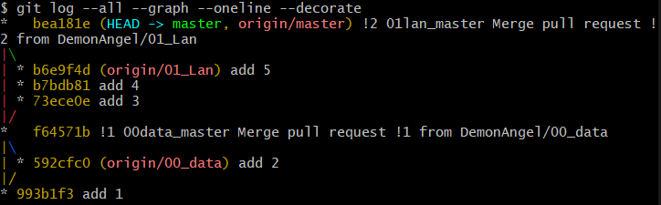

## 5.1 命令拆分

```bash
$ git log
```

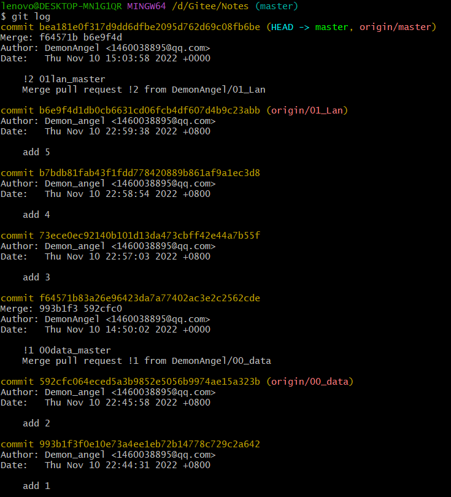

```bash
$ git log --oneline
```

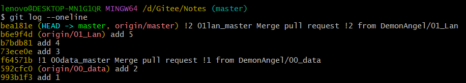

```bash
$ git log --graph
```

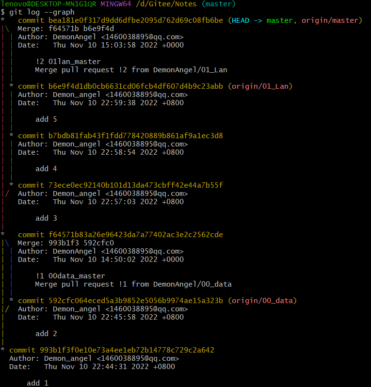

```bash
$ git log --decorate		# 与git log一致
$ git log --all			# 与git log一致
```

## 5.2 组合

```bash
$ git log --oneline --graph		# git log --oneline --graph --decorate --all 一致
```

# 6 git在本地添加一个文件夹gitee

```bash
$ mkdir 文件名						# 创建一个文件夹
$ cd 文件名						# 进入文件夹
$ touch file.txt					# 创建一个文本文件

$ git add .
$ git commit -m "information"		# 将文件夹和文件都提交到版本库中
$ git push origin master			# 将版本库中的内容上传到gitee中
```

# 7 git版本回退

```bash
$ git reflog						# 记录每一次命令
$ git log							# 查看commit_id，信息显示的较多
$ git log --pretty=oneline			# 查看commit_id，只显示commit_id和提交信息
$ git reset --hard HEAD^			# 回退到上一个版本
$ git reset --hard HEAD^^			# 回退到上上一个版本
$ git reset --hard HEAD~100			# 回退到往上100个版本
$ git reset --hard commit_id		# 回退到commit_id处
```

# 8 git rm和rm的区别

```tex
git rm用来删除文件，同时还会将这个删除操作记录下来
rm用来删除文件, 仅仅是删除了物理文件，没有将其从git的记录中剔除
直观的来说, git rm删除过的文件, 执行git commit -m "del file" 提交时, 会自动将删除该文件的操作提交上去;
而用rm命令直接删除的文件, 单纯执行git commit -m "del file" 提交时, 则不会将删除文件的操作提交上去, 需要在执行commit的时候,多加一个 -a 参数;
即rm删除后, 需要使用git commit -am "del file" 提交才会将删除文件的操作提交上去;
rm删除的文件是处于not staged状态的, 也就是一种介于“未改动”和“已提交过”之间的状态
```

```bash
# git中删除文件并提交上去的两种方法
# 第一种
$ git rm ReadMe.txt
$ git commit -m "del ReadMe"
$ git push gitee master
# 第二种
$ rm ReadMe.txt
$ git commit -am "del ReadMe"
$ git push origin master
```

# 9 新建gitee仓库

## 9.1 git全局设置

```bash
$ git config --global user.name "your.name"
$ git config --global user.email "email.com"
```

## 9.2 创建git仓库

```bash
$ mkdir repository.name
$ cd repository.name
$ git init
$ touch ReadMe.txt
$ git add ReadMe.txt
$ git commit -m "first commit"
$ git remote add origin repoistory.http
$ git push -u origin master
```

## 9.3 已有仓库

```bash
$ cd existing_git_repo
$ git remote add origin repoistory.http
$ git push -u origin master
```

# 10 git remote

```bash
$ git remote				# 查看远程库信息
$ git remote -v				# 查看远程库详细信息
```

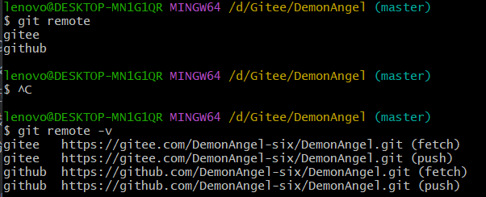

## 10.1 添加远程库

```bash
$ git remote add gitee https://gitee.com/DemonAngel-six/DemonAngel.git		# 添加远程库
```

## 10.2 删除远程库

```bash
$ git remote remove gitee		# 删除远程库
```

## 10.3 修改仓库对应的远程仓库地址

```bash
$ git remote set-url origin repository_address
```

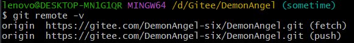

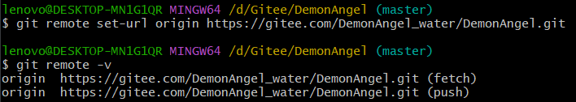

# 11 git分支管理

## 11.1 新建new_branch及切换到new_branch

### 11.1.1 方式1

```bash
$ git branch new_branch			# 新建一个new_branch分支
$ git switch new_branch			# 切换到new_branch分支
```

### 11.1.2 方式2

```bash
$ git branch new_branch		# 新建一个new_branch分支
$ git checkout new_branch			# 切换到new_branch分支
```

### 11.1.3 方式3

```bash
$ git switch -c new_branch		# 创建一个three分支并切换到new_branch分支
```

### 11.1.4 方式4

```bash
$ git checkout -b new_branch		# 创建一个four分支并切换到new_branch分支
```

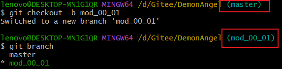

## 11.2 操作new_branch

```bash
# 这个一梭子操作执行多次
$ git add .
$ git commit -m "commit message"
$ git push origin new_branch
```

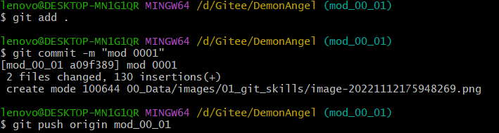

## 11.3 切换到master

### 11.3.1 方式1

```bash
$ git checkout master
```

### 11.3.2 方式2

```bash
$ git switch master
```

## 11.4 pull master

```bash
$ git pull origin master
```

## 11.5 切换到new_branch

```bash
$ git checkout new_branch
```

## 11.6 将new_branch合并到master上

```bash
$ git rebase master
```

## 11.7 强行push

```bash
$ git push -f origin new_branch
```

## 11.8 在gitee/github上合并分支并删除new_branch

### 11.8.1 gitee

#### 11.8.1.1 new pull request	


#### 11.8.1.2 选择要合并到master上的new_branch

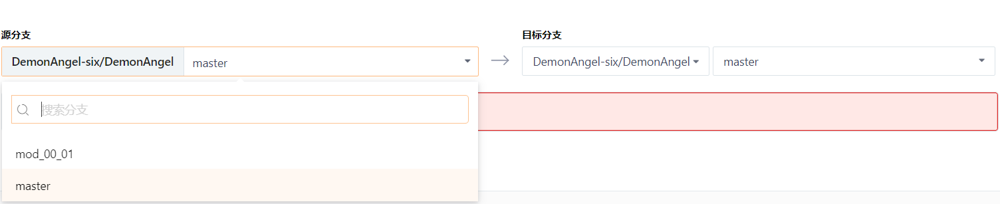

#### 11.8.1.3 填写标题并确认pull request

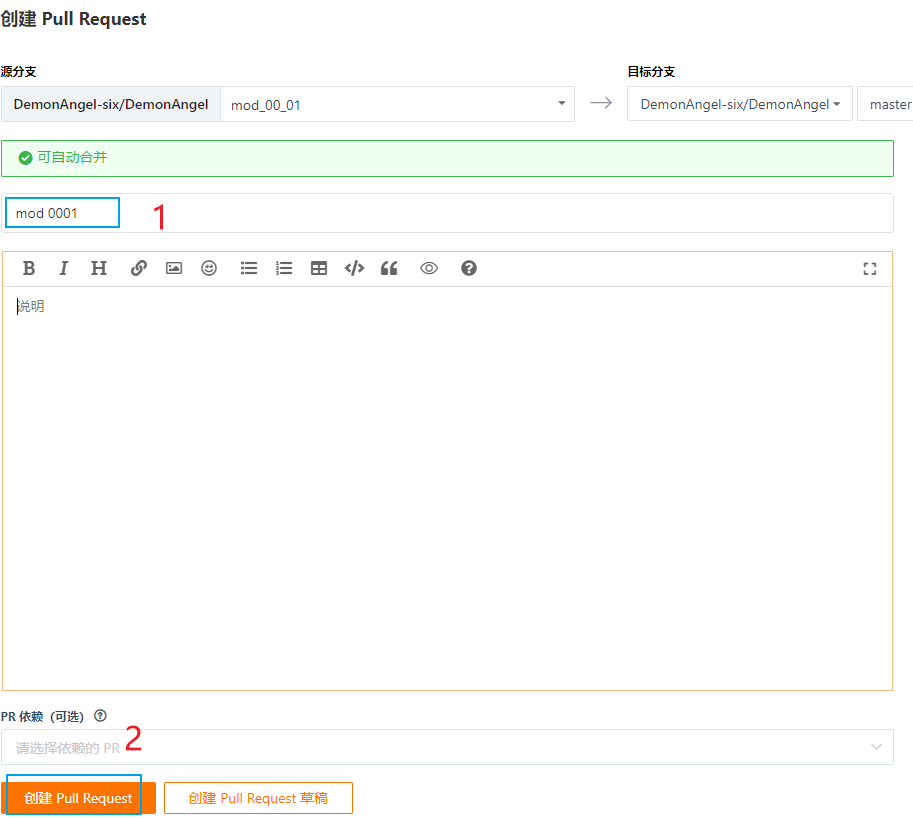

#### 11.8.1.4 审查通过 --> 测试通过

测试和通过是可以有仓库管理员指定的，由于是个人项目自己审查和测试

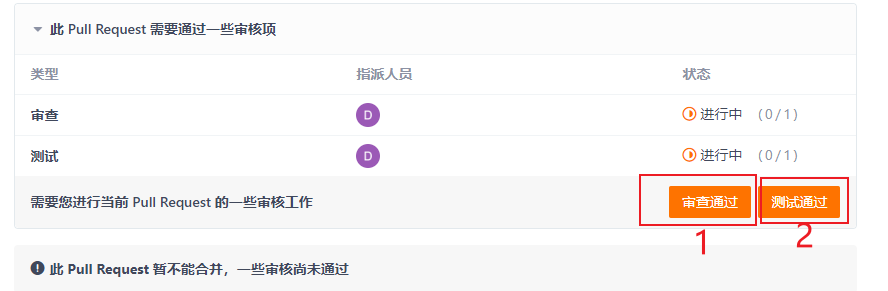

#### 11.8.1.5 合并

**注意合并分支、扁平化分支和变基并合并的区别**


#### 11.8.1.6 确定合并

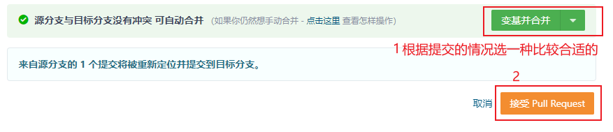

#### 11.8.1.7 删除new_branch

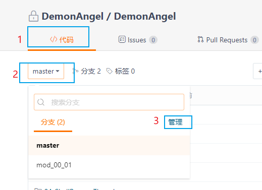

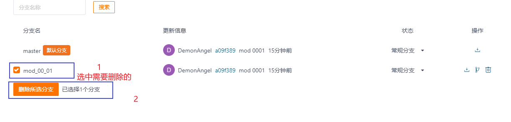

### 11.8.2 github

#### 11.8.2.1 new pull request

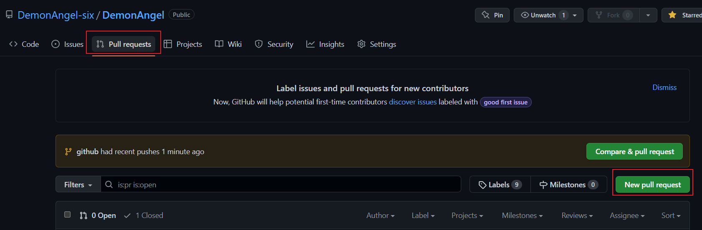

#### 11.8.2.2 选择要合并到master上的new_branch点击Create pull request

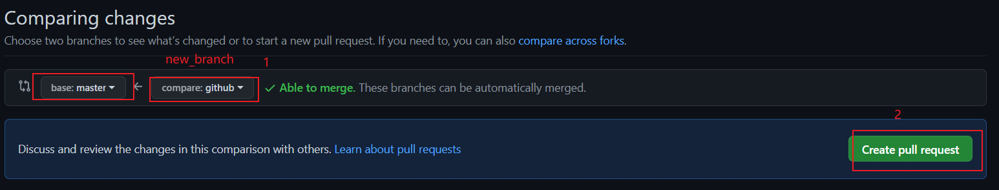

#### 11.8.2.3 填写标题并确认Create pull request

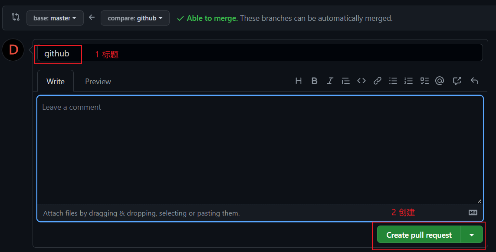

#### 11.8.2.4 选择合并方式并合并

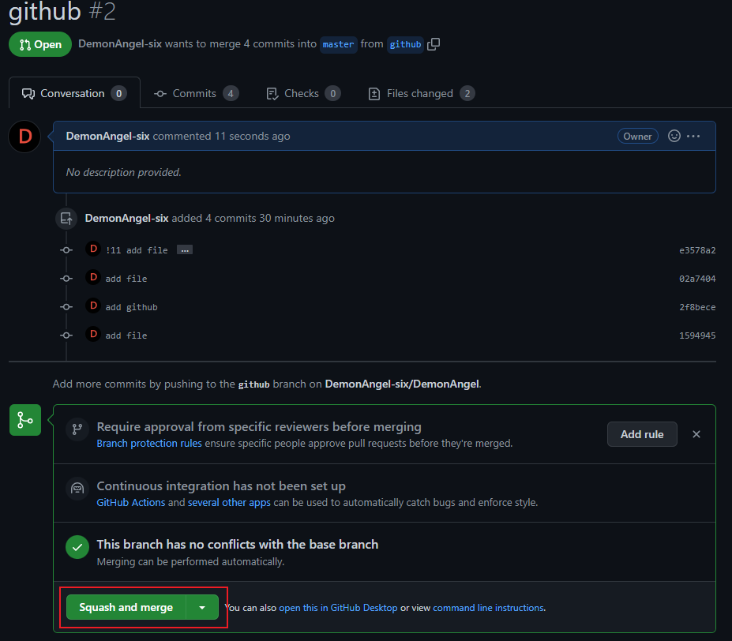

##### 11.8.2.4.1 合并方式


#### 11.8.2.5 填写信息并确认合并

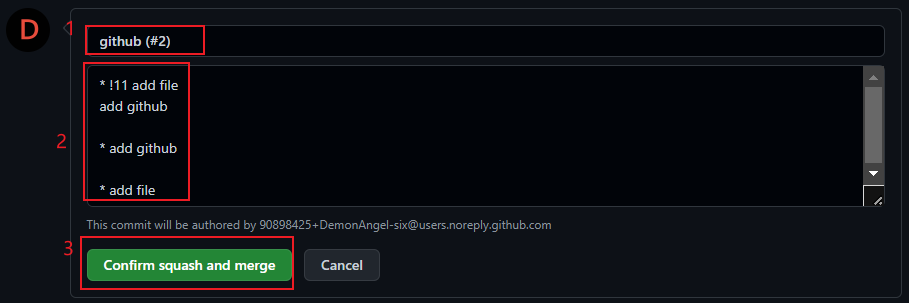

#### 11.8.2.6 删除new_branch

##### 11.8.2.6.1 方式1


##### 11.8.2.6.2 方式2

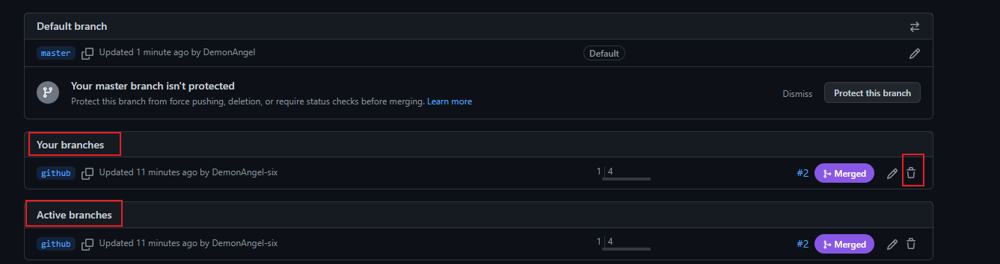

## 11.9 切换到master

```bash
$ git switch master
```

## 11.10 删除new_branch

```bash
$ git branch -D new_branch
```

## 11.11 pull master

```bash
$ git pull origin master
```

## 11.12 部分场景 

### 11.12.1 远程发生了改变

1. 新建new_branch及切换到new_branch
2. 操作new_branch
3. 切换到master
4. pull master
5. 切换到new_branch
6. 将new_branch合并到master
7. 强行push
8. 在gitee/github上合并分支并删除new_branch
9. 切换到master
10. 删除new_branch
11. pull master

### 11.12.2 远程没有发生改变

1. 新建new_branch及切换到new_branch
2. 操作new_branch
3. 将new_branch合并到master
4. 强行push
5. 在gitee或github上合并分支并删除new_branch
6. 切换到master
7. 删除new_branch
8. pull master
