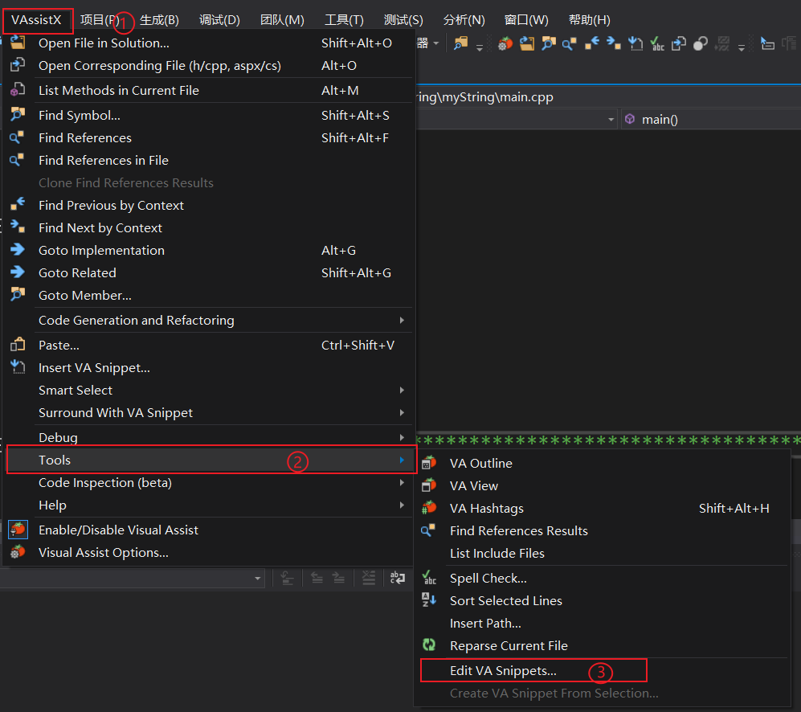
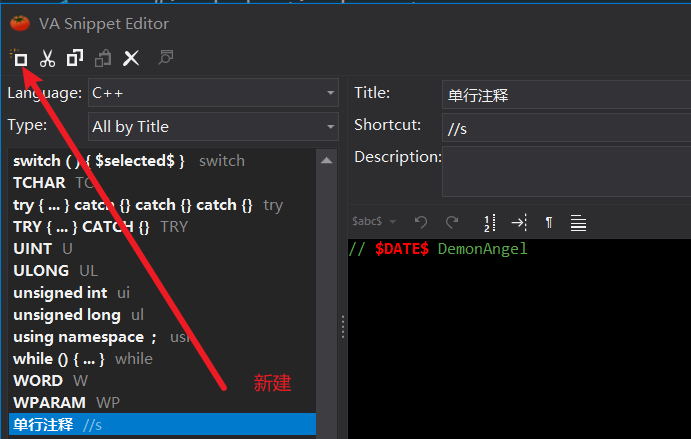
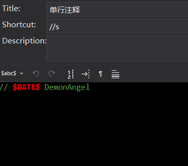
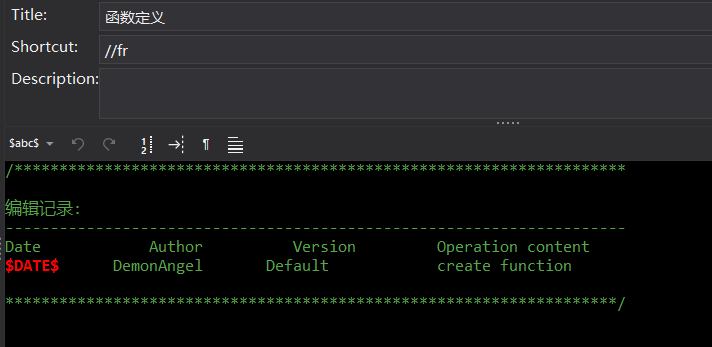
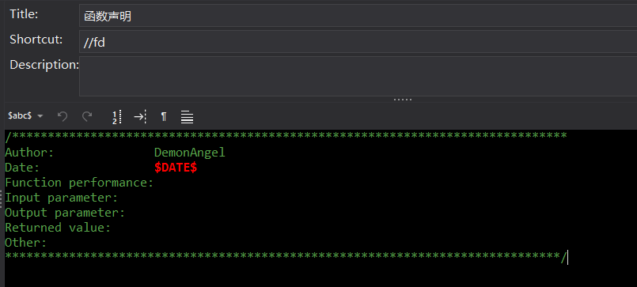
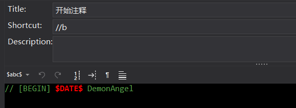
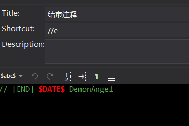
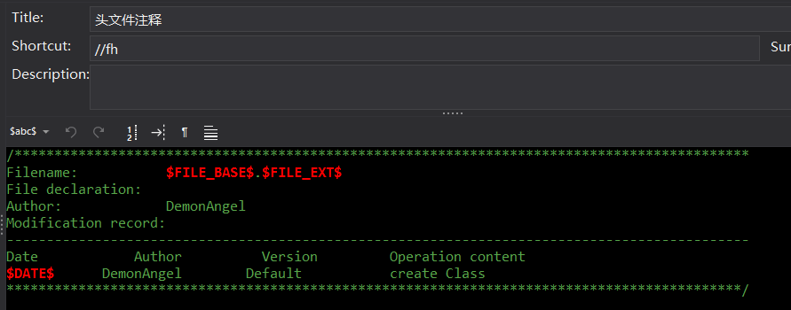

[toc]

# 1 打开设置界面



# 2 新建快捷键



# 3 单行注释



文本内容

```tex
// $DATE$ DemonAngel
```

# 4 函数定义



文本内容

```tex
/********************************************************************

编辑记录:
---------------------------------------------------------------------
Date			Author			Version			Operation content
$DATE$		DemonAngel		 Default			create function

********************************************************************/
```

# 5 函数声明



文本内容

```tex
/******************************************************************************
Author:				 DemonAngel
Date:				 $DATE$
Function performance:
Input parameter:	 
Output parameter:	 
Returned value:		 
Other:
******************************************************************************/
```

# 6 开始注释



文本内容

```tex
// [BEGIN] $DATE$ DemonAngel
```

# 7 结束注释



文本内容

```tex
// [END] $DATE$ DemonAngel
```

# 8 头文件注释



文本内容

```tex
/********************************************************************************************
Filename:		 	$FILE_BASE$.$FILE_EXT$
File declaration:	
Author:			 	DemonAngel
Modification record:
---------------------------------------------------------------------------------------------
Date			Author			Version			Operation content
$DATE$		DemonAngel		  Default			create Class
********************************************************************************************/
```

# 9 总结

```cpp
//s				单行注释
//fr			函数定义
//fd			函数声明
//b				开始注释
//e				结束注释
//fh			头文件注释
//bl			块注释
```

