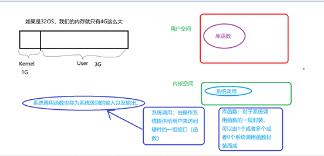

[toc]

# 页面跳转

[static](#static)

# 1 C语言基础

## 1.1 一个程序应当包含两部分内容

- 对数据的描述。在程序中要指定数据的类型和数据的组织形式，即数据结构。
- 对操作的描述，即操作步骤，也就是算法。

## 1.2 算法的基本概念

做任何事情都有一定的步骤，步骤要按照一定的顺序进行，缺一不可，次序也不能错，广义的说，为解决一个问题而采取的方法和步骤就称为算法。

## 1.3 如何编写C文件


1. 编辑
2. 编译
3. 调试
4. 编译(直到没有错误)
5. 运行

### 1.3.1 注意

如果程序报错error:对应此时没有生成可执行文件

如果报警告warning:此时会生成一个可执行文件

警告warning有时可以忽略不看.

## 1.4 C库

库：一系列输入输出相关的函数

C：按照C语言标准定义的

C库：按照C语言标准定义的一系列用来输入输出相关的函数

# 2 计算机的基本结构


## 2.1 输入输出设备

键盘，鼠标，显示屏，打印机.....

## 2.2 CPU处理器

核心的模块

### 2.2.1 算术逻辑运算符

所有的运算最终都会被转换成算术运算或者逻辑运算

### 2.2.2 控制器

从内存中的读取指令并且解析指令

### 2.2.3 注意

CPU直接交互的对象是内存，不是外存。

## 2.3 存储器

### 2.3.1 内存

主存储器，容量较小，掉电会丢失数据，适合存储一些正在运行的程序。

### 2.3.2 外存

外存储器，容量较大，掉电不会丢失数据，适合存储一些不着急使用的程序或者数据

### 2.3.3 寄存器

存储于CPU内存，容量较小，运行效率是最高的

## 2.4 程序

### 2.4.1 从广义上

干某些事情的步骤（顺序）

### 2.4.2 从计算机角度

一组能够被计算机直接识别的操作（一堆指令）

### 2.4.3 test.c和a.out哪一个是程序

a.out是程序：一组能够被计算机直接识别的操作

test.c是源文件

### 2.4.4 PC机如何执行可执行文件a.out

从键盘输入a.out，之后跟外存（程序存储的地方）进行交互，之后外存和内存进行交互(从外存拷贝一份可执行程序a.out到内存)，之后内存和CPU交互，之后CPU跟算术运算器和控制器搭配工作将文件的结果输出到终端或者屏幕上。


# 3 关于内存那点事

存储器：存储数据器件

## 3.1 外存

外存又叫外部存储器，长期存放数据，掉电不丢失数据

常见的外存设备：硬盘、flash、rom、u盘、光盘、磁带

## 3.2 内存

[在运行程序的时候，操作系统会将虚拟内存分区](#内存)

内存以字节为单位来存储数据的，咱们可以将程序中的虚拟寻址空间，看成一个很大的一维的字符数组。

本章所接触的内容，涉及到的内存都是虚拟内存，更准确来说是虚拟内存的用户空间。

# 4 原码、反码、补码

## 4.1 原码

### 4.1.1 正数

```
25的原码
00011001
```

### 4.1.2 负数

```
-25的原码
10011001
```

## 4.2 反码

### 4.2.1 正数

```
25的反码
00011001
```

### 4.2.2 负数

```
-25的反码
11100110
```

## 4.3 补码

### 4.3.1 正数

```
25的补码
00011001
```

### 4.3.2 负数

```
-25的补码
11100111
```

## 4.4 总结

1. 第一个是符号位，其余位表示值，1表示负数，0表示正数
2. 正数的原码、反码、补码是一样的
3. 负数的原码是符号位1加上真值的绝对值，比如`-25`的符号位是1,真值是00011001，加上符号位`-25`的原码就是`10011001`
4. 负数的反码就是在其原码的基础上，符号位不变，其余各个位取反
5. 负数的补码是在其原码的基础上，符号位不变，其余各位取反，最后+1

==**-128的补码为10000000**==

==**-1的补码为11111111**==

# 5 关键字

关键字是C语言已经定义好的名字，直接可以拿过来使用，不需要再次定义。32个关键字。

## 5.1 数据类型相关的关键字

用于定义变量或者类型

定义变量的语法结构：

`类型 变量名;`

​	拓展：变量名属于标识符，标识符（变量名、函数名、重命名和取别名）有命名规则。

### 5.1.1 标识符的命名规则

1. 标识符只能以数字、字母和下划线命名

2. 首字母不能是数字

3. 不能与关键字相同

```
char、short、int、long、float、double、struct、union、enum、signed、unsigned、void
```

1. char字符型，用char定义的变量是字符型变量，占一个字节

   有符号：-2^7 ~ 2^7-1

   无符号：0 ~ 2^8-1

2. short短整型，使用short定义的变量是短整型变量，占两个字节

   有符号：-2^15 ~ 2^15-1

   无符号：0 ~ 2^16-1

3. int整型，用int定义的变量是整型变量，在32位以上的系统下占4个字节

   有符号：-2^31 ~ 2^31-1

   无符号：0 ~ 2^32-1

4. long长整型 用long定义的变量是长整型的，在32位系统下占4个字节，在64位系统下占8个字节

5. float单浮点型（实数），用float定义的变量是单浮点型的实数，占4个字节

6. double双浮点型（实数），用double定义的变量是双精度浮点型的实数，占8个字节

7. struct这个关键字是与结构体类型相关的关键字，可以用来定义结构体类型

8. union这个关键字是与共用体（联合体）相关的关键字

9. enum与枚举类型相关的关键字

10. signed符号（正负）的意思

    在定义char、整型（short、int、long）数据的时候用signed修饰，代表咱们定义的数据是有符号的，可以保存正数，也可以保存负数。		

    注意：默认情况下signed可以省略，既int a = -10; //默认a就是有符号类型的数据

11. unsigned无符号的意思

    在定义char、整型（short、int、long）数据的时候用unsigned修饰，代表咱们定义数据是无符号类型的数据。

    无符号类型的变量只能保存正数和0。

12. void 空类型的关键字

    char、int 、float 都可以定义变量

    ==**void不能定义变量，没有void类型的变量**==

    void是用来修饰函数的参数或者返回值，代表函数没有参数或没有返回值 

## 5.2 存储相关的关键字

<a name="变量"></a>

```
register、static、const、auto、extern
```

1. register是寄存器的意思，用register修饰的变量是寄存器变量，

   即：在编译的时候告诉编译器这个变量是寄存器变量，==尽量==将其存储空间分配在寄存器中。

   注意：

   - 定义的变量不一定真的存放在寄存器中
   - cpu取数据的时候去寄存器中拿数据比去内存中拿数据要快
   - 因为寄存器比较宝贵，所以不能定义寄存器数组
   - register只能修饰 字符型及整型的，不能修饰浮点型
   - 因为register修饰的变量可能存放在寄存器中不存放在内存中，所以不能对寄存器变量取地址。因为只有存放在内存中的数据才有地址
   - 存储在寄存器中，只能修饰局部变量，一般不写（因为系统被优化过了，会自动识别一些可能会被频繁使用的变量，会优先考虑将其放在寄存器中，如果放不下，则存入栈区）

2. static是静态的意思

   static可以修饰全局变量、局部变量、函数

   使用static修饰的变量，此变量保存在内存的静态区空间中

   注意：

   ​		被static修饰的变量称为静态变量，存储在静态区，可以修饰局部变量，全局变量或者函数，**==不能被省略==**

3. [const](./07_字符串处理函数.md)是常量的意思

   用const修饰的变量是只读的，不能修改它的值

   ```c
   const int a = 101; //在定义a的时候用const修饰，并赋初值为101从此以后，就不能再给a赋值了
   // 常量化，本质还是变量
   a = 111; //错误的
   ```

   const可以修饰指针

4. auto

   auto int a和int a是等价的，auto关键字现在基本不用，被auto修饰的变量称为自动变量，存储在栈区，只能修饰局部变量。

5. extern

   是外部的意思，一般用户函数和全局变量的声明。==**是在链接阶段起作用**==

## 5.3 控制语句相关的关键字

```
if、else、break、continue、for、while、do、switch、case、goto、default
```

- 条件控制语句：

  if语句：if  else

  switch语句：switch  case  default

- 循环控制语句：

  for

  while

  do-while

  goto

- 辅助控制语句：

  break

  continue

## 5.4 其他关键字

```
sizeof、typedef、volatile、return
```

1. sizeof

   使用来测变量、数组的占用存储空间的大小（字节数）

   不是一个函数，是一个运算符

2. typedef 重命名相关的关键字

   关键字，作用是给一个已有的类型。重新起一个类型名，并没有创造一个新的类型

   typedef定义方法

   (1)用想起名的类型定义一个变量

   ```c
   short int a;
   ```

   (2)用新的类型名代替变量名

   ```c
   short int INT16;
   ```

   (3)在最前面加typedef

   ```C
   typedef short int INT16;
   ```

   (4)就可以用新的类型名定义变量了

   ```c
   INT16 b;
   short int b;
   //这两个是一个效果
   ```

3. volatile易改变的意思

   用volatile定义的变量，是易改变的，即告诉cpu每次用volatile变量的时候，重新去内存中取，保证用的是最新的值，而不是寄存器中的备份。==**在编译阶段起作用。**==

   volatile关键字现在比较少用。

   以下几种情况会用到：

   ```
   并行设备的硬件寄存器(如：状态寄存器)
   一个中断服务子程序中会访问到的非自动变量
   多线程应用中被几个任务共享的变量
   ```

4. return返回值

# 6 数据类型

数据类型的意义是为了将内存最大利用化。

## 6.1 基本类型

### 6.1.1 bool类型

| 类型名称 | 长度（字节） | 值域                      |
| :------- | :----------- | :------------------------ |
| bool     | 1            | 非零（true）、零（false） |

```c
//头文件
#include <stdio.h>
#include <stdbool.h>

int main(int argc, char *argv[])
{
	//<stdbool.h>头文件中的宏定义
	_Bool a;
	a = true;
	a = false;
	if (a) 
	{
	   printf("true %d\n",a);
	}
	else 
	{
	   printf("false %d\n",a);
	}
	return 0;
}
// 执行结果：false 0
```

### 6.1.2 整型

| 类型名称          | 长度（字节） | 值域                     |
| :---------------- | :----------- | :----------------------- |
| short int         | 2            | -32768 ~ 32767           |
| unsigned short    | 2            | 0 ~65535                 |
| int               | 4            | -2147483648 ~ 2147483647 |
| unsigned int      | 4            | 0 ~ 4294967295           |
| long int          | 4            | -2147483648 ~ 2147483647 |
| unsigned long int | 4            | 0 ~ 4294967295           |

**看值域的边界值**

```c
#include <stdio.h>
#include <limits.h>

int main(int argc, const char *argv[])
{
	printf("%d %d %d %d\n",sizeof(_Bool),sizeof(char),sizeof(short),sizeof(int));
	printf("char:%d - %d\n",SCHAR_MIN,SCHAR_MAX);
	printf("short:%d - %d\n",SHRT_MIN,SHRT_MAX);
	printf("int:%d - %d\n",INT_MIN,INT_MAX);
	return 0;
}
```

执行结果


### 6.1.3 字符型

| 类型名称      | 长度（字节） | 值域                                  |
| :------------ | :----------- | :------------------------------------ |
| char          | 1            | -128 ~ 127或0 ~ 255（使用/J编译选项） |
| singed char   | 1            | -128 ~ 127                            |
| unsigned char | 1            | 0 ~ 255                               |

### 6.1.4 实型

| 类型名称    | 长度（字节） | 值域                            |
| ----------- | :----------- | :------------------------------ |
| float       | 4            | -3.4`*`10^-38^  ~ 3.4`*`10^38^  |
| double      | 8            | -1.7`*`10^-308^ ~ 1.7`*`10^308^ |
| long double | 8            | -1.2`*`10^-308^ ~ 1.2`*`10^308^ |

```c
#include <stdio.h>

// 基本数据类型的学习和使用
// char short int long float double
int main(int argc, char *argv[])
{
    // 定义一个char类型的变量并赋值，输出字符使用%c
    char a = 'w';
    printf("a = %c\n",a);

    // 定义一个short类型的变量并赋值
    short b = 100;
    printf("b = %d\n",b);

    // 定义一个int类型的变量并赋值，输出int类型变量的值使用%d
    int c = 9999;
    printf("c = %d\n",c);

    // 定义一个long类型的变量并赋值，输出long类型变量的值使用%ld
    long d = 34536453;
    printf("d = %ld\n",d);

    // 定义一个float类型的变量并赋值，输出float类型变量的值使用%f
    // 默认保留小数点后六位，并且可以四舍五入
    float e = 3.1415926;
    printf("e = %f\n",e);

    // 定义一个double类型的变量并赋值，输出double类型变量的值使用%ld
    // 默认保留小数点后六位，并且可以四舍五入
    double f =3452.1234567890;
    printf("f = %lf\n",f);

    return 0;
}
```

执行结果：


## 6.2 构造类型

概念：由若干个相同或不同类型数据构成的集合，这种类型被称为构造类型

ex: int a[10];

```
数组array、结构体struct、共用体union、枚举enum
```

## 6.3 [指针类型](.//05_指针.md)

## 6.4 空类型

void

# 7 常量和变量

## 7.1 常量

常量：在程序运行过程中，其值不可以改变的量

例：100 	'a'     "hello"

### 7.1.1 常量的分类

整型	100，125，-100，0，89UL(无符号长整型)

实型	3.14，0.125f，-3.789

字符型	'a'，'b'，'2'。转义字符（一般由一个反斜杠和另外一个字母组成的）

字符串	"a"，"ab"，"1234"

标识常量	#define  <标识常量名称> <常量>

==**宏只是一种替换（预处理），建议书写的时候，将宏中的每一个变量以及表达式整体都加上括号，此时，该宏就是一个非常安全的宏。**==

### 7.1.2 字符大小写的转换

```c
字符 'A' 的ASCII为65;
字符 'a' 的ASCII为97;
```

```c
'a' = 'A' + ' ';
// a等于A加空格
// 因为空格的ASCII的值为32
// 字符0和数字0相差48
```

ACCII码表：对于计算机而言，只能识别二进制书，也就是数字，对于非数值型数据，如果要使用，就需要将其用一个数值型数据进行标识，就称之为ASCII码表。


```c
#include <stdio.h>

int main(int argc, char *argv[])
{
    // 注意在使用字符类型的数据时，如果用%c输出就是输出字符，如果用%d就是输出字符的ascii的值
    char ch1='w';
    printf("ch1 = %c %d\n",ch1,ch1);
    char ch2=97;
    printf("ch2 = %c %d\n",ch2,ch2);
    return 0;
}
```

执行结果：


```c
#include <stdio.h>

#define C 3.0e-23
#define W 950

int main(int argc, const char *argv[])
{
	float n,total;
	printf("please input\n");
	scanf("%f",&n);
	total = n * C / W;
	printf("%e\n",total);
	return 0;
}
```

执行结果


## 7.2 变量

变量：其值可以改变的量被称为变量

### 7.2.1 定义变量的方式

[存储类型:auto、register、static、extern](#变量)

`存储类型 数据类型 变量名;`

存储类型：决定了开辟空间的位置

数据类型：决定了开辟空间的大小

变量名：标识定义的一片空间的名字，建议见名知意

```tex
存储类型 数据类型 变量名 = 变量或者常量;
```

### 7.2.2 变量在定义的是时候要满足标识符的命名规则

1. 只能由字母、数字和下划线组成

2. 首字母不能是数字

3. 不能关键字相同

### 7.2.3 整型数据

#### 7.2.3.1 整型常量

按进制分：

十进制：以正常数字1-9开头，如457	789

八进制：以数字0开头，如0123

十六进制：以0x开头，如0x1e

#### 7.2.3.2 整型变量

有/无符号短整型(un/signed) short(int)	2个字节

有/无符号基本整型(un/signed) int	4个字节

有/无符号基本整型(un/signed) long(int)	4个字节(32位处理器)

### 7.2.4 实型数据(浮点型)

#### 7.2.4.1 实型常量

实型常量也称为实数或者浮点数

十进制形式：由数字和小数点组成：0.0、0.12、5.0

指数形式：
$$
123e3代表123\times10^3\newline
123e-3代表123\times10^{-3}
$$
不以f结尾的常量是double类型

以f结尾的常量（如3.14f）是float类型

#### 7.2.4.2 实型变量

单精度（float）和双精度（double）3.1415926753456

float型：占4字节，7位有效数字，指数-37`~`38

double型：占8字节，16位有效数字，指数-307`~`308

### 7.2.5 字符数据

#### 7.2.5.1 字符常量

直接常量：用单引号括起来，如：'q'、'w'、'0'等

==**转义字符**==：以反斜杠"\\"开头后面跟一个或几个字符，如'\n'、'\t'等，分别代表换行、横向跳格。

#### 7.2.5.2 字符变量

用char定义，每个字符变量被分配一个字节的内存空间

字符值以ASCII码的形式存放在变量的内存单元中；

注：

```c
char a;
a = 'x';
/* a变量中存放的是字符'x'的ASCII：120 */
/* 即a = 120;跟a = 'x';在本质上是一致的 */
```

### 7.2.6 字符串常量

是由双引号括起来的字符序列，如"CHINA"、"哈哈哈"、"C program"、"$12.5"等都是合法的字符串常量。

### 7.2.7 字符串常量与字符常量的不同

1. 'a'为字符常量，"a"为字符串常量

2. 每个字符串的结尾，编译器会自动的添加一个结束标志位'\0'，即"a"包含两个字符'a'和'\0'。


### 7.2.8 变量的定义和声明的不同

1. 变量在使用前就要被定义或者声明；
2. 在一个程序中，变量只能定义一次，却可以声明多次；
3. 定义分配存储空间，而声明不会。

#### 7.2.8.1 扩展资料

##### 7.2.8.1.1 变量的定义

用于为变量分配存储空间，还可以为变量指定初始值。在程序中，变量有且仅有一个定义。

##### 7.2.8.1.2 声明

用于向程序表明变量的类型和名字

##### 7.2.8.1.3 定义也是声明

1. 当定义变量的时候我们声明了它的类型和名字。可以通过extern声明变量名而不定义它。不定义变量的声明包括对象名，对象类型和对象类型前的关键字extern。

2. extern声明不是定义，也不分配存储空间，事实上它只是说明变量定义在程序的其他地方。程序中变量可以声明多次，但只能定义一次。

3. 只有当声明也是定义的时，声明才可以有初始化式，因为只有定义才分配存储空间。初始化式必须要有存储空间来进行初始化。如果声明有初始化式，那么它可被当作是定义，即使声明标记为extern。

   ```c
   extern int number = 100;   // 属于定义
   ```

4. 任何在多文件中使用的变量都需要有与定义分离的声明。在这种情况下，一个文件含有变量的定义，使用该变量的其他文件则包含该变量的声明(而不是定义)。

## 7.3 变量的存储类别

### 7.3.1 内存的分区

#### 7.3.1.1 内存

内存：物理内存，虚拟内存

物理内存：实实在在存在的存储设备

虚拟内存：操作系统虚拟出来的内存，当一个进程被创建的时候，或者程序运行的时候都会分配虚拟内存，虚拟内存和物理内存之间存在映射关系。

操作系统会在物理内存和虚拟内存之间做映射

在32位系统下，每个进程(运行着的程序)的寻址范围是4G，0x00 00 00 00 ~ 0xff ff ff ff

在写应用程序的，咱们看到的都是虚拟内存

在32位操作系统中，虚拟内存被分为两个部分，3G的用户空间和1G的内核空间，其中用户空间是当前进程所私有的；内核空间，是一个系统中所有的进程所共有的



#### 7.3.1.2 内存四区

<a name="内存"></a>

在运行程序的时候，操作系统会将虚拟内存分区。

1. 堆

   在动态申请内存的时候，在堆里开辟内存。**完全由程序员手动管理的一片区域。**

   管理（申请空间（malloc）、释放空间（free））：借助于函数完成

2. 栈

   主要存放局部变量\形参（在函数内部，或复合语句内部定义的变量），**由操作系统自动管理的一片空间**

   注意：栈区开辟的空间会随着当前代码段的结束而释放空间

3. 静态全局区

     - ==未初始化==的静态全局区

       静态变量（定义变量的时候，前面加static修饰），或全局变量

       没有初始化的，存在此区

     - ==初始化==的静态全局区

       全局变量、静态变量，赋过初值的，存放在此区

       注意：静态区的空间不会随着当前代码段的结束而释放空间

4. 代码区

   存放用户的程序代码

5. 文字常量区

   存放常量的


### 7.3.2 普通的全局变量

#### 7.3.2.1 概念

在函数外部定义的变量

```c
int num = 100;	// num就是一个全局变量
int main()
{
   return 0;
}
```

#### 7.3.2.2 作用范围

全局变量的作用范围，是程序的==所有地方==

只不过用之前需要声明。声明方法extern int num;

注意声明的时候，一般不进行赋值

#### 7.3.3.3 生命周期

程序运行的整个过程，一直存在，直到程序结束

==**注意：定义普通的全局变量的时候，如果不赋初值，它的值默认为0**==

```c
#include <stdio.h>

// 定义一个普通全局变量
// 只要在main函数外（也在子函数外）的变量，就是全局变量
// 如果全局变量没有进行初始化，则系统自动将其初始化为0
int num;

// 全局变量可以在程序的任意一个位置进行对其的操作
void function()
{
    num = 888;
}
int main(int argc, char *argv[])
{
    printf("num = %d\n",num);
    function();
    printf("num = %d\n",num);
    return 0;
}
```

执行结果：


### 7.3.3 静态全局变量

#### 7.3.3.1 概念

定义全局变量的时候，前面使用static来修饰

```c
static int num = 100;		// num就是一个静态全局变量
int main()
{
   return 0;
}
```

#### 7.3.3.2 作用范围

static限定了静态全局变量的作用范围

只在它定义的.c（源文件）中有效

#### 7.3.3.3 生命周期

在程序的整个运行过程中，一直存在。

==**注意：定义静态全局变量的时候，如果不赋初值，它的默认值是0**==

```c
#include <stdio.h>

// 定义一个静态全局变量
// 静态全局变量只能在其定义的.c文件中任意位置使用，不能跨文件使用
static int num;
void function()
{
    num++;
}

int main(int argc, char *argv[])
{
    printf("num = %d\n",num);
    function();
    printf("num = %d\n",num);
    return 0;
}
```

执行结果：


### 7.3.4 普通的局部变量

#### 7.3.4.1 概念

在函数内部定义的，或者复合语句中定义的变量

```c
int main()
{
   int num;	// 局部变量
   {
      int a;	// 局部变量
   }
}
```

#### 7.3.4.2 作用范围

在函数定义的变量，在函数中有效

在复合语句中定义的，在复合语句中有效

#### 7.3.4.3 生命周期

在函数调用之前，局部变量不占用空间，调用函数的时候，才为局部变量开辟空间，==函数结束了，局部变量就释放了==。在复合函数中的定义亦如此。

```c
#include <stdio.h>

// 定义一个局部变量
// 在函数内部定义的，不加任何修饰的变量都是局部变量

void function()
{
    int num = 100;
    num++;
    printf("num = %d\n",num);
    return ;
}

int main(int argc, char *argv[])
{
    // 局部变量只能在定义的函数的内部使用，生命周期相对较短，函数结束，局部变量就会释放掉。
    // 故printf("num = %d\n",num);运行会出错，
    // 原因就是局部变量的的作用范围只在函数内部或者复合语句内部有用，在主函数中没有定义
    //printf("num = %d\n",num);

    // 三次调用函数输出的结果是一样的
    // 还是作用范围，当function函数执行完毕后，
    // 局部变量就释放掉了，所以再次调用函数function还是会对num进行初始化（开辟空间）
    function();
    function();
    function();
    return 0;
}
```

执行结果：


### 7.3.5 静态的局部变量

#### 7.3.5.1 概念

定义局部变量的时候，前面加static修饰

#### 7.3.5.2 作用范围

在它定义的函数或复合语句中有效。

#### 7.3.5.3 生命周期

第一次调用函数的时候，开辟空间赋值，函数结束后，==不释放==，以后在调用函数的时候，就不再为其开辟空间，也不赋初值，用的就是以前的那个变量。

```c
#include <stdio.h>

// 定义一个静态局部变量
// 在函数内部定义的，不加任何修饰的变量就是静态局部变量

void function()
{
    // 如果普通局部变量不进行初始化，则默认值是随机值
    // 如果静态局部变量不进行初始化，则默认值是0;
    int a;  // 普通局部变量
    static int num; // 静态局部变量

    printf("a = %d\n",a);
    printf("num = %d\n",num);
    return ;
}

void function1()
{
    // 静态局部变量不会随着当前函数执行结束而释放空间，下次使用的函数之前的空间
    // 静态局部变量只会初始化一次
    static int num1 = 100;
    num1++;
    printf("num1 = %d\n",num1);
}

int main(int argc, char *argv[])
{
    // 调用function函数
    function();

    // 调用function1函数
    // 由于静态局部变量只会初始化一次，所以它的值会累加。重复调用不会重新开辟空间。
    function1();
    function1();
    function1();
    return 0;
}
```

执行结果：


### 7.3.6 总结

<a name = "static" ></a>

1. 定义==普通局部变量==，如果不赋初值，它的值是随机的。

   定义==静态局部变量==，如果不赋初值，它的值是0

2. ==普通全局变量==，和==静态全局变量==如果不赋初值，它的值为0

3. 被static修饰的局部变量：

   ​		生命周期：从定义开始，到整个程序截至（被延长）

   ​		作用域：模块括号内有效

4. 被static修饰的全局变量：

   ​		生命周期：从定义开始，到整个源程序截至

   ​		作用域：服务于本文件（被缩短）

## 7.4 数值溢出问题

### 7.4.1 解决方案

#### 7.4.1.1 方式1

1. 先将该数据不管是正数还是负数，写出其在内存中的存储方式
2. 根据==**隐式类型转换图解**==，进行补全码数
3. 根据占位符得出是以有符号数还是无符号数进行打印
4. 如果说占位符是有符号数的形式打印，那么需要根据该输出列表中的变量取出相对应的位数之后，看其最高位是0还是1，是0则代表正数，此时就不需要进行求源码，直接得出源码对应得数字，否则需要根据补码的补码是原码得出其原码进而得出该数字。
5. 如果说占位符是无符号数的形式打印，那么需要根据该输出列表中的变量取出相对应的位数之后，直接得出其原码进而得出数字

#### 7.4.1.2 方式2

利用环回的思想

```c
#include <stdio.h>
int main()
{
    // 默认是有符号型的数据signed
    // char是8个字节的
    // 130的二进制是1000 0010
    char chr1 = 130;
    /* 输出的占位符是%d且是有符号的整型的，
     * 故内存中的chr现在是
     * 0000 0000 0000 0000 0000 0000 1000 0010
     * 因为输出的占位符是%d是有符号，而chr是字符类型的，占8个字节
     * 故需要读取最后的8位，有符号型的就要判断符号位，
     * 符号位是1，故是负数，且内存中是数据的补码，
     * 根据补码的补码是原码的规则，1000 0010的原码为1111 1110
     * 有符号位就是-126
     */
    // 输出结果为-126
    printf("%d\n",chr1);

    char chr2 = -130;
    /*
     * 130的二进制码为
     * 1000 0010
     * 输出的占位符是%d且是有符号的整型的，
     * 故内存中的chr2现在是
     * 1000 0000 0000 0000 0000 0000 1000 0010
     * 它的补码为
     * 1111 1111 1111 1111 1111 1111 0111 1110
     * 因为输出的占位符是%d是有符号，而chr2是字符类型的，占8个字节
     * 故需要读取最后的8位，有符号型的就要判断符号位，
     * 符号位是0，故是正数，也就是后8位
     * 0111 1110
     */
    // 输出结果为126
    printf("%d\n",chr2);


    unsigned char chr3 = 260;
    /*
     * 260的二进制为
     * 0001 0000 0100
     * 输出的占位符是%d且是有符号的整型的，
     * 故内存中的chr3现在是
     * 0000 0000 0000 0000 0000 0001 0000 0100
     * 它的补码为
     * 0000 0000 0000 0000 0000 0001 0000 0100
     * 因为输出的占位符是%d是有符号，而chr2是字符类型的，占8个字节
     * 故需要读取最后的8位，有符号型的就要判断符号位，
     * 符号位是0，故是正数，也就是后8位
     * 0000 0100
     */

    // 输出结果为4
    printf("%d\n",chr3);
    return 0;
}
```

执行结果：


## 7.5 类型转换

数据由不同的类型，不同的类型数据之间进行混合运算是必然涉及到类型的转换问题。

### 7.5.1 转换的方法有两种

1. 自动转换

   遵循一定的规则，由编译系统自动完成

2. 强制类型转换

   把表达式的运算结果强制转换成所需的数据类型

### 7.5.2 自动转换

#### 7.5.2.1 自动转换的原则

1. 占用内存字节少（值域小）的类型，向占用内存字节数多（值域大）的类型转换，以保证精度不降低。

2. 转换方向：

   ==**隐式类型转换图**==

   

#### 7.5.2.2 注意

图解中共有两条横线，一条纵线。

对于横线：不管有没有参与算术混合运算，会默认转换。

对于纵线：只有参与算术混合运算的时候才会进行转换。

```c
#include <stdio.h>
int main(int argc, const char *argv[])
{
  //	int a = -8;
  //	unsigned int b = 4;
  //	if(a + b > 0)
  //	{
  //		printf("向unsigned靠拢了！\n");
  //	}
  //	else
  //	{
  //		printf("向signed靠拢了！\n");
  //	}
  //	输出结果为：
  //		向unsigned靠拢了！
  char  a = -8;
  unsigned char b = 4;
  if(a + b > 0)
  {
      printf("向unsigned靠拢了！\n");
  }
  else
  {
      printf("向signed靠拢了！\n");
  }
  //输出结果为：
  //	向signed靠拢了！
  return 0;
}
```

### 7.5.3 强制转换

通过类型转换运算来实现

`(类型说明符) (表达式)`

#### 7.5.3.1 功能

把表达式的运算结果强制转换成类型说明符所表示的类型

例如：

```c
(float)a; // 把a的值转换成实型

(int)(x+y); // 把x+y的结果值转换为整型
```

类型说明符必须加括号,强转之后的变量的类型是不会发生改变，原来是什么类型，现在还是什么类型

```c
#include <stdio.h>

int main(int argc, char *argv[])
{
    // ****强制类型转换之自动转换****
    // 参加运算的成员全部变成int类型的参加运算，结果也是int类型的
    printf("%d\n",5/2);

    // 当表达式中出现了带小数的实数，参加运算的成员全部double类型参加运算，结果也是double型
    printf("%lf\n",5.0/2);

    // 当表达式中有有符号数，也有无符号数，参加运算的成员变成无符号数参加运算结果也是无符号数（表达式中无实数）
    int a = -8;
    unsigned int b = 7;
    if(a+b>0)
    {
        printf("a+b>0\n");
    }
    else
    {
        printf("a+b<=0\n");
    }

    // 在赋值语句中等号右边的类型自动转换为等号左边的类型
    int m;
    float n = 5.8f; // 5.8后面加f代表5.8是float类型，不加的话，认为是double类型
    m = n;
    printf("m = %d\n",m);
    printf("n = %f\n",n); // 注意自动类型转换都是在运算的过程中进行临时性的转并不会影响自动类型转换的变量的值和其类型

    // ****强制类型转换之强制转换****
    int x = 10;
    int y = 4;
    float w;
    w = (float)x/(float)y;
    printf("w = %f\n",w);

    return 0;
}
```

执行结果：


# 8 float、bool、int、指针与0值的比较

```c
// float var 与"零值"比较的if语句
const float epsinon = 0.00001;
if((var <= epsinon) && (var >= -epsinon))
// bool var 与"零值"比较的if语句
if(var)		if(!var)
// char *var 与"零值"比较的if语句
if(NULL == var)
// int var 与"零值"比较的if语句
if(0 == var)	if(0 != var)
```
