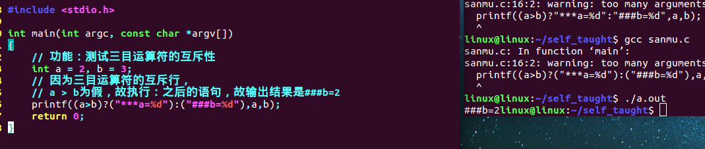

[toc]

# 1 运算符

## 1.1 运算符的概念以及分类

### 1.1.1 运算符的概念

用运算符将运算对象（也称操作数）连接起来的、符合C语法的股则的式子，称为C表达式。运算的对象包括常量、变量、函数等。

### 1.1.2 运算符的分类

#### 1.1.2.1 双目运算符

即参加运算的操作数有两个，例如`a + b`

#### 1.1.2.2 单目运算符

参加运算的操作数只有一个

++自增运算符 给变量值+1

--自减运算符

```c
int a = 10;
a++;
```

#### 1.1.2.3 三目运算符

即参加运算的操作数有3个

```
()?():()
```

## 1.2 算数运算符

```text
+ - * / % += -= *= /= %=
```

10%3 表达式的结果为1

### 1.2.1 复合运算符

a += 3 就相当于 a = a + 3;

a  `*=`  6+8 就相当于 a = a * (6+8)

```c
// printf如果要输出%，则需要使用%%
printf("%d %% %d = %d\n",a,b,a % b);

// 注意:只有整数才能够取余，浮点型数据不能取余
```

## 1.3 关系运算符

```
> < == >= <= !=
```

一般用于判断条件是否满足或者循环语句。

**`==`使用赋值运算符的时候将常量写在等号左边。比如：`if(90 == q)`这样的话，可以很好的避免逻辑错误，因为编译的时候只检查语法错误，不会进行逻辑错误检查，可以避免粗心大意将`==`写成`=`产生逻辑错误的时候，编译的时候检查不出来。**

```c
// 关系运算符连接的表达式的最终结果只有两个，真或假
// 一般返回的结果使用int保存，如果为假则为0;为真则为非0
// 非0即为真
int a = 10 > 5;	// 根据运算符的优先级“>、<”的优先级比“=”的优先级高
int b = 10 < 5;
printf("a = %d,b = %d\n",a,b);
// 输出结果为:a = 1,b = 0
```

## 1.4 逻辑运算符

### 1.4.1 &&逻辑与

两个条件都为真，则结果为真

```
if((a > b) && (a < c))
if(b<a<c) // 这种表达方式是错误的
```

### 1.4.2 || 逻辑或

两个条件至少有一个为真，则结果为真

```
if((a > b) || (a < c))
```

### 1.4.3 ！逻辑非

如果原来的表达式为真，则为假，原来的表达式为假，则为真

```c
if(!(a > b))
{

}
```

注意：

在C语言不能这样写表达式10 < a <100，需要通过逻辑运算符a > 10 && a < 100

### 1.4.4 逻辑与和逻辑或的短路原则

1. 逻辑与的短路原则:如果第一个表达式的结果为假，则整体表达式为假，则后面所有的表达式都不会执行
2. 逻辑或的短路原则:如果第一个表达式的结果为真，则整体表达式的结果为真，所有后面所有的表达式都不会执行

```c
#include <stdio.h>

int main(int argc, char *argv[])
{
    int a = 20;
    // 逻辑与两边的表达式都为真，整体才为真，否则为假
    int ret = a > 10 && a < 19;
    printf("ret = %d\n",ret);

    // 逻辑或两边的表达式之要有一个为真，则整体为真，否则都为假才为假
    ret = a > 10 || a < 19;
    printf("ret = %d\n",ret);

    // 逻辑与的短路原则:如果第一个表达式的结果为假，则整体表达式为假，则后面所有的表达式都不会执行
    int b = 100;
    ret = (a < 19) && (b += 10);
    printf("b = %d\n",b);

    // 逻辑或的短路原则:如果第一个表达式的结果为真，则整体表达式的结果为真，所有后面所有的表达式都不会执行
    ret = (a > 19) || (b += 10);
    printf("b = %d\n",b);

    return 0;
}
```

执行结果：


## 1.5 位运算符

### 1.5.1 & 按位与

任何值与0与都是0，与1与保持不变

==**可以用于使某位或者某几位清0**==

```
0101 1011	&
1011 0100
------------------------
0001 0000
```

### 1.5.2 | 按位或

任何值或1都得1，或0保持不变

可以用于使某位或某几位置1

```
0100 0011	|
1011 0100
------------------------
1111 0111
```

### 1.5.3 ~ 按位取反

1变0，0变1

```
0101 1101	~
------------------------
1010 0010
```

#### 1.5.3.1 &和|运算符笔试题

求32位二进制数中有多少个1或者多少个0

```c
#include <stdio.h>

int func(int x);

int main()
{
	printf("%d\n", func(254));
	return 0;
}

int func(int x)
{
	int countx = 0;
	while(x)
	{
		countx++;
        /* 求x的二进制表达式有多少个1 */
        // x = x & (x - 1);

        /* 求x的二进制表达式有多少个0 */
        // x = x | (x - 1);
		x = x & (x - 1);
	}
	return countx;
}
```

result


### 1.5.4 ^ 按位异或

相异得1，相同得0

```
1001 1100	^
0101 1010
------------------------
1100 0110
```

#### 1.5.4.1 笔试题

交换两个数，不能有中间变量

```c
#include <stdio.h>

void swap(int *a, int *b);
void swap1(int *a, int *b);

int main()
{
	int a = 3;
	int b = 4;
	printf("a = %d, b = %d\n", a, b);
	swap(&a, &b);
	printf("a = %d, b = %d\n", a, b);
	swap1(&a, &b);
	printf("a = %d, b = %d\n", a, b);
	return 0;
}


void swap1(int *a, int *b)
{
	*a = *a ^ *b;
	*b = *a ^ *b;
	*a = *a ^ *b;
}

void swap(int *a, int *b)
{
	*a = *b - *a;
	*b = *b - *a;
	*a = *b + *a; 
}
```

result


### 1.5.5 位移

`>>右移`

`<<左移`

==**总结：**==

1. 左移

   ​	有符号数和无符号数：高位丢弃，低位补0

2. 右移

   ​	有符号数：

   ​				正数：低位丢弃，高位补0

   ​				负数：低位丢弃，高位补1

   ​	无符号数：

   ​				低位丢弃，高位补0

3. 左移一位相当于乘以2，左移两位相当于乘以4

   右移一位相当于除以2，右移两位相当于除以4

==**注意右移分：逻辑右移、算数右移**==

#### 1.5.5.1 右移

逻辑右移 高位补0，低位溢出

算数右移 高位补符号位，低位溢出（有符号数）

##### 1.5.5.1.1 逻辑右移

低位溢出、高位补0

```
0101 1010	>>3
------------------------
0000 1011
```

##### 1.5.5.1.2算数右移

对有符号数来说

低位溢出，高位补符号位

```
1010 1101 >>3
------------------------
1111 0101

0101 0011 >>3
------------------------
0000 1010
```

##### 1.5.5.1.3 总结

右移：

1. 逻辑右移 高位补0，低位溢出

   注：无论是有符号数还是无符号数都是高位补0，低位溢出

2. 算数右移 高位补符号位、低位溢出（有符号数）

   注：对有符号数来说，高位补0，低位溢出

   对有符号数来说，高位补符号位，低位溢出

#### 1.5.5.2 左移<< 

高位溢出,低位补0

## 1.6 条件运算符(三目运算符)

```
()?():()
```

如果?前边的表达式成立，整个表达式的值，是?和`:`之间的表达式的结果否则是`:`之后的表达式的结果。

ex:`(A)?(B):(C)`

首先判断表达式A的结果，如果结果为真，则执行表达式B，如果表达式A为假，则执行表达式C。

B和C是==**互斥的**==

```c
#include <stdio.h>

int main(int argc, const char *argv[])
{
	// 功能：测试三目运算符的互斥性
	int a = 2, b = 3;
	// 因为三目运算符的互斥行，
	// a > b为假，故执行：之后的语句，故输出结果是###b=2
	printf((a>b)?("***a=%d"):("###b=%d"),a,b);
	return 0;
}
```

执行结果



条件运算符其实就是一个简单的if else语句

```c
if(A)
{
	B;
}
else
{
	C;
}
```

```c
#include <stdio.h>

int main(int argc, char *argv[])
{
    int a = 10,b = 20;
    int c;
    c  = (a > b)?(a += 10):(b += 10);
    printf("c = %d\n",c);
    printf("a = %d,b = %d\n",a,b);

    return 0;
}
```

执行结果：


## 1.7 逗号运算符

```
(..., ..., ...)
```

==**使用逗号隔开的表达式从左向右依次执行，最后表达式的值是整个运算的结果**==

```
先运行表达式B，再运行表达式C，最后运行表达式D，最终变量A的值为表达式D的值
A = (B, C, D);
```

```c
#include <stdio.h>

int main(int argc, char *argv[])
{
    int a = 10,b = 20;
    int c;
    // 如果使用逗号运算符，必须要加括号，如果不加，则会歧义
    c = (a += 10,b += 10,a += b);
    printf("a = %d,b = %d,c = %d\n",a,b,c);
    return 0;
}
```

执行结果：


## 1.8 自增自减运算符

```
++   --
```

将++或者--放在变量的后面

```c
#include <stdio.h>

int main(int argc, char *argv[])
{
    // 将++或者--放在变量的后面
    // 先使用，后自增或者自减
    int a = 100;
    int b;
    b = a++;
    printf("a = %d,b = %d\n",a,b);
    return 0;
}
```

执行结果：


将++或者--放在变量的前面

```c
#include <stdio.h>

int main(int argc, char *argv[])
{
    // 将++或者--放在变量的前面
    // 先自增或者自减，后使用
    int a = 100;
    int b;
    b = ++a;
    printf("a = %d,b = %d\n",a,b);
    return 0;
}
```

执行结果：


```c
#include <stdio.h>

int main(int argc, char const *argv[])
{
    int i = 1;
    /*
     * 首先是函数的入栈顺序从右向左入栈的, 计算顺序也是从右往左计算的, 不过都是计算完以后在进行的压栈操作：
     *
     *      首先执行++i, 返回值是i, 这时i的值是2, 再次执行++i, 返回值是i, 得到i = 3, 将i压入栈中, 此时i为3, 也就是压入3, 3；
     *      printf("%d %d\n", ++i, ++i);
     * 
     *      首先执行i++ , 返回值是原来的i, 也就是3, 再执行++i, 返回值是i, 依次将3, 5压入栈中得到输出结果
     *      printf("%d %d\n", ++i, i++);
     * 
     *      首先执行i++ , 返回值是5, 再执行i++ 返回值是6, 依次将5, 6压入栈中得到输出结果
     *      printf("%d %d\n", i++, i++);
     * 
     *      首先执行++i, 返回i, 此时i为8, 再执行i++, 返回值是8, 此时i为9, 依次将i, 8也就是9, 8压入栈中, 得到输出结果。
     *      printf("%d %d\n", i++, ++i);
     * 
     */
    printf("%d %d\n", ++i, ++i);
    printf("%d %d\n", ++i, i++);
    printf("%d %d\n", i++, i++);
    printf("%d %d\n", i++, ++i);
    return 0;
}
```

result


**后置自增运算符需要把原来变量的值复制到一个临时的存储空间，等运算结束后才会返回这个临时变量的值。所以前置自增运算符效率比后置高**

## 1.9 运算符优先级

```c
#include<stdio.h>

int main(int argc, const char *argv[])
{
	int x = 1,y = 0,z = 0;
	//	if(x++ && y++ || ++z)
	//	先运算&&之后把x++ && y++的结果再与++z进行||运算
	//	x++ 结果为x = 2,x为真，执行&&后面的y++,y=1;
	//	x++ && y++ 结果为真，之后与++z进行||运算，z=1
	//	{
	//		printf("true%d %d %d\n",x,y,z);
	//	}
	//	else
	//	{
	//		printf("false%d %d %d\n",x,y,z);
	//	}
	//	输出结果2 1 1


	//	if(!(x + 1 > 0) && y++ || ++z)
	//	先运算&&之后把!(x + 1 > 0) && y++的结果再与++z进行||运算
	//	!(x + 1 > 0)结果为假，此时x=1,y++不进行运算，y=0
	//  !(x + 1 > 0) && y++结果为假，但是要执行||运算符之后的++z
	//  此时z=1
	//	{
	//		printf("true%d %d %d\n",x,y,z);
	//	}
	//	else
	//	{
	//		printf("false%d %d %d\n",x,y,z);
	//	}
	//	输出结果为1 0 1
	if(x += y == z,y = x + 2,z = x + y + x > 0)
	// 先进行x+y+z>0这个操作，这个结果为真，z=1
	// 之后进行y==z,此时y=1;
	// 之后进行x+=y;x=2;
	// 之后进行y=x+2，此时y=4
	{
		printf("true %d %d %d\n",x,y,z);
	}
	else
	{
		printf("false %d %d %d\n",x,y,z);
	}
	// 输出结果2 4 1
	return 0;
}
```


### 1.9.1 单算移关与，异或逻条赋

- 单：单目运算符

- 算：算术运算符

- 移：左移，右移

- 关：关系运算符

- 与：&

- 异：异或^

- 或：|

- 逻：逻辑运算符

- 条：条件运算符

- 赋：赋值运算符


# 2 三大结构

- 顺序结构
- 选择结构
- 循环结构

## 2.1 顺序结构

​		代码的正常编写流程。

## 2.2 选择结构

### 2.2.1 单分支

```
/* 单分支 */
if(条件表达式)
{
    /* 复合语句，若干条语句的集合 */
    语句块;
}
```

```c
#include <stdio.h>

int main(int argc, char *argv[])
{
    int n = 40;
    // 单分支
    // 首先，判断if后面括号里面的表达式是否为真
    // 如果为真，执行大括号里面的语句
    // 如果为假，则不执行
    if(n >= 50)
    {
        printf("one:if\n");
        printf("%d >= 50\n",n);
    }
    return 0;
}
```

### 2.2.2 双分支

```
// 双分支
if(条件表达式)
{
	语句块1;
}
else
{
	语句块2;
}
```

```c
#include <stdio.h>

int main(int argc, char *argv[])
{
    int n = 40;    
    // 双分支
    // 先判断if后面的表达式，如果为真。则执行if后大括号里面的语句
    // 如果为假，则执行else后面大括号里面的语句
    // 注意:如果if和else后只有一条语句，则可以不加大括号
    // 但是如果有多条语句，必须加大括号，否则else找不到与之最近的if，编译会保错
    if(n >= 50)
    {
        printf("two:if...else\n");
        printf("%d >= 50\n",n);
    }
    else
    {
        printf("two:if...else\n");
        printf("%d < 50\n",n);
    }
    return 0;
}
```

### 2.2.3 多路分支

#### 2.2.3.1 if ... else if ... else

```
// 多路分支----if ... else if ... else
if (条件表达式1)
{
    语句块1;
}
else if (条件表达式2)
{
    语句块2;
}
else if (条件表达式3)
{
    语句块3;
}
......
else
{
    语句块n;
}
```

```c
#include <stdio.h>

int main(int argc, char *argv[])
{
int n = 40;
// 多路分支----if ... else if ... else
if(n > 50)
{
   printf("three:if...else if...else\n");
   printf("%d > 50\n");
}
else if(50 == n)
{
   printf("three:if...else if...else\n");
   printf("%d = 50\n");
}
else
{
   printf("three:if...else if...else\n");
   printf("%d < 50\n",n);
}
return 0;
}
```

#### 2.2.3.2 switch  case

```
/* 表达式只能是字符类型或整型的（short int 、int、long int）、以及枚举、常量 */
switch (表达式)
{
    case 常量表达式1:
        语句块1;
        break;
    case 常量表达式2:
        语句块2;
        break;
    ......
    default:
        语句块3;
        break;
}
```

##### 2.2.3.2.1 注意

- switch后面的表达式不能是浮点型，可以是整型、字符型、枚举、常量
- 如果case后面的常量表达式与switch的表达式的值都不同，则执行default后面的语句
- 每一个case执行的语句结束后理论上必须跟一个break，作用就是跳出整个switch语句
- case后面语句很多，不需要加大括号。但当语句块中包含循环结构时，必须加上括号方可
- 每一个语句块之间是互斥的（通过break体现出现的）
- 在switch case语句中不能使用continue关键字

```c
#include <stdio.h>

int main(int argc, char *argv[])
{
    int num = 2;
    switch(num)
    {
    case 1:
        printf("1234567890\n");
        // 如果不加break，当要执行当前case语句时，执行完毕后会接着下一个
        // case后的语句执行，直到遇到break为止，否则会一直执行
        break;
    case 2:
        printf("0987654321\n");
        break;
    case 3:
        printf("7418523690\n");
        break;
    default:
        printf("hahahahah\n");
        break;
    }
    return 0;
}
// 输出结果:0987654321
```

## 2.3 循环结构

### 2.3.1 for循环

```
for(表达式1；表达式2；表达式3)
{
	// 复合语句，循环体
	语句块;
}
// 表达式1：赋初值，表达式1可以在此位置省略（已经赋好初始值了）
// 表达式2：条件判断，表达式2在此位置如果不写，则就是一个死循环
// 表达式3：条件更新，表达式3可以在次位置省略不写（已经处于循环体的末尾）
```

#### 2.3.1.1 执行顺序

先执行表达式1，然后执行表达式2，如果表达式2成立，则执行语句块。当语句块之后完毕后，接着执行表达式3，然后再执行表达式2；如果表达式2成立，则继续执行语句块，以此类推，直到表达式2不成立，循环结束。

```c
#include <stdio.h>

int main(int argc, char *argv[])
{
    int i = 1;
    int sum = 0;
    for(i = 1;i <= 100;i++)
    {
        sum += i;
    }
    printf("1 + 2 +3 +4 + 5 + ... + 100 = %d\n",sum);
    return 0;
}
```

执行结果：


### 2.3.2 while循环

#### 2.3.2.1 while

```
while (条件表达式)
{
    // 循环体，复合语句
    语句块;
}
```

##### 2.3.2.1.1 执行顺序

首先判断while后面的条件表达式，如果表达式成立(为真)，执行语句块，执行完语句块；接着再次执行条件表达式，如果表达式为真，则继续执行语句块；直到条件表达式为假，循环结束。

ex:使用while循环求1到100的累加和

```c
#include <stdio.h>

int main(int argc, char *argv[])
{
  int i = 1;
  int sum = 0;
  while(i <= 100)
  {
      sum += i;
      i++;
  }
  printf("1 + 2 +3 +4 + 5 + ... + 100 = %d\n",sum);
  return 0;
}
```

执行结果：


#### 2.3.2.2 do……while

```
do{
	// 循环体
	语句块;
}while(条件表达式);
```

##### 2.3.2.2.1 执行顺序

​		先执行do后面的语句块，然后判断while后面的条件表达式是否成立；如果成立，则继续执行do后面的语句块，执行完毕之后接着执行while后面的条件表达式；当条件表达式不成立时，循环结束。

注意：不管条件是否成立，do后面的语句块都会执行一次，所以尽量少用do……while在while后面必须加一个分号

#### 2.3.2.3 总结

==**while最少被执行0次**==

==**do_while最少被执行1次**==

### 2.3.3 for和while的选择

- 从循环次数方面：如果已知次数的话，用for，如果不知道次数的话就使用while
- 从美观角度：条件判断表达式（for循环中的表达式2），如果表达式过于长的话，使用while，如果表达式相对没有那么长的时候，使用for和while都是可以的。
- 从条件更新角度：如果需要提前结束循环的话，可以使用while，因为while中的条件更新是在循环中，而for循环中的条件更新一般是在最后的。反之使用for。

### 2.3.4 goto循环

goto主要用于在一个函数里面实现代码的跳转

```c
#include <stdio.h>

int main(int argc, char *argv[])
{
    // 使用goto实现跳转
    printf("11111111111\n");
    goto NEXT;
    // goto循环直接跳转到NEXT之后的，打印2和3被跳过
    printf("22222222222\n");
    printf("33333333333\n");

NEXT:
    printf("44444444444\n");
    printf("hello world\n");
    return 0;
}
// 执行结果
// 11111111111
// 44444444444
// hello world
```

使用goto实现求1到100的累加和

```c
#include <stdio.h>

int main(int argc, char *argv[])
{
    int i = 1;
    int sum = 0;
JOOP:
    sum += i;
    i++;
    if(i <= 100)
    {
        goto JOOP;
    }
    printf("1 + 2 +3 +4 + 5 + ... + 100 = %d\n",sum);
    return 0;
}
```

执行结果：


#### 2.3.4.1 注意

在平时编写代码时。尽量少使用goto,因为会使得代码逻辑混乱，可读性差。

当函数有很多个出口，使用goto把这些出口集中到一处是很方便的，特别是函数中有许多重复的清理工作的时候。

理由是:

- 无条件跳转易于理解

- 可以减少嵌套

- 可以避免那种忘记更新某一个出口点的问题

- 算是帮助编译器做了代码优化。


## 2.4 break和continue的区别、return

### 2.4.1 break

用于从循环体内跳出循环体，即提前结束一层循环。

==**break只能用在循环语句和switch语句中。**==


### 2.4.2 continue

结束本次循环，接着判定下一次是否执行循环。

### 2.4.3 break和continue的区别

continue直接结束本次循环，而break终止本次循环。

### 2.4.4 return

return语句的一般形式：return（<表达式>）

主要用于种植包含它的函数的执行

若终止的为主函数，则主程序结束。