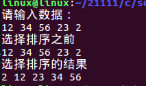

[toc]

# 1 数组的概念

数组是==若干个相同类型的变量==在内存中==有序存储的集合==。

## 1.1 概念理解

1. 数组用于存储一组数据

2. 数组里面存储的数据类型必须是相同的

3. 数组在内存中会开辟一块连续的空间


```c
int a[10];	
// 定义了一个整型的数组a,a是数组的名字，数组中有10个元素，每个元素的类型都是int类型，而且在内存中连续存储。这十个元素分别是a[0]	a[1]	a[2]	a[3]	……	a[9]；a[0]~a[9]在内存中连续的顺序存储
```

# 2 数组的分类

## 2.1 按元素的类型分类

1. 字符数组

   即若干个字符变量的集合，数组中的每个元素都是字符型的变量
   
   char s[10];	s[0],s[1],s[2]……s[9]

2. 短整型的数组

   short int a[10];	a[0]~a[9];	赋值：a[0] = 4;

3. 整型的数组

   int a[10];	a[0]~a[9];	赋值：a[0] = 4;

4. 长整型的数组

   long int a[5];

5. 浮点型的数组(单、双)

   float a[6];	赋值：a[0] = 4.14f;
   
   double a[8];	赋值：a[7] = 3.115926;

6. 指针数组

   char *a[10];
   
   int *a[10];

7. 结构体数组

   struct stu boy[10];

## 2.2 按维数分类

1. 一维数组

   ```c
   // 类似于一排平房
   int a[30];
   ```

2. 二维数组

   ```c
   // 可以看成一栋楼房,有多层,每层有多个房间,也类似与数学中的矩阵
   // 二维数组可以看成是由多个一维数组构成的.有行有列
   int a[2][30];
   ```

3. 多维数组

   ```c
   int a[4][2][10];
   // 三维数组是由多个相同的二维数组构成的
   int a[5][4][2][10];
   ```

# 3 数组的定义

## 3.1 一维数组的定义

1. 格式

  `数据类型 数组名[数组元素的个数];`

  ```c
  // 定义一个名为a的数组,数组中的每一个元素都是int类型,一共有10个元素
  // 每一个元素都保存在一个变量中,每一个变量都是有数组名和数组下标组成的
  // 并且是从0开始的,分别是a[0]~a[9]
  int a[10];
  ```

2. 注意

  数组元素的个数在定义的时候也可以不写,但是如果不写,必须初始化(定义的时候为其赋值)

```c
#include <stdio.h>

int main(int argc, const char *argv[])
{
    // 定义一个一维的整型数组
    int a[10];
    // 通过sizeof关键字可以获取数组的大小
    // 一维整型数组a[10]中有10个整型的数据，一个整型数据占4个字节，所以一维整型数组a[10]的大小是40
    printf("sizeof(a) = %d\n",sizeof(a));
    // 和上面输出的结果相同，说明一维整型数组中的元素都是整型
    printf("sizeof(a) = %d\n",10 * sizeof(int));

    // 如果定义数组的同时赋值（初始化），可以不指定数组元素的个数，系统会根据初始化元素的个数
    // 自动指定数组元素的个数
    int b[] = {10,20,30};
    // 通过sizeof关键字可以获取数组的大小
    // 数组b[]中有三个整型的数据，所以大小是3*4=12
    printf("sizeof(b) = %d\n",sizeof(b));
    return 0;
}
```

result


## 3.2 二维数组的定义

1. 格式

```
存储类型 数据类型 数组名[行的个数][列的个数];
```

```c
int a[2][4];
```

2. 解释

  定义一个名为a的二维数组,每一个元素都是int类型;这个二维数组包含两行四列的元素,一共有8个元素;二维数组也是连续开辟空间,访问元素是行和列都是从0开始.

3. 注意

  ==**二维数组的下标也是可以省略的,但是有条件,在初始化时行数可以省略,但是列数不能省略**==

```c
#include <stdio.h>

int main(int argc, const char *argv[])
{
    // 定义一个二维整型数组
    int a[2][4];
    // 通过sizeof关键字可以获取数组的大小
    printf("sizeof(a) = %d\n",sizeof(a));
    // 二维整型数组中的元素都是整型，每一个元素都占4个字节。a[2][4]共2*4个元素
    printf("sizeof(a) = %d\n",2 * 4 * sizeof(int));

    // 二维数组的行数可以省略，但是列数不能省略，在初始化时可以这样操作
    // 系统会根据列数自动指定行数。
    // 元素个数不是列数的整数倍----行数 = （int）（初始化元素的个数 / 列数） + 1
    // 元素个数是列数的整数倍----行数 = 初始化元素的个数 / 列数
    // 如果最后一行没有初始化完，未初始化的默认值是0。且已经分配了空间
    // 也就是说，数组的大小一定是列的整数倍
    int b[][4] = {1,2,3,4,5,6,7,8,9};
    printf("sizeof(b) = %d\n",sizeof(b));
    return 0;
}
```

执行结果:


# 4 定义并初始化

## 4.1 一维数组的初始化

```c
#include <stdio.h>

int main(int argc, char *argv[])
{
    // 一维数组的初始化
    // 如果不初始化。直接使用会是随机值
    int a[4];
    for(int i = 0;i <= 3;i++)
    {
        printf("%d\n",a[i]);
    }
    // 输出结果:
    //    4200379
    //    4200288
    //    0
    //    96
    
    printf("*******************\n");
    // 初始化方式1:全部初始化
    // 用户指定元素的个数，可以不指定元素的个数，可以由系统自动分配
    // int b[4] = {123,78,666,476};
    int b[] = {123,78,666,476};
    for(int i = 0;i <= 3;i++)
    {
        printf("%d\n",b[i]);
    }
    // 输出结果:
    //    123
    //    78
    //    666
    //    476   
    
    printf("*******************\n");
    // 初始化方式2:局部初始化
    // 未初始化的位置的元素自动赋值为0
    int c[4] = {10,20};
    for(int i = 0;i <= 3;i++)
    {
        printf("%d\n",c[i]);
    }
    // 输出结果:
    //    10
    //    20
    //    0
    //    0
    return 0;
}
```

## 4.2 二维数组的初始化

### 4.2.1 按行初始化

1. 全部初始化

   ```c
   int a[2][2] = {{1,2},{4,5}};
   a[0][0] = 1;	a[0][1] = 2;	a[1][0] = 4;	a[1][1] = 5;
   ```

2. 部分初始化

   ```c
   // 未初始化的值默认是0
   int a[3][3] = {{1,2},{1}};
   a[0][0] = 1;	a[0][2] = 0;
   ```

### 4.2.2 逐个初始化

1. 全部初始化

  ```c
  int a[2][3] = {2,4,5,2,3,4};
  ```

2. 部分初始化

  ```c
  int a[2][3] = {3,5,6,8};
  ```

```c
#include <stdio.h>

int main(int argc, char *argv[])
{
    // 二维数组的初始化,系统自动为其分配值
    //    int a[2][3];
    // 输出结果:
    //    15013224
    //    96
    //    6356848
    //    4200411
    //    4200320
    //    0
    
    // 初始化方式1:按行初始化
    // 全部初始化
    //    int a[2][3] = {{10,20,30},{77,66,88}};
    // 输出结果:
    //        10     20     30
    //        77     66     88
    // 局部初始化
    // 没有赋值的位置的元素自动为0
    //    int a[2][3] = {{10,30},{666}};
    // 输出结果:
    //        10     30     0
    //        666    0      0
    
    // 初始化方式2:逐个初始化
    // 全部初始化
    //    int a[2][3] = {1,2,3,4,5,6};
    // 输出结果
    //        1      2      3      
    //        4      5      6  
    // 局部初始化
    // 没有赋值的位置的元素自动为0
    int a[2][3] = {1,2,3};
    //    输出结果:
    //    1      2      3
    //    0      0      0
    
    // 二维数组的遍历
    // 外层循环控制行数
    for(int i = 0;i <= 1;i++)
    {
        // 内层循环控制列数
        for(int j =0;j <= 2;j++)
        {
            // %-7d要求宽度为7位，如果不足7位，后面空格补齐，如果足够7位，此语句无效
            printf("%-7d",a[i][j]);
        }
        printf("\n");
    }
    return 0;
}

```

# 5 数组元素的引用方法

## 5.1 一维数组的引用方法

```
数组名[下标];	// 下标代表数组元素在数组中的位置.注意从0开始
```

```
int a[10];			//	引用a[2]
```

## 5.2 二维数组的引用方法

```
数组名[行下标][列下标];
```

```
int a[3][4];			// 引用a[1][2]
```

```c
#include <stdio.h>

int main(int argc, char *argv[])
{

    // 一维整型数组的引用以及一维数组的遍历
    int a[6] = {111,222,333,444,555,666};
    // 引用a[3]并重新赋值为10000
    a[3] = 10000;
    // 一维整型数组的遍历
    for(int i = 0;i < sizeof(a) / sizeof(int);i++ )
    {
        // %-7d要求宽度为7位，如果不足7位，后面空格补齐，如果足够7位，此语句无效
        printf("%-7d",a[i]);
    }

    printf("\n********************\n");
    // 二维数组的引用以及二维数组的遍历
    int b[3][4] = {1,2,3,4,5,6,7,8,9,10,11,12,13};
    // 引用b[2][0]并重新赋值为666
    b[2][0] = 666;


    // 二维数组的遍历
    // 外层循环控制行数
    for(int i = 0;i < 3;i++)
    {
       // 内层循环控制列数
        for(int j =0;j < 4;j++)
        {
            // %-5d要求宽度为5位，如果不足5位，后面空格补齐，如果足够5位，此语句无效
            printf("%-5d",b[i][j]);
        }
        printf("\n");
    }
    return 0;
}
```

执行结果:


# 6 一维整型数组的总结

1. 对于一维整型数组而言，输入和输出需要借助于循环完成

2. 当一维数组没有被初始化时，元素都是随机值

3. 当一维数组满初始化时，其元素值按照指定的值进行赋值

4. 当一维数组部分初始化时，剩余未被赋值的元素默认补0

5. 可以利用一维数组部分初始化的特性，对于定义的数组进行初始化为0

6. 一维数组的个数可以省略不写，但是省略不写的时候，就必须体现出初始化的痕迹，因为这是依据，用来作为省略的个数。赋值了几个元素，就认为省略的是谁

7. 打印一维数组元素值

   ```c
   // 打印一维数组元素值的方式
   arr[i];
   *(arr + i);
   *(p + i);
   *(p++);
   i[arr];
   i[p];
   p[i];
   // i[arr] 之所以可以是因为系统中是按照 *(i + arr) 取值的，所以 arr[i] 和 i(arr) 是一样的。
   ```

# 7 二维整型数组的总结

1. 二维数组中的行数可以省略不写，但是列数不可以

2. 对于整型二维数组，输入输出需要通过循环嵌套实现

3. 对于二维字符数组，输入输出通过一个循环就可以完成

4. 二维数组中的行数代表所包含的一维数组的个数，列数代表所包含的每一个一维数组的长度。

5. 初始化时，对于二维数组而言，要想没有任何警告，就需要完全按照二维数组的本质（多个一维数组）进行初始化

   ```c
   int arr[2][3] = {{0}};
   char str[5][20] = {{'\0'}};
   ```

6. 通过行指针遍历二维数组

   ```c
   arr[i][j] = p[i][]
   *(arrp[i] + j) *(p[i] + j)
   *(*(arr+i)+j) = *(*(p+i)+j)
   ```

   

# 8 一维数组的排序算法

## 8.1 冒泡排序

```c
#include <stdio.h>
// 定义一个宏，表示数组的个数
#define N 5

int main(int argc, const char *argv[])
{
	//int arr[N] = {78,12,56,99,68};
	int arr[N];
	int i,j;
	int temp;

	printf("请输入数据：\n");
	// 从键盘键入一个数组
	for(i=0;i<N;i++)
	{
		scanf("%d",&arr[i]);
	}
	// 排序之前将数组的值输出
	printf("冒泡排序之前\n");
	for(i=0;i<N;i++)
	{
		printf("%d ",arr[i]);
	}
	printf("\n");

	for(i=0;i<N-1;i++) // 控制趟数
	{
		for(j=0;j<N-1-i;j++) // 控制次数
		{
			// 判断前一个数是否比后一个数大
			if(arr[j] > arr[j+1])
			{
				// 将两个数进行交换
				temp = arr[j];
				arr[j] = arr[j+1];
				arr[j+1] = temp;
			}
		}
	}
	// 打印冒泡排序之后的结果
	printf("冒泡排序的结果\n");
	for(i=0;i<N;i++)
	{
		printf("%d ",arr[i]);
	}
	printf("\n");

	return 0;
}
```

执行结果


## 8.2 选择排序

```c
#include <stdio.h>
// 定义一个宏，表示数组的个数
#define N 5

int main(int argc, const char *argv[])
{
	// 功能：选择排序
	//int arr[N] = {78,12,56,99,68};
	int arr[N];
	int i,j;
	int temp;

	printf("请输入数据：\n");
	// 从键盘键入一个数组
	for(i=0;i<N;i++)
	{
		scanf("%d",&arr[i]);
	}
	// 排序之前将数组的值输出
	printf("选择排序之前\n");
	for(i=0;i<N;i++)
	{
		printf("%d ",arr[i]);
	}
	printf("\n");

	for(i=0;i<N-1;i++) // 控制趟数
	{
		for(j=i+1;j<N;j++) // 控制次数
		{
			if(arr[i] > arr[j])
			{
				// 将两个数进行交换
				temp = arr[i];
				arr[i] = arr[j];
				arr[j] = temp;
			}
		}
	}
	// 打印选择排序之后的结果
	printf("选择排序的结果\n");
	for(i=0;i<N;i++)
	{
		printf("%d ",arr[i]);
	}
	printf("\n");

	return 0;
}
```

执行结果



```c
#include <stdio.h>
// 定义一个宏，表示数组的个数
#define N 5

int main(int argc, const char *argv[])
{
	// 功能：选择排序
	//int arr[N] = {78,12,56,99,68};
	int arr[N];
	int i,j;
	int temp,index;

	printf("请输入数据：\n");
	// 从键盘键入一个数组
	for(i=0;i<N;i++)
	{
		scanf("%d",&arr[i]);
	}
	// 排序之前将数组的值输出
	printf("选择排序之前\n");
	for(i=0;i<N;i++)
	{
		printf("%d ",arr[i]);
	}
	printf("\n");

	for(i=0;i<N-1;i++) // 控制趟数
	{
		index = i;
		for(j=i+1;j<N;j++) // 控制次数
		{
			if(arr[index] < arr[j])
			{
				index = j;
			}
		}
		if(i != index)
		{
			temp = arr[i];
			arr[i] = arr[index];
			arr[index] = temp;
		}
	}
	// 打印选择排序之后的结果
	printf("选择排序的结果\n");
	for(i=0;i<N;i++)
	{
		printf("%d ",arr[i]);
	}
	printf("\n");

	return 0;
}
```

执行结果


## 8.3 冒泡排序和选择排序比较

### 8.3.1 区别

1. 冒泡排序是比较相邻位置的两个数，而选择排序是按顺序比较，找最大值和最小值
2. 冒泡排序每一轮比较后，位置不对都需要换位置，选择排序每一轮比较都只需要换一次位置
3. **==冒泡排序是通过数去找位置，选择排序是给定位置去找数==**

### 8.3.2 冒泡排序优缺点

1. 优点：比较简单，空间复杂度较低，是稳定的
2. 缺点：时间复杂度太高，效率慢

### 8.3.3 选择排序优缺点

1. 优点：一轮比较只需要换一次位置
2. 缺点：效率慢，不稳定

# 9 字符数组的定义和初始化问题

 ```c
 #include <stdio.h>
 
 int main(int argc, char *argv[])
 {
     // 字符数组的定义
     char c1[] = {'c',' ','p','r','o','g'};
     char c2[] = "c prog";
     // 二维字符数组的定义
     char a1[][5] = {
         {'B','A','S','I','C'},
         {'d','B','A','S','E'}
     };
     char a2[][6] = {"hello","world"};
     // 使用sizeof关键字打印字符数组逐个赋值所占空间大小
     printf("c1 = %d\n",sizeof(c1));
     // 使用sizeof关键字打印字符数组字符串赋值所占空间大小
     printf("c2 = %d\n",sizeof(c2));
     // 使用sizeof关键字打印二维字符数组逐个赋值所占空间大小
     printf("a1 = %d\n",sizeof(a1));
     // 使用sizeof关键字打印二维字符数组字符串赋值所占空间大小
     printf("a2 = %d\n",sizeof(a2));
     return 0;
 }
 ```

执行结果：


## 9.1 注意：字符数组的初始化问题

字符数组不能够先定义再初始化，只能在定义的同时进行初始化，如：`char ch[20]={"hello word!"}`这样可以，因为如果定义字符数组时不进行初始化，则数组中各元素的值将是随机产生的，其结果是不可预料的，所以必须在定义字符数组时进行初始化。

如果定义时不进行初始化，你可以这样写：

```c
char ch[2];
char[0] = 'H';
char[1] = 'I';
```

但是这样写会很大的浪费存储空间！不建议这样写。

 如果你不想在定义时初始化，那么建议你用字符指针，如：

```c
char *ch;
ch = "hello word!"; 	// 这个可以这样写。
```

## 9.2 字符数组的引用

1. 用字符串的方式赋值比用字符逐个赋值要多占1个字节，用于存放字符串结束的标志'\0';

2. 上面的数组c2在内存中的实际存放情况为

   | c2[0] | c2[1] | c2[2] | c2[3] | c2[4] | c2[5] | c2[6] |
   | :---- | :---- | :---- | :---- | :---- | :---- | :---- |
   | 'c'   | ' '   | 'p'   | 'r'   | 'o'   | 'g'   | '\0'  |

   注：'\0'是C编译系统自动加上的

3. 由于采用了'\0'标志，字符数组的输入和输出将变得简单方便

   ```c
   #include <stdio.h>
   
   int main(int argc, char *argv[])
   {
       // 定义一个字符数组，通过scanf函数输入字符串并输出结果
       // 通过赋值“”这样的方式可以清楚字符数组中的垃圾字符，让每一个元素都是'\0'
       char ch[32] = "";
   
       // 数组名就是当前数组的首地址，所以scanf的第二个参数直接传数组名即可
       scanf("%s",ch);
   
       printf("ch = %s\n",ch);
   
       return 0;
   }
   ```

   执行结果

   

   **注意**
   
   ```
   在QT中如果要使用scanf函数这样的从终端输入函数，需要通过命令终端输入输出点击左边工具栏中的“项目”，点击“build&run”下方的“run”,然后再右侧点击，在“run in terimnal”选项前打对勾
   ```

## 9.3 转义字符

| 转义字符 | 意义                               | ASCII码值(十进制) |
| -------- | ---------------------------------- | ----------------- |
| \a       | 响铃(BEL)                          | 007               |
| \b       | 退格(BS)，将当前位置移到前一列     | 008               |
| \f       | 换页(FF)，将当前位置移到下页开头   | 012               |
| \n       | 换行(LF)，将当前位置移到下一行开头 | 010               |
| \r       | 回车(CR)，将当前位置移到本行开头   | 013               |
| \t       | 水平制表(HT)(跳到下一个TAB位置)    | 009               |
| \v       | 垂直制表(VT)                       | 011               |
| `\\`     | 代表一个反斜线字符( \ )            | 092               |
| `\'`     | 代表一个单引号( ' )                | 039               |
| `\"`     | 代表一个双引号字符                 | 034               |
| `\?`     | 代表一个问号                       | 063               |
| `\0`     | 空字符(NULL)                       | 000               |
| `\ddd`   | 1到3位八进制所代表的任意字符       | 三位八进制        |
| `\xhh`   | 1到2位十六进制所代表的任意字符     | 十六进制          |
