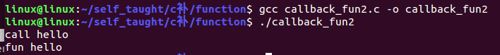

[toc]

# 页面跳转

[回调函数](#回调函数)

# 1 函数的概念

函数是C语言的功能单位，实现一个功能可以封一个函数来实现。

定义函数的时候一切以功能为目的，根据功能去定函数参数和返回值。

函数就是将特定功能的代码封装在一个函数内部，当要使用这些代码时，只需要通过函数名就可以使用，这样操作起来更加方便。

# 2 函数的分类

## 2.1 分为3类

### 2.1.1 从函数定义角度（即函数是谁实现的）

1. 库函数（c库实现的）
2. 自定义函数（用户自己实现的函数）
3. 系统调用（操作系统实现的函数）

### 2.1.2 从参数角度分类

1. 有参函数

  函数有形参，可以是一个，或者多个，参数的类型随便。

  完全取决于函数的功能

  ```c
  int fun(int a,float b,double c)
  {
     return 0;
  }
  
  int max(int a,int b)
  {
     return 0;
  }
  ```

2. 无参函数

  函数没有参数，在形参列表的位置写个void或什么都不写

  ```c
  int fun(void)
  {
     return 0;
  }
  
  int fun()
  {
     return 0;
  }
  ```

### 2.1.3 从返回值角度分类

1. 带返回值的参数

  在定义函数的时候，必须带着返回值类型，在函数体里，必须有return。

  如果没有返回值类型，默认返回整型

  ```c
  char fun()
  {
     char b = 'a';
     return b;
  }
  // 如果把函数的返回值省略了，默认返回整型
  fun()
  {
     return 1;
  }
  ```

  注：在定义函数的时候，函数的返回值类型，到底是什么类型，取决于函数的功能

2. 没返回值的函数

  在定义函数的时候，函数名字前面加void

  ```c
  void fun()
  {
     // 语句块;
     // 当返回值是空的时候，return可以省略不写，或者可以直接返回一个空值，如下
     return ;
  }
  ```

  如果想结束函数返回到被调用的地方，return ；什么都不返回就可以了。

## 2.2 总结

1. 无参数无返回值函数

   ```c
   void function()
   {
       // 语句块;
       // 当返回值是空的时候，return可以省略不写，或者可以直接返回一个空值，如下
       return;
   }
   ```

2. 无参数有返回值函数

   ```c
   int function()
   {
       //  语句块;
       // 返回值类型需要跟函数的类型保持一致
       return 0;
   }
   
   function()
   {
       // 没有返回值类型，默认返回的是整型
       return 0;
   }
   ```

3. 有参数无返回值函数

   ```c
   void function(int a, int b)
   {
       // 语句块;
       return;
   }
   ```

4. 有参数有返回值函数

   ```c
   int function(int a, int b)
   {
       // 语句块;
       return 0;
   }
   ```


注意：==**形参和函数类型不一定非是整型，可以是其他类型**==

# 3 函数的定义

函数的定义即函数的实现

1. 函数的定义方法

   ```
   存储类型 返回值类型 函数名字(形参列表)
   {
       // 函数体，函数的功能在函数体中实现
       // return的返回值类型要和函数的返回值类型保持一致，
       // 当返回值类型是void时，返回值也是空
       return 返回值;
   }
   ```
   
   函数名字是标识符，所以需要满足标识符的命名规则
   
   形参：可以有，也可以没有，也可以有多个，但是即使没有，函数名字后面也必须加括号
   
   函数体上下位置必须有大括号。
   
   如果要返回函数执行的结果，也就是返回值，则return后面跟的变量或者值，必须于函数名左边的返回值类型一致。如果不一致可以采取强制类型转换，但是不建议。
   
   形参必须带类型，而且以逗号分隔。
   
   函数的定义不能嵌套，即不能在一个函数体内定义另一个函数。但是可以相互调用。
   
   所有函数的定义都是平行的，在一个程序中，相同的函数名只能出现一次。
   
   ```c
   #include <stdio.h>
   
   // 定义一个没有返回值和没有形参的函数fun1
   void fun1(void)
   {
       printf("This is fun1\n");
   }
   
   // 定义一个没有返回值但有形参的的函数fun2
   void fun2(int a,int b)
   {
       // 函数功能，比较两个数的大小
       if(a > b)
           printf("%d > %d\n",a,b);
       else if(a < b)
           printf("%d < %d\n",a,b);
       else
           printf("%d = %d\n",a,b);
   }
   
   // 定义一个有返回值且有形参的函数fun3
   int fun3(int a,int b)
   {
       // 函数功能求两个数中的最大值，并返回
       if(a > b)
           return a;
       else
           return b;
   }
   
   int main(int argc, char *argv[])
   {
       // 函数的调用
       // 函数在调用的时候如果没有参数，也必须加括号
       // 函数调用的时候不能加返回值类型
       fun1();
       fun2(5,5);
       int a;
       a = fun3(7,8);
       printf("%d\n",a);
   
       return 0;
   }
   ```

# 4 函数的声明

## 4.1 概念

对已定义的函数，进行说明。函数的声明可以声明多次。

## 4.2 为什么要声明

有些情况下，如果不对函数进行声明，编译器在编译的时候，可能不认识这个函数。帮助编译器进行语法检查。

因为编译器在编译C程序的时候，是从上往下编译的。

## 4.3 声明的方法

### 4.3.1 什么时候需要声明

#### 4.3.1.1 主调函数和被调函数在同一个.c文件

1. 被调函数在上，主调函数在下（这种情况下不需要声明）

   ```c
   #include <stdio.h>
   
   // 被调函数
   void fun1(void)
   {
       printf("This is fun1\n");
   }
   
   // 主调函数
   int main(int argc, char *argv[])
   {
       // 函数的调用
       // 函数在调用的时候如果没有参数，也必须加括号
       // 函数调用的时候不能加返回值类型
       fun1();
       return 0;
   }
   ```

2. 被调函数在下，主调函数在上

   ```c
   #include <stdio.h>
   
   // 主调函数
   int main(int argc, char *argv[])
   {
       // 函数的调用
       // 函数在调用的时候如果没有参数，也必须加括号
       // 函数调用的时候不能加返回值类型
       fun1();
       return 0;
   }
   
   // 被调函数
   void fun1(void)
   {
       printf("This is fun1\n");
   }
   ```

   编译器从上往下编译，在main函数（主调函数），不认识fun1。需要声明

##### 4.3.1.1.1 声明方法

1. 直接声明法（常用）

  将被调用的函数的第一行copy过去，然后加分号

  ```c
   #include <stdio.h>
  
   // 函数的声明：一般当子函数在主函数的下方时，需要在主函数的上方进行声明
   void fun1(void);
  
   // 主调函数
   int main(int argc, char *argv[])
   {
       // 函数的调用
       // 函数在调用的时候如果没有参数，也必须加括号
       // 函数调用的时候不能加返回值类型
      fun1();
      return 0;
   }
  
   // 被调函数
   void fun1(void)
   {
       printf("This is fun1\n");
   }
  ```

2. 间接声明法

  将函数的声明放在头文件中，.c程序包含头文件即可

#### 4.3.1.2 主调函数和被调函数不在同一个.c文件

一定要声明

##### 4.3.1.2.1 声明方法

1. 直接声明法

  将被调用的函数的第一行copy过去，后面加分号，前面加extern

  ```c
  // fun1.c文件内容
  #include "fun1.h"
  
  extern void fun1(void);
  
  // fun1.h文件内容
  #ifndef FUN1_H
  #define FUN1_H
  
  #endif // FUN1_H
  
  // main.c文件内容
  #include <stdio.h>
  
  // 主调函数
  int main(int argc, char *argv[])
  {
      // 函数的调用
      // 函数在调用的时候如果没有参数，也必须加括号
      // 函数调用的时候不能加返回值类型
     fun1();
     return 0;
  }
  
  // 被调函数
  void fun1(void)
  {
      printf("This is fun1\n");
  }
  ```

2. 间接声明法（常用）

  将函数的声明放在头文件中，.c程序包含头文件即可

  ```c
  // fun1.c文件内容
  // 此时包含的头文件要使用双引号，在当前目录下去找对应的头文件
  #include "fun1.h"
  // 被调函数
  void fun1(void)
  {
      printf("This is fun1\n");
  }
  
  // fun1.h文件内容
  #ifndef FUN1_H
  #define FUN1_H
  
  void fun1(void);
  #endif // FUN1_H
  
  // main.c文件内容
  #include <stdio.h>
  #include "fun1.h"
  
  // 主调函数
  int main(int argc, char *argv[])
  {
      // 函数的调用
      // 函数在调用的时候如果没有参数，也必须加括号
      // 函数调用的时候不能加返回值类型
     fun1();
     return 0;
  }
  ```

## 4.4 函数声明的本质

帮助编译器进行语法检查（检查参数的类型以及个数是否匹配，写不写变量名没有关系）

# 5 函数的调用

函数的调用方法

`变量 = 函数名(实参列表);	// 带返回值的`

`函数名(实参列表);		// 不带返回值的`

```c
#include <stdio.h>

// 函数声明
void fun1();
void fun2(int a,int b);
int fun3(int a,int b);

int main(int argc, char *argv[])
{
    // 函数的调用
    // 函数在调用的时候如果没有参数，也必须加括号
    // 函数调用的时候不能加返回值类型

    // 没有参数也没有返回值
    // 直接写函数名，并且要在后面加上括号
    printf("*******************\n");
    fun1();

    // 有参数，没有返回值
    // 需要在函数名右边括号中传入参数，参数可以是常量表达式，也可以是变量表达式
    printf("*******************\n");
    fun2(5,5);

    printf("*******************\n");
    int a = 10,b = 15;
    // a,b:实参，实际参数，本质就是在函数调用的时候将实参的值传递给形参
    fun2(a,b);

    int c;
    // 有参数也有返回值
    // 可以使用一个变量来接收函数执行结果（返回值），或者直接输出也可以
    c = fun3(7,8);
    printf("*******************\n");
    printf("%d\n",c);

    printf("*******************\n");
    printf("%d\n",fun3(9,12));

    return 0;
}

// 定义一个没有返回值和没有形参的函数fun1
void fun1(void)
{
    printf("This is fun1\n");
}

// 定义一个没有返回值但有形参的的函数fun2
// a,b:形参，形式参数，主要用于保存实参传递的值，本质跟实参没有任何关系，只是值传递
// 实参和形参的名称可以一致
void fun2(int a,int b)
{
    printf("This is fun2\n");
    // 函数功能，比较两个数的大小
    if(a > b)
        printf("%d > %d\n",a,b);
    else if(a < b)
        printf("%d < %d\n",a,b);
    else
        printf("%d = %d\n",a,b);
}

// 定义一个有返回值且有形参的函数fun3
int fun3(int a,int b)
{
    // 函数功能求两个数中的最大值，并返回
    if(a > b)
        return a;
    else
        return b;
}
```

执行结果：


# 6 函数总结

1. 定义函数时，关于函数的参数和返回值时什么情况，完全取决于函数的功能。
   当编写函数的时候，一开始不要想着函数如何传参和函数的返回值应该是什么；而是在编写代码的途中，要使用某些值，但是当前函数中不存在，此时就需要进行传参，这时候考虑怎么传参数就是合适的时机。当函数编写完毕后，考虑是否要将某些结果返回给其他函数去使用，此时需要考虑返回值。
2. 函数的声明一定要加的，因为可以提供编译器一个参考，进而检查参数的个数以及类型是否匹配。

3. 函数的实参和形参时可以重名的，因为作用域不同。

4. 实参和形参是两块独立的空间，形参的值是将实参的值拷贝了一份过来了。

5. 当想要通过形参引起实参发生改变时，就需要通过址传递的方式实现，因为地址是唯一的。

6. 实参和形参的类型以及个数要匹配。


## 6.1 使用函数的好处

1. 定义一次，可以多次使用，减少代码的冗余度。也是为了提高代码的复用率。
2. 使整体程序模块化，方便调试程序，而且阅读方便。

# 7 外部函数和内部函数

## 7.1 外部函数

用户定义的普通函数，都是外部函数。即函数可以在程序的任何一个文件中调用。

在分文件编程中，只需要将函数的实现过程写在指定的.c文件中，然后将其声明写在指定的.h文件中，其他文件只要包含了头文件，就可以使用外部函数。

## 7.2 内部函数

内部函数也称为静态函数，就是用static修饰的函数。在定义函数的时候，返回值类型前面加static修饰。这样的函数被称为内部函数。static限定了函数的作用范围，在定义的.c中有效。

## 7.3 内部函数与外部函数的区别

外部函数，在所有地方都可以调用

内部函数，只能在所定义的.c中的函数调用

## 7.4 扩展

在同一作用范围内，不允许变量重名。

作用范围不同的可以重名。

局部范围内，重名的局部变量不起作用。（就近原则）

```c
int num = 100;	// 全局变量
int main()
{
   // 如果出现可以重名的情况，使用的时候满足向上就近原则
   int num = 999;	// 局部变量
   printf("num = %d\n",num);
   return 0;
}
// 输出结果是:num = 999
```

# 8 递归函数和回调函数

## 8.1 递归函数

### 8.1.1 递归函数的定义

所谓递归函数就是指一个函数的==**函数体**==中==**直接调用或间接调用了该函数自身**==的函数。

递归函数调用的执行阶段分为两个阶段：

1. 递推阶段：从原问题出发，按递推公式递推从未知到已知，最终达到递归终止条件。
2. 回归阶段：按递归终止条件求出结果，逆向逐步代入递归公式，回归到原问题求解。

eg：实现n!，已知0！或1！是1，递归规律为n! = n * (n-1)!

```c
#include <stdio.h>

double factorial(int n);

int main(int argc, const char *argv[])
{
	double r;
	r = factorial(5);
	printf("5! = %lf\n",r);
	return 0;
}


double factorial(int n)
{
	if(n <= 1)
	{
		return 1;
	}
	return (n * factorial(n-1));
}
```

result


### 8.1.2 函数调用机制说明

任何函数之间不能嵌套定义，调用函数与被调函数之间相互独立（彼此可以调用）。发生函数调用的时候，被调函数中保护了调用函数的运行环境和返回地址，使得调用函数的状态可以在被调函数运行后完全恢复，而且该状态与被调函数无关。

被调函数运行的代码虽是同一个函数的代码体，但由于调用点，调用时状态，返回点的不同，可以看作是函数的一个副本，与调用函数的代码无关，所以函数的代码是独立的。被调函数运行的栈空间独立于调用函数的栈空间，所以于调用函数之间的数据也是无关的。函数之间靠参数传递和返回值来联系，函数看作为黑盒。

### 8.1.3 递归调用的形式

递归调用有直接递归和间接递归调用两种形式

#### 8.1.3.1 直接递归调用

直接递归调用即在函数中出现调用函数本身。

eg:求斐波那契数列第n项。斐波那契数列的第一和第二项是1，后面每一项是前两项之和，即1，1，2，3，5，8，13，....

````c
#include <stdio.h>

long int fib(int n)
{
    if(0 == n || 1 == n)
    {
        return 1;
    }
    else
    {
        // 直接递归调用
        return (fib(n-1) + fib(n-2));
    }
}

int main(int argc, const char *argv[])
{
    int i;
    for(i = 0; i < 8; i++)
    {
        printf("%ld ",fib(i));
    }
    printf("\n");
    return 0;
}
````

result


#### 8.1.3.2 间接递归调用

间接递归调用是指函数中调用了其他函数，而该函数却又调用了本函数。

例如：下面定义的两个函数，他们构成了间接递归调用：

```c
// fun1函数调用了fun2函数，而fun2函数又调用了fun1函数
int fun1(int a)
{
    int b;
    b = fun2(n+1);      // 间接递归
}

int fun2(int s)
{
    int c;
    c = fun1(n+1);      //间接递归
}
```

### 8.1.4 递归的条件

一个问题能否用的递归实现，看其能否具有以下特点。

1. 须有完成函数任务的语句

   ```c
   #include <stdio.h>
   // 函数功能：输出OK 整数值
   void count(int val)
   {
   	if(val > 1)
   	{
   		count(val - 1);
   	}
   	printf("OK:%d\n",val);
   }
   ```

2. 一个确定的函数是否能避免递归调用的测试

   上例代码中，语句`if(val > 1)`便是一个测试，如果不满足条件，就不进行递归调用。

3. 一个递归调用语句

   该递归调用语句的参数应该逐渐逼近不满足条件，以至最后断绝递归。

4. 先测试，后递归调用

   在递归函数定义中，必须先测试，后递归调用，也就是说，递归调用是有条件的，满足了条件后，才可以递归。

   ```c
   #include <stdio.h>
   
   void count(int val);
   int main(int argc, const char *argv[])
   {
   
   	int n = 10;
   	count(n);
   	return 0;
   }
   
   void count(int val)
   {
   #if 0
   	// 无条件调用函数自己，造成无限制递归，终将使栈空间溢出
   	count(val - 1);
   	if(val > 1)           // 该语句无法到达
   		printf("ok:%d\n",val);
   #endif
   #if 1
   	if(val > 1)
   	{
   		count(val - 1);
   	}
   	printf("OK:%d\n",val);
   #endif
   }
   ```

   

## 8.2 回调函数

<a name = "回调函数"></a>

### 8.2.1 回调函数的定义

回调函数就是一个通过函数指针调用的函数。如果你把函数的指针（地址）作为参数传递给另一个函数，当这个指针被用来调用其所指向的函数时，我们就说这是回调函数。

回调函数的定义的一般形式如下：

```
数据类型 函数名称 （参数列表）
{
    语句序列;
}
// 数据类型 函数名称 与一般函数定义相同。
// 参数说明列表 中的某个参数是一个函数指针。
```

### 8.2.2 回调函数实现机制

1. 定义一个回调函数；
2. 提供函数实现的一方在初始化的时候，将回调函数的函数指针注册给调用者；
3. 当特定的事件或条件发生的时候，调用者使用函数指针调用函数对事件进行处理。

### 8.2.3 自定义回调函数

回调函数定义主要有两种方式：通过命名方式，直接通过函数指针。

#### 8.2.3.1 命名方式

```c
#include <stdio.h>

// 加typedef的时候call_back_fun是一个数据类型
// 不加typedef的时候call_back_fun是一个变量
typedef int (*call_back_fun)(char *p);

int fun(char *p)
{
	printf("fun %s\n",p);
	return 0;
}

int call(call_back_fun p_call_back, char *p)
{
	printf("call %s\n",p);
	p_call_back(p);
	return 0;
}
int main(int argc, const char *argv[])
{
	char *p = "hello";
	call(fun, p);
	return 0;
}
```


#### 8.2.3.2 函数指针

```c
#include <stdio.h>

// 给数据类型为int (*)(char *)取别名
// 此时的PTR是数据类型
typedef int (*PTR)(char *p);

int fun(char *p)
{
    printf("fun %s\n",p);
    return 0;
}

//int (*ptr)(char *p);
//int call(int (*ptr)(char *p),char *p)
//{
//	printf("call %s\n",p);
//	(*ptr)(p);
//}

// 定义一个函数，参数一个是PTR(int (*)(char *))类型,另一个参数是char *
int call(PTR ptr,char *p)
{
    printf("call %s\n",p);
    ptr(p);
}


int main(int argc, const char *argv[])
{
    char *p = "hello";
    call(fun,p);
    return 0;
}

```



