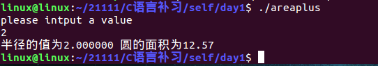
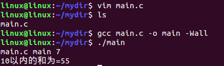
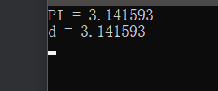

[toc]

# 1 C语言编译过程

预处理、编译、汇编、链接

```c
gcc -E hello.c -o hello.i		// 1.预处理
gcc -S hello.i -o hello.s		// 2.编译
gcc -c hello.s -o hello.o		// 3.汇编
gcc hello.o -o hello_elf		// 4.链接
```

1. 预编译

   将.c中的头文件展开、宏展开

   生成的文件是.i文件

2. 编译

   将预处理之后的.i文件生成.s汇编文件

3. 汇编

   将.s汇编文件生成.o目标文件

4. 链接

   将.o文件链接成目标文件

# 2 编译器--gcc

在windows操作系统下，编译工具用集成开发环境vc6.0

在linux操作系统下没有很好的集成开发环境让我们用，用的都是编译器gcc

程序的编译分为4个阶段，由`.c`到可执行程序

```c
#include <stdio.h>
// 定义一个宏
#define PI 3.1415926

float area(float r);
// 功能通过键盘输入一个半径，求圆的面积
int main(int argc, const char *argv[])
{
    // 定义一个float变量存储输入的半径r
    float r;
    // 输出提示信息
    printf("please intput a value\n");
    // 从键盘键入一个半径r
    scanf("%f", &r);
    // 输出信息输出半径，以及半径圆的面积
    printf("半径的值为%f 圆的面积为%.2f\n", r, area(r));
    return 0;
}

// 定义一个求面积的函数
float area(float r)
{
    // 定义一个面积的变量
    float area;
    // 根据半径求面积值
    area = PI * r * r;
    // 返回面积值
    return area;
}
```

1. 预处理：借助于预处理器，将源文件展开成C源文件，只会将头文件展开，宏替换掉，注释去掉，==**不做正确性检查**==。

   ```
   gcc -E 文件名.c -o 文件名.i
   ```

   预编译产生的`.i`文件

   ```c
   /* 省略<stdio.h>头文件的展开内容 */
   float area(float r);
   
   int main(int argc, const char *argv[])
   {
   
    float r;
   
    printf("please intput a value\n");
   
    scanf("%f",&r);
   
    printf("半径的值为%f 圆的面积为%.2f\n",r,area(r));
    return 0;
   }
   float area(float r)
   {
      float area;
      area = 3.1415926*r*r;
      return area;
   }
   ```

2. 编译：借助编译器，将 C源文件编译成汇编文件

   ```
   gcc -S 文件名.i -o 文件名.s
   ```
   
3. 汇编：汇编借助于汇编器，将汇编文件编译成机器文件(OBJ格式)

   ```
gcc -c 文件名.s -o 文件名.o
   ```

   机器文件--部分，人看不懂。

4. 链接：将==**多个机器文件**==共同参与链接，生成一个==**可执行文件**==

   ```
   gcc 文件名.o -o 文件名
   ```
   
   

## 2.1 编译程序

1. 一步到位

   ```shell
   gcc hello.c		# 默认会生成一个名为a.out的可执行文件
   gcc hello.c -o hello	# 加 -o 参数生成指定名称的可执行文件
   # 运行程序:	./a.out	or ./hello
   ```

   ```c
   #include <stdio.h>
   
   int sum(int a);
   
   int main(int argc, const char *argv[])
   {
   	printf("%s %s %d\n",__FILE__,__FUNCTION__,__LINE__);
   	printf("10以内的和为=%d\n",sum(10));
   	return 0;
   }
   
   int sum(int a)
   {
   	int i,sum = 0;
   	for(i = 0;i <= a;i++)
   	{
   		sum+=i;
   	}
   	return sum;
   }
   ```

   编译

   

   

2. 分步骤完成

   ```shell
   # 以test.c为例
   gcc -E test.c -o test.i		# 预处理
   gcc -S test.i -o test.s		# 编译
   gcc -c test.s -o test.o		# 汇编
   gcc test.o -o test		    # 链接
   ```

## 2.2 gcc一些参数解析

```shell
-shared 		# 指定生成动态链接库
-static			# 指定生成静态链接库
-fPIC			# 表示编译为位置独立的代码，用于编译共享库。目标文件需要创建成位置无关代码，概念上就是在可执行程序装载它们的时候，它们可以放在可执行程序的内存里的任何地方
-L.				# 表示要连接的库在当前目录中
-l				# 执行链接时需要的动态库。编译器查找动态连接库时有隐含的命名规则，即在给出的名字前面加上lib,后面加上.so来确定库的名称
-Wall			# 生成所有警告信息
-ggdb			# 此选项将尽可能的生成gdb的可以使用的调试信息
-g				# 编译器在编译的时候产生调试信息
-c				# 只激活预处理、编译和汇编，也就是把程序做成目标文件（.o文件）
-Wl,option		# 把参数（options）传递给链接器ld。如果option中间有逗号，就会将options分成多个选项，然后传递给链接程序
```

# 3 include--库文件--自定义头文件

```c
#include <>			// 用尖括号包含头文件，在系统指定的路径下找头文件。编译器从标准库路径开始搜索头文件
#include ""			// 用双引号包含头文件，先在当前目录下找头文件，找不到，再到系统指定的路径下找。编译器从用户的工作路径开始搜索头文件
```

## 3.1 注意

include 经常用来包含头文件，可以包含.c文件，但是尽量不要包含.c。因为include包含的文件会在预编译被展开，如果一个.c被包含多次，展开多次，会导致函数重复定义。所以不要包含.c文件。

预处理只是对include等预处理操作进行处理并不会进行语法检查。这个阶段有语法错误也不会报错，第二个阶段即编译阶段才进行语法检查。

# 4 define

定义宏用define去定义

==**宏是在预编译的时候只进行替换。**==

## 4.1 不带参宏

```c
#define PI 3.14		// 在预编译的时候如果代码中出现了PI就用3.14去替换。
```

宏的好处：只要修改宏定义，其他地方在预编译的时候就会重新替换。

注意：宏定义后边不要加分号。

```c
#include <stdio.h>

// 宏定义的好处是只要改变了定义的常量表达式，则代码中只要使用这个宏定义的位置都会改变
#define PI 3.1415926

int main(int argc, char *argv[])
{
    printf("PI = %lf\n",PI);
    double d = PI;
    printf("d = %lf\n",d);
    return 0;
}
```

执行结果：



宏定义的作用范围，从定义的地方到本文件末尾。

```c
// 如果想在中间终止宏的定义范围
#undef PI		// 终止PI的作用
```

## 4.2 带参宏

```c
#define S(a,b) a*b
```

注意带参宏的形参a和b没有类型名。

S(2,4)将来在预处理的时候替换成实参替代字符串的形参，其他字符保留，2*4

```c
#include <stdio.h>

// 带参宏
// 带参宏类似于一个简单的函数，将函数的参数进行设置，就可以传递给对应的表达式

// #define S(a,b) a*b
// 带参宏1: 2 + 8 * 4 = 34
// S(2 + 8 , 4)被替换成2 + 4 * 8
// printf("%d\n",S(2 + 8 , 4));

#define S(a,b) ((a)*(b))

int main(int argc, const char *argv[])
{
    printf("%d\n",S(2,4));
    // 注意:宏定义只是简单的替换，不会自动加括号
    // 输出结果:
    // 带参宏1: 2 + 8 * 4 = 34
    // 带参宏2: ((2 + 8) * (4)) = 40
    printf("%d\n",S(2 + 8 , 4));
    return 0;
}
```

## 4.3 带参宏和带参函数的区别

1. 带参宏被调用多少次就会展开多少次，执行代码的时候没有函数调用的过程，不需要压栈弹栈。所以带参宏，是浪费了空间，因为被展开多次，节省时间。

2. 带参函数。代码只有一份，存在代码段，调用的时候去代码段取指令，调用的时候要压栈弹栈，有个调用的过程。所以说，带参函数是浪费了时间，节省了空间。

3. 带参函数的形参是有类型的，带参宏的形参没有类型名。

4. 如果功能实现的代码相对简单，并且不需要开辟太多的空间，可以选择使用带参宏，但是但多数情况都会使用函数。


|              | 带参宏       | 带参函数       |
| ------------ | ------------ | -------------- |
| 处理时间     | 编译时       | 运行时         |
| 参数类型     | 无           | 需定义         |
| 程序长度     | 变长         | 定长           |
| 占用存储空间 | 否           | 是             |
| 运行时间     | 不占运行时间 | 调用和返回时占 |

# 5 选择性编译

## 5.1 ifdef - else - endif

```c
#ifdef AAA
	// 代码段一
#else
	// 代码段二
#endif
```

```
如果在当前.c文件中	ifdef上边定义过AAA，就编译代码段一，否则编译代码段二

注意和if...else语句的区别，if...else语句都会被编译，通过条件选择性执行代码而选择性编译，只有 一段代码 被编译。
```

```c
#include <stdio.h>

// 如果定义了AAA则打印hello kitty
// 如果未定义AAA则打印hello lit.edu
#define AAA

int main(int argc, const char *argv[])
{
    // AAA不能省略
#ifdef AAA
    printf("hello kitty\n");
#else
    printf("hello lit.edu\n");
#endif
    return 0;
}
```

## 5.2 ifndef - else -endif

```c
#ifndef AAA
	// 代码段1;
#else
	// 代码段2;
#endif
```

和第一种互补。==**这种方法，经常用在防止头文件重复包含。**==

常用于多文件编程中.h的第一行就是#ifndef，最后一行就是#endif

```c
#include <stdio.h>

// 如果定义AAA则打印hello lit.edu
// 如果未定义了AAA则打印hello kitty
#define AAA

int main(int argc, char *argv[])
{
    // AAA不能省略
    // 注意和ifdef不能混淆
#ifndef AAA
    printf("hello kitty\n");
#else
    printf("hello lit.edu\n");
#endif
    return 0;
}
```

## 5.3 if - else - endif

```c
// 表达式可以是一个具体的数字，或者式子
#if 表达式
	// 程序段一;
#else
	// 程序段二;
#endif
```

如果表达式为真，编译第一段代码，否则编译第二段代码

这种形式一般用于注释多行代码

```c
#if 0
	// ……
#endif
```

选择性编译都是在预编译阶段干的事情。

# 6 条件编译

作用：为了防止头文件被重复引用

```c
#ifndef	标号(一般为头文件大写)
#define	标号
/*
 * 1.引入库头文件
 * 2.宏定义
 * 3.结构体类型定义
 * 4.枚举定义
 * 5.函数声明
 * 一般不将头文件写入.h文件
 */
#endif
```

