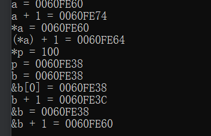

[toc]

# 1 指针的相关概念

操作系统给每个存储单元分配一个编号，从0x00 00 00 00 ~ 0xff ff ff ff

**这个编号称之为地址(地址常量)，指针就是地址。地址是一个指针常量。**


==**指针变量**==：是个变量，是个指针变量，即这个变量用来存放一个地址编号。在32位平台下，地址总线是32位的，所以地址是32位编号，所以指针变量是32位的即4个字节。

## 1.1 注意

1. 无论什么类型的地址，都是存储单元的编号，在32位平台下都是4个字节，即任何类型的指针变量都是4个字节的大小

2. 对应类型的指针变量，只能存放对应类型的变量的地址。比如整型的指针变量，只能存放整型变量的地址


## 1.2 扩展

```c
// 字符变量char ch;ch占1个字节,它有1个地址编号这个地址编号就是ch的地址;
// 整型变量int a; a占4个字节, 它占有4个字节的存储单元，有4个地址编号。
// 一个字节就是一个地址，地址中能存放8位的数据。
int a = 0x00 00 23 4f;
int a = 0000 0000 0000 0000 0010 0011 0100 1111;
```


# 2 指针的定义方法

## 2.1 简单的指针

```
存储类型 数据类型 *指针变量名;
```

```c
// 定义了一个指针变量p
int *p;
```

1. 分析

  存储变量：指针变量自身的存储类型

  数据类型：指针变量所指向的类型

  数据类型 *：指针自己的数据类型

  指针变量名：标识所定义的空间的名字（见名知意）

2. 注意

  ==**指针也是一种数据类型，只不过用来存储地址。**==

  在定义指针变量的时候 * 是用来修饰变量的，说明变量p是个指针变量。

  变量名是p。

3. 总结

  如何确定一个指针自身的数据类型：直接去掉变量名。

  如何确定指针所指向的类型：直接去掉*指针变量名

  如何确定一个指针访问空间大小：看指针所指向的数据类型。

## 2.2 关于指针的运算符

```
&	取地址
*	取值

&: 获取一个变量的地址
*: 在定义一个指针变量时，起到标识作用，标识定义的是一个指针变量。除此之外其他地方都表示获取一个指针变量保存的地址里面的内容
```


```c
#include <stdio.h>

int main(int argc, char *argv[])
{
    // 定义一个普通变量
    int a = 100;
    // 定义一个指针变量
    int *p;
    // 给指针变量赋值
    // 将a的地址保存到在p中
    p = &a;
    printf("a = %d %d\n",a,*p);
    printf("&a = %p %p\n",&a,p);
    return 0;
}
```

执行结果


### 2.2.1 扩展

如果在一行中定义多个指针变量，每个指针变量前面都需要加 * 来修饰

```c
// 定义了两个整形的指针变量p和q
int *p,*q;
// 定义了一个整形指针变量p,和整型的变量q	
int *q,p;
```

## 2.3 指针大小

==**在32位系统下，所有类型的指针都是4个字节**==

因为不管地址内的空间多大，但是地址编号的长度是一样的，所以在32位操作系统中，地址都是四个字节。

```c
#include <stdio.h>

int main(int argc, char *argv[])
{
    // 在32位系统下，所有类型的指针都是4个字节
    char *a;
    short *b;
    int *c;
    long *d;
    float *e;
    double *f;
    printf("sizeof(a) = %d\n",sizeof(a));
    printf("sizeof(b) = %d\n",sizeof(b));
    printf("sizeof(c) = %d\n",sizeof(c));
    printf("sizeof(d) = %d\n",sizeof(d));
    printf("sizeof(e) = %d\n",sizeof(e));
    printf("sizeof(f) = %d\n",sizeof(f));
    return 0;
}
```

执行结果


# 3 指针的分类

## 3.1 按指针指向的数据的类型来分

1. 字符指针

   字符型数据的地址
   
   ```c
   // 定义了一个字符指针变量，只能存放字符型数据的地址编号
   char *p;
   char ch;
   p = &ch;
   ```

2. 短整型指针

   ```c
   // 定义了一个短整型的指针变量p,只能存放短整型变量的地址
   short int *p;
   short int a;
   p = &a;
   ```

3. 整型指针

   ```c
   // 定义了一个整型的指针变量p,只能存放整型变量的地址
   int *p;
   int a;
   p = &a;
   ```
   
   注：多字节变量，占多个存储单元，每个存储单元都有地址编号，
   
   c语言规定:存储单元编号最小的那个编号，是多字节变量的地址编号。

4. 长整型指针

   ```c
   // 定义了一个长整型的指针变量p，只能存放长整型变量的地址
   long int *p;
   long int a;
   p = &a;
   ```

5. float型的指针

   ```c
   // 定义了一个float型的指针变量p,只能存放float型变量的地址
   float *p;
   float a;
   p = &a;
   ```

6. double型的指针

   ```c
   // 定义了一个double型的指针变量p,只能存放double型变量的地址
   double *p;
   double a;
   p = &a;
   ```

7. 函数指针

   ```c
   int (*p)(int);
   int func(int num1)
   {
       // 代码
       return 0;
   }
   p = func;
   ```

8. 结构体指针

   ```c
   // 假设已经有了struct stu的定义
   struct stu *s1;
   ```

9. 指针的指针 -- 二级指针

   ```c
   int **p;
   ```

10. 数组指针

    ```c
    int (*p)[5];

## 3.2 总结

==**无论什么类型的指针变量，在32位系统下，都是4个字节，只能从存放对应类型的变量的地址编号。和指针所指向的数据类型无关。**==

# 4 指针和变量的关系

指针可以存放变量的地址编号

在程序中，引用变量的方法

1. 直接通过变量的名称

   ```c
   int a;
   a = 100;
   ```

2. 可以通过指针变量来引用变量

   ```c
   // 在定义的时候，*不是取值的意思，而是修饰的意思，修饰p是个指针变量
   int *p;
   // 取a的地址给p赋值，p保存了a的地址，也可以说p指向了a
   p = &a;
   // 在调用的时候*是取值的意思，*指针变量 等价于指针指向的变量
   *p = 100;
   ```

   注：指针变量在定义的时候可以初始化

   ```c
   int a;
   // 用a的地址，给p赋值，因为p是指针变量
   int *p = &a;
   ```


指针就是用来存放变量的地址的。

```
* + 指针变量
就相当于指针指向的变量
```

指针变量只能保存开辟好空间的地址，不能随意保存地址。

```c
#include <stdio.h>

int main(int argc, char *argv[])
{
    int *p1,*p2,temp,a,b;
    p1 = &a;
    p2 = &b;
    printf("please input a and b:\n");
    // 给p1和p2指向的变量赋值
    // scanf语句格式
    // scanf("%d %d",&a,&b);
    // 此时的p1和p2就是变量a和b的地址
    scanf("%d %d",p1,p2);
    // 用p1指向的变量（a）给temp赋值
    temp = *p1;
    // 用p2指向的变量（b）给p1指向的变量（a）赋值
    *p1 = *p2;
    // temp给p2指向的变量（b）赋值
    *p2 = temp;

    printf("a = %d b = %d\n",a,b);
    printf("*p1 = %d *p2 = %d\n",*p1,*p2);
    return 0;
}
```

执行结果


## 4.1 扩展

对应类型的指针，只能保存对应类型数据的地址，如果想让不同的指针相互赋值的时候，需要强制类型转换。

```c
#include <stdio.h>

int main(int argc, char *argv[])
{
    // int型占4个字节，32位
    // int a = 0x00001234,b = 0x00005678;相当于int a = 0x1234,b = 0x5678;
    int a = 0x1234,b = 0x5678;
    // char型占1个字节，8位
    char *p1,*p2;
    // 输出的是整型的a,b
    printf("%#x %#x\n",a,b);
    // 将a的地址经过强制转换只有低8位赋值给char,
    // p1的低8位存储的是0x34,p2的低8位存储的是0x78
    p1 = (char *)&a;
    p2 = (char *)&b;
    printf("%#x %#x\n",*p1,*p2);
    // p1和p2经过++运算之后（这里的p1和p2是char类型）
    // p1的高8位存储的是0x12,p2的高8位存储的是0x56（这里的p1和p2是int类型）
    p1++;
    p2++;
    printf("%#x %#x\n",*p1,*p2);
    return 0;
}
```

执行结果


```c
// 内存分配空间
int a = 0x1234,b = 0x5678;
```


## 4.2 总结

1. **`* + 指针`取值，取几个字节，由指针类型决定的，指针为字符指针则取1个字节，指针为整型指针则取4个字节，指针为double型指针则取8个字节**

2. 指针++指向下个对应类型的数据

   **字符指针++，指向下个字符数据，指针存放的地址编号加1**
   
   **整型指针++，指向下一个整形数据，指针存放的地址编号加4**

# 5 指针和数组元素之间的关系

## 5.1 数组元素与指针的基本关系

变量存放在内存中，有地址编号，用户定义的数组，是多个类型相同且内存连续的变量的集合，每个变量都占内存空间，都有地址编号。指针变量当然可以存放数组元素的地址。

```c
int a[10];
// int *p = &a[0];
int *p;
// 指针变量p保存了数组a中第0个元素的地址，即a[0]的地址
p = &a[0];
// p = a;和p = &a[0];是一样的，因为数组名就是元素的的首地址即a[0]的地址
p = a;
```

## 5.2 数组元素的引用方法

1. `数组名[下标]`

   ```c
   int a[10];
   a[2] = 100;
   ```

2. 指针名加下标

   ```c
   int a[10];
   int *p;
   p = a;
   // 因为p和a等价,所以可以直接引用
   p[2] = 100;
   ```

   - 补充

     c语言规定：数组的名字就是数组的首地址，即第0个元素的地址，是个常量。

   - 注意

     p和a的不同，p是指针变量，而a是个常量，所以可以用等号给p赋值，但不能给a赋值。

   ```c
   // a++就是错误的，因为a是数组名是一个地址常量，常量不能改变
   int a[10];
   int *p;
   // p++是正确的，因为p是一个指针变量，且p++指向的是a[1]的地址
   p++;
   ```

3. 通过指针运算加取值的方法引用数组的元素

   ```c
   int a[10];
   int *p;
   p = a;
   // *(p + 2)也是可以的，相当于a[2] = 100
   // p是第0个元素的地址，p + 2是a[2]这个元素的地址
   // 对第二个元素的地址取值，即a[2]
   *(p + 2) = 100;
   ```

   ```c
   #include <stdio.h>
   
   int main(int argc, char *argv[])
   {
       // 数组名本来就是地址，而指针就是地址，故可以把数组名直接与指针等价
       int a[5] = {0,1,2,3,4};
       int *p;
       p = a;
       // 只要将数组名赋值给同类型的指针变量，则此时的指针变量与数组名可以用相同的方法操作数组
       printf("a[2] = %d\n",a[2]);
       printf("p[2] = %d\n",p[2]);
   
       // *(a + n)等价于*(p + n)等价于a[n]等价于p[n]
       printf("*(p+2) = %d\n",*(p+2));
       printf("*(a+2) = %d\n",*(a+2));
   
       printf("p = %p\n",p);
       printf("p+2 = %p\n",p+2);
       printf("&a[0] = %p\n",&a[0]);
       printf("&a[2] = %p\n",&a[2]);
       return 0;
   }
   ```

   执行结果

   

# 6 指针的运算

## 6.1 指针可以加一个整数

往下指几个它指向的变量，结果还是个地址

前提：指针指向数组的时候，加一个==整数==才有意义

```
p + N：代表向地址增大的方向移动N个数据类型的大小（+ N * sizeof(数据类型)）
p - N：代表向地址减小的方向移动N个数据类型的大小（- N * sizeof(数据类型)）
p++：代表向地址增大的方向移动1个数据类型的大小（+ 1 * sizeof(数据类型)）
p--：代表向地址减小的方向移动1个数据类型的大小（- 1 * sizeof(数据类型)）
```

```c
#include <stdio.h>

int main(int argc, char *argv[])
{
    // 指针可以加一个整数，往下指几个它指向的变量，结果还是个地址
    int a[10];
    int *p,*q;
    // p和q间隔8个字节(1个整型数据是4个字节，加2就相当于2 * 4 = 8字节)，
    // 意味着加一个整数最终移动的字节数与指针变量的类型也有关系
    p = a;
    q = p + 2;
    printf("p = %p\n",p);
    printf("q = %p\n",q);
    return 0;
}
```

执行结果


## 6.2 两个相同类型指针可以比较大小

**前提：只有两个相同类型的指针指向同一个数组的元素的时候，比较大小才有意义。**

`指向前面的元素的指针 < 指向后面元素的指针`

```c
#include <stdio.h>

int main(int argc, char *argv[])
{
    int a[10];
    int *p,*q,*t;
    // p = a;是指数组a的首地址即a[0]赋值给了指针p
    p = &a[1];
    q = &a[6];
    if (p < q)
    {
        printf("p < q\n");
    }else if(p > q)
    {
        printf("p > q\n");
    }else
    {
        printf("p = q\n");
    }
    // 做减法是求两个地址之间有几个元素
    printf("%d\n",q-p);
    return 0;
}
```

执行结果


## 6.3 两个相同类型的指针可以做减法

**前提：必须是两个相同类型的指针指向同一个数组的元素的时候，做减法才有意义。==做减法的结果是，两个指针指向的中间有多少个元素==**

```c
#include <stdio.h>

int main(int argc, char *argv[])
{
    int a[10];
    int *q,*w;
    q = &a[7];
    w = &a[3];
    // 做减法是求两个地址之间有几个元素
    printf("%d\n",q-w);
    return 0;
}
```

执行结果


## 6.4 两个相同类型的指针可以相互赋值

注意：只有相同类型的指针才可以相互赋值（void *类型的除外）

```c
#include <stdio.h>

int main(int argc, char *argv[])
{
    int a = 100;
    int *p,*q;
    // 加一个&(取地址符)就是把a的地址赋给了p
    p = &a;
    printf("a = %d %d\n",a,*p);
    q = p;
    printf("*q = %d\n",*q);
    *q = 999;
    printf("a = %d\n",a);
    return 0;
}
```

执行结果


# 7 指针数组

注意：==**一般遇到这样的叠词，本质就是后者**==

## 7.1 指针和数组的关系

1. 指针可以保存数组元素的地址

2. 可以定义一个数组，数组中有若干个相同类型指针变量，这个数组被称为指针数组

3. 指针数组的概念

  指针数组本身是个==数组==，是个指针数组，是若干个相同类型的指针变量构成的集合

## 7.2 指针数组的定义方法

```
类型说明符 * 数组名 [元素个数];
```

```c
// 定义一个整型的指针数组p,有10个元素p[0]~p[9],每个元素都是int *类型的变量
int *p[10];
p[1] = &a;
int b[10];
p[2] = &b[3];
// p[2]、*(p+2)是等价的，都是指针数组中的第2个元素。
```

## 7.3 指针数组的分类

```c
/* 字符指针数组 */				
char *p[10];

/* 短整型指针数组	 */
short int *p[10];

/* 整型的指针数组 */
int *p[10];

/* 长整型的指针数组 */
long int *p[10]

/* float型的指针数组 */
float *p[10]

/* double型的指针数组 */
double *p[10] 

/* 结构体指针数组 */
struct stu *p[10];

/* 函数指针数组 */
int (*p[10])(int);
```

```c
#include <stdio.h>

int main(int argc, char *argv[])
{
    // 大多数情况下，指针数组都用来保存多个字符串
    char *name[5] = {"Follow me","Basic","Greatwall","Fortran","Computer"};
    int i;
    for(i = 0;i < 5;i++)
    {
        printf("%s\n",name[i]);
    }
    return 0;
}
```

执行结果


# 8 指针的指针 -- 二级指针

指针的指针，即指针的地址。

定义一个指针变量本身指针变量占4个字节，指针变量也是地址编号。


```c
int a;
int *p;
p = &a;
// *p 等价于 a
int **q;
q = &p;
// *q 等价于 p
// **q 等价于 *p 等价于 a
int ***m;
m = &q;
// *(*(*m)) 等价于 a
```

注意：==**p q m都是指针变量，都占4个字节**==，都存放地址编号，只不过类型不一样而已。

```c
#include <stdio.h>

int main(int argc, char *argv[])
{
    int a = 100;
    // 定义一个一级指针
    // 一级指针用于保存普通变量的地址
    int *p = &a;
    // 定义一个二级指针
    // 二级指针用于保存一级指针的地址
    int **q = &p;
    printf("a = %d %d %d\n",a,*p,**q);
    printf("&a = %p %p %p\n",&a,p,*q);
    printf("&p = %p %p\n",&p,q);
    printf("&q = %p\n",&q);
    return 0;
}
```

执行结果


# 9 字符串和指针

## 9.1 字符串的概念

字符串就是以`\0` 结尾的若干的字符的集合。

## 9.2 字符串的存储形式

数组、字符串指针、堆

1. `char string[100] = "I love C!";`

   ```
   定义了一个字符数组string，用来存放多个字符，并且用"I love C!" 给string数组初始化，字符串"I love C!"存放在string中。
   输出：printf("%s\n", string);
   ```

2. `char *str = "I love C!";`

   **定义了一个指针变量str，只能存放字符地址编号，**
   
   **所以说I love C!这个字符串中的字符不能存放在str指针变量中。**
   
   **str只是存放了字符I的地址编号，"I love C!"存放在文字常量区。**

3. `char *str = (char *)malloc(10*sizeof(char));`

   动态申请了10个字节的存储空间，首地址给str赋值。
   
   使用==malloc==函数在堆区申请空间，将字符串拷贝到堆区
   
   ==**使用strcpy()函数需要添加头文件 #include <string.h>**==
   
   ==**使用malloc()函数需要添加头文件 #include <stdlib.h>**==
   
   ==`strcpy(str,"I love C");	//将字符串"I love C!"拷贝到str指向的内存里`==
   
   输出：`printf("%s\n",str);`
   

### 9.2.1 数组和指针的区别

```c
char str[20] = "hello";
char *str = "hello";
```

#### 9.2.1.1 本质区别

1. 相同点：在栈区开辟空间，分别开辟20个字节和4个字节。

2. 不同点：**数组完全存储所赋值的每一个字符（整个字符串）**

   **指针变量只存储字符串中的首元素的地址。**

#### 9.2.1.2 注意

==**字符串是存储在常量区的**==。但是==**数组中的每一个字符是完全拷贝了一份来自常量区的字符串**==。==**指针变量存储的是常量区中字符串的首地址**==，即指向了常量区,修改常量区的内容会引起段错误。

```c
char str[20] = "hello";
str[2] = 'w';		// 正确
char *str = "hello";
str[2] = 'k';		//错误，常量区内容是不能更改的

char str[20] = "hello";
str = "world";		// 错误，数组名是常量，不能被赋值
char *str = "hello";
str = "world";		// 正确
```

## 9.3 总结

### 9.3.1 可修改性

1. 栈和全局区内存中的内容是可修改的

   ```c
   char str[100] = "I love C!"
   str[0] = 'y'; 	// 正确可以修改的
   printf("%s\n",str);
   ```

2. 文字常量区的内容是不可修改的

   ```c
   char *str = "I love C!";
   // 定义了一个指针变量str，只能存放字符地址编号。
   // 所以说I love C! 这个字符串中的字符不能存放在str指针变量中。
   // str只是存放了字符I的地址编号，"I love C!"存放在文字常量区。
   *str = 'y';	// 错误，I存放在文字常量区，不可修改
   ```

3. 堆区的内容是可以修改的

   ```c
   #include <stdio.h>
   #include <stdlib.h>
   #include <string.h>
   
   int main(int argc, char *argv[])
   {
       char *buf_heap = (char *)malloc(15);
       strcpy(buf_heap,"hello world");
       printf("%s\n",buf_heap);
   
       // 动态申请了10个字节的存储空间，首地址给str赋值。
       char *str = (char *)malloc(10*sizeof(char));
       //将字符串"I love C!"拷贝到str指向的内存里
       strcpy(str,"I love C!");
       printf("%s\n",str);
       *(str + 2) = 'y';	//正确，可以，因为堆区内容是可修改的
       printf("%s\n",str);
   
       return 0;
   }
   ```
   
   执行结果
   
   

#### 9.3.1.1 注意

1. str指针指向的内存能不能被修改，要看str指向哪里

2. str指向文字常量区的时候，内存里的内容不可修改
3. str指向栈、堆、静态全局区的时候，内存的内容是可以修改的

### 9.3.2 初始化

1. 字符数组、指针指向的字符串：定义时直接初始化

   ```c
   char buf_aver[] = "hello world";
   char *buf_point = "hello world";
   printf("%s\n",buf_aver);
   printf("%s\n",buf_point);

2. 堆中存放的字符串不能初始化，只能使用`strcpy()、scanf()`赋值

   ```c
   // 使用strcpy需要添加头文件
   #include <string.h>
   char *buf_heap;
   buf_heap = (char *)malloc(15);
   strcpy(buf_heap,"hello world");
   scanf("%s",buf_heap);
   printf("%s\n",buf_heap);
   ```

### 9.3.3 使用时赋值

#### 9.3.3.1 字符数组

使用==scanf==或者==strcpy==

```c
char buf_aver[128];
// 错误，因为字符数组的名字是个常量
buf_aver = "hello kitty";
// 正确
strcpy(buf_aver,"hello kitty");
// 正确
scanf("%s",buf_aver);
```

#### 9.3.3.2 指向字符串的指针

```c
char *buf_point;
// 正确，buf_point指向另一个字符串, 指向的是字符串的首地址
buf_point = "hello kitty";
// 错误，只读，能不能复制字符串到buf_point指向的内存里取决于buf_point指向哪里
strcpy(buf_point,"hello kitty");
```

# 10 数组指针

## 10.1 二维数组

二维数组，有行，有列。二维数组可以堪称有多个一维数组构成，是多个一维数组的集合，可以认为二维数组的每一个元素是一个一维数组。

```c
int a[3][5];	// 定义一个3行5列的一个二维数组
// 可以认为二维数组a由3个一维数组构成，每个元素是一个一维数组。
// 数组名字是 数组的首地址，是第0个元素的地址，是个 常量，数组名字加1指向下个元素。
// 二维数组a中，a+1指向下个元素，即下一个一维数组，即下一行。二维数组的首地址可以理解为行地址，即第一行的地址
```

```c
#include <stdio.h>

int main(int argc, char *argv[])
{
    int a[3][5];

    // 地址是16进制表示的
    // 这个输出结果是0060FE64
    printf("a = %p\n",a);

    // 这个输出结果是0060FE78
    printf("a + 1 = %p\n",a+1);
    /* 输出结果解释:由于a是二维数组，故a+1指向下一个元素，而二维数组的元素就是若干个一维数组
    即指向下一个一维数组，即下一行。中间相差的字节数和数据类型以及列数都有关。
    此demo中间距离5个整型数据，故是4 * 5 = 20个字节
    而地址用16进制表示，0x0060FE78 - 0x0060FE64 = （十进制）（（7 - 6）* 16^1 + （8 - 4）* 16^0） = 20; */
    return 0;
}
```

执行结果


## 10.2 数组指针的概念

本身是个==指针==，指向一个数组，加1跳一个数组，即指向下个数组。也叫行指针。

==数组指针的作用就是可以保存二维数组的首地址。==

## 10.3 数组指针的定义方法

```
定义方法：
方法一: 存储类型 数据类型 (*指针变量名)[元素个数]
方法二: 指向的数组的类型 (*指针变量名) [指向的数组的元素个数]

数据类型：该指针所指向一维数组中元素的数据类型
数据类型 (*)[元素个数]：该指针自身的数据类型
数据类型 [元素个数]：该指针所指向的数据类型
```

```c
int (*p)[5];	// 定义了一个数组指针变量p,p指向的是整型的有5个元素的一维数组
// p+1往下5个整型，跳过一个有5个整型元素的一维数组
```

```c
#include <stdio.h>

int main(int argc, char *argv[])
{
    // 定义了一个3行5列的一个二维数组
    int a[3][5];
    // 定义一个数组指针变量p,p+1跳一个有5个整型元素的一维数组
    int (*p)[5];

    // 第0行的行地址
    printf("a = %p\n",a);
    // 第1行的行地址，a和a+1差20个字节
    // int是4个字节，一行有5个整型元素，即有5个int型数据，共20字节
    printf("a + 1 = %p\n",a+1);

    // 将二维数组的首地址，即二维数组的第0行地址赋给数组指针p
    p = a;

    printf("p = %p\n",p);
    // p+1跳一个有5个整型元素的一维数组
    printf("p + 1 = %p\n",p+1);

    return 0;
}
```

执行结果


## 10.4 数组指针的用法

```c
#include <stdio.h>

void function(int (*p)[5], int x, int y);
void test();

int main(int argc, char *argv[])
{
    test();
    return 0;
}

// 可以将二维数组的首地址传递到另一个函数里面，此时的函数的形参就需要定义为数组指针
// 如果单纯的给二维数组的某一个元素赋值，可以不用将二维数组的行数和列数进行传参
// 如果函数功能中需要用到二维数组时，即对二维数组进行操作可以传参
// 地址传参，传地址
void function(int (*p)[5],int x,int y)
{
    // 函数功能:将二维数组的行值和列值一样的元素赋值100,
    // 即a[0][0],a[1][1],a[2][2]……
    int i,j;
    for(i = 0;i < x;i++)
    {
        for(j = 0;j < y;j++)
        {
            // 注意C语言中`=`和`==`的区别，`=`是赋值，`==`是等于的意思。
            if(i == j)
            {
                p[i][j] = 100;
            }
        }
    }
}

void test()
{
    int i,j;
    int a[3][5] = {0};
    // 地址传参，传地址
    // 数组名就是一个地址
    function(a,3,5);
    for(i = 0;i < 3;i++)
    {
        for(j = 0;j < 5;j++)
        {
            printf("%d ",a[i][j]);
        }
        printf("\n");
    }
}
```

执行结果


## 10.5 各种数组指针的定义

1. 一维数组指针，加1后指向下一个一维数组

   ```c
   int (*p)[5];
   // 配合每行有5个int型元素的二维数组来用
   int a[3][5];
   p = a;
   ```

2. 二维数组指针，加1后指向下个二维数组

   ```c
   int (*p)[4][5];
   // 配合三维数组来用，三维数组中由若干个4行5列二维数组构成
   int a[3][4][5];
   // 这些三维数组，有个共同的特点，都是有若干个4行5列的二维数组构成
   p = a;
   ```

3. 三维数组指针，加1后指向下个三维数组

   ```c
   int (*p)[4][5][6];
   // p + 1跳一个三维数组
   // 什么样的三维数组啊？
   // 由4个5行6列的二维数组构成的三维数组
   // 配合: int a[7][4][5][6];
   ```

4. 四维数组指针，加1后指向下个四维数组，以此类推。。。。

## 10.6 容易混淆的内容

指针==数组==：是个数组，有若干个相同类型的指针构成的集合

```c
int *p[10];
// 数组p有10个int *类型的指针变量构成，分别是p[0] ~ p[9]
```

数组==指针==：本身是个指针，指向一个数组，加1跳一个数组

```c
int (*p)[10];
// p是个数组指针，p加1指向下个数组，跳10个整型
// 配合有若干行，有10列的整型数组使用
```

指针的==指针==：二级指针

```c
// p是指针的指针
int **p;
int *q;
p = &q;
```

### 10.6.1 数组指针和指针数组的区别

加()是数组指针，不加()是指针数组

### 10.6.2 注意

加()的不一定是数组指针，可能是函数指针变量

返回值类型 （*函数指针变量名）(形参列表);

```c
// 定义一个函数指针变量p,p指向的函数
int (*p)(int,int);

// 必须有一个整型的返回值，有两个整型参数
int max(int x,int y){}
int min(int x,int y){}

// 可以用这个p存放这类函数的地址
p = max;
p = min;
```

## 10.7 数组名字

### 10.7.1 数组名字取地址

==一维数组名字取地址，变成一维数组指针，即加1跳一个一维数组==

```c
int a[10];
// a + 1跳一个整型元素，是a[1]的地址
// a和a + 1相差一个元素，4个字节
// &a就变成了一个一维数组指针，是int (*p)[10]类型的
// (&a) + 1 和&a相差一个数组即10个元素即40个字节
```

### 10.7.2 数组名字和指针变量的区别

```c
int a[10];
int *p;
p = a;
```

1. 相同点

  a是数组的名字，是a[0]的地址，p=a即p也保存了a[0]的地址，即a和p都指向a[0]，所以在引用数组元素的时候，a和p等价。

2. 不同点

  - a是常量、p是变量

     可以用等号 '=' 给p赋值，但是不能用等号给a赋值。同时a也不能进行自增操作。

  - 对a取地址，和对p取地址结果不同

     ==因为a是数组的名字，所以对a取地址结果为数组指针。==

     p是个指针变量，所以对p取地址(&p)结果为指针的指针，即二级指针。


## 10.8 多维数组中指针的转换

在二维数组中，行地址取 * 不是取值意思，而是指针降级的意思，由行地址（数组指针）变成这一行第0个元素的地址。取 * 前后还是指向同一个地方，但是指针类型不一样了。

```c
#include <stdio.h>

// 二维数组的数组名降级问题
// 二维数组的数组名默认就是一个行指针，加1保存下一行的首地址
// 二维数组的数组名取*，表示地址的降级，意味着行指针降级为列指针，加1保存下一个元素的地址

// 一维数组的数组名默认是一个列指针，加1保存下一个元素的地址
// 一维数组的数组名取&,则是地址的升级，将列指针升级为行指针，加1保存下一行元素的首地址
// 为什么取&是升级呢？因为a是一维数组的名字，所以对a取地址结果为数组指针

int main(int argc, char *argv[])
{
    int a[3][5];
    printf("a = %p\n",a);
    printf("a + 1 = %p\n",a+1);
    // *a变成了第0行第0列元素的地址
    printf("*a = %p\n",*a);
    // 结果为第0行第1列元素的地址
    printf("(*a) + 1 = %p\n",(*a)+1);

    int b[10];
    // b就是一维数组的首地址，即b[0]的地址，
    b[0] = 100;
    int *p;
    p = b;
    // *p表示获取指针变量p保存地址里面的内容
    printf("*p = %d\n",*p);
    // p是数组b的首地址，即数组名，即数组的首地址
    printf("p = %p\n",p);
    printf("b = %p\n",b);
    printf("&b[0] = %p\n",&b[0]);

    // b加1表示的是下一个元素的地址，因为b表示的是元素的首地址，地址之间相差多少跟数据类型有关
    printf("b + 1 = %p\n",b+1);

    // 地址升级，本来是列指针（即对应类型所占字节数）
    // 现在变成了行指针（即对应类型一行所占的字节数）
    // 一行所指的是一维数组的个数
    printf("&b = %p\n",&b);
    // 加1意味着是下一行的地址，所加的 字节数 = 数据类型所占的字节数 * 一维数组的个数;
    printf("&b + 1 = %p\n",&b+1);

    return 0;
}
```

执行结果



# 11 指针与函数的关系

## 11.1 指针作为函数的参数

用户可以给一个函数传一个整型、字符型、浮点型的数据，也可以给函数传一个地址。

函数的传参方式：复制传参、地址传参、全局传参（几乎用不到）

### 11.1.1 复制传参 -- 传数值

```c
#include <stdio.h>


void function(int a,int b);
void test1();

// 函数的传参方式之复制传参，将实参的值传递给形参
// 不管形参怎么改变，跟实参都没有关系
// 因为形参是局部变量，只在定义的函数或者复合语句中有效
int main(int argc, char *argv[])
{
    test1();
    return 0;
}

void function(int a,int b)
{
    // 函数功能，交换两个数的位置
    // test1函数中的a,b和function函数中的a,b不一样
    // test1函数中的a,b是实参，且只在test1函数中有效
    // function函数中的a,b是形参，而且作用范围也是function函数内部
    // 不管test1函数中还是function函数中a,b都是局部变量
    int temp;
    printf("in function before:a = %d,b= %d\n",a,b);
    printf("&a = %p,&b = %p\n",&a,&b);
    printf("\n");
    temp = a;
    a = b;
    b = temp;
    printf("in function after:a = %d,b= %d\n",a,b);
    printf("&a = %p,b = %p\n",&a,&b);
    printf("\n");
}
void test1()
{
    // 函数功能，交换两个数的位置
    // test1函数中的a,b和function函数中的a,b不一样
    // test1函数中的a,b是实参，且只在test1函数中有效
    // function函数中的a,b是形参，而且作用范围也是function函数内部
    // 不管test1函数中还是function函数中a,b都是局部变量
    int a = 100,b = 20;
    printf("before function:a = %d,b = %d\n",a,b);
    printf("&a = %p,&b = %p\n",&a,&b);
    printf("\n");
    // 调用函数function
    function(a,b);
    printf("after function:a = %d,b = %d\n",a,b);
    printf("&a = %p,&b = %p\n",&a,&b);
}
```

执行结果


### 11.1.2 地址传参 -- 传地址

通过传实参地址的方式---》想要通过子函数中的形参引起实参的值发生改变，就需要将实参的地址传过去方可发生改变，否则，形参是无法改变实参的值。用到的思想就是:当形参为指针变量时，可以间接操作实参自身的空间。

```c
#include <stdio.h>


void function(int *a, int *b);
void test1();

// 函数的传参方式之地址传参:将实参的地址传递给形参，形参对保存的地址的内容
// 进行任何操作，实参的值也会跟着改变

int main(int argc, char *argv[])
{
    test1();
    return 0;
}

void function(int *a,int *b)
{
    // 函数功能，交换两个数的位置
    int temp;
    printf("in function:a = %d,b= %d\n",*a,*b);
    printf("&a = %p,&b = %p\n",a,b);
    printf("\n");
    temp = *a;
    *a = *b;
    *b = temp;
    printf("in function:a = %d,b= %d\n",*a,*b);
    printf("&a = %p,&b = %p\n",a,b);
    printf("\n");
}
void test1()
{
    int a = 100,b = 20;
    printf("before function:a = %d,b = %d\n",a,b);
    printf("&a = %p,&b = %p\n",&a,&b);
    printf("\n");
    // 调用函数function
    function(&a,&b);
    printf("after function:a = %d,b = %d\n",a,b);
    printf("&a = %p,&b = %p\n",&a,&b);
}
```

执行结果


### 11.1.3 注意

如果实参是一个==普通变量==，地址传参的话就需要形参是==一级指针==

如果实参是一个==一级指针==，地址传参的话就需要形参是一个==二级指针==，

以此类推......

## 11.2 传数组

将数组作为参数传递给函数，不存在复制传参还是地址传参，本质都是==地址传参==，因为数组名本身就是一个地址。所以在函数内部对数组进行改变，则函数执行完毕后，原本的数组也会改变，因为传递给函数的都是数组的地址

```c
#include <stdio.h>

void function1(int *p);
void test1();

void function2(int (*p)[4]);
void test2();

void function3(char **q);
void test3();

int main(int argc, char *argv[])
{
    printf("**********test1 result**************\n");
    test1();
    printf("**********test2 result**************\n");
    test2();
    printf("**********test3 result**************\n");
    test3();

    return 0;
}

// 传一维数组
//void function1(int p[])   //形式1
void function1(int *p)
{
    // p[2]就相当于a[2]
    printf("%d\n",p[2]);
    // *(p+3)就相当于a[3]
    printf("%d\n",*(p+3));
}

void test1()
{
    int a[10] = {1,2,3,4,5,6,7,8,9,10};
    function1(a);
}


// 传二维数组
//void function2(int p[][]) //形式1
void function2(int (*p)[4]) //形式2:通过数组指针
{
    // p[x][y] 等价于 *(*(p + x) + y)
    // p是一个行指针，p + x相当于将其定位到第x行
    // *(p + x)相当于降级为列指针
    // *(p + x) + y相当于将其定位到第x行第y列
    // *(*(p + x) + y)相当于将第x行第y列的值取出来
    printf("%d\n",p[0][2]);
    printf("%d\n",*(*(p + 1) + 2));
}

void test2()
{
    int a[2][4] = {1,2,3,4,5,6,7,8};
    function2(a);
}

// 传指针数组
void function3(char **q)	// 通过二级指针
{
    int i;
    for(i = 0;i < 3;i++)
    {
        printf("%s\n",q[i]);
    }
}

void test3()
{
    char *p[3] = {"hello","world","kitty"};
    function3(p);
}
```

执行结果


总结：当数组作为参数，会被认为是指针（会被退化为指针）。

## 11.3 指针函数 -- 指针作为函数的返回值

==指针函数本质是一个函数，只不过函数的返回值是一个指针==

```c
#include <stdio.h>

char *function1();
void test1();

int main(int argc, char *argv[])
{
    printf("**********test1 result**************\n");
    test1();

    return 0;
}


// 指针函数:指针作为函数的返回值
char *function1()
{
    // 栈区开辟空间会随着当前代码段的结束而释放空间
    // 局部变量
    // char str[100] = "hello world!";
    // 输出结果:p = (null)

    // 静态局部变量
    // 静态区的空间不会随之当前代码段的结束而释放空间
    static char str[100] = "hello world!";
    return str;
}

void test1()
{
    char *p;
    p = function1();
    printf("p = %s\n",p);
}
```

执行结果:


## 11.4 函数指针 -- 指针保存函数的地址

用户定义的函数，在运行程序的时候，会将函数的指令加载到内存的代码段，所以函数也有起始地址。

C语言规定：==函数的名字就是函数的首地址==，即函数的入口地址，用户就可以定义一个指针变量来存放函数的地址，这个指针变量就是函数的指针变量

### 11.4.1 函数指针变量的定义方法

`返回值类型 (*函数指针变量名)(形参列表)`

```c
// 定义一个函数指针变量p,p指向的函数
int (*p)(int,int);

// 必须有一个整型的返回值，有两个整型参数
int max(int x,int y){}
int min(int x,int y){}

// 可以用这个p存放这类函数的地址
p = max;
p = min;
```

### 11.4.2 调用函数的方法

1. 通过函数的名字去调函数（最常用的）

   ```c
   #include <stdio.h>

   int max(int x,int y)
   {
       if (x > y)
           printf("x > y\n");
       else if(x < y)
           printf("x < y\n");
       else
           printf("x = y\n");
   }
   int main()
   {
      int num;
      num = max(3,5);
   }
   ```

   执行结果

   

2. 可以通过函数指针变量去调用

   ```c
   #include <stdio.h>
   
   int max(int x,int y)
   {
       if (x > y)
           printf("x > y\n");
       else if(x < y)
           printf("x < y\n");
       else
           printf("x = y\n");
   }
   int main(int argc, char *argv[])
   {
      int num;
      int (*p)(int,int);
      // 类型必须相同
      p = max;
      num = p(3,5);
   }
   ```

   执行结果

   

### 11.4.3 函数指针数组

==函数指针数组：本质是一个数组，数组里面的每一个元素都是一个函数指针==

`返回值类型 (*函数指针变量名[函数指针的个数])(形参列表);`

`int (*p[10])(int,int);`

定义一个函数指针数组，有10个元素p[0] ~ p[9]，每个元素都是函数指针变量，指向的函数，必须有整型的返回值，两个整型参数。

```c
#include <stdio.h>

float add(float num1, float num2)
{
		float result = 0;
		result = num1 + num2;
		return result;
}
float sub(float num1, float num2)
{
		float result = 0;
		result = num1 - num2;
		return result;
}
float mul(float num1, float num2)
{
		float result = 0;
		result = num1 * num2;
		return result;
}
float div(float num1, float num2)
{
		float result = 0;
		result = num1 / num2;
		return result;
}


int main(int argc, const char *argv[])
{
		// 函数指针
		//	float (*p_fun)(float,float);
		//	p_fun = add;
		//	printf("sum = %.1f\n", p_fun(4,5));
		//	p_fun = sub;
		//	printf("sub = %.1f\n", p_fun(4,5));
		//	p_fun = mul;
		//	printf("mul = %.1f\n", p_fun(4,5));
		//	p_fun = div;
		//	printf("div = %.1f\n", p_fun(4,5));
		// 函数指针数组
		float (*p_fun[4])(float,float) = {add, sub, mul, div};
		printf("sum = %.1f\n", p_fun[0](4,5));
		printf("sub = %.1f\n", p_fun[1](4,5));
		printf("mul = %.1f\n", p_fun[2](4,5));
		printf("div = %.1f\n", p_fun[3](4,5));
		return 0;
}
```

result


### 11.4.4 函数指针最常用的地方

==**函数指针最常用的地方在于将一个函数作为参数传递给另一个函数的时候要使用函数指针将一个函数作为参数传递给另一个函数，将这个函数称之为回调函数**==

#### 11.4.4.1 [回调函数](./03_函数.md)

你到一个商店买东西，刚好你要的东西没有货，于是你在店员那里留下了你的电话，过了几天店里有货了，店员就打了你的电话，然后你接到电话后就到店里去取了货。在这个例子里，你的电话号码就叫回调函数，你把电话留给店员就叫登记回调函数，店里后来有货了叫做触发了回调关联的事件，店员给你打电话叫做调用回调函数，你到店里去取货叫做响应回调事件。

```c
#include <stdio.h>

int add(int x,int y)
{
    return x + y;
}

int sub(int x,int y)
{
    return x - y;
}

int mux(int x,int y)
{
    return x * y;
}

int dive(int x,int y)
{
    return x / y;
}

int sur(int x,int y)
{
    return x % y;
}

int progress(int (*p)(int,int),int a,int b)
{
    int ret;
    // 两者效果一样    ret = (*p)(a,b);
    ret = p(a,b);
    return ret;
}

int main(int argc, char *argv[])
{
    int num;
    num = progress(add,2,3);
    printf("num = %d\n",num);

    num = progress(sub,2,3);
    printf("num = %d\n",num);

    num = progress(mux,2,3);
    printf("num = %d\n",num);

    num = progress(dive,2,3);
    printf("num = %d\n",num);

    num = progress(sur,2,3);
    printf("num = %d\n",num);
    return 0;
}
```

执行结果


# 12 经常容易混淆的指针

## 12.1 指针数组和数组指针

1. ```c
   int *a[10];
   // 这是一个指针数组，数组a中有10个整型的指针变量a[0] ~ a[9]
   // 经常用来保存多个字符串
   ```

2. ```c
   int (*a)[10];
   // 这是一个数组指针，就是定义一个行指针，占4个字节，存地址编号，它指向一个数组，它加1的话，指向下个数组。
   // 可以将一个二维数组作为函数参数传参时，这个参数一般定义为数组指针
   // 配合每行有10个int型元素的二维数组使用
   int a[3][10];
   ```

3. ```c
   int **p;
   // 这是个指针的指针，保存指针变量的地址。它经常用在保存指针的地址;
   // 常见用法1:
   // 	int **p;
   //		int *q;
   //		p = &q;
   // 常见用法2:
   // 	int **p;
   //		int *q[10];
   // 分析:q是指针数组的名字，是指针数组的首地址，
   // 是q[0]的地址。q[0]是个int *类型的指针，所以q[0]指针变量的地址，是int **类型的。
   ```

## 12.2 指针函数和函数指针

1. ````c
   int *f(void);
   // 注意:*f没有用括号括起来。
   // 指针函数，返回值是一个整型的指针
   // 它是个函数的声明，声明这个函数返回值为int *类型的
   ````

2. ```c
   int (*f)(void);
   // 函数指针
   // 注意*f用括号括起来，*修饰f说明，f是个指针变量。f是个函数指针变量，
   // 存放函数的地址，它指向的函数必须有一个int型的返回值，没有参数
   ```

# 13 特殊指针

## 13.1 空类型的指针

```
char *类型的指针指向char型的数据
int *类型的指针指向int型的数据
float *类型的指针指向float型的数据

void *难道是指向void型的数据吗？
// 不是，因为没有void类型的变量

(void *)ptr 和(*(void **))ptr值是相同的
```

回顾：对应类型的指针只能存放对应地址的数据类型

==void *通用指针，任何类型的指针都可以给void *类型的指针变量赋值，主要也是用在函数的参数和返回值的位置。==

```c
int *p;
void *q;
q = p;	//是可以的，不用强制类型转换
```

有个函数叫==memset==

```c
/* 函数格式 */
void * memset(void *s,int c,size_t n);
/*
 * 功能:将s指向的内存前n个字节，全部赋值为c。
 * 说明:
 * 		memset可以设置字符数组、整型数组、浮点型数组的内容，所以第一个参数，
 * 		就必须是个通用指针。它的返回值是s指向的内存的首地址，
 * 		可能是不同类型的地址，所以返回值也得是通用指针
 */
```

注意：==**void *类型的指针变量，也是个指针变量，在32位系统下，占4个字节**==

## 13.2 NULL

空指针

```c
char *p = NULL;
```

编号为0的指针，这个空间是不允许操作的。

在p的四个字节中，存放的是0x00 00 00 00

一般NULL用在给指针初始化

注意：

​		系统已将编号为0的指针用宏定义处理为NULL。使用NULL时需要引用头文件#include <stdio.h>

## 13.3 野指针

指针指向不明确的指针，避免野指针的出现，一般在初始化是赋值为NULL即可。

注意：

​		如果不小心操作的空指针或者野指针，就会出现==**核心转储**==（段错误）

# 14 main函数传参

```c
int main(int argc, const char *argv[])
{
	return 0;
}
```

```c
#include <stdio.h>

int main(int argc, const char *argv[])
{
 int i;
	printf("%d\n",argc);
	for(i = 0;i < argc; i++)
	{
		printf("%s ",argv[i]);
	}
	putchar('\n');
	return 0;
}
```

执行结果


