[toc]

# 页面跳转

[const](#const)

# 1 字符串输入、输出函数 -- gets - puts

```c
// 头文件
#include <stdio.h>
// 函数定义
char *gets(char *_Buffer);
/*
 * 功能：
 *      从键盘输入---以回车结束的字符串写入字符数组中，并自动加'\0'
 * 说明：
 *      输入串长度应小于字符数组长度
 *      与scanf函数不同，gets函数并不以空格作为字符串输入结束标志
 */

// 函数定义
int puts(const char *_Str);
/*
 * 功能：
 *      向显示器输出字符串（输出完，换行）
 * 说明：
 *      字符数组必须以‘\0’结束
 * 返回值：
 * 		成功返回一个非负数
 *        失败返回EOF（-1）
 */
```

```c
#include<stdio.h>

int main(int argc, const char *argv[])
{
 	char s[5];
	gets(s);
	printf("s = %s\n",s);
	printf("**********\n");
	puts("$$$$$$$$");
	puts(s);

 	return 0;
}
```

执行结果

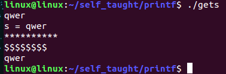

# 2 获取字符串长度函数 - strlen

```c
// 头文件
#include <string.h>
// 函数定义
size_t strlen(const char *_Str);

/*
 * 功能:计算一个字符串的长度
 * 参数:
 *      _Str:指定的字符串
 * 返回值:
 *      当前的字符串的长度
 * 注意:
 *      strlen获取的字符串长度遇到第一个'\0'结束且'\0'不算做字符串长度之中
 */
```

```c
#include <stdio.h>
#include <string.h>

int main(int argc,char *argv[])
{
    // 使用strlen函数获取字符串的长度
    // strlen获取的字符串的长度遇到第一个\0结束
    char a1[100] = "hel\0lo";
    printf("a1_len = %d\n",strlen(a1));
    printf("a1_size = %d\n",sizeof(a1));

    char *a2 = "hello";
    printf("a2_len = %d\n",strlen(a2));
    printf("a2_size = %d\n",sizeof(a2));
    return 0;
}
```

执行结果

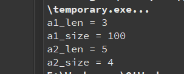

```c
/* 
 * sizeof是个关键字，测量数据的占用内存空间的大小
 * 如果测量的是数组的名字，则测的是数组占多少个字节
 * 如果sizeof测的是指针变量，则测的是指针变量本身占几个字节，32平台下结果为4
 *
 * strlen是个库函数，它测的是字符指针指向的字符串中字符的个数，
 * 不管指针是数组的名字还是指针变量
 */
```

# 3 字符串清空函数 - memset - bzero

   ```c
   /* 头文件 */
   #include <string.h>
   /* 函数格式 */
   void * memset(void *s, int c, size_t n);
   /*
    * 功能:
    * 		将s指向的内存前n个字节，全部赋值为c。
    * 说明:
    * 		memset可以设置字符数组、整型数组、浮点型数组的内容，所以第一个参数，
    * 		就必须是个通用指针。它的返回值是s指向的内存的首地址，
    * 		可能是不同类型的地址，所以返回值也得是通用指针
    */
   ```

```cpp
/* 头文件 */
#include <strings.h>
/* 函数格式 */
void bzero(void *s, size_t n);
/* 
 * 功能：
 *      将参数所指向的内存区域前n个字节，全部设为零
 *      相当于调用memset(void *s, 0, size_t n);
 * 参数：
 *      s:需要清零的字符串首地址
 *      n:需要清零的字节数
 * 返回值：
 *      无
 * 说明：建议使用memset()取代
 */
```

# 4 字符串拷贝函数 - strcpy

## 4.1 实现strcpy函数

```c
char *mystrcpy(char *dest, const char *src)
{
	// 入参判断
	if(dest == NULL || src == NULL)
	{
		return NULL;
	}
	// dest 和 src 指向同一片地址空间
	if(dest == src)
	{
		return dest;
	}
	char *ret = dest;
	while((*dest++ = *src++) != '\0');    // 实现strcpy
	return ret;
}
```

```c
// 头文件
#include <string.h>
// 函数定义
char *strcpy(char *_Dest, const char *_Source);

/*
 * 功能:将_Source复制给_Dest
 * 参数:
 *      _Dest:目的字符串
 *      _Source:源字符串
 * 返回值:
 *      保存_Dest字符串的首地址
 * 注意:
 *      使用此函数的时候，必须保证_Dest指向的空间足够大，否则会内存溢出
 *      strcpy是将_Source字符串中第一个\0之前，包括\0复制给_Dest
 */


// 头文件
#include <string.h>
// 函数定义
char *strncpy(char *_Dest, const char *_Source, size_t _Count);
/*
 * 函数的说明:
 *      将_Source指向的字符串前_Count个字节，拷贝到_Dest指向的内存中
 * 返回值:
 *      _Dest的首地址
 * 注意:
 *      1.strncpy不拷贝‘\0’
 *      2.如果_Count大于_Source指向的字符串中的字符个数，则在_Dest后面填充_Count - strlen(_Source)个‘\0’
 *		  3.注意是在_Dest后面的第(_Count + 1)个字符的位置追加'\0'，追加_Count - strlen(_Source)个‘\0’
 */
```

```c
#include <stdio.h>
#include <string.h>

int main(int argc,char *argv[])
{
    // 使用strcpy函数拷贝字符串
    char s1[32] = "hello world";
    // 使用strcpy函数时，必须保证第一个参数的内存足够大
    char s2[32] = "abcdefg";
    // strcpy函数是将s2的内容包括\0都复制到了s1中
    // 但是"abcdefg"的长度没有"hello world"长，
    // 故在s1的空间中超过s2的长度后还保存着之前s1的内容
    // 字符串结束的标志是第一个\0
    strcpy(s1,s2);
    printf("s1 = %s\n",s1);

    int i;
    for(i = 0;i < 32;i++)
    {
        printf("[%c] - %d\n",s1[i],s1[i]);
    }

    return 0;
}
```

执行结果

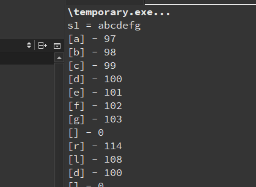

```c
#include <stdio.h>
#include <string.h>

int main(int argc,char *argv[])
{
    int len,i;
    char buf[100] = "aaaaaaaaaaaaaaaaaaaa";
    len = strlen(buf);
    // strncpy不拷贝‘\0’
    // 如果_Count大于_Source指向的字符串中的字符个数，则在_Dest后面填充_Count - strlen(_Source)个‘\0’
    // 注意是在_Dest后面的第_Count + 1个字符的位置追加'\0'，追加_Count - strlen(_Source)个‘\0’
    printf("len = %d\n",len);
    strncpy(buf,"helloworld",15);
    for(i = 0;i < len;i++)
        printf("%c",buf[i]);
    printf("\n");
}
```

执行结果

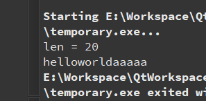

# 5 字符串追加函数 - strcat

```c
// 头文件
#include <string.h>
// 函数定义
char *strcat(char *_Dest, const char *_Source);

/*笔记:
* 功能:
*      将_Source追加到_Dest的后面
* 参数:
*      _Dest:目的字符串
*      _Source:源字符串
* 返回值:
*      保存_Dest字符串的首地址     
*/

// 函数定义
char *strncat(char *_Dest, const char *_Source, size_t _Count);
/*
* 追加_Source指向的字符串的前_Count个字符，到_Dest指向的字符串的后面
* 注意:如果_Count大于_Source的字符个数，
* 则只将_Source字符串追加到_Dest指向的字符串的后面追加的时候会追加‘\0’
*/
```

```c
#include<stdio.h>
#include<string.h>

int main(int argc,char *argv[])
{
  // 使用strcat函数追加字符串
  char s1[32] = "hello \0world";
  char s2[32] = "abcd\0ef";

  // strcat是从s1的第一个\0位置开始追加的直到s2的第一个\0复制完毕后结束
  // 验证了追加字符串的时候会追加\0
  strcat(s1,s2);
  printf("s1 = %s\n",s1);
  return 0;
}
```

执行结果

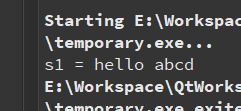

```c
#include<stdio.h>
#include<string.h>

int main(int argc,char *argv[])
{
  // 使用strncat函数追加字符串
  char s1[32] = "qwerty\0uiop";
  char *src = "asdff\0gh";
  // strncat是从s1的第一个\0位置开始追加的直到src的第一个\0前3个字符复制完毕后结束.
  // 如果追加的字符串长度大于第一个\0前的字符串长度，则追加src第一个\0前的内容
  // 验证了会追加\0
  strncat(s1,src,3);
  printf("s1 = %s\n",s1);
  return 0;
}
```

执行结果

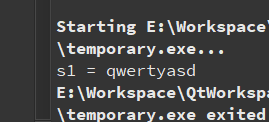

# 6 字符串比较函数 - strcmp

```c
// 头文件
#include <string.h>
// 函数定义
int strcmp(const char *_Str1, const char *_Str2);
int strncmp(const char *_Str1, const char *_Str2, size_t _MaxCount);

/*
 * 功能:
 *      strcmp是比较两个字符串的内容，strncmp是比较两个字符串的前_MaxCount个字节
 * 参数:
 *      _Str1、_Str2:要比较的两个字符串
 *      _MaxCount:strncmp中的参数要比较的字节数
 * 返回值:
 *      如果_Str1指向的字符串大于_Str2指向的字符串 返回1
 *      如果_Str1指向的字符串小于_Str2指向的字符串 返回-1
 *      如果_Str1指向的字符串等于_Str2指向的字符串 返回0
 */
```

```c
#include <stdio.h>
#include <string.h>
int main(int argc,char *argv[])
{
    char *str1 = "hello world";
    char *str2 = "hello kitty";
    // 比较两个字符串的大小，从第一个不一样的字符开始比较
    // 'w'的ASCII的值为119;'k'的ASCII的值为107，显然str1 > str2
    if( strcmp(str1,str2) == 0)
        printf("strcmp: str1 = str2\n");
    else if(strcmp(str1,str2) > 0)
        printf("strcmp: str1 > str2\n");
    else
        printf("strcmp: str1 < str2\n");

    // 比较前5个字符，前五个字符一样都是"hello"
    if( strncmp(str1,str2,5) == 0)
        printf("strncmp: str1 = str2\n");
    else if(strncmp(str1,str2,5) > 0)
        printf("strncmp: str1 > str2\n");
    else
        printf("strncmp: str1 < str2\n");
    return 0;
}
```

执行结果

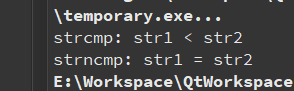

# 7 字符查找函数 - strchr

```c
// 头文件
#include <string.h>
// 函数定义
char *strchr(const char *_Str, int _Val);

/*笔记:
 * 功能:
 *      在字符指针_Str指向的字符串中，找ASCII码为_Val的字符
 * 参数:
 *      _Str:指定的字符串
 *      _Val:要查找的字符
 * 返回值:
 *      成功:找到的字符的地址
 *      失败:NULL
 * 注意:
 *      _Str指向的字符中有多个ASCII为_Val的字符，则找的是第一个字符
 */

// 函数定义
char *strrchr(const char *_Str, int _Ch);
/*
 * 函数说明:
 *      末次匹配
 *      在_Str指向的字符串中，找最后一次出现的ASCII为_Ch的字符
 * 返回值:
 *      末次配备的字符的地址
 */
```

```c
#include <stdio.h>
#include <string.h>

int main(int argc,char *argv[])
{
    // 使用strchr函数在一个字符串中查找字符
    char s[] = "hello kitty";
    // 找第一个匹配的字符
    // char *ret = strchr(s,107);

    /* strchr和strrchr函数中第二个参数是int类型的，为什么传字符可以呢？
     * printf("%c -ASCII %d\n",'a','a');
     * 输出结果为:a -ASCII 97
     * 表示字符'a'的整型值就是97,
     * 所以strchr和strrchr函数中第二个参数可以是字符型的数据或者整型数据都是可以的
     * 字符型的数据是要加'';比如strrchr(s,'l')；
     * 整型数据可以直接填写字符相对应的ASICC的值，比如strchr(s,107)
     * 注意:strchr和strrchr函数都是找ASCII码的
     */

    // 找最后一个匹配的字符
    char *ret = strrchr(s,'l');

    if(ret == NULL)
    {
        printf("no found\n");
    }
    else
    {
        printf("yes location %d\n",ret - s);
    }
    return 0;
}
```

执行结果

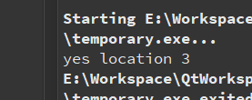

# 8 字符串匹配函数 - strstr

```c
// 头文件
#include <string.h>
// 函数定义
char *strstr(const char *_Str, const char *_SubStr);
/* 函数说明:
 *      在_Str指向的字符串中查找_SubStr指向的字符串，也是首次匹配
 * 返回值:
 *      找到了返回找到的字符串的首地址
 *      找不到返回NULL
 */
```

```c
#include <stdio.h>
#include <string.h>

int main(int argc,char *argv[])
{
    // 使用strstr函数在一个字符串中查找另一个字符串
    char s[] = "1234:4567:66:789:666:7777:6666";
    char *ret = strstr(s,"6666");
    if(ret == NULL)
    {
        printf("no found\n");
    }
    else
    {
        printf("yes location %d\n",ret - s);
    }
    return 0;
}
```

执行结果：
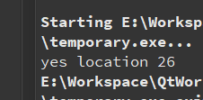

# 9 字符串转换数值 - atoi

```c
// 头文件
#include <stdlib.h>
// 函数定义
int atoi(const char *_Str);

/*
 * 功能:
 *      将一个数字型字符串转化为整形数据
 * 参数:
 *      _Str:指定的字符串
 * 返回值:
 *      获取到的整形数据
 */
```

```c
#include <stdio.h>
// 头文件
#include <stdlib.h>
int main(int argc,char *argv[])
{
    // 使用atoi将数字型字符串转化为整型数据
    char s1[] = "7856";
    int ret1 = atoi(s1);
    printf("ret1 = %d\n",ret1);

    // 使用atof将浮点型的字符串转化为浮点型数据
    char s2[] = "3.1415926";
    double ret2 = atof(s2);
    printf("ret2 = %lf\n",ret2);
    return 0;

}
```

执行结果

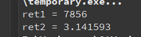

# 10 字符串切割函数 - strtok

```c
// 头文件
#include <string.h>
// 函数定义
char *strtok(char *_Str, const char *_Delim);
/*
 * 注意:
 *      如果_Str字符串中出现了连续的几个_Delim中的字符，则只将第一个字符变成‘\0’
 */

/*
 * 功能:
 *      对字符串进行切割
 * 参数:
 *      _Str:要切割的字符串
 *      第一次切割，就传入指定的字符串，后面所有次的切割传NULL
 *      _Delim标识符，要根据指定的_Delim进行切割，切割的结果不包含_Delim
 * 返回值:
 *      返回切割下来的字符串的首地址，如果都切割完毕，则返回NULL
 */
```

```c
#include <stdio.h>
#include <string.h>

int main(int argc,char *argv[])
{
    // 使用strtok函数切割函数
    // 每一次切割strtok函数的第二个参数可以不一样，但是功能是切割，
    // 这个标识符必须是第一个参数中有的标识符，不然就不能实现切割功能
    char s[] = "111:22222:3333:4444444:555555:666666:7777";
    // char s[] = "111:22222;3333;4444444;555555;66666;7777";
    char *ret;

    // 第一次切割
    ret = strtok(s,":");
    printf("ret = %s\n",ret);

    // 后面（第一次之后）所有切割都要将strtok的第一个参数传NULL
    // while((ret = strtok(NULL,";")) != NULL)
    while((ret = strtok(NULL,":")) != NULL)

    {
        printf("ret = %s\n",ret);
    }
    return 0;
}
```

执行结果

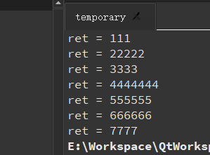

# 11 memcpy

```c
/* 头文件 */
#include <string.h>

/* 函数定义 */
void *memcpy(void *dest, const void *src, size_t n);
/*
 * 功能:
 * 		将src中的前n个字节中的内容拷贝到dest中
 * 参数:
 * 		dest:目的的指针指向的内存
 * 		src:源指针指向的内存
 * 		n:要拷贝的字节数
 * 返回值:
 * 		返回指向dest的指针
 * 注意：
 * 		与strcpy()不同的是，memcpy()会完整地复制n个字节，
 * 		不会因遇到字符串结束'\0'而结束。
 * 		指针src和dest所指向的内存区域不可重叠
 */
```

# 12 memset、memcpy、strcpy的区别

1. memset主要应用是初始化某个内存空间。

  用来对一段内存空间全部设置为某个字符，一般用在对定义的字符串进行初始化为`''`或`'\0'`。

2. memcpy是用于copy源空间的数据到目的空间中。

  用来做内存拷贝，你可以拿它拷贝任何数据类型的对象，可以指定拷贝的数据长度。

3. strcpy用于字符串copy，遇到'\0'，将结束。

  只能拷贝字符串了，它遇到'\0'就结束拷贝。

# 13 const

<a name = "const"></a>

1. 修饰普通变量，代表只读的意思

   ```c
   const int a = 100;	// 定义了一个只读变量a值为100
   ```

   以后在程序中不能再给a赋值了

   ```c
   a = 200;	// 是错误的，a只读
   ```

2. const修饰指针

   - `const char *str`==**常量指针**==
   
     和`char const *str`是一样的
   
     **==意思是str指向的内存的内容不能通过str来修改==**
     
     **==用来保护str指向的内存的内容==**
     
     **==但是str的指向是可以改变的==**
     
     ```c
     #include <string.h>
     char *strcpy(char *_Dest, const char *_Source);
     ```
   
   - `char *const str`==**指针常量**==
   
     ==**意思是str是只读的变量，str不能指向别的地方，但是str指向的内存的内容，是可以修改的**==
   
   - `const char *const str`
   
     ==**str不能指向别的地方，指向的内存的内容也不能通过str去修改**==

```c
#include <stdio.h>


// const修饰全局变量
// 此时全局变量只能使用但是不能修改
// 如果直接拿全局变量修改值，编译直接报错
// 如果使用全局变量的地址修改值，运行时程序异常结束
const int a = 100;
void function1()
{
    // 输出结果:a = 100
    printf("a = %d\n",a);

    // 修改a的值，编译直接报错
    // a = 666;
    // printf("a = %d\n",a);

    // 使用指针也就是地址修改值，程序异常结束
    // int *p = &a;
    // *p = 888;
    // printf("a = %d\n",a);

}


// const修饰普通局部变量
// 可以读取变量的值
// 不可以直接通过变量进行修改值，编译报错
// 可以通过变量的地址修改值
void function2()
{
    const int b = 100;

    // 输出结果:b = 100
    printf("b = %d\n",b);

    // 修改b的值，编译直接报错
    // b = 666;
    // printf("b = %d\n",b);

    // 输出结果:b = 888
    int *p = &b;
    *p = 888;
    printf("b = %d\n",b);

}


// const修饰指针变量
// 如果const修饰指针变量的类型，无法通过指针变量修改里面的值
// 如果const修饰指针变量，无法修改指针变量保存的地址
// 如果const既修饰指针变量的类型，又修饰指针变量，则只能通过原本变量修改值
void function3()
{
    int c = 100;
    /*
    //    int *p = &c;
    //    printf("*p = %d\n",*p);
    //    c = 666;
    //    printf("*p = %d\n",*p);
    //    *p = 777;
    //    printf("*p = %d\n",*p);
    //    int d = 888;
    //    p = &d;
    //    printf("*p = %d\n",*p);
    // 输出结果
    //    *p = 100
    //    *p = 666
    //    *p = 777
    //    *p = 888
    */

    /*
    // const修饰指针变量的类型
    //    const int *p = &c;
    //    printf("*p = %d\n",*p);
    //    c = 666;
    //    printf("*p = %d\n",*p);
    // 输出结果:
    //    *p = 100
    //    *p = 666

    // 如果const修饰指针变量的类型，无法通过指针变量修改里面的值
    //    *p = 777; // 出错位置
    //    printf("*p = %d\n",*p);
    //    int d = 888;
    //    p = &d;
    //    printf("*p = %d\n",*p);
    // 编译报错
    */

    /*
    // const修饰指针变量
    //    int * const p = &c;
    //    printf("*p = %d\n",*p);
    //    c = 666;
    //    printf("*p = %d\n",*p);
    //    *p = 777;
    //    printf("*p = %d\n",*p);
    // 输出结果:
    //    *p = 100
    //    *p = 666
    //    *p = 777

    //    int d = 888;
    // 如果const修饰指针变量，无法修改指针变量保存的地址
    //    p = &d; // 出错位置
    //    printf("*p = %d\n",*p);
    // 编译报错
    */

    /*
    // const既修饰指针变量的类型，又修饰指针变量
    // 如果const既修饰指针变量的类型，又修饰指针变量，则只能通过原本变量修改值
    //    const int * const p = &c;
    //    printf("*p = %d\n",*p);
    //    c = 666;
    //    printf("*p = %d\n",*p);
    // 输出结果:
    //    *p = 100
    //    *p = 666

    //    *p = 777;   // 出错位置
    //    printf("*p = %d\n",*p);
    //    int d = 888;
    //    p = &d; //  出错位置
    //    printf("*p = %d\n",*p);
    // 编译报错
    */
}


int main(int argc,char *argv[])
{
    // function1();
    // function2();
    function3();
    return 0;
}
```

