[toc]


# 1 结构体类型的概念和定义

## 1.1 基本概述

### 1.1.1 构造类型

不是基本类型的数据结构也不是指针，它是由若干个相同或者不同类型的数据构成的集合

常用的构造类型有数组、结构体、共用体、枚举

数组用于保存多个相同类型的数据

结构体用于保存多个不同类型的数据

## 1.2 结构体的概念

结构体是一种构造类型的数据结构，是一种或多种基本类型或构造类型的数据的集合。

## 1.3 结构体类型的定义

### 1.3.1 先定义结构体类型，再去定义结构体变量

```c
// ;是必须的
struct 结构体类型名{
// 成员列表
};
```

````c
struct stu{
    int num;
    char name[30];
    char sex;
};
// 有了结构体类型之后，就可以用类型定义变量了
// 定义了三个struct stu类型的变量，注意不要把struct省略，每个变量都有三个成员，分别是num,name,sex
struct stu lili,nihao,non;
````

### 1.3.2 在定义结构体类型的时候顺便定义结构体变量，以后还可以定义结构体变量

````c
struct 结构体类型名{
// 成员列表

}结构体变量1, 变量2;

struct 结构体类型名 变量3, 变量4;
````

```c
struct stu{
    // 成员列表
    int num;
    char name[20];
    char sex;
}lucy,bob,lili;

struct stu xiaoming,xiaohong;
```

#### 1.3.2.1 注意

一般结构体类型都会定义在全局，也就是main函数的外面。

所以在定义结构体类型的同时定义变量，这些变量一般都是全局变量。结构体中的变量不能赋值。

定义完类型之后定义的结构体变量内存分配要看定义的位置。

### 1.3.3 无名结构体的定义

在定义结构体类型的时候，没有结构体类型名，顺便定义结构体变量。

因为没有类型名，所以以后不能再定义相关类型的数据了。

```c
struct {
// 成员变量
}结构体变量1,变量2;
```

#### 1.3.3.1 注意

无名结构体由于没有结构体名，所以定义完之后是无法再定义结构体变量的，只能在定义类型的同时定义结构体变量。

```c
struct {
   int num;
   char name[20];
   char sex;
}lucy,bob;
```

### 1.3.4 给结构体类型取别名

通常将一个结构体类型重新起个类型名，用新的类型名代替原先的类型

```c
typedef struct 结构体类型名{
// 成员列表
}重新定义的结构体类型名A;
```

#### 1.3.4.1 注意

typedef主要用于给一个类型取别名，此时相当于给当前结构体重新起一个类型名为A。

相当于struct结构体名，所以如果结构体要起别名，一般不需要先给结构体定义名字，定义结构体变量时，直接使用A即可，不用加struct。

```c
typedef struct stu{
   int num;
   char name[20];
   char sex;
}STU;
STU student1,student2;
// 以后STU就相当于stu
// STU lucy; 等价于 struct stu lucy; 所以可以不指定stu这个名字
```

# 2 结构体变量的定义初始化及使用

## 2.1 结构体变量的定义和初始化

结构体变量。是个变量，这个变量是若干个数据的集合

### 2.1.1 注意

1. 在定义结构体变量之前首先得有结构体类型，然后再定义变量。
2. 在定义结构体变量的时候，可以顺便给结构体变量赋初值，被称为结构体的初始化。
3. 结构体变量初始化的时候，按各个成员顺序初始化。

```c
#include <stdio.h>

// 定义结构体类型
struct stu{
    int id;
    char name[32];
    char sex;
    int age;
    // 定义结构体变量之定义定义结构体类型的同时定义结构体变量
}zhangsan,lisi = {1001,"李四",'B',25};

// 使用typedef对结构体类型取别名
typedef struct{
  int a;
  int b;
  int c;
}MSG;

int main(int argc,char *argv[])
{
    // 定义结构体变量之类型定义完毕之后定义结构体变量
    struct stu wangwu;
    // 结构体变量初始化
    struct stu zhaoliu = {1002,"赵六",'B',20};
    printf("%d - %s - %c - %d\n",lisi.id,lisi.name,lisi.sex,lisi.age);
    printf("%d - %s - %c - %d\n",zhaoliu.id,zhaoliu.name,\
           zhaoliu.sex,zhaoliu.age);

    // 如果使用typedef对结构体类型取别名
    // 就无法在定义类型的同时定义结构体变量
    // 在定义结构体变量的时候不用加struct

    // 结构体中c定义的是整型数据，之后这里赋值是字符，如果打印的话
    // 'w' %d打印的就是字符的ASCII码;%c打印的就是字符w
    MSG msg1,msg2 = {100,200,'w'};
    printf("%d - %d - %d - %c\n",msg2.a,msg2.b,msg2.c,msg2.c);

    return 0;
}
```

执行结果

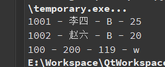

## 2.2 结构体变量的使用

```
// 结构体变量对成员的调用方式
结构体变量.结构体成员;
// 这地方说的结构体变量主要指的是普通结构体变量
```

### 2.2.1 结构体变量的简单使用

```c
#include <stdio.h>
#include <string.h>

// 定义结构体类型
struct stu{
	int id;
	char name[32];
	char sex;
	int age;
	// 定义结构体变量之定义定义结构体类型的同时定义结构体变量
}zhangsan,lisi = {1001,"李四",'B',25};

// 使用typedef对结构体类型取别名
typedef struct{
	int a;
	int b;
	int c;
}MSG;

int main(int argc,char *argv[])
{
	// 定义结构体变量之类型定义完毕之后定义结构体变量
	struct stu wangwu;
	// 结构体变量初始化
	struct stu zhaoliu = {1002,"赵六",'B',20};
	// 结构体变量的使用
	zhangsan.id = 1000;
	strcpy(zhangsan.name,"张三");
	zhangsan.sex = 'B';
	zhangsan.age = 27;
	printf("%d - %s - %c - %d\n",zhangsan.id,zhangsan.name,\
		zhangsan.sex,zhangsan.age);
	printf("%d - %s - %c - %d\n",lisi.id,lisi.name,lisi.sex,lisi.age);
	printf("%d - %s - %c - %d\n",zhaoliu.id,zhaoliu.name,\
		zhaoliu.sex,zhaoliu.age);

	// 如果使用typedef对结构体类型取别名
	// 就无法在定义类型的同时定义结构体变量
	// 在定义结构体变量的时候不用加struct

	// 结构体中c定义的是整型数据，之后这里赋值是字符，如果打印的话
	// 'w' %d打印的就是字符的ASCII码;%c打印的就是字符w
	MSG msg1,msg2 = {100,200,'w'};
	printf("%d - %d - %d - %c\n",msg2.a,msg2.b,msg2.c,msg2.c);

	return 0;
}
```

执行结果

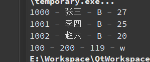

### 2.2.2 在结构体中嵌套结构体

```c
#include <stdio.h>
#include <string.h>

// 使用typedef对结构体类型取别名
typedef struct{
	int yaer;
	int month;
	int day;
}BIRTHDAY;

typedef struct{
	int id;
	char name[32];
	BIRTHDAY birthday;
}STU;


int main(int argc,char *argv[])
{
	STU xiaoming;
	xiaoming.id = 1001;
	strcpy(xiaoming.name,"小明");
	// 如果结构体中嵌套结构体，赋值时找到最内层的成员再进行赋值
	xiaoming.birthday.yaer = 2000;
	xiaoming.birthday.month = 12;
	xiaoming.birthday.day = 25;
	printf("%d - %s - %d-%d-%d\n",xiaoming.id,xiaoming.name,\
		xiaoming.birthday.yaer,xiaoming.birthday.month,xiaoming.birthday.day);

	// 嵌套的形式定义并初始化
	// STU xiaoli = {1002,"小丽",2010,1,1};   // 不用加{}也是可以的，顺序存储，会按照位置自动识别
	STU xiaoli = {1002,"小丽",{2010,1,1}};
	printf("%d - %s - %d-%d-%d\n",xiaoli.id,xiaoli.name,\
		xiaoli.birthday.yaer,xiaoli.birthday.month,xiaoli.birthday.day);

	return 0;
}
```

执行结果

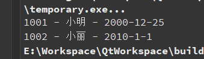

## 2.3 相同类型的结构体变量可以相互赋值

```c
#include <stdio.h>
#include <string.h>

struct stu{
	int id;
	char name[32];
	char sex;
	int age;
};


int main(int argc,char *argv[])
{
	struct stu zhangsan;
	zhangsan.id = 1001;
	strcpy(zhangsan.name,"张三");
	zhangsan.sex = 'B';
	zhangsan.age = 18;
	printf("%d - %s - %c - %d\n",zhangsan.id,zhangsan.name,\
		zhangsan.sex,zhangsan.age);

	// 相同类型的结构体变量之间可以直接赋值
	struct stu lisi;
	lisi = zhangsan;
	lisi.id = 1002;
	strcpy(lisi.name,"李四");
	printf("%d - %s - %c - %d\n",lisi.id,lisi.name,lisi.sex,lisi.age);

	return 0;
}
```

执行结果

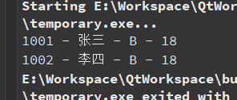

# 3 结构体数组

结构体数组本质是一个数组，由若干个相同类型的结构体变量构成的集合。

1. 结构体数组的定义方法

   ```
   struct 结构体类型名 数组名[元素个数];
   ```

   ```c
   struct stu{
     int id;
     char name[32];
     char sex;
     int age;
   };
   // 定义一个struct stu类型的结构体数组student,
   // 这个数组有3个元素分别是student[0],student[1],student[2]
   struct stu student[3];
   ```

2. 结构体数组元素的引用

   ```
   数组名[下标]
   ```

3. 结构体数组元素对成员的使用

   ```
   数组名[下标].成员
   ```

```c
#include <stdio.h>
#include <string.h>

typedef struct{
    int id;
    char name[32];
    float score;
}STU;


int main(int argc,char *argv[])
{
    // 定义一个结构体数组
    STU student[3] = {
        {101,"lucy",78},
        {102,"bob",59.5},
        {103,"tom",85}
    };
    int i,j;
    float sum = 0;
    for(j = 0;j < 3;j++)
    {
        printf("%d - %s - %.2f\n",student[j].id,student[j].name,\
               student[j].score);
    }
    for(i = 0;i < 3;i++)
    {
        sum += student[i].score;
    }
    printf("平均成绩为%.2f\n",sum / 3);
    return 0;
}
```

执行结果

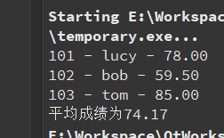

# 4 结构体指针

即结构体的地址，结构体变量存放内存中，也有起始地址。

定义一个变量来存放这个地址，那这个变量就是结构体指针变量。

1. 结构体指针变量的定义方法

   ```
   struct 结构体类型名 *结构体指针变量名;
   ```

2. 结构体指针变量对成员的引用

   ```c
   (*结构体指针变量).成员
   结构体指针变量名 -> 成员
   ```

   ```c
   #include <stdio.h>
   #include <stdlib.h>
   #include <string.h>
   
   struct stu{
       int id;
       char name[32];
       char sex;
       int age;
   };
   
   int main(int argc,char *argv[])
   {
       // 定义一个结构体指针变量
       struct stu *s;
       // 在堆区开辟结构体空间并将其地址保存在结构体指针变量中
       s = (struct stu *)malloc(sizeof(struct stu));
       s->id = 1001;
       strcpy(s->name,"张三");
       s->sex = 'B';
       s->age = 20;
       printf("%d - %s - %c - %d\n",s->id,s->name,s->sex,s->age);
   
       return 0;
   }
   ```

   执行结果

   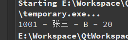

# 5 结构体内存分配问题

## 5.1 规则1：以多少个字节为单位开辟内存

```
给结构体变量分配内存的时候，会去结构体变量中找基本类型的成员
哪个基本类型的成员占字节数多，就以它的大小为单位开辟内存，在gcc中出现了double类型的例外。
1. 成员列表中只有char型数据，以1字节为单位开辟内存
2. 成员列表中出现了short类型数据，没有更大的字节数的基本类型数据，以2字节为单位开辟内存
3. 成员列表中出现了int、float没有更大字节的基本类型数据的时候以4字节为单位开辟内存
4. 成员列表中出现了double类型的数据
	在vc中以8字节为单位开辟内存
	在gcc里，以4字节为单位开辟内存
	无论那种环境，double型变量，占8个字节
5. 成员列表中如果在结构体中出现了数组，数组可以看成多个变量的集合。
6. 成员列表中如果出现了指针的话，没有占字节数更大的类型，以4个字节为单位开辟内存。
7. 在内存中存储结构体成员的时候，按定义的结构体成员的顺序存储
```

## 5.2 规则2：字节对齐

```
char		1字节对齐，即存放char型的变量，内存单元的编号是1的倍数即可
short        2字节对齐，即存放short int型的变量，起始内存单元的编号是2的倍数即可
int             4字节对齐，即存放int型的变量，起始内存单元的编号是4的倍数即可
long           在32位平台下，4字节对齐，即存放long int型的变量，起始内存单元的编号是4的倍数即可
float           4字节对齐，即存放float型的变量，起始内存单元的编号是4的倍数即可
double
	vc环境下
		8字节对齐，及存放double型变量的起始地址，必须是8的倍数，double变量占8字节
	gcc环境下
		4字节对齐，即存放double型变量的起始地址，必须是4的倍数，double变量占8字节
```

### 5.2.1 注意

当结构体成员中出现数组的时候，可以看成多个变量。

开辟内存的时候，从上向下依次按成员在结构体中的位置顺序开辟空间。

ex1：

```c
#include <stdio.h>

struct stu{
 short int id;
 char sex;
 float f;
}lucy;


int main(int argc,char *argv[])
{
 // 结构体变量lucy的字节数
 printf("lucy的字节数是 = %d\n",sizeof(lucy));
 printf("&id = %p\n",&(lucy.id));
 printf("&sex = %p\n",&(lucy.sex));
 printf("&f = %p\n",&(lucy.f));
 return 0;
}
// a的地址和b的地址差2个字节
// b的地址和c的地址差2个字节
```

执行结果

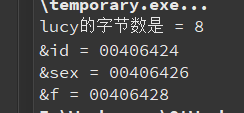

结果分析

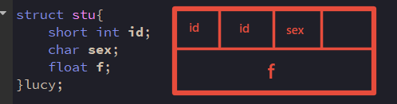

ex2：

```c
#include <stdio.h>

struct stu{
 char a;
 short int b;
 int c;
}lucy;


int main(int argc,char *argv[])
{
 // 结构体变量lucy的字节数
 printf("lucy的字节数是 = %d\n",sizeof(lucy));
 printf("&a = %p\n",&(lucy.a));
 printf("&b = %p\n",&(lucy.b));
 printf("&c = %p\n",&(lucy.c));
 return 0;
}
// a的地址和b的地址差2个字节
// b的地址和c的地址差2个字节
```

执行结果

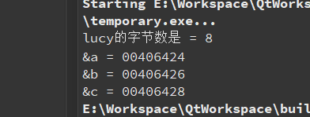

结果分析

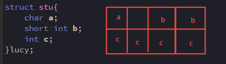

ex3:

```c
#include <stdio.h>

struct stu{
char a;
int b;
short int c;
}lucy;


int main(int argc,char *argv[])
{
// 结构体变量lucy的字节数
printf("lucy的字节数是 = %d\n",sizeof(lucy));
printf("&a = %p\n",&(lucy.a));
printf("&b = %p\n",&(lucy.b));
printf("&c = %p\n",&(lucy.c));
return 0;
}

// a的地址和b的地址差4个字节
// b的地址和c的地址差4个字节
```

执行结果

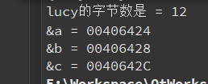

结果分析

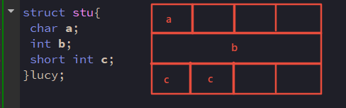

ex4:

```c
#include <stdio.h>

struct stu{
 char a[10];
 int c;
}lucy;


int main(int argc,char *argv[])
{
 // 结构体变量lucy的字节数
 printf("lucy的字节数是 = %d\n",sizeof(lucy));
 printf("&a = %p\n",lucy.a);
 printf("&c = %p\n",&(lucy.c));
 return 0;
}
// 数组a的地址和c的地址差12个字节
```

执行结果

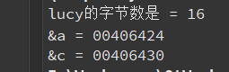

结果分析

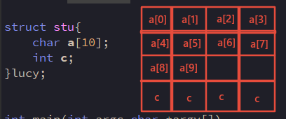

ex5:

```c
#include <stdio.h>

struct stu{
 char a;
 double s;
}lucy;

int main(int argc,char *argv[])
{
 // 结构体变量lucy的字节数
 printf("lucy的字节数是 = %d\n",sizeof(lucy));
 printf("&a = %p\n",&(lucy.a));
 printf("&s = %p\n",&(lucy.s));
 return 0;
}
// a的地址和s的地址差8个字节
```

执行结果

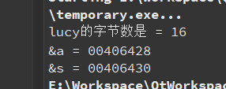

结果分析

说明qt是采用vc编译。

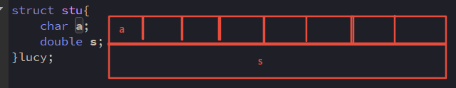

如果是gcc编译就是12个字节

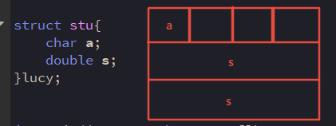

## 5.3 为什么要字节对齐？

用空间来换时间，提高CPU读取数据的效率

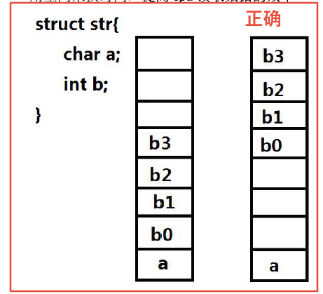

## 5.4 指定对齐原则

### 5.4.1 使用#pragam pack改变默认对齐原则

#### 5.4.1.1 格式

#pragam pack(value)时的指定对齐值value。

#### 5.4.1.2 注意

1. **==value只能是：1 2 4 8 等==**
2. **==指定对齐值与数据类型对齐值相比取较小值==**

1. 以多少个字节为单位开辟内存

   结构体成员中，占字节数最大的类型长度和value比较，取==**较小值**==为单位开辟内存
   
   ```c
   #include <stdio.h>
   
   // 以2个字节为单位开辟内存
   #pragma pack(2)
   struct stu{
    char a;
    int b;
   }lucy;
   
   
   int main(int argc,char *argv[])
   {
    // 结构体变量lucy的字节数
    printf("lucy的字节数是 = %d\n",sizeof(lucy));
    printf("&a = %p\n",&(lucy.a));
    printf("&b = %p\n",&(lucy.b));
    return 0;
   }
   // lucy的大小为6个字节
   // a的地址和b的地址差2个字节
   ```
   
   执行结果
   
   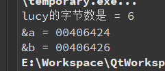
   
   ```c
   #include <stdio.h>
   
   // 以4个字节为单位开辟内存
   #pragma pack(4)
   
   struct stu{
    char a;
    int b;
   }lucy;
   
   
   int main(int argc,char *argv[])
   {
    // 结构体变量lucy的字节数
    printf("lucy的字节数是 = %d\n",sizeof(lucy));
    printf("&a = %p\n",&(lucy.a));
    printf("&b = %p\n",&(lucy.b));
    return 0;
   }
   // lucy的大小为8个字节
   // a的地址和b的地址差4个字节
   ```
   
   执行结果
   
   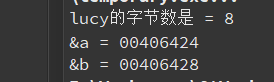

2. 字节对齐

   结构体成员中成员的对齐方法，各个默认的对齐字节数和value相比，取==**较小值**==
   
   ```c
   #include <stdio.h>
   
   // 以2个字节为单位开辟内存
   #pragma pack(2)
   
   struct stu{
    char a;
    int b;
   }lucy;
   
   
   int main(int argc,char *argv[])
   {
    // 结构体变量lucy的字节数
    printf("lucy的字节数是 = %d\n",sizeof(lucy));
    printf("&a = %p\n",&(lucy.a));
    printf("&b = %p\n",&(lucy.b));
    return 0;
   }
   // lucy的大小为6个字节
   // b成员是2字节对齐
   // a的地址和b的地址差2个字节
   ```
   
   执行结果
   
   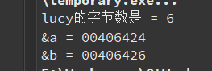
   
   ```c
   #include <stdio.h>
   
   // 以8个字节为单位开辟内存
   #pragma pack(8)
   
   struct stu{
    char a;
    int b;
   }lucy;
   
   
   int main(int argc,char *argv[])
   {
    // 结构体变量lucy的字节数
    printf("lucy的字节数是 = %d\n",sizeof(lucy));
    printf("&a = %p\n",&(lucy.a));
    printf("&b = %p\n",&(lucy.b));
    return 0;
   }
   // lucy的大小为8个字节
   // a和b都按原先的对齐方式存储
   // a的地址和b的地址差4个字节
   ```
   
   执行结果
   
   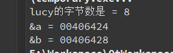

### 5.4.2 如果指定对齐值

```
#pragma pack(value)
value = 1: 则short、int、float等均为1
value = 2: 则char仍为1，short为2，int变为2
value = 4: 则char为1，short为2，int为4
value = 8: 则char为1，short为2，int为4
```

# 6 位段

在结构体中，以位为单位的成员，称之为位段（位域）

```c
#include <stdio.h>

struct packed_data{
 // 位段成员变量，不能对位段成员取地址
 unsigned int a:2;
 unsigned int b:6;
 unsigned int c:4;
 unsigned int d:4;
 // 无符号成员变量
 unsigned int i;
}data;


int main(int argc,char *argv[])
{
 // 结构体变量lucy的字节数
 printf("data的字节数是 = %d\n",sizeof(data));
 printf("&data = %p\n",&data);
 // 不能对位段成员取地址
 // printf("&a = %p\n",&(data.a));

 printf("&i = %p\n",&(data.i));
 return 0;
}
```

执行结果

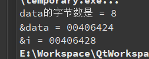

内存分配

| a    | b    | c    | d    |      | i    |
| :--- | :--- | :--- | :--- | :--- | :--- |
| 2    | 6    | 4    | 4    | 16   | 32   |

## 6.1 注意

==**不能对位段成员取地址**==

## 6.2 位段注意

1. 对于位段成员的引用如下：

   `data.a = 2;`
   
   赋值时，不要超出位段定义的范围；
   
   如段成员a定义为2位，最大值为3，即（11）3
   
   所以`data.a = 5`，就会取5的低两位进行赋值101，也就是把01赋给`data.a`,此时`data.a`打印出来的值就是1。

2. 位段成员的类型必须指定为整型或字符型

3. 一个位段必须存放在一个存储单元中，不能跨两个单元，第一个单元不能容纳下一个位段，则该空间不用，而从下一个单元起存放该位段。

   位段的存储单元：

   1. char型位段	存储单元是1个字节
   2. short int型的位段存储单元是2个字节
   3. int型的位段，存储单元是4个字节
   4. long int型的位段，存储单元是4个字节

   ```c
   #include <stdio.h>
   
   struct stu{
       char a:7;
       char b:7;
       char c:2;
   }temp;
   
   
   int main(int argc,char *argv[])
   {
   
       printf("temp = %d\n",sizeof(temp));
       return 0;
   }
   ```

   执行结果

   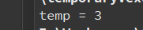

   结果分析

   ==**证明位段不能跨其存储单元存储**==

   注意

   不能取`temp.位段成员`的地址，因为位段成员可能不够一个字节，不能取地址。

4. 位段的长度不能大于存储单元的长度

   - char 型位段不能大于8位
   - short int型位段不能大于16位
   - int型的位段，位段不能大于32位
   - long int型的位段，位段不能大于32位(32位操作系统)
   
   ```c
   #include <stdio.h>
   
   struct stu{
       char a:9;
       char b:7;
       char c:2;
   }temp;
   
   
   int main(int argc,char *argv[])
   {
   
       printf("temp = %d\n",sizeof(temp));
       return 0;
   }
   // 分析:
   //     编译出错，位段a不能大于其存储单元的大小 
   ```

5. 如果一个位段要从另一个存储单元开始，可以定义：

   ```c
   #include <stdio.h>
   
   struct stu{
    	/*
        * 由于用了长度为0的位段，起作用是使下一个位段从下一个存储单元开始存放
        * 将a、b存储在一个存储单元中，c另外存储在下一个单元
        */
       unsigned char a:1;
       unsigned char b:2;
       unsigned char :0;
       unsigned char c:3;  // 另一个存储单元
   }temp;
   
   
   int main(int argc,char *argv[])
   {
   
       printf("temp = %d\n",sizeof(temp));
       return 0;
   }
   // 分析:
   //     编译出错，位段a不能大于其存储单元的大小
   ```

6. 可以定义无意义的位段，如：

   ```c
   unsigned a:1;
   unsigned :2;
   unsigned b:3;
   ```

# 7 共用体

共用体和结构体类似，也是一种构造类型的数据结构。

既然是构造类型的，得先定义出类型，然后用类型定义变量。

定义共用体类型的方法和结构体非常相似，把struct改成union就可以了。

在进行某些算法的时候，需要使用几种不同类型的变量存到同一段内存单元中，几个变量所使用的空间相互重叠。这种几个不同的变量公用占用同一段内存的结构，在C语言中，被称作"共用体"类型结构。

==**共用体所有成员占有同一段地址。**==

==**共用体的大小是其占内存长度最大的成员的大小。**==

## 7.1 共用体的特点

1. 同一内存段可以用来存放几种不同类型的成员，但每一瞬时只有一个成员变量起作用
2. 共用体变量中起作用的成员是最后一次存放的成员，在存入一个新的成员后原有的成员的值会被覆盖
3. 共用体变量的地址和它的各成员的地址都是同一地址
4. 共用体变量的初始化`union data a = {123};`初始化共用体为第一个成员

```c
#include <stdio.h>

typedef union{
    int a;
    int b;
    int c;
}TEMP;


int main(int argc,char *argv[])
{
    TEMP temp;
    temp.a = 100;
    printf("a = %d - b = %d - c = %d\n",temp.a,temp.b,temp.c);
    temp.b = 200;
    printf("a = %d - b = %d - c = %d\n",temp.a,temp.b,temp.c);
    temp.c = 400;
    printf("a = %d - b = %d - c = %d\n",temp.a,temp.b,temp.c);
    printf("temp = %d\n",sizeof(temp));
    return 0;
}
```

执行结果

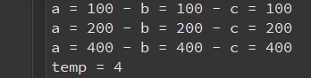

## 7.2 共用体判断大端序和小端序

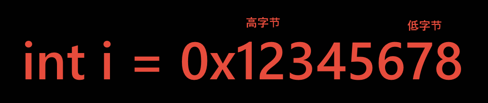

### 7.2.1 大端序

低字节存在高地址处。

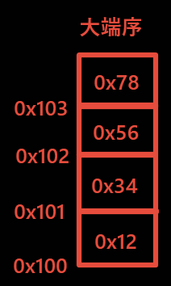

### 7.2.2 小端序

低字节存在低地址处。

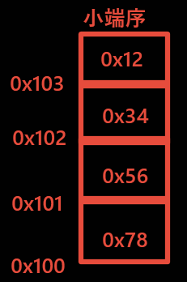

```c
#include <stdio.h>

union un
{
	int i;
	char c;
};


int main(int argc, const char *argv[])
{
	union un u1;
	u1.i = 0x12345678;
	if(0x78 == u1.c)
	{
		printf("小端序\n");	
	}
	else if(0x12 == u1.c)
	{
		printf("大端序\n");
	}
	return 0;
}
```

result

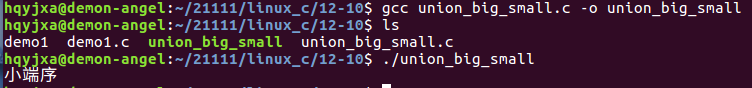

# 8 枚举

将变量的值---例举出来，变量的值只限于列举出来的值的范围内，枚举类型也是个构造类型。

## 8.1 枚举类型的定义

```c
enum 枚举类型名{
   枚举值列表;
};
// 在枚举值表中应列出所有可用值，也称为枚举元素
// 枚举变量仅能取枚举值所列元素
```

## 8.2 枚举变量的定义方法

```
enum 枚举类型名 枚举变量名;
```

```c
// 定义枚举类型week
enum week{
mon,tue,wed,thu,fri,sat,sun
};
// 枚举变量
enum week workday,weekday;
// workday与weekday只能取mon...sun中一个
weekday = mon;	// 正确
workday = tue;	// 正确
workday = abd;	// 错误，枚举值中没有abd
```

1. 枚举值是常量，不能在程序中用赋值语句再对它赋值

  ```c
  // 都是错误的
  sun = 5;
  mon = 2;
  sun = mon;
  ```

2. 枚举元素本身由系统定义了一个表示序号的数值

  ```
  默认是从0开始顺序定义为0, 1, 2...
  如在week中，mon值为0，tue值为1, ... , sun值为6
  ```

3. 可以改变枚举值的默认值

  ```c
  enum week{
  mon = 3,tue,wed,thu,fri = 4,sat,sun
  };
   /* 默认是从0开始，修改值之后后面的值也会改变，
       * 直到碰到另一个被修改的值，另一个修改的值之后的值也会跟着改变
       * 此时mon=3; tue=4; wed=5; thu=6; fri=4; sat=5; sun=6;
       */
  ```

  注意：在定义枚举类型的时候枚举元素可以用等号给它赋值，用来代表元素从几开始编号，在程序中，不能再次对枚举元素赋值因为枚举元素是常量

```c
#include <stdio.h>

typedef enum week{
    mon = 3,tue,wed,thu,fri = 4,sat,sun
}WEEKDAY;

int main(int argc,char *argv[])
{
    // 定义枚举类型的变量
    WEEKDAY weekday = mon;
    printf("day = %d\n",weekday);

    weekday = sat;
    printf("day = %d\n",weekday);

    return 0;
}
```

执行结果

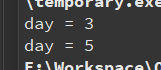

## 8.1 enum的空间大小

```c++
#include <iostream>
using namespace std;

enum 
{
	MOV,BIND,SHI,JIAN
}MYENUM;

int main()
{
	cout << "enum sizeof = " << sizeof(MYENUM) << endl;
	return 0;
}
```

result

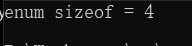

unubtu 14 32OS

```c
#include <stdio.h>

enum
{
	MOV,QWE,QBT,AK,UZI
}MYENUM;

int main(int argc, const char *argv[])
{
	printf("enum sizeof = %d\n",sizeof(MYENUM));     
 	return 0;
}
```

result

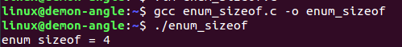


