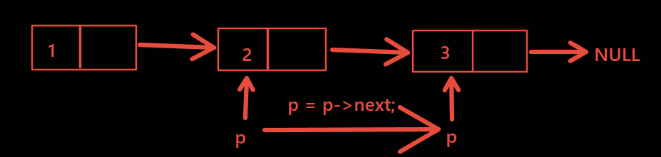

[toc]

# 1 链表的概念

## 1.1 定义

链表是一种==**物理存储上非连续**==，数据元素的逻辑顺序通过链表中的指针链接次序，实现的一种线性存储结构

## 1.2 特点

链表由一系列节点（链表中每一个元素称为节点）组成，节点在运行时动态生成（malloc）每个节点包括两个部分

- 一个是存储数据元素的数据域

- 另一个是存储下一个节点地址的指针域


## 1.3 链表的构成

第一个节点一般称为头节点---head


链表由一个个节点构成，每个节点一般采用结构体的形式组织，例如：


```c
typedef struct student{
    int num;
    char name[20];
    struct student *next;
}STU;
```

链表节点分为两个域：

- 数据域：存放各种实际的数据，如：num、score等。

- 指针域：存放下一节点的首地址，如：next；


## 1.4 链表的操作

创建、增、删、改、查

# 2 链表的操作

## 2.1 创建

第一步：创建一个节点


第二步：创建第二个节点，将其放在第一个节点的后面（第一个节点的指针域保存第二个节点的地址）


第三步：再次创建节点，找到原本链表中的最后一个节点，接着将最后一个节点的指针域保存新节点的地址，以此类推。


## 2.2 链表的遍历

第一步：输出第一个节点的数据域，输出完毕后，让指针保存后一个节点的地址


第二步：输出移动后地址对应的节点的数据域，输出完毕后，指针继续后移



第三步：以此类推，直到节点的指针域为NULL（即最后一个节点）

## 2.3 链表的释放

重新定义一个指针q,保存p指向节点的地址，然后p后移保存下一个节点的地址，然后释放q对应的节点，依次类推，直到p为NULL为止。


## 2.4 链表节点的查找

先对比第一个节点的数据域是否是想要的数据，如果是就直接返回，如果不是则继续查找下一个节点，如果到达最后一个节点的时候都没有匹配的数据，说明要查找的数据不存在。

## 2.5 链表节点的删除

如果链表为空，不需要删除。

如果删除的是第一个节点，则需要将保存链表首地址的指针保存第一个节点的下一个节点的地址。

如果删除的是中间的节点，则找到中间节点的前一个节点，让前一个节点的指针域保存这个节点的后一个节点的地址即可

## 2.6 链表中插入一个节点

链表中插入一个节点，按照原本链表的顺序插入，找到合适的位置


情况（按照从小到大）：

- 如果链表没有节点，则新插入的就是第一个节点

- 如果新插入的节点的数值最小，则作为头节点

- 如果新插入的节点的数组在中间位置，则找前一个，然后插入到他们中间

- 如果新插入的节点的数值最大，则插入到最后

## 2.7 链表排序

如果链表为空，不需要排序。

如果链表只有一个节点，不需要排序

**==先将第一个节点与后面所有的节点依次对比数据域，只要有比第一个节点数据域小的，则交换位置。==**

**==交换之后，拿新的第一个节点的数据域与下一个节点再次对比，如果比他小，再次交换，依此类推。==**

**==第一个节点确定完毕之后，接下来再将第二个节点与后面所有节点对比，直到最后一个节点也对比完毕为止。==**

## 2.8 链表逆序


第一次：将3节点移动到5节点的前面


第二次：将5节点后面的1节点移动到3节点的前面


```c
#include <stdio.h>
#include <stdlib.h>
#include <string.h>

// 定义节点结构体
typedef struct student
{
	// 数据域
	int num;	   // 学号
	int score;	   // 分数
	char name[20]; // 姓名
	// 指针域
	struct student *next;
} STU;

void link_creat_head(STU **p_head, STU *p_new);
void link_print(STU *head);
void link_free(STU **p_head);
STU *link_search_num(STU *head, int num);
STU *link_search_name(STU *head, char *name);
void link_delete_num(STU **p_head, int num);
void link_insert_num(STU **p_head, STU *p_new);
void link_order(STU *head);
STU *link_reverse(STU *head);

int main(int argc, char *argv[])
{
	STU *head = NULL, *p_new = NULL;
	int num, i;
	printf("请输入链表初始的个数:\n");
	scanf("%d", &num);
	for (i = 0; i < num; i++)
	{
		// 申请一个新节点
		p_new = (STU *)malloc(sizeof(STU));
		// 给新节点赋值
		printf("请输入学号、分数、名字:\n");
		scanf("%d %d %s", &p_new->num, &p_new->score, p_new->name);
		link_creat_head(&head, p_new); // 将新节点加入链表中
	}
	link_print(head);
	printf("*************************\n");
	head = link_reverse(head);
	//    link_order(head);
	link_print(head);
#if 0
	// 链表中插入一个节点
	while (1)
	{
		printf("请输入您要插入节点的num score name\n");
		p_new = (STU *)malloc(sizeof(STU)); // 申请一个新节点
		scanf("%d %d %s", &p_new->num, &p_new->score, p_new->name);
		link_insert_num(&head, p_new);
		link_print(head);
	}
#endif

#if 0
	// 删除一个节点
	printf("请删除您要删除的节点的学号\n");
	scanf("%d", &num);
	link_delete_num(&head, num);
	link_print(head);
#endif

#if 0
	// 按照学号查找
	STU *pb;
	while (1)
	{
		printf("请输入您要查找学生的学号\n");
		scanf("%d", &num);
		pb = link_search_num(head, num);
		if (pb != NULL)
		{
			printf("找到了num=%d score=%d name:%s\n", pb->num, pb->score, pb->name);
		}
		else
		{
			printf("没找到您要查找的学生（节点）\n");
		}
	}
#endif

#if 0
	// 按照姓名查找
	STU *pb;
	char name[32] = "";
	while (1)
	{
		printf("请输入您要查找学生的姓名\n");
		scanf("%s", name);
		pb = link_search_name(head, name);
		if (pb != NULL) // 找到了
		{
			printf("找到了num=%d score=%d name:%s\n", pb->num, pb->score, pb->name);
		}
		else
		{
			printf("没找到您要查找的学生（节点）\n");
		}
	}
#endif
	link_free(&head);
	return 0;
}

// 链表的创建
void link_creat_head(STU **p_head, STU *p_new)
{
	STU *p_mov = *p_head;
	// 当第一次加入链表为空时，head执行p_new
	if (*p_head == NULL)
	{
		*p_head = p_new;
		p_new->next = NULL;
	}
	else // 第二次及以后加入链表
	{
		while (p_mov->next != NULL)
		{
			// 找到原有链表的最后一个节点
			p_mov = p_mov->next;
		}
		// 将新申请的节点接入链表
		p_mov->next = p_new;
		p_new->next = NULL;
	}
	return;
}

// 链表的遍历
void link_print(STU *head)
{
	STU *p_mov;
	// 定义新的指针保存链表的首地址，防止使用head改变原本链表
	p_mov = head;
	// 当指针保存最后一个节点的指针域为NULL时，循环结束
	while (p_mov != NULL)
	{
		// 先打印当前指针保存节点的指针域
		printf("num:%d score:%d name:%s\n", p_mov->num, p_mov->score, p_mov->name);
		// 指针后移，保存下一个节点的地址
		p_mov = p_mov->next;
	}
	return;
}

// 链表的释放
void link_free(STU **p_head)
{
	// 定义一个指针变量保存头节点的地址
	STU *pb = *p_head;
	while (*p_head != NULL)
	{
		// 先保存p_head指向的节点的地址
		pb = *p_head;
		// p_head保存下一个节点地址
		*p_head = (*p_head)->next;
		free(pb);
		pb = NULL;
	}
}

// 链表的查找
// 按照学号查找
STU *link_search_num(STU *head, int num)
{
	STU *p_mov;
	// 定义的指针变量保存第一个节点的地址
	p_mov = head;
	// 当没有到达最后一个节点的指针域是循环继续
	while (p_mov != NULL)
	{
		// 如果找到的是当前节点的数据，则返回当前节点的地址
		if (p_mov->num == num) // 找到了
		{
			return p_mov;
		}
		// 如果没有找到，则继续对比下一个节点的指针域
		p_mov = p_mov->next;
	}
	// 当循环结束的时候都没有找到，说明要查找的数据不存在，返回NULL进行标识
	return NULL; // 没有找到
}

// 按照姓名查找
STU *link_search_name(STU *head, char *name)
{
	STU *p_mov;
	p_mov = head;
	while (p_mov != NULL)
	{
		if (strcmp(p_mov->name, name) == 0) // 找到了
		{
			return p_mov;
		}
		p_mov = p_mov->next;
	}
	return NULL; // 没有找到
}

// 链表节点的删除
void link_delete_num(STU **p_head, int num)
{
	STU *pb, *pf;
	pb = pf = *p_head;
	// 链表为空不用删
	if (*p_head == NULL)
	{
		printf("链表为空，没有您要删除的节点\n");
		return;
	}
	while (pb->num != num && pb->next != NULL) // 循环找要删除的节点
	{
		pf = pb;
		pb = pb->next;
	}
	if (pb->num == num) // 找到一个节点的num和num相同
	{
		if (pb == *p_head) // 要删除的节点是头节点
		{
			// 让保存头节点的指针保存后一个节点的地址
			*p_head = pb->next;
		}
		else
		{
			// 前一个节点的指针域保存要删除的后一个节点的地址
			pf->next = pb->next;
		}
		free(pb);
		pb = NULL;
	}
	else // 没有找到
	{
		printf("没有您要删除的节点\n");
	}
}

// 链表的插入:按照学号的顺序插入
void link_insert_num(STU **p_head, STU *p_new)
{
	STU *pb, *pf;
	pb = pf = *p_head;
	if (*p_head == NULL) // 链表为空链表
	{
		*p_head = p_new;
		p_new->next = NULL;
		return;
	}
	while ((p_new->num >= pb->num) && (pb->next != NULL))
	{
		pf = pb;
		pb = pb->next;
	}
	if (p_new->num < pb->num) // 找到一个节点的num比新来的节点num大，插在pb的前面
	{
		if (pb == *p_head) // 找到的节点是头节点，插在最前面
		{
			p_new->next = *p_head;
			*p_head = p_new;
		}
		else
		{
			pf->next = p_new;
			p_new->next = pb;
		}
	}
	else // 没有找到pb的num比p_new->num大的节点，插在最后
	{
		pb->next = p_new;
		p_new->next = NULL;
	}
}

// 链表的排序
void link_order(STU *head)
{
	STU *pb, *pf, temp;
	pf = head;
	if (head == NULL)
	{
		printf("链表为空，不用排序\n");
		return;
	}

	if (head->next == NULL)
	{
		printf("只有一个节点不用排序\n");
		return;
	}
	while (pf->next != NULL) // 以pf指向的节点为基准节点
	{
		pb = pf->next; // pb从基准元素的下个元素开始
		while (pb != NULL)
		{
			// 第一次循环的时候pf一直是第一个节点，
			// 在此循环中pf一直都在pb前面
			if (pf->num > pb->num)
			{
				// 如果pf->num > pb->num的话，交换pf和pb结构体的内容
				// 是所有的内容，包括数据域和指针域，
				// 执行完这三句语句之后pf在pb后面
				temp = *pb;
				*pb = *pf;
				*pf = temp;

				// 将pf的指针域和pb的指针域交换
				// 也就意味着pf在pb的前面
				temp.next = pb->next;
				pb->next = pf->next;
				pf->next = temp.next;
			}
			// 如果pf->num <= pb->num,pb的指针后移
			pb = pb->next;
		}
		// 第一个循环结束，第一个节点是链表中最小的一个，之后将链表的第二个节点给pf
		// 之后第二个节点与之后的所有节点比大小。直到pf指向NULL为止，即链表排序成功
		pf = pf->next;
	}
}

// 链表的逆序
STU *link_reverse(STU *head)
{
	STU *pf, *pb, *r;
	pf = head;
	pb = pf->next;
	while (pb != NULL)
	{
		r = pb->next;

		// 这条语句意思就是pb的指针域指向pf的地址
		// 可以理解为把pb提到pf的前面
		// 此时pb为第一个节点
		pb->next = pf;

		// 将pf又设置为头节点
		pf = pb;

		pb = r;
	}

	// 将传进来的首节点的地址赋为空
	head->next = NULL;
	// 将逆序之后的头节点的地址赋给head,返回head
	head = pf;
	return head;
}
```

遍历


查找


删除


插入


排序


逆序


# 3 双向链表的操作

节点


## 3.1 双向链表的创建和遍历

第一步：创建一个节点作为头节点，将两个指针域都保存NULL


第二步：先找到链表中的最后一个节点，然后让最后一个节点的指针域保存新插入节点的地址，新插入节点的两个指针域，一个保存上一个节点的地址，一个保存NULL


## 3.2 双向链表节点的删除

如果链表为空，则不需要删除

如果删除第一个节点，则保存链表首地址的指针保存后一个节点的地址，并且让这个节点的front保存NULL。

如果删除最后一个节点，只需要让最后一个节点的前一个节点的next保存NULL即可。

如果删除中间节点，则让中间节点的前后两个节点的指针域分别保存对方的地址即可


## 3.3 双向链表插入节点

按照顺序插入节点


```c
#include <stdio.h>
#include <stdlib.h>
#include <string.h>

// 定义节点结构体
typedef struct student
{
	// 数据域
	int num;	   // 学号
	int score;	   // 分数
	char name[20]; // 姓名
	// 指针域
	struct student *front; // 保存上一个节点的地址
	struct student *next;  // 保存下一个节点的地址
} STU;

void double_link_creat_head(STU **p_head, STU *p_new);
void double_link_print(STU *head);
void double_link_insert_num(STU **p_head, STU *p_new);

int main(int argc, char *argv[])
{
	STU *head = NULL, *p_new = NULL;
	int num, i;
	printf("请输入链表初始的个数:\n");
	scanf("%d", &num);
	for (i = 0; i < num; i++)
	{
		// 申请一个新节点
		p_new = (STU *)malloc(sizeof(STU));
		// 给新节点赋值
		printf("请输入学号、分数、名字:\n");
		scanf("%d %d %s", &p_new->num, &p_new->score, p_new->name);
		double_link_creat_head(&head, p_new); // 将新节点加入链表中
	}
	double_link_print(head);
	/* printf("请输入你要删除的节点的num\n");
	scanf("%d",&num);
	double_link_delete_num(&head,num);
	double_link_print(head);*/
	while (1)
	{
		p_new = (STU *)malloc(sizeof(STU)); // 申请一个新节点
		printf("请输入您要插入的节点的num score name\n");
		scanf("%d %d %s", &p_new->num, &p_new->score, p_new->name);
		double_link_insert_num(&head, p_new);
		double_link_print(head);
	}
	return 0;
}

void double_link_creat_head(STU **p_head, STU *p_new)
{
	STU *p_mov = *p_head;
	if (*p_head == NULL) // 当第一次加入链表为空时，head执行p_new
	{
		*p_head = p_new;
		p_new->front = NULL;
		p_new->next = NULL;
	}
	else // 第二次及以后加入链表
	{
		while (p_mov->next != NULL)
		{
			p_mov = p_mov->next; // 找到原有链表的最后一个节点
		}
		p_mov->next = p_new; // 将新申请的节点加入链表
		p_new->front = p_mov;
		p_new->next = NULL;
	}
}

void double_link_print(STU *head)
{
	STU *pb;
	pb = head;
	while (pb->next != NULL)
	{
		printf("num:%d score:%d name:%s\n", pb->num, pb->score, pb->name);
		pb = pb->next;
	}
	printf("num:%d score:%d name:%s\n", pb->num, pb->score, pb->name);
	printf("************************\n");
	while (pb != NULL)
	{
		printf("num:%d score:%d name:%s\n", pb->num, pb->score, pb->name);
		pb = pb->front;
	}
}

void double_link_delete_num(STU **p_head, int num)
{
	STU *pb, *pf;
	pb = *p_head;
	if (*p_head == NULL) // 链表为空，不需要删除
	{
		printf("链表为空，没有你要删除的节点\n");
		return;
	}
	while ((pb->num != num) && (pb->next != NULL))
	{
		pb = pb->next;
	}
	if (pb->num == num) // 找到一个节点的num和num相同，删除pb指向的节点
	{
		if (pb == *p_head) // 找到的节点是头节点
		{
			if ((*p_head)->next == NULL) // 只有一个节点的情况
			{
				*p_head = pb->next;
			}
			else // 有多个节点的情况
			{
				*p_head = pb->next; // main函数中的head指向下一个节点
				(*p_head)->front = NULL;
			}
		}
		else // 要删除的是其他的节点
		{
			if (pb->next != NULL) // 删除中间节点
			{
				pf = pb->front;			// 让pf指向找到的节点的前一个节点
				pf->next = pb->next;	// 前一个节点的next保存后一个节点的地址
				(pb->next)->front = pf; // 后一个节点的front保存前一个节点的地址
			}
			else // 删除尾节点
			{
				pf = pb->front;
				pf->next = NULL;
			}
		}
		free(pb);
	}
	else // 没找到
	{
		printf("没有找到您要删除的节点\n");
	}
}

void double_link_insert_num(STU **p_head, STU *p_new)
{
	STU *pb, *pf;
	pb = *p_head;
	if (*p_head == NULL) // 如果链表为空，新来的节点就是头节点
	{
		*p_head = p_new;
		p_new->front = NULL;
		p_new->next = NULL;
		return;
	}
	// 顺序插入节点
	// 新插入的节点的num比当前pb的num大，且pb不是最后一个节点
	while ((p_new->num >= pb->num) && (pb->next != NULL))
	{
		pb = pb->next;
	}
	if (p_new->num < pb->num) // 找到了一个pb的num比新来的节点的num大，插在pb前边
	{
		if (pb == *p_head) // 找到的节点是头节点，插在头节点的前边
		{
			p_new->next = *p_head;	  // 新插入的节点的next保存之前头节点的地址
			(*p_head)->front = p_new; // 之前头节点的front保存新插入的节点的地址
			p_new->front = NULL;	  //让原本保存链表首地址的指针把偶才能新插入节点的地址
		}
		else
		{
			pf = pb->front; // pf指向 找到节点的前一个节点

			p_new->next = pb;
			p_new->front = pf;
			pf->next = p_new;
			pb->front = p_new;
		}
	}
	else // 所有pb指向节点的num都比p_new指向的节点的num小，插在最后
	{
		pb->next = p_new;
		p_new->front = pb;
		p_new->next = NULL;
	}
}
```

创建和遍历


删除


插入


