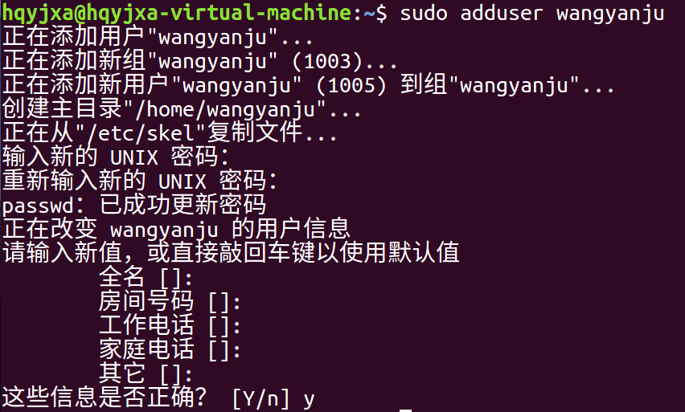

[toc]

# 1 linux系统简介

Linux系统是一个开源的操作系统，安卓就是基于Linux开发的。

linux系统是防照着unix系统开发出来的，ios操作系统就是基于unix开发的。

## 1.1 C语言和Linux发展史上最重要的四个人

### 1.1.1 肯尼斯·蓝·汤普森

（英语：Kenneth Lane Thompson，1943年2月4日－），小名为肯·汤普森（英语：Ken Thompson），生于美国新奥尔良。

原本是一个AT&T公司的员工，发明了B语言，发明了UNIX系统，发明了C语言（1973年）。

### 1.1.2 丹尼斯·里奇

Dennis MacAlistair Ritchie(1941年9月9日-2011年10月12日)，C语言之父，UNIX之父。

C语言之父，UNIX之父。

### 1.1.3 理查德·马修·斯托曼

（Richard Matthew Stallman, RMS），于1953年出生，自由软件运动的精神领袖、GNU计划以及自由软件基金会（Free Software Foundation）的创立者、著名黑客。

创办了自由软件基金会，这个基金会就是为了写一个开源的类UNIX的系统（GUN/Hurd），所以他被尊称为自由软件之父。

### 1.1.4 林纳斯·本纳第克特·托瓦兹

（Linus Benedict Torvalds，1969年12月28日- ），芬兰赫尔辛基人，著名的电脑程序员，Linux内核的发明人及该计划的合作者。

Linux之父。

linux文件系统是一个的树形分层组织结构。可以使用`tree`命令。

linux目录命令和存放标准FHS（Filesystem Hierarchy Standard）.

# 2 linux系统安装及使用

## 2.1 系统安装方式

### 2.1.1 物理机安装

可使用光驱、U盘（将镜像固化在U盘中）安装。

优点:对操作系统的体会更加真切方便。

缺点：刚刚接触Liunx的人无从下手，使用不太习惯。

### 2.1.2 虚拟机安装

在电脑上安装虚拟机，在虚拟机中安装操作系统。

优点：由虚拟机软件虚拟出一台或多台电脑，同时运行两个或者更多的操作系统，并进行数据交换，方便快捷。可同时操作windows的软件辅助学习。

缺点：性能相比物理机较差，它对物理机的性能，如内存，CPU、硬盘等要求较高。

## 2.2 虚拟机介绍及安装

### 2.2.1 虚拟机介绍

虚拟机可以说是一种软件，也可以说是一种技术，它允许你在一台主机上虚拟出多台计算机，每台虚拟的计算机都可以有自己的硬件及软件配置。

### 2.2.2 虚拟机技术的作用

1. 帮助网络架构工程师在一台电脑上模拟、检测整个网络运行情况。
2. 极大的降低企业的运营成本与风险。
3. 帮助操作系统设计者测试、解决问题。
4. 帮助开发者在多个平台上及进行自由切换。

### 2.2.3 应用较为广泛的虚拟机

1. virtual PC
2. Vmware
3. virtual box

## 2.3 Ubuntu在虚拟机中打开

安装过程省略。

## 2.4 Ubuntu桌面介绍

### 2.4.1 Ubuntu桌面

1. 从2010.10版本后，unity成为ubuntu默认桌面。
2. unity桌面环境打破了传统的GNOME面板配置。
3. 桌面左边包括一个启动器停靠栏和任务管理面板。

### 2.4.2 dash的使用

Unity桌面在左面的第一个位置上，设置一个dash home搜索栏，Ubuntu下所有的应用程序可通过搜索栏找到。

如果我们要打开终端，直接在dash中输入“terminal”或“终端”即可找到对应的软件，单击即可启动。

或者在桌面下鼠标右键选择打开终端。

快捷键打开终端：Ctrl + Alt + L

注意：中英文输入法切换是ctrl + space或者shift键

# 3 Linux系统的体系结构

1. Linuxshelll

   内核是操作系统的核心，具有很多最基本功能，如虚拟内存、多任务、共享库、需求加载、可执行程序和TCP/IP网络功能。Linux内核的模块分为以下几个部分：存储管理、CPU和进程管理、文件系统、设备管理和驱动、网络通信、系统的初始化和系统调用等。

2. Linux内核

   shell: 也是一个程序,作用: 提供了用户与内核进行交互操作的一种接口,提供给了我们一个界面,这个界面称为叫终端，称为命令解释器.

3. 文件系统

   文件系统是文件存放在磁盘等存储设备上的组织方法。Linux系统能支持多种目前流行的文件系统，如EXT2、EXT3、FAT、FAT32、VFAT和ISO9660。

4. 应用程序

   标准的Linux系统一般都有一套都有称为应用程序的程序集，它包括文本编辑器、编程语言、XWindow、办公套件、Internet工具和数据库等。

Linux操作系统的特点：

1. 开源：开放源代码

2. 多用户的：支持多个用户同时使用操作系统

3. 有实时版/非实时版

   实时操作系统：操作系统的响应速度是微秒级的

   非实时操作系统：操作系统的响应速度是毫秒级的

4. 多任务的

   支持并发（支持多个程序同时执行）

# 4 Linux软件管理

## 4.1 离线安装

```bash
sudo dpkg -i 包的全名		离线安装
sudo dpkg -r 包名			卸载
sudo dokg -P 包名			移除已安装软件包及配置文件
```

## 4.2 apt在线安装

```bash
sudo apt-get update			更新软件源
sudo apt-get install 包名		安装软件包
sudo apt-get clean			删除缓冲区所有已下载的软件包文件
sudo apt-get remove 包名		卸载软件包
```

## 4.3 软件源配置文件

`/etc/apt/sources.list` 列出了最合适的镜像站点地址
更改软件源

```
https://blog.csdn.net/lxlong89940101/article/details/89488461
```

1. 备份

   ```bash
   sudo cp /etc/apt/sources.list /etc/apt/sources.list.bak
   ```

2. 修改软件源

   ```bash
   sudo vim /ect/apt/sources.list
   ```

3. 更改文件源立即生效

   ```bash
   sudo apt-get update
   ```

## 4.4 本地索引列表

`/var/lib/apt/lists`

## 4.5 本地文件下载缓存

`var/cache/apt/archives`目录是apt的本地缓冲目录，其中缓存了最近下载的deb软件包文件。

# 5 linux网络配置管理

## 5.1 IP地址

在网路中,IP地址是主机的唯一标识

```
IPV4 32位01序列 -----点分十进制   192.168.3.45
IPV6物联网
IP地址由两部分组成   网络地址 +  主机地址
```

A类地址:1字节网络地址 +  3字节主机地址

```
网络地址最高位必须为0
0000 0001 
0111 1110 
1.0.0.0~126.0.0.0
```

B类地址:2字节网络地址 +  2字节主机地址

```
网络地址:最高位必须为10
1000 0000   128.0.0.0
1011 1111   191.255.255.0
```

C类地址:3字节网络地址 + 1字节主机地址

```
网络地址:最高位必须为110
1100 0000  192
```

D类地址用于组播

E 类地址为将来使用保留

## 5.2 子网掩码

```
子网掩码又称为叫网络掩码,一般构成是网络地址部分全为1,主机地址部分全为0
C类地址的子网掩码   3个字节网络地址  +  1个字节主机地址
11111111 11111111 11111111  00000000
255     .255     .255     .        0

作用：判别主机发送的数据包是向外网发送，还是向内网发送
192.168.3.45    192.168.3.57      192.168.4.56
											&
255.255.255.0
-------------------------------------------------------------
192.168.3.0     192.168.3.0       192.168.4.0
```

## 5.3 网关

网关实际上是一个网络通向其他网络的IP地址


## 5.4 DNS服务器

域名解析服务器

域名服务器

解析服务器

```
www.baidu.com(http://www.baidu.com)     14.215.177.38       注册存在域名服务器

ping www.baidu.com  --->解析IP地址14.215.177.38 解析服务器

一般为
8.8.8.8
114.114.114.114
```

# 6 Linux用户管理

## 6.1 用户的属性

用户名/密码/用户ID/组ID/用户主目录/用户shell(bash)

## 6.2 用户相关的配置文件

`/etc/passwd`	文件是系统能够识别的用户清单

查看

```bash
sudo vim /etc/passwd
```


`/etc/shadow`是加密的用户清单，只能使用root权限查看

查看

```bash
sudo vim /etc/shadow
```


`/etc/group`该文件包含了UNIX组的名称和每个组中的成员列表

查看

```bash
sudo vim /etc/group
```


## 6.3 管理用户

==**必须使用管理员权限**==

### 6.3.1 添加用户

**==添加用户的同时就会默认添加一个与用户名相同的组名==**

```bash
sudo adduser 用户名			#添加用户
```



### 6.3.2 修改密码

```bash
sudo passwd 用户名				#修改指定用户的密码
```


### 6.3.3 删除用户

```bash
sudo deluser --remove-home 用户名		#将用户和用户的主目录一起删除
```


### 6.3.4 添加组

```bash
sudo groupadd 组名					#添加组
```


添加组之后可以使用`sudo vim /etc/group`查看组是否添加成功


#### 6.3.4.1 解析

wangyanju是一个用户，这里面的是创建用户时默认创建的组，组号是1003

demonangel是用户创建的一个组，组号1004

### 6.3.5 修改用户所在组

```bash
sudo usermod -g 组名 用户名			#将指定用户添加到指定的用户组中
sudo vim /etc/passwd				
```


#### 6.3.5.1 解析

wangyanju这个用户之前是在默认组1003中的，修改之后变成了1004这个组中，而1004就是demonangel这个组的组号。

### 6.3.6 删除组

==**删除组前要先将组中的用户删除，之后才能删除组**==

```bash
sudo groupdel 组名				#删除组
```


