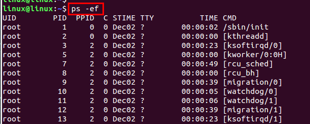
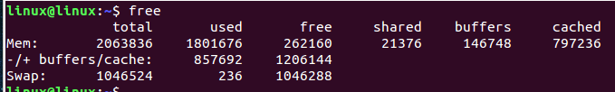
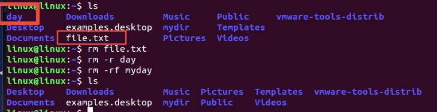

[toc]

# 1 命令的格式

## 1.1 终端

操作系统提供用户使用操作系统的平台（硬件或软件）

***linux给用户直接提供了7个终端，分为两类***：

1. 字符界面终端：tty1 ~ tty6
2. 图形化界面终端：tty7

可以使用软件的终端访问操作系统（这样的终端称为伪终端）

1. putty
2. terminal

linux下真终端的切换

1. 图形化界面终端切换到字符界面终端

   `ctrl + alt + F(1 ~ 6) + Fn`

2. 字符界面终端切换到图形化界面终端

   `ctrl + alt + F7`

## 1.2 打开终端的方式

Ubuntu中的命令基本都是在终端执行的。

### 1.2.1 打开终端的方式

1. 在Ubuntu桌面中右键选择“打开终端”
2. 使用快捷键：ctrl + alt +t

### 1.2.2 注意

当光标在终端内部时，按下ctrl + shift + n的时候可以打开一个新的终端。同时ctrl + shift + t也可以打开一个新的终端。


在一个终端内部按下ctrl + shift + t,可以新建标签页，标签页的切换可以用alt + 1;	alt + 2;	alt + 3在一个终端中实现多个标签页之间的切换。使用ctrl + shift +w可以关闭标签页。


在终端内部，使用exit命令也是可以关闭标签页和终端的。

放大终端：Ctrl + Shift + +

缩小终端：Ctrl + -

## 1.3 终端提示符

`linux@linux:~$`命令行提示符

### 1.3.1 第一个`linux`：用户名

@:无含义，分隔符

### 1.3.2 第二个`linux`：主机名

### 1.3.3 ~：表示路径

~：家目录

/：根目录

### 1.3.4 $:表示权限

$：普通用户权限

#：管理员权限

## 1.4 命令的格式

`命令名称 [选项] [参数]`

### 1.4.1 注意

- 命令、选项、参数之间必须用空格隔开
- 命令名称不能省略，选项和参数是可选的
- 选项和参数可有可无可多个
- **==如果想要在下一行接着命令或者代码时，需要输一个反斜杠`\`,再按下回车接着书写==**
- **==如果想要将多个命令书写在一行时，多个命令之间应该用分号`;`隔开==**

### 1.4.2 例如

`ls -l`


# 2 命令帮助信息

`命令 --help`

注意：并不是所有的命令都有帮助信息，pwd就没有


# 3 man命令

man命令是Linux提供的帮助手册，可以查询命令、函数或者特殊的文件。

man是linux提供的一个手册，这个手册有很多的章节（通过man man）

## 3.1 章节

第一章中存放的是命令的帮助信息

第二章放的是系统调用（操作系统提供的函数open）

第三章放的是库函数（c库提供的函数printf)的帮助信息。


## 3.2 用法

```bash
man 章节 查找信息

例如：
man 1 ls 或者 man ls
man 2 open
```


按q键退出帮助信息页。

# 4 命令常用的技巧

## 4.1 自动补全

输入命令的一部分，然后按下Tab键，就会自动补全命令，如果有多个相同开头的命令，多按一下一次tab键，他就会将所有以你输入开头的命令提示出来。

### 4.1.1 注意

目录或文件的名字也可以自动补全.

在当前目录下，有个文件夹叫做mydir

删除mydir文件夹的话

```bash
rm -r mydir
```

然后按tab键就可以补全目录。


## 4.2 历史命令

可以按上下键，将以前输入得命令调出来，敲回车执行或者修改之后敲回车键就可以了。

## 4.3 重定向  >

```
命令 > 目的文件		先清空原文本文件内容，然后将命令得输出结果写入文件
命令 >> 目的文件		以追加的方式将命令输出的结果写入文件

如果目的文件不存在的话就会先创建文件，之后再进行覆盖或者追加。
如果目的文件存在就会直接覆盖或者追加。

2> 	&>		错误重定向
```

==**本来输出到屏幕上的数据，重定向输出到了目的文件中。**==


错误重定向可以用于将错误文件保存到一个文件中，方便检查。


## 4.4 管道   |

一个程序的==**输出**==作为另外一个程序的==**输入**==。

```bash
ls --help | more	以每页的方式查看ls命令的帮助信息
ls /etc | wc -w		统计根目录下的etc目录中的文件数
```


# 5 用户系统相关命令

## 5.1 用户切换命令

### 5.1.1 su

su 变更为其他使用者的身份，主要用于将普通用户身份转变为超级用户，需输入相应用户密码。

```bash
sudo -i         切换为root用户
su 用户名       切换为用户（在root用户时）
```


## 5.2 系统管理命令

### 5.2.1 top

```bash
top			动态显示系统中运行的程序
# 默认隔5秒刷新并输出当前正在活跃（运行的）进程的信息
```


### 5.2.2 ps

```bash
ps			显示当前系统中由该用户运行的进程列表
ps -ef		查看所有进程及其PID（进程号）、系统时间、命令详细目录、执行者等
ps aux		除可显示-ef所有内容外，还可显示CPU及内存占用率、进程状态
ps -w		加宽以显示较多的信息
ps ajx		查看当前系统中所有开启的进程
```




- PID：进程的标识。 >0的正整数

  PID的取值范围：0~65535

- USER:进程拥有者的用户名

- PR：优先级(越小越高)

- NI：nice值

- VIRT：虚拟内存使用的总量，单位是Kb

- RES：进程的数据段+代码段的大小

- SHR：共享内存的大小

- %CPU：CPU的使用率

- %MEM：进程使用的物理内存的占比

- TIME+：进程使用的CPU的时间总计，单位是秒

- COMMAND：对应命令/可执行文件名

- VSZ：进程使用虚拟内存的大小，单位是KB

- RSS：驻留空间的大小。显示当前常驻内存的程序的K字节数

- TTY：进程相关的终端

- STAT：进程状态

  D    不可中断     Uninterruptible sleep (usually IO)
  R    正在运行，或在队列中的进程
  S    处于休眠状态
  T    停止或被追踪
  Z    僵尸进程
  W    进入内存交换（从内核2.6开始无效）
  X    死掉的进程
  <    高优先级
  N    低优先级
  L    有些页被锁进内存
  s    包含子进程

  `+` 位于后台的进程组
  l    多线程，克隆线程

- PPID:父进程的进程号

- SID：会话组ID

- PGID：进程组ID

- WCHAN：进程等待的内核事件名

#### 5.2.2.1 查看进程号的最大值

PID的最大值是可以更改的，一般不要改

```bash
vim /proc/sys/kernal/pid_max
```


### 5.2.3 pstree

以树型结构显示我们的进程

14.04----32bit


16.04-----64bit


### 5.2.4 kill

输出特定的信号给指定的PID（进程号）的进程

```bash
kill -l		列出所有可用的信号名称
```

杀死一个进程的时候使用的`kill -9 PID`

==**其中的9指的是下图中的SIGKILL**==


### 5.2.5 shutdown	reboot

关闭或重启Linux系统

```bash
shutdown -h now		关机
shutdown -h +30		30分钟之后关机
shutdown -r now		重启
reboot 				重启
```

## 5.3 磁盘相关的命令

### 5.3.1 free

查看当前系统内存的使用情况



### 5.3.2 df

检查文件系统的磁盘空间占用情况。可以利用该命令来获取硬盘被占用了多少空间，目前还剩下多少空间等信息

```bash
df [-ahikHTm] [目录或文件名]
-a ：列出所有的文件系统，包括系统特有的 /proc 等文件系统；
-k ：以 KBytes 的容量显示各文件系统；
-m ：以 MBytes 的容量显示各文件系统；
-h ：以人们较易阅读的 GBytes, MBytes, KBytes 等格式自行显示；
-H ：以 M=1000K 取代 M=1024K 的进位方式；
-T ：显示文件系统类型, 连同该 partition 的 filesystem 名称 (例如 ext3) 也列出；
-i ：不用硬盘容量，而以 inode 的数量来显示
```


### 5.3.3 du

du 命令也是查看使用空间的，但是与 df 命令不同的是 Linux du 命令是对文件和目录磁盘使用的空间的查看

```bash
du [-ahskm] 文件或目录名称
-a ：列出所有的文件与目录容量，因为默认仅统计目录底下的文件量而已。
-h ：以人们较易读的容量格式 (G/M) 显示；
-s ：列出总量而已，而不列出每个各别的目录占用容量；
-S ：不包括子目录下的总计，与 -s 有点差别。
-k ：以 KBytes 列出容量显示；
-m ：以 MBytes 列出容量显示；
```

### 5.3.4 fdisk -l

查看磁盘分区情况及对磁盘进行分区管理

注意：必须使用root权限


# 6 ls	tree	clear

## 6.1 ls

ls 查看目录下的信息

```bash
ls 		查看当前目录下的文件名
ls 目录名	查看指定目录下的文件名
ls	/			查看根目录下的文件名
ls -a	或者 la		查看当前目录下的所有文件名，包括隐藏文件
ls -R			 如果目录下还有目录，会递归显示
ls -l	或者 ll		查看当前目录下文件的详细信息
ls	-al		查看当前目录下所有文件的详细信息，包括隐藏文件
ls -hl		详细信息中的字节数可以带单位的显示
ls -option 目录名     查看指定目录下的文件信息，option可以是a、l等，查询的结果的形式是一样的
```

```bash
drwxr-xr-x 2 linux linux 4096 May  6  2018 Music
第一个字母代表文件类型
	d：文件类型，linux里面不以后缀名作为文件的区分
	linux里面一共有其中文件类型bcd-lsp，linux里面一切皆文件。
	b:块设备文件				block
	c:字符设备文件				char
	d:目录文件				directory
	-:普通文件
	l:软链接文件				软链接link
	s:套接字文件				socket
	p:管道文件				pipe
rwxr-xr-x：文件权限，以三个一组，分别表示用户、用户组以及其他用户对文件的操作权限，
	r:读权限，		read
	w:写权限，		write
	x:可执行权限，		excute
	如果是'-',就表示没有这个权限。
	2:链接文件的个数		(硬链接)
	linux:用户名
	linux:用户组名
	4096:文件大小，默认以字节为单位
	May  6  2018:时间戳，文件的最后修改时间
	Music:文件名
```

### 6.1.1 注意

在linux下，最基本的==**颜色**==区分

- 白色：普通文件
- 绿色：可执行文件
- 蓝色：目录文件
- 青色：链接文件

[实现ls功能](../02_IO/03_目录的操作.md)


## 6.2 tree

tree 以树状结构显示目录信息

```bash
tree 以树状结构显示目录信息
tree -L 层数	用于显示指定的层数
例如：
	tree -L 3
```

系统默认没有这个命令，需要安装`sudo apt-get install tree`

如果报错显示无法获得锁，请使用以下命令删除一些文件即可

```bash
sudo rm /var/lib/dpkg/lock
sudo rm /var/lib/dpkg/lock-frontend
sudo rm /var/cache/apt/archives/lock
```


## 6.3 clear

```bash
clear		清屏
# 可以使用快捷键ctrl + l也可以清屏
```

# 7 cd	pwd

## 7.1 cd

cd	change directory改变目录的意思

```bash
cd 当前目录下的目录名		指定进入的目录
cd /		进入根目录
cd ~ 或 cd 		进入家目录
cd ..				进入当前目录的上一级目录
cd -				返回到上一次的路径
```

### 7.1.1 绝对路径和相对路径

#### 7.1.1.1 绝对路径

从根目录（最顶层目录开始的路径）

#### 7.1.1.2 相对路径

相对当前路径下的那个路径

## 7.2 pwd

```bash
pwd		# 显示当前路径的绝对路径
```


# 8 cat	nl	head	tail	rm	cp	mv

## 8.1 cat

cat 显示文本文件的内容

```bash
cat 文件名		显示文件的内容
cat -n 文件名		带行号的显示文件的内容，对空行内容也会显示行号
cat -b 文件名		带行号的显示文件的内容，对有内容的行前面显示行号
cat -s 文件名		多个空行合并为一个空行显示
```


## 8.2 nl

nl查看文件内容

```bash
nl 文件名				#带行号的显示文件内容
```


## 8.3 head

head显示文件内容

```bash
head 文件名						显示文件的前10行内容
head -n 文件名						显示文件的前n行内容
```


## 8.4 tail

tail显示文件内容

```bash
tail 文件名				显示文件最后10行的内容
tail -n 文件名			显示文件最后n行的内容
```


## 8.5 rm

rm 是remove的意思，移除即删除的意思

```bash
rm 文件名	删除指定的文件
rm -rf 目录名	删除指定的目录文件
rm *			删除目录文件中的文件但是目录文件
rm -rf *		删除目录文件中的文件以及目录文件
rm *.o 文件名1 文件名2 目录名1 目录名2 ... -rf		删除目录文件中的所有.o文件，文件1、文件2、目录名1、目录名2
rmdir 文件夹名		删除空文件夹
```




### 8.5.1 注意

选项 `-rf `可以没有，但是删除文件夹得时候必须带`-r`

`-f`的意思是强制删除，即使要删除的文件或文件夹不存在也不报错。

## 8.6 cp

cp是copy复制的意思

```bash
cp 文件名 目录名		将文件复制到目录中
cp 目录1 目录2 -a		将目录1复制到目录2中
cp -r 目录1 目录2 		将目录1复制到目录2中
cp 文件名1 文件名2	如果文件2不是目录，则文件1复制一份为文件2，
						如果文件2存在且不是一个目录，则直接将内容替换成文件1
						如果文件2不存在，则创建文件2,再将文件1的内容复制到文件2中
```


### 8.6.1 注意

cp 后面可以加选项

拷贝文件夹得时候必须加`-r`,

`-v`显示拷贝进度

### 8.6.2 cp指令的实现

```c
#include <fcntl.h>
#include <stdio.h>
#include <unistd.h>
#include <string.h>
#include <stdlib.h>

int main(int argc, const char *argv[])
{
	if(3 != argc)
	{
		printf("param is error\n");
	}

	int fdSrc;
	int fdDes;

	char *readBuf = NULL;

	fdSrc = open(argv[1], O_RDWR);
	int fileSize = lseek(fdSrc, 0, SEEK_END);//获取文件大小
	readBuf = (char*)malloc(fileSize+1);
	lseek(fdSrc, 0, SEEK_SET);
	read(fdSrc, readBuf, 1024);

	fdDes = open(argv[2], O_RDWR | O_CREAT | O_TRUNC, 0600);//O_TRUNC-若最终文件已存在，删除再拷贝
	write(fdDes, readBuf, strlen(readBuf));

	close(fdSrc);
	close(fdDes);
	return 0;
}
```

result


## 8.7 mv

mv是move是移动得意思，即剪切得意思

```bash
mv 文件名 目录名		将文件移动到指定得目录中
mv 目录1 目录2			将目录1移动到目录2中
mv 文件1 文件2			如果文件2不存在，则功能为重命名
# 重命名和移动可以同时进行
mv 文件1 目录名/文件1重命名
```


# 9 mkdir	touch	rmdir	mkfifo	mknod

## 9.1 mkdir

mkdir 创建文件夹

```bash
mkdir 目录名	创建一个目录文件
mkdir	目录1 目录2 ... 	创建多个目录
mkdir -p 目录1/目录2/目录3/...		嵌套得创建多个文件
mkdir -p 目录1/目录11/目录111 目录2/目录22//目录33  嵌套递归创建多个文件
rmdir 文件夹名		删除空文件夹
```


## 9.2 touch

touch创建文件

```bash
touch 文件名	创建一个文件
touch 文件名1 文件名2 文件名3 创建多个文件
注意：如果文件已经存在了，则touch会修改当前文件的时间戳
```


## 9.3 mkfifo

mkfifo 创建管道文件

```shell
mkfifo 文件名				# 创建一个管道文件
```


## 9.4 mknod

创建设备文件

```shell
mknod 有名管道文件名 p			# 创建一个管道文件
```


# 10 chmod chown chgrp

## 10.1 chmod

**修改文件的访问权限**

通过八进制来修改对应的权限，0是没有权限，1是有权限

通过八进制777的话，可以修改文件的权限。


## 10.2 chown

**修改文件所有者和组别**

修改文件所有者和组别之间用`:`隔开，如果只修改组别的话前面加一个`:`即可。

需要拥有root权限

## 10.3 chgrp

**改变文件的组所有权**

需要拥有root权限

# 11 find

find在指定路径下查找指定文件

```bash
find 路径 -name 文件名		在指定的路径下查找指定的文件，会从指定路径下包括所有子目录中寻找
```


# 12 grep

grep在指定的文件中查找指定内容

```bash
grep 查找信息 文件名		在指定的文件中查找指定的内容，将查找到的内容整行输出并高亮显示查找的内容
grep 查找信息 文件名 -n 		在指定的文件中查找指定的内容，将查找的内容整行且带行号输出并高亮显示查找的内容
grep 查找信息 * -R -n 		从当前目录以及子目录中文件中查找指定信息
```


```c
//file.txt中的内容
nothing
sometime 
something
anytime
anythingtotal 52
nothing
sometime 
something
anytime
anythingtotal 52
nothing
sometime 
something
anytime
anythingtotal 52
nothing
sometime 
something
anytime
anythingtotal 52
nothing
sometime 
something
anytime
anythingtotal 52
// rename.txt和这个中的内容一致
```


# 13 ln

ln创建链接文件

```bash
ln -s 源文件名 链接文件名		创建一个链接(软链接)文件（类似windows的快捷方式）
ln 源文件名 链接文件名			创建一个链接(硬链接)文件
```


## 13.1 注意(软链接)

不管对原文件还是链接文件进行修改，双方的内容都会改变。

如果删除链接文件，对原文件没有任何影响。

如果删除原文件，则链接文件会失效。

1. ln命令会保持每一处链接文件的同步性，也就是说，不论改动了哪一处，其他的文件都会发生相同的变化
2. ln的链接有软链接和硬链接两种
   - 软链接就是上面所说的`ln -s 源文件 目标文件`，==**它只会在用户选定的位置上生成一个文件的镜像，不会重复占用磁盘空间，平时使用较多的都是软链接**==。
   - 硬链接是不带参数的`ln 源文件 目标文件`，它会在用户选定的位置上生成一个和源文件大小相同的文件。无论是软链接还是硬链接，文件都会保持变化。==**硬链接不占空间**==。不跨文件系统

## 13.2 区别

文件属性不同，软链接文件的文件属性就是`l`,硬链接文件文件属性就是`-`

==**创建链接的时候使用使用源文件使用绝对路径**==

# 14 which	whereis

查询命令的路径

==**whereis只查找源代码、二进制文件和帮助文件，而不是所以类型的文件**==

```bash
whereis 命令名称		查询命令的路径
which 命令名称			查询命令的路径
```


# 15 wc

统计一个文件的行数，单词数，大小

```shell
wc 文件名				# 默认测试的是文件的行数、单词数、大小
wc -l 文件名			# 测试行数
wc -c 文件名			# 测试文件所占字节数
wc -w 文件名			# 测试单词数
```


# 16 lastlog

```shell
lastlog
# linux系统中的/var/log/lastlog日志记录了所有用户最后登录的记录，可以用此命令查看
```

# 17 last -f

```shell
last -f
# /var/run/utmp日志记录了正在登录本系统中的用户信息，可以用此命令查看
```

# 18 crontab

用来定期执行程序的命令。每分钟会定期检查是否有要执行的工作，如果有要执行的工作便会自动执行该工作。

```shell
crontab [ -u user ] file
crontab [ -u user ] [ -i ] { -e | -l | -r }

# 参数：
# 		-e:执行文字编辑器来设定时程表，内定的文字编辑器是VI，如果你想用别的文字编辑器，则请先设定VISUAL
# 		环境变数来指定使用那个文字编辑器(比如说setenv VISUAL joe)
# 		-r:删除目前的时程表
# 		-l:列出目前的时程表

# 说明：
# 		crontab是用来让使用者在固定时间或固定间隔执行程序之用，
# 		换句话说，也就是类似使用者的时程表
# 		-u user是指设定指定user的时程表，这个前提是你必须要有其权限(比如说是 root)
# 		才能够指定他人的时程表。如果不使用-u user的话，就是表示设定自己的时程表。

# 时间格式如下
f1 f2 f3 f4 f5 program
# 其中f1是表示分钟，f2表示小时，f3表示一个月份中的第几日，
# f4表示月份，f5表示一个星期中的第几天。
# program表示要执行的程序
# 当f1为 * 时，表示每分钟都要执行program,当f2为 * 时，表示每小时都要执行程序，其余类推
# 当f1为 a-b 时表示从第 a 分钟到第 b 分钟这段时间内都要执行，f2 为 a-b 时表示从第 a 到第 b 小时都要执行，其余类推
# 当f1为 */n 时表示每 n 分钟个时间间隔执行一次，f2 为 */n 表示每 n 小时个时间间隔执行一次，其余类推
# 当 f1 为 a, b, c,... 时表示第 a, b, c,... 分钟要执行，f2 为 a, b, c,... 时表示第 a, b, c...个小时要执行，其余类推
```


# 19 文件压缩和解压

## 19.1 gzip

==**只能压缩单个文件，不能压缩文件夹**==

### 19.1.1 压缩

```bash
gzip 文件名				压缩文件
```

### 19.1.2 解压

```bash
gzip -d 文件名				解压文件
gunzip 文件名				解压文件
```


## 19.2 bzip2

==**只能压缩单个文件，不能压缩文件夹**==

### 19.2.1 压缩

```bash
bzip2 文件名				压缩文件
```

### 19.2.2 解压

```bash
bzip2 -d 文件名				解压文件
bunzip2 文件名				解压文件
```


## 19.3 tar

==**文件夹或者文件的操作**==

### 19.3.1 tar

| 参数 | 意义                         |
| ---- | ---------------------------- |
| -c   | 打包                         |
| -f   | 指定的包文件名（文件名.tar） |
| -v   | 显示过程                     |
| -x   | 解包                         |
| -j   | 自动调用bzip2                |
| -z   | 自动调用gzip                 |

### 19.3.2 gzip格式

1. 压缩

   ```bash
   tar zcvf 压缩包包名 文件1 文件2 文件3 ...
   注意：压缩包包名一般以.tar.gz作为后缀名
   ```

   

2. 解压

   ```bash
   tar zxvf 压缩包包名				解压到当前路径
   tar zxcf 压缩包包名	-C 路径		解压到指定的路径
   ```

   

### 19.3.3 bzip2格式

1. 压缩

   ````bash
   tar jcvf 压缩包包名 文件1 文件2 文件3 ...
   注意：压缩包包名一般以.tar.bz2作为后缀名
   ````

   

2. 解压

   ```bash
   tar jxvf 压缩包包名		解压到当前路径
   tar jxvf 压缩包包名 -C 路径 解压到指定的路径
   ```

   
