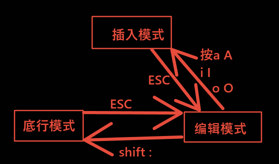

[toc]

# 1 编辑器之神--vi

```bash
vim ~/.vimrc			可以修改vim的配置文件
```

## 1.1 vim中代码格式化

第一种

在命令模式（编辑模式）下输入`gg=G`进行代码重排。

第二种方法

1. gg 跳转到第一行
2. shift+v 转到可视模式
3. shift+g 全选
4. 按下神奇的 =
5. 代码格式化成功

## 1.2 安装vim(vi升级版)

## 1.3 vi的使用

```bash
vim 文件名	在vi编辑器中打开或者创建一个文件，并将光标置于第一行行首
vim +n 文件名	打开存在文件，并将光标置于第n行行首
vim -p 文件名1 文件名2 同时打开多个文件 # 使用gt切换标签页
```

## 1.4 vi的三种模式

在vim中不小心按下ctrl + s之后，无法进行操作，可以使用ctrl + q来解除锁定

1. 编辑模式(命令行模式)

   在编辑模式下可以敲一些命令，执行例如复制n行，剪切n行、粘贴等功能。

   注意：vi在打开一个已经存在的文件的时候，默认进入的是编辑模式

2. 插入模式

   这种模式可以直接编辑文档...

3. 底行模式

   在此模式下可以保存文件，退出、查找、替换、列出行号等功能

   

4. 三种模式之间的切换：

   - 由编辑模式(命令行模式)进插入模式，按a i o A I O s S

     区别就是插入的位置不同

     | 指令 | 含义                     |
     | ---- | ------------------------ |
     | a    | 光标之后插入             |
     | A    | 光标所在行的行尾插入     |
     | i    | 光标当前位置插入         |
     | I    | 光标所在行的行首插入     |
     | o    | 光标所在行的下一行插入   |
     | O    | 光标所在行的上一行插入   |
     | s    | 删除光标所在字符之后插入 |
     | S    | 删除光标当前行之后插入   |

   - 由插入模式进编辑模式

     按ESC键

   - 只能由编辑模式才能进最后一行模式

     在编辑模式下按`shift:`进入末行模式

   - 在底行模式也可以进编辑模式

     按ESC

   总结：

   1. 由插入模式或者底行模式进编辑模式，方法按`esc`键
   2. 由编辑模式进底行模式按`shift:`
   3. 由编辑模式进插入模式按`a A i I o O`
   4. 插入模式和底行模式不能直接切换


### 1.4.1 编辑模式

| 指令       | 含义                                                       |
| ---------- | ---------------------------------------------------------- |
| u          | 撤销前面的多次修改                                         |
| ctrl + r   | 反撤销                                                     |
| [n]x       | 删除光标后n个字符                                          |
| [n]X       | 删除光标前n个字符                                          |
| [n]dd      | 剪切从当前行开始的n行（只剪切不粘贴，认为就是删除）        |
| d0         | 将光标至行首的字符剪切入剪贴板                             |
| d$         | 将光标至行尾的字符剪切入剪贴板                             |
| [n]yy      | 复制从光标所在行开始的n行，n是一个常数，yy就是复制当前行。 |
| y0         | 将光标至行首的字符拷入剪贴板                               |
| y$         | 将光标至行尾的字符拷入剪贴板                               |
| p          | 把粘贴板上的内容插入到光标所在行的下一行                   |
| P          | 把粘贴板上的内容插入到光标所在行的上一行                   |
| .          | 执行上次操作                                               |
| shift + zz | (按住shift按两下z键)保存退出当前文件 多行注释和多行删除    |

#### 1.4.1.1 编辑模式(命令行模式)下的移动光标

| 指令 | 含义                    |
| ---- | ----------------------- |
| [n]G | 将光标定位到第n行开始处 |
| G    | 将光标定位到文件结束处  |
| gg   | 将光标定位到文件开始处  |

| 按键 | 含义                                            |
| ---- | ----------------------------------------------- |
| h    | 方向键，向左移动光标一个字符的位置，相当于键"←" |
| j    | 方向键，向下移动光标一个字符的位置，相当于键"↓" |
| k    | 方向键，向上移动光标一个字符的位置，相当于键"↑" |
| l    | 方向键，向右移动光标一个字符的位置，相当于键"→" |

#### 1.4.1.2 编辑模式(命令行模式)下的查找

| 指令    | 含义                           |
| ------- | ------------------------------ |
| /字符串 | 从光标开始处向文件尾查找字符串 |
| /^the   | 以the开头的行                  |
| /end$   | 以end结尾的行                  |

按下回车键

| 按键 | 含义                       |
| ---- | -------------------------- |
| n    | 同一方向重复上一次查找命令 |
| N    | 反方向重复上一次查找命令   |

```shell
# 临时的，只在当前文件中生效，关闭重新打开就会恢复原状，可以通过vim ~/.vimrc修改vim的配置，之后保存就可以永久修改。
:set number			设置显示行号
:set nonumber		取消显示行号
```

#### 1.4.1.3 编辑模式(命令行模式)下的替换

利用`:s`命令可以实现字符串的替换

```shell
#格式
:范围s/old/new
```

| 指令                | 含义                                                 |
| ------------------- | ---------------------------------------------------- |
| :s/str1/str2        | 将当前行的str1替换为str2,替换第一个                  |
| :s/str1/str2/g      | 将当前行的str1替换为str2，替换当前行所有的str1       |
| :.,$s/str1/str2/g   | 将当前行到最后一行中的所有str1替换为str2             |
| :n,$s/str1/str2/    | 替换第 n 行开始到最后一行中每一行的第一个 str1为str2 |
| :n,$s/str1/str2/g   | 替换第 n 行开始到最后一行中每一行所有str1为str2      |
| :%s/str1/str2/      | 替换每一行的第一个 str1为 str2                       |
| :%s/str1/str2/g     | 替换每一行中所有 str1为 str2                         |
| :s#well/#good/#     | 替换当前行第一个 well/ 为 good/                      |
| :%s#/usr/bin#/bin#g | 可以把文件中所有路径/usr/bin换成/bin                 |


```
可以使用 # 作为分隔符，此时中间出现的 / 不会作为分隔符
```

### 1.4.2 插入模式

#### 1.4.2.1 多行注释

```
1. 首先按esc进入命令行模式下，按下ctrl + v，进入列(也叫区块)模式;
2. 在行首使用上下键选择需要注释的多行;
3. 按下键盘(大写)"I"键，进入插入模式;
4. 然后输入注释符("//"、"#"等);
5. 最后按下"esc"键。
注意：
	在按下esc键后，会稍等一会才会出现注释
```

#### 1.4.2.2 多行注释删除

```
1. 首先按esc进入命令行模式，按下ctrl + v，进入列模式;
2. 选定要取消注释的多行;
3. 按下"x"或者"d"
注意：
	如果是"//"注释，那需要执行两次该操作，如果是"#"注释，一次即可
```

### 1.4.3 底行模式

| 指令        | 含义                                                         |
| ----------- | ------------------------------------------------------------ |
| :w          | 保存文件                                                     |
| :wq         | 保存文件并退出vim/vi                                         |
| :x          | 保存文件并退出vi/vim相当于:wq                                |
| :q!         | 不保存文件，强制退出vi                                       |
| :w filename | 另存为filename                                               |
| :r filename | 读入filename的文件内容插入到光标位置                         |
| :vsp 文件名 | 在一个文件编辑另一个文件，多个文件并排显示在一个终端中       |
| :N          | 移动光标到第N行（N待定）                                     |
| :112,115y   | 将第112行到115行的内容复制（112，115可以替换为其他的行数号） |
| :122,$d     | 将第122行到最后的全部删除（122可以替换为其他行号）           |

```
range y		块复制
range d		块剪切
```

# 2 ctags

## 2.1 概述

```
ctags是一个linux上很普遍的源码分析工具，可以将代码中的头文件以及函数变量等记录在一个名称为tags打文件。 
tags文件的产出最简单的方法是在需要生成tags的工程项目的根目录下执行ctags -R命令, 这会调用tags递归的扫描当前目录以及所有子目录中可以被tags识别的文件所以文件数据信息都会汇集到tags文件中
```

## 2.2 安装

```shell
sudo apt-get install exuberant-ctags
cd /usr/include
sudo ctags -R
cd 
vim .vimrc
# 在文件中添加下面语句
set tags=/usr/include/tags
```

## 2.3 测试

```shell
vim -t test.c
# 搜索（宏、结构体）命令：vi -t 名称  //如vi -t device
# 然后就看见它们的定义了 ctrl+](进入) ctrl+t(返回) ctrl + o(退出)
```
