[toc]

# 1 make概述

1. 什么是make

   make是个命令，是个可执行程序，用来解析Makefile文件的命令，这个命令存放在/usr/bin/

2. 什么是makefile

   makefile是个文件，这个文件中描述了咱们程序的编译规则
   
   咱们执行make命令的时候，make命令会在当前目录下找文件makefile文件，根据makefile文件里的规则，编译咱们的程序。
   
   注意：Makefile规则文件时咱们程序员根据自己的程序，编写的编译规则。

3. 采用makefile的好处

   - 简化编译程序的时候输入的命令，编译的时候只需要敲make命令就可以了
   - 可以节省编译时间，提高编译效率。

1. GNU make是一种代码维护工具。
2. make工具会根据makefile文件定义的规则和步骤，完成整个项目的代码维护工作。
3. 一般用来简化编译工作，可以极大地提高软件开发的效率
4. windows下一般由集成开发环境自动生成
5. Linux下需要我们按照其语法自己编写。

## 1.1 make主要解决两个问题

1. 大量代码的关系维护

   大项目中源代码比较多，手工维护、编译时间长而且编译命令复杂，难以记忆及维护。把代码命令集编译命令写在makefile文件中，然后再用make工具解析此文件自动执行相应命令，可实现代码的合理编译。

2. 减少重复编译的时间

   在改动其中一个文件的时候，能判断哪些文件被修改过，可以只对该文件进行重新编译，然后重新链接所有的目标文件，节省编译时间。

# 2 makefile语法及其执行

## 2.1 makefile语法规则

<a name="makefile语法规则"></a>

```makefile
目标:依赖文件列表
<Tab>命令列表
```

1. 目标

   通常是要产生的文件名称，目标文件可以是执行文件或其他obj文件，也可以是一个动作的名称。

2. 依赖文件

   是用来输入从而产生目标的文件。
   
   一个目标通常有几个依赖文件（可以没有）

3. 命令

   make执行的动作，一个规则可以含几个命令（可以没有）
   
   有多个命令时，每个命令占一行

<a name="系统环境变量"></a>

<a name="make命令格式"></a>

简单的Makefile实例

```c
// main.c中的内容
#include <stdio.h>
#include "main.h"

int main(int argc, const char *argv[])
{
	printf("Hello World Make\n");
	printf("PI = %lf\n",PI);
	return 0;
}
```

```c
// main.h
#define PI 3.1415926
```

```makefile
# makefile或者Makefile中的内容
main:main.c main.h
	gcc main.c -o main
clean:
	rm main
```

执行结果

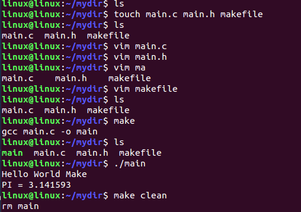

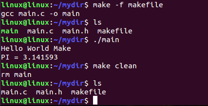

**==make根据时间戳的概念去执行的==**

## 2.2 make命令格式

```bash
make [-f file] [targets]
```

[main.c、main.h的内容](#make命令格式)

```makefile
# trydo内容
main:main.c main.h
	gcc main.c -o main
clean:
	rm main
```

执行结果

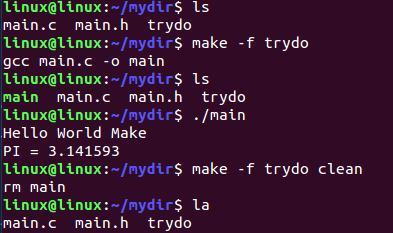

1. `[-f file]:`

   ==**make默认在工作目录中寻找名为GNUmakefile、makefile、Makefile的文件作为makefile输入文件**==，`-f`可以指定以上名字以外的文件作为makefile输入文件。

2. `[targets]:`

   若使用make命令时没有指定目标，则make工具默认会实现makefile文件内的第一个目标，然后退出，指定了make工具要实现的目标，目标可以是一个或多个（多个目标间用空格隔开）

一般使用的时候直接make就可以了,但是要保证文件名是makefile、Makefile

## 2.3 Makefile案例

### 2.3.1 sum.c

```c
#include "head.h"

int sum(int a,int b)
{
	return a + b;
}
```

### 2.3.2 sub.c

```c
#include "head.h"

int sub(int a,int b)
{
	return a - b;
}
```

### 2.3.3 head.h

````c
#ifndef _HEAD_H_
#define _HEAD_H_

#include <stdio.h>

int sum(int a,int b);
int sub(int a,int b);

#endif
````

### 2.3.4 main.c

```c
#include "head.h"

int main(int argc, const char *argv[])
{
	int x = 1000;
	int y = 900;
	printf("%d + %d = %d\n",x,y,sum(x,y));
	printf("%d - %d = %d\n",x,y,sub(x,y));
	return 0;
}
```

Makefile

```makefile
main:main.o sub.o sum.o
	gcc main.o sub.o sum.o -o main
main.o:main.c
	gcc -c main.c -o main.o
sub.o:sub.c
	gcc -c sub.c -o sub.o
sum.o:sum.c
	gcc -c sum.c -o sum.o
clean:
	rm *.o main a.out -rf
```

执行结果

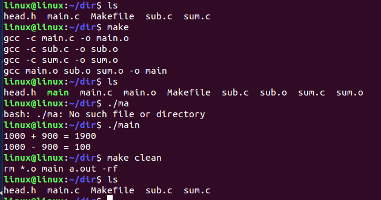

## 2.4 假目标

==**前面makefile中出现的clean称之为假目标**==

假目标并不是一个真正的文件名，通常时一个目标集合或者动作，可以没有依赖或者命令。

一般需要显示的使用`make + 名字`	显示调用

```makefile
all:
	exec1 exec2
clean:
	rm *.o
```

运行时使用make clean就会执行clean后面的命令。

运行make all就会执行all后面的命令

### 2.4.1 问题解决

当makefile中有一个clean的文件时，使用make clean会出现错误

```makefile
CC = gcc
CFLAGS = -c -Wall
OBJS = stu.o cal_age.o io.o sort_age.o sort_name.o
stu:$(OBJS)
	$(CC) $^ -o $@
stu.o:stu.c
	$(CC) $(CFLAGS) $< -o $@
io.o:io.c
	$(CC) $(CFLAGS) $< -o $@
cal_age.o:cal_age.c
	$(CC) $(CFLAGS) $< -o $@
sort_age.o:sort_age.c
	$(CC) $(CFLAGS) $< -o $@
sort_name.o:sort_name.c
	$(CC) $(CFLAGS) $< -o $@
clean:
	$(RM) *.o
```

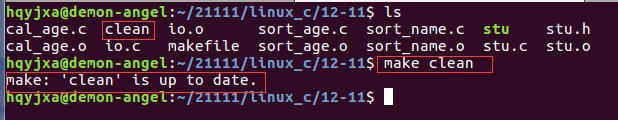

此时使用关键字`.PHONY`关键字来定义假目标，必须是大写字母，将`clean`变为假目标后的makefile,此时运行就不会出现错误。

```makefile
CC = gcc
CFLAGS = -c -Wall
OBJS = stu.o cal_age.o io.o sort_age.o sort_name.o
stu:$(OBJS)
	$(CC) $^ -o $@
stu.o:stu.c
	$(CC) $(CFLAGS) $< -o $@
io.o:io.c
	$(CC) $(CFLAGS) $< -o $@
cal_age.o:cal_age.c
	$(CC) $(CFLAGS) $< -o $@
sort_age.o:sort_age.c
	$(CC) $(CFLAGS) $< -o $@
sort_name.o:sort_name.c
	$(CC) $(CFLAGS) $< -o $@
# 伪目标
.PHONY:clean
clean:
	$(RM) *.o
```

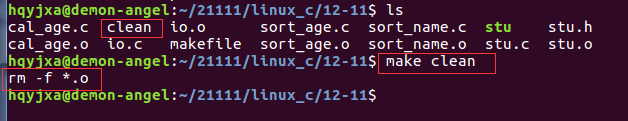

# 3 makefile变量

## 3.1 makefile变量概述

makefile变量类似于C语言中的宏,当makefile被make工具解析时，其中的变量会被扩展开。

### 3.1.1 变量的作用

1. 保存文件名列表

2. 保存文件目录列表

3. 保存编译器名

4. 保存编译参数

5. 保存编译的输出


## 3.2 变量的分类

1. 自定义变量

   在makefile文件中定义的变量
   
   make工具传给makefile的变量

2. 系统环境变量

   make工具解析makefile前，读取系统环境变量并设置为makefile的变量。

3. 预定义变量（自动变量）

### 3.2.1 自定义变量语法

```makefile
定义变量:
	变量名=变量值
引用变量:
	$(变量名)或${变量名}
# 注意：makefile变量名可以以数字开头
```

#### 3.2.1.1 注意

1. 变量是大小写敏感的
2. 变量一般都在makefile的头部定义
3. 变量几乎可在makefile的任何地方使用

````makefile
# 定义变量
CC=gcc
obj=main
obj1=sub
obj2=sum
OBJ=main.o sub.o sum.o

# $@就是指依赖文件列表中的所有文件
# S^就是指依赖文件列表中的一个文件

# 目标文件:依赖文件列表
$(obj):$(OBJ)
	$(CC) $(OBJ) -o $(obj)

$(obj).o:$(obj).c
	$(CC) -c $(obj).c -o $(obj).o

$(obj1).o:$(obj1).c
	$(CC) -c $(obj1).c -o $(obj1).o

$(obj2).o:$(obj2).c
	$(CC) -c $(obj2).c -o $(obj2).o

clean:
	rm *.o $(obj) a.out -rf
````

执行结果

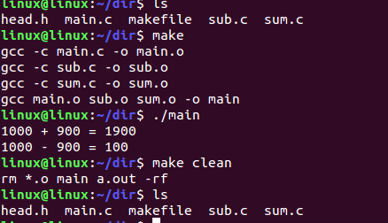

### 3.2.2 系统环境变量

make工具会拷贝系统的环境变量并将其设置为makefile的变量，在makefile中可以直接获取或修改拷贝后的变量。

```makefile
#exprot test=10
#make clean
#echo $test
```

[main.c、main.h的内容](#系统环境变量)

```makefile
# makefile或者Makefile中的内容
main:main.c main.h
	gcc main.c -o main
clean:
	rm main -rf
	echo $(PWD)
```

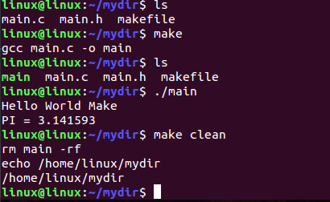

### 3.2.3 预定义变量

makefile中有许多预定义的变量，这些变量具有特殊的含义，可在==**makefile中直接使用**==。

```makefile
# $@									目标文件
# $<									依赖文件列表中的第一个文件
# $^									依赖文件列表中除去重复文件的部分，一般不会重复，即指的就是文件列表中的所有文件
# AR									归档维护程序的程序名，默认值为ar
# ARFLAGS							归档维护程序的选项
# AS									汇编程序的名称，默认值为as
# ASFLAGS							汇编程序的选项
# CC									C编译器的名称，默认值为cc
# CFLAGS							C编译器的选项
# CPP								C预编译器的名称，默认值为$(CC) -E
# CPPFLAGS							C预编译的选项
# CXX								C++编译器的名称，默认值为g++
# CXXFLAGS							C++编译器的选项
# RM								文件删除程序的名称，默认值为rm -f
```

[makefile语法规则](#makefile语法规则)

````makefile
CC=gcc
obj=main
obj1=sub
obj2=sum
OBJ=main.o sub.o sum.o
CFLAGS=-Wall -g

# $@就是指依赖文件列表中的所有文件
# S^就是指依赖文件列表中的一个文件

# 目标文件:依赖文件列表
$(obj):$(OBJ)
	$(CC) $^ -o $@

$(obj).o:$(obj).c
	$(CC) $(CFLAGS) -c $< -o $@

$(obj1).o:$(obj1).c
	$(CC) $(CFLAGS) -c $< -o $@

$(obj2).o:$(obj2).c
	$(CC) $(CFLAGS) -c $< -o $@

clean:
	rm *.o $(obj) a.out -rf
````

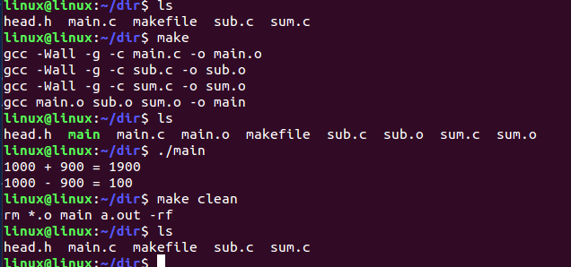

最简版

````makefile
CC=gcc
obj=main
obj1=sub
obj2=sum
OBJ=main.o sub.o sum.o
CFLAGS=-Wall -g
# $@就是指依赖文件列表中的所有文件
# S^就是指依赖文件列表中的一个文件

# 目标文件:依赖文件列表
$(obj):$(OBJ)
	$(CC) $^ -o $@

$*.o:$*.c
	$(CC) $(CFLAGS) -c $< -o $@

clean:
	rm *.o $(obj) a.out -rf
````

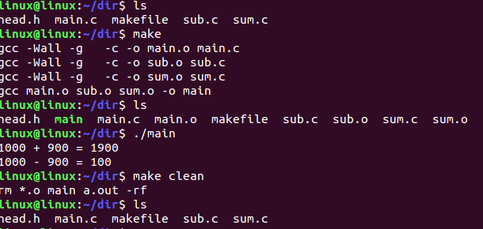

# 4 makefile的嵌套

```
make -C 目录名		# 进入到指定的目录
```

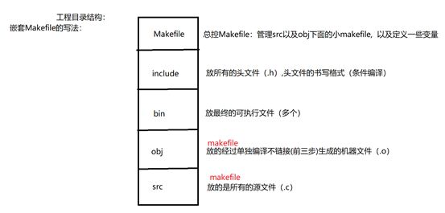
