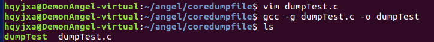
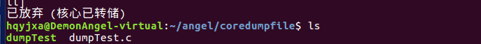
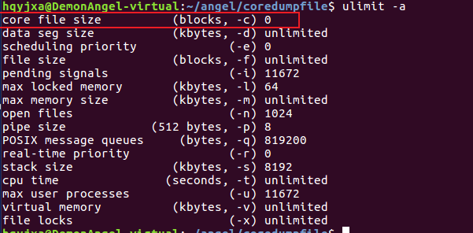
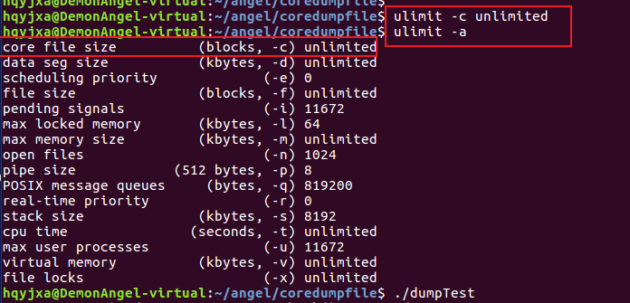
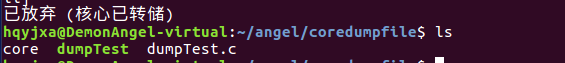
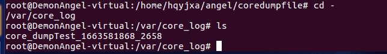

[toc]

# 1 段错误 

C语言阶段，三种情况会出现段错误（通过GDB调试工具进行调试）

1. 数组越界
2. 操作空指针或野指针
3. 修改常量区的内容

# 2 什么是coredump

coredump叫做核心转储，它是进程运行时在突然崩溃的那一刻的一个内存的快照。操作系统在程序发生异常在进程内部又没有被捕获的情况下，会把进程此刻内存、寄存器状态、运行堆栈等信息转储保存在一个文件里。

该文件也是二进制文件，可以使用gdb、elfdump、objdump或者windows下的windebug、solaris下的mdb进行打开分析里面的具体内容。

注：core是在半导体作为内存材料前的线圈，当时用线圈当做内存材料，线圈叫做core。用线圈做的内存叫做core memory。

虽然我们知道进程在coredump的时候会产生core文件，但是有时候却发现进程虽然core了，但是我们却找不到core文件。

在Linux和Solaris下是需要进行设置的。

```
ulimit -c 可以设置core文件的大小，如果这个值为0.则不会产生core文件，这个值太小，则core文件也不会产生，因为core文件一般都比较大。
使用ulimit -c unlimited来设置无限大，则任意情况下都会产生core文件。
```

# 3 gdb调试coredump的简单示例

```c
#include <stdio.h>
#include <stdlib.h>


void dumpCrash()
{
	// pStr指针指向的是字符串常量，字符串常量是保存在常量区的，free释放常量区的内存肯定会导致coredump
	char *pStr = "test_content";
	free(pStr);
}

int main()
{
	dumpCrash();
	return 0;
}
```





# 4 生成core文件

如上，运行dumpTest的时候进程coredump了，但是没有产生core文件



如截图所示，系统设置的core文件大小为0，此时即使产生了coredump，也不会产生core文件。





如截图所示，ulimit -c unlimited设置core文件大小后，产生了名字为core的core文件。

此时生成的core文件名称都是统一的”core”命名。

# 5 自定义core文件的文件名

上面的设置只是使能了coredump功能，缺省情况下，内核在coredump时所产生的core文件放在与该程序相同的目录中，并且文件名固定为core。很显然，如果有多个程序产生core文件，或者同一个程序多次崩溃，就会重复覆盖同一个core文件。

我们通过修改kernel的参数，可以指定内核所生成的coredump文件的文件名。

```bash
echo /usr/core_log/core_%e_%t_%p > /proc/sys/kernel/core_pattern
cat /proc/sys/kernel/core_pattern
# /usr/core_log/core_%e_%t_%p
./dumpTest
# Segmentation (core dumped)
ulimit -c unlimited
./dumpTest
# Segmentation (core dumped)
cd /usr/core_log
ls
# core_dumpTest_1663580221_4937
```

通过设置core文件的名称以及路径，程序coredump的时候就会在指定路径按照指定的规则命名生成core文件。

可以在core_pattern模板中使用变量见下面的列表：

| 格式 | 说明                                       |
| ---- | ------------------------------------------ |
| %%   | 单个%符号                                  |
| %p   | 所dump进程的进程ID                         |
| %u   | 所dump进程的实际用户ID                     |
| %g   | 所dump进程的实际组ID                       |
| %s   | 导致本次coredump的信号                     |
| %t   | coredump的时间（由1970年1月1日计起的秒数） |
| %h   | 主机名                                     |
| %e   | 程序文件名                                 |

# 6 设置永久保存

后面再次执行生成coredump文件的时候实际上又再次设置了ulimit-c unlimited的，因为中间机器重启了。上面的设置都只是临时的，重启之后就需要重新设置，如何设置永久生效呢？

打开/etc/security/limits.conf 文件，在该文件的最后加上两行

```
# self set
@root soft core unlimited
@root hard core unlimited
```

命名规则的修改在/proc/sys/kernel/core_pattern中也只是临时的，这个也是动态加载和生成的。永久修改在/etc/sysctl.conf文件中，在该文件的最后加上两行：

```
kernel.core_pattern = /var/core_log/core_%e_%t_%p
kernel.core_uses_pid = 0
```

可以使用以下命令，使修改结果马上生效。

```
sysctl –p
```

当前生成的core文件命名按照上面定义的规则加上了程序名称、coredump时间，进程ID等信息，并放到了指定目录/var/core_log



# 7 gdb调试coredump初步尝试

gdb打开文件的格式为

```
gdb 程序名(包含路径) core*(core文件和路径)
```

```bash
gdb /home/hqyjxa/angel/coredumpfile/dumpTest core_dumpTest_1663581868_2658
```

# 8 查看coredump时的堆栈

```bash
disassemble		# 打开改帧函数的反汇编代码
bt/where		# 查看堆栈指针
shell echo free@plt |C++filt 	# 去掉函数的名词修饰
```

