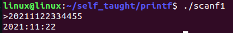

[toc]

# 1 输入输出函数

## 1.1 标准输入输出函数

### 1.1.1 标准输出函数

#### 1.1.1.1 输出

从内存中拷贝数据输出到终端或者显示屏

#### 1.1.1.2 输入

从键盘输入，拷贝数据到内存

```c
// 头文件
#include <stdio.h>
// 函数定义
int printf(const char *_Format);
/*
 * 注意：
 *      printf中输出列表是可有可无的
 * 格式控制串：
 *      字符串+占位符
 *      当格式控制串中包含占位符时，就会存在输出列表
 * 占位符就是%d、%c、%s一类的东西
 */
```

#### 1.1.1.3 占位符

| 占位符 | 含义                                 |
| ------ | ------------------------------------ |
| %d     | 十进制有符号整数                     |
| %i     | 读入十进制，八进制，十六进制整数     |
| %ld    | 十进制long有符号整数                 |
| %u     | 十进制无符号整数                     |
| %o     | 以八进制表示的整数                   |
| %#o    | 输出八进制的前导符和数值             |
| %x     | 以十六进制表示的整数(以小写字母显示) |
| %#x    | 输出十六进制的前导符和数值           |
| %X     | 以十六进制表示的整数(以大写字母显示) |
| %e     | 指数形式的浮点数                     |
| %f     | float型浮点数                        |
| %lf    | double型浮点数                       |
| %g     | e和f中较短的一种                     |
| %c     | 单个字符                             |
| %s     | 字符串                               |
| %p     | 指针的值                             |

```c
#include <stdio.h>

int main(int argc, char *argv[])
{
    // 输出整数
    int a = 100;
    // 输出十进制数，用%d
    printf("a = %d\n",a);
    // 输出八进制数，用%o
    printf("a = %o\n",a);
    // 使用%#o，可以输出八进制数的前导符
    printf("a = %#o\n",a);
    // 输出十六进制数
    printf("a = %x\n",a);
    // 使用%#x,可以输出十六进制数的前导符
    printf("a =%#x\n",a);

    // 输出浮点型数据，float使用%f,double使用%lf
    // 默认小数点之后保留六位，并且可以四舍五入，如果不够六位自动补0
    float b = 3.1415926;
    double c = 2345.2345;
    printf("b = %f\n",b);
    printf("c = %lf\n",c);
    // 输出字符，使用%c输出字符，使用%d可以输出字符的ASCII码值
    char d = 'y';
    printf("d = %c %d\n",d,d);

    // 输出字符串，使用%s
    // 没有专门的变量保存字符后，一般使用数组来保存
    char e[] = "hello world";
    printf("e = %s\n",e);

    // 输出地址，使用%p
    int f = 999;
    // &:取一个变量的地址，一般地址用十六进制数标识
    printf("&f = %p\n",&f);

    return 0;
}
```

执行结果：


#### 1.1.1.4 特殊应用

附加格式说明符

| 修饰符 | 功能                                                         |
| :----- | :----------------------------------------------------------- |
| m      | 输出数据域宽度，数据长度<m,左补空格；否则按实际输出          |
| .n     | 对实数，指定小数点后位数（四舍五入），对字符串，指定实际输出位数 |
| -      | 输出数据在域内左对齐（缺省右对齐）                           |
| +      | 指定在有符号数的正数前显示＋                                 |
| 0      | 输出数值时指定左面不使用的空位置自动填0，对于字符串和字符是无用的 |

```
%5d		%05d	%-5d	%.2f

%5d要求宽度为5位，如果不足5位，前面空格补齐，如果足够5位，此语句无效，右对齐

%05要求宽度为5位，如果不足5位，前面0补齐，如果足够5位，此语句无效

%-5d要求宽度为5位，如果不足5位，后面空格补齐，如果足够5位，此语句无效，左对齐

%.2f小数点后保留2位

%9.2f是对实型的数据而言的，要求宽度是9位，之后小数点保留两位
```

```c
#include <stdio.h>

int main(int argc, char *argv[])
{
int m = 123;

printf("%d%d\n",m,m);
// %5d要求宽度为5位，如果不足5位，前面空格补齐，如果足够5位，此语句无效
printf("%5d%5d\n",m,m);
// %05要求宽度为5位，如果不足5位，前面0补齐，如果足够5位，此语句无效
printf("%05d%05d\n",m,m);
// %-5d要求宽度为5位，如果不足5位，后面空格补齐，如果足够5位，此语句无效
printf("%-5d%-5d\n",m,m);

float i= 3.234;
printf("i = %f\n",i);
// %.2f小数点后保留2位
printf("i = %.2f\n",i);
return 0;
}
```

执行结果：


```c
#include<stdio.h>

int main(int argc, const char *argv[])
{
	char s[] = "Hello World!";
	// 字符串的长度为小于15，所以输出结果会在字符串前面补上空格
	// 字符串的长度为12，所以前面会补3个空格
	printf("%15s\n",s);
	// 15位的宽度，.后面的5是显示截取字符串s前5个字符
	printf("%15.5s\n",s);
	// 字符串的长度为12,大于2所以2没有意义，.5显示字符串的前5个
	printf("%2.5s\n",s);
	// 显示字符串的前3个字符
	printf("%.3s\n",s);

	return 0;
}
```

执行结果


### 1.1.2 标准输入函数

```c
// 头文件
#include <stdio.h>
// 函数定义
int scanf(const char *_Format);
/*
* 功能：按指定格式从键盘读入数据，存入地址表指定
* 存储单元中,并按回车键结束
* 返值：正常，返回输入数据个数
* 地址表：变量的地址，常用取地址运算符&
*/
```

scanf函数支持的格式说明符可以带以下修饰符

| 修饰符 | 功能                                                         |
| :----- | :----------------------------------------------------------- |
| h      | 用于d,o,x前，指定输入为short型整数                           |
| l      | 用于d,o,x前，指定输入为long型整数，用于e,f前，指定输入为double型实数 |
| m      | 指定输入数据宽度，遇空格或不可转换字符结束                   |
| *      | 抑制符，指定输入项读入后不赋给变量                           |

```c
#include <stdio.h>
int main(int argc, const char *argv[])
{
	char str[20] = {'\0'};
	// 除了回车（换行符\n）之外的所有字符都赋给str
	scanf("%[^\n]",str);
	printf("%s\n",str);
	return 0;
}
```

执行结果


```c
#include<stdio.h>

int main(int argc, const char *argv[])
{
	int y,m,d;
	printf(">");
	// 在输入的时候会默认将前4个赋给第一个地址，之后的两个赋给第二个地址
	// 再之后的两个赋给第三个地址
	scanf("%4d%2d%2d",&y,&m,&d);
	printf("%d:%d:%d\n",y,m,d);
	return 0;
}
```

执行结果：



```c
#include<stdio.h>

int main(int argc, const char *argv[])
{
	char y,m,d;
	printf(">");
// 用“%c”格式符时，空格和转义字符作为有效媳妇输入
	scanf("%c%c%c",&y,&m,&d);
	printf("%d:%d:%d\n",y,m,d);
	return 0;
}
// 执行结果解释
//		2的ASCII的值为50
// 	3的ASCII的值为51
// 	4的ASCII的值为52
// 	空格的ASCII的值为32
```

执行结果：


```c
#include<stdio.h>

int main(int argc, const char *argv[])
{
	int a,b;
// 将输入的前两位赋给a,之后忽略3位，将6、7赋给b
	scanf("%2d%*3d%2d",&a,&b);
	printf("a = %d;b = %d\n",a,b);
	return 0;
}
```

执行结果：


#### 1.1.2.1 总结

输入数据时，遇以下情况认为该数据结束

1. 遇空格、Tab、或回车
2. 遇非法输入
3. 遇宽度结束

#### 1.1.2.2 输入函数留下的垃圾

##### 1.1.2.2.1 吸收垃圾字符的方式

逗号，空格，覆盖，抑制符，getchar都可以

抑制符：`*`意思就是被`*`抑制的数据不会被复制给下一个变量去。

```c
#include<stdio.h>

int main(int argc, const char *argv[])
{
    char x;
    char ch;
    scanf("%c",&x);
    getchar();
    scanf("%c",&ch);
    // 如果不使用getchar()函数的话，会产生垃圾
    // 就是说输入一个整数的时候，当整数输入完毕之后，如果要按空格或者回车，
    // 这个值就会赋给字符型ch,因为空格和回车都是有ASCII的值的。

    // 可以用空格吸收垃圾字符
    // scanf("%c %c",&x,&ch);

    // 可以用逗号吸收垃圾字符
    // scanf("%c,%c",&x,&ch);

    // 可以用覆盖方式吸收垃圾字符
    // scanf("%c%c%c",&x,&ch,&ch);

    // 可以用抑制符*吸收垃圾字符
    // scanf("%c%*%c",&x,&ch);

    printf("x = %d,ch = %d\n",x,ch);
    return 0;
}
```

执行结果


## 1.2 字符输入和字符输出函数

只能针对**==字符==**来说

```c
// 头文件
#include <stdio.h>
// 函数定义
int putchar(int _Ch);
/*
 * 参数:_Ch为字符常量、变量、或表达式
 * 功能:把字符c输出到显示器上
 * 返回值:正常，为显示的代码值
 * 注意：
 * 		默认是不换行的
 */

// 函数定义
int getchar();
/*
 * 功能:读取键盘输入的字符
 * 返回值:正常，返回读取的代码值，出错或结束键盘输入，返回-1（ctrl + d结束输入）
 */
```

```c
#include<stdio.h>

int main(int argc, const char *argv[])
{
	int ch;
	printf(">");
	ch = getchar();
	putchar(ch);
	putchar('\n');
	printf("ch = %d\n",ch);
	return 0;
}
```


# 1 输入输出函数的高级应用

## 1.1 格式化字符串操作函数

### 1.1.1 sprintf和sscanf的基本用法

```c
// 头文件
#include <stdio.h>
// 函数定义
int sprintf(char *_Dest, const char *_Format, ...);
/*
 * 功能:
 *      将按照格式保存的字符串复制给_Dest
 * 参数:
 *      _Dest:保存字符串
 *      _Format:同printf
 * 返回值:
 *      保存的字符串的字节数
 */

// 函数定义
int sscanf(const char *_Src, const char *_Format, ...);
/*
 * 功能:
 *      scanf是从终端读取数据并赋值给对应变量，而sscanf是从第一个参数读取数据
 * 参数:
 *      _Src:指定要获取内容的字符串
 *      _Format:按照格式获取数据保存在变量中
 * 返回值:
 *      成功获取的个数
 */
```

```c
#include <stdio.h>
#include <string.h>
int main(int argc,char *argv[])
{
    char buf[20];
    int a,b,c;
    sprintf(buf,"%d:%d:%d",2021,11,11);
    printf("buf = %s\n",buf);

    sscanf("2021:11:11","%d:%d:%d",&a,&b,&c);
    printf("a = %d, b = %d, c = %d\n",a,b,c);

    return 0;
}
```

执行结果


### 1.1.2 sscanf高级用法

````c
#include <stdio.h>
#include <string.h>

void function();
int main(int argc,char *argv[])
{
function();
return 0;
}

// sscanf的高级用法
void function()
{
// 1.跳过数据:%*s或%*d
char buf1[20];
printf("*************buf1**************\n");
// 跳过1234，然后隔一个空格获取字符串
sscanf("12345678","%*d %s",buf1);

// 跳过%d型数据，直到遇见不是%d型的数据，之后都会存到buf1中
// sscanf("1234hfg6545678","%*d%s",buf1);
// printf("%s\n",buf1);
// 输出结果:hfg6545678

// 2.读指定宽度的数据:%[width]s
char buf2[20];
printf("*************buf2**************\n");
// 从字符串中获取字符串，只要4个字节，存放在buf中
sscanf("123456789","%4s",buf2);
printf("%s\n",buf2);

// 3.支持集合操作:只支持获取字符串
// %[a-z]   表示匹配a到z中任意字符(尽可能多的匹配)
// %[aBc]   匹配a、B、b中一员，贪婪性
// %[^aFc]  匹配非a、F、c的任意字符，贪婪性
// %[^a-z]  表示读取除a-z之外的所有字符
char buf3_1[20];
char buf3_2[20];
char buf3_3[20];
char buf3_4[20];

printf("*************buf3-1**************\n");
// 从字符串中获取输入只要'a'和'z'之间的字符，碰到不在范围内的就终止了
// %[a-z]可以改变形式，%[d-u]或者%[A-Z]都是可以的
// sscanf("s4fDS45Fasdf125","%[a-z]",buf3_1);   // 输出结果:s
sscanf("ASs4fDS45Fasdf125","%[A-W]",buf3_1);
printf("%s\n",buf3_1);

printf("*************buf3-2**************\n");
// 从字符串中获取a、B、c(可以大小写转换，同时不一定非要是3个字母,多个都是可以的)其中一个，
// 如果不是其中一个就终止了,但是必须是字符
// sscanf("ac4fDS45Fasdf125","%[aBc]",buf3_2);    // 输出结果:ac
sscanf("zyxwvutsrqponmlkjihgfedcba","%[abcdefghijklmnopqrstuvwxyz]",buf3_2);
printf("%s\n",buf3_2);

printf("*************buf3-3**************\n");
// 从字符串中获取不是a、F、c(可以大小写转换，同时不一定非要是3个字母,多个都是可以的)其中一个，
// 如果是其中一个就终止了,但是必须是字符
// sscanf("rwCretFuw","%[^aFc]",buf3_3);  // 输出结果:rwCret
sscanf("rwCretFuw","%[^TcFA]",buf3_3);
printf("%s\n",buf3_3);

printf("*************buf3-4**************\n");
// 从字符串中获取输入只要不是'a'和'z'之间的字符，碰到在范围内的就终止了
// %[^a-z]可以改变形式，%[^d-u]或者%[^A-Z]都是可以的
// sscanf("BASDS45Fasdf125","%[^a-z]",buf3_4);    // 输出结果:BASDS45F
sscanf("ASS45Fasdf125","%[^B-F]",buf3_4);
printf("%s\n",buf3_4);
}

````

执行结果


#  2 通配符

| 通配符              | 含义                         |
| :------------------ | :--------------------------- |
| `星号（*）`         | 匹配任意长度的字符串         |
| `问号（?）`         | 匹配一个长度的字符           |
| `方括号（[ ... ]）` | 匹配其中指定的一个字符       |
| `方括号（[ - ]）`   | 匹配指定的一个字符的范围     |
| `方括号（[^...]）`  | 匹配其中指定的字符，均可匹配 |
