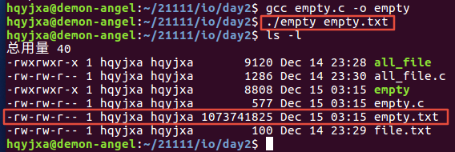
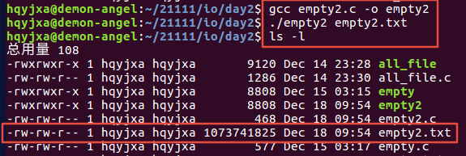

[toc]

# 1 标准IO与文件IO

## 1.1 IO的分类

1. 标准IO：高级磁盘IO
2. 文件IO：低级磁盘IO

## 1.2 标准IO和文件IO的区别

1. 共性：都是一系列用来输入以及输出的函数
2. 区别：
   - 标准IO
     1. 是由ANSI（美国国家标准协会）联合ISO（国际化标准组织）定义的有关C语言的标准
     2. 通过缓冲机制减少系统调用的次数（提高效率），因为存在缓冲区
     3. 通过文件指针（文件流）来操作文件
     3. 不可以操作设备
     4. 可以跨平台操作
     4. 标准C库提供的操作文件的接口(库函数)
   - 文件IO
     1. 是由POSI X（可移植的操作系统接口）提供的一组函数
     2. 没有缓冲区
     3. 通过文件描述符操作文件
     4. 可以操作设备
     4. 不可以跨平台（只能在类Unix系统中使用）
     4. POSIX操作系统提供的系统调用(系统调用)

# 2 空洞文件

## 2.1 什么是空洞文件

在UNIX文件操作中，文件位移量可以大于文件的当前长度，在这种情况下，对该文件的下一次写将延长该文件，并在文件中构成一个空洞，这一点是允许的，位于文件中但没有写过的字节都被设为0.

## 2.2 空洞文件有什么用

迅雷下载文件时，在未下载完成时，就已经占据了全部文件大小的空间，这时候就是空洞文件，下载的时候如果没有空洞文件，多线程下载时文件就都只能从一个地方写入，这就不是多线程了，如果有了空洞文件，可以从不同的地址写入，就完成了多线程的优势任务。

## 2.3 如何创建一个空洞文件

1. 以只写的方式打开该文件
2. 移动文件指针（假设下载一个1G的文件，需要移动1G的空间）
3. 在移动之后的末尾写一个字节
4. 关闭文件

注意：标准IO和文件IO都可以实现空洞文件。

### 2.3.1 文件IO创建一个空洞文件

```c
#include <stdio.h>
#include <sys/types.h>
#include <sys/stat.h>
#include <fcntl.h>
#include <unistd.h>

int main(int argc, const char *argv[])
{
	// 功能:实现创建一个空洞文件
	// (1)以读写方式打开一个文件
	int fd = open(argv[1],O_RDWR | O_CREAT | O_TRUNC,0664);
	if(fd < 0)
	{
		perror("fail to open");
		return -1;
	}
	// (2)假设，所需占据的空间为1G,需要利用lseek实现定位
	lseek(fd, 1024*1024*1024, SEEK_SET);
	// (3)给定位的1G空间的末尾处写入一个字符
	write(fd, "\0", 1);
	// (4)关闭文件
	close(fd);
	return 0;
}
```

result



### 2.3.2 标准IO创建一个空洞文件

```c
#include <stdio.h>

int main(int argc, const char *argv[])
{
	// 功能:实现创建一个空洞文件
	// (1)以读写的方式打开文件
	FILE *fd = fopen(argv[1],"w+");
	if(NULL == fd)
	{
		perror("fail to fopen");
		return -1;
	}
	// (2)假设，所需占据的空间为1G，需要利用fseek实现定位
	fseek(fd,1024*1024*1024,SEEK_SET);
	// (3)给定位的1G空间的末尾处写入一个字符
	fputc('\0',fd);
	// (4)关闭文件
	fclose(fd);
	return 0;
}
```

result


