[toc]

# 页面跳转

[什么时候使用不同的缓冲](#什么时候使用不同的缓冲)

# 1 文件的概念

文件用来存放程序、文档、音频、视频数据、图片等数据的。

文件就是存放在磁盘上的，一些数据的集合。

在windows下可以通过写字板或记事本打开文本文件对文件进行编辑保存。写字板和记事本是微软程序员写的程序，对文件进行打开、显示、读写、关闭。作为一个程序员，必须掌握编程实现创建写入，读取文件等操作。

## 1.1 文件的定义

### 1.1.1 磁盘文件

指一组相关数据的有序集合，通常存储在外部介质（如磁盘）上，使用时才调入内存。

### 1.1.2 设备文件

在操作系统中把每一个与主机相连的输入、输出设备看作是一个文件，把它们的输入、输出等同于对磁盘文件的读和写。

键盘：标准输入文件

屏幕：标准输出文件

其他设备：打印机、触摸屏、摄像头、音箱等。

在Linux操作系统中，每一个外部设备都在/dev目录下对应着一个设备文件，用户在程序中想要操作设备，就必须对与其对应的/dev下的设备文件进行操作。

标准IO库函数对磁盘文件的读取特点


文件缓冲区是库函数申请的一段内存，由库函数对其进行操作，程序员没有必要知道存放在哪里，只需要知道对文件操作的时候的一些缓冲特点即可。

### 1.1.3 缓冲区的方向

方向1：如果从内存向磁盘输出数据时：先不断的往缓冲区中存储数据，直到缓冲区被放满或者刷新缓冲区之后，再经过一次系统调用（写操作）即可完成。

方向2：如果从内存向磁盘输入数据时：先经过一次系统调用（读操作）读取一批数据到缓冲区中来，然后在不断的从缓冲区中进行读取即可

### 1.1.4 缓冲的分类

1. 行缓冲

   标准io库函数，往标准输出（屏幕）输出东西的时候是行缓冲的，所谓的行缓冲就是缓冲区碰到换行符的时候才刷新缓冲区。如果不刷新缓冲区，无法对文件执行读写操作。

   行缓冲的刷新条件：

   ```c
   #include <stdio.h>
   
   int main(int argc,char *argv[])
   {
    // 由于printf函数是一个标准IO,所以只有刷新缓冲区才可以将数据输出到终端
    // printf("hello world");
    // while(1);
   
    // 刷新缓冲区方法1:使用\n
    // 没有输出，但是在终端是可以输出的，因为有一个while(1);
    // printf("hello world\n");
   
    // 刷新缓冲区方法2:程序正常结束
    // printf("hello world");
    // return 0;
   
    // 刷新缓冲区的方法3:使用fflush函数刷新缓冲区
    // 程序输出helloworld
    // printf("hello world");
    // fflush:刷新函数。可以刷新指定的缓冲区
    // stdout:标准输出，就是对终端进行写操作
    // fflush(stdout);
   
    // 刷新缓冲区方法4:当缓冲区满的时候自动刷新
    // 默认行缓冲的大小为1024个字节
    int i;
    for(i = 1;i < 300;i++)
    {
        printf("%03d ",i);
    }
   
    while(1);
    return 0;
   }
   ```

2. 全缓冲

   标准IO库函数，往普通文件读写数据的，是全缓冲的，碰到换行符也不刷新缓冲区，即缓冲区满了，才刷新缓冲区。==**4096大小**==

   刷新缓冲区的情况：

   - 缓冲区满了，刷新缓冲区
   - 人为刷新缓冲区fflush(文件指针)
   - 程序正常结束，会刷新缓冲区

3. 无缓冲

   在读写文件的时候通过系统调用io(read write),对文件进行读写数据这个时候是无缓冲的，即写数据会立马进入文件，读数据会立马进入内存。

### 1.1.5 写文件的流程

应用程序空间 -- 内核空间 -- 驱动程序 -- 硬盘上

应用程序和内核程序运行在不同的空间里，目的是为了保护内核。

### 1.1.6 设置缓冲区的目的

==**通过缓冲可以减少进出内核的次数，以提高效率，更加安全。**==

### 1.1.7 什么时候使用行缓冲、全缓冲、无缓冲

<a name = "什么时候使用不同的缓冲"></a>

#### 1.1.7.1 行缓冲

标准输入流和标准输出流（默认）

#### 1.1.7.2 全缓冲

除行缓冲和无缓冲之外的

#### 1.1.7.3 无缓冲

标准错误流

## 1.2 磁盘文件的分类

一个文件通常是磁盘上一段命名的存储区。

计算机的存储在物理上是二进制的。

所以物理上所有的磁盘文件本质上都是一样的：以字节为单位进行顺序存储，从用户或者操作系统使用的角度（逻辑上）把文件分为：

文本文件：基于字符编码的文件

二进制文件：基于值编码的文件

### 1.2.1 文本文件

基于字符编码，常见的编码有ASCII、UNICODE等。

一般可以使用文本编辑器直接打开

例如：数5678的以ASCII存储形式为：

​			ASCII码:00110101 00110110 00110111 00111000

​			歌词文件(lrc):文本文件

### 1.2.2 二进制文件

基于值编码，自己根据具体应用指定某个值是什么意思，把内存中的数据按其在内存中的存储形式原样输出到磁盘上，一般需要自己判断或使用特定软件分析数据格式。

例如：数5678的存储形式为：

​			二进制码：00010110 00101110

​			音频文件(mp3)：二进制文件

​			图片文件(bmp)文件，一个像素点由两个字节来描述

​			`*****#####&&&&&`

​				*代表红色的值

​				#代表绿色的值

​				&代表蓝色的值

​		二进制文件以位来表示一个意思。

### 1.2.3 文本文件、二进制文件对比

#### 1.2.3.1 译码

文本文件编码基于字符定长，译码容易些；

二进制文件编码变长的，译码难一些(不同的二进制文件格式，有不同的译码方式)

#### 1.2.3.2 空间利用率

二进制文件用一个比特来代表一个意思(位操作)；

而文本文件任何一个意思至少是一个字符。

二进制文件，空间利用率高。

#### 1.2.3.3 可读性

文本文件用通用的记事本工具就可以浏览所有文本文件

二进制文件需要一个具体的文件解码器，比如读BMP文件，必须用读图软件。

### 1.2.4 总结

文件在硬盘上存储的时候，物理上都是二进制来存储的。

标准的io库函数，对文件操作的时候，不管文件的编码格式（字符编码，或二进制），而是按字节对文件进行读写，所以用户管文件又叫流式文件，即把文件看成一个字节流。

# 2 流

数据的输入输出相当于数据的流入以及流出，磁盘或者物理设备（键盘，显示屏，打印机）都可以看成源头或者目的，源头或者目的操作的内容称为操作对象，把对象就叫流。

## 2.1 产生流的条件

1. 源头
2. 目的
3. 持续性

## 2.2 理解输入流以及输出流

数据当作水，水缸当作文件

连接水缸和外界的就是一个水管

### 2.2.1 分析

1. 如果想要将水（数据）存储到水缸（文件）中，等价于写操作，产生的效果：水（数据）通过水管（流）流入水缸，就是输出流（注水）
2. 如果想要将水缸（文件）中的水（数据）往外排水，等价于读操作，产生的效果：水（数据）通过水管流出水缸（文件），就是输入流（排水）

## 2.3 流的分类

1. 文本流：在流中数据是按照字符的样子进行流动
2. 二进制流：在流中数据是按照二进制的样子进行流动的

## 2.4 如何操作流

操作文件就是操作流

操作流就等价于操作文件指针

进而：操作文件就是通过操作文件指针来实现的。

如何去操作流？

系统在打开文件的过程中吗，会将该文件的信息保存在一个结构体中，系统并且给该结构的类型重命名为FILE,此时一旦采用fopen打开某个文件时，会返回一个类型为FILE *的指针，将该指针称为==**文件指针**==

## 2.5 如何标识一个流

通过系统定义的一个保存文件信息的结构体表示的，取名叫FILE的对象来表示的。

## 2.6 默认的流

一旦一个进程启动的时候，就会默认产生下面的3个流

1. 标准输入流：stdin
2. 标准输出流：stdout
3. 标准出错流：stderr

# 3 文件指针

文件指针就是用于标识一个文件的，所有对文件的操作都是用文件指针进行操作的。

## 3.1 定义文件指针的一般形式

`FIFE * 指针变量标识符；`

FIFE为大写，需要包含<stdio.h>头文件

==**FIFE是系统使用typedef定义出来的有关文件信息的一种结构体类型，结构中含有文件名，文件状态和文件当前位置等信息。**==

一般情况下，我们操作文件前必须定义一个文件指针标识，我们将要操作的文件，实际编程中使用库函数操作文件，无需关心FILE结构体的细节，只需要将文件指针传给io库函数，库函数再通过FILE结构体里的信息对文件进行操作。

本质上文件指针是一个结构体指针，结构体中包含了当前文件的很多信息，但是在实际编程时，不需要关心结构体的成员，只需要使用文件指针即可。

## 3.2 对文件操作的步骤

1. 对文件进行读写等操作之前要打开文件得到文件指针
2. 可以通过文件指针对文件进行读写等操作
3. 读写等操作完毕之后，要关闭文件，关闭文件后，就不能再通过此文件指针操作文件了。

## 3.3 C语言中有三个特殊的文件指针（文件流）无需定义，在程序中可以直接使用

### 3.3.1 stdin

标准输入 默认为当前终端（键盘）

我们使用的scanf、getchar函数默认从此终端获得数据。

### 3.3.2 stdout

标准输出 默认为当前终端（屏幕）

我们使用的printf、puts函数默认输出信息到此终端。

### 3.3.3 stderr

标准错误输出设备文件 默认为当前终端（屏幕）（不带缓冲）

当我们程序出错使用:perror函数时信息打印在此终端

# 4 打开文件fopen

```c
// 头文件
#include <stdio.h>
// 函数定义
FILE *fopen(const char *_Filename, const char *_Mode);
/*笔记：
 * 功能：
 * 		fopen函数的功能是打开一个已经存在的文件，并返回这个文件的文件指针（文件的标示）
 *      或者创建一个文件，并打开此文件，然后返回文件的标示。
 * 参数：_Filename:文件名，如果只写文件名，默认就是当前路径，也可以添加路径
 *      _Mode:文件权限
 *      r   只读，如果文件不存在则报错
 *      r+  读写，如果文件不存在则报错
 *      w   只写，如果文件不存在则创建，如果文件存在则清空
 *      w+  读写，如果文件不存在则创建，如果文件存在则清空
 *      a   只写，如果文件不存在则创建，如果文件存在则追加
 *      a+  读写，如果文件不存在则创建，如果文件存在则追加
 * 返回值：
 *      成功：文件指针
 *      失败：NULL
 */ 
```

| 模式    | 功能                                                         |
| :------ | ------------------------------------------------------------ |
| r或rb   | 以只读方式打开一个文本文件（不创建文件）                     |
| w或wb   | 以写方式打开文件（使文件长度截断为0字节，创建一个文件）      |
| a或ab   | 以添加方式打开文件，即在末尾添加内容，当文件不存在时，创建文件用于写 |
| r+或rb+ | 以可读、可写的方式打开文件（不创建新文件）                   |
| w+或wb+ | 以可读、可写的方式打开文件（使文件长度为0字节，创建一个文件） |
| a+或ab+ | 以添加方式打开文件，打开文件并在末尾更改文件（如果文件不存在，则创建文件） |

b的意思是二进制文件。

```c
#include <stdio.h>

int main(int argc,char *argv[])
{
    // 使用fopen函数打开或者创建文件，返回文件指针
    FILE *fp;
    // 以只读的方式打开文件，如果文件不存在则报错
    // fp = fopen("../temporary/test.txt","r");

    // 以只写的方式打开文件，如果文件不存在则创建，如果文件存在则清空
    // fp = fopen("../temporary/test.txt","w");

    // 以只写的方式打开文件，如果文件不存在则创建，如果文件存在则追加
    fp = fopen("../temporary/test.txt","a");
    if(fp == NULL)
    {
        printf("fail to fopen\n");
        return -1;
    }
    return 0;
}
```

# 5 关闭文件fclose

```c
// 头文件
#include <stdio.h>
// 函数定义
int fclose(FILE *_File);
/*
 * 功能:关闭一个文件指针，无法对当前文件进行操作
 * 参数:
 *      _File:指定的文件指针，fopen函数的返回值
 * 返回值:
 *      成功:0
 *      失败:EOF
 * 注意:注意一个文件只能关闭一次，不能多次关闭。
 *      关闭文件之后就不能用文件指针对文件进行读写操作了。
 *      可以通过返回值，来判断关闭文件是否成功。
 */
```

```c
#include <stdio.h>

int main(int argc,char *argv[])
{
    // 使用fopen函数打开或者创建文件，返回文件指针
    FILE *fp;

    // 以只写的方式打开文件，如果文件不存在则创建，如果文件存在则追加
    fp = fopen("../temporary/test.txt","a");
    if(fp == NULL)
    {
        printf("fail to fopen\n");
        return -1;
    }
    // 使用fclose关闭文件
    fclose(fp);
    return 0;
}
```

# 6 按照字符操作

==**fgetc和fputc可以操作文本文件和二进制文件**==

## 6.1 fgetc

```c
// 头文件
#include <stdio.h>
// 函数定义
int fgetc(FILE *_File);
/*
 * 功能:从文件指针标识的文件中读取一个字符
 * 参数:
 *      _File:指定的文件指针
 * 返回值:
 *      成功:读取的字符
 *      失败:EOF
 * 如果文件读取完毕，也会返回EOF,EOF是在stdio.h文件中定义的符号常量，值为-1
 */
```

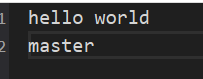

```c
#include <stdio.h>

int main(int argc,char *argv[])
{
    // 使用fopen函数打开或者创建文件，返回文件指针
    FILE *fp;

    // 以只读的方式打开文件，如果文件不存在则报错
    fp = fopen("../temporary/test.txt","r");
    if(fp == NULL)
    {
        printf("fail to fopen\n");
        return -1;
    }

    // 使用fgetc从文件中读取一个字符
    // int c = fgetc(fp);
    // printf("c = [%c] - %d\n",c,c);
    // c = fgetc(fp);
    // printf("c = [%c] - %d\n",c,c);
    // 输出结果:
    //      c = [h] - 104
    //      c = [e] - 101

    // 文件的每一行结束的位置都有一个标识，是一个换行符，称之为行结束符
    // fgetc可以读取到行结束符
    int c;
    while((c = fgetc(fp)) != EOF)
    {
        printf("c = [%c] - %d\n",c,c);
    }

    return 0;
}
```

执行结果

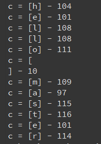

## 6.2 fputc

```c
// 头文件
#include <stdio.h>
// 函数定义
int fputc(int _Ch, FILE *_File);
/*
 * 功能:向文件指针标识的文件中写入一个字符
 * 参数:
 *      _Ch:要写入字符
 *      _File:指定的文件指针
 * 返回值:
 *      成功:要写入的字符
 *      失败:EOF
 */
/*
 * 注意:
 *      打开文件的时候，默认读写位置在文件的开始，
 *      如果以a的方式打开读写位置在文件的末尾。
 *      用户向文件中读取字节或写入字节的时候，读写位置会往文件的末尾方向偏移，
 *      读写多少个字节，读写位置就往文件的末尾方向偏移多少个字节。
 */
```

```c
#include <stdio.h>

int main(int argc,char *argv[])
{
    // 使用fopen函数打开或者创建文件，返回文件指针
    FILE *fp;

    // 以只写的方式打开文件，如果文件不存在则创建，如果文件存在清空
    fp = fopen("../temporary/test.txt","w");
    if(fp == NULL)
    {
        printf("fail to fopen\n");
        return -1;
    }
    // 通过fputc函数向文件写入一个字符
    fputc('w',fp);
    fputc('e',fp);
    fputc('l',fp);
    fputc('c',fp);
    fputc('o',fp);
    fputc('m',fp);
    fputc('e',fp);
    fputc('\n',fp);
    fputc('t',fp);
    fputc('o',fp);
    fputc('x',fp);
    fputc('i',fp);
    fputc('a',fp);
    fputc('n',fp);

    return 0;
}
```

执行结果

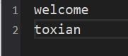

## 6.3 feof

```c
// 头文件
#include <stdio.h>
// 函数格式
int feof(FILE *stream);
/*
 * 功能：
 *      用来检测是否读取到了文件尾
 * 参数：
 *      stream为fopen()所返回的文件指针
 *      如果已到文件尾返回非零值，其他情况返回0
 * 返回值：
 *      返回非零值表示已到达文件尾
 *      返回0则还未到达文件尾
 */
```

```c
#include <stdio.h>
// 功能：实现文本文件、二进制文件（图片）的复制
// 使用fgetc()和fputs()函数实现图片的复制
int main(int argc, const char *argv[])
{
	FILE *fr = fopen(argv[1],"r");
	FILE *fw = fopen(argv[2],"w");
	if(NULL == fr || NULL == fw)
	{
		perror("error");
		return -1;
	}
	while(1)
	{
		int c = fgetc(fr);
		if(EOF == c)
		{
			break;	
		}	
		fputc(c,fw);
	}
	fclose(fw);
	fclose(fr);
	return 0;
}
```

result

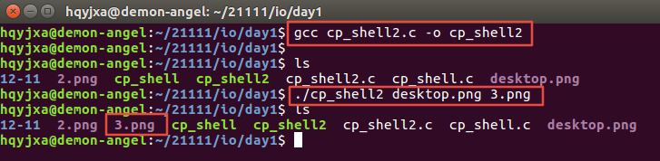


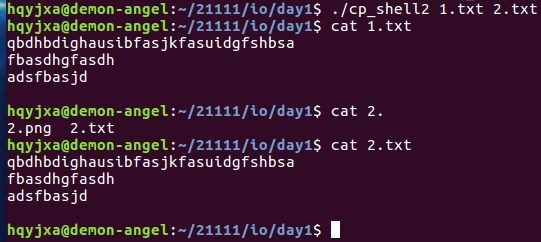

# 7 按照行操作

==**fgets和fputs只能操作文本文件**==

## 7.1 fgets

```c
// 头文件
#include <stdio.h>
// 函数定义
char *fgets(char *_Buf, int _MaxCount, FILE *_File);
/*
 * 功能:从文件中读取内容
 * 参数:
 *      _Buf:保存读取到的内容
 *      _MaxCount:每次读取的最大个数
 *      _File:文件指针
 * 返回值:
 *      成功:读取的数据的首地址，即_Buf
 *      失败:NULL
 *      如果文件内容读取完毕，也返回NULL
 * 注意:
 *      从_File所指的文件中读取字符，在读取的时候碰到换行符或者碰到文件的末尾停止读取，
 *      或者是读取了_MaxCount-1个字节停止读取，在读取的内容后面会加一个\0，
 *      作为字符串的结尾。
 */
```

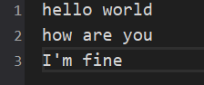

```c
#include <stdio.h>

int main(int argc,char *argv[])
{
    // 使用fopen函数打开或者创建文件，返回文件指针
    FILE *fp;

    // 以只读的方式打开文件，如果文件不存在则报错
    fp = fopen("../temporary/test.txt","r");
    if(fp == NULL)
    {
        printf("fail to fopen\n");
        return -1;
    }
    // 使用fgets读取文件内容
    // fgets每次读取时最多读取文件一行内容，只要遇到行结束符就立即返回
    // 如果想要读取的字节数小于一行内容，则只会读取第二个参数-1个字节，
    // 最后位置补\0

    char buf[32] = "";
    // fgets(buf,8,fp);
    // 输出结果:buf = hello w
    // 只读取了7个字节，最后一个字节存放的是'\0'

    fgets(buf,32,fp);
    printf("buf = %s\n",buf);

    return 0;
}
```

执行结果

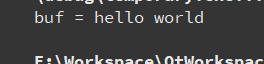

## 7.2 fputs

```c
// 头文件
#include <stdio.h>
// 函数定义
int fputs(const char *_Str, FILE *_File);
/*
 * 功能:向文件写入数据
 * 参数:
 *      _Str:要写入的内容
 *      _File:文件指针
 * 返回值:
 *      成功:写入文件内容的字节数
 *      失败:EOF即-1
 */
```

```c
#include <stdio.h>

int main(int argc,char *argv[])
{
    // 使用fopen函数打开或者创建文件，返回文件指针
    FILE *fp;

    // 以只写的方式打开文件，如果文件不存在则创建，如果文件存在则清空
    fp = fopen("../temporary/test.txt","w");
    if(fp == NULL)
    {
        printf("fail to fopen\n");
        return -1;
    }
    // 通过fputs函数向文件写入数据
    fputs("Welcome to xian!\n",fp);
    fputs("The city that never sleeps",fp);


    return 0;
}
```

执行结果


# 8 按照块操作

==**可以操作文本文件和二进制文件**==

## 8.1 读文件fread

```c
// 头文件
#include <stdio.h>
// 函数定义
size_t fread(void *_DstBuf, size_t _ElementSize, size_t _Count, FILE *_File);
/*
 * 功能:从文件中读取数据
 * 参数:
 *      _DstBuf:保存读取的数据
 *      _ElementSize:每次读取的字节数
 *      _Count:一共读取的次数/块数
 *      _File:文件指针
 * 返回值:
 *      成功:实际读取的次数（对象数、块数）
 *      失败:0
 * 如果文件内容读取完毕，返回0
 */
```

```c
// ex:
int num;
num = fread(str,100,3,fp);
// 从fp所代表的文件中读取内容存放到str指向的内存中，
// 读取的字节数为300，每块100个字节，3块。
// 返回值num,如果读到300个字节返回值num为3;
// 如果读到了大于等于200个字节小于300个字节，返回值为2；
// 读到的字节数，大于等于100个字节小于200个字节，返回1；
// 不到100个字节返回0。
```

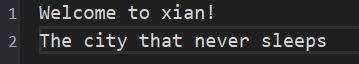

```c
#include <stdio.h>

int main(int argc,char *argv[])
{
    // 使用fopen函数打开或者创建文件，返回文件指针
    FILE *fp;

    // r以只读的方式打开，如果文件不存在则报错
    fp = fopen("../temporary/test.txt","r");
    if(fp == NULL)
    {
        printf("fail to fopen\n");
        return -1;
    }
    // 使用fread函数读取文件内容
    int num;
    char buf[128] = "";
    num = fread(buf,5,4,fp);

    printf("buf = %s\n",buf);
    printf("num = %d\n",num);

    return 0;
}
```

执行结果

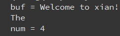

## 8.2 写文件fwrite

```c
// 头文件
#include <stdio.h>
// 函数定义
size_t fwrite(const void *_Str, size_t _Size, size_t _Count, FILE *_File);
/*
 * 功能：向文件中写入数据
 * 参数:
 *      _Str:要写入的数据
 *      _Size:一次写入的字节数
 *      _Count:一共写入的次数
 *      _File:文件指针
 * 返回值:
 *      成功:实际写入的次数
 *      失败:0
 */
```

```c
#include <stdio.h>

typedef struct
{
    int a;
    int b;
    char c;
}MSG;

int main(int argc,char *argv[])
{
    // 使用fopen函数打开或者创建文件，返回文件指针
    FILE *fp;

    // w+  读写，如果文件不存在则创建，如果文件存在则清空
    fp = fopen("../temporary/test.txt","w+");
    if(fp == NULL)
    {
        printf("fail to fopen\n");
        return -1;
    }
    // 使用fwrite向文件写入一个结构体
    MSG msg[4] = {1,2,'a',3,4,'b',5,6,'c',7,8,'d'};
    fwrite(msg ,sizeof(MSG),4,fp);
    // 将文件的偏移量设置为文件的起始位置
    rewind(fp);
    MSG rcv[4];
    fread(rcv,sizeof(MSG),4,fp);
    int i;
    for(i = 0;i < 4;i++)
    {
        printf("%d - %d _%c\n",rcv[i].a,rcv[i].b,rcv[i].c);
    }

    return 0;
}
```

执行结果


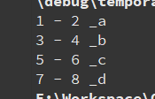

### 8.2.1 注意

==**fwirte函数是将内存中的数据原样输出到文件中。**==

==**fread函数是将文件中的数据原样读取到内存里。**==

# 9 格式化读写文件函数

```c
/*
 * 函数调用:
 *      fprintf(文件指针，格式字符串，输出表列);
 *      fscanf(文件指针，格式字符串，输入表列);
 * 函数功能:
 *      从磁盘文件中读入或输出字符
 * 
 * fprintf和printf函数类似:
 *      printf是将数据输出到屏幕上(标准输出)，
 *      fprintf函数是将数据输出到文件指针所指定的文件中。
 * 
 * fscanf和scanf函数类型:
 *      scanf是从键盘(标准输入)获取输入，
 *      fscanf是从文件指针所标示的文件中获取输入。
 */
```

```c
#include <stdio.h>

int main(int argc,char *argv[])
{
    // 使用fopen函数打开或者创建文件，返回文件指针
    FILE *fp;

    char ch1 = 'a',ch2;
    int num1 = 50,num2;
    char string1[20] = "hello",string2[20];
    float score1 = 85.5,score2;

    // w+  读写，如果文件不存在则创建，如果文件存在则清空
    fp = fopen("../temporary/test.txt","w+");
    if(fp == NULL)
    {
        printf("fail to fopen\n");
        return -1;
    }

    // 使用fprintf向文件中写入字符串
    fprintf(fp,"%c %d %s %.2f\n",ch1,num1,string1,score1);
    // 将文件的偏移量设置为文件的起始位置
    rewind(fp);

    // 使用fscanf获取文件内容
    fscanf(fp,"%c %d %s %f\n",&ch2,&num2,&string2,&score2);
    printf("%c %d %s %.2f\n",ch2,num2,string2,score2);
    fclose(fp);
    return 0;
}
```

执行结果


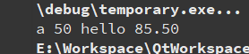

# 10 随机读写--定位流

前面介绍的对文件的读写方式都是顺序读写，即读写文件只能从头开始，顺序读写各个数据；但在实际问题中常要求只读写文件中某一指定的部分，例如：读取文件第200--300个字节。为了解决这个问题可以移动文件内部的位置指针到需要读写的位置，再进行读写，这种读写称为随机读写。实现随机读写的关键是要按要求移动位置指针，==**这称为文件的定位**==。

## 10.1 rewind

rewind复位读写位置

```c
// 头文件
#include <stdio.h>
// 函数定义
void rewind(FILE *_File);
/*
 * 功能:
 *      将文件位置定位到起始位置
 * 参数:
 *      _File:文件指针
 * 返回值:
 *      无
 */
```

## 10.2 ftell

ftell测文件读写位置距文件开始有多少个字节

```c
// 头文件
#include <stdio.h>
// 函数定义
long ftell(FILE *_File);
/*
 * 功能:
 *      获取当前文件的偏移量
 *      另一个说法:取得文件流目前的读写位置
 * 参数:
 *      _File:文件指针
 * 返回值:
 *      获取当前文件的偏移量(距离文件起始的字节数),出错时返回-1;
 */
```

## 10.3 fseek

fseek定位位置指针（读写位置）

fseek函数（一般用于二进制文件即打开文件的方式需要带b）

```c
// 头文件
#include <stdio.h>
// 函数定义
int fseek(FILE *stream, long offset, int whence);
// int fseek(文件类型指针，位移量，起始点);
/*
 * 功能:
 *      设置文件位置指针的偏移量。
 *      另一种说法:移动文件流的读写位置。
 * 参数:
 *      stream:文件指针
 *      offset:偏移量
 *          可正（向右）可负（向左）可为0(当前位置保持不变);
 *          以起始点为基点，向前、后移动到字节数，正数往文件末尾方向偏移，
 *          负数往文件开头方向偏移。
 *      whence:相对位置
 *          SEEK_SET    文件起始位置
 *          SEEK_CUR    文件当前位置
 *          SEEK_END    文件末尾位置（最后一个字符后面的位置）
 * 返回值:
 *      成功:0
 *      失败:-1
 */

rewind(fp); <==> fseek(fp,0,SEEK_SET);
```

```c
#include <stdio.h>

int main(int argc,char *argv[])
{
    // 使用fopen函数打开或者创建文件，返回文件指针
    FILE *fp;

    // w+  读写，如果文件不存在则创建，如果文件存在则清空
    fp = fopen("../temporary/test.txt","w+");
    if(fp == NULL)
    {
        printf("fail to fopen\n");
        return -1;
    }
    // 向文件中放入字符串
    fputs("123456789\n",fp);
    fputs("welcome to XiAn!",fp);
    // 获取当前文件指针的读写位置
    printf("offest = %ld\n",ftell(fp));

    // 将当前文件的读写位置设置到文件的起始位置，下面是两种方法
    // rewind(fp);
    // fseek(fp,0,SEEK_SET);

    // 将当前文件的读写位置设置为倒数第五个位置
    fseek(fp,-5,SEEK_END);
    printf("offest = %ld\n",ftell(fp));

    char buf[32] = "";
    while(fgets(buf,32,fp) != NULL)
    {
        printf("[%s]\n",buf);
    }
    return 0;
}
```

执行结果

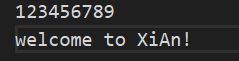

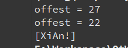