[toc]

# 1 系统编程概述

## 1.1 操作系统的职责

操作系统用来管理所有的资源，并将不同的设备和不同的程序关联起来。

## 1.2 什么是linux系统编程

在有操作系统的环境下编程，并使用操作系统提供的系统调用及各种库，对系统资源进行访问。

系统编程主要就是为了让用户能够更好的和更方便的操作硬件设备，并且对硬件设备也起到保护作用，我们所写的程序，本质就是对硬件设备的操作，所以操作系统提供接口可以对硬件进行操作，这就是系统编程。

# 2 系统调用概述

类UNIX系统的软件层次

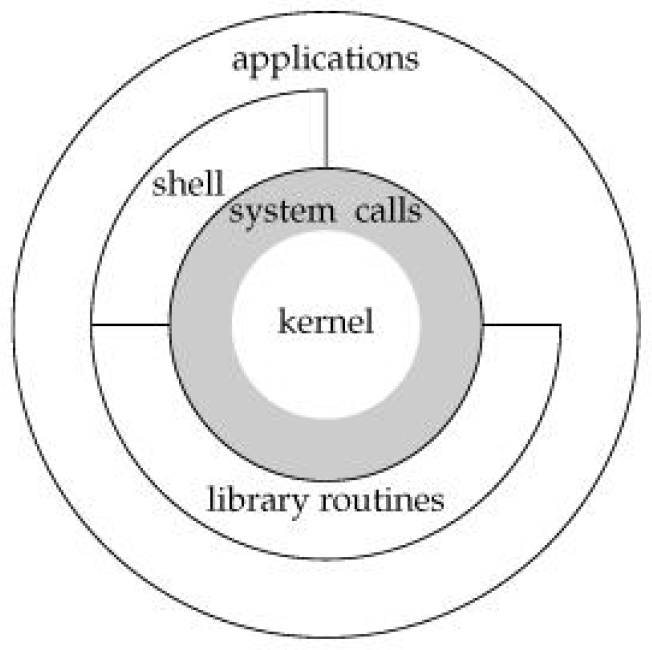

本质都是要对硬件设备进行操作，但是Linux操作系统在硬件之上设置了内核，也就是只有内核才可以直接操作硬件设备，如果想操作内核，需要调用内核的系统调用，如果想要操作内核中的系统调用有三种方式

1. shell，用户通过shell命令，有shell解释器操作内核的系统调用
2. 库函数，用户通过应用层库函数的接口，比如fread对内核的系统调用进行操作
3. 应用层系统调用，他可以直接对内核的系统调用进行操作

系统调用是操作系统提供给用户程序的一组“特殊”函数接口

linux的不同版本提供了两三百个系统调用

用户程序可以通过这组接口获得操作系统（==内核==）提供的服务。

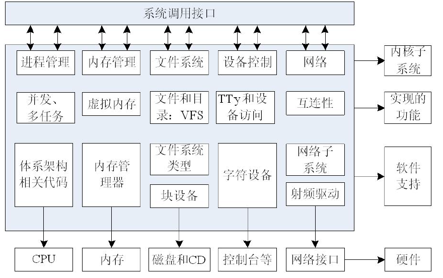

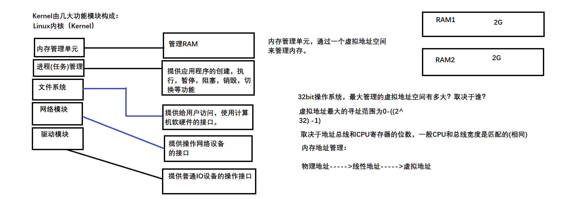

**系统调用按照功能逻辑大致可分为**：

进程控制、进程间通信、文件控制系统、系统控制、内存管理、网络管理、socket控制，用户管理

***内存管理***：管理RAM

***进程（任务）管理***：提供应用程序的创建，执行，暂停，阻塞，销毁，切换等功能。

***文件系统***：提供给用户访问，使用计算机软硬件的接口

***网络模块***：提供操作网络设备的接口

***驱动模块***：提供普通IO设备的操作接口

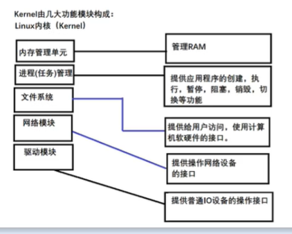

**系统调用的返回值**：

通常，用一个负的返回值来表明错误，返回一个0值表明成功。

错误信息存放在全局变量errno中，用户可以用perror函数打印出错信息。

**系统调用采用的规范**：

在linux中，应用程序编程接口（API）遵循POSIX标准。

POSIX标准基于当时现有的UNIX实践和检验，描述了操作系统的系统调用编程接口（实际上就是API），用于保证应用程序可以在源代码一级上在多种操作系统上移植运行。

# 3 系统调用I/O函数

系统调用操作I/O的函数，都是针对文件描述符的

通过文件描述符可以直接对相应的文件进行操作。

## 3.1 文件描述符

文件描述符是非负整数，打开现存文件或新建文件时，系统（内核）会返回一个文件描述符。文件描述符用来指定已打开的文件。

在系统调用（文件I/O）中，文件描述符对文件起到标识作用，如果操作文件，就是对文件描述符的操作。

当一个程序运行或者一个进程开启时，==**系统会自动创建三个文件描述符**==。

| 名称 | 含义         |
| :--- | :----------- |
| 0    | 标准输入     |
| 1    | 标准输出     |
| 2    | 标准输出出错 |

系统中也会用到一些宏

```c
#define STDIN_FILENO 0				// 标准输入文件描述符
#define STDOUT_FILENO 1				// 标准输出的文件描述符
#define STRERR_FILENO 2				// 标准错误文件描述符
```

文件IO的文件描述符和标准IO的文件指针的对应关系

| 文件IO | 标准IO |
| :----- | :----- |
| 0      | stdin  |
| 1      | stdout |
| 2      | stderr |

如果自己打开文件会返回文件描述符，而文件描述符一般按照从小到大的顺序依次创建。

## 3.2 open函数

```c
// 头文件
#include <sys/types.h>
#include <sys/stat.h>
#include <fcntl.h>

// 函数定义
// 文件存在的时候使用
int open(const char *pathname, int flags);

// 文件不存在的时候使用
int open(const char *pathname, int flags, mode_t mode);

/*
 * 功能:
 *      打开或者创建一个文件，返回文件描述符
 * 参数:
 *      pathname:指定路径的文件名，不指定路径默认就是当前的路径
 *      flags:标志位
 *          O_RDONLY       只读
 *          O_WRONLY       只写
 *          O_RDWR          读写
 *			以上三种是互斥的必须有一个
 *			还可以与下列值位或
 *          O_CREAT         文件不存在则创建，需要通过第三个参数来设置文件权限
 *          O_EXCL          一般与O_CREAT一起使用，标识如果文件存在则报错
 *          O_TRUNC         如果文件存在则清空
 *          O_APPEND        如果文件存在则追加
 *          O_NONBLOCK		当打开文件时FIFO、字符文件、块文件时，此选项为非阻塞标志位
 *      mode:文件权限，当指定flags中有O_CREAT时，必须有这个参数,如果没有O_CREAT,则不需要这个参数
 * 返回值:
 *      成功:文件描述符
 *      失败:-1
 */
```

==**mode的取值及其含义**==

| 取值    | 八进制数 | 含义                                   |
| ------- | -------- | -------------------------------------- |
| S_IRWXU | 00700    | 文件所有者的读、写、可执行权限         |
| S_IRUSR | 00400    | 文件所有者的读权限                     |
| S_IWUSR | 00200    | 文件所有者的写权限                     |
| S_IXUSR | 00100    | 文件所有者的可执行权限                 |
| S_IRWXG | 00070    | 文件所有者同组用户的读、写、可执行权限 |
| S_IRGRP | 00040    | 文件所有者同组用户的读权限             |
| S_IWGRP | 00020    | 文件所有者同组用户的写权限             |
| S_IXGRP | 00010    | 文件所有者同组用户的可执行权限         |
| S_IRWXO | 00007    | 其他用户组的读、写、可执行权限         |
| S_IROTH | 00004    | 其他用户组的读权限                     |
| S_IWOTH | 00002    | 其他用户组的写权限                     |
| S_IXOTH | 00001    | 其他用户组的可执行权限                 |

### 3.2.1 文件IO和标准IO权限对比

| 标准IO | 文件IO                                | 权限含义                                                     |
| ------ | ------------------------------------- | ------------------------------------------------------------ |
| r      | O_RDONLY                              | 以只读的方式打开文件，如果文件不存在则报错                   |
| r+     | O_RDWR                                | 以读写的方式打开文件，如果文件不存在则报错                   |
| w      | O_WRONLY \| O_CREAT \| O_TRUNC ，0664 | 以只写的方式打开文件，如果文件不存在则报错，<br />如果文件存在则清空 |
| w+     | O_RDWR \| O_CREAT \| O_TRUNC，0664    | 以读写的方式打开文件，如果文件不存在则创建，<br />如果文件存在则清空 |
| a      | O_WRONLY \| O_CREAT \| O_APPEND，0664 | 以只写的方式打开文件，如果文件不存在则创建，<br />如果文件存在则追加 |
| a+     | O_RDWR \| O_CREAT \| O_APPEND，0664   | 以读写的方式打开文件，如果文件不存在则创建，<br />如果文件存在则追加 |

```c
#include <stdio.h>
#include <sys/types.h>
#include <sys/stat.h>
#include <fcntl.h>
#include <errno.h>

int main(int argc, const char *argv[])
{
	// 使用open函数打开或者创建一个文件
	
	int fd;

	fd = open("file.txt",O_RDONLY | O_CREAT);
	printf("fd = %d\n",fd);

	return 0;
}
```

result

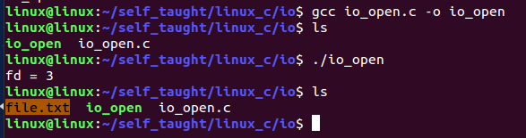

结果解析：

fd=3因为文件本来不存在，现在创建了，因为之前系统自定义了0（标准输入）、1（标准输出）、2（标准输出出错），所以是从3开始的。

### 3.2.2 函数调用出错后输出错误信息

```c
// 通过全局变量 errno
#include <errno.h>
// errno是一个全局变量，当函数调用失败后，可以通过errno获取错误码

// 通过一个函数perror
#include <stdio.h>
void perror(const char *s);
/*
 * 功能:输出函数调用失败的错误信息
 * 参数:
 *      s:打印错误信息的提示信息
 * 返回值:无
 */
```

eg:

```c
#include <stdio.h>
#include <sys/types.h>
#include <sys/stat.h>
#include <fcntl.h>
#include <errno.h>

int main(int argc, const char *argv[])
{
	// 使用open函数打开或者创建一个文件

	int fd;

	fd = open("file.txt",O_RDONLY);
	if(-1 == fd)
	{
		// 通过全局变量error打印错误码
		// 注意需要添加头文件errno.h
		//printf("errno = %d\n",errno);
		//return -1;
		// 输出结果为：
		// 		errno = 2

		// 通过perror函数输出函数调用失败的错误信息
		perror("错误打开文件");
		return -1;
		// 输出结果为：
		// 		错误打开文件: No such file or directory
	}
	printf("fd = %d\n",fd);
	return 0;
}
```

perror对应的执行结果：

如果没有file.txt文件，就会打印错误码对应的错误信息，如果有file.txt的话，就可以正常执行。

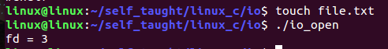

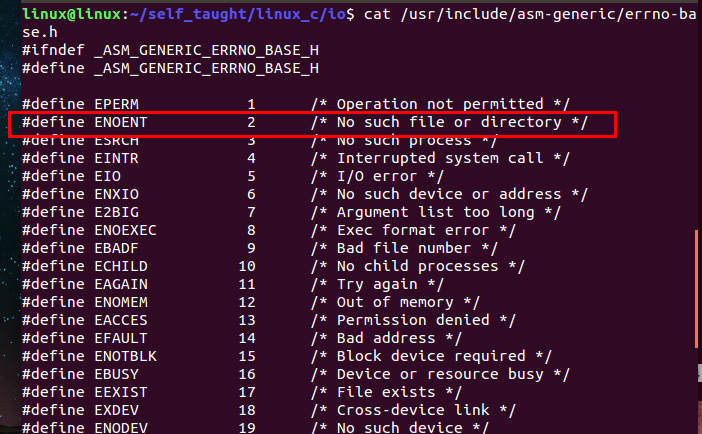

## 3.3 close函数

```c
// 头文件
#include <unistd.h>
// 函数定义
int close(int fd);
/*
 * 功能：关闭一个文件描述符，关闭文件
 * 参数：
 *      fd:指定文件的文件描述符，open函数的返回值
 * 返回值：
 *      成功：0
 *      失败：-1,可以利用perror去查看原因
 */
```

### 3.3.1 案例

```c
#include <stdio.h>
#include <sys/types.h>
#include <sys/stat.h>
#include <fcntl.h>
#include <unistd.h>

int main(int argc, const char *argv[])
{
	int fd;
	fd = open("file.txt",O_RDONLY);
	
	if(-1 == fd)
	{
		perror("fail to open");
		return -1;
	}

	printf("fd = %d\n",fd);

	// 当不对文件进行任何操作的时，就会关闭文件描述符
	// 使用close函数关闭文件描述符
	// 一旦关闭了文件描述符，就不能在通过原有的文件描述符对文件进行操作
	close(fd);
	return 0;
}
```

result

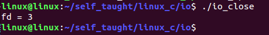

### 3.3.2 文件描述符的相关问题

```c
#include <stdio.h>
#include <sys/types.h>
#include <sys/stat.h>
#include <fcntl.h>
#include <unistd.h>

int main(int argc, const char *argv[])
{
#if 0
	// 测试1：一个进程（一个程序的运行）创建的文件描述符的个数
	// 一个程序运行的时候最多可以创建1024个文件描述符，0～1023
	int fd;
	while(1)
	{
		fd = open("file.txt",O_RDONLY | O_CREAT, 0664);

		if(-1 == fd)
		{
			perror("fail to open");
			return -1;
		}
		printf("fd = %d\n",fd);
	}
#endif

#if 1
	// 测试2：文件描述符值的规律
	// 文件描述符按照从小到大的顺序依次创建
	// 如果中途有文件描述符被关闭了，则再创建的
	// 文件描述符会先补齐之前的，然后依次递增创建
	// 注意：不要认为最后创建的文件描述符一定是最大的
	int fd1, fd2, fd3, fd4;
	fd1 = open("test.txt",O_RDONLY | O_CREAT,0664);
	fd2 = open("test.txt",O_RDONLY | O_CREAT,0664);
	fd3 = open("test.txt",O_RDONLY | O_CREAT,0664);
	fd4 = open("test.txt",O_RDONLY | O_CREAT,0664);

	printf("fd1 = %d\n",fd1);
	printf("fd2 = %d\n",fd2);
	printf("fd3 = %d\n",fd3);
	printf("fd4 = %d\n",fd4);

	close(fd2);

	int fd5, fd6;
	fd5 = open("test.txt",O_RDONLY | O_CREAT,0664);
	fd6 = open("test.txt",O_RDONLY | O_CREAT,0664);
	printf("fd5 = %d\n",fd5);
	printf("fd6 = %d\n",fd6);
#endif
	return 0;
}
```

result1

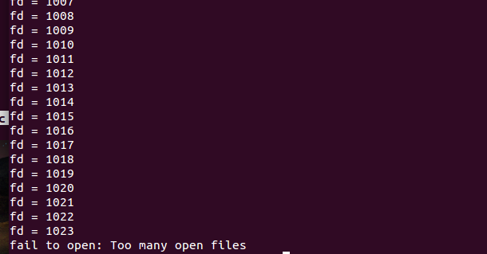

result2

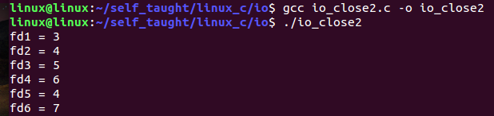

## 3.4 write函数

```c
// 头文件
#include <unistd.h>
// 函数定义
ssize_t write(int fd, const void *buf, size_t count);
/*
 * 功能：向文件中写入数据，把指定数目的数据写到文件
 * 参数：
 *      fd:指定的文件描述符
 *      buf:要写入的数据
 *      count:要写入的数据的长度，sizeof和strlen
 * 返回值：
 *      成功：实际写入的字节数
 *      失败：-1，可以使用perror函数查看原因
 */
```

### 3.4.1 向终端写入数据

```c
#include <stdio.h>
#include <sys/types.h>
#include <sys/stat.h>
#include <fcntl.h>
#include <unistd.h>

int main(int argc, const char *argv[])
{
	// 向终端写入数据
	// 对1这个文件描述符进行操作
    // 1是标准输出
	if(-1 ==  write(1, "hello world\n",12))
	{
		perror("fail to write");
		return -1;
	}
	return 0;
}
```

result

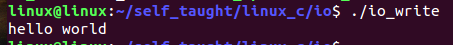

### 3.4.2 向文件写入数据

```c
#include <stdio.h>
#include <sys/types.h>
#include <sys/stat.h>
#include <fcntl.h>
#include <unistd.h>

int main(int argc, const char *argv[])
{
	// 向文件写入数据
	int fd;
	// 以只写的方式打开文件，如果文件不存在则创建，如果文件存在则清空
	fd = open("file.txt",O_WRONLY | O_CREAT | O_TRUNC, 0664);
	
	if(-1 == fd)
	{
		perror("fail to open");
		return -1;
	}

	// 使用write函数向文件写入数据
	ssize_t bytes;
	if(-1 == (bytes = write(fd, "hello world\n",12)))
	{
		perror("fail to write");
		return -1;
	}

	printf("bytes = %ld\n",bytes);

	// 向文件中写入指定数据的5个数据长度
	write(fd, "nihao shanghai",5);

	// 关闭文件描述符
	close(fd);
	return 0;
}
```

result

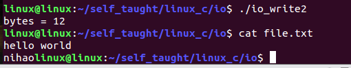

## 3.5 read函数

```c
// 头文件
#include <unistd.h>
// 函数定义
ssize_t read(int fd, void *buf, size_t count);
/*
 * 功能：从文件中读取数据，把指定数目的数据读到内存
 * 参数：
 *      fd:指定的文件描述符
 *      buf:保存读取到的数据
 *      count:最多一次读取多少个字节
 * 返回值：
 *      成功：实际读取的字节数
 *      失败：-1，可以使用perror函数查看原因
 * 注意：
 *      如果读取到文件末尾，返回0
 */
```

### 3.5.1 从终端中读取数据

````c
#include <stdio.h>
#include <sys/types.h>
#include <sys/stat.h>
#include <fcntl.h>
#include <unistd.h>

int main(int argc, const char *argv[])
{
    // 使用read函数从终端读取数据
    // 使用0文件描述符从终端读取数据
    // 0是标准输入
    //
    // 如果终端输入的字节数大于第三个参数
    // 则只会读取第三个参数对应的字节数，返回值也是与第三个参数一致
    //
    // 如果终端输入的字节数小于第三个参数
    // 则只会读取输入的数据加上换行符，返回值就是实际输入的数据+1

    ssize_t bytes;
    char str[32] = {0};
    if(-1 == (bytes = read(0,str,6)))
    {
        perror("fail to read");
        return -1;
    }

    printf("str = [%s]\n",str);
    printf("bytes = %ld\n",bytes);
    return 0;
}
````

result

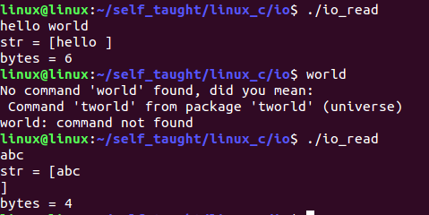

### 3.5.2 从文件中读取数据

```c
#include <stdio.h>
#include <sys/types.h>
#include <sys/stat.h>
#include <fcntl.h>
#include <unistd.h>

#define N 64

int main(int argc, const char *argv[])
{
	// 使用read从文件读取数据
	int fd;
	if(-1 == (fd = open("test.txt",O_RDONLY | O_CREAT,0664)))
	{
		perror("fail to open");
		return -1;
	}

	// 读取文件内容
	char buf[N] = {0};
	ssize_t bytes;
#if 0
	// 测试1
	if(-1 == (bytes = read(fd,buf,32)))
	{
		perror("fail to read");
		return -1;
	}

	printf("buf = [%s]\n",buf);
	printf("bytes = %d\n",bytes);

	char buf1[N] = {0};
	bytes = read(fd, buf1, 32);
	printf("buf = [%s]\n",buf1);
	printf("bytes = %d\n",bytes);

	// 如果文件中的数据都读取完毕，则read会返回0
	char buf2[N] = {0};
	bytes = read(fd, buf2, 32);
	printf("buf = [%s]\n",buf2);
	printf("bytes = %d\n",bytes);
#endif

#if 1
	// 测试2
	// 读取文件中的所有内容
	while((bytes = read(fd, buf, 32)) != 0)
	{
		printf("buf = [%s]\n",buf);
		printf("bytes = %ld\n",bytes);
	}
#endif

	// 关闭文件描述符
	close(fd);
	return 0;
}
```

result1

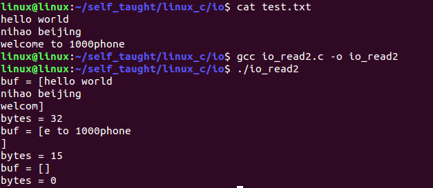

result2

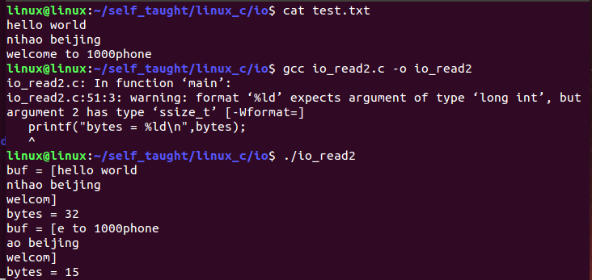

## 3.6 remove函数

```c
// 头文件
#include <unistd.h>
// 函数定义
int remove(const char *pathname);
/*
 * 功能：删除指定文件
 * 参数：
 *      pathname：包含路径的文件名
 * 返回值：
 *      成功返回0
 *      失败：-1，可以使用perror函数查看原因
 */
```

```c
#include <stdio.h>
#include <sys/types.h>
#include <sys/stat.h>
#include <fcntl.h>
#include <unistd.h>

int main(int argc, const char *argv[])
{
	// 使用remove函数删除文件
	if(-1 == remove("./file.txt"))
	{
		perror("fail to remove");
		return -1;
	}
	printf("delete done\n");
	return 0;
}
```

result

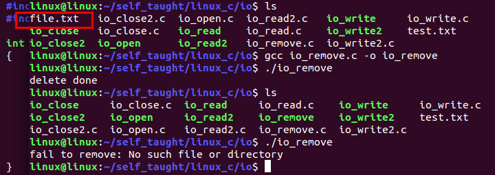

## 3.7 lseek函数--定位

```c
// 头文件
#include <sys/types.h>
#include <unistd.h>
// 函数格式
off_t lseek(int fd, off_t offset, int whence);
/*
 * 功能：
 *      移动文件的读写位置
 * 参数：
 *      fd：文件描述符
 *      offset:偏移量
 *          可正（向右）可负（向左）可为0(当前位置保持不变);
 *          以起始点为基点，向前、后移动到字节数，正数往文件末尾方向偏移，
 *          负数往文件开头方向偏移。
 *      whence:相对位置
 *          SEEK_SET    文件起始位置
 *          SEEK_CUR    文件当前位置
 *          SEEK_END    文件末尾位置（最后一个字符后面的位置）
 * 返回值：
 *      成功：文件的当前位移
 *      -1：出错，可以通过perror查看错误信息。
 * 注意：
 *      lseek()只对常规文件有效，对socket、管道、FIFO等进行lseek()操作失败
 *      文件位移量可以大于文件的当前长度，在这种情况下，对该文件的写操作会延长文件，并形成空洞
 */
```

```c
#include <stdio.h>
#include <sys/types.h>
#include <sys/stat.h>
#include <fcntl.h>
#include <unistd.h>
#include <string.h>

int main(int argc, const char *argv[])
{
	if(argc < 2)
	{
		printf("参数个数有误\n");
		return -1;
	}
	int fd = open(argv[1], O_RDWR | O_CREAT |O_TRUNC, 0664);
	if(fd < 0)
	{
		perror("fail to open");
		return -1;
	}
	// 写入文件
	// 定义一个存储即存放被写入文件内容的一个buf
	char buf[100] = {0};
	printf("please input\n");
	fgets(buf,sizeof(buf),stdin);

	int wr_count = write(fd, buf, sizeof(buf));
	//int wr_count = write(fd, buf, strlen(buf));
	if(wr_count < 0)
	{
		perror("fail to write");
		return -1;
	}
	printf("本次写入的个数%d\n",wr_count);

	// 重新定位到文件开头，因为此时经过写操作之后文件已经定位到文件末尾了
	// 所以在读取之前，应该恢复到文件开头
	lseek(fd,0,SEEK_SET);
	char new_buf[100] = {0};
	printf("read before new_buf = %s\n",new_buf);
	// 实现读取文件
	int rd_count = read(fd, new_buf, sizeof(new_buf));
	if(rd_count < 0)
	{
		perror("fail to read");
		close(fd);
		return -1;
	}
	else if(0 == rd_count)
	{
		printf("ok\n");
	}
	printf("本次读取的个数为:%d个\n",rd_count);
	printf("read after new_buf = %s\n",new_buf);
	close(fd);
}
```

result

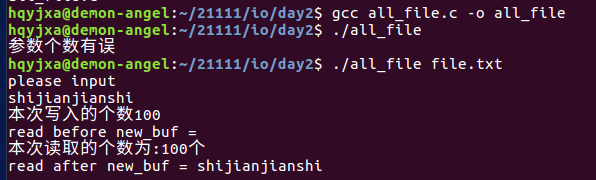

# 4 系统调用与库函数

## 4.1 库函数有两类函数组成

1. 不需要调用系统调用

   不需要切换到内核空间即可完成函数全部功能，并且将结果反馈给应用程序，如strcpy,bzero等字符串操作函数。

2. 需要调用系统调用

   需要切换到内核空间，这类函数通过封装系统调用去实现相应功能，如printf、fread等

## 4.2 库函数与系统调用的关系

并不是所有的系统调用都被封装成了库函数，系统提供的很多功能都必须通过系统调用才能实现。

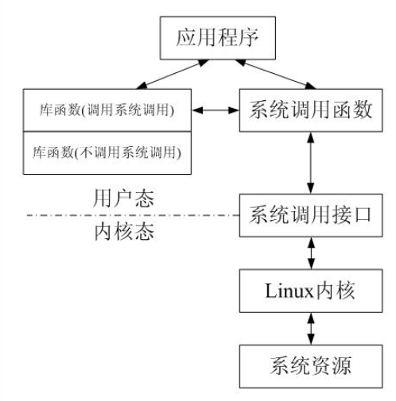

系统调用是需要时间的，程序中频繁的使用系统调用会降低程序的运行效率。

当运行内核代码时，CPU工作在内核态，在系统调用发生前需要保存用户态的栈和内存环境，然后转入内核态工作。

系统调用结束后，又要切换会用户态。这种环境的切换会消耗掉许多时间。

库函数访问文件的时候根据需要，设置不同类型的缓冲区，从而减少了直接调用IO系统调用的次数，提高了访问效率。

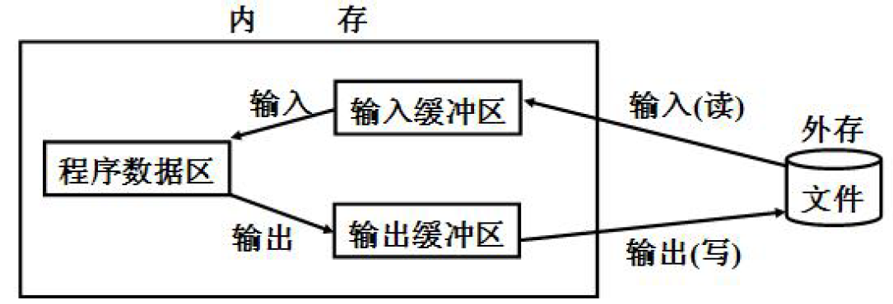

应用程序调用printf函数时，函数执行的过程，如下图

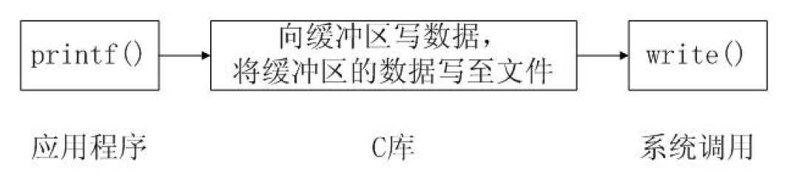

总结：大多数库函数的本质也是系统调用，只不过库函数有了缓冲区，用于减少系统调用的次数。
