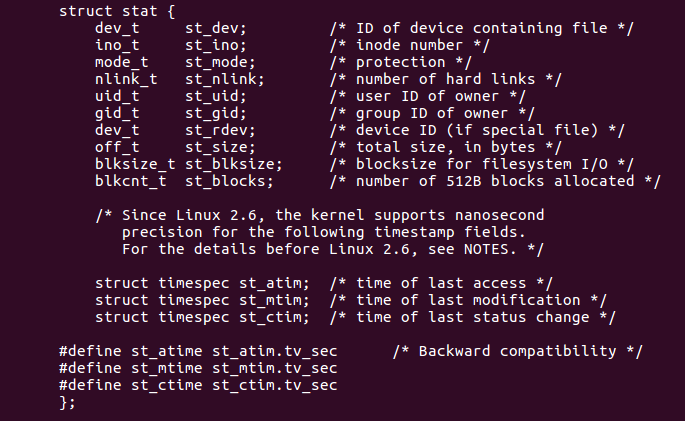

[toc]

# 页面跳转

[实现ls功能](#实现ls功能)

# 1 目录的操作

1. 打开目录--->opendir
2. 操作目录--->readdir
3. 关闭目录--->closedir

## 1.1 opendir

```c
// 头文件
#include <sys/types.h>
#include <dirent.h>
// 函数声明
DIR *opendir(const char *name);
/*
 * 功能：
 *      打开目录
 * 参数：
 *      需要打开的目录名称（包含路径而已）
 * 返回值：
 *      成功：返回一个目录指针
 *      失败：返回NULL
 */
```

## 1.2 readdir

```c
// 头文件
#include <dirent.h>
// 函数声明
struct dirent *readdir(DIR *dirp);
/*
 * 功能：
 *      读取目录
 * 参数：
 *      成功打开目录的返回值
 * 返回值：
 *      成功：返回一个指向目录结构体指针
 *      失败：返回NULL
 */
struct dirent {
    ino_t          d_ino;       /* inode number */
    off_t          d_off;       /* not an offset; see NOTES */
    unsigned short d_reclen;    /* length of this record */
    unsigned char  d_type;      /* type of file; not supported by all filesystem types */
    char           d_name[256]; /* filename */
};
/*
 * d_ino        为这个目录进入点的inode
 * d_off        为目录文件开头到这个目录进入点的位移
 * d_reclen     d_name的长度，不包含NULL字符
 * d_type       d_name所指向的文件类型
 * d_name       文件名
 */
```

## 1.3 closedir

```c
// 头文件
#include <sys/types.h>
#include <dirent.h>
// 函数声明
int closedir(DIR *dirp);
/*
 * 功能：
 *      关闭文件
 * 参数：
 *      成功打开目录的返回值
 * 返回值：
 *      成功：关闭成功返回0
 *      失败：返回-1，错误原因保存在errno中
 */
```

```c
#include <stdio.h>
#include <sys/types.h>
#include <dirent.h>

int main(int argc, const char *argv[])
{
	// 功能:实现ls -a的功能
	// (1)先打开一个需要检测的目录
	DIR *p_dir = opendir(argv[1]);
	if(NULL == p_dir)
	{
		perror("fail to opendir");
		return -1;
	}

	while(1)
	{
		// (2)读取目录
		struct dirent *p_sd = readdir(p_dir);
		if(NULL == p_sd)
		{
			printf("读取目录信息完毕！\n");
			break;
		}
		// 利用p_sd引用目录结构体中的成员:d_name
		printf("%s\t",p_sd->d_name);
	}
	printf("\n");
	// (3)关闭目录
	closedir(p_dir);
	return 0;
}
```

result


```c
#include <stdio.h>
#include <sys/types.h>
#include <dirent.h>
#include <string.h>

int main(int argc, const char *argv[])
{
	// 功能：实现ls的功能
	// (1)先打开一个需要检测的目录
	DIR *p_dir = opendir(argv[1]);
	if(NULL == p_dir)
	{
		perror("opendir error");
		return -1;
	}

	while(1)
	{
		// (2)读取目录
		struct dirent *p_sd = readdir(p_dir);
		if(NULL == p_sd)
		{
			printf("读取目录信息完毕!\n");
			break;
		}
		// 添加一个条件判断
		if(0 == strncmp(p_sd->d_name,".",1))
		{
			continue;
		}
		// 利用p_sd引用目录结构体中的成员:d_name
		printf("%s\t",p_sd->d_name);
	}
	printf("\n");
	// (3)关闭目录
	closedir(p_dir);
	return 0;
}
```

result


# 2 测试文件属性的函数

## 2.1 stat

```c
// 头文件
#include <sys/types.h>
#include <sys/stat.h>
#include <unistd.h>
// 函数声明
int stat(const char *pathname, struct stat *buf);
/*
 * 功能：
 *      取得文件状态
 * 参数：
 *      pathname：所需测试的文件名（包含路径）
 *      buf：包含文件详细信息的结构体
 * 返回值：
 *      成功返回0
 *      失败返回-1，错误代码保存在errno中
 */ 
```

## 2.2 lstat

```c
// 头文件
#include <sys/types.h>
#include <sys/stat.h>
#include <unistd.h>
// 函数声明
int lstat(const char *pathname, struct stat *buf);
/*
 * 功能：
 *      由文件描述符取得文件状态
 * 参数：
 *      pathname：所需测试的文件名（包含路径）
 *      buf：包含文件详细信息的结构体
 * 返回值：
 *      成功返回0
 *      失败返回-1，错误代码保存在errno中
 */     
```

## 2.3 stat和lstat函数的区别

stat是一个追踪（穿透）函数，意味着当所传入的文件是一个软链接的时候，则测试的文件属性是源文件的属性。

lstat是一个不追踪函数，当传入的文件是软链接的时候。测试的还是软链接文件自身的属性。

## 2.4 fstat

```c
// 头文件
#include <sys/types.h>
#include <sys/stat.h>
#include <unistd.h>
// 函数声明
int fstat(int fd, struct stat *buf);
/*
 * 功能：
 *      由文件描述符取得文件状态
 * 参数：
 *      fd：文件描述符
 *      buf：包含文件详细信息的结构体
 * 返回值：
 *      成功返回0
 *      失败返回-1，错误代码保存在errno中
 * 注意：
 *      fstat函数要求测试文件事先是打开的
 */
```

## 2.5 struct stat结构体



<a name = "实现ls功能"></a>

```c
#include <stdio.h>
#include <sys/types.h>
#include <dirent.h>
#include <string.h>
#include <sys/stat.h>
#include <unistd.h>

int main(int argc, const char *argv[])
{
	// 功能：实现ls的功能
	// (1)先打开一个需要检测的目录
	DIR *p_dir = opendir(argv[1]);
	if(NULL == p_dir)
	{
		perror("opendir error");
		return -1;
	}
	// 定义一个表示文件属性的结构体指针
	struct stat STAT;
	while(1)
	{
		// (2)读取目录
		struct dirent *p_sd = readdir(p_dir);
		if(NULL == p_sd)
		{
			printf("读取目录信息完毕!\n");
			break;
		}
		// 添加一个条件判断
		if(0 == strncmp(p_sd->d_name,".",1))
		{
			continue;
		}
		char file_name[100] = {0};
		sprintf(file_name,"%s%s",argv[1],p_sd->d_name);
		if(lstat(file_name,&STAT) < 0)
		{
			perror("fail to lstat");
			break;
		}
		// 利用STAT.st_size得到文件的大小
		printf("%ld\t",STAT.st_size);
		// 利用p_sd引用目录结构体中的成员:d_name
		printf("%s\n",p_sd->d_name);
	}
	// (3)关闭目录
	closedir(p_dir);
	return 0;
}
```

result


