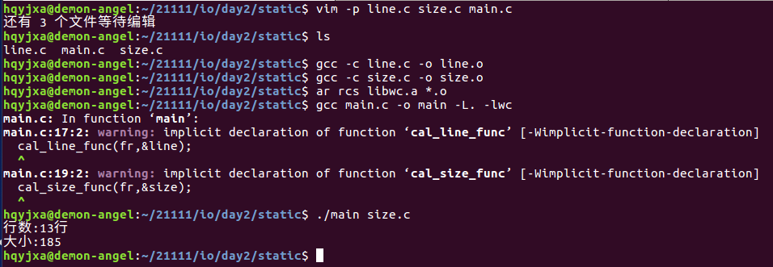
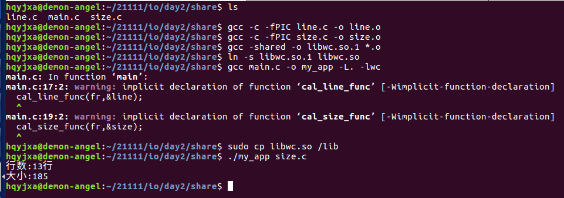

[toc]

# 1 什么是库

本质上来说库是一种可执行代码的二进制形式，可以别操作系统载入内存执行。由于windows和linux的本质不同，因此二者库的二进制是不兼容的。

linux下的库有两种：静态库和共享库（动态库）。==**二者的不同点在于代码被载入的时刻不同。**==

**静态库在程序编译时会被连接到目标代码中，程序运行时将不再需要该静态库，因此体积较大。**

**动态库在程序编译时并不会被连接到目标代码中，而是在程序运时才被载入，因此在程序运行时还需要动态库存在，因此代码的体积较小。**

# 2 库的意义

库是别人写好的现有的，成熟的，可以复用的代码，你可以使用但要记得遵守许可协议。

现实中每个程序都要依赖很多基础的底层库，不可能每个人的代码都从零开始，因此库的存在意义非同寻常。

共享库的好处是，不同的应用程序如果调用相同的库，那么在内存里只需要有一份该共享库的实例。

# 3 静态库

1. 静态库对函数库的链接是放在编译时期完成的。
2. 程序在运行的时与函数库再无瓜葛，移植方便。
3. 浪费空间和资源，因为所有相关的对象文件（object file）与牵涉到的函数库（library）被链接合成一个可执行文件（executable file）.
4. **编译时把静态库中的相关代码复制到可执行程序中。**
5. 优点：程序运行的时，无需加载库，运行速度更快
6. 缺点：占用更多磁盘和内存空间，静态库升级后，需要重新编译链接。

## 3.1 如何创建静态库

1. 编写源代码

   只要是一个文件，文件的内容是一个子函数即可（目的是为了生成库）

   ```shell
   vim filename1.c / vim filename2.c
   ```

2. 生成相应的.o文件

   ```shell
   gcc -c filename1.c -o filename1.o
   gcc -c filename2.c -o filename2.o
   ```

3. 创建成相应的静态库

   静态库的命名方式：`lib+库名.a`

   ```shell
   ar rcs libfile.a *.o
   # 注意：libfile.a中的file是库名！！！
   # ar ---> 用来创建代码库
   # r  ---> 在库中插入模块
   # c  ---> 创建一个库，不管库是否存在，都将创建
   # s  ---> 创建目标文件索引，这在创建较大的库时能加快时间
   ```

4. 编译时链接静态库

   ```shell
   gcc test.c -o test -L. -lfile
   # 注意：-L.中的点.代表当前路径（库的位置）
   ```

5. 运行

   ```shell
   ./test
   ```

## 3.2 案例

**main.c**

<a name="main.c"></a>

```c
#include <stdio.h>

int main(int argc, const char *argv[])
{
	// 功能:将指定的文件的行数以及大小进行显示
	// 以只读的方式打开一个文件
	FILE *fr = fopen(argv[1],"r");
	if(NULL == fr)
	{
		perror("fail to fopen");
		return -1;
	}

	int line = 0, size = 0;
	
	// 函数1:实现行数的统计
	cal_line_func(fr,&line);
	// 函数2:实现大小的统计
	cal_size_func(fr,&size);

	printf("行数:%d行\n大小:%d\n",line,size);
	fclose(fr);
	return 0;
}
```

**line.c**

<a name="line.c"></a>

```c
#include <stdio.h>
#include <string.h>

void cal_line_func(FILE *fr, int *p_line)
{
	if(NULL == fr || NULL == p_line)
	{
		return;
	}

	char data[20] = {0};
	while(1)
	{
		char *p_flag = fgets(data, sizeof(data),fr);
		if(NULL == p_flag)
		{
			return;
		}
		if('\n' == data[strlen(data) - 1])
		{
			(*p_line)++;
		}
	}
}
```

**size.c**

<a name="size.c"></a>

```c
#include <stdio.h>

void cal_size_func(FILE *fr, int *p_size)
{
	if(NULL == fr || NULL == p_size)
	{
		return;
	}
	fseek(fr, 0, SEEK_END);
	*p_size = ftell(fr);
	rewind(fr);
	return;
}
```

result



# 4 动态库

1. 动态库把对一些库函数的链接载入推迟到程序运行的时期。
2. 可以实现进程之间的资源共享
3. 将一些程序升级变得简单
4. 甚至可以真正做到链接载入完全由程序员在程序代码中控制
5. **编译时仅记录用到哪个共享库中的哪个符号，不复制共享库中的相关代码**
6. 优点：程序不包含库中代码，体积比较小，库升级方便，无需重新编译
7. 缺点：在运行需要加载共享库

## 4.1 如何创建动态库

1. 编写源文件

   ```shell
   vim filename1.c / vim filename2.c
   ```

2. 分别生成相应的.o文件

   ```shell
   gcc -c -fPIC filename1.c -o filename1.o
   gcc -c -fPIC filename2.c -o filename2.o
   # 注意：-fPIC要生成的与位置无关的代码，可以在任何位置执行
   ```

3. 生成动态库（共享库）

   动态库的命名方式：lib+库名.so.版本号        ---->用数字来表示版本号

   ```shell
   gcc -shared -o libfile.so.1 *.o
   ```

4. 为共享库文件创建软链接文件

   创建链接文件的目的就是为了能够升级库时比较方便

   ```shell
   ln -s libfile.so.1 libfile.so
   ```

5. 编译并链接共享库（同时指明库路径）

   ```shell
   gcc main.c -o my_app -L. -lfile
   ```

6. 运行时需要链接动态库

## 4.2 案例

[main.c](#main.c)

[line.c](#line.c)

[size.c](#size.c)

result



**==注意：将第四步生成的软链接文件复制到根目录的lib下，因为动态库会去系统库路径下寻找动态库。==**

执行命令`sudo cp libfile.so /lib`