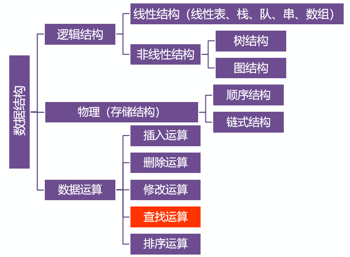
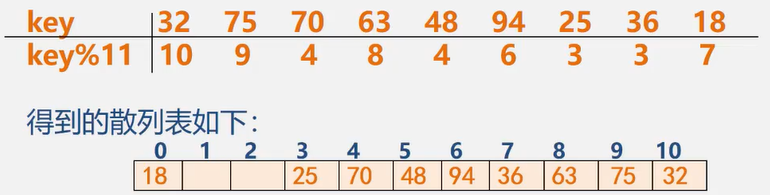
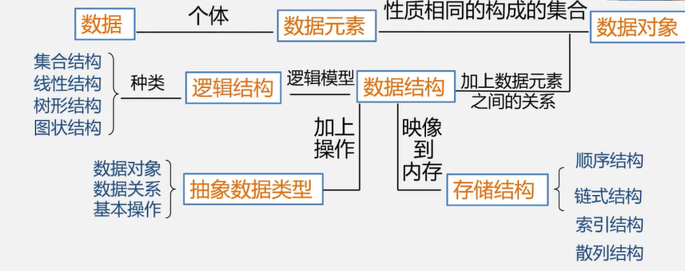
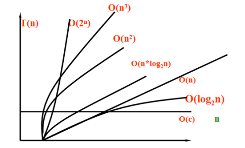

[TOC]

# 1 为什么要学习数据结构

学习C语言是为了如何去写代码

学习数据结构是为了如何简洁高效的书写代码



# 2 数据结构研究的是什么

==**程序 = 数据结构 + 算法**==

## 2.1 数据结构

- 数据元素不是孤立存在的，它们之间存在着某种关系，数据元素相互之间的关系成为结构
- 是指相互之间存在一种或多种特定关系的数据元素的集合
- 或者说，数据结构是带结构的数据元素的集合

### 2.1.1 数据结构包括以下三个方面的内容

1. 数据元素之间的逻辑关系，也称为逻辑结构
2. 数据元素及其关系在计算机内存中的表示（又称为映像），称为数据的物理结构或数据的存储结构
3. 数据的运算和实现，即对数据元素可以施加的操作以及这些操作在相应的存储结构上的实现

#### 2.1.1.1 总结

数据结构研究的是**数据**的**逻辑结构**，**存储结构**及其**操作**

### 2.1.2 逻辑结构

- 数据元素与数据元素之间的关系
- 与数据的存储无关，独立于计算机
- 是从具体问题抽象出来的数学模型

#### 2.1.2.1 逻辑结构的种类

##### 2.1.2.1.1 划分方法一

1. 线性关系（1对1）

   有且仅有一个开始和一个终端结点，并且所有结点都最多只有一个直接前趋和一个直接后继

   例如：顺序表、链表、栈、队列、串

2. 非线性结构（1对多或多对多）

   一个结点可能有多个直接前趋和直接后继

   例如：树（1对2：二叉树）、图（多对多）

##### 2.1.2.1.2 划分方法二（四种基本逻辑结构）

1. 集合结构

   结构中的数据元素之间除了同属于一个集合的关系外，无任何其他关系

2. 线性结构

   结构中的数据元素之间存在着一对一的线性关系

3. 树形结构

   结构中的数据元素之间存在一对多的层次关系

4. 图状结构或网状结构

   结构中的数据元素之间存在这多对多的任意关系

### 2.1.3 存储结构（物理结构）

- 数据元素及其关系在计算机存储器中的结构（存储方式）
- 是数据结构在计算机中的表示

#### 2.1.3.1 存储结构的种类

1. 顺序存储结构

   用一组连续的存储单元依次存储数据元素，数据元素之间的逻辑关系由元素的存储位置来表示

2. 链式存储结构

   用一组任意的存储单元存储数据元素，数据元素之间的逻辑关系用指针来表示

3. 索引存储结构

   - 在存储结点信息的同时，还建立附加的索引表
   - 索引表中的每一项称为一个索引项
   - 索引项的一般形式是：（关键字、地址）
   - 关键字是唯一标识一个结点的那些数据项
   - 若每个结点在索引表中都有一个索引项，则该索引表称之为稠密索引。若一组结点在索引表中只对应一个索引项，则该索引表称之为稀疏索引

4. 散列存储结构

   根据结点的关键字直接计算出该结点的储存位置

   

### 2.1.4 逻辑结构和存储结构的关系

- 存储结构是逻辑关系的映像与元素本身的映像
- 逻辑结构是数据结构的抽象，存储结构是数据结构的实现
- 两者综合起来建立了数据元素之间的结构关系

### 2.1.5 操作

创建、增加、删除、修改、查找、显示、销毁（7个函数）

## 2.2 用计算机解决一个问题的步骤

1. 具体问题抽象为数学模型
   1. 分析问题
   2. 提取操作对象
   3. 找出操作对象之间的关系
   4. 用数学语言描述（数据结构）
2. 设计算法
3. 编程、调试、运行

# 3 数据结构的一些概念

## 3.1 数据

1. 是能输入计算机且能被计算机处理的各种符号的集合
   - 信息的载体
   - 是对客观事物符号化的表示
   - 能够被识别、存储和加工
2. 包括
   - 数值型的数据：整数、实数等
   - 非数值型的数据：文字，图像、图形、声音等

## 3.2 数据元素和数据项

### 3.2.1 数据元素

- 是数据的基本单位，在计算机程序中通常作为一个整体进行考虑和处理
- 也简称为元素，或称为记录、结点或顶点
- 数据元素可由若干个数据项组成

### 3.2.2 数据项

构成数据元素的不可分割的最小单位

### 3.2.3 数据、数据元素、数据项之间的关系

$$
数据 > 数据元素 > 数据项\\
例如：\\
	学生表 > 个人记录 > 学号、姓名......
$$

## 3.3 数据对象

是性质相同的数据元素的集合，是数据的一个子集

### 3.3.1 数据元素和数据对象

1. 数据元素：组成数据的基本单位
   - 与数据的关系：是集合的个体
2. 数据对象：性质相同的数据元素的集合
   - 与数据的关系：集合的子集

## 3.4 数据类型和抽象数据类型

### 3.4.1 数据类型

数据类型是一组性质相同的值的集合以及定义于这个值集合上的一组操作的总称。
$$
数据类型=值的集合+值集合上的一组操作
$$

### 3.4.2 抽象数据类型（Abstract Data Type, ADT）

是指一个数学模型以及定义在此数学模型上的一组操作

- 由用户定义，从问题抽象出数据模型（逻辑结构）
- 还包括定义的数据模型上的一组抽象运算(相关操作)
- 不考虑计算机内的具体存储结构和运算的具体实现算法

## 3.5 小结



# 4 算法

解决问题的方法和步骤

## 4.1 算法的特性

1. 有穷性（算法的执行步骤是有限的）
2. 确定性（算法的每一个步骤不能出现二义性，没有歧义）
3. 可行性（算法可以在有限的时间内完成）
4. 输入（一个算法可以有0个或者多个输入）
5. 输出（一个算法可以有1个或者多个输出）

### 4.1.1 从哪方面衡量一个算法的好坏的标准

1. 空间复杂度：占内存空间的大小（消耗内存的大小）
2. 时间复杂度：可执行语句被重复执行的次数（消耗时间的多少）
3. 程序的可读性（维护，调试，移植）

#### 4.1.1.1 空间复杂度

$$
空间复杂度：算法所需存储空间的度量，\\
记作：S(n)=O(f(n))\\
其中n为问题的规模(或大小)
$$

```c
// 32位OS
struct AA
{
    char chr;
    int a;
    short num;
};
// 占12个字节
struct BB
{
    int b;
    char chr;
    short num2;
};
// 占8个字节
```

#### 4.1.1.2 时间复杂度

概念：算法的可执行语句重复执行的频度和

频度：算法中可执行语句重复执行的次数

注意：通常时间复杂度是用一个问题规模的函数来表达的

$$
T(n) = O(f(n));\\
T(n)：问题规模的时间函数\\
n：表示问题的规模\\
O：表示数量级\\
f(n)：算法中可执行语句重复执行的次数，\\用问题规模n表示出来的一个函数f(n)
$$
T(n)的量级通常有：

1. O(c)------常数级，不论问题规模多大，T(n)一致，因而是理想的T(n)量级；
2. O(n)------线性级；O(n^2^)，O(n^3^)-------平方、立方级；
3. O(log~2~n)，O(n*log~2~n)------对数、线性对数级；
4. O(2^n^)------指数级，时间复杂度最差



### 4.1.2 计算时间复杂度中的数量级O的方法

#### 4.1.2.1 步骤

1. 根据问题规模n写出n的表达式：f(n) = (n^2^)/2 + n/2;
2. 如果有常数项，将其置为1（当f(n)表达式中只有常数项时才有意义，否则该句话没有意义）
3.  只保留最高项，其他项舍去：f(n) = (n^2^)/2
4. 判断最高项的系数是否为1，如果不为1，则将其置为1：f(n) = n^2^，因此：T(n) = O(n^2^)----->得出该算法的数量级为平方级。

## 4.2 算法设计的要求

1. 正确性
2. 可读性
3. 健壮性
4. 高效性
