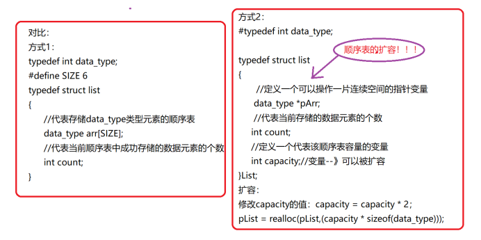
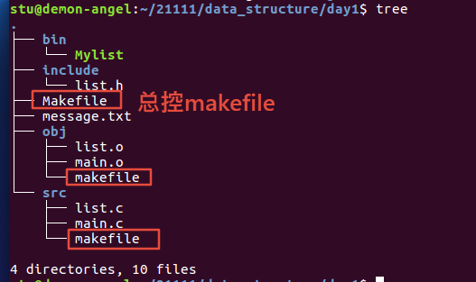
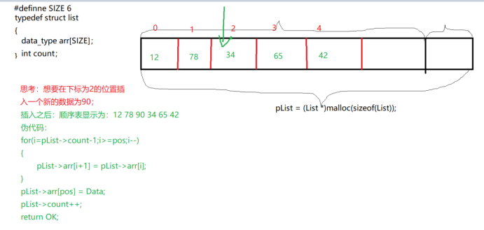
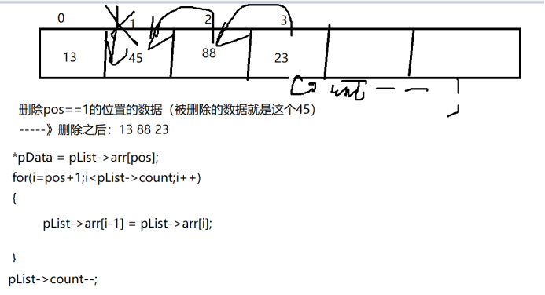
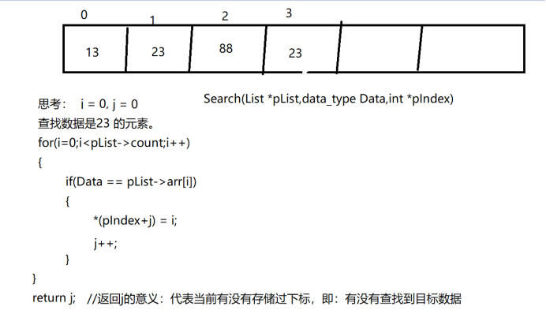
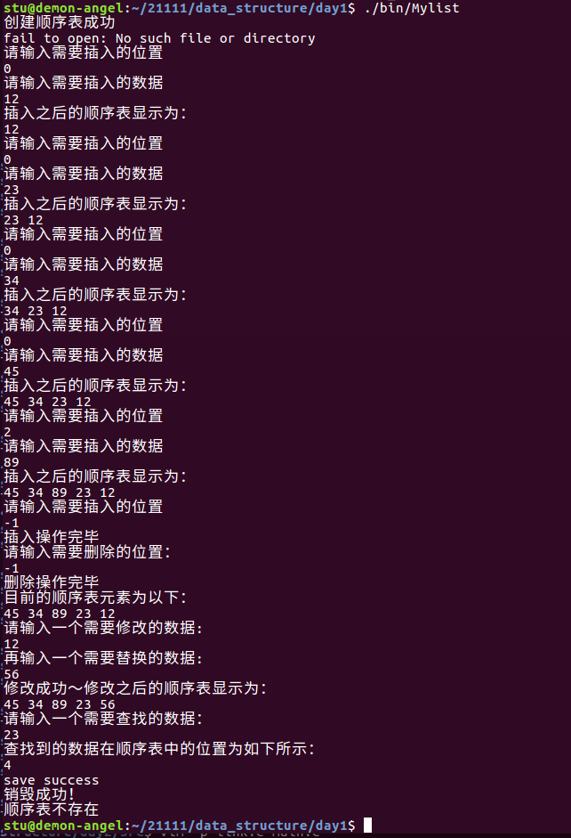
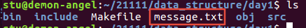
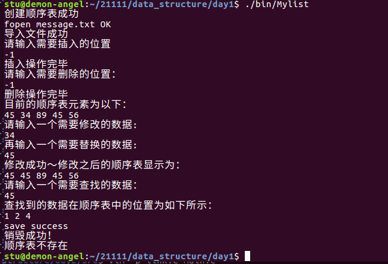

[toc]

# 1 顺序表

具有相同特性的数据元素的一个有限序列

## 1.1 顺序表的特点

1. 内存连续，类型相同，大小固定
2. 表满不能存，表空不能取
3. 插入和删除不便于实现（需要数据搬移）
4. 修改和查找比较方便的

## 1.2 顺序表的扩容



### 1.2.1 柔性数组扩容

```c
typedef struct st_type
{
    int i;
    /* 有些编译器a[0]会出错，可以写成int a[]; */
    int a[0];
}type_a;
/* 此时结构体的大小是4个字节，数组不占空间 */
// 可以通过如下表达式给结构体分配内存
type_a *p = (type_a *)malloc(sizeof(type_a) + 100*sizeof(int));
/* 此时sizeof(*p) 还是4，柔性数组属于编外人员 */
```

## 1.3 使用makefile的嵌套



### 1.3.1 Makefile

```makefile
CC=gcc
CFLAGS=-c -g -Wall
OBJS=main.o list.o
APP=Mylist

# 利用export添加以上四个变量到整个工程中
export CC CFLAGS OBJS APP

ALL:
	# 进入src目录，并执行该目录下的makefile
	make -C ./src/
	# 进入obj目录，并执行该目录下的makefile
	make -C ./obj/

.PHONY:clean
clean:
	$(RM) ./bin/*
	$(RM) ./obj/*.o
```

### 1.3.2 src中的makefile

```makefile
All:$(OBJS)
	mv $^ ../obj/
main.o:main.c
	$(CC) $(CFLAGS) $< -o $@
list.o:list.c
	$(CC) $(CFLAGS) $< -o $@
```

### 1.3.3 obj中的makefile

```makefile
All:$(APP)
	mv $^ ../bin/
$(APP):$(OBJS)
	$(CC) $^ -o $@
```

## 1.4 src中的list.c

### 1.4.1 头文件

```c
#include <stdio.h>
#include "../include/list.h"
#include <stdlib.h>
#include <string.h>
```

### 1.4.2 顺序表的创建

```c
/*
 * 功能：创建一个顺序表
 * 参数：
 *      顺序表的首地址的地址
 * 返回值：
 *      成功返回OK,失败返回失败的原因
 */
int creat_list(LIST **pp_list)
{
    /* 入参检查 */
    if (NULL == pp_list)
    {
        return NULL_ERROR;
    }
    *pp_list = (LIST *)malloc(sizeof(LIST));
    if (NULL == *pp_list)
    {
        return MALLOC_ERROR;
    }
    /* 清空 */
    memset(*pp_list, '\0', sizeof(LIST));
    return OK;
}
```

### 1.4.3 顺序表插入数据



```c
/*
 * 功能：在特定的位置插入数据
 * 参数：
 * 		参数1：顺序表的首地址
 *		参数2：修改的数据
 *		参数3：修改的位置
 * 返回值：
 *		成功返回OK，失败返回失败的原因
 */
int insert_data_to_list(LIST *p_list, data_type data, int pos)
{
    /* 判断表是否创建成功 */
    if (NULL == p_list)
    {
        return CREAT_ERROR;
    }
    /* 判断表是否满了 */
    if (p_list->count == SIZE)
    {
        printf("表满了\n");
        /* 扩容 */
        /* realloc(); */
        return IS_FULL;
    }
    /* 判断插入的位置是否准确的 */
    if (pos < 0 || pos > p_list->count)
    {
        return POS_ERROR;
    }
    /* 插入 */
    int i;
    for (i = p_list->count - 1; i >= pos; i--)
    {
        /* 将arr[i]赋值给arr[i+1] */
        p_list->arr[i + 1] = p_list->arr[i];
    }
    /* 将数据data赋值给arr[pos]的位置 */
    p_list->arr[pos] = data;
    /* 让count++ */
    p_list->count++;
    return OK;
}
```

### 1.4.4 顺序表删除数据



```c
/*
 * 功能：删除指定的数据
 * 参数：
 *		参数1：顺序表的首地址
 *		参数2：需要删除的数据的地址
 *		参数3：需要删除的位置
 * 返回值：
 *		成功返回OK，失败返回失败的原因
 */
int delete_data_from_list(LIST *p_list, data_type *p_data, int pos)
{
    if (NULL == p_list)
    {
        return CREAT_ERROR;
    }
    if (NULL == p_data)
    {
        return NULL_ERROR;
    }
    /* 判断表是否为空 */
    if (0 == p_list->count)
    {
        return IS_EMPTY;
    }
    /* 保存被删除的数据 */
    *p_data = p_list->arr[pos];
    int i;
    for (i = pos + 1; i < p_list->count; i++)
    {
        p_list->arr[i - 1] = p_list->arr[i];
    }
    p_list->count--;
    return OK;
}
```

### 1.4.5 顺序表查找数据



```c
/*
 * 功能：在顺序表中查找数据
 * 参数：
 *		参数1：顺序表的首地址
 *		参数2：需要查找的数据
 *		参数3：需要查找的数据下标的数组的地址
 * 返回值：
 *		成功返回对应值的下标
 */
int search_data_from_list(LIST *p_list, data_type data, int *p_index)
{
    if (NULL == p_list)
    {
        return CREAT_ERROR;
    }
    if (NULL == p_index)
    {
        return NULL_ERROR;
    }
    int i, j = 0;
    for (i = 0; i < p_list->count; i++)
    {
        if (data == p_list->arr[i])
        {
            *(p_index + j) = i;
            j++;
        }
    }
    /* 返回j的意义：代表当前有没有存储过下标，即有没有找到目标数据 */
    return j;
}
```

### 1.4.6 顺序表修改数据

```c
/*
 * 功能：修改顺序表中的数据
 * 参数：
 *		参数1：顺序表的首地址
 *		参数2：需要修改的数据
 *		参数3：修改之后的数据
 * 返回值：
 *		成功返回1,表示修改成功，失败返回失败的原因
 */
int alter_data_from_list(LIST *p_list, data_type old_data, data_type new_data)
{
    if (NULL == p_list)
    {
        return CREAT_ERROR;
    }
    /* 需要考虑到找不到旧数据的情况 */
    /* 需要借助于一个标志位 */
    int flag = 0;
    int i;
    /* 遍历顺序表 */
    for (i = 0; i < p_list->count; i++)
    {
        if (old_data == p_list->arr[i])
        {
            p_list->arr[i] = new_data;
            flag = 1;
        }
    }
    return flag;
}
```

### 1.4.7 显示顺序表

```c
/*
 * 功能：显示顺序表
 * 参数：
 *		参数1：顺序表的首地址
 * 返回值
 *		成功返回OK，失败返回失败的原因
 */
int show_list(LIST *p_list)
{
    if (NULL == p_list)
    {
        return CREAT_ERROR;
    }
    int i;
    for (i = 0; i < p_list->count; i++)
    {
        printf("%d ", p_list->arr[i]);
    }
    printf("\n");
    return OK;
}
```

### 1.4.8 销毁顺序表

==malloc多少次就要free多少次==

```c
/*
 * 功能：销毁顺序表
 * 参数：
 *		参数1：顺序表的首地址的地址
 * 返回值：
 *		成功返回OK,失败返回失败的原因
 */
int destory_list(LIST **pp_list)
{
    if (NULL == pp_list)
    {
        return NULL_ERROR;
    }
    if (NULL == *pp_list)
    {
        return CREAT_ERROR;
    }
    free(*pp_list);
    *pp_list = NULL;
    return OK;
}
```

## 1.5 src中的main.c

```c
#include "../include/list.h"
#include <stdio.h>

int main(int argc, const char *argv[])
{
	// 1.创建一个顺序表
	LIST *p_list = NULL;
	int ret;
	ret = creat_list(&p_list);
	if(ret < 0)
	{
		return ERROR;
	}
	else
	{
		printf("创建顺序表成功\n");
	}

	// 实现导入文件中的内容到顺序表
	// 只读方式打开一个文件
	FILE *fr = fopen("message.txt","r");
	if(NULL == fr)
	{
		perror("fail to open");
	}
	else
	{
		printf("fopen message.txt OK\n");
		ret = fread(p_list,1,sizeof(LIST),fr);
		if(ret < 0)
		{
			perror("fail to fread");
		}
		else
		{
			printf("导入文件成功\n");
			fclose(fr);
		}
	}

	// 2.插入数据到顺序表中
	int pos;
	data_type data;
	while(1)
	{
		printf("请输入需要插入的位置\n");
		scanf("%d",&pos);
		if(-1 == pos)
		{
			printf("插入操作完毕\n");
			break;
		}
		printf("请输入需要插入的数据\n");
		scanf("%d",&data);

		// 插入数据到顺序表中
		ret = insert_data_to_list(p_list,data,pos);
		if(ret < 0)
		{
			return ERROR;
		}
		printf("插入之后的顺序表显示为：\n");
		show_list(p_list);
	}

	while(1)
	{
		printf("请输入需要删除的位置：\n");
		scanf("%d",&pos);
		if(-1 == pos)
		{
			printf("删除操作完毕\n");
			break;
		}
		ret = delete_data_from_list(p_list,&data,pos);
		if(ret < 0)
		{
			return ERROR;
		}
		printf("被删除的数据是%d\n",data);
		printf("删除之后的顺序表显示为：\n");
		show_list(p_list);
	}

	data_type old_data,new_data;
	printf("目前的顺序表元素为以下：\n");
	show_list(p_list);
	printf("请输入一个需要修改的数据:\n");
	scanf("%d",&old_data);
	printf("再输入一个需要替换的数据:\n");
	scanf("%d",&new_data);
	ret = alter_data_from_list(p_list,old_data,new_data);
	if(ret == 0)
	{
		printf("修改失败！\n");
	}
	else
	{
		printf("修改成功～修改之后的顺序表显示为：\n");
		show_list(p_list);
	}

	// 定义一个存储目标数据下标的数组
	int index[SIZE] = {0};
	data_type search_data;
	int i;
	printf("请输入一个需要查找的数据：\n");
	scanf("%d",&search_data);
	int flag = search_data_from_list(p_list,search_data,index);
	if(0 == flag)
	{
		printf("未找到\n");
	}
	else
	{
		printf("查找到的数据在顺序表中的位置为如下所示：\n");
		for(i = 0; i < flag; i++)
		{
			printf("%d",index[i] + 1);
		}
		printf("\n");
	}

	// 以只写方式打开一个文件，保存顺序表中的内容
	FILE *fw = fopen("message.txt","w");
	if(NULL == fw)
	{
		perror("fail to open");
	}
	else
	{
		ret = fwrite(p_list,1,sizeof(LIST),fw);
		if(ret < 0)
		{
			perror("fail to fwrite");
		}
		else
		{
			printf("save success\n");
		}

	}
	fclose(fw);
	ret = destory_list(&p_list);
	if(ret < 0)
	{
		return ERROR;
	}
	else
	{
		printf("销毁成功！\n");
		// p_list = NULL; // 采用方式2,这句话就需要加上
		ret = show_list(p_list);
		if(ret == CREAT_ERROR)
		{
			printf("顺序表不存在\n");
			return ERROR;
		}
		printf("显示顺序表成功\n");

	}
	return 0;
}
```

## 1.6 include中的list.h

```c
#ifndef _LIST_H_
#define _LIST_H_

// 定义一个宏，表示当前顺序表中可以存储的数据元素的个数
#define SIZE 6

// 给描述的顺序表中的数据元素进行取别名
typedef int data_type;

// 定义顺序表的结构体
typedef struct list
{
	// 存储SIZE个数据
	data_type arr[SIZE];
	// 表示当前表中存储的数据元素的个数
	int count;
}LIST;

enum VALUE
{
	CREAT_ERROR = -7,
	POS_ERROR,
	NULL_ERROR,
	MALLOC_ERROR,
	IS_EMPTY,
	IS_FULL,
	ERROR,
	OK
};

// 完成7个函数的声明
// 函数1：创建一张顺序表
int creat_list(LIST **pp_list);
// 函数2：给顺序表中插入元素
int insert_data_to_list(LIST *p_list,data_type data,int pos);
// 函数3：删除顺序表中的数据元素
int delete_data_from_list(LIST *p_list,data_type *p_data,int pos);
// 函数4：修改顺序表中的元素
int alter_data_from_list(LIST *p_list,data_type old_data,data_type new_data);
// 函数5：查找顺序表中的数据
int search_data_from_list(LIST *p_list,data_type data,int *p_index);
// 函数6：显示顺序表中的数据
int show_list(LIST *p_list);
// 函数7：销毁顺序表-----方式1
int destory_list(LIST **pp_list);
// 函数7：销毁顺序表-----方式2
//int dstory_list(LIST *p_list);

#endif
```

result






