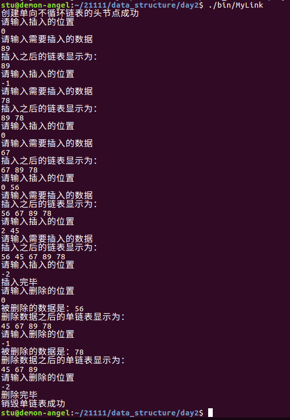

[toc]

# 1 链表

## 1.1 链表中一些名词

- 头节点：数据域为空的节点

- 尾节点：指针域为NULL的节点

- 首节点：头节点的下一个节点

- 单向链表：只有一个指针域

- 双向链表：有两个指针域

- 循环链表：尾节点会存储头节点的地址

- 不循环链表：尾节点的指针域为空，不存储头节点的地址

- 空链表：头节点的指针域为空，然后该节点可以看成是头节点也可看做是尾节点


## 1.2 链表的特点

1. 内存可以不连续，大小可以不固定
2. 表空不能取，不存在表满的情况
3. 插入和删除是比较方便（不需要数据搬移）
4. 修改和查找不方便（需要遍历）

## 1.3 链表的分类

1. 单向链表
2. 双向链表
3. 单向不循环链表
4. 单向循环链表
5. 双向不循环链表
6. 双向循环链表
7. 带头结点的链表
8. 不带头结点的链表

## 1.4 单向不循环链表


### 1.4.1 使用makefile的嵌套


#### 1.4.1.1 Makefile

```makefile
CC=gcc
CFLAGS=-c -g -Wall
OBJS=main.o link.o
APP=MyLink

export CC CFLAGS OBJS APP

All:
	make -C ./src/
	make -C ./obj/

# 声明一个伪目标，防止同级路径下的一个文件和这里的目标重名的时候，
# 则执行的依然是这里的目标
.PHONY:clean
clean:
	$(RM) ./obj/*.o
	$(RM) ./bin/*


```

##### 1.4.1.1.1 src中的makefile

```makefile
All:$(OBJS)
	mv $^ ../obj/
main.o:main.c
	$(CC) $(CFLAGS) $< -o $@
link.o:link.c
	$(CC) $(CFLAGS) $< -o $@
```

##### 1.4.1.1.2 obj中的makefile

```makefile
All:$(APP)
	mv $^ ../bin/
$(APP):$(OBJS)
	$(CC) $^ -o $@
```

### 1.4.2 src中的link.c

#### 1.4.2.1 头文件

```c
#include "../include/link.h"
#include <stdio.h>
#include <stdlib.h>
#include <string.h>
```

#### 1.4.2.2 链表创建


```c
// 功能：用来申请头节点的空间
// 参数：
//		无参
// 返回值：
//		成功返回头节点空间的首地址
LINK_NODE *creat_link()
{
	// 定义一个存储申请到的节点空间的地址的指针变量
	LINK_NODE *p_head = (LINK_NODE *)malloc(sizeof(LINK_NODE));
	if(NULL == p_head)
	{
		return NULL;
	}
	// 清空
	memset(p_head,'\0',sizeof(LINK_NODE));
	return p_head;
}
```

#### 1.4.2.3 链表中插入数据


```c
// 功能：实现插入一个指定的数据到链表中
// 参数：
//		参数1：头节点的地址
//		参数2：插入的位置
//		参数3：插入的数据
// 返回值：
//		成功返回OK，失败返回失败的原因
int insert_data_to_link(LINK_NODE *p_head,int pos,data_type data)
{
	if(NULL == p_head)
	{
		return CREATE_ERROR;
	}
	// 申请一个空间，用来作为新节点的空间
	LINK_NODE *p_new = (LINK_NODE *)malloc(sizeof(LINK_NODE));
	if(NULL == p_new)
	{
		return MALLOC_ERROR;
	}
	else
	{
		// 清空
		memset(p_new,'\0',sizeof(LINK_NODE));
		// 将data赋值给p_new->data
		p_new->data = data;
	}
	switch(pos)
	{
		case TAIL:
			{
				// 实现尾部插入
				// 判断链表是否为空链表
				if(NULL == p_head->p_next)
				{
					p_head->p_next = p_new;
				}
				else
				{
					// 定义一个表示尾节点的指针变量
					LINK_NODE *p_tail = p_head->p_next;
					// 找尾节点的位置
					while(NULL != p_tail->p_next)
					{
						p_tail = p_tail->p_next;
					}
					// 找到之后，将p_new赋值给旧的尾节点的指针域即可
					p_tail->p_next = p_new;
				}
				break;
			}
		case HEAD:
			{
				// 实现头部插入
				// 先保存p_head->p_next到p_new->p_next中
				p_new->p_next = p_head->p_next;
				// 再将p_new赋值给p_head->p_next
				p_head->p_next = p_new;
				break;
			}
		default:
			{
				// 中间插入
				if(NULL == p_head->p_next)
				{
					p_head->p_next = p_new;
				}
				else
				{
					int i;
					LINK_NODE *p_pre = p_head;
					for(i = 0;i < pos - 1 && NULL != p_pre; i++)
					{
						p_pre = p_pre->p_next;
					}
					// 判断是不是因为NULL == p_pre引起的for循环截至
					if(NULL == p_pre)
					{
						printf("插入的位置有误\n");
						return POS_ERROR;
					}
					else
					{
						// 先保存p_pre->p_next到p_new->p_next
						p_new->p_next = p_pre->p_next;
						// 再将p_new赋值给p_pre->p_next
						p_pre->p_next = p_new;
					}
				}
				break;
			}
	}
	return OK;
}
```

#### 1.4.2.4 链表的显示


```c
// 功能：实现显示链表中的数据
// 参数：
//		头节点的地址
// 返回值：
//		成功返回OK, 失败返回失败的原因
int show_link(LINK_NODE *p_head)
{
	if(NULL == p_head)
	{
		return CREATE_ERROR;
	}
	// 判断链表是否为空链表
	if(NULL == p_head->p_next)
	{
		printf("链表是空的\n");
		return IS_EMPTY;
	}
	// 通过遍历链表打印每一个有效节点的数据域值
	// 定义一个节点指针
	LINK_NODE *p_tmp = p_head->p_next;
	while(NULL != p_tmp)
	{
		printf("%d ",p_tmp->data);
		p_tmp = p_tmp->p_next;
	}
	printf("\n");
	return OK;
}
```

#### 1.4.2.5 删除链表中的某个节点


```c
// 功能：实现删除链表中的元素
// 参数：
//		参数1：头节点的地址
//		参数2：要删除的位置
//		参数3：保存被删除的数据
// 返回值：
//		成功返回OK,失败返回失败的原因
int delete_data_from_link(LINK_NODE *p_head,int pos,data_type *p_data)
{
	if(NULL == p_head)
	{
		return CREATE_ERROR;
	}
	if(NULL == p_data)
	{
		return NULL_ERROR;
	}
	switch(pos)
	{
		case TAIL:
			{
				// 尾部删除
				// 判断链表是否为空链表
				if(NULL == p_head->p_next)
				{
					return IS_EMPTY;
				}
				// 遍历单链表找到尾节点以及尾节点之前的节点
				LINK_NODE *p_pre = p_head;
				LINK_NODE *p_del = p_head->p_next;
				while(NULL != p_del->p_next)
				{
					p_pre = p_del;
					p_del = p_del->p_next;
				}
				// 保存被删除的数据
				*p_data = p_del->data;
				// 释放p_del
				free(p_del);
				p_del = NULL;
				// 修改p_pre->p_next为NULL
				p_pre->p_next = NULL;
				break;
			}
		case HEAD:
			{
				// 头部删除
				// 判断链表是否为空链表
				if(NULL == p_head->p_next)
				{
					return IS_EMPTY;
				}
				// 定义一个指针变量。指向被删除的节点
				LINK_NODE *p_del = p_head->p_next;
				// 保存被删除的数据
				*p_data = p_del->data;
				// 保存被删除节点之后的所有节点
				p_head->p_next = p_del->p_next;
				// 释放p_del并置空
				free(p_del);
				p_del = NULL;
				break;
			}
		default:
			{
				// 中间删除
				// 判断链表是否为空链表
				if(NULL == p_head->p_next)
				{
					return IS_EMPTY;
				}
				LINK_NODE *p_pre = p_head;
				LINK_NODE *p_del = p_head->p_next;
				// 遍历，找到pos以及pos-1的位置
				int i = 0;
				while(i < pos - 1 && NULL != p_del)
				{
					p_pre = p_del;
					p_del = p_del->p_next;
					i++;
				}
				// 判断引起while循环终止的条件是否为NULL == p_del
				if(NULL == p_del)
				{
					return POS_ERROR;
				}
				// 保存被删除的数据
				*p_data = p_del->data;
				// 保存p_del->p_next到p_pre->p_next中
				p_pre->p_next = p_del->p_next;
				// 释放
				free(p_del);
				p_del = NULL;
			}
	}
	return OK;
}
```

#### 1.4.2.6 链表的逆序


```c
// 实现单链表的逆序操作
// 参数：
//		链表的头节点的地址
// 返回值：
//		成功返回OK,失败返回失败的原因
int reverse_link(LINK_NODE *p_head)
{
	if(NULL == p_head)
	{
		return CREATE_ERROR;
	}
	// 判断链表是否为空链表
	if(NULL == p_head->p_next)
	{
		return IS_EMPTY;
	}
	// 断开原来的链表为一个空链表和一个不带头节点的单向不循环链表
	LINK_NODE *p_link = p_head->p_next;
	p_head->p_next = NULL;
	// 定义一个临时的指针变量
	LINK_NODE *p_tmp = NULL;
	// 遍历不带头的链表，采用头删，并且不断头插到刚开始的空链表中
	while(NULL != p_link)
	{
		// 先保存即将要头插的节点的地址
		p_tmp = p_link;
		// 然后将p_link往后移动一个位置
		p_link = p_link->p_next;
		// 将p_tmp指向的这个节点头插进去
		// 保存p_head->p_next
		p_tmp->p_next = p_head->p_next;
		// 将p_tmp的值赋值给p_head->p_next中
		p_head->p_next = p_tmp;
	}
	return OK;
}
```

#### 1.4.2.7 链表的销毁


```c
#include "../include/link.h"
#include <stdio.h>

int main(int argc, const char *argv[])
{
	// 先申请一个头节点的空间
	LINK_NODE *p_head = creat_link();
	if(NULL == p_head)
	{
		printf("申请头节点的空间失败\n");
		return ERROR;
	}
	else
	{
		printf("创建单向不循环链表的头节点成功\n");
	}

	// 实现插入一个制定的数据到链表中
	data_type data;
	int pos;
	int ret;
	while(1)
	{
		printf("请输入插入的位置\n");
		scanf("%d",&pos);
		if(-2 == pos)
		{
			printf("插入完毕\n");
			break;
		}
		printf("请输入需要插入的数据\n");
		scanf("%d",&data);
		ret = insert_data_to_link(p_head,pos,data);
		if(ret < 0)
		{
			return ERROR;
		}
		printf("插入之后的链表显示为：\n");
		show_link(p_head);
	}

	while(1)
	{
		printf("请输入删除的位置\n");
		scanf("%d",&pos);
		if(-2 == pos)
		{
			printf("删除完毕\n");
			break;
		}
		ret = delete_data_from_link(p_head,pos,&data);
		if(ret < 0)
		{
			break;
		}
		else
		{
			printf("被删除的数据是：%d\n",data);
			printf("删除数据之后的单链表显示为：\n");
			show_link(p_head);
		}
	}

	printf("--------------------------------------\n");
	ret = reverse_link(p_head);
	if(ret < 0)
	{
		printf("逆序失败\n");
	}
	else
	{
		printf("逆序成功，逆序之后的链表显示为：\n");
		show_link(p_head);
	}
	printf("--------------------------------------\n");
	ret = destory_link(&p_head);
	if(ret < 0)
	{
		printf("销毁失败\n");
	}
	else
	{
		printf("销毁单链表成功\n");
	}
	return OK;
}
```

### 1.4.3 src中的main.c

```c
#include "../include/link.h"
#include <stdio.h>

int main(int argc, const char *argv[])
{
	// 先申请一个头节点的空间
	LINK_NODE *p_head = creat_link();
	if(NULL == p_head)
	{
		printf("申请头节点的空间失败\n");
		return ERROR;
	}
	else
	{
		printf("创建单向不循环链表的头节点成功\n");
	}

	// 实现插入一个制定的数据到链表中
	data_type data;
	int pos;
	int ret;
	while(1)
	{
		printf("请输入插入的位置\n");
		scanf("%d",&pos);
		if(-2 == pos)
		{
			printf("插入完毕\n");
			break;
		}
		printf("请输入需要插入的数据\n");
		scanf("%d",&data);
		ret = insert_data_to_link(p_head,pos,data);
		if(ret < 0)
		{
			return ERROR;
		}
		printf("插入之后的链表显示为：\n");
		show_link(p_head);
	}

	while(1)
	{
		printf("请输入删除的位置\n");
		scanf("%d",&pos);
		if(-2 == pos)
		{
			printf("删除完毕\n");
			break;
		}
		ret = delete_data_from_link(p_head,pos,&data);
		if(ret < 0)
		{
			break;
		}
		else
		{
			printf("被删除的数据是：%d\n",data);
			printf("删除数据之后的单链表显示为：\n");
			show_link(p_head);
		}
	}
	ret = destory_link(&p_head);
	if(ret < 0)
	{
		printf("销毁失败\n");
	}
	else
	{
		printf("销毁单链表成功\n");
	}
	return OK;
}
```

### 1.4.4 include中的link.h

```c
#ifndef _LINK_H_
#define _LINK_H_

// 给链表中的数据域进行重命名其类型
typedef int data_type;

// 定义一个枚举，分别表示头部以及尾部
enum OP
{
	TAIL = -1,
	HEAD
};

// 定义一个描述链表中的节点的结构体
typedef struct link_node
{
	// 数据域
	data_type data;
	// 指针域
	struct link_node *p_next;
}LINK_NODE;

// 定义一个枚举
enum VALUE
{
	IS_EMPTY = -6,
	CREATE_ERROR,
	NULL_ERROR,
	MALLOC_ERROR,
	POS_ERROR,
	ERROR,
	OK
};

// 函数声明
// 创建一个链表的头节点
LINK_NODE *creat_link();
// 插入数据
int insert_data_to_link(LINK_NODE *p_head,int pos,data_type data);
// 显示链表
int show_link(LINK_NODE *p_head);
// 删除单链表中的某个节点
int delete_data_from_link(LINK_NODE *p_head,int pos,data_type *p_data);
// 实现销毁单链表
int destory_link(LINK_NODE **pp_head);
// 实现单链表的逆序
int reverse_link(LINK_NODE *p_head);

#endif
```

result




## 1.5 笔试题

### 1.5.1 判断链表是否存在环

```c
/* 
 * 思想：
 * 		使用追赶的方法，设定两个指针slow、fast，
 * 		从头指针开始，每次分别前进1步、2步。如存在环，则两者相遇；如不存在环，fast遇到NULL退出。
 */
bool IsExitsLoop(slist *head)
{
	if(NULL == head)
	{
		return -1;
	}
    slist *slow = head, *fast = head;

    while ( fast && fast->next ) 
    {
        slow = slow->next;
        fast = fast->next->next;
        if ( slow == fast ) 
        {
        		break;
        }
    }

    return !(fast == NULL || fast->next == NULL);
}
```

### 1.5.2 寻找环连接点(入口点)的程序

```c
slist* FindLoopPort(slist *head)
{
    slist *slow = head, *fast = head;

    while ( fast && fast->next ) 
    {
        slow = slow->next;
        fast = fast->next->next;
        if ( slow == fast ) break;
    }

    if (fast == NULL || fast->next == NULL)
        return NULL;

    slow = head;
    while (slow != fast)
    {
         slow = slow->next;
         fast = fast->next;
    }

    return slow;
}
```

# 2 双向链表

## 2.1 使用makefile的嵌套


### 2.1.1 Makefile

```makefile
CC=gcc
CFLAGS=-c -g -Wall
OBJS=main.o double_link.o
APP=my_double_link

export CC CFLAGS OBJS APP

All:
	make -C ./src/
	make -C ./obj/

.PHONY:clean
clean:
	$(RM) ./obj/*.o
	$(RM) ./bin/*
```

#### 2.1.1.1 src中的makefile

```makefile
All:$(OBJS)
	mv $^ ../obj/
main.o:main.c
	$(CC) $(CFLAGS) $< -o $@
double_link.o:double_link.c
	$(CC) $(CFLAGS) $< -o $@
```

#### 2.1.1.2 obj中的makefile

```makefile
All:$(APP)
	mv $^ ../bin/
$(APP):$(OBJS)
	$(CC) $^ -o $@
```

## 2.2 src中的double_link.c

### 2.2.1 头文件

```c
#include "../include/doublelink.h"
#include <stdio.h>
#include <string.h>
#include <stdlib.h>
```

### 2.2.2 双向链表的创建

```c
// 功能：用来申请头节点的空间
// 参数
//		无参
// 返回值：
//		成功则返回头节点空间的首地址
DOUBLE_LINK_NODE * create_double_link_node()
{
	DOUBLE_LINK_NODE *p_head = (DOUBLE_LINK_NODE *)malloc(sizeof(DOUBLE_LINK_NODE));
	if(NULL == p_head)
	{
		return NULL;
	}
	memset(p_head,'\0',sizeof(DOUBLE_LINK_NODE));
	return p_head;
}
```

### 2.2.3 双向链表的插入数据


```c
// 功能：实现插入一个指定的数据到双向链表中
// 参数：
//		参数1：头节点的地址
//		参数2：插入的数据
//		参数3：插入的位置
// 返回值：
//		成功返回OK,失败返回失败的原因
int insert_data_to_link(DOUBLE_LINK_NODE *p_head,data_type data,int pos)
{
	if(NULL == p_head)
	{
		return CREATE_ERROR;
	}
	// 申请一个空间，用来作为新节点的空间
	DOUBLE_LINK_NODE *p_new = (DOUBLE_LINK_NODE *)malloc(sizeof(DOUBLE_LINK_NODE));
	if(NULL == p_new)
	{
		return MALLOC_ERROR;
	}
	memset(p_new,0,sizeof(DOUBLE_LINK_NODE));
	p_new->data = data;
	switch(pos)
	{
		case TAIL:
			{
				// 尾部插入
				if(NULL == p_head->p_next)
				{
					p_head->p_next = p_new;
					p_new->p_pre = p_head;
				}
				else
				{
					// 定义一个表示尾节点的指针变量
					DOUBLE_LINK_NODE *p_tail = p_head->p_next;
					// 找尾节点的位置
					while(NULL != p_tail->p_next)
					{
						p_tail = p_tail->p_next;
					}

					// 找到之后，将p_new赋值给旧的尾节点
					p_tail->p_next = p_new;
					p_new->p_pre = p_tail;
				}

				break;
			}
		case HEAD:
			{	
				// 头部插入
				if(NULL == p_head->p_next)
				{
					p_new->p_pre = p_head;
					p_head->p_next = p_new;
				}
				else
				{
					p_head->p_next->p_pre = p_new;
					p_new->p_next = p_head->p_next;
					p_head->p_next = p_new;
					p_new->p_pre = p_head;
				}
				break;
			}
		default:
			{
				// 中间插入
				// 判断是否为空链表
				if(NULL == p_head->p_next)
				{
					p_new->p_pre = p_head;
					p_head->p_next = p_new;
				}
				else
				{
					int i;
					DOUBLE_LINK_NODE *p_tmp = p_head;
					for(i = 0; (i < pos - 1 && NULL != p_tmp); i++)
					{
						p_tmp = p_tmp->p_next;
					}
					if(NULL == p_tmp)
					{
						return POS_ERROR;
					}

					// 判断此时p_tmp是不是尾节点
					if(NULL != p_tmp->p_next)
					{
						// 正常的中间插入
						p_new->p_next = p_tmp->p_next;
						p_new->p_pre = p_tmp;
						p_tmp->p_next = p_new;
						p_tmp->p_next->p_pre = p_new;
					}
					else
					{
						// 相当于尾部插入
						p_new->p_pre = p_tmp;
						p_tmp->p_next = p_new;
					}
				}
			}
	}
	return OK;
}
```

### 2.2.4 双向链表的显示

```c
// 功能：显示双向链表中的数据
// 参数：
//		参数1：头节点的地址
// 返回值：
//		成功返回OK,失败返回失败的原因
int show_link(DOUBLE_LINK_NODE *p_head)
{
	if(NULL == p_head)
	{
		return CREATE_ERROR;
	}
	// 判断是否为空链表
	if(NULL == p_head->p_next)
	{
		printf("此时是空链表，没有必要显示\n");
		return IS_EMPTY;
	}
	DOUBLE_LINK_NODE *p_show = p_head->p_next;
	while(NULL != p_show)
	{
		printf("%d ",p_show->data);
		p_show = p_show->p_next;
	}
	printf("\n");
	return OK;
}
```

### 2.2.5 双向链表中删除某一个节点


```c
// 功能：删除单链表中的某个节点
// 参数：
//		参数1：头节点的地址
//		参数2：保存被删除的数据
//		参数3：删除的位置
// 返回值：
//		成功返回OK,失败返回失败的原因
int delete_data_from_link(DOUBLE_LINK_NODE *p_head,data_type *p_data, int pos)
{
	if(NULL == p_head)
	{
		return CREATE_ERROR;
	}
	if(NULL == p_data)
	{
		return NULL_ERROR;
	}
	switch(pos)
	{
		case TAIL:
			{
				// 尾部删除
				// 判断是否为空链表
				if(NULL == p_head->p_next)
				{
					return IS_EMPTY;
				}
				// 遍历链表找到尾节点以及尾节点之前的节点
				DOUBLE_LINK_NODE *p_before = p_head;
				DOUBLE_LINK_NODE *p_del = p_head->p_next;
				while(NULL != p_del->p_next)
				{
					p_before = p_del;
					p_del = p_del->p_next;
				}
				// 保存被删除的数据
				*p_data = p_del->data;
				free(p_del);
				p_del = NULL;
				p_before->p_next = NULL;
				break;
			}
		case HEAD:
			{
				// 头部删除
				// 判断是否为空链表
				if(NULL == p_head->p_next)
				{
					return IS_EMPTY;
				}
				// 定义一个指针变量，指向被删除的节点
				DOUBLE_LINK_NODE *p_del = p_head->p_next;
				// 保存被删除的数据
				*p_data = p_del->data; 
				// 保存被删除的节点之后的所有节点
				p_head->p_next = p_del->p_next;
				p_del->p_next->p_pre = p_head;
				// 释放p_del并置空
				free(p_del);
				p_del = NULL;
				break;
			}
		default:
			{
				// 中间删除
				// 判断是否为空链表
				if(NULL == p_head)
				{
					return IS_EMPTY;
				}
				else
				{
					DOUBLE_LINK_NODE *p_tmp = p_head;
					int i;
					for(i = 0; (i< pos - 1 && NULL != p_tmp); i++)
					{
						p_tmp = p_tmp->p_next;
					}
					if(NULL == p_tmp)
					{
						return POS_ERROR;
					}
					DOUBLE_LINK_NODE *p_del = p_tmp->p_next;
					// 判断需要删除的节点是否为尾节点
					if(NULL != p_del->p_next)
					{
						p_tmp->p_next = p_del->p_next;
						p_del->p_next->p_pre = p_tmp;
					}
					else
					{
						p_tmp->p_next = p_del->p_next;
					}
					*p_data = p_del->data;
					free(p_del);
					p_del = NULL;
				}
			}
	}
	return OK;
}
```

### 2.2.6 链表的销毁


```c
// 功能：销毁单链表
// 参数：
//		参数1：头节点的地址的地址
// 返回值：
//		成功返回OK,失败返回失败的原因
int destroy_link(DOUBLE_LINK_NODE **pp_head)
{
	if(NULL == pp_head)
	{
		return NULL_ERROR;
	}
	if(NULL == *pp_head)
	{
		return CREATE_ERROR;
	}
	// 头删法
	DOUBLE_LINK_NODE *p_del = (*pp_head)->p_next;
	while(NULL != p_del)
	{
		if(NULL != p_del->p_next)
		{
			p_del->p_next->p_pre = *pp_head;
		}
		(*pp_head)->p_next = p_del->p_next;
		free(p_del);
		p_del = (*pp_head)->p_next;
	}
	free(*pp_head);
	*pp_head = NULL;
	return OK;
}
```

## 2.3 src中的main.c

```c
#include "../include/doublelink.h"
#include <stdio.h>

int main(int argc, const char *argv[])
{
	// 定义一个指针，接收create_double_link_node的返回值
	DOUBLE_LINK_NODE *p_head = create_double_link_node();
	if(NULL == p_head)
	{
		printf("创建双向不循环链表的头节点失败\n");
		return ERROR;
	}
	printf("创建双向不循环链表的头节点成功\n");

	data_type data;
	int pos;

	int ret;

	while(1)
	{
		printf("请输入位置:\n");
		scanf("%d",&pos);
		if(-2 == pos)
		{
			printf("插入完毕\n");
			break;
		}
		printf("请输入数据\n");
		scanf("%d",&data);
		ret = insert_data_to_link(p_head,data,pos);
		if(ret < 0)
		{
			printf("插入有问题\n");
			break;
		}
		printf("插入成功之后，显示为：\n");
		// 显示双向链表中的数据
		show_link(p_head);
	}

	while(1)
	{
		printf("请输入删除的位置\n");
		scanf("%d",&pos);
		if(-2 == pos)
		{
			printf("删除操作完毕\n");
			break;
		}
		ret = delete_data_from_link(p_head,&data,pos);
		if(ret < 0)
		{
			printf("删除有问题\n");
			break;
		}
		printf("删除的数据是：%d\n",data);
		printf("删除之后，显示为：\n");
		// 显示双向链表中的数据
		show_link(p_head);
	}
	// 销毁
	if(destroy_link(&p_head) < 0)
	{
		printf("销毁失败\n");
	}
	else
	{
		printf("销毁双向链表成功\n");
	}
	// 测试到底有没有销毁链表成功
	ret = show_link(p_head);
	if(CREATE_ERROR == ret)
	{
		printf("此时的链表不存在了\n");
	}
	return OK;
}
```

## 2.4 include中的double_link.c

```c
#ifndef _DOUBLELINK_H
#define _DOUBKELINK_H

// 给双向链表中的数据域进行重命名
typedef int data_type;

// 定义一个枚举
enum OP
{
	TAIL = -1,
	HEAD
};

// 定义一个描述双向链表中的节点的结构体
typedef struct double_link_node
{
	// 前一个指针域
	struct double_link_node *p_pre;
	// 数据域
	data_type data;
	// 下一个指针域
	struct double_link_node *p_next;
}DOUBLE_LINK_NODE;

// 定义一个枚举
enum VALUE
{
	IS_EMPTY = -6,
	CREATE_ERROR,
	NULL_ERROR,
	MALLOC_ERROR,
	POS_ERROR,
	ERROR,
	OK
};

// 函数声明
// 创建一个链表的头节点
DOUBLE_LINK_NODE *create_double_link_node();
// 插入数据
int insert_data_to_link(DOUBLE_LINK_NODE *p_head,data_type data,int pos);
// 显示链表
int show_link(DOUBLE_LINK_NODE *p_head);
// 删除单链表中的某个节点
int delete_data_from_link(DOUBLE_LINK_NODE *p_head,data_type *p_data, int pos);
// 实现销毁单链表
int destroy_link(DOUBLE_LINK_NODE **pp_head);

#endif
```

result


# 3 顺序表和链表的比较


# 4  单链表、循环链表和双向链表的比较


