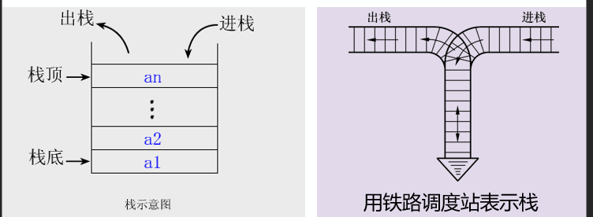
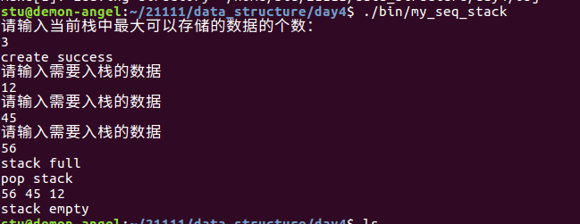
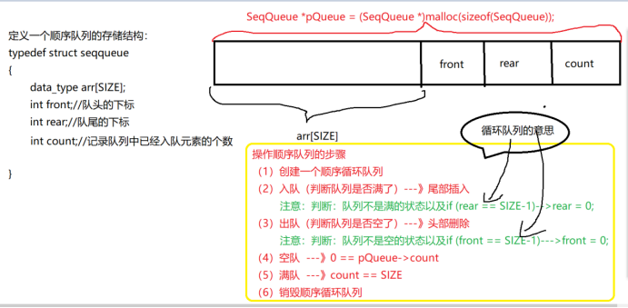
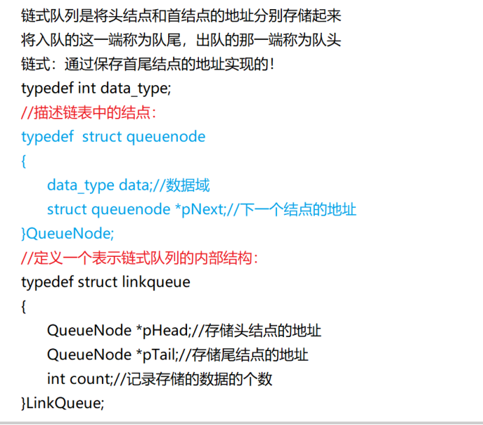
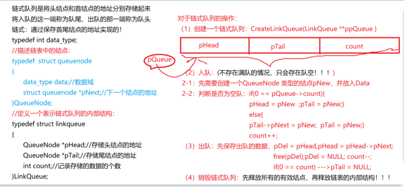
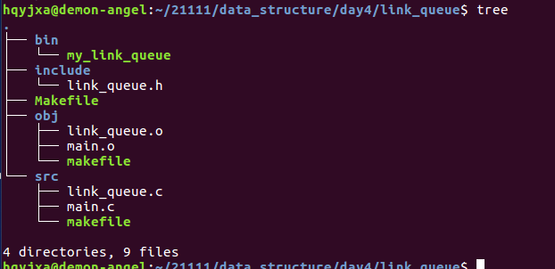
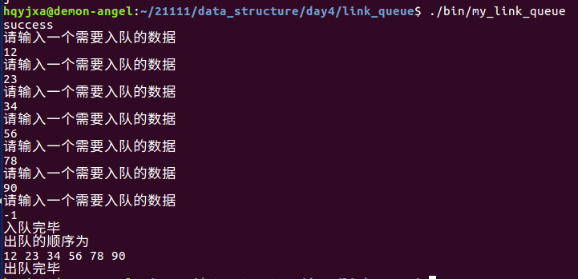
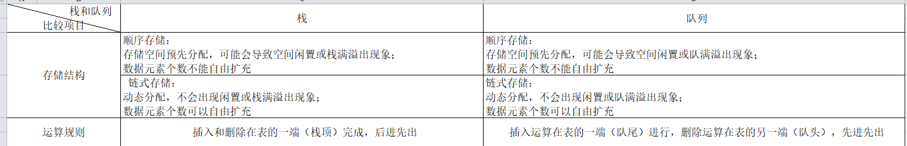
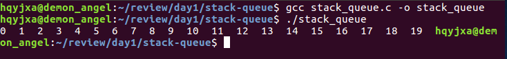

[toc]

# 1 栈和队列

## 1.1 栈

### 1.1.1 定义

只能在表的一端（栈顶）进行插入和删除运算的线性表，俗称堆栈。允许操作的一端称为“栈顶”，另一固定端称为“栈底”，当栈中没有元素时称为“空栈”。

### 1.1.2 逻辑结构

与线性表相同，仍为一对一关系

### 1.1.3 存储结构

用顺序栈或链式栈存储均可，但以顺序栈更常见

1. 顺序栈

   相当于就是顺序表的头插以及头删

2. 链式栈

   相当于就是链表的头插以及头删

### 1.1.4 运算规则

只能在栈顶运算，且访问节点时依照==**先进后出(FILO)**==和==**后进先出(LIFO)**==的原则

### 1.1.5 实现方式

关键是编写入栈和出栈函数，具体实现依顺序栈和链式栈的不同而不同

基本操作有入栈、出栈、读栈顶元素值、建栈、判断栈空、栈满。



## 1.2 队列

### 1.2.1 定义

只能在表的一端（队尾）进行插入，在另一端（对头）进行删除运算的线性表。允许进行存入操作的一端称为“队尾”，允许进行删除操作的一端称为“队头”。当线性表中没有元素时，称为“空队”。

### 1.2.2 逻辑结构

与线性表相同，仍为一对一关系

### 1.2.3 存储结构

用顺序队列或链式存储均可

1. 顺序队列

   相当于顺序表的尾插以及头删

2. 链式队列

   相当于链表的尾插以及头删

### 1.2.4 运算规则

==**先进先出（FIFO）**==

### 1.2.5 实现方式

关键是编写入队和出队函数，具体实现依顺序队或链队的不同而不同

## 1.3 栈、队列与一般线性表的区别

栈、队列是一种特殊（操作受限）的线性表

区别仅在于运算规则不同

| 比较项   | 一般线性表     |           栈           |        队列        |
| :------- | :------------- | :-------------------- | :---------------- |
| 逻辑结构 | 一对一         |         一对一         |       一对一       |
| 存储结构 | 顺序表、链表   |      顺序栈、链栈      | 顺序队列、链式队列 |
| 运算规则 | 随机、顺序存储 | 后进先出，先进后出 |      先进先出      |

# 2 顺序栈

## 2.1 使用makefile嵌套

### 2.1.1 Makefile

```makefile
CC=gcc
CFLAGS=-c -g -Wall
OBJS=main.o seq_stack.o
APP=my_seq_stack

export CC CFLAGS OBJS APP

All:
	make -C ./src/
	make -C ./obj/

.PHONY:clean
clean:
	$(RM) ./obj/*.o
	$(RM) ./bin/*
```

#### 2.1.1.1 src中的makefile

```makefile
All:$(OBJS)
	mv $^ ../obj/
main.o:main.c
	$(CC) $(CFLAGS) $< -o $@
seq_stack.o:seq_stack.c
	$(CC) $(CFLAGS) $< -o $@
```

#### 2.1.1.2 obj中的makefile

```makefile
All:$(APP)
	mv $^ ../bin/
$(APP):$(OBJS)
	$(CC) $^ -o $@
```

## 2.2 src中的seq_stack.c

### 2.2.1 头文件

```c
#include "../include/seq_stack.h"
#include <stdio.h>
#include <stdlib.h>
#include <string.h>
```

### 2.2.2 创建一个顺序栈

```c
// 功能：
//		创建一个顺序栈
// 参数:
//		参数1：栈的地址的地址
//		参数2：栈中最大存储的个数
// 返回值：
//		成功返回OK，失败返回失败的原因
int create_seq_stack(SEQ_STACK **pp_stack, int len)
{
	if(NULL == pp_stack)
	{
		return NULL_ERROR;
	}
	// 先申请栈的内部结构
	*pp_stack = (SEQ_STACK *)malloc(sizeof(SEQ_STACK));
	if(NULL == pp_stack)
	{
		return MALLOC_ERROR;
	}
	memset(*pp_stack,'\0',sizeof(SEQ_STACK));
	// 再去申请能够存储len个data_type类型的数据的连续空间（栈）
	(*pp_stack)->p_arr = (data_type *)malloc(sizeof(data_type) * len);
	memset((*pp_stack)->p_arr,'\0',sizeof(data_type) * len);
	(*pp_stack)->max_len = len;
	(*pp_stack)->top = -1;
	return OK;
}
```

### 2.2.3 判断是否是满栈

```c
// 功能：
//		判断是否是满栈
// 参数：
//		栈的地址
// 返回值：
//		成功返回OK,失败返回失败的原因
int full_stack(SEQ_STACK *p_stack)
{
	if(NULL == p_stack)
	{
		return CREATE_ERROR;
	}
	if(p_stack->top == p_stack->max_len - 1)
	{
		return IS_FULL;
	}
	return OK;
}
```

### 2.2.4 判断是否是空栈

```c
// 功能：
//		判断是否是空栈
// 参数：
//		栈的地址
// 返回值：
//		成功返回OK,失败返回失败的原因
int empty_stack(SEQ_STACK *p_stack)
{
	if(NULL == p_stack)
	{
		return CREATE_ERROR;
	}
	if(-1 == p_stack->top)
	{
		return IS_EMPTY;
	}
	return OK;
}
```

### 2.2.5 清空顺序栈

```c
// 功能：
//		清空栈
// 参数：
//		栈的地址
// 返回值：
//		成功返回OK,失败返回失败的原因
int clear_stack(SEQ_STACK *p_stack)
{
	if(NULL == p_stack)
	{
		return CREATE_ERROR;
	}
	p_stack->top = -1;
	return OK;
}
```

### 2.2.6 获取栈中的栈顶值

```c
// 功能：
//		获取栈顶元素值
// 参数：
//		栈的地址
// 返回值：
//		成功返回栈顶元素值，失败返回失败的原因
data_type get_top_value_stack(SEQ_STACK *p_stack)
{
	if(NULL == p_stack)
	{
		return CREATE_ERROR;
	}
	return p_stack->p_arr[p_stack->top];
}
```

### 2.2.7 入栈

```c
// 功能：
//		将一个节点插入到栈中---入栈
// 参数：
//		参数1：栈的地址
//		参数2：插入的数据
// 返回值：
//		成功返回OK,失败返回失败的原因
int push_stack(SEQ_STACK *p_stack, data_type data)
{
	if(NULL == p_stack)
	{
		return CREATE_ERROR;
	}
	p_stack->top++;
	p_stack->p_arr[p_stack->top] = data;
	return OK;
}
```

### 2.2.8 出栈

```c
// 功能:
//		从栈中删除一个节点---出栈
// 参数：
//		参数1：栈的地址
//		参数2：保存被删除的数据
// 返回值：
//		成功返回OK,失败返回失败的原因
int pop_stack(SEQ_STACK *p_stack, data_type *p_data)
{
	if(NULL == p_stack)
	{
		return CREATE_ERROR;
	}
	if(NULL == p_data)
	{
		return NULL_ERROR;
	}
	*p_data = p_stack->p_arr[p_stack->top];
	p_stack->top--;
	return OK;
}
```

### 2.2.9 销毁顺序栈

```c
// 功能：
//		销毁顺序栈
// 参数：
//		栈的地址的地址
// 返回值：
//		成功返回OK,失败返回失败的原因
int destroy_seq_stack(SEQ_STACK **pp_stack)
{
	if(NULL == pp_stack)
	{
		return NULL_ERROR;
	}
	if(NULL == *pp_stack)
	{
		return CREATE_ERROR;
	}
	// 先释放存储数据的连续空间
	free((*pp_stack)->p_arr);
	(*pp_stack)->p_arr = NULL;
	// 然后再释放栈的内部结构
	free(*pp_stack);
	*pp_stack = NULL;
	return OK;
}
```

## 2.3 src中的main.c

```c
#include "../include/seq_stack.h"
#include <stdio.h>

int main(int argc, const char *argv[])
{
	SEQ_STACK *p_stack = NULL;
	int ret, len;
	printf("请输入当前栈中最大可以存储的数据的个数：\n");
	scanf("%d",&len);
	ret = create_seq_stack(&p_stack, len);
	if(ret < 0)
	{
		printf("create error\n");
		return ERROR;
	}
	printf("create success\n");
	data_type data;
	while(1)
	{
		ret = full_stack(p_stack);
		if(IS_FULL == ret)
		{
			printf("stack full\n");
			break;
		}
		else
		{
			printf("请输入需要入栈的数据\n");
			scanf("%d", &data);
			push_stack(p_stack, data);
		}
	}

	printf("pop stack\n");
	while(1)
	{
		ret = empty_stack(p_stack);
		if(IS_EMPTY == ret)
		{
			printf("\nstack empty\n");
			break;
		}
		else
		{
			pop_stack(p_stack, &data);
			printf("%d ",data);
		}
	}
	destroy_seq_stack(&p_stack);
	return OK;
}
```

## 2.4 include中的seq_stack.h

```c
#ifndef _SEQ_STACK_H__
#define _SEQ_STACK_H_

// 给描述的顺序表中的数据元素进行取别名
typedef int data_type;

// 定义一个栈的内部结构
typedef struct seq_stack
{
	// 代表当前可以存储数据的连续空间的首地址
	data_type *p_arr;
	// 代表当前连续空间最大存储的数据的个数
	int max_len;
	// 表示栈顶元素的下标
	int top;
}SEQ_STACK;

// 定义一个枚举
enum VALUE
{
	CREATE_ERROR = -6,
	NULL_ERROR,
	MALLOC_ERROR,
	IS_EMPTY,
	IS_FULL,
	ERROR,
	OK
};

// 函数声明
// 创建一个顺序栈
int create_seq_stack(SEQ_STACK **pp_stack, int len);
// 入栈操作
int push_stack(SEQ_STACK *p_stack, data_type data);
// 出栈操作
int pop_stack(SEQ_STACK *p_stack, data_type *p_data);
// 是否是空栈
int empty_stack(SEQ_STACK *p_stack);
// 是否是满栈
int full_stack(SEQ_STACK *p_stack);
// 清空栈
int clear_stack(SEQ_STACK *p_stack);
// 获取栈顶元素值
data_type get_top_value_stack(SEQ_STACK *p_stack);
// 销毁顺序栈
int destroy_seq_stack(SEQ_STACK **pp_stack);

#endif
```

result



# 3 队列

分为顺序队列以及链式队列

不管是顺序队列，还是链式队列，我们都需要记录队头和队尾的位置

当队列为顺序队列时：我们是用下标front和rear来记录队头队尾的位置

当队列为链式队列时：我们用指针pHead和pTail来记录队头和队尾的位置。

## 3.1 顺序队列



## 3.2 链式队列





## 3.3 使用makefile嵌套



### 3.3.1 Makefile

```makefile
CC=gcc
CFLAGS=-c -g -Wall
OBJS=main.o link_queue.o
APP=my_link_queue

export CC CFLAGS OBJS APP

All:
	make -C ./src/
	make -C ./obj/

.PHONY:clean
clean:
	$(RM) ./obj/*.o
	$(RM) ./bin/*
```

#### 3.3.1.1 src中的makefile

```makefile
All:$(OBJS)
	mv $^ ../obj/
main.o:main.c
	$(CC) $(CFLAGS) $< -o $@
link_queue.o:link_queue.c
	$(CC) $(CFLAGS) $< -o $@
```

#### 3.3.1.2 obj中的makefile

```makefile
All:$(APP)
	mv $^ ../bin/
$(APP):$(OBJS)
	$(CC) $^ -o $@
```

## 3.4 src中的link_queue.c

### 3.4.1 头文件

```c
#include "../include/link_queue.h"
#include <stdio.h>
#include <stdlib.h>
#include <string.h>
```

### 3.4.2 创建一个链式队列

```c
int create_link_queue(LINKQUEUE **pp_queue)
{
    if (NULL == pp_queue)
    {
        return NULL_ERROR;
    }
    *pp_queue = (LINKQUEUE *)malloc(sizeof(LINKQUEUE));
    if (NULL == *pp_queue)
    {
        return MALLOC_ERROR;
    }
    memset(*pp_queue, 0, sizeof(LINKQUEUE));
    return OK;
}
```

### 3.4.3 判断是否是空的队列

```c
int empty_link_queue(LINKQUEUE *p_queue)
{
    if (NULL == p_queue)
    {
        return CREATE_ERROR;
    }
    if (0 == p_queue->count)
    {
        return IS_EMPTY;
    }
    
    return OK;
}
```

### 3.4.4 入队

```c
int insert_link_queue(LINKQUEUE *p_queue, data_type data)
{
    if (NULL == p_queue)
    {
        return CREATE_ERROR;
    }
    // 申请一个新的节点
    QUEUENODE *p_new = (QUEUENODE *)malloc(sizeof(QUEUENODE));
    if (NULL == p_new)
    {
        return MALLOC_ERROR;
    }
    memset(p_new, 0, sizeof(QUEUENODE));
    p_new->data = data;

    // 判断队列目前是否为空队
    int ret = empty_link_queue(p_queue);
    if (IS_EMPTY == ret)
    {
        p_queue->p_head = p_new;
        p_queue->p_tail = p_new;
    }
    else
    {
        p_queue->p_tail->p_next = p_new;
        p_queue->p_tail = p_new;
    }
    p_queue->count++;
    return OK;
}
```

### 3.4.5 出队

```c
int delete_link_queue(LINKQUEUE *p_queue, data_type *p_data)
{
    if (NULL == p_queue)
    {
        return CREATE_ERROR;
    }
    if (NULL == p_data)
    {
        return NULL_ERROR;
    }
    *p_data = p_queue->p_head->data;
    QUEUENODE *p_del = p_queue->p_head;
    p_queue->p_head = p_queue->p_head->p_next;

    free(p_del);
    p_del = NULL;
    p_queue->count--;
    
    if(0 == p_queue->count)
    {
        // 重新让pTail == NULL
        p_queue->p_tail = NULL;
    }
    return OK;
}
```

### 3.4.6 销毁链式队列

```c
int destroy_link_queue(LINKQUEUE **pp_queue)
{
    if (NULL == pp_queue)
    {
        return NULL_ERROR;
    }
    if(NULL == *pp_queue)
    {
        return CREATE_ERROR;
    }
    QUEUENODE *p_del = (*pp_queue)->p_head;
    while (NULL != p_del)
    {
        (*pp_queue)->p_head = (*pp_queue)->p_head->p_next;
        free(p_del);
        p_del = (*pp_queue)->p_head;
    }
    free(*pp_queue);
    *pp_queue = NULL;
    return OK;
}
```

## 3.5 src中的main.c

```c
#include "../include/link_queue.h"
#include <stdio.h>

int main(int argc, char const *argv[])
{
    LINKQUEUE *p_queue = NULL;
    int ret;
    ret = create_link_queue(&p_queue);
    if(ret)
    {
        printf("error\n");
    }
    printf("success\n");
    data_type data;
    while (1)
    {
        printf("请输入一个需要入队的数据\n");
        scanf("%d", &data);
        if(-1 == data)
        {
            printf("入队完毕\n");
            break;
        }
        insert_link_queue(p_queue, data);
    }

    printf("出队的顺序为\n");
    while (1)
    {
        ret = empty_link_queue(p_queue);
        if(IS_EMPTY == ret)
        {
            printf("\n出队完毕\n");
            break;
        }
        delete_link_queue(p_queue, &data);
        printf("%d ", data);
        
    }
    
    destroy_link_queue(&p_queue);
    return OK;
}
```

## 3.6 include中的link_queue.h

```c
#ifndef _LINK_QUEUE_H
#define _LINK_QUEUE_H

// 给链表中的数据域进行重命名其类型
typedef int data_type;

// 定义一个描述队列中的节点的结构体
typedef struct queuenode
{
	// 数据域
	data_type data;
	// 指针域
	struct queuenode *p_next;
}QUEUENODE;

typedef struct linkqueue
{
	// 保存单链表中的第一个有效节点的地址
	QUEUENODE *p_head;
	// 保存单链表中的最后一个节点的地址
	QUEUENODE *p_tail;
	// 记录当前存储的数据的个数
	int count;
}LINKQUEUE;


enum VALUE
{
	IS_EMPTY = -5,
	CREATE_ERROR,
	NULL_ERROR,
	MALLOC_ERROR,
	ERROR,
	OK
};

// 函数声明
int create_link_queue(LINKQUEUE **pp_queue);
int insert_link_queue(LINKQUEUE *p_queue, data_type data);
int delete_link_queue(LINKQUEUE *p_queue, data_type *p_data);
int empty_link_queue(LINKQUEUE *p_queue);
int destroy_link_queue(LINKQUEUE **pp_queue);

#endif
```

result



# 4 栈和队列的比较



# 5 笔试题

## 5.1 两个队列实现一个栈


## 5.2 两个栈实现一个队列

### 5.2.1 stack_queue.h

```c
#ifndef STACK_QUEUE_H
#define STACK_QUEUE_H

#include <stdio.h>
#include <stdlib.h>

#define MALLOC_SIZE 512
#define ELEM_TYPE int

typedef struct sqstack
{
    ELEM_TYPE *top;  //栈顶指针
    ELEM_TYPE *base; //栈底指针
    int stack_size;  //栈目前能存储的元素数目
} SqStack;           //顺序栈

typedef struct sqqueue
{
    SqStack front; //队列头，出口，
    SqStack rear;  //队列尾，入口
} SqQueue;

/*栈的初始化函数*/
void InitStack(SqStack *s)
{
    if ((s->top = (ELEM_TYPE *)malloc(MALLOC_SIZE * sizeof(ELEM_TYPE))) == NULL)
    {
        printf("stack malloc error\n");
        exit(1);
    }
    s->base = s->top;
    s->stack_size = MALLOC_SIZE;
}

/*出栈函数，栈为空时返回0，成功出栈时返回1*/
int pop_stack(SqStack *s, ELEM_TYPE *data)
{
    if (s->top != s->base)
    {
        s->top--;
        *data = *s->top;
        return 1;
    }
    else //返回值为0，表示栈为空
    {
        return 0;
    }
}

/*入栈函数*/
void push_stack(SqStack *s, ELEM_TYPE data)
{
    if ((s->top - s->base) >= s->stack_size)
    {
        if ((s->base = (ELEM_TYPE *)realloc(s->base, (s->stack_size + MALLOC_SIZE) * sizeof(ELEM_TYPE))) == NULL)
        {
            printf("stack realloc error\n");
            exit(1);
        }
        else
        {
            s->top = s->base + s->stack_size;
            s->stack_size += MALLOC_SIZE;
        }
    }
    *(s->top) = data;
    s->top++;
}

/*队列初始化函数*/
void InitQueue(SqQueue *q)
{
    SqStack A, B;
    InitStack(&A);
    InitStack(&B);
    q->front = B; //将栈B作为队列的出口
    q->rear = A;  //将栈A作为队列的入口
}

/*入队列函数*/
void push_queue(SqQueue *q, ELEM_TYPE data)
{
    push_stack(&q->rear, data);
}

/*出队列函数，队列为空时返回0，成功出队列返回1*/
int pop_queue(SqQueue *q, ELEM_TYPE *data)
{
    if ((pop_stack(&q->front, data)) == 0) //如果作为出口的栈为空，就将入口栈的内容压入
    {
        while ((pop_stack(&q->rear, data)) != 0)
        {
            push_stack(&q->front, *data);
        }
    }
    else //否则，返回1
    {
        return 1;
    }
    if ((pop_stack(&q->front, data)) == 0) //如果将入口栈的内容压人后还为空，说明此时队列为空
    {
        return 0;
    }
    else
    {
        return 1;
    }
}
#endif
```

### 5.2.2 stack_queue.c

```c
#include <stdio.h>
#include "stack_queue.h"

int main()
{
    SqQueue q;
    int i, data;
    InitQueue(&q);
    for (i = 0; i < 20; i++)
    {
        push_queue(&q, i);
    }
    while ((pop_queue(&q, &data)) != 0)
    {
        printf("%d  ", data);
    }
    return 0;
}
```

reult


