[toc]

# 1 树

## 1.1 定义

树是n(n >= 0)个节点的有限集，他或为空树(n = 0)；或为非空树，对于非空树T:

1. 有且仅有一个称之为根的节点
   1. 除根节点以外的其余节点可分为m（m > 0）个互不相交的有限集T~1~，T~2~，...，T~m~，其中每一个集合本身又是一棵树，并且称为根的子树。


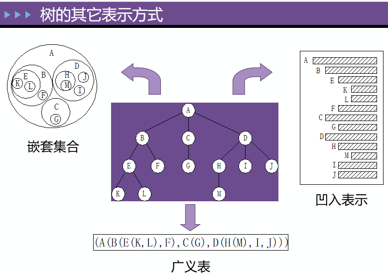

## 1.2 基本术语

**根**：根节点(没有前驱)

**叶子**：即终端节点(没有后继)

**森林**：指m棵不相交的树的集合(例如删除A后的子树个数)

**有序树**：节点各子树从左至右有序，不能互换(左为第一)

**无序树**：节点各子树可互换位置

**双亲**：即上层的那个结点(直接前驱)

**孩子**：即下层结点的子树的根(直接后继)

**兄弟**：同一双亲下的同层结点(孩子之间互称兄弟)

**堂兄弟**：即双亲位于同一层的节点(但并非同一双亲)

**祖先**：即从根到该节点所经分支的所有节点

**子孙**：即该节点下层子树中的任一节点

**节点**：即树的数据元素

**节点的度**：节点挂接的子树数

**节点的层次**：从根到该节点的层数(根节点算第一层)

**终端节点**：即度为0的节点，即叶子

**分支节点**：即度不为0的节点(也称为内部节点)

**树的度**：所有节点度中的最大值

**树的深度(或高度)**：所有节点中最大的层数

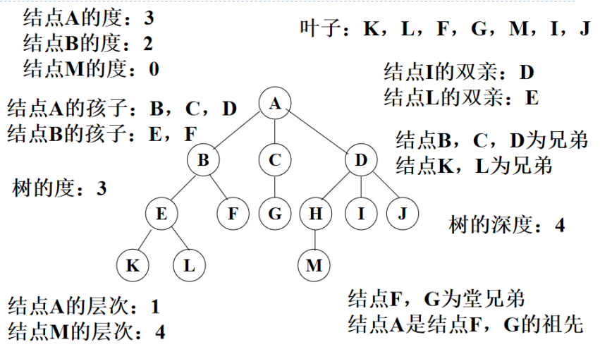

# 2 二叉树

## 2.1 定义

二叉树（Binary Tree）是n（n >= 0）个节点的有限集合，它或者是空集（n = 0），或者是由一个根节点以及两颗互不相交、分别称为左子树和右子树的二叉树组成。二叉树和普通有序树不同，二叉树严格区分左孩子和右孩子，即使只有一个子节点也要区分左右。

## 2.2 二叉树的基本特点

- 节点的度小于等于2
- 有序树（子树有序，不能颠倒）

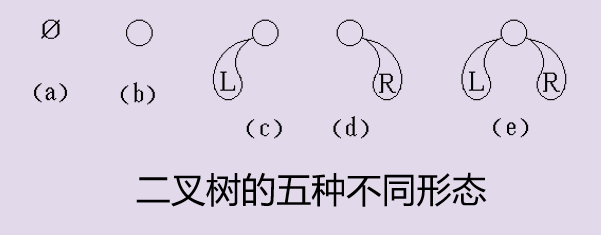

## 2.3 二叉树的性质

1. 在二叉树的第i层上至多有2^i-1^个节点

   第i层上至少有1个节点

2. 深度为k的二叉树至多有2^k^-1个结点

   深度为k时至少有k个结点

3. 对于任何一棵二叉树，若2度的结点数有n~02~个，则叶子数n~0~必定为n~2~＋1 （即n~0~=n~2~+1）

   总节点数为各类节点之和：n = n~0~ + n~1~ + n~2~

   总节点数为所有子节点数加1：n = 0 + n~1~ + 2*n~2~ +1

   故得：n~0~ = n~2~ + 1

   **满二叉树：**一棵深度为k且2^k^ - 1个节点的二叉树（特点：每层都“充满”了节点）

   **完全二叉树：**对一棵满二叉树，从下向上，从右到左依次去掉若干的节点形成的二叉树成为完全二叉树。

   ==**满二叉树是完全二叉树的一个特例。**==

4. 具有n个结点的完全二叉树的深度必为[log~2~n]＋1

5. 对完全二叉树，若从上至下、从左至右编号，则编号为i 的结点，其左孩子编号必为2i，其右孩子编号必为2i＋1；其双亲的编号必为i/2

## 2.4 二叉树的存储结构

### 2.4.1 顺序存储

1. 如果该树不是完全二叉树，则将不完全二叉树变成完全二叉树，反之则不用变。
2. 将完全二叉树的节点进行编号，方法是：从上到下，从左到右，进行编号，根节点为1号结束。
3. 将N的节点的二叉树用N+1个元素的数组进行顺序存储，节点号和数组的下标一一对应，数组下标为0的空间不会用。

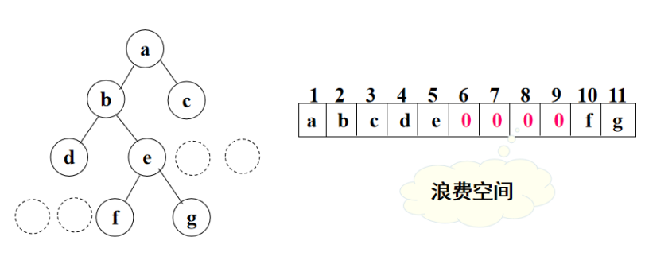

特点：

节点间关系蕴含在其存储位置中浪费空间，适于存满二叉树和完全二叉树。

### 2.4.2 链式存储

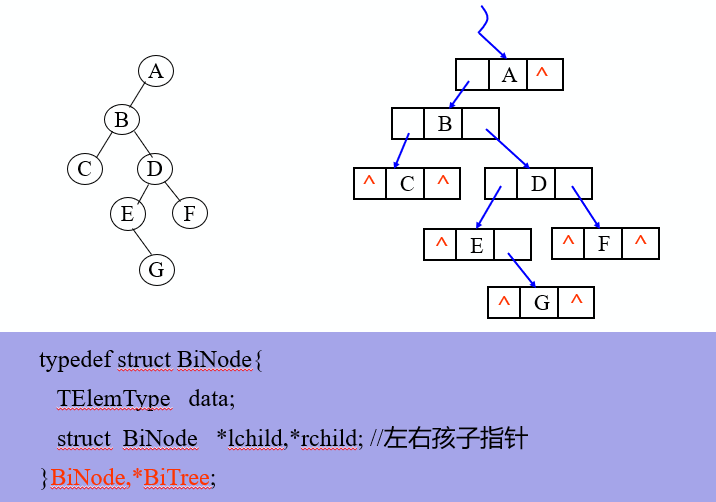

在n个节点的二叉链表中，有n+1个空指针域

## 2.5 遍历二叉树

### 2.5.1 定义

指按某条搜索路线遍访每个结点且不重复（又称周游）

### 2.5.2 用途

它是树结构插入、删除、修改、查找和排序运算的前提，是二叉树一切运算的基础和核心。 

### 2.5.3 遍历算法

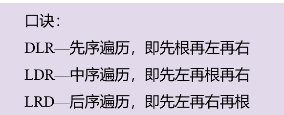

#### 2.5.3.1 先序遍历（DLR）

```c
int PreOrder(TreeNode *pBoot)
{
	if(NULL == pBoot)
	{
		return NULL_ERROR;
	}
	//先遍历根，再遍历左，然后遍历右
	printf("%d ",pBoot->data);
	PreOrder(pBoot->lChild);
	PreOrder(pBoot->rChild);
	return OK;
}
```

#### 2.5.3.2 中序遍历（LDR）

```c
int MidOrder(TreeNode *pBoot)
{
	if(NULL == pBoot)
	{
		return NULL_ERROR;
	}
	//先遍历左子树，再遍历根，最后遍历右子树
	MidOrder(pBoot->lChild);
	printf("%d ",pBoot->data);
	MidOrder(pBoot->rChild);
	return OK;
}
```

#### 2.5.3.3 后序遍历（LRD）

```c
int LastOrder(TreeNode *pBoot)
{
	if(NULL == pBoot)
	{
		return NULL_ERROR;
	}
	//先遍历左子树，再遍历右子树，最后遍历根结点
	LastOrder(pBoot->lChild);
	LastOrder(pBoot->rChild);	
	printf("%d ",pBoot->data);	
	return OK;
}
```

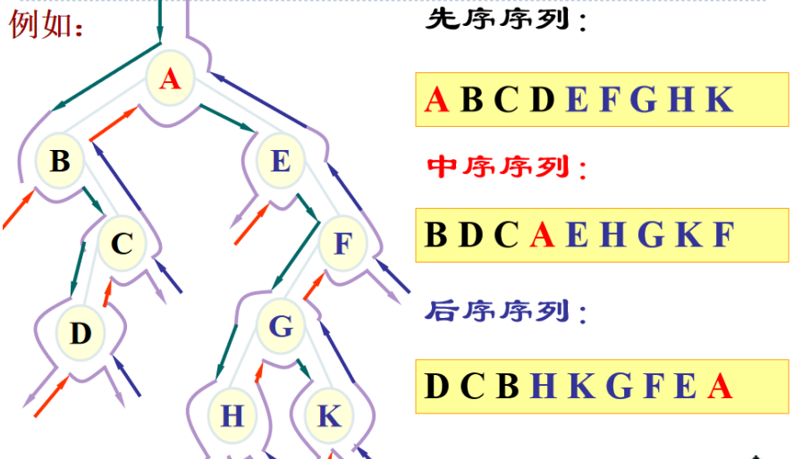

## 2.6 创建一个有序的二叉树

1. 先申请一个根节点的空间，并且给数据域放入一个数据
2. 当新节点的数据小于根节点的数据时，就将其作为根节点的左子树，反之则作为右子树
3. 三种遍历，先序遍历（DLR）、中序遍历（LDR）、后序遍历（LRD）
4. 销毁二叉树

## 2.7 计算二叉树叶子节点总数

```c
int LeadCount(BiTree T)
{
	if (T == NULL) //如果是空树返回0
		return 0;
	if (T->lchild == NULL && T->rchild == NULL)
		return 1; //如果是叶子结点返回1
	else
		return LeafCount(T->lchild) + LeafCount(T->rchild);
}
```

## 2.8 计算二叉树的深度

- 如果是空树，则深度为0
- 否则，递归计算左子树的深度记为m，递归计算右子树的深度记为n，二叉树的深度则为m与n的较大者加1

## 2.9 结论

若二叉树中各节点的值均不同，则：

**由二叉树的前序序列和中序序列，或由其后序序列和中序序列均能唯一地确定一棵二叉树，但由前序序列和后序序列却不一定能唯一地确定一棵二叉树**


# 3 哈夫曼树（赫夫曼树）

## 3.1 定义

赫夫曼(Huffman)树，又称最优树，是带权路径长度最短的树，有着广泛的应用。

从树中一个节点到另外一个节点的分支构成一条路径，分支的数目称为路径的长度。树的路径长度是指从树根到每个节点的路径长度之和。

节点的带权路径长度指的是从树根到该节点的路径长度和节点上权的乘积。树的带权路径长度是指所有叶子节点的带权路径长度之和，记作==**WPL**==。WPL最小的二叉树就是最优二叉树，又称为赫夫曼树。

**路径**：由一节点到另一节点间的分支所构成

**路径长度**：路径上的分支数目

**带权路径长度**：节点到根的路径长度与节点上权的乘积。

**树的带权路径长度**：树中所有叶子节点的带权路径长度之和

**哈夫曼树**：带权路径长度最小的树

## 3.2 哈夫曼树的构造过程

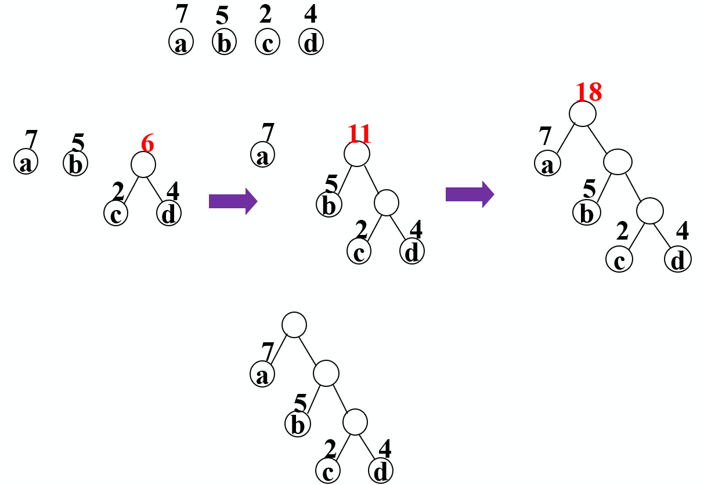

基本思想：

使权大的节点靠近根

操作要点：

对权值的合并、删除与替换，总是合并当前值最小的两个

- 根据给定的n个权值{w~1~,w~2~,……w~n~}，构造n棵只有根结点的二叉树。
- 在森林中选取两棵根结点权值最小的树作左右子树，构造一棵新的二叉树，置新二叉树根结点权值为其左右子树根结点权值之和。
- 在森林中删除这两棵树，同时将新得到的二叉树加入森林中。
- 重复上述两步，直到只含一棵树为止，这棵树即哈夫曼树。

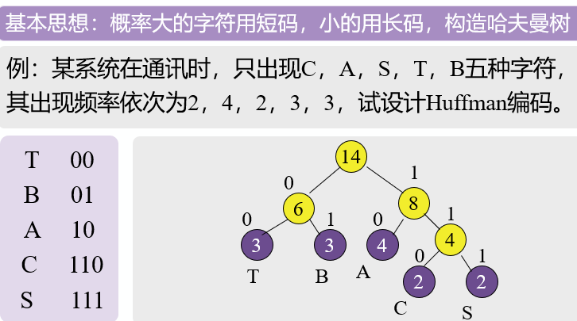

==**一棵有n个叶子结点的Huffman树有2n-1个结点**==

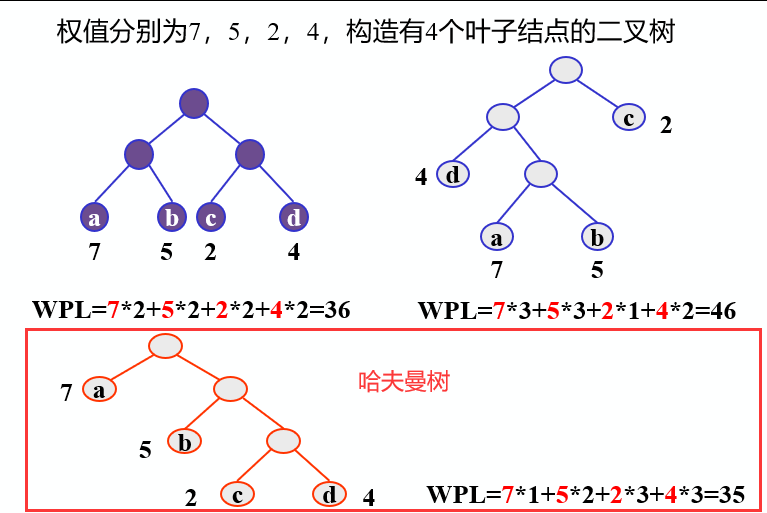

## 3.3 最优二叉树（哈夫曼树）

赫夫曼树是不唯一的（就像上图中的第三张图中的c和d可以互换位置也就成了一个新的哈夫曼树）。

因此，为了保证哈夫曼树的唯一性，遵循左小右大的原则。

## 3.4 哈夫曼树构造算法的实现

```c
void CreatHuffmanCode(HuffmanTree HT, HuffmanCode &HC, int n)
{
	//从叶子到根逆向求每个字符的赫夫曼编码，存储在编码表HC中
	HC = new char *[n + 1]; //分配n个字符编码的头指针矢量
	cd = new char[n];		//分配临时存放编码的动态数组空间
	cd[n - 1] ='\0';		//编码结束符
	for (i = 1; i <= n; ++i)
	{ //逐个字符求赫夫曼编码
		start = n - 1;
		c = i;
		f = HT[i].parent;
		while (f != 0)
		{			 //从叶子结点开始向上回溯，直到根结点
			--start; //回溯一次start向前指一个位置
			if (HT[f].lchild == c)
				cd[start] ='0'; //结点c是f的左孩子，则生成代码0
			else
				cd[start] ='1'; //结点c是f的右孩子，则生成代码1
			c = f;
			f = HT[f].parent;		 //继续向上回溯
		}							 //求出第i个字符的编码
		HC[i] = new char[n - start]; // 为第i 个字符编码分配空间
		strcpy(HC[i], &cd[start]); //将求得的编码从临时空间cd复制到HC的当前行中
	}
	delete cd; //释放临时空间
} // CreatHuffanCode
```

## 3.5 哈夫曼编码的结论

1. 哈夫曼编码是不等长编码
2. 哈夫曼编码是前缀编码，即任一字符的编码都不是另一字符编码的前缀。
3. 哈夫曼编码树中没有度为1的节点，若叶子节点的个数为n，则哈夫曼编码树的节点总数为2n-1
4. 发送过程：根据由哈夫曼树得到的编码表送出字符数据
5. 接收过程：按左0，右1的规定，从根节点走到一个叶节点，完成一个字符的译码。反复此过程，直到接收数据结束。

# 4 树

## 4.1 使用makefile嵌套

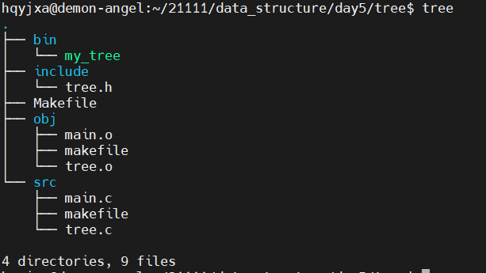

### 4.1.1 Makefile

```makefile
CC=gcc
CFLAGS=-c -g -Wall
OBJS=main.o tree.o
APP=my_tree

export CC CFLAGS OBJS APP

All:
	make -C ./src/
	make -C ./obj/

.PHONY:clean
clean:
	$(RM) ./obj/*.o
	$(RM) ./bin/*
```

#### 4.1.1.1 src中的makefile

```makefile
All:$(OBJS)
	mv $^ ../obj/
main.o:main.c
	$(CC) $(CFLAGS) $^ -o $@
tree.o:tree.c 
	$(CC) $(CFLAGS) $^ -o $@
```

#### 4.1.1.2 obj中的makefile

```makefile
All:$(APP)
	mv $^ ../bin/
$(APP):$(OBJS)
	$(CC) $^ -o $@
```

## 4.2 src中的tree.c

### 4.2.1 头文件

```c
#include "../include/tree.h"
#include <stdio.h>
#include <stdlib.h>
#include <string.h>
```

### 4.2.2 创建一个根节点

```c
int creata_tree_node(TREE_NODE **pp_boot, data_type data)
{
    if (NULL == pp_boot)
    {
        return NULL_ERROR;
    }
    *pp_boot = (TREE_NODE *)malloc(sizeof(TREE_NODE));
    if (NULL == *pp_boot)
    {
        return MALLOC_ERROR;
    }
    memset(*pp_boot, 0, sizeof(TREE_NODE));
    (*pp_boot)->data = data;
    return OK;
}
```

### 4.2.3 将一个数据插入到树中

```c
int insert_data_to_tree(TREE_NODE *p_boot, data_type data)
{
    if (NULL == p_boot)
    {
        return CREATE_ERROR;
    }
    // 申请一个新的节点的空间
    TREE_NODE *p_new = (TREE_NODE *)malloc(sizeof(TREE_NODE));
    if (NULL == p_new)
    {
        return MALLOC_ERROR;
    }
    p_new->data = data;

    // 思想：有序树
    // 当p_new->data小于p_boot->data时，放在p_boot的左子树，反之则放在右子树

    while (1)
    {
        if (p_new->data < p_boot->data)
        {
            // 左子树
            if (NULL != p_boot->l_child)
            {
                p_boot = p_boot->l_child;
            }
            else
            {
                p_boot->l_child = p_new;
                break;
            }
        }
        else
        {
            // 右子树
            if (NULL != p_boot->r_child)
            {
                p_boot = p_boot->r_child;
            }
            else
            {
                p_boot->r_child = p_new;
                break;
            }
        }
    }
    return OK;
}
```

### 4.2.4 先序排列

```c
int pre_order(TREE_NODE *p_boot)
{
    if (NULL == p_boot)
    {
        return NULL_ERROR;
    }
    // DLR
    printf("%d ", p_boot->data);
    pre_order(p_boot->l_child);
    pre_order(p_boot->r_child);
    return OK;
}
```

### 4.2.5 中序排列

```c
int mid_order(TREE_NODE *p_boot)
{
    if (NULL == p_boot)
    {
        return NULL_ERROR;
    }
    // LDR
    mid_order(p_boot->l_child);
    printf("%d ", p_boot->data);
    mid_order(p_boot->r_child);
    return OK;
}
```

### 4.2.6 后序排列

```c
int last_order(TREE_NODE *p_boot)
{
    if (NULL == p_boot)
    {
        return NULL_ERROR;
    }
    // LRD
    last_order(p_boot->l_child);
    last_order(p_boot->r_child);
    printf("%d ", p_boot->data);
    return OK;
}
```

### 4.2.7 销毁树

```c
int destroy_tree(TREE_NODE **pp_boot)
{
    if (NULL == pp_boot)
    {
        return NULL_ERROR;
    }
    if (NULL == *pp_boot)
    {
        return CREATE_ERROR;
    }
    // 如何销毁一棵树
    // 思想：先释放所有的子节点，再释放根节点
    // 1.先释放每一个节点的左子树
    // 2.再释放每一个节点的右子树
    // 3.最后释放每一个子节点自身即可
    destroy_tree(&(*pp_boot)->l_child);
    destroy_tree(&(*pp_boot)->r_child);
    free(*pp_boot);
    *pp_boot = NULL;
    return OK;
}
```

## 4.3 src中的main.c

```c
#include "../include/tree.h"
#include <stdio.h>

int main(int argc, char const *argv[])
{
    data_type arr[10] = {0};
    int i;
    printf("请输入一组需要插入到树中的数据：\n");
    for(i = 0; i < 10; i++)
    {
        scanf("%d", &arr[i]);
    }

    int ret;
    TREE_NODE *p_boot = NULL;
    ret = creata_tree_node(&p_boot, arr[0]);
    if (ret < 0)
    {
        
        printf("创建有序树的根节点失败\n");
        return ERROR;
    }
    printf("创建有序树的根节点成功\n");

    // insert
    for(i = 1; i < 10; i++)
    {
        insert_data_to_tree(p_boot, arr[i]);
    }

    // DLR
    printf("pre_order result:\n");
    pre_order(p_boot);
    printf("\n");

    // LDR
    printf("mid_order result:\n");
    mid_order(p_boot);
    printf("\n");

    // LRD
    printf("last_order result:\n");
    last_order(p_boot);
    printf("\n");

    // destroy
    ret = destroy_tree(&p_boot);
    if(ret < 0)
    {
        printf("fail\n");
    }
    printf("sucess\n");
    return 0;
}
```

## 4.4 include中的tree.h

```c
#ifndef _TREE_H_
#define _TREE_H_

typedef int data_type;

typedef struct treenode
{
    struct treenode *l_child;
    data_type data;
    struct treenode *r_child;
}TREE_NODE;


enum VALUE
{
    CREATE_ERROR = -4,
    MALLOC_ERROR,
    NULL_ERROR,
    ERROR,
    OK
};

int creata_tree_node(TREE_NODE **pp_boot, data_type data);
int insert_data_to_tree(TREE_NODE *p_boot, data_type data);
int pre_order(TREE_NODE *p_boot);
int mid_order(TREE_NODE *p_boot);
int last_order(TREE_NODE *p_boot);
int destroy_tree(TREE_NODE **pp_boot);

#endif
```

result

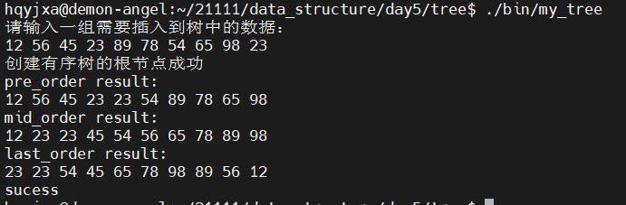

