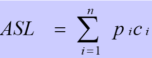
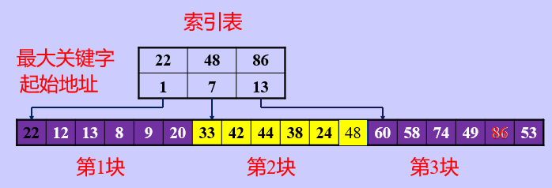
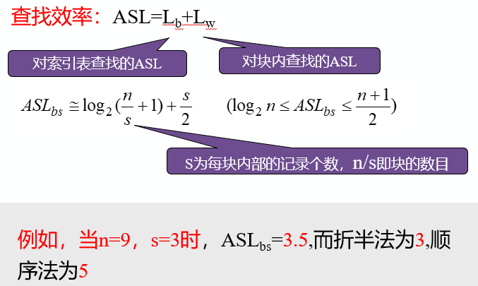
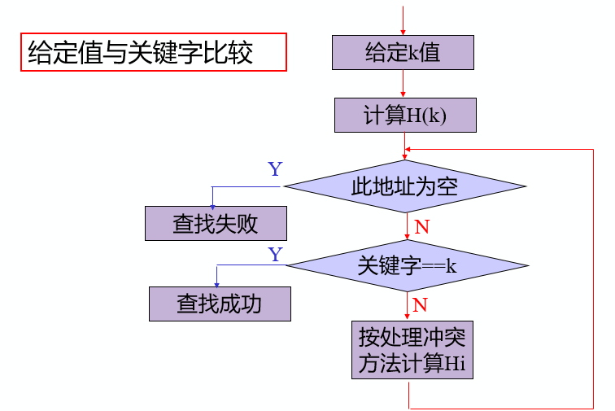
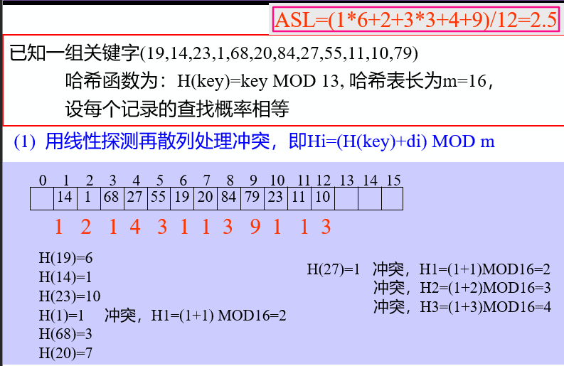
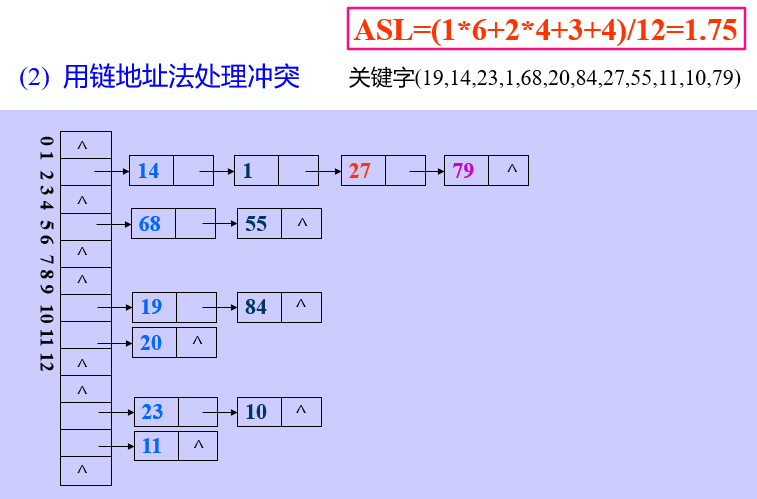
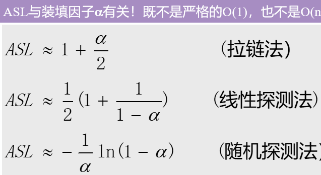

[toc]

# 1 查找

## 1.1 查找的概念

- 查找表：由同一类型的数据元素（或记录）构成的集合

- 静态查找表：查找的同时对查找表不做修改操作（如插入和删除）

- 动态查找表：查找的同时对查找表具有修改操作 

- 关键字：记录某个数据项的值，可用来识别一个记录

- 主关键字：唯一标识数据元素

- 次关键字：可以标识若干个数据元素


### 1.1.1 查找算法的评价指标

==**关键字的平均比较次数，也称平均搜索长度ASL**==



n：记录的个数

p~i~：查找第i个记录的概率（通常认为p~i~ = 1/n）

c~i~：找到第i个记录所需的比较次数

## 1.2 线性表的查找

### 1.2.1 顺序查找

#### 1.2.1.1 应用范围

顺序表或线性表表示的静态查找表

表内元素之间无序

#### 1.2.1.2 表示

```c
typedef struct
{
	ElemType *R; //表基址
	int length;	 //表长
} SSTable;
```

#### 1.2.1.3 在顺序表L中查找值为e的数据元素

```c
int Search_Seq(SSTable ST, KeyType key)
{
	//若成功返回其位置信息，否则返回0
	ST.R[0].key = key;
	for (i = ST.length; ST.R[i].key != key; --i);
	//不用for(i=n; i>0; - -i) 或 for(i=1; i<=n; i++)
	return i;
}
```

#### 1.2.1.4 顺序查找的性能分析

##### 1.2.1.4.1 空间复杂度

一个辅助空间

##### 1.2.1.4.2 时间复杂度

1. 查找成功时的平均查找长度设表中各记录查找概率相等

   ASLs(n)=(1+2+ ... +n)/n =(n+1)/2

2. 查找不成功时的平均查找长度  ASLf =n+1

#### 1.2.1.5 顺序查找算法的特点

- 算法简单，对表结构无任何要求（顺序和链式）
- n很大时查找效率较低
- 改进措施：非等概率查找时，可按照查找概率进行排序

### 1.2.2 折半查找（二分查找）

#### 1.2.2.1 非递归算法

1. 步骤设表长为n，low，high和mid分别执行待查元素所在区间的上届、下届、和中点，k为给定值

2. 初始时，令low = 1，high = n，mid = (low + high)/2

3. 让k与mid指向的记录比较

   若k == R[mid].key，查找成功

   若k < R[mid].key，则high = mid - 1

   若k > R[mid].key，则low = mid + 1

4. 重复上述操作，直至low > high时，查找失败。

```c
int Search_Bin(SSTable ST, KeyType key)
{
	//若找到，则函数值为该元素在表中的位置，否则为0
	low = 1;
	high = ST.length;
	while (low <= high)
	{
		mid = (low + high) / 2;
		if (key == ST.R[mid].key)
			return mid;
		else if (key < ST.R[mid].key)
			high = mid - 1; //前一子表查找
		else
			low = mid + 1; //后一子表查找
	}
	return 0; //表中不存在待查元素
}
```

#### 1.2.2.2 递归算法

```c
int Search_Bin(SSTable ST, keyType key, int low, int high)
{
	if (low > high)
		return 0; //查找不到时返回0
	mid = (low + high) / 2;
	if (key == ST.elem[mid].key)
		return mid;
	else if (key < ST.elem[mid].key)
	//递归	……
	else
	//递归	……
}
```

#### 1.2.2.3 折半查找的性能分析

1. 查找过程

   每次将待查记录所在区间缩小一半，比顺序查找效率高，时间复杂度O(log~2~n)

2. 适用条件

   ==**采用顺序存储结构的有序表**==，不宜用于链式结构

### 1.2.3 分块查找

分块有序，即分成若干子表，要求每个子表中的数值都比后一块中数值小（但子表内部未必有序）。、

然后将各子表中的最大关键字构成一个索引表，表中还要包含每个子表的起始地址（即头指针）。

==**块间有序，块内无序**==



#### 1.2.3.1 查找过程

1. 对索引表使用折半查找法（因为索引表是有序表）
2. 确定了待查关键字所在的子表后，在子表内采用顺序查找法（因为各子表内部是无序表）

#### 1.2.3.2 分块查找性能分析



#### 1.2.3.3 分块查找优缺点

优点：插入和删除比较容易，无需进行大量移动

缺点：要增加一个索引表的存储空间并对初始索引表进行排序运算

适用情况：如果线性表既要快速查找又经常动态变化，则可采用分块查找。

### 1.2.4 顺序查找、折半查找和分块查找的区别

| 比较项         | 顺序查找                                       | 折半查找                         | 分块查找                                               |
| :------------- | :--------------------------------------------- | :------------------------------- | :----------------------------------------------------- |
| 查找时间复杂度 | O(n)                                           | O(log~2~n)                       | 与确定所在块的查找方法有关                             |
| 特点           | 算法简单，对表的结构无任何要求，但查表效率较低 | 对表结构要求较高，查找效率较高   | 对表结构有一定要求，查找效率介于折半查找和顺序查找之间 |
| 适用情况       | 任何结构的线性表，不经常做插入和删除           | 有序的顺序表，不经常做插入和删除 | 块间有序、块内无序的顺序表，经常做插入和删除           |

## 1.3 哈希表的查找

基本思想：记录的存储位置于关键字之间存在对应关系，Loc(i)=H(keyi) ----> 哈希函数


优点：查找速度极快O(1)，查找效率与元素个数n无关

### 1.3.1 如何查找


根据哈希函数H(k) = k

查找key = 9，z则访问H(9) = 9号地址，若内容为9则成功；若查不到，则返回一个特殊值，如空指针或空记录。

### 1.3.2 术语

1. 哈希方法(杂凑法)

   选取某个函数，依该函数按关键字计算元素的存储位置，并按此存放；

   查找时，由同一个函数对给定值k计算地址，将k与地址单元中元素关键码进行比，确定查找是否成功。

2. 哈希函数(杂凑函数)

   哈希方法中使用的转换函数

3. 哈希表(杂凑表)

   按上述思想构造的表

4. 冲突：

   不同的关键码映射到同一个哈希地址

   key1 != key2，但H(key1) = H(key2)

   同义词：具有相同函数值得两个关键字

### 1.3.3 如何减少冲突

冲突是不可避免的

#### 1.3.3.1 构造好的哈希函数

##### 1.3.3.1.1 哈希函数的构造方法

根据元素集合的特性构造;

- 地址空间小

- 均匀

1. 直接定址法
2. 数字分析法
3. 平方取中法
4. 折叠法
5. 除留余数法
6. 随机数法

###### 1.3.3.1.1.1 直接定址法

Hash(key) = a * key + b（a、b为常数）

- **优点**

  以关键码key的某个线性函数值为哈希地址，不会产生冲突。

- **缺点**

  要占用连续地址空间，空间效率低。

###### 1.3.3.1.1.2 除留取余法

Hash(key)=key mod p  (p是一个整数)

- p的值如何选取

  设表长为m，取p <= m且为质数

##### 1.3.3.1.2 构造哈希函数考虑的因素

1. 执行速度（即计算哈希函数所需时间）
2. 关键字的长度
3. 哈希表的大小
4. 关键字的分布情况
5. 查找频率

#### 1.3.3.2 制定一个好的解决冲突方案

##### 1.3.3.2.1 开放定址法

基本思想：有冲突时就去寻找下一个空的哈希地址，只要哈希表足够大，空的哈希地址总能找到，并将数据元素存入。 

###### 1.3.3.2.1.1 开放地址法建立哈希表步骤

1. 取数据元素的关键字key，计算其哈希函数值（地址）。若该地址对应的存储 空间还没有被占用，则将该元素存入；否则执行2解决冲突。
2. 根据选择的冲突处理方法，计算关键字key的下一个存储地址。若下一个存储地址仍被占用，则继续执行2，直到找 到能用的存储地址为止。 

##### 1.3.3.2.2 链地址法

基本思想：相同哈希地址的记录链成一单链表，m个哈希地址就设m个单链表，然后用用一个数组将m个单链表的表头指针存储起来，形成一个动态的结构

###### 1.3.3.2.2.1 链地址法建立哈希表步骤

1. 取数据元素的关键字key，计算其哈希函数值（地址）。若该地址对应的链表为空，则将该元素插入此链表；否则执行2解决冲突。
2. 根据选择的冲突处理方法，计算关键字key的下一个存储地址。若该地址对应的链表为不为空，则利用链表的前插法或后插法将该元素插入此链表。

###### 1.3.3.2.2.2 链地址法的优点

1. 非同义词不会冲突，无“聚集”现象
2. 链表上结点空间动态申请，
2. 更适合于表长不确定的情况

##### 1.3.3.2.3 开放地址法和链地址法的比较

| 比较项目          | 开放地址法                         | 链地址法                             |
| :---------------- | :--------------------------------- | :----------------------------------- |
| 空间              | 无指针域，存储效率较高             | 附加指针域，存储效率较低             |
| 时间-->查找       | 有二级聚集现象，查找效率较低       | 无二次聚集现象，查找效率较高         |
| 时间-->插入和删除 | 不易实现                           | 易于实现                             |
| 适用情况          | 表的大小固定，适于表长无变化的情况 | 节点动态生成，适于表长经常变化的情况 |

### 1.3.4 哈希表的查找







### 1.3.5 哈希表的查找效率分析

使用平均查找长度ASL来衡量查找算法，ASL取决于

- 哈希函数
- 处理冲突的方法
- 哈希表的装填因子

α越大，表中记录数越多，说明表装的越满，发生冲突的可能性越大，，查找时比较次数就越多。

$α = 表中填入的记录数/哈希表的长度$



### 1.3.6 结论

- 哈希表技术具有很好的平均性能，优于一些传统的技术
- 链地址法优于开放地址法
- 除留余数法作哈希函数优于其他类型函数

### 1.3.7 哈希表应用举例

编译器对标识符的管理多是采用哈希表

构造Hash函数的方法：

1. 将标识符中的每一个字符转换为一个非负整数
2. 将得到的各个整数组合成一个整数（可以将第一个、中间的和最后一个字符值加在一起，也可以将所有字符的值加起来）
3. 将结果数调整到0~M-1范围内，可以利用取模的方法，Ki%M（M为素数）

