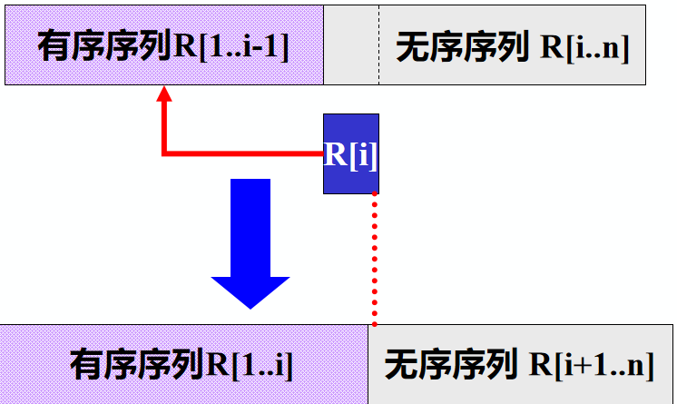

[toc]

# 1 排序

## 1.1 概述

### 1.1.1 什么是排序

将一组杂乱无章的==**数据**==按一定==**规律**==顺次排列起来。

**数据**：存放在数据表中

**规律**：按关键字排序

### 1.1.2 排序的目的

便于查找

### 1.1.3 什么叫内部排序、外部排序

若待排序记录都在内存中，称为==**内部排序**==

若待排序记录一部分在内存，一部分在外存，则称为==**外部排序**==

注：外部排序时，要将数据分批调入内存来排序，中间结果还要及时放入外存，显然外部排序要复杂的多。

### 1.1.4 如何衡量排序算法的好坏

#### 1.1.4.1 时间效率

排序速度（比较次数与移动次数）

#### 1.1.4.2 空间效率

占内存辅助空间的大小

#### 1.1.4.3 稳定性

A和B的关键字相等，排序后A、B的先后次序保持不变，则称这种排序算法时稳定的。

### 1.1.5 排序算法的分类

#### 1.1.5.1 规则不同

1. 插入排序
2. 交换排序
3. 选择排序
4. 归并排序

#### 1.1.5.2 时间复杂度不同

1. 简单排序O(n^2^)
2. 先进排序O(nlog~2~n)

### 1.1.6 记录序列以顺序表存储

```c
#define MAXSIZE 20	 //设记录不超过20个
typedef int KeyType; //设关键字为整型量（int型）

Typedef struct
{						//定义每个记录（数据元素）的结构
	KeyType key;		//关键字
	InfoType otherinfo; //其它数据项
} RedType;

Typedef struct
{							//定义顺序表的结构
	RedType r[MAXSIZE + 1]; //存储顺序表的向量
							// r[0]一般作哨兵或缓冲区
	int length;				//顺序表的长度
} SqList;
```

## 1.2 插入排序

基本思想：每步将一个待排序的对象，按其关键码大小，插入到前面已经排好序的一组对象的适当位置上，直到对象全部插入为止。

即边插入边排序，保证子序列中随时都是排好序的。

### 1.2.1 直接插入排序（基于顺序查找）

#### 1.2.1.1 排序过程

整个排序过程为n-1趟插入，即先将序列中第1个记录看成是一个有序子序列，然后从第2个记录开始看作无序序列，将无序序列逐个进行插入到有序序列中，直至整个序列有序。



#### 1.2.1.2 插入排序的基本步骤

1. 在R[1..i-1]中查找R[i]的插入位置，$R[1..j].key  < R[i].key< R[j+1..i-1].key；$
2. 将R[j+1..i-1]中的所有记录均后移一个位置
3. 将R[i] 插入到R[j+1]的位置上。

#### 1.2.1.3 算法描述

```cpp
void InsertSort(SqList &L)
{
	int i, j;
	for (i = 2; i <= L.length; ++i)
	{
		/* 将L.r[i]插入有序子表 */
		if (L.r[i].key < L.r[i - 1].key)
		{
			/* 复制为哨兵 */
			L.r[0] = L.r[i]; 
			L.r[i] = L.r[i - 1];
			for (j = i - 2; L.r[0].key < L.r[j].key; --j)
			{
				/* 记录后移 */
				L.r[j + 1] = L.r[j]; 
			}
			/* 插入到正确位置 */
			L.r[j + 1] = L.r[0]; 
		}
	}
}
```

#### 1.2.1.4 算法分析

时间复杂度：O(n^2^)

空间复杂度：O(1)

#### 1.2.1.5 算法特点

1. 稳定排序
2. 算法简单，且容易实现
3. 也是用与链式存储结构，只是在单链表上无需移动记录，只需要修改相应的指针。
4. 更适合于初始记录基本有序（正序）的情况，当初始记录无序，n较大时，此算法时间复杂度较高，不宜采用。

### 1.2.2 折半插入排序（基于折半查找）

#### 1.2.2.1 算法步骤

1. 设待排序的记录存放在数组r[1 .. n]中，r[1]是一个有序排列
2. 循环n-1次，每次使用折半查找法，查找r[i] (i = 2, ... , n)在已排好序的序列r[1 ... i-1]中的插入位置，然后将r[i]插入表长为i-1的有序序列r[1 ... i-1]，直到r[n]插入表长为n-1的有序序列r[1 ... n-1],最后得到一个表长为n的有序序列。

#### 1.2.2.2 算法描述

```cpp
/* 折半插入排序 */
void BInsertSort(SqList &L)
{
	/* 对顺序表L做折半插入排序 */
	for (i = 2; i <= L.length; ++i)
	{
		/* 将待插入的记录暂存到监视哨中 */
		L.r[0] = L.r[i];

		/* 置查找区间初值 */
		low = 1;
		high = i - 1;
		/* 在r[low .. high]中折半查找插入的位置 */
		while (low <= high)
		{
			/* 折半 */
			m = (low + high) / 2;
			/* 插入点在前一子表 */
			if (L.r[0].key < L.r[m].key)
			{
				high = m - 1;
			}
			/* 插入点在后一子表 */
			else
			{
				low = m + 1;
			}
		}
		/* 记录后移 */
		for (j = i - 1; j >= high + 1; - -j)
		{
			L.r[j + 1] = L.r[j];
		}
		/* 将r[0]即原r[i],插入到正确位置 */
		L.r[high + 1] = L.r[0];
	}
}
```

#### 1.2.2.3 算法分析

折半查找比顺序查找快，所以折半插入排序就平均性能来说被直接插入排序要快。

折半查找所需要的关键码比较次数与待排序对象序列的初始排列无关，仅依赖于对象个数。在插入第i个对象时，需要经过log~2~i + 1次关键码比较，才能确定它应插入的位置。

减少了比较次数，但没有减少移动次数，平均性能优于直接插入排序

时间复杂度为O(n^2^)

空间复杂度为O(1)

#### 1.2.2.4 算法特点

1. 稳定排序
2. 因为要进行折半查找，所以只能用于顺序结构，不能用链式结构
3. 适合初始记录无序、n较大时的情况

### 1.2.3 直接插入排序和折半插入排序比较

1. 当n较大时，总关键码比较次数比直接插入排序的最坏情况要好得多，但比其最好情况要差。
2. 在对象的初始排列已经按关键码排好序或接近有序时，直接插入排序比折半插入排序执行的关键码比较次数要少
3. 折半插入排序的对象移动次数与直接插入排序相同，依赖于对象的初始排列

### 1.2.4 希尔排序（基于逐趟缩小增量）

#### 1.2.4.1 算法思想

##### 1.2.4.1.1 算法思想的出发点：

直接插入排序在==**基本有序**==时，效率较高

在待排序的记录==**个数较少**==时，效率较高

##### 1.2.4.1.2 基本思想

先将整个待排记录序列分割成若干子序列，分别进行直接插入排序，待整个序列中的记录"基本有序"时，再对全体记录进行一次直接插入排序。

#### 1.2.4.2 算法步骤

希尔排序实质上是采用分组插入的方法。先将整个待排序记录序列分割成几组，从而减少参与直接插入排序的数据量，对每组分别进行直接插入排序，然后增加每组 的数据量，重新分组。这样当经过几次分组排序后，整个序列中的记录“基本有序”时，再对全体记录进行一次直接插入排序。

希尔对记录的分组，不是简单的“逐段分割”而是将相隔某个“增量”的记录分成一组。

1. 第一趟取增量d~1~(d~1~<n)把全部记录分成d~1~个组，所有间隔为d~1~的记录分在同一组，再各个组中进行直接插入排序。
2. 第二趟取增量d~2~(d~2~<d~1~)，重复上述的分组和排序。
3. 依次类推，直到所取得增量d~t~ = 1（d~t~<d~t-1~<...<d~2~<d~1~）,所有记录在同一组中进行直接插入排序为止。

#### 1.2.4.3 算法描述

```cpp
/* 按增量序列dlta[0…t-1]对顺序表L作Shell排序 */
void ShellSort(SqList &L, int dlta[], int t)
{
    /* 增量为dlta[k] 的一趟插入排序 */
    for (k = 0; k < t; ++k)
    {
        ShellInsert(L, dlta[k]);
    }
} /* ShellSort */

/* 对顺序表L进行一趟增量为dk的Shell排序，dk为步长因子 */
void ShellInsert(SqList &L, int dk)
{
    /* 开始将r[i] 插入有序增量子表 */
    for (i = dk + 1; i <= L.length; ++i)
        if (r[i].key < r[i - dk].key)
        {
            /* 暂存在r[0] */
            r[0] = r[i];
            for (j = i - dk; j > 0 && (r[0].key < r[j].key); j = j - dk)
            {
                /* 关键字较大的记录在子表中后移 */
                r[j + dk] = r[j];
            }
            /* 在本趟结束时将r[i]插入到正确位置 */
            r[j + dk] = r[0];
        }
}
```

#### 1.2.4.4 算法分析

时间复杂度是n和的函数：

O(n^1.25^) ~ O(1.6n^1.25^)

空间复杂度O(1)

#### 1.2.4.5 算法特点

1. 记录跳跃式地移动导致排序方法是不稳定的
2. 只能用于顺序结构，不能用于链式结构
3. 增量序列可以有各种取法，但应该使增量序列中的值没有除1之外的公因子，并且最后一个增量必须等于1.
4. 记录总的比较次数和移动次数都比直接插入排序要少，n越大时，效果越明显。所以适合初始记录无序，n较大时的情况

## 1.3 交换排序

基本思想：两两比较，如果发生逆序则交换，直到所有记录都排好序为止。

### 1.3.1 冒泡排序

优点每趟结束时，不仅能挤出一个最大值到最后面位置，还能同时部分理顺其他元素；一旦下趟没有交换，还可提前结束排序。

#### 1.3.1.1 算法思想

每趟不断将记录两两比较，并按“前小后大”规则交换

#### 1.3.1.2 算法描述

```cpp
/* 控制趟数 */
for (i = 0; i < N - 1; i++)
{
    /* 控制次数 */
    for (j = 0; j < N - 1 - i; j++)
    {
        /* 判断前一个数是否比后一个数大 */
        if (arr[j] > arr[j + 1])
        {
            /* 将两个数进行交换 */
            temp = arr[j];
            arr[j] = arr[j + 1];
            arr[j + 1] = temp;
        }
    }
}
```

#### 1.3.1.3 算法分析

时间复杂度：在平均情况下，冒泡排序关键字的比较次数和记录移动次数分别约为n^2^/4和3n^2^/4,==**时间复杂度为O(n^2^)**==

空间复杂度：O(1)

#### 1.3.1.4 算法特点

1. 稳定排序
2. 可用于链式存储结构
3. 移动记录次数较多，算法平均时间性能比直接插入排序差。当初始记录无序，n较大时，次算法不宜采用。
3. 根据数据找位置

### 1.3.2 快速排序

#### 1.3.2.1 算法思想

任取一个元素为中心（pivotkey），所有比它小的元素一律前放，比它大的元素一律后放，形成左右两个子表，对各子表重新选择中心元素并依次规则调整，直到每个子表的元素只剩一个。

#### 1.3.2.2 算法描述

```cpp
/* 对顺序表L中的子表r[low...high]进行一趟排序，返回枢轴位置 */
int Partition(SqList &L, int low, int high)
{
    /* 用子表中第一个记录做枢轴记录 */
    L.r[0] = L.r[low];
    /* 枢轴记录关键字保存在pivotkey中 */
    pivotkey = L.r[low].key;
    /* 从表的两端交替地向中间扫描 */
    while (low < high)
    {
        while (low < high && L.r[high].key >= pivotkey)
        {
            --high;
        }
        /* 将比枢轴记录小的记录移到低端 */
        L.r[low] = L.r[high];
        while (low < high && L.r[low].key <= pivotkey)
        {
            ++low;
        }
        /* 将比枢轴记录大的记录移到高端 */
        L.r[high] = L.r[low];
    }
    /* 枢轴记录到位 */
    L.r[low] = L.r[0];
    /* 返回枢轴位置 */
    return low;
}

void QSort(SqList &L, int low, int high)
{
    /* 对顺序表L中的子序列L.r[low...high]做快速排序 */
    /* 长度大于1 */
    if (low < high)
    {
        /* 将L.r[low...high]一分为二，pivotloc是枢轴的位置 */
        pivotloc = Partition(L, low, high);
        /* 对左子表递归排序 */
        Qsort(L, low, pivotloc - 1);
        /* 对右子表递归排序 */
        Qsort(L, pivotloc + 1, high)
    }
}

void main()
{
    /* 对顺序表L做快速排序 */
    QSort(L, 1, L.length);
}
```

#### 1.3.2.3 算法分析

平均情况下，快速排序的时间复杂度为O(nlog~2~n)；

最好情况下的空间复杂度为O(log~2~n)，最坏情况下为O(n)。

#### 1.3.2.4 算法特点

1. 记录非顺次的移动导致排序方法是不稳定的
2. 排序过程中需要定位表的上界和下界，所以适合顺序存储，很难用于链式结构。
3. 当n较大时，在平均情况下快速排序是所有内部排序方法中速度最快的一种，所以其适合初始记录无序、n较大时的情况。

## 1.4 选择排序

基本思想：每一趟在后面n - i - 1个中选出关键码最小的对象，作为有序序列的第i个记录。

### 1.4.1 简单选择排序

#### 1.4.1.1 算法描述

方法一

```c
	for(i=0;i<N-1;i++) // 控制趟数
	{
		for(j=i+1;j<N;j++) // 控制次数
		{
			if(arr[i] > arr[j])
			{
				// 将两个数进行交换
				temp = arr[i];
				arr[i] = arr[j];
				arr[j] = temp;
			}
		}
	}
```

方法二

```c
for(i=0;i<N-1;i++) // 控制趟数
{
	index = i;
	for(j=i+1;j<N;j++) // 控制次数
	{
		if(arr[index] < arr[j])
		{
			index = j;
		}
	}
	if(i != index)
	{
		temp = arr[i];
		arr[i] = arr[index];
		arr[index] = temp;
	}
}
```

#### 1.4.1.2 算法分析

时间复杂度O(n^2^)

空间复杂度O(1)

#### 1.4.1.3 算法特点

1. 可用于链式存储结构
2. 稳定
3. 比直接插入排序快

## 1.5 归并排序

## 1.6 基数排序

## 1.7 外部排序

# 2 5类9种排序方法的比较

| 排序方法     | 时间复杂度  | 时间复杂度  | 时间复杂度  | 空间复杂度 | 稳定性 |
| :----------- | :---------- | :---------- | :---------- | :--------- | :----- |
|              | 最好情况    | 最坏情况    | 平均情况    |            |        |
| 直接插入排序 | O(n)        | O(n^2^)     | O(n^2^)     | O(1)       | 稳定   |
| 折半插入排序 | O(nlog~2~n) | O(n^2^)     | O(n^2^)     | O(1)       | 稳定   |
| 希尔排序     |             |             | O(n^1.3^)   | O(1)       | 不稳定 |
| 冒泡排序     | O(n)        | O(n^2^)     | O(n^2^)     | O(1)       | 稳定   |
| 简单选择排序 | O(n^2^)     | O(n^2^)     | O(n^2^)     | O(1)       | 稳定   |
| 快速排序     | O(nlog~2~n) | O(n^2^)     | O(nlog~2~n) | O(log~2~n) | 不稳定 |
| 堆排序       | O(nlog~2~n) | O(nlog~2~n) | O(nlog~2~n) | O(1)       | 不稳定 |
| 归并排序     | O(nlog~2~n) | O(nlog~2~n) | O(nlog~2~n) | O(n)       | 稳定   |
| 基数排序     | O(d(n+rd))  | O(d(n+rd))  | O(d(n+rd))  | O(n+rd)    | 稳定   |
