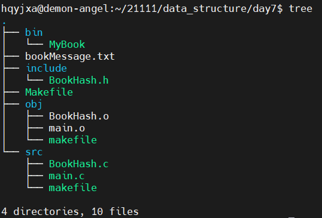

[toc]

# 1 图书管理系统

## 1.1 使用makefile嵌套



### 1.1.1 Makefile

```makefile
CC=gcc
OBJS=main.o BookHash.o
APP=MyBook
CFLAGS=-c -g -Wall

export CC OBJS APP CFLAGS

All:
	make -C ./src/
	make -C ./obj/

.PHONY:clean
clean:
	rm -r ./obj/*.o
	rm -r ./bin/*
```

### 1.1.2 src中的makefile

```makefile
All:$(OBJS)
	mv $^ ../obj/ 
main.o:main.c
	$(CC) $(CFLAGS) $< -o $@
BookHash.o:BookHash.c
	$(CC) $(CFLAGS) $< -o $@
```

### 1.1.3 obj中的makefile

```makefile
All:$(APP)
	mv $^ ../bin/
$(APP):$(OBJS)
	$(CC) $^ -o $@
```

## 1.2 src中的BookHash.c

### 1.2.1 头文件

```c
#include "../include/BookHash.h"
#include <stdio.h>
#include <stdlib.h>
#include <string.h>
```

### 1.2.2 菜单函数

```c
// 菜单函数
void menu()
{
	printf("\t\t------------------------------------\n");
	printf("\t\t|------------图书管理系统----------|\n");
	printf("\t\t|--------------用户操作------------|\n");
	printf("\t\t|----------1、添加图书信息---------|\n");
	printf("\t\t|----------2、删除图书信息---------|\n");
	printf("\t\t|----------3、修改图书信息---------|\n");
	printf("\t\t|----------4、查看图书信息---------|\n");
	printf("\t\t|----------5、退出-----------------|\n");
	printf("\t\t--------------DemonAngel------------\n");
}
```

### 1.2.3 创建一个哈希表

```c
// 创建一个哈希表
int create_hash_book(hash **pp_hash)
{
	if (NULL == pp_hash)
	{
		return NULL_ERROR;
	}
	*pp_hash = (hash *)malloc(sizeof(hash));
	if (NULL == *pp_hash)
	{
		return MALLOC_ERROR;
	}
	memset(*pp_hash, '\0', sizeof(hash));
	return OK;
}
```

### 1.2.4 添加图书信息

```c
// 添加图书信息
int add_new_book_message_to_hash(hash *p_hash, data_type data)
{
	if (NULL == p_hash)
	{
		return CREAT_ERROR;
	}

	// 如何添加一个新图书的信息到哈希表中

	// 创建一个hash_node *类型的指针，并将新图书的信息存储到该数据域中
	hash_node *p_new = (hash_node *)malloc(sizeof(hash_node));
	if (NULL == p_new)
	{
		return MALLOC_ERROR;
	}
	memset(p_new, '\0', sizeof(hash_node));
	p_new->data = data;

	// 通过ID确定存储的哈希表中的数组下标
	int index = data.id - 1;

	// 将hash_node *类型的节点采用头插法插入到hash_arr[下标]对应的链表中
	// 保存p_hash->hash_arr[index]的值到p_new->p_next
	p_new->p_next = p_hash->hash_arr[index];
	// 将p_new保存在p_hash->hash_arr[index]中
	p_hash->hash_arr[index] = p_new;
	// 更新图书数量的变量count的值
	p_hash->count++;
	return OK;
}
```

### 1.2.5 显示图书信息

```c
// 显示图书信息
int show_book_message_from_hash(hash *p_hash)
{
	if (NULL == p_hash)
	{
		return CREAT_ERROR;
	}
	int i;
	// 思考：如何显示哈希表中所有目前在库图书的信息
	// 遍历（通过LastID来确定需要遍历的次数）
	hash_node *p_tmp = NULL;
	for (i = 0; i < p_hash->last_id; i++)
	{
		// 将每一个hash_arr[i]对应的单链表中的员工全部打印
		p_tmp = p_hash->hash_arr[i];
		// 利用p_tmp去遍历所在的单链表，直到遍历完毕
		while (NULL != p_tmp)
		{
			printf("\t----------------------------\n");
			printf("\t|图书名称：%s\n", p_tmp->data.name);
			printf("\t|图书ID：%d\n", p_tmp->data.id);
			printf("\t|图书作者：%s\n", p_tmp->data.author);
			printf("\t|图书出版商：%s\n", p_tmp->data.publisher);
			printf("\t|图书类型：%s\n", p_tmp->data.type);
			printf("\t|图书价格：%.2f\n", p_tmp->data.price);
			printf("\t|图书ISBN号：%ld\n", p_tmp->data.ISBN);
			printf("\t|图书出版年份：%d\n", p_tmp->data.year);
			printf("\t----------------------------\n");

			// 将p_tmp->p_next赋值给p_tmp中
			p_tmp = p_tmp->p_next;
		}
	}
	return OK;
}
```

### 1.2.6 显示部分图书信息

```c
// 显示部分图书信息
int show_section_book_message_from_hash(hash *p_hash, int id)
{
	if (NULL == p_hash)
	{
		return CREAT_ERROR;
	}
	if (id <= 0 || id > p_hash->last_id)
	{
		return ID_ERROR;
	}

	int index = id - 1;
	hash_node *p_tmp = p_hash->hash_arr[index];
	while (NULL != p_tmp)
	{
		if (id == p_tmp->data.id)
		{
			printf("\t----------------------------\n");
			printf("\t|图书名称：%s\n", p_tmp->data.name);
			printf("\t|图书ID：%d\n", p_tmp->data.id);
			printf("\t|图书作者：%s\n", p_tmp->data.author);
			printf("\t|图书出版商：%s\n", p_tmp->data.publisher);
			printf("\t|图书类型：%s\n", p_tmp->data.type);
			printf("\t|图书价格：%.2f\n", p_tmp->data.price);
			printf("\t|图书ISBN号：%ld\n", p_tmp->data.ISBN);
			printf("\t|图书出版年份：%d\n", p_tmp->data.year);
			printf("\t----------------------------\n");
			break;
		}
		else
		{
			p_tmp = p_tmp->p_next;
		}
	}
	return OK;
}
```

### 1.2.7 查看在库的图书的信息

```c
// 查看在库的图书信息
int search_book_message_from_hash(hash *p_hash, int id, data_type *p_data)
{
	if (NULL == p_hash)
	{
		return CREAT_ERROR;
	}
	if (NULL == p_data)
	{
		// 区分一下：ID的值
		// 如果输入的ID等于0的时候，默认查看在库图书的信息
		// 反之则查看指定的员工信息
		if (0 == id)
		{
			// 所有图书的信息
			printf("在库的图书共有%d本\n", p_hash->count);
			show_book_message_from_hash(p_hash);
		}
		else
		{
			// 指定的图书的信息
			printf("id号为%d对应的图书信息为：\n", id);
			show_section_book_message_from_hash(p_hash, id);
		}
	}
	else
	{
		// 保存此时ID对应ID的图书的信息给*p_data
		int index = id - 1;
		hash_node *p_tmp = p_hash->hash_arr[index];
		while (NULL != p_tmp)
		{
			if (id == p_tmp->data.id)
			{
				*p_data = p_tmp->data;
				break;
			}
		}
	}
	return OK;
}
```

### 1.2.8 删除图书信息

```c
// 删除图书信息
int delete_book_message_from_hash(hash *p_hash, int id)
{
	if (NULL == p_hash)
	{
		return CREAT_ERROR;
	}
	if (id <= 0 || id > p_hash->last_id)
	{
		return ID_ERROR;
	}
	// 如何删除图书的信息
	// 通过ID找到该图书所在的单链表，然后将其free掉
	int index = id - 1;
	hash_node *p_pre = p_hash->hash_arr[index];
	hash_node *p_del = p_hash->hash_arr[index];
	// 分类讨论
	// 情况1：当前无冲突，意味着链表中只有一个节点
	// 情况2：当前链表中至少包含两个节点
	if (NULL == p_del->p_next)
	{
		// 情况1
		// 在free之前进行打印被删除图书的信息
		printf("被删除的图书ID:%d的信息为:\n", id);
		show_section_book_message_from_hash(p_hash, id);
		free(p_del);
		p_del = NULL;
		p_hash->hash_arr[index] = NULL;
		p_hash->count--;
	}
	else
	{
		// 情况2：
		while (NULL != p_del)
		{
			if (id == p_del->data.id)
			{
				// 在free之前进行打印被删除图书的信息
				printf("被删除的图书ID:%d的信息为:\n", id);
				show_section_book_message_from_hash(p_hash, id);
				// 先保存pDel->pNext给pPre->pNext
				p_pre->p_next = p_del->p_next;
				free(p_del);
				p_del = NULL;
				// 更新图书数量的变量
				p_hash->count--;
				break;
			}
			// 先将p_del赋值给p_pre
			p_pre = p_del;
			// 然后将p_del->p_next赋值给p_del
			p_del = p_del->p_next;
		}
	}
	return OK;
}
```

### 1.2.9 修改图书信息

```c
// 修改图书信息
int alter_book_message_from_hash(hash *p_hash, data_type data)
{
	if (NULL == p_hash)
	{
		return CREAT_ERROR;
	}
	// 确定数组下标
	int index = data.id - 1;

	hash_node *p_tmp = p_hash->hash_arr[index];
	// 遍历指定的下标为index的单链表，从而找到需要修改的图书(通过ID查找)
	while (NULL != p_tmp)
	{
		if (data.id == p_tmp->data.id)
		{
			p_tmp->data = data;
			break;
		}
		p_tmp = p_tmp->p_next;
	}
	return OK;
}
```

### 1.2.10 销毁哈希表

```c
// 销毁哈希表
int destroy_book_hash(hash **pp_hash)
{
	if (NULL == pp_hash)
	{
		return NULL_ERROR;
	}
	if (NULL == *pp_hash)
	{
		return CREAT_ERROR;
	}
	// 如何销毁哈希表
	// 思想：
	// 1.先释放哈希表中的每一个单链表
	// 2.再释放哈希表
	int i;
	// 先释放每一个单链表
	hash_node *p_del = NULL;
	for (i = 0; i < (*pp_hash)->last_id; i++)
	{
		p_del = (*pp_hash)->hash_arr[i];
		while (NULL != p_del)
		{
			// 采用头删法
			// 保存p_del->p_next到(*pp_hash)->hash_arr[i]中
			(*pp_hash)->hash_arr[i] = p_del->p_next;
			free(p_del);
			p_del = (*pp_hash)->hash_arr[i];
		}
	}
	// 再去释放哈希表结构
	free(*pp_hash);
	*pp_hash = NULL;

	return OK;
}
```

## 1.3 src中的main.c

```c
#include "../include/BookHash.h"
#include <stdio.h>
#include <string.h>
int main(int argc, const char *argv[])
{
	// 定义一个哈希表的指针变量
	hash *p_hash = NULL;
	// 实现创建一张哈希表，并得到这张表的首地址
	int ret = create_hash_book(&p_hash);
	if(ret < 0)
	{
		printf("创建图书的哈希表失败\n");
		return ERROR;
	}
	printf("创建图书的哈希表成功\n");

	// 实现导入图书信息到哈希表中
	// 文件操作：fread/fwrite ---> 属于文件IO(用文件流操作文件)
	// 导入文件中的图书信息 ---> 以只读方式打开文件
	FILE *fr = fopen("bookMessage.txt","r");
	if(NULL == fr)
	{
		perror("导入图书信息失败");
	}
	else
	{
		//定义一个图书信息的变量
		data_type data;
		while(1)
		{
			//以只读方式打开成功
			int num = fread(&data,1,sizeof(data),fr);
			if(0 == num)
			{
				printf("导入图书信息完毕!\n");
				break;
			}
			else
			{
				// 将此时存储图书信息的变量data插入到哈希表中
				add_new_book_message_to_hash(p_hash,data);
				// 更新p_hash->last_id
				p_hash->last_id++;
			}
		}
		//关闭文件
		fclose(fr);
	}
	
	// 定义一个变量，用来存储需要进行的操作
	int op;
	// 定义一个表示图书的变量
	data_type data = {0};
	while(1)
	{
		// 调用菜单函数
		menu();
		printf("请输入想要进行的操作对应的数字:\n");
		scanf("%d",&op);
		if(5 == op)
		{
			printf("图书管理系统退出成功！\n");
			break;
		}
		switch (op)
		{
			case 1:
				{
					// 添加图书信息
					printf("请输入图书的名称:\n");
					scanf("%s",data.name);
					// 图书的编号自动累加
					p_hash->last_id++;
					data.id = p_hash->last_id;
					printf("请输入图书类型\n");
					scanf("%s",data.type);
					printf("请输入图书的作者\n");
					scanf("%s",data.author);
					printf("请输入图书的出版商\n");
					scanf("%s",data.publisher);
					printf("请输入图书的价格\n");
					scanf("%f",&data.price);
					printf("请输入图书的ISBN号\n");
					scanf("%ld",&data.ISBN);
					printf("请输入图书出版年份\n");
					scanf("%d",&data.year);
					// 调用add函数
					ret = add_new_book_message_to_hash(p_hash,data);
					if(ret < 0)
					{
						return ERROR;
					}
					printf("添加图书信息成功！\n");
					break;
				}
			case 2:
				{
					// 删除图书信息
					int id;
					printf("请输入需要删除的图书的ID号\n");
					scanf("%d",&id);
					delete_book_message_from_hash(p_hash,id);
					break;
				}
			case 3:
				{
					// 修改图书信息
					data_type old_data = {0};
					int id;
					printf("请输入需要修改的图书的ID号：\n");
					scanf("%d",&id);
					// 利用search_book_message_from_hash函数实现查找需要修改的
					search_book_message_from_hash(p_hash,id,&old_data);
					printf("请输入需要修改的图书的价格\n");
					scanf("%f",&old_data.price);
					printf("请输入需要修改的图书的名称\n");
					scanf("%s",old_data.name);
					printf("请输入需要修改的图书的出版年份\n");
					scanf("%d",&old_data.year);
					// 实现修改
					ret = alter_book_message_from_hash(p_hash,old_data);
					if(ret < 0)
					{
						printf("修改失败\n");
						break;
					}
					else
					{
						printf("修改成功\n");
					}
					break;
				}
			case 4:
				{
					// 查看图书信息
					printf("请输入需要查看的id,输入0则查看所有在库的图书信息\n");
					int id;
					scanf("%d",&id);
					search_book_message_from_hash(p_hash,id,NULL);
					break;
				}
			default:
				printf("输入的指令有问题!\n");
		}
	}
	//在销毁哈希表之前，将最新的图书信息存储在文件中
	FILE *fw = fopen("bookMessage.txt","w");
	if(NULL == fw)
	{
		perror("保存图书信息失败!\n");
	}
	else
	{
		//保存图书信息到hash表中
		int i;
		hash_node *p_tmp = NULL;
		for(i = 0; i < p_hash->last_id; i++)
		{
			p_tmp = p_hash->hash_arr[i];
			while(NULL != p_tmp)
			{
				int num = fwrite(&p_tmp->data,1,sizeof(p_tmp->data),fw);
				if(0 == num)
				{
					printf("保存最新的图书信息成功!\n");
					break;
				}
				p_tmp = p_tmp->p_next;
			}
		}
		fclose(fw);
	}
	// 销毁哈希表
	destroy_book_hash(&p_hash);
	return OK;
}
```

## 1.4 include中的BookHash.h

```c
#ifndef _BOOKHASH_H_
#define _BOOKHASH_H_

#define SIZE 30

typedef struct
{
	// 图书名称
	char name[24];
	// 作者
	char author[24];
	// 出版商
	char publisher[24];
	// 图书类型
	char type[16];
	// 编号
	unsigned int id;
	// 价格
	float price;
	// 出版年份
	unsigned int year;
	// ISBN号
	unsigned long ISBN;
}data_type;

// 定义一个结构体用来表示单链表中的结点
typedef struct hashNode
{
	// 数据域
	data_type data;
	// 指针域
	struct hashNode *p_next;
}hash_node;

// 定义一个结构体用来表示创建的hash表的结构
typedef struct bookHash
{
	// 定义一个指针数组，数组元素类型为:hash_node *
	hash_node *hash_arr[SIZE];
	// 定义一个变量统计当图书的数量
	int count;
	// 定义一个变量表示当前最后一个图书的ID的变量
	int last_id;
}hash;

enum VALUE
{
	ID_ERROR = -5,
	CREAT_ERROR,
	MALLOC_ERROR,
	NULL_ERROR,
	ERROR,
	OK
};

// 函数声明
// 创建一张哈希表
int create_hash_book(hash **pp_hash);
// 添加图书信息到哈希表对应的位置中
int add_new_book_message_to_hash(hash *p_hash,data_type data);
// 删除图书信息
int delete_book_message_from_hash(hash *p_hash,int id);
// 修改图书信息
int alter_book_message_from_hash(hash *p_hash,data_type data);
// 查找图书信息
int search_book_message_from_hash(hash *p_hash,int id,data_type *p_data);
// 按照类型查看图书信息
int search_book_type_message_from_hash(hash *p_hash,char *type);
// 显示所有图书的信息
int show_book_message_from_hash(hash *p_hash);
// 显示一本书的信息
int show_section_book_message_from_hash(hash *p_hash,int id);
// 销毁图书信息的哈希表
int destroy_book_hash(hash **pp_hash);
// 菜单函数
void menu();


#endif
```