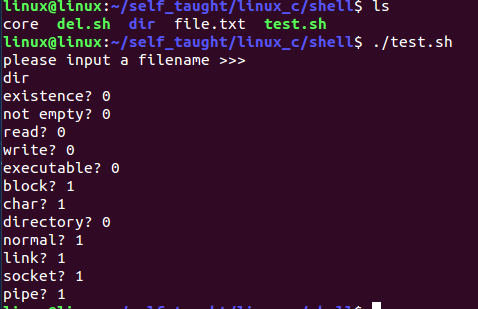

[toc]

# ==**shell中返回0为真，而非0表示为假**==

即0为正确执行，非0表示非正确执行。

# 1 shell概述

shell有两层含义：
既是一种应用程序、又是一种程序设计语言

## 1.1 shell作为应用程序

交互式地解释、执行用户输入的命令，将用户的操作翻译成机器可以识别的语言，完成相应功能称之为==**shell命令解析器**==。

==**shell是用户和Linux内核之间的接口程序**==。用户在提示符下输入的命令都由shell先解释然后传给Linux核心。它调用了系统核心的大部分程序来执行程序、并以并行的方式协调各个程序的运行。

linux系统中提供了好几种不同的shell命令解释器，如sh、ash、bash等。一般默认使用bash作为默认的解释器。


==**shell本质是对内核起到保护作用，只有shell能够识别的命令才能够直接操作内核来控制硬件。**==

## 1.2 shell作为一门语言

shell语言定义了各种变量和参数，并提供了许多在高级语言中才具有的控制结构，包括循环和分支，完成类似于Windows下批处理操作，简化我们对系统的管理于应用程序的部署称之为==**shell脚本**==

shell脚本是**shell命令的有序集合**

shell脚本是一门语言，用户只需使用任意文本编辑器，按照语法编写相应程序，增加可执行权限，即可在安装shell命令解释器的环境下执行。

shell脚本主要用于：
		帮助开发人员或系统管理员将复杂而又反复的操作放在一个文件中，通过简单的一步执行操作完成相应任务，从而解放他们的负担。

## 1.3 shell脚本大体分为两类

### 1.3.1 系统进行调用

这类脚本无需用户调用，系统会在合适的时候调用，如：/etc/profile、~/.bashrc等

```
/etc/profile：此文件为系统的每个用户设置环境信息，当用户第一次登录时，该文件被执行，系统的公共环境变量在这里设置。开始自启动的程序，一般也在这里设置。

~/.bashrc：用户家目录中的.bashrc
		登录时会自动调用，打开任意终端时会自动调用
		这个文件一本设置于个人用户有关的环境变量，如交叉编译器的路径等等。
```

### 1.3.2 用户编写，需要手动调用

编写的脚本都属于此类

无论是系统调用的还是需要自己调用的，其语法规则都一样

# 2 shell语法

## 2.1 shell脚本的定义与执行

shell脚本的代码编写流程：

1. 指定shell脚本文件，一般以`.sh`作为后缀名，也可以不加，例如：test.sh

2. 编写代码

   ```shell
   #!/bin/bash
   
   # #!用于指定当前脚本文件的shell解释器类型，如果不写，则用默认的shell
   
   # shell脚本是shell命令的有序集合，代码的构成就是命令
   
   ls
   pwd
   echo "hello world"
   ```
   
3. 修改文件权限

   ```shell
   # 修改文件权限权限，添加可执行权限
   # 这样操作是同时把文件的可执行权限赋给
   # 用户、用户组、其他用户
   chmod +x test.sh
   
   # 修改文件权限，777是八进制也就是111 111 111，
   # 这样操作是同时把文件的读、写、可执行权限赋给
   # 用户、用户组、其他用户
   chmod 777 test.sh
   ```

   

   

4. 执行脚本文件

   ```shell
   chmod +x test.sh
   chmod 777 test.sh
   ./test.sh	# 需要修改文件的权限		####常用
   
   bash test.sh	# 不需要修改文件的权限  #直接指定使用bash解释test.sh
   . test.sh		# 不需要修改文件的权限	#使用当前shell读取解释test.sh
   ```

三种执行脚本的方式的不同点：

1. `./`和`bash`执行过程基本一致，后者明确指定bash解释器去执行脚本，脚本中#!指定的解释器不起作用，前者首先检测#!，使用#!指定的shell，如果没有使用默认的shell
2. 用`./`和`bash`去执行会在后台启动一个新的shell去执行脚本。
3. 用`. `执行脚本不会启动新的shell，直接由当前的shell去解释执行脚本。

执行结果


## 2.2 变量

### 2.2.1 自定义变量

```shell
#!/bin/bash

# #!用于指定当前脚本文件的shell解释器类型，如果不写，则用默认的shell

# shell脚本是shell命令的有序集合，代码的构成就是命令

# 定义变量
# shell脚本中没有数据类型可言，所以定义变量时不需要加数据类型
# shell脚本中，赋值操作时不能在等号两边加空格

#NUM = 10   #错误

NUM=10

# 引用变量
# $变量名 取一个变量的值
i=$NUM

# 显示变量
echo $NUM
echo $i

# 清除变量
unset NUM
echo "*********************"
echo $NUM

# 使用read从终端读取数据保存在变量中
# read -p "提示信息"
# read -p 默认是没有换行的

# 如果想要换行可以使用read -p "提示信息
#"

read str
#echo -n 不换行
echo "str = $str"

# 使用readonly创建一个只读的变量
readonly n=999
echo "n = $n"

# 指定变量（readonly修饰的变量）初始化后不能再次修改变量的值，只能使用
n=666
echo "n= $n
```

执行结果


#### 2.2.1.1 变量的其他用法

```sh
# 从键盘输入一个字符串赋给变量string
read string

# 定义一个只读变量，只能在定义的时候初始化，以后不能改变，不能被清除
readonly var=100

# 使用export说明的变量，会被导出为环境变量，其他shell也可以使用。但是必须使用 source shell文件名.sh 才可以生效
export var=100
```

### 2.2.2 环境变量

shell在开始执行时就已经定义了一些和系统的工作环境相关的变量，我们在shell中可以直接使用`$name`引用

#### 2.2.2.1 定义

一般在/etc/profile或~/.bashrc文件中（系统自动调用的脚本）使用export设置，允许用户后来更改。

#### 2.2.2.2 显示环境变量

使用**==env==**命令可以查看环境变量


#### 2.2.2.3 清除环境变量

使用unset命令清除环境变量


**设置环境变量**：

1. 临时设置

   ==**在终端执行命令**==

   ```shell
   MYVAL=999
   export MYVAL
   ```

2. 永久设置

   需要在配置文件（/etc/profile或~/.bashrc）中进行设置即可，设置完毕后需要通过==**source**==命令配置文件立即生效。也可以重启计算机

   也可以重新打开一个终端，配置文件会自动加载。

   使用环境变量，一般环境变量类似于C语言中的全局变量，可以在shell脚本文件中任意使用

   ==**在~/.bashrc中添加的环境变量**==

   ```shell
   MYVAL=999
   export MYVAL
   ```

   执行结果

   

   ```shell
   #!/bin/bash
   
   # #!用于指定当前脚本文件的shell解释器类型，如果不写，则用默认的shell
   
   # shell脚本是shell命令的有序集合，代码的构成就是命令
   
   echo "You are welcome to use bash"
   echo "Current work dirctory is $PWD"
   echo "The host name is $HOSTNAME"
   echo "Your home dir $HOME"
   echo "Your shell is $SHELL"
   echo "User env val is $MYVAL"
   ```

   执行结果

   

### 2.2.3 预设变量

| 格式                   | 含义                                                         |
| :--------------------- | :----------------------------------------------------------- |
| `$#`                   | 传给shell脚本参数的数量                                      |
| `$@`                   | 传给shell脚本参数的内容                                      |
| `$*`                   | 传给shell脚本参数的内容                                      |
| `$1、$2、$3、... 、$9` | 运行脚本时传递给其的参数，用==**空格隔开**==位置参数         |
| `$?`                   | 命令执行后返回的状态                                         |
| `"$?"`                 | 用于检查上一个命令执行是否正确，在Linux中，**==命令退出状态为0表示该命令正确执行==**，任何非0值表示命令出错 |
| `$0`                   | 当前执行的进程号                                             |
| `$$`                   | 当前进程的进程号                                             |
| `"$$"`                 | 变量最常见的用途时用作临时文件的名字以保证临时文件不会重复   |

```shell
#!/bin/bash

# #!用于指定当前脚本文件的shell解释器类型，如果不写，则用默认的shell

# shell脚本是shell命令的有序集合，代码的构成就是命令

# 位置变量$0 - $9保存从终端输入的每一个参数
# $是一个特殊字符，想要在终端打印$需要在$前面加上一个反斜杠\，即\$
echo "\$0 = $0"
echo "\$1 = $1"
echo "\$2 = $2"
echo "\$3 = $3"
echo "\$4 = $4"
echo "\$5 = $5"
echo "\$6 = $6"
echo "\$7 = $7"
echo "\$8 = $8"
echo "\$9 = $9"
# 如果超过9，需要加大括号
echo "\$10 = ${10}"

# $#:保存命令行传入的个数，不包括$0
echo "\$# =$#"

# $@或$*:保存所有的命令行传入的参数，但是不包括$0
echo "\$@ =$@"
echo "\$* =$*"

# $$获取当前进程的进程号
echo "\$$ = $$"

# $?返回上一个命令执行的结果，如果执行成功，则$?的值为0,
# 执行失败，则为非0
echo "*****************"
ls
echo "\$? = $?"
echo "******************"

ls sdfghjk
echo "\$? = $?"
```

执行结果


### 2.2.4 脚本变量的特殊用法

| 格式           | 含义                                                         |
| -------------- | :----------------------------------------------------------- |
| `""`（双引号） | 包含的变量会被解释                                           |
| `''`（单引号） | 包含的变量会当作字符串解释                                   |
| ``（反引号）   | 反引号中的内容作为系统命令，并执行其内容，可以替换输出为一个变量 |
| `\`转义字符    | 同c语言中的\n、\t、\r、\a等echo命令需加-e转义                |
| `(命令序列)`   | 由子shell来完成，不影响当前shell中的变量，括号前后加不加空格都不影响，每个命令之间需要加`;`，**最后一个命令可以不写**`;` |
| `{命令序列}`   | 在当前shell中执行，会影响当前变量。注意`'{'`、`'}'`前后有一个空格，**且要在每一个语句后面加**`;` |

```shell
#!/bin/bash

name="zhangsan"
# 双引号里面的特殊字符，会使用其特殊含义
string="Good moring $name"
# 单引号里面的特殊字符，都会失去特殊含义
string2='Good moring $name'

echo $string
echo $string2

# 反引号：获取一个shell命令的输出结果，一般对有输出结果的命令经常去使用，
# 也可以使用$()与反引号等价
echo "Today is date"
echo "Today is `date`"
echo 'Today is `date`'
echo "My dir is $(ls)"

# 转义字符：使用时，需要在echo后面加上-e选项
echo "******************"
echo "this \n is\ta\ntest"
echo -e "this \n is\ta\ntest"
echo "******************"

num=100
# 由子shell来完成，不影响当前shell中的变量
( num=999; echo "1 $num" )
echo 1:$num
# 在当前shell中执行，会影响当前变量
{ num=666; echo "2 $num"; }
echo 2:$num

```

执行结果


## 2.3 算术运算命令--expr

```shell
#!/bin/bash

# read打印提示信息并换行
read -p "请输入两个整数
" NUM1 NUM2

# expr是算术运算命令，必须有的
# 而且expr和变量名和运算符之间必须有空格

ADD=`expr $NUM1 + $NUM2`
# echo是输出语句，默认换行，加-n的参数是不换行的
echo "$NUM1 + $NUM2 = $ADD"

SUB=`expr $NUM1 - $NUM2`
echo "$NUM1 - $NUM2 = $SUB"

# *是一个通配符，需要使用的话，前面需要加上\
MUL=`expr $NUM1 \* $NUM2`
echo "$NUM1 * $NUM2 = $SUB"

DIV=`expr $NUM1 / $NUM2`
echo "$NUM1 / $NUM2 = $DIV"


```

result


## 2.4 条件测试语句

在写shell脚本时，经常遇到的问题就是判断字符串是否相等，可能还要检查文件状态或进行数字测试，只有这些测试完成才能做下一步动作

### 2.4.1 test命令

用于测试字符串、文件状态和数字

#### 2.4.1.1 test命令有两种格式

`test condition`或`[ condition ]`

使用方括号时，要==**注意在条件两边加上空格，同时不需要再使用test**==

#### 2.4.1.2 shell脚本中的条件测试如下

文件测试、字符串测试、数字测试、复合测试

==**测试语句一般与后面讲的条件语句联合使用**==

### 2.4.2 文件测试

1. 按照文件类型

   | 格式      | 含义         |
   | :-------- | :----------- |
   | -e 文件名 | 文件是否存在 |
   | -s 文件名 | 是否为非空   |
   | -b 文件名 | 块设备文件   |
   | -c 文件名 | 字符设备文件 |
   | -d 文件名 | 目录文件     |
   | -f 文件名 | 普通文件     |
   | -L 文件名 | 软链接文件   |
   | -S 文件名 | 套接字文件   |
   | -p 文件名 | 管道文件     |

2. 按照文件权限

   | 格式      | 含义   |
   | :-------- | :----- |
   | -r 文件名 | 可读   |
   | -w 文件名 | 可写   |
   | -x 文件名 | 可执行 |

3. 两个文件之间的比较

   | 格式            | 含义                                                |
   | :-------------- | :-------------------------------------------------- |
   | 文件1 -nt 文件2 | 文件1的修改时间是否比文件2新                        |
   | 文件1 -ot 文件2 | 文件1修改的时间是否比文件2旧                        |
   | 文件1 -ef 文件2 | 两个文件的inode节点号是否一样，用于判断是否是硬链接 |

```shell
#!/bin/bash

echo "please input a filename >>>"
read FILE

test -e $FILE
echo "existence? $?"

test -s $FILE
echo "not empty? $?"
 
[ -r $FILE ]
echo "read? $?"

[ -w $FILE ]
echo "write? $?"

[ -x $FILE ]
echo "executable? $?"

test -b $FILE
echo "block? $?"

test -c $FILE
echo "char? $?"

test -d $FILE
echo "directory? $?"

test -f $FILE
echo "normal? $?"

# -L要大写
test -L $FILE
echo "link? $?"

# -S要大写
test -S $FILE
echo "socket? $?"

test -p $FILE
echo "pipe? $?"
```

执行结果



### 2.4.3 字符串测试

```
s1 = s2			测试两个字符串的内容是否完全一样
s1 != s2		测试两个字符串的内容跟是否有差异
-z s1			测字符串的长度是否为0
-n s1			测试字符串的长度是否不为0
```

```shell
#!/bin/bash

test "hello" = "hello"
echo "相等？ $?"

test "hello" = "hella"
echo "相等？ $?"

test "hello" != "hello"
echo "不相等？ $?"

test "hello" != "hella"
echo "不相等？ $?"

test -z "hello"
echo "长度是否为0？ $?"

test -n "hella"
echo "长度是否不为0？ $?"
```

执行结果


### 2.4.4 数字测试

| 格式      | shell比较符 | 英文单词      | 含义               |
| --------- | :---------- | :------------ | :----------------- |
| `a -eq b` | `-eq`       | equale        | 测试a和b是否相等   |
| `a -ne b` | `-ne`       | not equal     | 测试a和b是否不等于 |
| `a -gt b` | `-gt`       | greater than  | 测试a是否大于b     |
| `a -ge b` | `-ge`       | greater equal | 测试a是否大于等于b |
| `a -lt b` | `-lt`       | less than     | 测试a是否小于b     |
| `a -le b` | `-le`       | less equal    | 测试a是否小于等于b |

```shell
#!/bin/bash

# echo "please input two number >>>"
# 在运行的时候输入参数即可
NUM1=$1
NUM2=$2

[ $NUM1 -eq $NUM2 ]
echo "相等？ $?"

[ $NUM1 -ne $NUM2 ]
echo "不相等？ $?"

[ $NUM1 -gt $NUM2 ]
echo "大于？ $?"

[ $NUM1 -ge $NUM2 ]
echo "大于等于？ $?"

[ $NUM1 -lt $NUM2 ]
echo "小于？ $?"

[ $NUM1 -le $NUM2 ]
echo "小于等于？ $?"
```

执行结果


### 2.4.5 复合测试

1. 命令执行控制

   &&：

   `command1 && command2`

   ==**&&左边命令（command1）执行成功（即返回0）shell才会执行&&右边的命令（command2）**==

   ||：

   `command1 || command2`

   ==**||左边命令（command1）未执行成功（即返回非0）shell才执行||右边的命令（command2）**==

2. 多重条件判定

   | 命令 | 含义                                                         |
   | :--- | :----------------------------------------------------------- |
   | -a   | (and)两种状况同时成立！<br />`test -r file -a -x file`<br />file同时具有r与x权限时，才为true |
   | -o   | (or)两种状况任何一个成立！<br />`test -r file -o -x file`<br />file具有r或x权限时，就传回true |
   | !    | 相反状态<br />`test ! -x file`<br />当file不具有x(可执行权限)时，回传true |

```shell
#!/bin/bash

NUM=100

# 判断0 <= NUM <= 200
# test $NUM -ge 0 && test $NUM -le 200
test $NUM -ge 0 -a $NUM -le 200
echo "$?"

# 判断NUM <= 0 或者 NUM >= 200
test $NUM -le 0 || test $NUM -ge 200
echo "$?"

file="file.txt"

# 判断文件是否不是普通文件
test ! -f $file
echo "$?"

# 判断文件是否存在并且是否是目录文件
test -e $file && test -d $file
echo "$?"
```

执行结果


## 2.5 控制语句

### 2.5.1 if语句

1. 格式1

   ```shell
   if [ 条件1 ];then
   	执行第一段程序
   else
   	执行第二段程序
   fi
   
   # 或者
   if [ 条件1 ]
   then
   	执行第一段程序
   else
   	执行第二段程序
   fi
   ```

2. 格式2

   ```shell
   # if和[]之间也要有空格，不然会报错，即if [ 条件1 ]
   if [ 条件1 ];then
   	执行第一段程序
   elif [ 条件2 ];then
   	执行第二段程序
   else
   	执行第三段程序
   fi
   
   # 或者
   if [ 条件1 ]
   then
   	执行第一段程序
   elif [ 条件2 ]
   then
   	执行第二段程序
   else
   	执行第三段程序
   fi
   ```

```shell
#!/bin/bash

echo "please input a number >>>"
read NUM

# 注意：赋值时，等号两边不能加空格
# 		[]里面存放表达式时两边都必须加空格
# 		if和[]之间也必须有空格即if [ 条件 ]


# 一般形式--1
if [ $NUM -gt 50 ];then
	echo "NUM > 50"
fi

# 或者
echo "****************"
if [ $NUM -gt 50 ]
then
	echo "NUM > 50"
fi


if [ $NUM -gt 50 ]
then
	echo "NUM > 50"
else
	echo "NUM <= 50"
fi


echo "***********************"

# 阶梯形式
if [ $NUM -gt 50 ]
then
	echo "NUM > 50"
elif [ $NUM -lt 50 ]
then
	echo "NUM < 50"
else
	echo "NUM = 50"
fi

echo "**********************"

# 嵌套形式
if [ $NUM -gt 50 ]
then
	echo "NUM > 50"
elif [ $NUM -eq 50 ]
then
	echo "NUM = 50"
else
	echo "NUM < 50"
	if [ $NUM -gt 30 ]
	then
		echo "NUM > 30"
	else
		echo "NUM <= 30"
	fi
fi
```

执行结果


### 2.5.2 case语句

格式

```shell
case $变量名称 in
	"第一个变量的内容")
		程序段一
		;;
	"第二个变量的内容")
		程序段二
		;;
	"第三个变量的内容")
		程序段三
		;;
	*)
		echo "error please try anain!"
		;;
esac
```

```shell
#!/bin/bash


echo "this script will print your choice"
# 需要在运行的时候直接输入one two three 或者其他
# 在本案例中"$1"中的""可以省略，即$1
case "$1" in
	"one")
		echo "your choice is one"
		;;
	"two")
		echo "yuor choice is two"
		;;
	"three")
		echo "your choice is three"
		;;
	*)
		echo "error please try anain!"
		;;
esac

echo "hello world"
```

执行结果


==**注意**==：shell语言中`;;`不能省略，虽然相当于C语言中switch--case语句中的break，但是跟break还是有不同的，C语言中switch--case语句中省略break表示执行下面的语句，直到遇到break或者default结束，但是shell语言`;;`没有这个效果。如果要实现C语言中类似省略break可以使用`|`操作符实现。case中的最后一个`;;`是可以省略的

```shell
#!/bin/bash


echo "please input your choice"
read choice

case "$choice" in
	# |操作符两边可以不用加空格，但是加空格也不影响
	# |操作符实现了类似于C语言中switch---case语句中省略break的效果
	Y | yes | YES | Yes)
		echo "it's all right"
		;;
	# *是一个通配符，可以匹配任意字符并且数量不限
	# N* 只要是N开头的，都会执行下面的命令
	N* | n*)
		echo "it's wrong"
		;;
	*)
		exit 1
	# 最后一个双分号行可以省略
esac
```

执行结果


### 2.5.3 for语句

1. 类似c语言的for循环

   ```shell
   for ((初始值; 限制值; 执行步阶))
   do
   	程序段
   done
   ```

   初始值：变量在循环中的起始值

   限制值：当变量值在这个限制范围内时，就继续进行循环

   执行步阶：每作一次循环时，变量的变化量

   

   ```shell
   #!/bin/bash
   
   # 声明sum是一个整型变量，准备保存整数
   #declare -i sum
   typeset -i sum
   
   for ((i=1; i<=100; i++))
   do 
   	sum=sum+i
   done
   
   echo "the reault is $sum"
   ```

   result

   

   注意：

   declare是bash的一个内建命令，可以用来声明shell变量、设置变量的属性。declare也可以使用typeset。

   `declare -i sum`		代表强制把sum变量当作int型参数运算

2. 带列表的for循环

   ```shell
   for var in con1 con2 con3 ...
   do
   	程序段
   done
   ```

   第一次循环时，$var的内容是con1

   第二次循环时，$var的内容是con2

   第三次循环时，$var的内容是con3

   ...

   当in后面所有的值都赋值完毕并执行命令后，循环结束

   ==**con可以是不同的类型，可以是整数、小数、字符串**==
   
   ```shell
   #!/bin/bash
   
   # 注意：for循环后的变量之前不能加$
   for i in 1 2 3 4 5 6 7 8 9
   do
   	echo $i
   done
   ```

   result
   
   
   
   ==**列表也可以是`{1..10}`，也可以`{1..10..2}`**==
   
   ```shell
   #!/bin/bash
   # 带列表的for循环
   # 代表从1～10步长为1
   #for I in {1..10}
   # 代表从1～10步长为2
   for I in {1..10..2}
   do 
   	echo $I
   done
   
   ```
   
   result
   
   
   
3. 不带列表的for循环

   ==**命令行参数给**==

   ```shell
   #!/bin/bash
   
   # 不带列表的for循环
   
   for I
   do 
   	echo $I
   done
   ```

   result

   

### 2.5.4 while语句

格式

```shell
while [ condition ]
do
	程序段
done
```

当condition成立的时候进入while循环，直到condition不成立才退出循环。

```shell
#!/bin/bash

declare -i i
declare -i sum

while [ "$i" != "101" ]
do
	# 后面的;可以省略，其他的都不能省略
	sum+=i;
	i=i+1;
done

echo "the result is $sum"
```

result


### 2.5.5 until语句

```shell
until [ condition ]
do
	程序段
done
```

这种形式与==**while恰恰相反**==，当condition成立的时候退出循环，否则继续循环

```shell
#!/bin/bash


declare -i i
declare -i sum

# until循环，是循环条件不成立，执行程序段，如果条件为真，则循环结束

until [ "$i" = "101" ]
do
	sum+=i;
	i=i+1;
done

echo "the result is $sum"
```

result


### 2.5.6 break、continue

#### 2.5.6.1 break

==break命令允许跳出循环==

break通常在一些处理后退出循环或case语句

#### 2.5.6.2 continue

continue命令类似于break命令

==**只有一点重要差别，它不会跳出循环，只是跳过这个循环步骤**==

***break:***

`break 2`可以跳出两层循环

```shell
#!/bin/bash


for ((num=1; num<=10; num++))
do
	if [ $num -eq 5 ]
	then
		# break退出整个循环
		break

		# continue退出本层循环，
		# 当执行到continue的位置时，循环下方的代码不在执行
		# 但是接着下个循环继续执行

		#continue

	fi
	echo "num = $num"
done
```

result


***continue:***

```shell
#!/bin/bash


for ((num=1; num<=10; num++))
do
	if [ $num -eq 5 ]
	then
		# break退出整个循环
		#break

		# continue退出本层循环，
		# 当执行到continue的位置时，循环下方的代码不在执行
		# 但是接着下个循环继续执行

		continue

	fi
	echo "num = $num"
done
```

result


## 2.6 控制语句案例

案例1

```shell
#!/bin/bash
# 判断文件是否存在，不存在则创建
if [ ! -d $HOME/backup ]
then
	mkdir $HOME/backup
fi

# flist的值是ls的执行结果，即当前目录下的文件名
flist=`ls`

for file in $flist
do
	# 命令行上有一个参数时
	if [ $# = 1 ]
	then 
		if [ $1 = $file ]
		then
			echo "$file found";
			exit
		fi
	else		# 命令行上不带参数时
		cp $file $HOME/backup
		echo "$file copied"
	fi
done
echo ***Backup Completed***
```

result


案例2

```shell
#!/bin/bash

for DIR in $HOME/file-dir $HOME/dir-dir 
do
	if [ -d $DIR ]
	then
		# 文件夹存在
		read OP
		case $OP in
			Y*|y*)
				rm -r $DIR
				mkdir $DIR
				;;
			N*|n*)
				echo "不删除"
				;;
		esac
	else
		# 文件夹不存在
		mkdir $DIR
	fi
done


echo "请输入一个路径"
read FILEPATH

for file in `ls $FILEPATH`
do
	if [ -d $FILEPATH/$file ]
	then
		cp -r $FILEPATH/$file $HOME/dir-dir
	elif [ -f $FILEPATH/$file ]
	then
		cp $FILEPATH/$file $HOME/file-dir
	fi
done
```

result


## 2.7 函数

有些脚本段间互相重复，如果能只写一次代码块而在任何地方都能引用那就提高了代码的可重用性。

shell允许将==**一组命令集**==或者==**语句**==形成==**一个可用块**==，这些块称为==**shell函数**==。

### 2.7.1 函数的定义和调用

函数定义有两种形式

1. 格式1

   ```shell
   函数名()
   {
   	命令...
   }
   ```

2. 格式2

   ```shell
   function 函数名()
   {
   	命令...
   }
   ```

函数可以放在同一个文件中作为一段代码，也可以放在只包含函数的单独文件中。所有==**函数在使用前必须定义**==，必须将==**函数放在脚本开始部分**==，直至shell解释器==**首次发现它**==时，才可以使用。

#### 2.7.1.1 调用函数的格式为

函数名 param1 param2......

```shell
#!/bin/bash


# 定义一个函数
# shell没有主函数，
# 所以一般函数的都需要定义在整个代码的最上边，下方对其进行调用

# 函数名和()之间可以有空格，也可以没有空格
# 格式1
myfunction ()
{
	echo "hello world"
	echo "xi'an"
}

# 格式2
# 函数名和()之间可以有空格，也可以没有空格
function myfun ()
{
	echo "good moring"
}

myfun
myfun
myfunction
myfunction
myfunction
```

result


### 2.7.2 函数传参

使用参数同在一般脚本中使用特殊变量

```shell
#!/bin/bash

myadd()
{
	# shell函数传参
	# shellh函数中想要传参，不能在函数名后的括号里面定义
	# 而是使用$1 $2 ...保存外部传入的值

	A=$1
	B=$2
	SUM=`expr $A + $B`
	echo "$A + $B = $SUM"
}

# 带参数的shell函数的调用
myadd 100 200


num1=666
num2=777

myadd $num1 $num2
```

result


### 2.7.3 函数返回值

函数可以使用return提前结束并带回返回值

```
return	从函数中返回，用最后的状态命令决定返回值
return 0	无错误返回
return 1	有错误返回
```

```shell
#!/bin/bash

myadd()
{
	A=$1
	B=$2

	SUM=`expr $A + $B`
	return $SUM
}

myadd 10 20
# 函数的返回值一般通过$?可以获取到，但是$?获取到的最大值是255，
# 如果超过这个值会出错
echo "$?"


myadd 100 200
#echo "$?"
# 在shell中，除了()中定义的变量，只要不做任何修饰，
# 都可以认为是全局变量，可以在任何一个位置调用

echo "SUM = $SUM"

```

result


