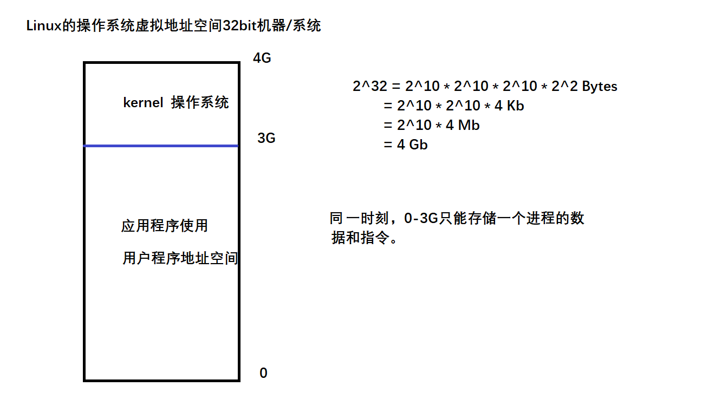
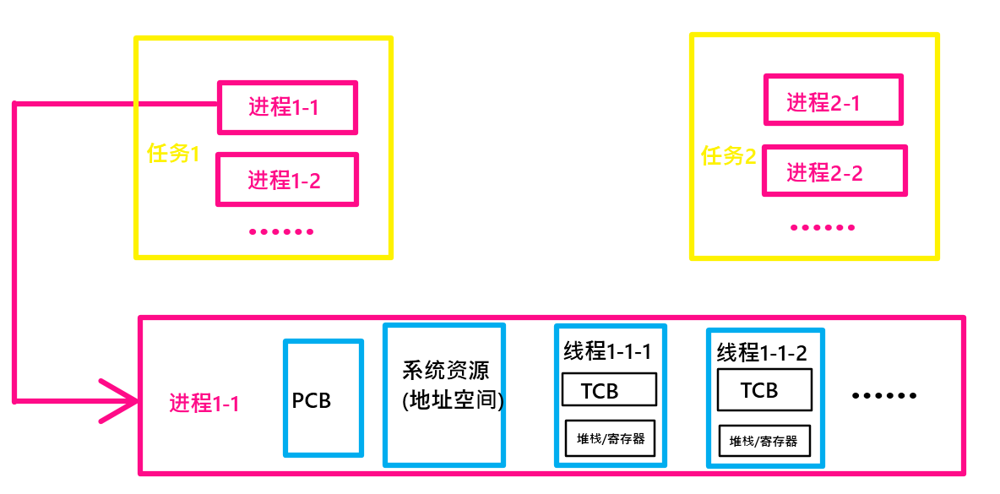

[toc]

# 1 linux下的并发技术

## 1.1 什么是并发

多个任务可以同时运行。

任务：可以理解为一个应用程序。

## 1.2 如何实现多个应用程序同时运行

1. 程序是如何运行的

   程序：编译生成的可执行文件(是一个死的东西，是存储在计算机外存上的(磁盘，U盘等外部存储设备))

   ==**计算机是如何执行可执行程序的：**==

   a.out加载到内存中，通过总线加载到CPU中执行。

2. 通过对操作系统工作原理的分析，得知操作系统只有一份虚拟地址空间，而操作系统在加载应用程序时，同一时刻只能有一个应用程序的数据和代码暂时存储于虚拟地址空间中

   

3. 要想实现多个应用程序同时运行，需要多个应用程序分时共享地址空间和CPU，只要切换的时间较短，用户是感觉不到的，这就变相实现了多个应用程序同时运行，也就实现了并发。

# 2 Linux是如何实现多任务的

Linux内核提供了任务管理模块，任务管理模块支持多个任务同时运行。Linux实现多任务的技术有两种，分别是：多进程和多线程。

# 3 应用程序、任务、进程、线程的区别

## 3.1 应用程序

编译生成的可执行文件，别称为(任务)。

多任务处理是指用户可以在同一时间内运行多个应用程序，每个应用程序被称作一个***任务***

**一个应用程序可以是单进程/多进程，一个应用程序也可以是单进程多线程的**

| 比较项     | 程序(任务)                                            | 进程                         | 线程                         |
| :--------- | :---------------------------------------------------- | :--------------------------- | :--------------------------- |
| 存储位置   | 磁盘                                                  | 内存                         | 内存(进程地址空间内)         |
| 有没有状态 | 死东西，没有状态的概念，但是有运行概念                | 是动态的，有调度概念，有状态 | 是动态的，有调度概念，有状态 |
| 包含关系   | 任务（n个进程，进程包含m个线程）<br />m、n都大于等于1 |                              |                              |

## 3.2 进程

一个具有独立功能的程序在某个数据集上的一次动态执行过程，是操作系统进行资源分配和调度的基本单元。一次任务的运行可以并发激活多个进程，这些进程相互合作来完成该任务的一个最终目标。简略地说：进程是程序地一次动态执行过程，(仅限于单进程程序。要是多进程的程序就不能这么说了。)

**==进程是操作系统进行资源分配的最小单位。==**

**==操作系统调度的最小单元是线程。==**

## 3.3 任务

任务是一个逻辑概念，指有一个软件完成的活动，或者是一系列共同达到某一目的的操作。通常一个任务是一个程序的一次运行，一个任务包含一个或多个完成独立功能的子任务，这个独立的子任务就是进程或者线程。

```
例如：一个杀毒软件的一次运行是一个任务，目的是从各种病毒的侵害中保护计算机系统，
	这个任务包含多个独立功能的子任务(进程或线程)，
	包括实时监控功能，定时查杀功能，防火墙功能以及用户交互功能等
```

### 3.3.1 任务、进程、线程之间的关系



## 3.4 资源

1. 虚拟地址空间的使用权
2. CPU的使用权

## 3.5 调度的基本单元

进程是通过CPU调度来实现管理的。