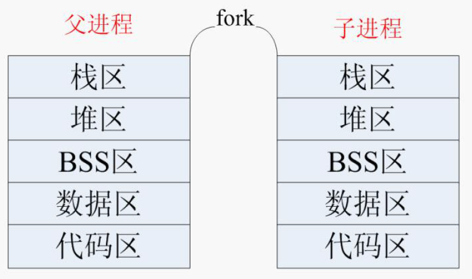

[toc]

# 1 进程的概述

## 1.1 进程的定义

### 1.1.1 程序

程序是存放在存储介质上的一个可执行文件。

### 1.1.2 进程

进程是程序的执行实例，包括程序计数器、寄存器和变量的当前值。

### 1.1.3 进程和程序的区别

程序：是静态的，存放在磁盘的可执行文件

进程：是动态的，是运行在内存中的程序的执行实例

**程序是一些指令的有序集合，而进程是程序执行的过程，进程是程序的一次执行过程。**

**进程的状态是变化的，其包括进程的创建、调度和消亡。**

**只要程序运行，此时就是进程，程序每运行一次，就会创建一个进程。**

在Linux系统中，==**进程**==是管理事务的基本单元。

进程拥有自己独立的处理环境和系统资源（处理器、存储器、IO设备、数据、程序）

可使用exec函数由内核将程序读入内存，使其执行起来成为一个进程。

## 1.2 进程的特点

1. 并发性：指的是操作系统中多个进程可以同时并发执行，相互之间不受到干扰
2. 动态性：指的是进程都有完整的生命周期，而且在进程的生命周期内，进程的状态是不断变化的。另外，进程具有动态的地址空间(包括代码、数据和进程控制块等)
3. 交互性：指的是进程在执行的过程中，可能会与其他进程发生直接或间接的交互操作，如同步与互斥的处理。
4. 独立性：指的是进程是一个相对完整的资源分配和调度的基本单元，各个进程的地址空间是相互独立的，只有采用某些特定的通信机制才能实现进程间的通信。
5. 异步性：指的是每个进程都按照各自独立的，不可预知的速度向前执行。	

## 1.3 进程的分类

1. 交互式进程

   这类进程经常与用户进行交互，因此要花很多时间等待用户的交互操作(键盘和鼠标操作等)。当接收到用户的交互操作后，这类进程应该很快被运行，而且响应时间的变化也应该很小，否则用户就会觉得系统反应迟钝或不太稳定。典型的交互式进程有shell命令进程、文本编辑器和图形应用程序运行等。

2. 批处理进程

   这类进程不必与用户进行交互，因此经常在后台运行。因为这类进程通常不必很快地响应，因此往往受到调度器地“慢待”。典型的批处理进程有编译器的编译操作、数据库搜索引擎等。

3. 实时进程

   这类进程通常对调度响应时间有很高的要求，一般不会被低优先级的进程阻塞。它们不仅要求很短的响应时间，而且更重要的是响应时间的变化应该很小。典型的实时进程有视频和音频应用程序、实时数据采集系统程序等。

## 1.4 进程状态的转换

### 1.4.1 进程的状态

1. 运行态(就绪态)：可执行程序执行以后/fork(),进程将会被加入到等待队列。此时的进程的状态就是运行态的就绪态。

2. 运行态：等待队列中的进程，获得了CPU和内存的使用权后，步入指令的执行过程。

3. 阻塞态：当进程在运行态时，发现，进程需要某个资源，结果这个资源还没有准备好，让出CPU和内存资源则进入阻塞态，去等待资源的到来或者等待信号唤醒。

   ==**可中断的阻塞态**==：可以被信号或其他中断唤醒的状态。

   进程处于阻塞(睡眠)状态，正在等待某些事件发生或能够占用某些资源。处在这种状态下的进程可以被信号中断。接收到信号或者被显式地唤醒呼叫(如调用wake_up系列宏：wake_up、wake_up_interruptible等)唤醒后，进程将转变为TASK_RUNNING状态。

   ==**不可中断的阻塞态**==：不能被除资源准备好的其他信号或中断唤醒的状态。

   此进程状态类似于可中断的阻塞状态(TASK_INTERRUPTIBLE)，只是它不会处理信号，把信号传递到这种状态下的进程不能改变它的状态。在一些特定的情况下(进程必须等待，直到某些不能被中断的事件发生)，这种状态是很有用的。只有在它所等待的事件发生时，进程才被显式地唤醒呼叫唤醒。

4. 停止态：当收到SIGSTOP信号时，进入停止态(可以唤醒，但是一般很少去唤醒了)。进程的执行被暂停，当进程收到SIGSTOP、SIGSTP、SIGTIN、SIGTOUT等信号，就会进入暂停状态。

5. 僵尸态：子进程先于父进程退出，且父进程没有回收子进程的资源

6. 消亡态：进程退出，资源被释放

### 1.4.2 进程状态的转换关系


## 1.5 进程的调度机制

### 1.5.1 linux下的进程调度算法

1. 基于时间片的轮转的公平调度算法

   划分时间片，所有进程的时间片相同，先到先得

2. 基于优先级的抢占式调度算法

   给所有进程划分优先级，高优先级的进程可以抢占低优先级进程的资源

**注意：linux的调度策略是两者的结合，可以通过nice命令来修改进程的优先级，也可以通过renice命令来修改进程的优先级。**

==**时间片轮转调度，上下文切换。**==

### 1.5.2 进程间是如何切换的

需要进程的上下文切换，进程上下文切换是非常浪费资源和时间的。

随着多核CPU的诞生，设计一套不需要进程上下文切换的手段，就可以实现真正意义上的并发。设计出来的技术称之为多线程技术。

多进程不是说一个进程执行完毕之后再执行另一个进程，而是交替进行的，一个进程执行一段时间（时间很短，所以用户会以为是同时进行的），然后下一个进程再执行一段时间，所有进程执行完之后再回到第一个进程继续执行，以此类推。（多线程技术）


## 1.6 进程三个状态的转换关系


## 1.7 进程控制块

进程控制块就是用于保存进程信息的结构体，又称之为PCB。

OS是根据PCB来对并发执行的进程进行控制和管理的。系统在创建一个进程的时候会开辟一段内存空间存放与此进程相关的PCB数据结构。PCB是操作系统中最重要的记录型数据结构。PCB中记录了用于描述进程进展情况及控制进程运行所需的全部信息。

PCB是进程存在的唯一标志，在linux中PCB存放在task_struct结构体中。

task_struct结构体保存在：


### 1.7.1 PCB结构体中的部分数据

#### 1.7.1.1 调度数据

进程的状态、标志、优先级、调度策略等。

#### 1.7.1.2 时间数据

创建该进程的时间、在用户态的运行时间、在内核态的运行时间等。

#### 1.7.1.3 文件系统数据

umask掩码、文件描述符表等。

内存数据、进程上下文，进程标识（进程号）

# 2 进程控制

## 2.1 进程组、会话组、终端

[终端](../01_Clanguage/11_linux命令.md)

每打开一个终端，就会启动一个bash(shell解释器)，就会产生一个新的会话，而这个终端中的bash或者真终端启动程序就是该会话组的组长（SID）PID = PGID = SID

==**一个会话组有多个进程组，一个进程组有多个进程**==

## 2.2 进程号

每个进程都由一个进程号来标识，其类型为pid_t，进程号的范围：0~65535

进程号是由操作系统随机给当前进程分配的，不能自己控制。

进程号总是唯一的，但进程号可以重用。当一个进程终止后，其进程号就可以再次使用了。

在Ubuntu中查看当前系统中所有的开启的进程

```bash
ps ajx
```


### 2.2.1 PPID

当前进程的父进程的进程号

任何进程（除了init进程）都是由另一个进程创建，该进程称为被创建进程的父进程，对应的进程号称为父进程号（PPID）

### 2.2.2 PID

当前进程的进程号

标识进程的一个非负整型数。0 ~ 65535

### 2.2.3 PGID

当前进程所在组的进程组ID

进程组是一个或多个进程的集合，他们之间相互关联，进程组可以接收同一终端的各种信号，关联的进程有一个进程组号（PGID）。

### 2.2.4 COMMAND

当前进程的名字

### 2.2.5 特殊的进程号

- 在linux系统中进程号由0开始。

- 进程号为0及1的进程由内核创建。

- 进程号为0的进程通常是调度进程，常被称为交换进程（swapper）

- 进程号为1的进程通常是init进程，init进程是所有进程的祖先。

- 除调度进程外，在linux下面所有的进程都是由进程init进程直接或者间接创建。


Linux操作系统提供了三个获得进程号的函数getpid()、getppid()、getpgid()

```c
// 头文件
#include <sys/types.h>
#include <unistd.h>

// 函数格式
pid_t getpid(void);
// 功能：获取当前进程的进程号

// 函数格式
pid_t gitppid(void);
// 功能：获取当前进程的父进程的进程号

// 函数格式
pid_t getpgid(pid_t pid);
// 功能：获取当前进程所在进程组的id
// 参数为0时返回当前的PGID,否则返回参数指定的进程的PGID
```

```c
#include <stdio.h>
#include <sys/types.h>
#include <unistd.h>

int main(int argc, const char *argv[])
{
    // 获取当前进程的进程号
	printf("pid = %d\n",getpid());

	// 获取当前进程的父进程的id
	printf("ppid = %d\n",getppid());

	// 获取当前进程所在组的id
	printf("pgid = %d\n",getpgid(getpid()));

	while(1)
	{

	}

 	return 0;
}
```

result


使用`ps ajx`查询的结果


## 2.3 进程的创建

### 2.3.1 完美拷贝、写时拷贝

1. 完美拷贝

   几乎拷贝父进程的所有内容，除了父进程PCB(进程控制单元的部分数据)。PPID，PID，等一些进程私有的，牵扯调度和识别的一些数据。如果父进程数据和代码较多时，而子进程几乎用不上父进程的这些数据，此时完美拷贝就很浪费时间和资源。==**fork()是完美拷贝**==

2. 写时拷贝

   和父进程共享数据，只有子进程需要更改父进程的数据时，此时为了避免影响父进程的数据。则需要拷贝一份，防止影响父进程。这个过程称之为写时拷贝。==**vfork()是写时拷贝**==

在linux环境下，创建进程的主要方法是调用fork函数和vfork函数

### 2.3.2 创建子进程 - fork函数

```c
/* 头文件 */
#include <unistd.h>

/* 函数定义 */
pid_t fork(void);
/*
 * 功能：在已有的进程基础上又创建一个子进程，新进程被称为子进程，原进程称为父进程
 * 参数：无
 * 返回值：
 *      成功：
 *          >0      子进程的进程号，标识父进程的代码区
 *          0       子进程的代码区
 *      失败：
 *          -1      返回给父进程，子进程不会创建
 */
/* 注意：fork()后，父子进程的执行顺序不一定 */
```


==**使用fork函数得到的子进程是父进程的一个复制品，它从父进程处继承了整个进程的地址空间。也就是说fork函数是完美拷贝**==

**地址空间：**

包括进程上下文，进程堆栈、打开的文件描述符、信号控制设定、进程的优先级、进程组号等。

子进程所独有的只有它的进程号、计时器等。因此，使用fork函数的代价是很大的。

**fork函数执行完毕之后父子进程的空间示意图**：



#### 2.3.2.1 不区分父子进程

==**不推荐**==

```c
#include <stdio.h>
#include <stdlib.h>
#include <unistd.h>

int main(int argc, const char *argv[])
{

	/* 通过fork函数创建一个子进程 */
	/* 注意：只要执行一次fork,就会在原有的基础上创建一个新的子进程 */
	/* 而且如果fork之后不区分父子进程的代码区，则后面所有的代码都会执行 */
	
	fork();
	printf("hello world\n");

	while(1)
	{

	}

 	return 0;
}
```

result


#### 2.3.2.2 区分父子进程

```c
#include <stdio.h>
#include <stdlib.h>
#include <unistd.h>

int main(int argc, const char *argv[])
{
	/* 通过fork函数的返回值来区分父子进程的独立的代码区 */
	/* 父子进程是来回交替执行的，谁先运行，谁后运行是不确定的， */
	/* 不要认为父进程执行完之后才执行子进程。 */

	pid_t pid;

	pid = fork();
	if(pid < 0)
	{
		perror("fail to fork");
		return -1;
	}
	else if(pid > 0)
	{
		while(1)
		{
			printf("parent: pid = %d,ppid = %d\n",getpid(),getppid());
			printf("pid = %d\n",pid);
			printf("this is a parent process\n");
			sleep(1);
			printf("********************\n");
		}
	}
	else
	{
		while(1)
		{
			printf("son: pid = %d,ppid = %d\n",getpid(),getppid());
			printf("pid = %d\n",pid);
			printf("this is a son process\n");
			sleep(1);
			printf("__________________\n");
		}
	}

 	return 0;
}
```

result


#### 2.3.2.3 父子进程拥有独立的地址空间

```c
#include <stdio.h>
#include <stdlib.h>
#include <unistd.h>

/* 定义一个全局变量 */
int a = 666;
int main(int argc, const char *argv[])
{
	pid_t pid;
	/* 定义一个静态局部变量 */
	static int b = 777;
	
	int c = 888;

	/* 子进程会复制父进程fork之前的所有内容 */
	/* 但是fork之后，父子进程完全独立，所以不管双方怎么改变 */
	/* （堆区、栈区、数据区的等）都不会受对方的影响 */
	
	pid = fork();
	if(pid < 0)
	{
		perror("fail to fork");
		return -1;
	}
    /* 父进程的代码区 */
	else if(pid > 0)
	{
		printf("this is parent process\n");
		a++;
		b++;
		c++;
		printf("a = %d,b = %d,c = %d\n",a,b,c);
	}
    /* 子进程的代码区 */
	else
	{
		sleep(1);	
		printf("this is son process\n");
		printf("a = %d,b = %d,c = %d\n",a,b,c);
	}

	while(1)
	{

	}

 	return 0;
}
```

result


父进程对变量所做的改变并不影响子进程中该变量的值，说明父子进程各自拥有自己的地址空间。

一般来说，==**在fork之后是父进程先执行还是子进程执行是不确定的**==，这取决于内核所使用的调度算法。如要求父子进程之间相互同步，则要求某种形式的进程间通信。

#### 2.3.2.4 子进程继承父进程的空间

```c
#include <stdio.h>
#include <stdlib.h>
#include <unistd.h>
#include <sys/types.h>
#include <sys/stat.h>
#include <fcntl.h>

int main(int argc, const char *argv[])
{
	int fd;
	if(-1 == (fd = open("file.txt",O_RDONLY)))
	{
		perror("fail to open\n");
		return -1;
	}

	// 子进程会继承父进程的一些公有的区域，比如磁盘空间、内核空间
	// 文件描述符的偏移量保存在内核空间中，所以父进程改变偏移量，
	// 则子进程获取的偏移量是改变之后的
	pid_t pid;
	pid = fork();
	if(pid < 0)
	{
		perror("fail to fork");
		return -1;
	}
	else if(pid > 0) 	// 父进程的代码区
	{
		printf("this is parent process\n");

		char buf[32] = "";
		if(-1 == read(fd,buf,30))
		{
			perror("fail to read");
			return -1;
		}

		printf("buf = [%s]\n",buf);
	}
	else 				// 子进程的代码区
	{
		// 使用sleep等待1秒，等待父进程完毕之后运行子进程
		sleep(1);	
		printf("this is son process\n");
		char buf[32] = "";
		if(-1 == read(fd,buf,30))
		{
			perror("fail to read");
			return -1;
		}

		printf("buf = [%s]\n",buf);


	}

	while(1)
	{

	}

	return 0;
}
```

result


#### 2.3.2.5 子进程继承父进程的[缓冲区](../02_IO/01_标准IO.md)

标准IO提供三种类型的缓冲

##### 2.3.2.5.1 全缓冲

大小不定

在填满标准IO缓冲区后，才进行实际的IO操作，术语冲洗缓冲区的意思是进行标准IO写操作。

##### 2.3.2.5.2 行缓冲

大小不定

在遇到换行符时，标准IO库执行IO操作。这种情况允许我们一次输入一个字符，但只是写了一行后才进行实际的IO操作

##### 2.3.2.5.3 不带缓冲

```c
#include <stdio.h>
#include <stdlib.h>
#include <unistd.h>
#include <string.h>

int main(int argc, char *argv[])
{
	pid_t pid;
	int len = 0;
	char buf[] = "a write to stdout\n";

	len = write(1,buf,strlen(buf));

	if(len != strlen(buf))
	{
		printf("write error\n");
	}

	printf("before fork\n");
	pid = fork();
	if(pid < 0)
	{
		perror("fail to fork");
	}
	else if(0 == pid) 	// 子进程的代码区
	{
		printf("in son process\n");
	}
	else 				// 父进程的代码区
	{
		sleep(1);
		printf("in father process\n");
	}
	return 0;
}
```

result


调用fork函数之后，父进程打开的文件描述符都被复制到子进程中，在重定向父进程的标准输出时，子进程的标准输出也被重定向。

write函数是系统调用，不带缓冲。

标准IO库是带缓冲的，当以交互的方式运行程序时，标准IO库是行缓冲的，否则它是全缓冲的。

### 2.3.3 创建子进程 - vfork函数

```c
// 头文件
#include <sys/types.h>
#include <unistd.h>

// 函数格式
pid_t vfork(void);
/*
 * 功能：vfork函数和fork函数一样都是在已有的进程中创建一个新的进程，
 *      但他们创建的子进程是有区别的
 * 参数：
 *      无
 * 返回值：
 *      成功：
 *          子进程中返回0，父进程中返回子进程的ID
 *      失败：
 *          -1
 */

/* 
 * 注意：
 *      一般使用_exit()函数，使用exit()会出现段错误 
 *      因为vfork是写时拷贝，写时拷贝和父进程共享数据，
 *      如果子进程退出父进程的数据不能被清除，exit()函数会刷新缓冲区，
 *      会将父进程的数据刷新，而_exit()不会刷新缓冲区，保留了与父进程共享的数据，
 *      所以，vfork()创建的子进程用_exit()退出，使用exit()会出现段错误
 */
```

```c
#include <stdio.h>
#include <sys/types.h>
#include <unistd.h>

int main(int argc, const char *argv[])
{
	pid_t pid = vfork();
	if(pid > 0)		// 父进程的代码区
	{
		printf("this is parent:%d\tchild:%d\n",getpid(),pid);
	}
	else if(0 == pid)	// 子进程的代码区
	{
		printf("this is child:%d\tppid:%d\n",getpid(),getppid());
		_exit(0);
	}
	return 0;
}
```

#### 2.3.3.1 子进程在父进程之前运行

```c
#include <stdio.h>
#include <stdlib.h>
#include <unistd.h>

int main(int argc, const char *argv[])
{
	pid_t pid;

	// 使用vfork函数创建完子进程后
	// 子进程会先执行，直到子进程执行exit或者exec后，父进程才会执行
	
	pid = vfork();
	if(pid < 0)
	{
		perror("fail to fork");
		exit(1);
	}
	else if(0 == pid) 	// 子进程的代码区
	{
		int i = 0;
		for(i = 0; i < 5; i++)
		{
			printf("this is son process\n");
			sleep(1);
		}
		exit(0);
	}
	else 				// 父进程的代码区
	{
		while(1)
		{
			printf("this is father process\n");
			sleep(1);
		}
	}

 	return 0;
}
```

result


#### 2.3.3.2 子进程和父进程共享同一块空间

```c
#include <stdio.h>
#include <stdlib.h>
#include <unistd.h>

int a = 10;
int main(int argc, const char *argv[])
{
	pid_t pid;
	int b = 9;

	// 使用vfork函数创建完子进程后
	// 在子进程执行exit或者exec之前，父子进程共有同一块地址空间
	
	pid = vfork();
	if(pid < 0)
	{
		perror("fail to fork");
		exit(1);
	}
	else if(0 == pid) 	// 子进程的代码区
	{
		a++;
		b++;
		printf("in son process a = %d, b = %d\n",a,b);
		exit(0);
	}
	else 				// 父进程的代码区
	{
		printf("in father process a = %d, b = %d\n",a,b);
	}

 	return 0;
}
```

result


### 2.3.4 fork函数和vfork函数的区别

1. vfork保证子进程先运行，在它调用exec或exit之后，父进程才可能被调度运行。
2. vfork和fork一样都创建一个子进程，但它并不将父进程的地址空间完全复制到子进程中，因为子进程会立即调用exec(或exit),于是也就不访问该地址空间。
3. 相反，在子进程中调用exec或exit之前，它在父进程的地址空间中运行，在exec之后子进程会有自己的进程空间。
3. ==**fork()函数是完美拷贝，vfork()函数是写时拷贝**==

### 2.3.5 创建子进程 - clone函数

- fork和vfork的底层实现都是使用clone来实现的

- clone可以指定复制父进程的哪些数据

- clone的返回值只有一个，那就是子进程的pid


### 2.3.6 创建子进程 - system函数

[system](#system)

## 2.4 进程的挂起

进程在一定的时间内没有任何动作，称为进程的挂起

```c
// 头文件
#include <unistd.h>

// 函数格式
unsigned int sleep(unsigned int seconds);
/*
 * 功能：
 *      进程在一定时间内没有任何动作，被称为进程的挂起，（进程处于等待态）
 *      进程挂起指定的秒数，直到指定的时间用完，或收到信号才解除挂起。
 * 参数：
 *      seconds:指定要挂起的秒数
 * 返回值：
 *      如进程挂起到seconds指定的时间则返回0，若有信号中断则返回剩余秒数
 * 注意：
 *      进程挂起指定的秒数后程序并不会立即执行，系统只是将进程切换到就绪态
 */
```

```c
#include <stdio.h>
#include <unistd.h>

int main(int argc, const char *argv[])
{
	while(1)
	{
		printf("hello world\n");

		// 当运行到sleep函数后，程序会在次位置等待设定的秒数，当秒数到达后
		// 代码会接着执行
		//
		// sleep运行时进程为等待态，时间到达后会先切换到就绪态，如果代码继续运行，
		// 再切换到运行态
		sleep(2);
	}
	return 0;
}
```

result


## 2.5 进程的等待

父子进程有时候需要简单的进程间同步，如父进程等待子进程的结束。

Linux才提供了以下两个等待函数wait()、waitpid()

### 2.5.1 wait函数

```c
// 头文件
#include <sys/types.h>
#include <sys/wait.h>

// 函数定义
pid_t wait(int *status);
/*
 * 功能：
 *      等待子进程终止，如果子进程终止了，此函数会回收子进程的资源。
 *      调用wait函数的进程会挂起，直到它的一个子进程退出或收到一个不能被忽视的信号是才被唤醒
 *      若调用进程没有子进程或它的子进程已经结束，该函数立即返回
 * 参数：
 *      status：函数返回时，参数status中包含子进程退出时的状态信息。
 *      子进程的退出信息在一个int中包含了多个字段
 *      用宏定义可以取出其中的每个字段
 *      子进程可以通过exit或者_exit函数发出退出状态
 * 返回值：
 *      成功：子进程的进程号。
 *      失败：-1，失败原因存于errno中
 */
```

#### 2.5.1.1 取出子进程的退出信息

##### 2.5.1.1.1 WIFEXITED(status)

如果子进程是正常终止的，取出的字段值非零。

##### 2.5.1.1.2 WEXITSTATUS(status)

返回子进程的退出状态，退出状态保存在status变量的8 ~ 16位。

在用此宏前应先用宏WIFEXITED判断子进程是否正常退出，正常退出才可以使用此宏。

**注意：**

此status是个wait的参数指向的整型变量。

```c
#include <stdio.h>
#include <stdlib.h>
#include <unistd.h>
#include <sys/types.h>
#include <sys/wait.h>

int main(int argc, const char *argv[])
{
	pid_t pid;
	pid = fork();

	if(pid < 0)
	{
		perror("fail to fork");
		return -1;
	}

	if(0 == pid)			// 子进程的程序区
	{
		int i = 0;
		for(i = 0; i < 5; i++)
		{
			printf("this is son process\n");
			sleep(1);
		}
		// 使用exit退出当前进程并设置退出状态
		exit(4);
	}
	else
	{
		/* 父进程的程序区 
		 * 
		 * 使用wait在父进程中阻塞等待子进程的退出
		 * 不接收子进程的退出状态
		 * wait(NULL);
		 */	
		// 接收子进程的退出装态，子进程中必须使用exit或者_exit函数退出进程时发送退出状态

		int status = 0;
		wait(&status);

		if(WIFEXITED(status) != 0)
		{
			// status的值是子进程中exit函数的参数
			printf("the son process return status: %d\n",WEXITSTATUS(status));
		}
		printf("this is father process\n");
	}
	return 0;
}
```

result


### 2.5.2 waitpid函数

```c
// 头文件
#include <sys/types.h>
#include <sys/wait.h>

// 函数定义
pid_t waitpid(pid_t pid, int *status, int options);
/*
 * 功能：等待子进程终止，如果子进程终止了，此函数会回收子进程的资源
 * 参数：
 *      pid：指定的进程或者进程组
 *      pid > 0：等待进程ID等于pid的子进程
 *      pid = 0：等待同一个进程组中的任何子进程，如果子进程已经加入了别的进程组，
 *               waitpid不会等待它 
 *      pid = -1：等待任一子进程，此时waitpid和wait作用一样。
 *      pid < -1：等待指定进程组中的任何子进程，这个进程组的ID等于pid的绝对值
 *      status：保存子进程退出时的状态信息
 *      options：选项
 *          0：同wait，阻塞父进程，等待子进程退出。
 *          WNOHANG：没有任何已经结束的子进程，则立即返回
 *          WUNTRACED：如果子进程暂停了则此函数马上返回，
 *                      并且不予以理会子进程的结束状态。（跟踪调试，很少用到）
 * 返回值：
 *      成功：返回状态改变了的子进程的进程号，
 *          如果设置了选项MNOHANG并且指定的进程存在则返回0
 *      失败：返回-1
 *          当pid所指示的子进程不存在，或此进程存在，但不是调用进程的子进程，
 *          waitpid就会出错返回，这是error被设置为ECHILD
 */

//wait(status) <===> waitpid(-1,status,0)
```

```c
#include <stdio.h>
#include <stdlib.h>
#include <unistd.h>
#include <sys/types.h>
#include <sys/wait.h>

int main(int argc, const char *argv[])
{
	pid_t pid;
	pid = fork();
	if(pid < 0)
	{
		perror("fail to fork");
		return -1;
	}
	else if(pid == 0) 
	{
		int i = 0;
		for(i = 0; i < 5; i++)
		{
			printf("this is son process\n");
			sleep(1);
		}
		exit(0);
	}
	else 			
	{
		waitpid(pid, NULL, 0);
		printf("this is father process\n");
	}

	return 0;
}
```

result


## 2.6 特殊进程

### 2.6.1 僵尸进程（Zombie Process）

进程已运行结束，但进程的占用资源未被回收，这样的进程称为僵尸进程。子进程已运行结束，父进程未调用wait或waitpid函数回收子进程的资源是子进程变为僵尸进程的原因。

#### 2.6.1.1 如何避免僵尸进程的产生

1. 使用wait/waitpid
2. 关联SIGCHID信号和wait()函数

### 2.6.2 孤儿进程（Orphan Process）

父进程运行结束，但子进程未运行结束的子进程。然后子进程会被寄养到其他进程下（init进程（老版本））

### 2.6.3 守护进程（精灵进程）（Daemon process）

守护进程是个特殊的孤儿进程，这种进程脱离终端，在后台运行。

在搭建服务器或者服务程序时，会使用。

#### 2.6.3.1 如何搭建守护进程

1. 创建子进程，杀死父进程（父进程退出）

   ```c
   fork,if pid > 0,exit
   ```

2. 设置子进程为会话组组长

   ```c
   setsid
   ```

   ```c
   // 头文件
   #include <unistd.h>
   // 函数格式
   pid_t setsid(void);
   /*
    * 功能：
    *      创建新会话，设置调用进程为新会话组长
    * 参数：
    *      void
    * 返回值：
    *      成功返回SID，失败返回-1
    */
   ```

3. 更改工作路径为根目录

   ```c
   chdir
   ```

   ```c
   // 头文件
   #include <unistd.h>
   // 函数格式
   int chdir(const char *path);
   /*
    * 功能：
    *      更改进程的工作路径
    * 参数：
    *      新的工作路径的首地址
    * 返回值：
    *      成功返回0，失败返回-1
    */
   
   ```

4. 修改文件权限掩码

   ```c
   umask
   ```

   ```c
   // 头文件
   #include <sys/types.h>
   #include <sys/stat.h>
   // 函数格式
   mode_t umask(mode_t mask);
   /*
    * 功能：
    *      修改文件权限掩码
    * 参数：
    *      文件权限掩码
    * 返回值：
    *      成功返回之前的掩码值
    * 
    * 注意：
    *      真正的文件权限 = mode & ~umask
    */
   ```

5. 关闭从父进程拷贝过来的多余的文件描述符

   ```c
   getdtablesize
   close
   ```
   
   ```c
   // 头文件
   #include <unistd.h>
   // 函数格式
   int getdtablesize(void);
   /*
    * 功能：
    *      获取当前进程文件描述列表的大小
    * 参数：
    *      void
    * 返回值：
    *      成功返回该进程的文件描述符的最大值
    */
   ```

```c
#include <stdio.h>
#include <stdlib.h>
#include <time.h>
#include <unistd.h>
#include <sys/types.h>
#include <sys/stat.h>
#include <string.h>
#include <fcntl.h>

int main(int argc, const char *argv[])
{
	// 创建子进程
	pid_t pid = fork();
	if(pid > 0)
	{
		// 杀死父进程
		exit(0);
	}
	else if(0 == pid)
	{
		// 设置子进程为会话组组长
		setsid();
		// 更改工作路径为根目录
		chdir("/");
		// 修改文件权限掩码
		umask(0077);
		int size = getdtablesize();
		int i = 0;
		for(i = 3; i < size; i++)
		{
			// 关闭从父进程拷贝过来的多余的文件描述符
			close(i);
		}
		// 获取时间并写入到文件中
		int fd = open("mylog", O_CREAT | O_WRONLY, 0664);
		while(1)
		{
			time_t ti;
			sleep(10);
			ti = time(&ti);
			char *p = ctime(&ti);
			write(fd, p, strlen(p));
		}
		close(fd);
	}
	return 0;
}
```

执行程序


result


## 2.7 进程的退出

### 2.7.1 清空缓冲区的问题

[什么时候使用哪种类型的缓冲区](../02_IO/01_标准IO.md)

1. 标准IO才有缓冲区
2. 缓冲区的类型
   - 全缓冲
   - 行缓冲
   - 无缓冲
3. 如何刷新缓冲区
   - 缓冲区满
   - fflush()
   - fclose()
   - return
   - exit()
   - 对于行缓冲来说遇到"\n"(只针对行缓冲)

在Linux下可以通过以下方式结束正在运行的进程：

```c
void exit(int status);

void _exit(int status);
```

### 2.7.2 exit函数

结束进程执行

```c
// 头文件
#include <stdlib.h>

// 函数定义
void exit(int status);
/*
 * 功能：退出当前进程
 * 参数：
 *      status：（低8位有效）
 *      退出状态，由父进程通过wait函数接收这个状态
 *      一般失败退出设置为非0
 *      一般成功退出设置为0
 * 返回值：
 *      无
 */
```

### 2.7.3 _exit函数

结束进程执行

```c
// 头文件
#include <unistd.h>
// 函数定义
void _exit(int status);

// 头文件两个都可以
#include <stdlib.h>
#include <unistd.h>
// 函数定义
void _Exit(int status);

/*
 * 功能：退出当前进程
 * 参数：
 *      status：（低8位有效）
 *      退出状态，由父进程通过wait函数接收这个状态
 *      一般失败退出设置为非0
 *      一般成功退出设置为0
 * 返回值：
 *      无
 */
```

### 2.7.4 exit和_exit的区别

exit为库函数，而_exit为系统调用

exit会刷新缓冲区，但是_exit不会刷新缓冲区

==**一般使用exit**==

`进程的退出使用的是exit()和_exit()函数实现的。exit()和_exit()函数都是用来终止进程的。当程序执行到exit()或_exit()时，进程会无条件的停止下所有操作，清除各种数据结构，并终止本进程的运行。但是两者还是又区别的，这两个函数的调用过程如下图`


### 2.7.5 _exit()和_Exit()的区别

`功能一样，_exit()必须有#include <unistd.h>头文件，_Exit的头文件可以是#include <unistd.h>，也可以是#include <stdlib.h>`

```c
#include <stdio.h>
#include <stdlib.h>
#include <unistd.h>

void fun()
{
	printf("welcome to henan");

#if 0
	// 使用return
	// return除了可以返回值以外，在主函数中使用可以退出进程，
	// 但是在子函数中使用只能退出当前函数
	return ;
#endif

#if 0
	// 使用exit
	// exit可以退出一个进程并且可以刷新缓冲区
	exit(0);
#endif

#if 0
	// 使用_exit
	// _exit可以退出一个进程，但是不会刷新缓冲区
	_exit(0);
#endif

#if 1
	// 使用_Exit
	// _Exit可以退出一个进程，但是不会刷新缓冲区
	_Exit(0);
#endif

	printf("quit\n");
}

int main(int argc, const char *argv[])
{
	printf("hello world\n");

	fun();

	printf("hello kitty\n");
     
 	return 0;
}
```


## 2.8 进程退出清理--atexit

```c
// 头文件
#include <stdlib.h>
// 函数格式
int atexit(void (*function)(void));

/*
 * 功能：
 *      注册进程正常结束前调用的函数，进程退出执行注册函数
 * 参数：
 *      是一个函数指针，返回值和参数都是空。
 *      function：进程结束前，调用函数的入口地址
 *      一个进程中可以多次调用atexit函数注册清理函数，
 *      正常结束前调用函数的顺序和注册时的顺序相反
 * 返回值：
 *      成功：0
 *      失败：非0
 */
```

```c
#include <stdio.h>
#include <stdlib.h>
#include <unistd.h>

void clear_fun1()
{
	printf("perform clear fun1\n");
}

void clear_fun2()
{
	printf("perform clear fun2\n");
}

void clear_fun3()
{
	printf("perform clear fun3\n");
}

int main(int argc, const char *argv[])
{
	// atexit函数在进程结束时才会执行参数对应的回调函数
	// atexit多次调用后，执行顺序与调用顺序相反
	atexit(clear_fun1);
	atexit(clear_fun2);
	atexit(clear_fun3);
	printf("process exit 3 sec later\n");
	sleep(3);
     
 	return 0;
}
```

result


## 2.9 进程的替换--exec函数族

exec函数族，是由六个exec函数组成的。

1. exec函数族提供了六种在进程中启动另一个程序的方法。
2. exec函数族可以根据指定的文件夹名或目录名找到可执行文件。
3. 调用exec函数的进程并不创建新的进程，故调用exec前后，进程的进程号并不会改变，其执行的程序完全由新的程序替换，而新程序则从其main函数开始执行。

**exec函数族取代调用进程的数据段、代码段和堆栈段**


一个进程调用exec后，除了进程ID，进程保留了下列特征不变：

- 父进程号

- 进程组号

- 控制终端

- 根目录

- 当前工作目录

- 进程信号屏蔽集

- 未处理信号

- ......


==**来自百度：**==

```
新进程还继承了调用进程的以下属性：
- 控制终端
- 当前根目录
- 扩展策略和相关标志
- 文件锁
- 文件模式创建掩码
- 文件限制大小
- 限制权限集
- 不错的价值
- 父进程ID
- 待处理的信号
- 特权调试标志
- 进程号
- 流程合同
- 进程组标识
- 进程信号掩码
- 处理器绑定
- 处理器集绑定
- 项目编号
- 真实组ID
- 真实用户名
- 资源限制
- 根目录
- 调度程序类和优先级
- semadj值
- 会话成员资格
- 补充组ID
- 任务编号
- 据闹钟信号响起的时间
- tms_utime、tms_stime、tms_cutime、tms_cstime
- 跟踪标志
```

六个exec函数中只有execve是真正意义的系统调用（内核提供的接口），其他函数都是在此基础上经过封装的库函数。

注意：exec函数族与一般的函数不同，exec函数族中的函数执行成功后不会返回，只有调用失败了，它们才会返回-1，失败后从原程序的调用点接着往下执行。

==**在平时的编程中，如果用到了exec函数，一定要记得加错误判断语句。**==

```c
// 头文件
#include <unistd.h>
extern char **environ;

// exec函数族函数的格式
int execl(const char *path, const char *arg, ...);
int execlp(const char *file, const char *arg, ...);
int execle(const char *path, const char *arg, ..., char *const envp[]);
int execv(const char *path, char *const argv[]);
int execvp(const char *file, char *const argv[]);
int execvpe(const char *file, char *const argv[], char *const envp[]);

int execve(const char *filename, char *const argv[], char *const envp[]);
/*
 * 功能：
 *      在一个进程中里面执行另一个程序（只能去运行那些已经编译好的可执行文件或者脚本），
 * 		主要用于执行命令
 * 参数：
 *      path：命令或者程序的路径
 *      l：如果是带l的参数，对应的命令或者程序是通过每一个参数进行传递的，
 *          最后一个为NULL表示结束
 *          eg:"ls", "-l", NULL
 *      v：如果是带v的函数，对应的命令或者程序是通过一个指针数组来传递的，
 *          指针数组的最后一个元素为NULL表示结束。
 *          char *str[] = {"ls", "-l", NULL};
 *      p：如果是不带p的函数，第一个参数必须传当前命令或者程序的绝对路径，
 *          如果是带p的函数，第一个参数既可以是绝对路径，也可以是相对路径
 * 返回值：
 *      失败：-1
 */

/*
 * l(list)：
 *      参数地址列表，以空指针结尾。(以枚举形式)
 *      参数地址列表：
 *          char *arg0, char *arg1, ... , char *argn,NULL
 * v(vector)：
 *      存有各参数地址的指针数组的地址。
 *      使用时先构造一个指针数组，指针数组中存各参数的地址，
 *      然后将该指针数组地址作为函数的参数
 * p(path)：
 *      按PATH环境变量指定的目录搜索可执行/脚本文件。
 *      以p结尾的exec函数取文件名作为参数。当指定file作为参数时，如file中包含/,
 *      则将其视为路径名，并直接到指定的路径中执行程序。
 * e(enviroment)：
 *      存有环境变量字符串的地址的指针数组的地址。execle和execve改变的是exec启动的
 *      程序的环境变量（新的环境变量完全由enviroment指定），
 *      其他四个函数启动的程序则使用默认的系统环境变量
 */
```

```c
#include <stdio.h>
#include <stdlib.h>
#include <unistd.h>
#include <sys/types.h>
#include <sys/wait.h>

int main(int argc, const char *argv[])
{
     
	pid_t pid;
	if((pid = fork()) < 0)
	{
		perror("fail to fork");
		exit(1);
	}
	else if(pid > 0) 		// 父进程
	{
		printf("this is parent progess\n");
		wait(NULL);
		printf("the child process has quited\n");
	}
	else 					// 子进程
	{
		printf("this is child process\n");

		// 调用exec函数族中的函数，执行其他命令或程序
		// 查看命令的路径名使用命令：which、whereis

		// *********exec函数族调用shell命令***********
		// 不带p的函数，命令的路径一定要用绝对路径
#if 0
		if(-1 == execl("/bin/ls", "ls", "-l", "file.txt", NULL))
		{
			perror("fail to execl");
			exit(1);
		}
#endif
		
		// 带p的函数，第一个参数既可以是相对路径，也可以是绝对路径
#if 0
		if(-1 == execlp("ls", "ls", "-a", NULL))
		{
			perror("fail to execlp");
			exit(1);
		}
#endif

		// 带v的函数需要使用指针数组来传递
#if 1
		char *str[] = {"pwd", NULL};
		if(-1 == execv("/bin/pwd", str))
		{
			perror("fail to execv");
            
			exit(1);
		}
#endif

		
		// *********exec函数族调用可执行文件***********
#if 0
		if(-1 == execlp("./hello", "./hello", NULL))
		{
			perror("fail to execlp");
			exit(1);
		}
#endif

#if 0
		if(-1 == execl("./hello", "./hello", NULL))
		{
			perror("fail to execl");
			exit(1);
		}
#endif

		
		// *********exec函数族调用shell脚本***********
#if 0
		if(-1 == execlp("./myshell.sh", "./myshell.sh", NULL))
		{
			perror("fail to execlp");
			exit(1);
		}
#endif

		// exec函数族取代调用进程的数据段，代码段和堆栈段
		// 所以当exec函数执行完毕后，当前进程就结束了，
		// 所以原本进程中的代码不会再执行
		printf("hello world\n");
	}
 	return 0;
}
```

result


hello.c和myshell.sh的运行结果：


## 2.10 system函数

<a name = "system"></a>

```c
// 头文件
#include <stdlib.h>

// 函数格式
int system(const char *command);

/*
 * 功能：执行一个shell命令（shell命令、可执行文件、shell脚本）
 *      system会调用fork函数产生子进程，
 *      子进程调用exec启动/bin/sh -c string
 *      来执行参数string字符串所代表的命令，
 *      此命令执行完毕之后返回原调用进程
 * 参数：
 *      command：要执行命令的字符串
 * 返回值：
 *      如果command为NULL,则system()函数返回非0，一般为1。
 *      如果system()在调用/bin/sh时失败则返回127，其他失败原因返回-1
 * 注意：
 *      system调用成功后会返回执行shell命令后的返回值，
 *      其返回值可能为1、127也可能为-1，故最好应再检查errno来确认执行成功。
 */
```

```c
#include <stdio.h>
#include <stdlib.h>

int main(int argc, const char *argv[])
{
	// 使用system执行shell命令
	system("clear");
	system("ls -l file.txt");
	system("./hello");
	system("./myshell.sh");
	return 0;
}
```

result


# 3 进程间通信概述

## 3.1 进程间通信

进程是一个独立的资源分配单元，不同进程（这里所说的进程通常指的是用户进程）之间的资源是独立的，没有关联，不能在一个进程中直接访问另一个进程的资源（例如打开的文件描述符）。

进程不是孤立的，不同的进程需要进行信息的交互和状态的传递等，因此需要进程间通信(IPC:Inter Processes Communication)。

### 3.1.1 功能

- 数据传输：一个进程需要将它的数据发送给另一个进程。

- 资源共享：多个进程之间共享同样的资源。

- 通知事件：一个进程需要向另一个或一组进程发送消息，通知它们发生了某种事件。

- 进程控制：有些进程希望完全控制另一个进程的执行（如debug进程），此时控制进程希望能够拦截另一个进程的所有操作，并能够及时知道它的状态改变。


## 3.2 Linux进程间通信

Linux进程间通信(IPC)由以下几个部分发展而来

1. 最初的UNIX进程间通信

2. SYSTEM V进程间的通信

3. POSIX进程间通信（POSIX：Portable Operating System interface可移植性操作系统接口）

4. Socket进程间通信

==**Linux把优势都继承下来并形成了自己的IPC。**==

### 3.2.1 Linux操作系统支持的主要进程间通信的通信机制


==**消息队列、共享内存、信号量又称为IPC对象**==

### 3.2.2 进程间通信的实质

系统只要创建一个进程，就会给当前的进程分配4G的虚拟内存（32位操作系统），虚拟内存不是常说的内存条的空间，内存条的空间称之为物理内存，虚拟内存和物理内存之间存在映射关系。

4G的虚拟内存分为3G的用户空间（0 ~ 3G）和1G（3G ~ 4G）的内核空间。

用户空间是进程所私有的，每一个进程的用户空间只能自己访问和使用，我们之前说的栈区、堆区、数据区、代码区等都是用户空间的区域。

内核空间是所有进程公有的，也就意味着绝大多数进程间通信方式，本质就是对内核空间的操作。

### 3.2.3 特殊的进程间的通信方式

1. socket通信可以实现不同主机进程间的通信，其他六个只能在一台主机的多个进程间通信。

2. **==信号通信是唯一的一种异步通信机制。==**
3. **==共享内存是所有进程间通信方式中效率最高的，它是直接对物理内存进行操作。==**

# 4 进程间通信机制的区别

| 对比项               | 无名管道   | 有名管道       | 信号       | 共享内存   | [信号量](./09_多任务互斥和同步.md) | 消息队列   |
| :------------------- | :--------- | :------------- | :--------- | :--------- | :--------------------------------- | :--------- |
| 使用范围             | 亲缘进程间 | 所有进程间     | 所有进程间 | 所有进程间 | 所有进程间                         | 所有进程间 |
| 存在于内存哪里       | 内核态     | 文件系统有节点 | 内核态     | 内核态     | 内核态                             | 内核态     |
| 通信方式             | 半双工     | 半双工         | /          | /          | /                                  | /          |
| 是否能够共享大量数据 | 可以       | 可以           | 不可以     | 可以       | 不可以                             | 可以       |
| 是否能实现异步       | 不可以     | 不可以         | 可以       | 不可以     | 不可以                             | 不可以     |
| 是否能实现同步       | 不可以     | 不可以         | 不可以     | 不可以     | 可以                               | 可以       |
| 是否能提供优先级通信 | 不可以     | 不可以         | 不可以     | 不可以     | 不可以                             | 可以       |

