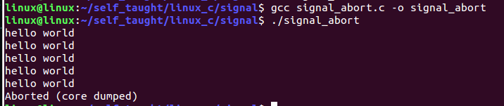
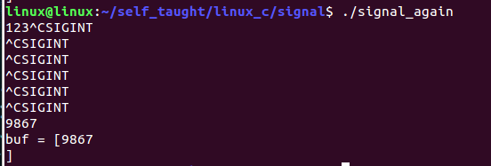

[toc]

# 1 信号

## 1.1 信号的概述

### 1.1.1 信号的概念

信号是软件中断，它是在软件层次上对中断机制的一种模拟。

信号可以导致一个正在运行的进程被另一个正在运行的异步进程中断，转而处理某一个突发事件。

==**信号是一种异步通信机制。**==

进程不必等待信号的到达，进程也不知道信号什么时候到达。

信号可以直接进行用户空间进程和内核空间进程的交互，内核进程可以利用它来通知用户空间进程发生了哪些系统事件。

每个信号的名字都以字符SIG开头。

每个信号和一个数组编码相对应，在头文件signum.h中，这些信号都被定义为正整数。

### 1.1.2 信号定义的路径

```bash
# ubuntu 14.04
/usr/include/i386-linux-gnu/bits/signum.h
# ubuntu16.04
/usr/include/x86_64-linux-gnu/bits/signum.h
```


在linux下，要想查看这些信号和编码的对应关系，可使用：`kill -l`


信号是由当前系统已经定义好的一些标识，每一个标识都会在特定的场合使用并且都会对进程有一定的影响，当信号产生时，会让当前信号做出相应的操作。

这些信号都是已经定义好的，我们不能自己去创造，直接使用这些就可以了。

### 1.1.3 产生信号的方式

1. 当用户按某些终端键时，将产生信号

   - 终端上按`Ctrl + c`组合键通常产生中断信号SIGINT
   - 终端上按`Ctrl + \`组合键通常产生中断信号SIGQUIT
   - 终端上按`Ctrl + z`组合键通常产生中断信号SIGTSTP

2. 硬件异常将产生信号

   除数为0，无效的内存访问等。这些情况通常由硬件检测到，并通知内核，然后内核产生适当的信号发送给相应的进程。

3. 软件异常将产生信号

   当检测到某种软件条件已发生，并将其通知有关进程时，产生信号。

4. 调用kill函数将发送信号

   注意：接收信号进程和发送信号进程的所有者必须相同，或发送信号进程的所有者必须是超级用户。

5. 运行kill命令将发送信号

   此程序实际上时使用kill函数来发送信号。也常用此命令终止一个失控的后台程序。

### 1.1.4 信号的默认(缺省)处理方式

当进程中产生了一个信号，就会让当前进程做出一定的反应，默认处理进程的方式如下：

1. 终止进程：当信号产生后，当前进程就会立即结束
2. 缺省处理：当信号产生后，当前进程不做任何处理
3. 停止进程：当信号产生后，使得当前进程停止
4. 让停止的进程恢复运行：当信号产生后，停止的进程会恢复执行（后台进程）

==**注意：每一个信号只有一个默认的处理方式**==

### 1.1.5 进程接收到信号后的处理方式

1. 执行系统默认动作

   对大多数信号来说，系统默认动作是用来终止该进程。

2. 忽略此信号

   接收到此信号后没有任何动作。

3. 执行用户自定义信号处理函数（捕捉信号）

   用户自定义的信号处理函数处理该信号。

注意：SIGKILL和SIGSTOP这两个信号只能以默认的处理方式执行，不能忽略也不能自定义。

### 1.1.6 常见的信号

| 信号 | 值   | 性质 | 默认处理方式 |
| :----- | :----- | :----- | :------------- |
| SIGHUP | 1 | 该信号在用户终端连接(正常/非正常)结束时发出，通常是在终端的控制进程结束时，通知同一会话内的各个进程与控制终端不再关联 | 终止进程 |
| SIGINT | 2 | 键盘输入ctrl + c时产生信号 | 终止进程 |
| SIGQUIT | 3 | 键盘键入ctrl + \时产生的信号 | 终止进程 |
| SIGILL | 4 | 该信号在一个进程企图执行一条非法指令时(可执行文件本身出现错误，或者试图执行数据段、堆栈溢出时)发出。 | 终止进程 |
| SIGABRT | 6 | 当调用abort函数时会产生当前信号 | 终止进程 |
| SIGGFPE | 8 | 该信号在发生致命的算数运算错误时发出，这里不仅包括浮点运算错误，还包括溢出及除数为0等其他所有的算数的错误。 | 终止进程 |
| SIGKILL | 9 | 当产生这个信号后，当前进程会退出，不能被缺省和捕捉 | 终止进程 |
| SIGUSR1 | 10 | 用户自定义信号，不会自动产生，只能使用kill函数或者命令给指定的进程 | 缺省 |
| SIGUSR2 | 12 | 用户自定义的信号，不会自动产生，只能使用kill函数或者命令给指定的进程发送当前信号 | 缺省 |
| SIGPIPE | 13 | 当管道破裂的时，会产生当前信号 | 终止进程 |
| SIGALRM | 14 | 当调用alarm函数设置的时间到达时会产生的 | 终止进程 |
| SIGCHLD | 17 | 当使用fork创建一个子进程时，如果子进程状态改变（退出），会产生当前信号 | 缺省 |
| SIGCONT | 18 | 当产生当前信号后，当前停止的进程会恢复运行 | 停止的进程恢复运行 |
| SIGSTOP | 19 | 当产生这个信号后，当前进程会停止，不能被缺省和捕捉 | 停止进程 |
| SIGTSTP | 20 | 键盘输入ctrl + z时产生信号 | 停止进程 |


## 1.2 kill函数

```c
// 头文件
#include <sys/types.h>
#include <signal.h>

// 函数格式
int kill(pid_t pid, int sig);

/*
 * 功能：
 *      pid:
 *          pid > 0:将信号传送给进程ID为pid的进程
 *          pid = 0:将信号发送给当前的进程所在的进程组中的所有进程。
 *          pid = -1:将信号传送给系统内所有的进程，除了init进程
 *          pid < -1:将信号传给指定进程组的所有进程。这个进程组号等于pid的绝对值。
 *      sig:指定的信号
 * 返回值：
 *      成功：0
 *      失败：-1
 */
```

```c
#include <stdio.h>
#include <stdlib.h>
#include <unistd.h>
#include <signal.h>
#include <sys/types.h>

int main(int argc, const char *argv[])
{
    pid_t pid;

	pid = fork();
	if(pid < 0)
	{
		perror("fail to fork");
		exit(1);
	}
	else if(pid > 0) 		// 父进程代码区
	{
		while(1)
		{
			printf("this is parent progess\n");
			sleep(1);
		}
	}
	else
	{
		/* 子进程代码区 */
		printf("this is son progess\n");

		// 子进程在三秒之后，让父进程退出
		sleep(3);

		// 使用kill给父进程发送信号，然后父进程接收到信号后直接退出就可以了
		kill(getppid(),SIGINT);
	}

 	return 0;
}
```

result


### 1.2.1 注意

==**使用kill函数发送信号，接收信号进程和发送信号进程的所有者必须相同，或者发送信号进程的所有者是超级用户。**==

## 1.3 alarm函数

```c
// 头文件
#include <unistd.h>

// 函数格式
unsigned int alarm(unsigned int seconds);

/*
 * 功能：
 *      定时器，闹钟，当设定的时间到达时，会产生SIGALRM信号
 *		SIGALRM信号的默认动作是终止调用alarm函数的进程。
 * 参数：
 *      seconds：设定的秒数
 * 返回值：
 *      如果alarm函数之前没有alarm设置，则返回0
 *      如果有，则返回上一个alarm剩余的时间
 */
```

```c
#include <stdio.h>
#include <unistd.h>

int main(int argc, const char *argv[])
{
    unsigned int sec;

	// 当执行到alarm之后，代码会接着往下执行，当设定的时间到后，会产生SIGALRM信号
	// 如果alarm之前没有设置其他闹钟，则返回0，如果之前设置了，则返回之前剩余的秒数
	// 如果一个程序中出现多个alarm闹钟，第一个如果没有到达指定的时间就遇到第二个
	// 则第一个的闹钟时间清除，按照第二个alarm闹钟的时间继续往下运行
	sec = alarm(5);
	printf("sec = %d\n",sec);

	sleep(3);

	sec = alarm(6);
	printf("sec = %d\n",sec);

	while(1)
	{
		printf("hello world\n");
		sleep(1);
	}

 	return 0;
}
```

result


## 1.4 raise函数

```c
// 头文件
#include <signal.h>

// 函数格式
int raise(int sig);

/*
 * 功能：
 *      给调用进程本身发送信号
 * 参数：
 *      sig:指定的信号
 * 返回值：
 *      成功：0
 *      失败：非0
 */

// raise(sig) <===> kill(getpid(),sig)
```

```c
#include <stdio.h>
#include <stdlib.h>
#include <unistd.h>
#include <signal.h>
#include <sys/types.h>

int main(int argc, const char *argv[])
{
	int num = 0;
	while(1)
	{
		printf("hello world\n");
		sleep(1);
		num++;

		// 当循环执行5秒后，进程退出
		if(5 == num)
		{
			// 使用raise给当前进程本身发送信号
			raise(SIGALRM);
			// kill(getpid(),SIGALRM);
		}
	}
 	return 0;
}
```

result


## 1.5 abort函数

```c
// 头文件
#include <stdlib.h>

// 函数格式
void abort(void);

/*
 * 功能：
 *      向进程发送一个SIGABRT信号，默认情况下进程会退出
 * 参数：
 *      无
 * 返回值：
 *      无
 */
```

### 1.5.1 注意

==**即使SIGABRT信号被加入阻塞集，一旦进程调用了abort函数，进程也还是会被终止，且在终止前会刷新缓冲区，关闭文件描述符。**==

```c
#include <stdio.h>
#include <stdlib.h>
#include <unistd.h>
#include <signal.h>
#include <sys/types.h>

int main(int argc, const char *argv[])
{

	int num = 0;

	while(1)
	{
		printf("hello world\n");
		sleep(1);
		num++;

		// 当循环执行5秒后，进程退出
		if(5 == num)
		{
			abort();
		}
	}
 	return 0;
}
```

result



## 1.6 pause函数

```c
// 头文件
#include <unistd.h>

// 函数格式
int pause(void);

/*
 * 功能：
 *      阻塞等待一个信号的产生
 *      将调用进程挂起直至捕捉到信号为止。这个函数通常用于判断信号是否已到。
 * 参数：
 *      无
 * 返回值：
 *      当有信号产生时，函数返回-1
 */
```

```c
#include <stdio.h>
#include <stdlib.h>
#include <unistd.h>
#include <signal.h>
#include <sys/types.h>

int main(int argc, const char *argv[])
{
    pid_t pid;

	pid = fork();
	if(pid < 0)
	{
		perror("fail to fork");
		exit(1);
	}
	else if(pid > 0) 		// 父进程代码区
	{
		while(1)
		{
			printf("this is parent progess\n");
			// 使用pause阻塞等待捕捉信号
			pause();
		}
	}
	else
	{
		/* 子进程代码区 */
		printf("this is son progess\n");

		sleep(3);

		kill(getppid(),SIGINT);
	}

 	return 0;
}
```

result


## 1.7 signal函数

==**进程接收到信号后的处理方式**==

1. 执行系统默认动作

   对大多数信号来说，系统默认动作是用来终止该进程。

2. 忽略此信号

   接收到此信号后没有任何动作。

3. 执行用户自定义信号处理函数（捕捉信号）

   用户自定义的信号处理函数处理该信号。

程序中可用函数signal()改变信号的处理方式。

```c
// 头文件
#include <signal.h>

// 函数格式1
// typedef的作用是取别名，此时的sighandler_t是一个数据类型
// 数据类型是void (*)(int)
typedef void (*sighandler_t)(int);
sighandler_t signal(int signum, sighandler_t handler);
// 函数格式2
void (*signal(int signum, void(*func)(int)))(int);

/*
 * 功能：
 *      当进程中产生某一个信号时，对当前信号进行处理
 *      注册信号处理函数（不可用于SIGKILL、SIGSTOP信号），
 *      即确定收到信号后处理函数的入口地址。
 * 参数：
 *      signum：指定要处理的信号
 *      handler：处理方式
 *          SIG_IGN     当信号产生时，以缺省（忽略）的方式处理
 *          SIG_DFL     当信号产生时，以当前信号默认的方式处理
 *          void handler(int signum)：当信号产生时，通过信号处理函数自定义方式处理
 *                  函数名可以随便写，参数表示当前的信号
 * 返回值：
 *      成功：返回函数地址，该地址为此信号上一次注册的信号处理函数的地址
 *      失败：SIG_ERR
 */
```

### 1.7.1 signal函数的使用

```c
#include <stdio.h>
#include <stdlib.h>
#include <unistd.h>
#include <signal.h>

void handler(int sig);

int main(int argc, const char *argv[])
{
	// 以默认的方式处理信号
#if 0
	if(SIG_ERR == signal(SIGINT, SIG_DFL))
	{
		perror("fail to signal");
		exit(1);
	}
	if(SIG_ERR == signal(SIGQUIT, SIG_DFL))
	{
		perror("fail to signal");
		exit(1);
	}
	if(SIG_ERR == signal(SIGTSTP, SIG_DFL))
	{
		perror("fail to signal");
		exit(1);
	}
#endif

	// 以忽略的方式来处理信号
#if 0
	if(SIG_ERR == signal(SIGINT, SIG_IGN))
	{
		perror("fail to signal");
		exit(1);
	}
	if(SIG_ERR == signal(SIGQUIT, SIG_IGN))
	{
		perror("fail to signal");
		exit(1);
	}
	if(SIG_ERR == signal(SIGTSTP, SIG_IGN))
	{
		perror("fail to signal");
		exit(1);
	}

	// 注意：SIGKILL和SIGSTOP这两个信号只能以默认的方式处理，不能忽略或者捕捉(自定义)
	// if(SIG_ERR == signal(SIGKILL , SIG_IGN))
	// {
	//  	perror("fail to signal");
	//  	exit(1);
	// }
#endif

	// 以用户自定义的方式处理信号
#if 1
	if(SIG_ERR == signal(SIGINT, handler))
	{
		perror("fail to signal");
		exit(1);
	}
	if(SIG_ERR == signal(SIGQUIT, handler))
	{
		perror("fail to signal");
		exit(1);
	}
	if(SIG_ERR == signal(SIGTSTP, handler))
	{
		perror("fail to signal");
		exit(1);
	}
#endif

	while(1)
	{
		printf("hello world\n");
		sleep(1);
	}
 	return 0;
}


void handler(int sig)
{
	if(sig == SIGINT)
	{
		printf("SIGINT正在处理\n");
	}

	if(sig == SIGQUIT)
	{
		printf("SIGQUIT正在处理\n");
	}

	if(sig == SIGTSTP)
	{
		printf("SIGTSTP正在处理\n");
	}
}
```

result1


result2

此时进程不能自己结束

需要使用kill命令来结束当前程序。

`kill -9 进程名`


result3

此时进程不能自己结束

需要使用kill命令来结束当前程序。

`kill -9 进程名`


### 1.7.2 signal函数的返回值

```c
#include <stdio.h>
#include <stdlib.h>
#include <unistd.h>
#include <signal.h>

void *ret_handler;
void handler(int sig);

int main(int argc, const char *argv[])
{

	if(SIG_ERR == (ret_handler = signal(SIGINT, handler)))
	{
		perror("fail to signal");
		exit(1);
	}

	while(1)
	{
		printf("hello world\n");
		sleep(1);
	}
 	return 0;
}


void handler(int sig)
{
	printf("********************\n");
	printf("hello world\n");
	printf("nihao beijing\n");
	printf("********************\n");

	if(SIG_ERR == signal(SIGINT, ret_handler))
	{
		perror("fail to signal");
		exit(1);
	}
}
```


## 1.8 可重入函数

==**可重入函数是指函数可以由多个任务并发使用，而不必担心数据错误。**==

可重入函数就是可以被中断的函数，当前函数可以在任何时刻中断它，并执行另一块代码，当执行完毕后，回到原本的代码还可以正常继续运行。

### 1.8.1 编写可重入函数

1. 不使用（返回）静态的数据、全局变量（除非用信号量互斥）
2. 不调用动态内存分配、释放的函数
3. 不调用任何不可重入的函数（如标准IO函数）

### 1.8.2 注意

即使信号处理函数使用的都是可重入函数（常见的可重入函数），也要注意进入处理函数时，首先要保存errno的值，结束时，再恢复原值。因为，信号处理过程中，errno值随时可能被改变。

### 1.8.3 常见的可重入函数列表


```c
#include <stdio.h>
#include <stdlib.h>
#include <unistd.h>
#include <sys/types.h>
#include <sys/stat.h>
#include <fcntl.h>
#include <signal.h>

void handler(int sig)
{
	printf("SIGINT\n");
}

int main(int argc, const char *argv[])
{
    signal(SIGINT, handler);

#if 0
	// 案例1：
	// sleep是一个可重入函数，但是当执行信号处理函数之后，不会回到原本的位置继续睡眠
	//sleep(10);

	// alarm函数是一个可重入函数，当他执行时，
	// 如果有信号产生并执行信号处理函数，执行完毕后，会继续执行
	//alarm(10);

	while(1)
	{
		printf("hello world\n");
		sleep(1);
	}
#endif

#if 1
	char buf[32] = "";
	// read函数是一个可重入函数，在等待终端输入时，如果产生信号并执行信号处理函数，信号处理
	// 函数执行完毕后，可以继续输入数据，read可以读取到信号处理函数之后的数据
	if(-1 == read(0, buf, 20))
	{
		perror("fail to read");
		exit(1);
	}
	printf("buf = [%s]\n",buf);
#endif
 	return 0;
}
```

result

sleep

不到十秒按下ctrl + c sleep函数就失效了


alarm


read



## 1.9 不可重入函数

什么是不可重入函数

1. 函数体内是使用了静态的数据结构
2. 函数体内调用了malloc()或者free()函数
3. 函数体内调用了标准I/O函数

## 1.10 信号集

### 1.10.1 信号集概述

一个用户进程常常需要对多个信号做出处理。为了方便读多个信号进行处理，在linux系统中引入了信号集。

信号集是用来表示多个信号的数据类型。

### 1.10.2 信号集数据类型

```
sigset_t
```

### 1.10.3 定义路径

```bash
# ubuntu 14.04
/usr/include/i386-linux-gnu/bits/sigset.h
# ubuntu16.04
/usr/include/x86_64-linux-gnu/bits/signum.h
```


### 1.10.4 信号集相关的操作

```c
sigemptyset				// 初始化由set指向的信号集，清除其中所有的信号即初始化一个空信号集
sigfillset				// 初始化信号集合set,将信号集合设置为所有信号的集合
sigismember				// 查询signum标识的信号是否在信号集合set之中
sigaddset				// 将信号signum加入到信号集合set之中
sigdelset				// 将signum所标识的信号从信号集合set中删除
```

```c
// 头文件
#include <signal.h>

// 函数格式
// 初始化一个空信号集
int sigemptyset(sigset_t *set);
/*
 * 功能：
 *      初始化由set指向的信号集，清除其中所有的信号即初始化一个空信号集
 * 参数：
 *      set：
 *          信号集标识的地址，以后操作此信号集，对set进行操作就可以了
 * 返回值：
 *      成功：返回0
 *      失败：返回-1
 */

// 函数格式
// 初始化一个满的信号集
int sigfillset(sigset_t *set);
/*
 * 功能：
 *      初始化信号集合set,将信号集合设置为所有信号的集合
 * 参数：
 *      信号即标识的地址，以后操作此信号集，对set进行操作就可以了
 * 返回值：
 *      成功：返回0
 *      失败：返回-1
 */

// 函数格式
// 向某个集合中添加一个信号
int sigaddset(sigset_t *set, int signum);
/*
 * 功能：
 *      将信号signum加入到信号集合set之中
 * 参数：
 *      set：信号集标识的地址
 *      signum：信号的编号
 * 返回值：
 *      成功：返回0
 *      失败返回-1
 */

// 函数格式
// 从某个信号集中删除一个信号
int sigdelset(sigset_t *set, int signum);
/*
 * 功能：
 *      将signum所标识的信号从信号集合set中删除
 * 参数：
 *      set：信号集标识的地址
 *      signum：信号的编号
 * 返回值：
 *      成功：返回0
 *      失败：返回-1
 */

// 函数格式
// 判断某个集合是否有某个信号
int sigismember(const sigset_t *set, int signum);
/*
 * 功能：
 *      查询signum标识的信号是否在信号集合set之中
 * 参数：
 *      set：信号集标识符号的地址
 *      signum：信号的编号
 * 返回值：
 *      成功：在信号集中返回1，不在信号集中返回0
 *      错误：返回-1
 */
```

```c
#include <stdio.h>
#include <signal.h>

int main(int argc, const char *argv[])
{
	// 创建一个信号集
	sigset_t set;
	int ret = 0;

	// 初始化一个空的信号集
	sigemptyset(&set);

	// 判断SIGINT信号是否在信号集中
	ret = sigismember(&set, SIGINT);
	if(0 == ret)
	{
		printf("SIGINT is not a member of sigprocmask \nret = %d\n", ret);
	}     
	// 将指定的信号添加到信号集中
	sigaddset(&set, SIGINT);
	sigaddset(&set, SIGQUIT);

	ret = sigismember(&set, SIGINT);
	if(1 == ret)
	{
		printf("SIGINT is a member of sigprocmask\nret = %d\n", ret);
	}
	return 0;
}
```

result


### 1.10.5 信号阻塞集

每个进程都有一个阻塞集，它用来描述哪些信号递送到该进程的时候被阻塞（在信号发生时记住它，直到进程准备好时再将信号通知进程）。

==**所谓阻塞并不是禁止传送信号，而是暂缓信号的传送**==，若将被阻塞的信号从信号阻塞集中删除，且对应的信号再阻塞时发生了，进程将会收到相应的信号。

```c
// 头文件
#include <signal.h>

// 函数格式
int sigprocmask(int how, const sigset_t *set, sigset_t *oldset);

/*
 * 功能：
 *      检查或修改信号阻塞集，根据how指定的方法对进程的阻塞集合进行修改，
 *      新的信号阻塞集由set指定，而原先的信号阻塞集由oldset保存。
 * 参数：
 *      how：信号阻塞集合的修改方法。
 *          SIG_BLOCK：向信号阻塞集合中添加set信号集
 *          SIG_UNBLOCK：从信号阻塞集合中删除set集合
 *          SIG_SETMASK：将信号阻塞集合设为set集合
 *      set：
 *          要操作的信号集地址。
 *      oldset：
 *          保存原先信号集地址。
 *      注：
 *          若set为NULL,则不会改变信号阻塞集合，函数只把当前信号阻塞集合保存到oldset中
 * 返回值：
 *      成功：返回0
 *      失败：返回-1
 */
```

```c
#include <stdio.h>
#include <stdlib.h>
#include <unistd.h>
#include <signal.h>

int main(int argc, const char *argv[])
{
	int i = 0;

	// 创建信号集并在信号集中添加信号
	sigset_t set;
    // 初始化一个空信号集
	sigemptyset(&set);
    // 将指定的信号添加到信号集中
	sigaddset(&set, SIGINT);

	while(1)
	{
		// 将set信号集添加到信号阻塞集中
		sigprocmask(SIG_BLOCK, &set, NULL);
		for(i = 0; i < 5; i++)
		{
			printf("SIGINT signal is blocked\n");
			sleep(1);
		}

		// 将set信号集从信号阻塞集中删除
		sigprocmask(SIG_UNBLOCK, &set, NULL);
		for(i = 0; i < 5; i++)
		{
			printf("SIGINT signal unblocked\n");
			sleep(1);
		}
	}
	return 0;
}
```

result


# 2 使用信号和[有名管道](./05_管道、有名管道.md)实现两个进程间的通信

## 2.1 user1

```c
#include <stdio.h>
#include <string.h>
#include <stdlib.h>
#include <unistd.h>
#include <sys/types.h>
#include <sys/stat.h>
#include <fcntl.h>
#include <signal.h>

int fd = -1;
void myread_msg(int signum)
{
    if(signum == SIGUSR1)
    {
        char buf[50];
        memset(buf, 0, sizeof(buf));
        int ret = read(fd, buf, sizeof(buf));
        if(ret > 0)
        {
            puts(buf);
            if(strcmp(buf, "quit") == 0)
            {
                close(fd);
                exit(0);
            }
        }
    }
}

int main(int argc, const char *argv[])
{
    // 打开管道文件，需要事先创建好
    fd = open("myfifo", O_RDWR);
    if(fd < 0)
    {
        puts("fail to open myfifo");
        return -1;
    }
    // 定义一个存储消息的buf
    char buf[50];
    // 清0
    memset(buf, 0, sizeof(buf));
    // 将进程号格式化输出到buf中
    sprintf(buf, "%d", getpid());
    // 将buf中的内容写入文件描述符对应的管道文件中
    write(fd, buf, sizeof(buf));
    sleep(5);

    memset(buf, 0, sizeof(buf));
    int ret = read(fd, buf, sizeof(buf));
    int per_pid;
    if(ret > 0)
    {
    	printf("current pid:%d\n", getpid());
        // 将字符串转换为整型数
        per_pid = atoi(buf);
        printf("per pid:%d\n", per_pid);
    }

    signal(SIGUSR1, myread_msg);
    while(1)
    {
        memset(buf, 0, sizeof(buf));
        // 从终端输入
        fgets(buf, sizeof(buf), stdin);
        // 将收到的buf中的最后一个字符'\n'置为0
        buf[strlen(buf)-1] = 0;
        write(fd, buf, sizeof(buf));
        kill(per_pid, SIGUSR1);
        if(strcmp(buf, "quit") == 0)
        {
            break;
        }
    }
    close(fd);
    return 0;
}

```

## 2.2 user2

```c
#include <stdio.h>
#include <string.h>
#include <stdlib.h>
#include <unistd.h>
#include <sys/types.h>
#include <sys/stat.h>
#include <fcntl.h>
#include <signal.h>

int fd = -1;

void myread_msg(int signum)
{
    if(signum == SIGUSR1)
    {
        char buf[50];
        memset(buf, 0, sizeof(buf));
        int ret = read(fd, buf, sizeof(buf));
        if(ret > 0)
        {
            puts(buf);
            if(strcmp(buf,"quit") == 0)
            {
                close(fd);
                exit(0);
            }
        }
    }
}

int main(int argc, const char *argv[])
{
    fd = open("myfifo",O_RDWR);
    if(fd < 0)
    {
        puts("fail to open myfifo");
        return -1;
    }
    char buf[50];
    memset(buf,0,sizeof(buf));
    int ret = read(fd,buf,sizeof(buf));
    int per_pid;
    if(ret > 0)
    {
        per_pid = atoi(buf);
        printf("current pid:%d\n", getpid());
        printf("per pid:%d\n", per_pid);
        memset(buf,0,sizeof(buf));
        sprintf(buf,"%d",getpid());
        write(fd,buf, sizeof(buf));
        
        signal(SIGUSR1, myread_msg);
        while(1)
        {
            memset(buf, 0, sizeof(buf));
            fgets(buf, sizeof(buf), stdin);
            buf[strlen(buf)-1] = 0;
            write(fd, buf, sizeof(buf));
            kill(per_pid, SIGUSR1);
            if(strcmp(buf,"quit") == 0)
            {
                break;
            }
        }
        
    }
    
    close(fd);
    return 0;
}
```

result

