[toc]

# 1 无名管道

## 1.1 无名管道概述

管道（pipe）又称无名管道

无名管道是一种特殊类型的文件，在应用层体现为两个打开的文件描述符。

任何一个进程在创建的时候，系统都会给它分配4G的虚拟内存，分为3G的用户空间和1G的内核空间，内核空间是所有进程公有的，无名管道就是创建在内核空间的，多个进程知道同一个无名管道的空间，就可以利用它来进行通信。

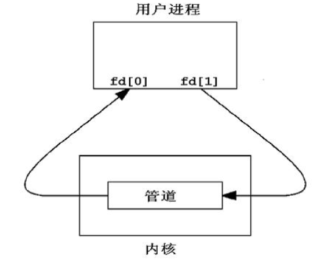

无名管道虽然是在内核空间创建的，但是会给当前用户进程两个文件描述符，一个负责执行读操作，一个负责执行写操作。

***管道最古老的UNIX IPC方式，其特点是：***

1. 半双工，数据在同一时刻只能在一个方向上流动
2. **数据只能从管道的一端写入，从另一端读出**
3. 写入管道中的数据遵循==**先入先出**==的规则
4. 管道所传送的数据是无格式的，这要求管道的读出方式与写入方必须事先约定好数据的格式，如多少字节算一个消息
5. 管道不是普通的文件，**不属于某个文件系统，其只存在于内存中**
6. 管道在内存中对应一个缓冲区，不同的系统的大小不一定相同
7. 从管道读数据是一次性操作，数据一旦被读走，它就从管道中被抛弃了，释放空间以便写更多的数据
8. 管道没有名字，只能在具有公共祖先的进程之间使用

| 通信方式   | 特点                                   | 例子       |
| ---------- | -------------------------------------- | ---------- |
| 单工通信   | 数据只能同一信道上单向流通             | 广播、电视 |
| 半双工通信 | 数据可以分时在同一信道上两个方向传输   | 对讲机     |
| 全双工通信 | 数据可以同一时刻，在同一信道上双向传输 | 打电话     |


## 1.2 无名管道的创建--pipe函数

```c
// 头文件
#include <unistd.h>
// 函数格式
int pipe(int pipefd[2]);

/*
 * 功能：
 *      创建一个无名管道，返回两个文件描述符负责对管道进行读写操作
 * 参数：
 *      pipefd：int型数组的首地址，里面有两个元素
 *      	pipefd[0]   负责对管道执行读操作
 *      	pipefd[1]   负责对管道执行写操作
 * 返回值：
 *      成功：0
 *      失败：-1
 */
```

```c
#include <stdio.h>
#include <unistd.h>
#include <string.h>
#include <stdlib.h>

int main(int argc, const char *argv[])
{
    // 使用pipe创建一个无名管道
	int fd_pipe[2];
	if(-1 == pipe(fd_pipe))
	{
		perror("fail to pipe");
		exit(1);
	}
	printf("fd_pipe[0] = %d\n",fd_pipe[0]);
	printf("fd_pipe[1] = %d\n",fd_pipe[1]);

	// 对无名管道执行读写操作
	// 由于无名管道给当前进程两个文件描述符，所以只要操作这两个文件
	// 描述符就可以操作无名管道，所以通过文件IO中的read和write函数对
	// 无名管道进行操作
	
	// 通过write函数向无名管道中写入操作
	// fd_pipe[1]负责执行写操作
	// 如果管道中有数据，再次写入的数据会放在之前数据的后面，不会把之前的数据替换
	if(-1 == write(fd_pipe[1],"hello world",11))
	{
		perror("fail to write");
		exit(1);
	}
	write(fd_pipe[1], "nihao beijing", strlen("nihao beijing")+1);


	// 通过read函数从无名管道中读取数据
	// fd_pipe[0]负责执行读操作
	// 读取数据时，直接从管道中读取指定个数的数据，如果管道中没有数据了，则read函数会阻塞等待
	char buf[32] = "";
	ssize_t bytes;
	if(-1 == (bytes = read(fd_pipe[0], buf, 20)))
	{
		perror("fail to read");
		exit(1);
	}

	printf("buf = [%s]\n",buf);
	printf("bytes = %d\n",bytes);

	bytes = read(fd_pipe[0], buf,sizeof(buf));
	printf("buf = [%s]\n",buf);
	printf("bytes = %d\n",bytes);

	bytes = read(fd_pipe[0], buf,sizeof(buf));
	printf("buf = [%s]\n",buf);
	printf("bytes = %d\n",bytes);
 	return 0;
}
```

result

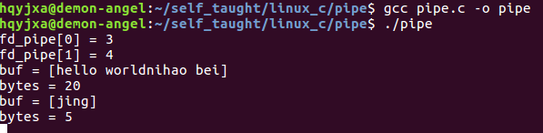

## 1.3 无名管道实现进程间的通信

==**父子进程通过管道实现数据的传输**==

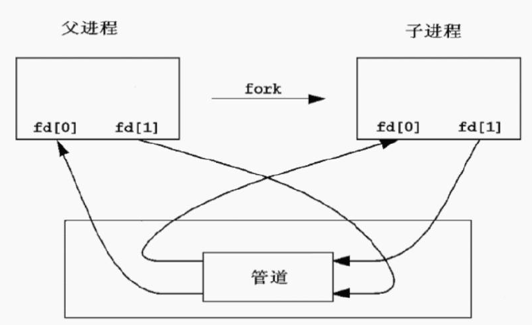

```c
#include <stdio.h>
#include <stdlib.h>
#include <unistd.h>
#include <string.h>

// 使用无名管道实现父子进程间的通信
// 由于无名管道创建之后给当前进程两个文件描述符，所以如果是完全不相关的进程
// 无法获取同一个无名管道的文件描述符，所以无名管道只能在具有亲缘关系的进程间通信

int main(int argc, const char *argv[])
{
   	// 创建一个无名管道
	int fd_pipe[2];
	if(-1 == pipe(fd_pipe))
	{
		perror("fail to pipe");
		exit(1);
	}

	// 使用fork函数创建子进程
	pid_t pid;
	if((pid = fork()) < 0)
	{
		perror("fail to fork");
		exit(1);
	}
	else if(pid > 0) 		// 父进程
	{
		// 父进程负责给子进程发送数据
		char buf[128] = {};
		while(1)
		{
			fgets(buf, sizeof(buf), stdin);
			buf[strlen(buf) - 1] = '\0';
			if(-1 == write(fd_pipe[1], buf, sizeof(buf)))
			{
				perror("fail to write");
				exit(1);
			}
		}
	}
	else
	{
		/* 子进程 */
		// 子进程接收父进程的数据
		char buf[128] = "";
		while(1)
		{
			if(-1 == read(fd_pipe[0], buf, sizeof(buf)))
			{
				perror("fail to read");
				exit(1);
			}
			printf("from father:%s\n",buf);
		}
	}
 	return 0;
}
```

result

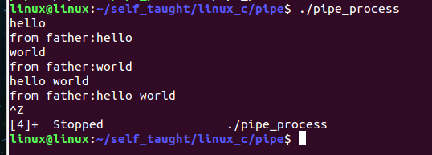

注意：

​		==**利用无名管道实现进程间的通信，都是父进程创建无名管道，然后再创建子进程，子进程继承父进程的无名管道的文件描述符，然后父子进程通过读写无名管道实现通信。**==

## 1.4 无名管道的读写规律

### 1.4.1 从管道中读数据的特点

1. 默认用read函数从管道中读取数据是阻塞的
2. 调用write函数向管道里写数据，当缓冲区已满时write也会阻塞。
3. 通信过程中，读端口全部关闭后，写进程向管道内写数据时，写进程会收到（SIGPIPE信号）退出

### 1.4.2 读写端都存在，只读不写

```c
#include <stdio.h>
#include <stdlib.h>
#include <unistd.h>

int main(int argc, const char *argv[])
{
    int pipefd[2];
	if(-1 == pipe(pipefd))
	{
		perror("fail to pipe");
		exit(1);
	}

	// 读写端都存在，只读不写
	// 如果管道中有数据，会正常读取数据
	// 如果管道中没有数据，则读操作会阻塞等待，直到有数据为止
	
	write(pipefd[1], "hello world", 11);

	char buf[128] = "";
	if(-1 == read(pipefd[0], buf, sizeof(buf)))
	{
		perror("fail to read");
		exit(1);
	}
	printf("buf = %s\n",buf);

	if(-1 == read(pipefd[0], buf, sizeof(buf)))
	{
		perror("fail to read");
		exit(1);
	}
	printf("buf = %s\n",buf);

 	return 0;
}
```

result

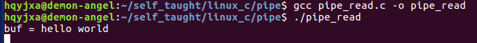

### 1.4.3 读写端都存在，只写不读

```c
#include <stdio.h>
#include <stdlib.h>
#include <unistd.h>

int main(int argc, const char *argv[])
{
    int pipefd[2];
	if(-1 == pipe(pipefd))
	{
		perror("fail to pipe");
		exit(1);
	}

	// 读写端都存在，只写不读
	// 如果一直执行写操作，则无名管道对应的缓冲区会被写满，写满之后，
	// write函数也会阻塞等待
	// 默认无名管道的缓冲区64K字节
	int num = 0;
	while(1)
	{
		if(-1 == write(pipefd[1], "6666", 1024))
		{
			perror("fail to write");
			exit(1);
		}
		num++;
		printf("num = %d\n",num);
	}
 	return 0;
}
```

result

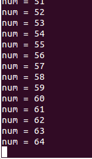

### 1.4.4 只有读端，没有写端

```c
#include <stdio.h>
#include <stdlib.h>
#include <unistd.h>
#include <string.h>

int main(int argc, const char *argv[])
{
    int pipefd[2];
	if(-1 == pipe(pipefd))
	{
		perror("fail to pipe");
		exit(1);
	}
	write(pipefd[1], "hello world",11);

	// 关闭写操作文件描述符，只有读端
	// 如果原本管道中有数据，则读操作正常读取数据
	// 如果管道中没有数据，则read函数会返回0
	close(pipefd[1]);

	char buf[128] = "";

	ssize_t bytes;
	if(-1 == (bytes = read(pipefd[0], buf, sizeof(buf))))
	{
		perror("fail to read");
		exit(1);
	}

	printf("bytes = %d\n",bytes);
	printf("buf = %s\n",buf);
	// 清除字符串的内容
	memset(buf, 0, sizeof(buf));
	if(-1 == (bytes = read(pipefd[0], buf, sizeof(buf))))
	{
		perror("fail to read");
		exit(1);
	}

	printf("bytes = %d\n",bytes);
	printf("buf = %s\n",buf);

 	return 0;
}
```

result

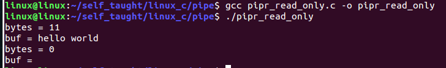

### 1.4.5 只有写端，没有读端

```c
#include <stdio.h>
#include <stdlib.h>
#include <unistd.h>
#include <signal.h>

void handler(int sig)
{
	printf("SIGPIPE信号产生了，管道破裂了\n");
}

int main(int argc, const char *argv[])
{
    signal(SIGPIPE, handler);

	int pipefd[2];
	if(-1 == pipe(pipefd))
	{
		perror("fail to pipe");
		exit(1);
	}

	// 关闭读操作文件描述符，只有写端
	// 如果关闭读端，一旦执行操作，就会产生一个信号SIGPIPE（管道破裂），
	// 这个信号的默认处理方式是退出进程
	close(pipefd[0]);

	int num = 0;
	while(1)
	{
		if(-1 == write(pipefd[1], "hello world", 1024))
		{
			perror("fail to write");
			exit(1);
		}
		num++;
		printf("num = %d\n",num);
	}
 	return 0;
}
```

result

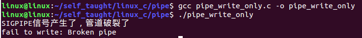

## 1.5 通过fcntl函数设置文件的阻塞特性

### 1.5.1 设置为阻塞

```c
fcntl(fd, F_SETFL, 0);
```

### 1.5.2 设置为非阻塞

```
fcntl(fd, F_SETFL, O_NONBLOCK);
```

### 1.5.3 非阻塞

如果是阻塞，管道中没有数据，read会一直等待，直到有数据才会继续运行，否则一直等待。

如果是非阻塞，read函数运行时，会先看一下管道中是否有数据，如果有数据，则正常运行读取数据，如果管道中没有数据，则read函数会立即返回，继续下面的代码运行。

```c
#include <stdio.h>
#include <string.h>
#include <unistd.h>
#include <stdlib.h>
#include <sys/types.h>
#include <sys/wait.h>
#include <fcntl.h>

int main(int argc, const char *argv[])
{
	int fd_pipe[2];
	char buf[] = "hello world";
	pid_t pid;

	if(pipe(fd_pipe) < 0)
	{
		perror("fail to pipe");
		exit(1);
	}

	pid = fork();
	if(pid < 0)
	{
		perror("fail to fork");
		exit(0);
	}
	if(0 == pid)
	{
		while(1)
		{
			sleep(5);
			write(fd_pipe[1], buf, strlen(buf));
		}
	}
	else
	{
		// 将fd_pipe[0]设置为阻塞
		// fcntl(fd_pipe[0], F_SETFL, 0);
		// 将fd_pipe[0]设置为非阻塞
		fcntl(fd_pipe[0], F_SETFL, O_NONBLOCK);

		while(1)
		{
			memset(buf, 0, sizeof(buf));
			read(fd_pipe[0], buf, sizeof(buf));
			printf("buf = [%s]\n", buf);
			sleep(1);
		}
	}
 	return 0;
}
```

result

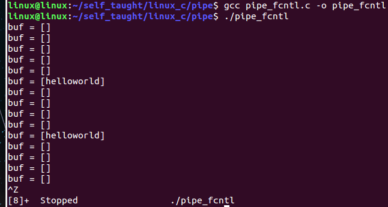

# 2 文件描述符概述

==**文件描述符是非负整数，是文件的标识。**==

用户使用文件描述符（file descriptor）来访问文件。

利用open打开一个文件时，内核会返回一个文件描述符。

每个进程都有一张文件描述符的表，进程刚被创建的时，标准输入、标准输出、标准错误输出设备文件被打开，对应的文件描述符0、1、2记录在表中。

在进程中打开其他文件时，==**系统会返回文件描述符表中最小可用的文件描述符**==，并将此文件描述记录在表中。

***注意：***

linux中一个进程最多只能打开NR_OPEN_DEFAULT（即1024）个文件，故当文件不再使用时应及时调用close函数关闭文件。

# 3 文件描述符的复制

## 3.1 dup函数

```c
// 头文件
#include <unistd.h>
// 函数格式
int dup(int oldfd);
/*
 * 功能：
 *      复制oldfd文件描述符，并分配一个新的文件描述符，新的文件描述符
 *      是调用进程文件描述符中最小可用的文件描述符
 * 参数：
 *      要复制的文件描述符oldfd
 * 返回值：
 *      成功：新的文件描述符
 *      失败：返回-1，错误代码存于errno中。
 */
```

### 3.1.1 使用dup函数复制文件描述符

```c
#include <stdio.h>
#include <unistd.h>
#include <stdlib.h>
#include <sys/types.h>
#include <sys/stat.h>
#include <fcntl.h>
#include <string.h>

int main(int argc, const char *argv[])
{
	// 通过dup函数复制一个文件描述符
	int fd;
	// dup执行后给返回值文件描述符分配的值是文件描述符表中最小可用的文件描述符
	fd = dup(1);
	printf("fd = %d\n",fd);
	// 由于通过dup函数将1这个文件描述符复制了一份为fd,
	// 所以fd现在就相当于1,所以写数据就是向终端写入数据
	write(fd, "nihao beijing\n",strlen("nihao beijing\n"));
	return 0;
}
```

result

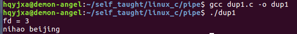

### 3.1.2 实现输出重定向的功能

```c
#include <stdio.h>
#include <unistd.h>
#include <stdlib.h>
#include <sys/types.h>
#include <sys/stat.h>
#include <fcntl.h>

int main(int argc, const char *argv[])
{
    // 如果需要实现重定向的功能
	// 首先像printf函数是操作文件描述1对应的文件，
	// 默认是操作系统，只要能够把1对应标识的文件改变，就可以实现输出重定向
	// 所以事先创建好文件对应的文件描述符之后，将1文件描述符关闭，
	// 接着通过dup函数复制的新的文件描述符就是1，这样printf函数对1操作，就写到了文件中
	int fd_file;
	fd_file = open("test.txt", O_WRONLY | O_CREAT | O_TRUNC, 0664);
	if(-1 == fd_file)
	{
		perror("fail to open");
		exit(1);
	}
	close(1);

	int fd = dup(fd_file);
	printf("hello world\n");
	printf("fd = %d\n",fd);
 	return 0;
}
```

resut

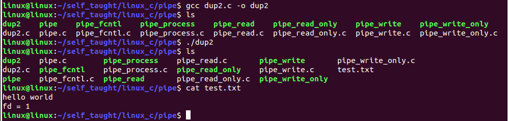

### 3.1.3 实现输出重定向后，还想标准输出，如何实现

```c
#include <stdio.h>
#include <unistd.h>
#include <stdlib.h>
#include <sys/types.h>
#include <sys/stat.h>
#include <fcntl.h>

int main(int argc, const char *argv[])
{
	int fd1;
	int fd2;
	fd2 = dup(1);
	printf("new:fd2 = %d\n", fd2);

	fd1 = open("test.txt",O_RDWR | O_CREAT, 0664);

	close(1);
	int fd3 = dup(fd1);
	printf("hello world\n");
	printf("fd3 = %d\n", fd3);

	close(1);
	int fd4 = dup(fd2);
	printf("nihao beijing\n");
	printf("fd4 = %d\n", fd4);
	return 0;
}
```

result

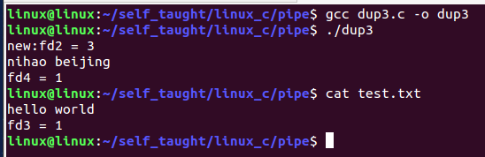

## 3.2 dup2函数

```c
// 头文件
#include <unistd.h>
// 函数格式
int dup2(int oldfd, int newfd);
/*
 * 功能：复制一份打开的文件描述符oldfd
 *      并分配新的文件描述符newfd,newfd也标识oldfd所标识的文件
 * 参数：
 *      oldfd：要复制的文件描述符
 *      newfd：分配的新的文件描述符
 * 返回值：
 *      成功：返回newfd
 *      失败：返回-1，错误代码存于error中
 * 注意：
 *      newfd是小于文件描述符最大允许值的非负整数，
 *      如果newfd是一个已经打开的文件描述符，则首先关闭该文件描述符，然后再复制
 */
```

### 3.2.1 实现输出重定向

```c
#include <stdio.h>
#include <unistd.h>
#include <stdlib.h>
#include <sys/types.h>
#include <sys/stat.h>
#include <fcntl.h>

int main(int argc, const char *argv[])
{
    int fd1;
	int fd2;
	fd1 = open("test.txt", O_CREAT | O_WRONLY, 0664);
	if(fd1 < 0)
	{
		perror("fail to open");
		exit(1);
	}
	// 首先关闭1文件描述符，然后将fd1复制给1，意味着1和fd1都标识test.txt文件，返回值跟1是一样的
	fd2 = dup2(fd1, 1);
	printf("hello world\n");
	printf("fd2 = %d\n", fd2);
 	return 0;
}
```

result

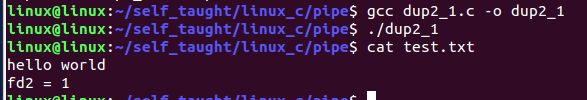

### 3.2.2 实现输出重定向后，再恢复标准输出

```c
#include <stdio.h>
#include <unistd.h>
#include <stdlib.h>
#include <sys/types.h>
#include <sys/stat.h>
#include <fcntl.h>

int main(int argc, const char *argv[])
{
    int fd1;
	// 如果使用dup2，则需要事先给第二个参数对应的变量赋一个初值
	int fd2 = 3;
	// 将1复制一份为fd2，所以fd2标识的是标准输出
	dup2(1,fd2);
	printf("fd2 = %d\n",fd2);

	fd1 = open("test.txt", O_CREAT | O_RDWR, 0664);

	// 输出重定向：关闭文件描述符，将fd1复制一份为1，
	// 所以此时标识的是test.txt文件
	dup2(fd1, 1);
	printf("hello world\n");

	// 再次实现标准输出：关闭文件描述符1，将fd2复制一份为1，
	// 所以1此时标识的是标准输出
	dup2(fd2, 1);
	printf("你好，北京\n");
 	return 0;
}
```

result

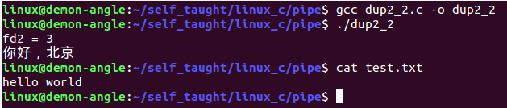

# 4 有名管道

## 4.1 有名管道的概述

***有名管道(FIFO)和管道(pipe)基本相同，但也有一些显著的不同，其特点是***：

1. 半双工、数据在同一时刻只能在一个方向上流动。
2. 写入FIFO中的数据遵循==**先入先出**==的规则。
3. FIFO所传送的数据是无格式的，这要求FIFO的读出方与写入方必须事先约定好数据的格式，如多少个字节算一个消息等。
4. FIFO在文件系统中作为一个特殊的文件而存在并且在文件系统中可见，所有有名管道可以实现不相关进程间通信，但FIFO中的内容却存放在内存中。
5. 管道在内存中对应一个缓冲区，不同的系统其大小不一定相同。
6. 从FIFO读数据是一次性操作，数据一旦被读，它就从FIFO中被抛弃，释放空间以便写更多的数据。
7. 当使用FIFO的进程退出后，FIFO文件将继续保存在文件系统中以便以后使用。
8. FIFO有名字，不相关的进程可以通过有名管道进行通信。

## 4.2 有名管道的创建

```shell
# 方法1：通过shell命令mkfifo创建有名管道
mkfifo 文件名				# 创建一个管道文件
mknod 文件名 p				# 创建一个管道文件
```

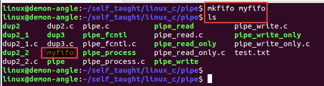

```c
// 头文件
#include <sys/types.h>
#include <sys/stat.h>
// 函数格式
int mkfifo(const char *pathname, mode_t mode);
/*
 * 功能：
 *      创建一个有名管道，产生一个本地文件系统可见的文件pathname
 * 参数：
 *      pathname：有名管道创建后生成的文件，可以带路径
 *      mode：管道文件的权限，一般通过八进制数设置即可，例如0664
 * 返回值：
 *      成功：0
 *      失败：-1
 */
```

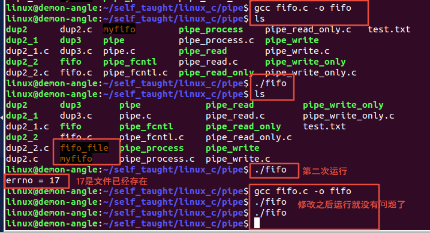

## 4.3 有名管道的基本读写操作

由于有名管道在本地创建了一个管道文件，所以系统调用的IO函数基本都可以对有名管道进行操作，==**但是不能使用lseek修改管道文件的偏移量。**==

注意：

有名管道创建的本地的文件只是起到标识的作用，真正的有名管道实现进程间的通信还是在内核空间开辟内存，所以本地产生的文件只是一个标识，没有其他作用，对本地管道文件的操作实质就是对内核空间的操作。

```c
#include <stdio.h>
#include <stdlib.h>
#include <sys/types.h>
#include <sys/stat.h>
#include <fcntl.h>
#include <unistd.h>
#include <errno.h>
#include <string.h>

#define FIFONAME "fifo_file"

int main(int argc, const char *argv[])
{
	// 通过mkfifo函数创建有名管道
	if(-1 == mkfifo(FIFONAME,0664))
	{
		if(errno != EEXIST)
		{
			perror("fail to mkfifo");
			exit(1);
		}
	}

	// 对有名管道进行操作
	// 管道后写入的数据会保存在之前写入数据的后面，不会替换
	// 如果管道中没有数据了，读操作会阻塞
	
	// 通过open函数打开管道文件并得到文件描述符
	int fd;
	fd = open(FIFONAME, O_RDWR);
	if(-1 == fd)
	{
		perror("fail to open");
		exit(1);
	}

	// 通过write函数向管道中写入数据
	if(-1 == write(fd, "hello world",strlen("hello world")))
	{
		perror("fail to write");
		exit(1);
	}

	write(fd, "i love you", strlen("i love you"));

	// 通过read函数读取管道中的数据
	char buf[32] = "";
	if(-1 == read(fd, buf, sizeof(buf)))
	{
		perror("fail to read");
		exit(1);
	}
	printf("buf = [%s]\n",buf);

	if(-1 == read(fd, buf, sizeof(buf)))
	{
		perror("fail to read");
		exit(1);
	}
	printf("buf = [%s]\n",buf);
	
	// 使用close函数关闭文件描述符
	close(fd);
 	return 0;
}
```

result

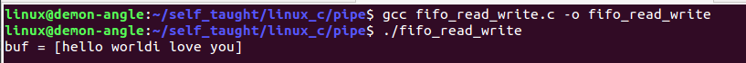

## 4.4 有名管道实现进程间通信

由于有名管道在本地创建了一个管道文件，所以不相关的进程也可以实现通信。

### 4.4.1 send

```c
#include <stdio.h>
#include <stdlib.h>
#include <sys/types.h>
#include <sys/stat.h>
#include <errno.h>
#include <fcntl.h>
#include <unistd.h>
#include <string.h>

int main(int argc, const char *argv[])
{
	// 如果没有创建有名管道，则创建有名管道
	// 为了实现两个进程都可以收发数据，所以需要创建两个有名管道
	if(-1 == mkfifo("myfifo1",0664))
	{
		if(errno != EEXIST)
		{
			perror("fail to mkfifo");
			exit(1);
		}
	}
	if(-1 == mkfifo("myfifo2",0664))
	{
		if(errno != EEXIST)
		{
			perror("fail to mkfifo");
			exit(1);
		}
	}

	// 打开两个有名管道并得到文件描述符
	int fd_w, fd_r;
	if(-1 == (fd_w = open("myfifo1", O_WRONLY)))
	{
		perror("fail to open");
		exit(1);
	}
	if(-1 == (fd_r = open("myfifo2", O_RDONLY)))
	{
		perror("fail to open");
		exit(1);
	}

	char buf[128] = "";
	ssize_t bytes;
	while(1)
	{
		fgets(buf, sizeof(buf), stdin);
		buf[strlen(buf) - 1] = '\0';

		// send进程负责将数据写入myfifo1,接着从myfifo2中读取数据
		if(-1 == (bytes = write(fd_w, buf, sizeof(buf))));
		{
			if(errno != EEXIST)
			{
				perror("fail to wirte");
				exit(1);
			}
		}

		if(-1 == (bytes = read(fd_r, buf, sizeof(buf))));
		{
			if(errno != EEXIST)
			{
				perror("fail to read");
				exit(1);
			}
		}
		printf("from recv: %s\n",buf);
	}	
	return 0;
}
```

### 4.4.2 recv

```c
#include <stdio.h>
#include <stdlib.h>
#include <sys/types.h>
#include <sys/stat.h>
#include <errno.h>
#include <fcntl.h>
#include <unistd.h>
#include <string.h>

int main(int argc, const char *argv[])
{
	// 如果没有创建有名管道，则创建有名管道
	// 为了实现两个进程都可以收发数据，所以需要创建两个有名管道
	if(-1 == mkfifo("myfifo1",0664))
	{
		if(errno != EEXIST)
		{
			perror("fail to mkfifo");
			exit(1);
		}
	}
	if(-1 == mkfifo("myfifo2",0664))
	{
		if(errno != EEXIST)
		{
			perror("fail to mkfifo");
			exit(1);
		}
	}

	// 打开两个有名管道并得到文件描述符
	int fd_w, fd_r;
	if(-1 == (fd_r = open("myfifo1", O_RDONLY)))
	{
		perror("fail to open");
		exit(1);
	}
	if(-1 == (fd_w = open("myfifo2", O_WRONLY)))
	{
		perror("fail to open");
		exit(1);
	}

	char buf[128] = "";
	ssize_t bytes;
	while(1)
	{
		if(-1 == (bytes = read(fd_r, buf, sizeof(buf))));
		{
			if(errno != EEXIST)
			{
				perror("fail to read");
				exit(1);
			}
		}
		printf("from send: %s\n",buf);

		fgets(buf, sizeof(buf), stdin);
		buf[strlen(buf) - 1] = '\0';
		write(fd_w, buf, sizeof(buf));

	}	
	return 0;
}
```

result

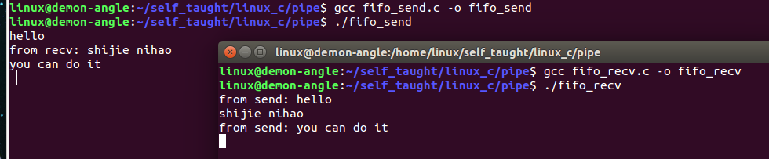

## 4.5 有名管道的读写规律（阻塞）

### 4.5.1 操作FIFO文件时的特点

系统调用的IO函数都可以作用于FIFO,如open、close、read、write等。打开FIFO时，非阻塞标志(O_NONBLOCK)产生下列影响：

1. 不指定O_NONBLOCK（即open没有位或O_NONBLOCK）
   - open以只读方式打开FIFO时，要阻塞到某个进程为写而打开此FIFO
   - open以只写方式打开FIFO时，要阻塞到某个进程为读而打开此FIFO
   - open以只读、只写打开FIFO时会阻塞，调用read函数从FIFO里读数据时read也会阻塞
   - 通信过程中若写进程先退出了，则调用read函数从FIFO里读取数据时不阻塞；若写进程又重新运行，则调用read函数从FIFO里读取数据时又恢复阻塞
   - 通信过程中，读进程退出后，写进程向有名管道内写数据时，写进程也会（收到SIGPIPE信号）退出
   - 调用write函数向FIFO里写数据，当缓冲区已满时write也会阻塞。
2. 指定O_NONBLOCK（即open位或O_NONBLOCK）
   - 先以只读的方式打开：如果没有进程已经为写而打开一个FIFO,只读open成功，并且open不阻塞
   - 先以只写的方式打开：如果没有进程已经为读而打开一个FIFO，只写open将出错返回-1
   - read、write读写有名管道中读数据时不阻塞
   - 通信过程中，读进程退出后，写进程向有名管道内写数据时，写进程也会（收到SIGPIPE信号）退出

注意：

open函数以可读可写方式打开FIFO文件时的特点：

1. open不阻塞
2. 调用read函数从FIFO里读数据时read会阻塞
3. 调用write函数向FIFO里写数据，当缓冲区已满时write也会阻塞

### 4.5.2 读写端都存在，只读不写

```c
#include <stdio.h>
#include <stdlib.h>
#include <sys/types.h>
#include <sys/stat.h>
#include <errno.h>
#include <fcntl.h>
#include <unistd.h>


int main(int argc, const char *argv[])
{
    if(-1 == mkfifo("myfifo", 0664))
	{
		if(errno != EEXIST)
		{
			perror("fail to mkfifo");
			exit(1);
		}
	}

	// 读写端都存在，只读不写
	// 如果原本管道中有数据，则正常读取
	// 如果管道中没有数据，则read函数会阻塞等待
	int fd;
	if(-1 == (fd = open("myfifo", O_RDWR)))
	{
		perror("fail to open");
		exit(1);
	}

	write(fd, "hello world", 11);

	char buf[128] = "";
	read(fd, buf, sizeof(buf));
	printf("buf = %s\n", buf);

	read(fd, buf, sizeof(buf));
	printf("buf = %s\n", buf);
 	return 0;
}
```

result

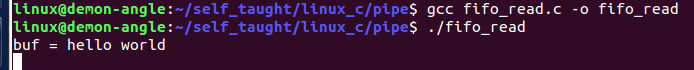

### 4.5.3 读写端都存在，只写不读

```c
#include <stdio.h>
#include <stdlib.h>
#include <sys/types.h>
#include <sys/stat.h>
#include <errno.h>
#include <fcntl.h>
#include <unistd.h>


int main(int argc, const char *argv[])
{
    if(-1 == mkfifo("myfifo", 0664))
	{
		if(errno != EEXIST)
		{
			perror("fail to mkfifo");
			exit(1);
		}
	}

	// 读写端都存在，只写不读
	// 当有名管道的缓冲区写满后，write函数会发生阻塞
	// 默认有名管道的缓冲区为64K字节
	int fd;
	if(-1 == (fd = open("myfifo", O_RDWR)))
	{
		perror("fail to open");
		exit(1);
	}

	int num = 0;
	while(1)
	{
		write(fd,"",1024);
		num++;
		printf("num = %d\n",num);
	}
		
 	return 0;
}
```

result


### 4.5.4 在一个进程中，只有读端，没有写端

```c
#include <stdio.h>
#include <stdlib.h>
#include <sys/types.h>
#include <sys/stat.h>
#include <errno.h>
#include <fcntl.h>
#include <unistd.h>


int main(int argc, const char *argv[])
{
    if(-1 == mkfifo("myfifo", 0664))
	{
		if(errno != EEXIST)
		{
			perror("fail to mkfifo");
			exit(1);
		}
	}

	// 在一个进程中，只有读端，没有写端
	// 会在open函数的位置阻塞
	printf("**********************\n");

	int fd;
	if(-1 == (fd = open("myfifo", O_RDONLY)))
	{
		perror("fail to open");
		exit(1);
	}

	printf("----------------------\n");

	char buf[128] = "";
	ssize_t bytes;
	while(1)
	{
		if(-1 == (bytes = read(fd, buf, sizeof(buf))))
		{
			perror("fail to read");
			exit(1);
		}
		printf("bytes = %ld\n",bytes);
		printf("buf =%s\n",buf);
	}

 	return 0;
}
```

result

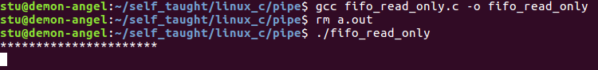

### 4.5.5 在一个进程中，只有写端，没有读端

```c
#include <stdio.h>
#include <stdlib.h>
#include <sys/types.h>
#include <sys/stat.h>
#include <errno.h>
#include <fcntl.h>
#include <unistd.h>

int main(int argc, const char *argv[])
{
	if(-1 == mkfifo("myfifo", 0664))
	{
		if(errno != EEXIST)
		{
			perror("fail to mkfifo");
			exit(1);
		}
	}

	// 在一个进程中，只有写端，没有读端
	// 会在open函数的位置阻塞
	printf("----------------------\n");

	int fd;
	if(-1 == (fd = open("myfifo", O_WRONLY)))
	{
		perror("fail to open");
		exit(1);
	}

	printf("**********************\n");
	while(1)
	{
		write(fd,"hello world",11);
		printf("666\n");
	}

	return 0;
}
```

result

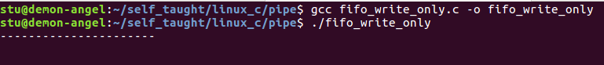

### 4.5.6 一个进程只读，一个进程只写

```c
#include <stdio.h>
#include <stdlib.h>
#include <sys/types.h>
#include <sys/stat.h>
#include <errno.h>
#include <fcntl.h>
#include <unistd.h>


int main(int argc, const char *argv[])
{
	if(-1 == mkfifo("myfifo", 0664))
	{
		if(errno != EEXIST)
		{
			perror("fail to mkfifo");
			exit(1);
		}
	}

	// 在一个进程中，只有写端，没有读端
	// 会在open函数的位置阻塞
	printf("----------------------\n");

	int fd;
	if(-1 == (fd = open("myfifo", O_WRONLY)))
	{
		perror("fail to open");
		exit(1);
	}


	printf("**********************\n");
	int i = 0;
	while(i < 10)
	{
		write(fd,"hello world",11);
		printf("666\n");
		i++;
	}

	return 0;
}
```

```c
#include <stdio.h>
#include <stdlib.h>
#include <sys/types.h>
#include <sys/stat.h>
#include <errno.h>
#include <fcntl.h>
#include <unistd.h>


int main(int argc, const char *argv[])
{
    if(-1 == mkfifo("myfifo", 0664))
	{
		if(errno != EEXIST)
		{
			perror("fail to mkfifo");
			exit(1);
		}
	}

	// 在一个进程中，只有读端，没有写端
	// 会在open函数的位置阻塞
	printf("**********************\n");

	int fd;
	if(-1 == (fd = open("myfifo", O_RDONLY)))
	{
		perror("fail to open");
		exit(1);
	}

	printf("----------------------\n");

	char buf[128] = "";
	ssize_t bytes;
	int i = 0;
	while(i < 10)
	{
		if(-1 == (bytes = read(fd, buf, sizeof(buf))))
		{
			perror("fail to read");
			exit(1);
		}
		printf("bytes = %ld\n",bytes);
		printf("buf =%s\n",buf);
		i++;
	}

 	return 0;
}
```

result

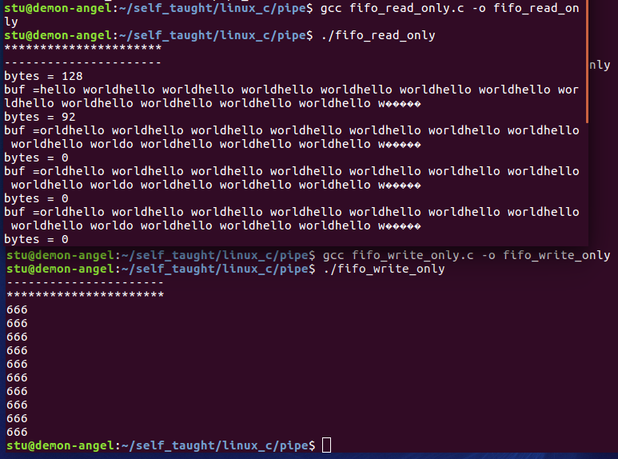

## 4.6 有名管道的读写规律（非阻塞）

```c
#include <stdio.h>
#include <stdlib.h>
#include <sys/types.h>
#include <sys/stat.h>
#include <errno.h>
#include <fcntl.h>
#include <unistd.h>
#include <string.h>


int main(int argc, const char *argv[])
{
    int fd;
    if(-1 == mkfifo("myfifo", 0664))
    {
        if(errno != EEXIST)
        {
            perror("fail to mkfifo");
            exit(1);
        }
    }
#if 0
    // 如果open标志设置为非阻塞，并且以只读的方式打开管道文件
    // open函数和read函数都不会阻塞
    fd = open("myfifo",O_RDONLY | O_NONBLOCK);
    if(fd < 0)
    {
        perror("fail to open");
        exit(1);
    }
    while (1)
    {
        char recv[100];
        // 将指定内存块的前n个字节全部设置为零
        bzero(recv, sizeof(recv));
        read(fd, recv, sizeof(recv));
        printf("read from my_fifo buf=[%s]\n",recv);
        sleep(1);
    }

#endif

#if 1
    // 如果open标志位设置为非阻塞，并且以只写的方式打开管道文件
    // open函数和write函数都不会阻塞
    char send[100] = "hello I love you";
    fd = open("myfifo",O_WRONLY | O_NONBLOCK);
    // fd = open("myfifo",O_RDWR | O_NONBLOCK);
    if(fd < 0)
    {
        perror("fail to open");
        exit(1);
    }
    write(fd, send ,strlen(send));
    char recv[100];
    read(fd, recv, sizeof(recv));
    printf("read from my_fifo buf=[%s]\n",recv);

#endif
    return 0;
}
```

result

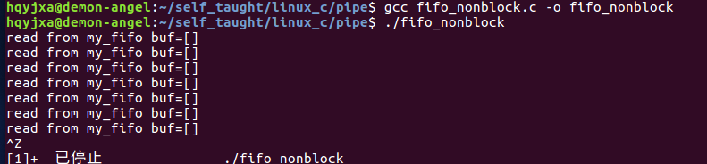

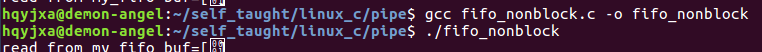

