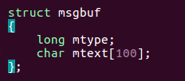

[toc]

# 1 IPC对象

除了最原始的进程间通信方式==**信号、无名管道、有名管道**==外，还有三种进程间通信方式，这三种方式称之为IPC对象

## 1.1 IPC对象分类

### 1.1.1 [消息队列](#消息队列)

### 1.1.2 [共享内存](./07_共享内存.md)

### 1.1.3 [信号灯集](./09_多任务互斥和同步.md)

IPC对象也是在内核空间开辟区域，每一种IPC对象创建好之后都会将其设置为全局，并且会给其分配一个编号，只要找到唯一的这个编号就可以进行通信，所以不相关的进程可以通过IPC对象通信

IPC对象创建好之后，会在当前系统中可见，只要不删除或者不关闭系统，就会一直存在

## 1.2 查看已经创建好的IPC对象

```shell
# 查看当前系统中所有创建的IPC对象
ipcs
# 查看创建的消息队列
ipcs -q
# 查看创建的共享内存
ipcs -m
# 查看信号量
ipcs -s

ipcrm 删除IPC对象
# ipcrm -q msqid  删除标号为msqid的消息队列
```

# 2 消息队列

## 2.1 消息队列的概念

顾名思义，消息队列就是一些消息的列表。用户可以在消息队列中添加消息和读取消息等。从这个观点上看，消息队列具有一定的FIFO特性，但是它可以实现消息的随机查询，比FIFO具有更大的优势。同时，这些消息又存在于内核中，由“队列ID”来标识。

## 2.2 结构



消息队列就是这样一个由消息结构构成的队列，满足先进先出的特点，但是可以通过消息结构type域有选择获取某一类型的第一条消息，这就实现了有优先级的获取消息。==**消息的结构可以自定义**==

## 2.3 特点

1. 共享的数据是有类型的
2. 消息队列的消息是有格式的
3. 消息队列可以实现消息的随机查询。消息不一定要以先进先出的次序读取，编程时可以按消息的类型读取。
4. 与无名管道、有名管道一样，从消息队列中读出消息，消息队列中对应的数据都会被删除
5. 每个消息队列都有信息队列标识符，从消息队列中读出消息，消息队列中对应的数据都会被删除
6. 每个消息队列都有信息队列标识符，消息队列标识符在整个系统中时唯一的。
7. 只有内核重启或人工删除消息队列时，该消息队列才会被删除。若不人工删除消息队列，消息队列会一直存在于系统中
8. 可以实现非亲缘间进程通信
9. 因为是先进先出的也可以实现一定的同步过程
10. 可以实现有优先级的信息传递

System V提供的IPC通信机制需要一个key值，通过key值就可在系统内获得一个唯一的消息队列标识符。

key值可以是人为指定的，也可以通过ftok函数获得

如果多个进程想通过IPC对象通信，则必须找到唯一的标识，而唯一的标识是由key决定的，所以只要key知道，则就可以实现多个进程间通信。

## 2.4 ftok函数

```c
/* 头文件 */
#include <sys/types.h>
#include <sys/ipc.h>
/* 函数格式 */
key_t ftok(const char *pathname, int proj_id);
/*
 * 功能：
 *      根据工程路径和工程id生成一个System V的一个IPC key
 * 参数：
 *      参数1：pathname工程路径名
 *      参数2：工程id，范围一般是0 ~ 127
 * 返回值：
 *      成功返回IPC key值，失败返回-1
 * 注意：
 *      如果使用ftok函数获取键值，得到的键值是由ftok的第一个参数对应文件的信息
 *      和第二个参数一起决定的
 */
```

```c
#include <stdio.h>
#include <stdlib.h>
#include <sys/types.h>
#include <sys/ipc.h>

int main(int argc, char const *argv[])
{
    /* 使用ftok函数获取键值 */
    /* 只要保证ftok的第一个参数对应的文件和第二个参数值相同
     * 则不管程序运行多少遍，键值一定都是唯一的
     */
    key_t mykey;
    if (-1 == (mykey = ftok(".", 100)))
    {
        perror("fail to ftok");
        exit(1);
    }

    printf("key = %#x\n", mykey);
    system("ipcs -q");

    return 0;
}
```

result


# 3 消息队列的操作

消息队列的实现，包括创建或打开消息队列，添加消息，读取消息和控制消息队列这四种操作。

- 其中创建或打开消息队列使用的函数是msgget()，这里创建的消息队列的数量会受到系统消息队列数量的限制。
- 添加消息使用的函数是msgsnd()，它把消息添加到已经打开的消息队列的末尾；
- 读取消息使用的函数是msgrcv()，它把消息从消息队列中取走，与FIFO不同的是，这里可以取走指定的某一条消息
- 控制消息队列使用的函数时msgctl()，它可以完成更多项功能。

## 3.1 创建消息对列 -- msgget()

```c
/* 头文件 */
#include <sys/types.h>
#include <sys/ipc.h>
#include <sys/msg.h>
/* 函数格式 */
int msgget(key_t key, int msgflg);
/*
 * 功能：创建或打开一个消息队列，得到消息队列的id
 * 参数：
 *      key:ftok获取的system V IPC key
 *          方法1：任意指定一个数
 *          方法2：使用ftok函数获取键值
 *      msgflg: 消息队列的访问权限
 *          一般设置为 IPC_CREAT | IPC_EXCL | 0777
 *          或者 IPC_CREAT | 0777
 * 返回值：
 *      成功返回消息队列的标识，
 *      失败返回-1
 */
```

```c
#include <stdio.h>
#include <stdlib.h>
#include <sys/types.h>
#include <sys/ipc.h>
#include <unistd.h>
#include <sys/msg.h>

int main(int argc, char const *argv[])
{
    key_t mykey;
    /* 使用ftok函数获取ipc键值 */
    if (-1 == (mykey = ftok(".", 100)))
    {
        perror("fail to ftok");
        exit(1);
    }

    printf("key = %#x\n", mykey);

    /* 通过msgget函数创建一个消息队列 */
    int msqid;
    if (-1 == (msqid = msgget(mykey, IPC_CREAT | 0666)))
    {
        perror("fail to magget");
        exit(1);
    }
    printf("msqid = %d\n", msqid);

    system("ipcs -q");

    return 0;
}
```

result


## 3.2 发送消息 -- msgsnd()

```c
/* 头文件 */
#include <sys/types.h>
#include <sys/ipc.h>
#include <sys/msg.h>
/* 函数格式 */
int msgsnd(int msqid, const void *msgp, size_t msgsz, int msgflg);
/*
 * 功能：发送消息到消息队列(往消息队列中添加消息)
 * 参数：
 *		msqid:消息队列ID
 *		msgp：要写入的数据，需要自己定义结构体
 *          struct struct_name
 *          {
 *              long mtype;     // 消息的编号，必须大于0
 *              char mtext[128];    // 消息正文，可以定义多个成员
 *              ...
 *          };
 *		msgsz:消息正文的大小，不包括消息的编号长度
 *		msgflg：标志位
 *          0 阻塞
 *          IPC_NOWAIT 非阻塞
 * 返回值：
 *      成功返回0，
 *      失败返回-1
 */
```

```c
#include <stdio.h>
#include <stdlib.h>
#include <sys/types.h>
#include <sys/ipc.h>
#include <unistd.h>
#include <sys/msg.h>

#define N 128

typedef struct
{
    /* 消息类型，必须在结构体的第一个位置并且类型必须是long */
    long msg_type;
    /* 消息正文，也可以用多个成员并且类型也可以是任意 */
    char msg_text[N];
} MSG;

#define MSGTEXT_SIZE (sizeof(MSG) - sizeof(long))

int main(int argc, char const *argv[])
{
    key_t mykey;
    /* 使用ftok函数获取ipc键值 */
    if (-1 == (mykey = ftok(".", 100)))
    {
        perror("fail to ftok");
        exit(1);
    }

    printf("key = %#x\n", mykey);

    /* 通过msgget函数创建一个消息队列 */
    int msqid;
    if (-1 == (msqid = msgget(mykey, IPC_CREAT | 0666)))
    {
        perror("fail to magget");
        exit(1);
    }

    system("ipcs -q");

    /* 使用msgsnd函数向消息队列中发送数据（写操作） */
    MSG msg1 = {1, "hello world"};
    MSG msg2 = {4, "nihao shijie"};
    MSG msg3 = {2, "hello kitty"};
    MSG msg4 = {3, "shijainjianshi"};

    if (-1 == msgsnd(msqid, &msg1, MSGTEXT_SIZE, 0))
    {
        perror("fail to magsnd");
        exit(1);
    }

    if (-1 == msgsnd(msqid, &msg2, MSGTEXT_SIZE, 0))
    {
        perror("fail to magsnd");
        exit(1);
    }

    if (-1 == msgsnd(msqid, &msg3, MSGTEXT_SIZE, 0))
    {
        perror("fail to magsnd");
        exit(1);
    }

    if (-1 == msgsnd(msqid, &msg4, MSGTEXT_SIZE, 0))
    {
        perror("fail to magsnd");
        exit(1);
    }
    system("ipcs -q");
    return 0;
}
```

result


## 3.3 接收消息 -- msgrcv()

```c
/* 头文件 */
#include <sys/types.h>
#include <sys/ipc.h>
#include <sys/msg.h>
/* 函数格式 */
ssize_t msgrcv(int msqid, void *msgp, size_t msgsz, long msgtyp, int msgflg);
/*
 * 功能：
 *      从消息队列中接收数据(读操作)，接受的数据会从消息队列中删除
 * 参数：
 *		msqid:消息队列ID
 *		msgp：保存接收数据的结构体
 *          struct struct_name
 *          {
 *              long mtype;     // 消息的编号，必须大于0
 *              char mtext[128];    // 消息正文，可以定义多个成员
 *              ...
 *          };
 *		msgsz:消息正文的大小，不包括消息的编号长度
 *      msgtyp：设置要接收哪个消息
 *          0   按照写入消息队列的顺序依次读取
 *          >0  只读取消息队列中消息编号为当前参数的第一个消息
 *          <0  只读取消息队列中小于等于当前参数的绝对值中内最小的第一个消息
 *		msgflg：标志位
 *          0 阻塞
 *          IPC_NOWAIT 非阻塞
 * 返回值：
 *      成功返回接收到的消息正文的长度
 *      失败返回-1
 */
```

```c
#include <stdio.h>
#include <stdlib.h>
#include <sys/types.h>
#include <sys/ipc.h>
#include <unistd.h>
#include <sys/msg.h>

#define N 128

typedef struct
{
    /* 消息类型，必须在结构体的第一个位置并且类型必须是long */
    long msg_type;
    /* 消息正文，也可以用多个成员并且类型也可以是任意 */
    char msg_text[N];
} MSG;

#define MSGTEXT_SIZE (sizeof(MSG) - sizeof(long))

int main(int argc, char const *argv[])
{
    key_t mykey;
    /* 使用ftok函数获取ipc键值 */
    if (-1 == (mykey = ftok(".", 100)))
    {
        perror("fail to ftok");
        exit(1);
    }

    printf("key = %#x\n", mykey);

    /* 通过msgget函数创建一个消息队列 */
    int msqid;
    if (-1 == (msqid = msgget(mykey, IPC_CREAT | 0666)))
    {
        perror("fail to magget");
        exit(1);
    }

    system("ipcs -q");

    /* 通过msgrcv函数接收消息队列中的消息(读消息) */
    /* 注意：如果没有第四个参数指定的消息时，msgrcv函数会阻塞等待 */
    MSG msg;

    /* 如果第四个参数为0，则按照先进先出的方式读取数据 */
    if (-1 == msgrcv(msqid, &msg, MSGTEXT_SIZE, 0, 0))
    /* 如果第四个参数为>0，则获取当前值的消息类型的数据 */
    /* if (-1 == msgrcv(msqid, &msg, MSGTEXT_SIZE, 2, 0)) */
    /* 如果第四个参数为<0，则获取当前值的绝对值内消息类型最小的数据 */
    /*  if (-1 == msgrcv(msqid, &msg, MSGTEXT_SIZE, -3, 0)) */
    {
        perror("fail to msgrcv");
        exit(1);
    }
    printf("recv_msg = %s\n", msg.msg_text);
    system("ipcs -q");
    return 0;
}

```

result


## 3.4 消息队列的控制 -- msgctl()

```c
/* 头文件 */
#include <sys/types.h>
#include <sys/ipc.h>
#include <sys/msg.h>
/* 函数原型 */
int msgctl(int msqid, int cmd, struct msqid_ds *buf);
/*
 * 功能：设置或者获取消息队列的信息
 * 参数：
 *      msqid:指定的消息队列的id
 *      cmd:具体的操作指令
 *          IPC_SET:设置消息队列的数据结构msqid_ds中的ipc_perm域（IPC操作权限描述结构）值。
 *          IPC_STAT:读取消息队列的数据结构msqid_ds，并将其存储到buf指定的地址中
 *          IPC_RMID:从系统内核中删除消息队列，buf被赋值为NULL
 *      buf:描述消息队列的msqid_ds结构类型变量的首地址，用来存放或者更改消息队列的属性
 * 返回值：
 *      成功返回0
 *      失败返回-1
 */
```

```c
#include <stdio.h>
#include <stdlib.h>
#include <sys/types.h>
#include <sys/ipc.h>
#include <unistd.h>
#include <sys/msg.h>

int main(int argc, char const *argv[])
{
    key_t mykey;
    /* 使用ftok函数获取ipc键值 */
    if (-1 == (mykey = ftok(".", 100)))
    {
        perror("fail to ftok");
        exit(1);
    }

    printf("key = %#x\n", mykey);

    /* 通过msgget函数创建一个消息队列 */
    int msqid;
    if (-1 == (msqid = msgget(mykey, IPC_CREAT | 0666)))
    {
        perror("fail to magget");
        exit(1);
    }
    printf("msqid = %d\n", msqid);

    system("ipcs -q");

    /* 使用msgctl函数删除消息队列 */
    if (-1 == msgctl(msqid, IPC_RMID, NULL))
    {
        perror("fail to magctl");
        exit(1);
    }
    system("ipcs -q");

    return 0;
}
```

result


# 4 消息队列的使用流程

1. ftok
2. msgget
3. 准备消息
4. msgsnd/msgrcv
5. msgctl
