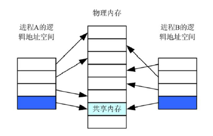
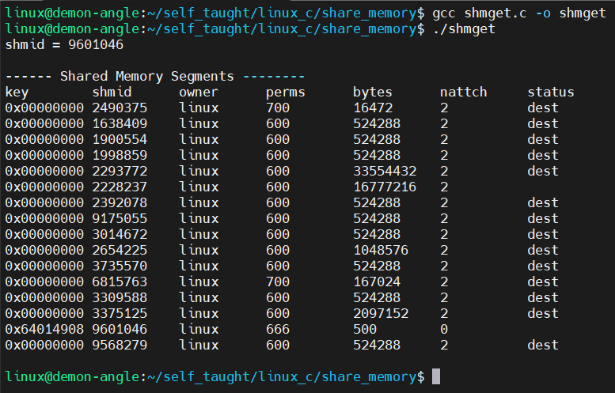
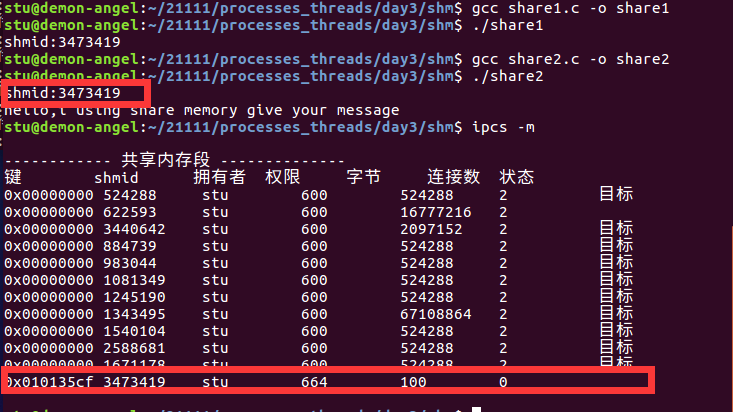
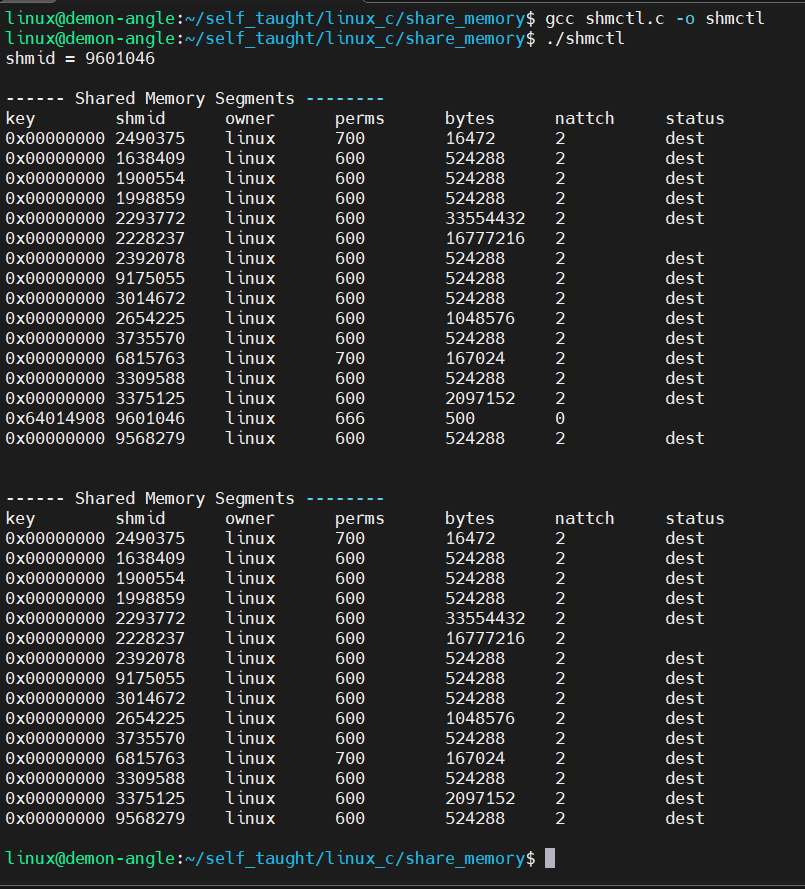

[toc]

# 1 共享内存

共享内存允许两个或者多个进程共享给定的存储区域。

可以说，==**共享内存时一种最为高效的进程间通信方式**==，因为，进程可以直接读写内存，不需要任何数据的复制。为了在多个进程间交换信息。内核专门留出了一块内存，这段内存可以由需要访问的进程将其映射到自己的私有地址空间。因此，进程就可以直接读写这一内存区而不要进行数据的复制，从而大大提高了效率。当然，由于多个进程共享一段内存，因此需要依靠某种同步机制，如互斥锁和信号量等。

## 1.1 共享内存的特点

1. 共享内存是进程间共享数据的一种最快的方法。

   一个进程向共享的内存区域写入了数据，共享这个内存区域的所有进程就可以立刻看到其中的内容。

2. 使用共享内存要注意的是多个进程之间对一个给定存储区访问的互斥

   若一个进程正在向共享内存区写数据，则在它做完这一步操作前，别的进程不应当去读、写这些数据。

## 1.2 共享内存示意图



总结：共享内存是进程间通信方式中效率最高的，原因在于进程间是直接在物理内存上进行操作，将物理地址映射到用户进程这，所以只要对其地址进行操作，就是直接对物理地址操作

## 1.3 使用shell命令操作共享内存

```shell
# 查看共享内存
ipcs -m
# 删除共享内存
ipcrm -m shmid
```

# 2 共享内存操作


## 2.1 获得一个共享存储标识符 -- shmget()

```c
/* 头文件 */
#include <sys/ipc.h>
#include <sys/shm.h>
/* 函数格式 */
int shmget(key_t key, size_t size, int shmflg);
/*
 * 功能：
 *      开辟一个System V共享内存段
 * 参数：
 *      key:是一个标识，由ftok函数获取
 *      size:共享内存段的大小
 *      shmflg:创建和拥有者的权限
 *             IPC_CREAT| 0664
 * 返回值：
 *      成功返回共享内存端的标识符，失败返回-1
 */
```


```c
#include <stdio.h>
#include <stdlib.h>
#include <unistd.h>
#include <sys/ipc.h>
#include <sys/shm.h>

int main(int argc, char const *argv[])
{
    /* 使用ftok函数获取键值 */
    key_t mykey;
    if (-1 == (mykey = ftok("./", 100)))
    {
        perror("fail to ftok");
        exit(1);
    }

    /* 通过shmget函数创建或者打开一个共享内存，返回一个共享内存的标识符 */
    int shmid;
    if (-1 == (shmid = shmget(mykey, 500, IPC_CREAT | 0666)))
    {
        perror("fail to shmget");
        exit(1);
    }

    
    printf("shmid = %d\n", shmid);
    system("ipcs -m");
    return 0;
}
```

result



## 2.2 共享内存映射(attach) -- shmat()

```c
/* 头文件 */
#include <sys/types.h>
#include <sys/shm.h>
/* 函数格式 */
void *shmat(int shmid, const void *shmaddr, int shmflg);
/*
 * 功能：
 *      将共享内存从内核态映射到用户态
 * 参数：
 *      shmid:从shmget获取来的自己的共享内存的id
 *      shmaddr:指定映射到的地址，一般为NULL
 *      shmflg:标志位
 *          0：共享内存具有可读可写权限
 *          SHM_RDONLY:只读
 * 返回值：
 *      成功返回映射到用户态的地址，
 *      失败返回-1
 * 注意：
 *      shmat函数使用的时候第二个和第三个参数一般设为NULL和0，
 *      即系统自动指定共享内存地址，并且共享内存可读可写
 */
```

## 2.3 解除共享内存映射(detach) -- shmdt()

```c
/* 头文件 */
#include <sys/types.h>
#include <sys/shm.h>
/* 函数格式 */
int shmdt(const void *shmaddr);
/*
 * 功能：
 *      取消共享内存映射（仅仅是断开联系，并不删除共享内存）
 * 参数：
 *      shmaddr:由shmat获取来内存映射后的地址
 * 返回值：
 *      成功返回0，
 *      失败返回-1
 */
```

## 2.4 实现共享内存的使用

```c
#include <stdio.h>
#include <string.h>
#include <sys/types.h>
#include <sys/ipc.h>
#include <sys/shm.h>

int main(int argc, const char *argv[])
{
	/* 在当前目录生成一个IPC */
	key_t key = ftok("./", 1);
	if(-1 == key)
	{
		puts("fail to ftok");
		return -1;
	}
	/* 使用shmget开辟一个共享内存段 */
	int shmid = shmget(key, 100, IPC_CREAT | 0664);
	printf("shmid:%d\n", shmid);
	if(shmid < 0)
	{
		puts("fail to shmget");
		return -1;
	}
	/* 使用shmat将共享内存从内核态映射到用户态 */
	char *shm_addr = NULL;
	shm_addr = shmat(shmid, NULL, 0);
	if(NULL == shm_addr)
	{
		printf("fail to shmat\n");
		return -1;
	}
	/* 清0 */
	memset(shm_addr, 0, 100);
	/* 向共享内存中写入数据 */
	strcpy(shm_addr, "hello,i using share memory give your message");
	/* 取消共享内存映射 */
	shmdt(shm_addr);
	return 0;
}
```

```c
#include <stdio.h>
#include <string.h>
#include <sys/types.h>
#include <sys/ipc.h>
#include <sys/shm.h>

int main(int argc, const char *argv[])
{
	/* 在当前目录生成一个IPC */
	key_t key = ftok("./", 1);
	if(-1 == key)
	{
		puts("fail to ftok");
		return -1;
	}

	/* 使用shmget开辟一个共享内存段 */
	int shmid = shmget(key, 100, IPC_CREAT | 0664);
	printf("shmid:%d\n", shmid);
	if(shmid < 0)
	{
		puts("fail to shmget");
		return -1;
	}

	/* 使用shmat将共享内存从内核态映射到用户态 */
	char *shm_addr = NULL;
	shm_addr = shmat(shmid, NULL, 0);
	if(NULL == shm_addr)
	{
		printf("fail to shmat\n");
		return -1;
	}
	/* 从共享内存中读取数据打印到终端中 */
	puts(shm_addr);
	/* 取消共享内存映射 */
	shmdt(shm_addr);
	return 0;
}
```

result



## 2.5 共享内存控制 -- shmctl()

```c
/* 头文件 */
#include <sys/ipc.h>
#include <sys/shm.h>
/* 函数格式 */
int shmctl(int shmid, int cmd, struct shmid_ds *buf);
/*
 * 功能：设置或者获取内存的属性
 * 参数：
 *      shmid:共享内存的id
 *      cmd:执行操作的命令
 *          IPC_STAT:获取共享内存的属性
 *          IPC_SET:设置共享内存的属性、
 *          IPC_RMID:删除共享内存
 *      buf:描述共享内存的msqid_ds结构类型变量的首地址，
 *          用来存放或者更改共享内存的属性
 * 返回值：
 *      成功：0
 *      失败：-1
 */
```

```c
#include <stdio.h>
#include <stdlib.h>
#include <unistd.h>
#include <sys/ipc.h>
#include <sys/shm.h>

int main(int argc, char const *argv[])
{
    /* 使用ftok函数获取键值 */
    key_t mykey;
    if (-1 == (mykey = ftok("./", 100)))
    {
        perror("fail to ftok");
        exit(1);
    }

    /* 通过shmget函数创建或者打开一个共享内存，返回一个共享内存的标识符 */
    int shmid;
    if (-1 == (shmid = shmget(mykey, 500, IPC_CREAT | 0666)))
    {
        perror("fail to shmget");
        exit(1);
    }

    printf("shmid = %d\n", shmid);
    system("ipcs -m");

    /* 通过shmctl函数删除共享内存 */
    if (-1 == (shmctl(shmid, IPC_RMID, NULL)))
    {
        perror("fail to shmctl");
        exit(1);
    }

    system("ipcs -m");
    return 0;
}
```

result



# 3 共享内存的实现

1. 创建共享内存，这里用到的函数是shmget(),也就是从内存获得一段共享内存区域。
2. 映射共享内存，也就是把这段创建的共享内存映射到具体的进程空间中，这里使用的函数是shmat()。到这里就可以使用这段共享内存了，也就是可以使用 不带缓冲的I/O读写命令对其操作。
3. 撤销映射，使用shmdt()函数。
3. 控制消息队列使用的函数时shmctl()，它可以完成更多项功能
