[toc]

# 1 安装线程相关函数manual

```shell
sudo apt-get install manpages-posix
sudo apt-get install manpages-posix-dev
```

# 2 线程概述

## 2.1 线程的概念

线程（英语：thread）是操作系统能够进行运算调度的最小单位。它被包含在进程中，是进程中的实际运作单位。一条线程指的是进程中一个单一顺序的控制流，一个进程中可以并发多个线程，每条线程并行执行不同的任务。在Unix System V及SunOS中也被称为轻量进程（lightweight processes），但轻量进程更多指内核线程（kernel thread），而把用户线程（user thread）称为线程。

```
每个进程都拥有自己的数据段，代码段和堆栈段，这就造成进程在创建、切换、撤销操作时，需要较大的系统开销
为了减少系统开销，从进程中演化出了线程
线程存在于进程中，共享进程的资源
线程是进程中的独立控制流，由环境（包括寄存器组和程序计数器）和一系列的执行指令组成
每个进程有一个地址空间和一个控制线程
```

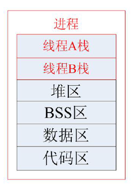


### 2.1.1 特点

1. 线程没有独立虚拟地址空间，是共享进程的地址空间
2. 线程是动态的，有调度概念
3. 在多核CPU中，线程技术可以实现真并发

## 2.2 什么时候使用线程

有并发需求，且隔离性要求不高时

多核CPU或者多CPU设备，可以使用多线程提高机器利用率

## 2.3 多线程共享哪些资源，哪些资源是线程私有的

线程的访问非常自由，它可以访问进程内存里的所有数据，甚至包括其他线程的堆栈(如果它知道线程的堆栈地址，那么这就很少见的情况)，但实际运用中线程也拥有自己的私有存储空间，包括以下几个方面：
-  栈(尽管并非完全无法被其他线程访问，但一般情况下仍然可以认为是私有的数据。)
- 线程局部存储(Thread Local Storage, TLS)。线程局部存储是某些操作系统为线程单独提供的私有空间，但通常只具有很有限的容量。
- 寄存器(包括PC寄存器)，寄存器是执行流的基本数据，因此为线程私有。

| 线程私有                                                  | 线程共享                                                     |
| --------------------------------------------------------- | ------------------------------------------------------------ |
| 局部变量<br />线程处理函数参数<br />TLS数据(线程局部存储) | 全局变量<br />堆上的数据<br />函数中的静态变量<br />程序代码，任何线程都有权力读取并执行任何代码<br />打开的文件，A线程打开的文件，可以由B线程使用 |

## 2.4 线程和进程的比较

### 2.4.1 调度

线程是CPU调度和分派的最小单元

### 2.4.2 拥有资源

进程是系统中程序执行和资源分配的基本单位

线程自己一般不拥有资源（除了必不可少的程序计数器，一组寄存器和栈），但它可以去访问其所属进程的资源，如进程代码段，数据段以及系统资源（已打开的文件，I/O设备等）

### 2.4.3 系统开销

同一个进程中的多个线程可共享同一地址空间，因此他们之间的同步和通信的实现也变得比较容易。

在进程切换的时候，涉及到整个当前进程CPU环境的保存以及被新调度运行的进程的CPU环境的设置；而线程切换只需要保存和设置少量寄存器的内容，并不涉及存储器管理方面的操作，从而能更有效地使用系统资源和提高系统的吞吐量。

### 2.4.4 并发性

不仅进程间可以并发执行，而且在一个进程中的多个线程之间也可以并发执行。

### 2.4.5 总结

一般把线程称之为轻量级的进程

一个进程可以创建多个线程，多个线程共享一个进程的资源

每一个进程创建的时候系统会给其4G虚拟内存，3G用户空间是私有的，所以进程切换时，用户空间也会切换，所以会增加系统开销，而一个进程中的多个线程共享一个进程的资源，所以线程切换时不用切换这些资源，效率会更高。

==**线程的调度机制跟进程是一样的，多个线程来回切换运行**==

## 2.5 进程和线程的区别

| 对比项                 | 进程                 | 线程                 |
| :--------------------- | :------------------- | :------------------- |
| 概念                   | 是资源分配的基本单位 | 是CPU调度的最小单元  |
| 是否可以调度           | 可以                 | 可以                 |
| 需要分配内存地址空间吗 | 需要                 | 不需要               |
| 是真并发吗             | 伪并发               | 多核CPU真并发        |
| 什么时候使用           | 并发且隔离性有要求   | 并发且隔离性没有要求 |

## 2.6 多线程的用处

使用多线程的目的主要有以下几点：

1. 多任务程序的设计

   一个程序可能要处理不同应用，要处理多种任务，如果开发不同的进程来处理，系统开销很大，数据共享，程序结构都不方便，这时可使用多线程编程方法。

2. 并发程序的设计

   一个任务可能分成不同的步骤去完成，这些不同的步骤之间可能是松散耦合，可能通过线程的互斥，同步并发完成，这样可以为不同的任务步骤建立线程。

3. 网络程序的设计

   为提高网络的利用效率，我们可能使用多线程，随每一个连接用一个线程去处理。

4. 数据共享

   同一个进程中的不同线程共享进程的数据空间，方便不同线程间的数据共享。

5. 在多核CPU系统中，实现真正的并发

# 3 线程的基本操作

```markdown
## pthread_join
并不是关闭线程，而是线程退出后，回收线程资源，阻塞
## phtread_detach
销毁线程，并让操作系统自动回收线程资源，不阻塞
## phtread_cancel
是一个建议函数，不一定能被执行
## pthread_exit
线程自己想退出时调用，跟return写在线程处理函数中作用一样。

这几个函数中：***只有pthread_detach不需要pthread_join回收资源***。线程任务正常结束，return，pthread_cancel，pthread_exit用这些手段退出的，都需要pthread_join去回收线程资源。
```

## 3.1 线程的创建 -- pthread_create()

```c
/* 头文件 */
#include <pthread.h>
/* 函数格式 */
int pthread_create(pthread_t *thread, const pthread_attr_t *attr, void *(*start_routine)(void *), void *arg);
/*
 * 功能：创建一个新的线程
 * 参数：
 *		thread:线程标识的首地址
 *		attr:线程配置参数的首地址，一般默认给NULL
 *		start_routine:这是线程处理函数的函数指针，指向的函数类型为，返回值和参数都是void *的参数
 *		arg:线程处理函数的参数
 * 返回值：
 *      成功返回0，
 *      失败返回错误码
 */
```

### 3.1.1 注意

与fork不同的是pthread_create创建的线程不与父进程在同一点开始运行，而是从指定的函数开始运行，该函数运行完后，该线程也就退出了。

线程依赖进程存在，如果创建线程的进程结束了，线程也就结束了。

线程函数的程序在pthread库中，故链接时要加上参数`-lpthread`

```c
#include <stdio.h>
#include <stdlib.h>
#include <pthread.h>

/*
 * 由于线程库原本不是系统本身的，
 * 所以在链接时需要手动链接库文件
 * gcc *.c -lpthread
 */

void *thread_fun(void *arg)
{
    printf("子进程正在运行\n");
}

int main(int argc, char const *argv[])
{
    printf("主控线程正在执行\n");

    pthread_t thread;
    /* 通过pthread_create函数创建子进程 */
    if (pthread_create(&thread, NULL, thread_fun, NULL) != 0)
    {
        perror("fail to pthread_create");
        exit(1);
    }
    /* 由于进程结束后，进程中的所有的线程都会强制退出，所以现阶段不要让进程退出 */
    while(1);
    return 0;
}
```

result

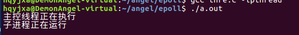

### 3.1.2 线程调度机制的验证

```c
#include <stdio.h>
#include <stdlib.h>
#include <pthread.h>
#include <unistd.h>

/*
 * 一个进程中的多个线程执行的顺序时不确定的，没有先后顺序可言
 * 多线程执行时跟进程一样，是来回切换运行的，跟进程的调度机制一样
 */

/* 线程处理函数1 */
void *thread_fun1(void *arg)
{
    printf("子进程1正在运行\n");
    sleep(1);
    printf("*******************************\n");
}

/* 线程处理函数2 */
void *thread_fun2(void *arg)
{
    printf("子线程2正在运行\n");
    sleep(1);
    printf("-------------------------------\n");
}

int main(int argc, char const *argv[])
{
    printf("主控线程正在执行\n");

    pthread_t thread;
    /* 通过pthread_create函数创建子进程 */
    if (pthread_create(&thread, NULL, thread_fun1, NULL) != 0)
    {
        perror("fail to pthread_create");
        exit(1);
    } 

    if (pthread_create(&thread, NULL, thread_fun2, NULL) != 0)
    {
        perror("fail to pthread_create");
        exit(1);
    }
    /* 由于进程结束后，进程中的所有的线程都会强制退出，所以现阶段不要让进程退出 */
    while (1);
    return 0;
}
```

result

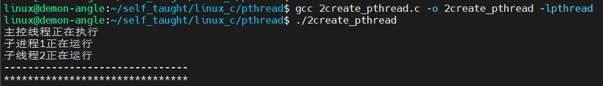

### 3.1.3 线程处理函数的传参

```c
#include <stdio.h>
#include <stdlib.h>
#include <pthread.h>
#include <unistd.h>

/*
 * 线程处理函数可以认为就是一个普通的全局函数，只不过与普通函数最大的区别
 * 在于，线程处理函数时并行执行，来回交替执行，但是普通函数一定时按照顺序一个一个执行
 */
int num = 100;
/* 线程处理函数1 */
void *thread_fun1(void *arg)
{
    printf("子进程1：num = %d\n", num);
    num++;
    int n = *(int *)arg;
    printf("1 n = %d\n", n);
    *(int *)arg = 111;
}

/* 线程处理函数2 */
void *thread_fun2(void *arg)
{
    sleep(1);
    printf("子进程2：num = %d\n", num);
    int n = *(int *)arg;
    printf("2 n = %d\n", n);
}

int main(int argc, char const *argv[])
{
    printf("主控线程正在执行\n");

    pthread_t thread;
    int a = 666;
    /* 通过pthread_create函数创建子进程 */
    if (pthread_create(&thread, NULL, thread_fun1, (void *)&a) != 0)
    {
        perror("fail to pthread_create");
        exit(1);
    } 

    if (pthread_create(&thread, NULL, thread_fun2, (void *)&a) != 0)
    {
        perror("fail to pthread_create");
        exit(1);
    }
    /* 由于进程结束后，进程中的所有的线程都会强制退出，所以现阶段不要让进程退出 */
    while (1)
        ;
    return 0;
}
```

result

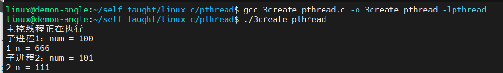


## 3.2 线程的等待 -- pthread_join()
```c
/* 头文件 */
#include <pthread.h>
/* 函数格式 */
int pthread_join(pthread_t thread, void **retval);
/*
 * 功能：
 *      回收线程资源
 *      阻塞等待一个子线程的退出，可以接收某一个子线程调用pthread_exit时
 *      设置的退出状态值
 * 参数：
 *		thread:被回收的线程的标识符
 *		retval:接收线程处理函数返回值的变量的指针，如果不接受则设置为NULL
 * 返回值：
 *      成功返回0，
 *      失败返回错误码
 */
```

### 3.2.1 通过pthread_join函数等待子线程退出

```c
#include <stdio.h>
#include <stdlib.h>
#include <pthread.h>
#include <unistd.h>

/* 线程处理函数 */
void *thread_fun(void *arg)
{
    printf("子进程正在运行\n");
    sleep(3);
    printf("子线程要退出了\n");
}

int main(int argc, char const *argv[])
{
    printf("主控线程正在执行\n");

    pthread_t thread;
    /* 通过pthread_create函数创建子进程 */
    if (pthread_create(&thread, NULL, thread_fun, NULL) != 0)
    {
        perror("fail to pthread_create");
        exit(1);
    }

    /* 通过调用pthread_join函数阻塞等待子线程退出 */
    if (pthread_join(thread, NULL) != 0)
    {
        perror("fail to pthread_join");
        exit(1);
    }
    printf("进程要退出了\n");
    return 0;
}
```
result

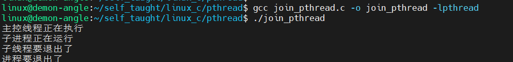

### 3.2.2 通过pthread_join获取子线程的退出状态值

```c
#include <stdio.h>
#include <stdlib.h>
#include <pthread.h>
#include <unistd.h>

/* 线程处理函数 */
void *thread_fun(void *arg)
{
    static int num = 666;
    printf("子进程正在运行\n");
    sleep(3);
    printf("子线程要退出了\n");
    /* 子线程如果要返回退出状态，可以通过返回值或者通过pthread_exit函数 */
    return (void *)&num;
}

int main(int argc, char const *argv[])
{
    printf("主控线程正在执行\n");

    pthread_t thread;
    /* 通过pthread_create函数创建子进程 */
    if (pthread_create(&thread, NULL, thread_fun, NULL) != 0)
    {
        perror("fail to pthread_create");
        exit(1);
    }

    int *num;
    if (pthread_join(thread, (void **)&num) != 0)
    {
        perror("fail to pthread_join");
        exit(1);
    }
    printf("ret_val = %d\n", *num);
    printf("进程要退出了\n");
    return 0;
}
```

result

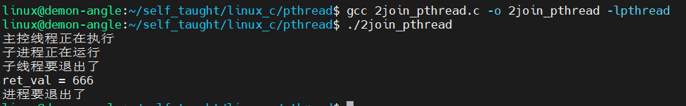

## 3.3 线程分离 -- pthread_detach()

linux线程执行和windows不同，pthread有两种状态：

可结合的（joinable）或者是分离的（detached），线程默认创建为可结合态。如果线程是joinable状态，当线程函数自己返回退出时或pthread_exit时都不会释放线程所占用堆栈和线程描述符（总计8K多）。只有当你调用了pthread_join之后这些资源才会被释放。

创建一个线程后应回收资源，但使用pthread_join函数会使调用者阻塞，故linux提供了线程分离函数：pthread_detach()

```c
/* 头文件 */
#include <pthread.h>
/* 函数格式 */
int pthread_detach(pthread_t thread);
/*
 * 功能：
 *      使调用进程与当前进程分离，使其成为一个独立的线程，
 *      该线程终止时，系统将自动回收它的资源
 * 参数：
 *      thread:指定的子线程的id
 * 返回值：
 *      成功：0
 *      失败：返回错误码
 */
```

注意：

==**一个进程中的多个线程是共享该进程的数据段，因此，通常线程退出后所占用的资源并不会释放。如果要释放资源，结合态需要通过pthread_join函数，分离态则自动释放。**==

```c
#include <stdio.h>
#include <stdlib.h>
#include <pthread.h>
#include <unistd.h>

/* 线程处理函数 */
void *thread_fun(void *arg)
{
    static int num = 666;
    printf("子进程正在运行\n");
    sleep(3);
    printf("子线程要退出了\n");
}

int main(int argc, char const *argv[])
{
    printf("主控线程正在执行\n");

    pthread_t thread;
    /* 通过pthread_create函数创建子进程 */
    if (pthread_create(&thread, NULL, thread_fun, NULL) != 0)
    {
        perror("fail to pthread_create");
        exit(1);
    }
    /*
     * 通过pthread_detach函数将子线程设置为分离态，
     * 即不用阻塞，也可以自动回收子进程退出的资源
     */
    if (pthread_detach(thread) != 0)
    {
        perror("fail to pthread_detach");
        exit(1);
    }

    /*
     * 如果原本子线程是结合态，需要通过pthread_join函数回收子线程退出的资源，
     * 但是这个函数是一个阻塞函数，如果子线程不退出，就会导致当前进程（主控线程）
     * 无法继续执行，大大限制了代码的运行效率
     * 如果子线程已经设置为分离态，就不需要使用pthread_join了
     */

#if 0
    if (pthread_join(thread, NULL) != 0)
    {
        perror("fail to pthread_join");
        exit(1);
    }
#endif

    while (1)
    {
        printf("hello world\n");
        sleep(1);
    }
    return 0;
}
```
result

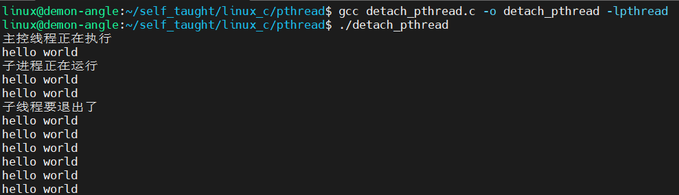


## 3.4 线程退出 -- pthread_exit()
```c
/* 头文件 */
#include <pthread.h>
/* 函数格式 */
void pthread_exit(void *retval);
/*
 * 功能：
 *       退出正在执行的线程
 * 参数：
 *       retval:当前线程的退出状态
 *       这个值可以被调用pthread_join函数的线程接收到
 * 返回值：
 *       无
 */
```

```c
#include <stdio.h>
#include <stdlib.h>
#include <pthread.h>
#include <unistd.h>

void *thread_fun(void *arg)
{
    printf("子进程正在运行\n");
    static char buf[] = "this thread has quited";

    int i;
    for (i = 0; i < 10; i++)
    {
        if (i == 5)
        {
            /* 通过pthread_exit函数退出当前线程 */
            pthread_exit(buf);
        }
        printf("**********************\n");
        sleep(1);
    }
}

int main(int argc, char const *argv[])
{
    printf("主控线程正在执行\n");

    pthread_t thread;
    /* 通过pthread_create函数创建子进程 */
    if (pthread_create(&thread, NULL, thread_fun, NULL) != 0)
    {
        perror("fail to pthread_create");
        exit(1);
    }
    char *str;
    pthread_join(thread, (void **)&str);
    printf("str = %s\n", str);
    printf("进程要退出了\n");
    return 0;
}
```
result

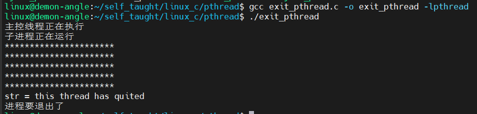

## 3.5 线程取消

### 3.5.1 pthread_canel()

```c
/* 头文件 */
#include <pthread.h>
/* 函数格式 */
int pthread_cancel(pthread_t thread);
/*
 * 功能：
 *      取消线程
 * 参数：
 *      thread:要销毁的线程的id
 * 返回值：
 *      成功：0
 *      失败：非0
 */
```

```markdown
pthread_cancel函数的实质是发信号给目标线程thread，使目标线程退出。此函数只是发送终止信号给目标线程，不会等待取消目标线程执行完才返回。
然而发送成功并不意味着目标线程一定就会终止，线程被取消时，线程的取消属性会决定能否被取消以及何时被取消。

# 线程的取消状态
即线程能不能被取消
# 线程取消点
即线程被取消的地方
# 线程的取消类型
在线程被取消的状态下，是立马被取消结束还是执行到取消点的时候被取消结束
```

```c
#include <stdio.h>
#include <pthread.h>
#include <unistd.h>
#include <stdlib.h>

/* 线程处理函数 */
void *pthread_fun(void *arg)
{
    while (1)
    {
        printf("子线程正在运行\n");
        sleep(1);
    }
}

int main(int argc, char const *argv[])
{
    pthread_t thread;
    if (pthread_create(&thread, NULL, pthread_fun, NULL) != 0)
    {
        perror("fail to pthread_create");
        exit(1);
    }

    /* 通过调用pthread_cancel函数取消另一个进程 */
    sleep(3);
    pthread_cancel(thread);

    pthread_join(thread, NULL);
    return 0;
}
```

result

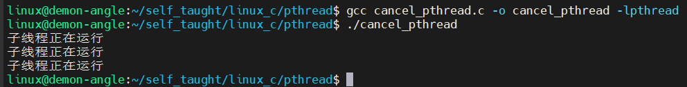

### 3.5.2 pthread_setcancelstate()

#### 3.5.2.1 线程的取消状态

在linux系统下，线程默认可以被取消，编程时可以通过pthread_setcancelstate函数设置线程是否可以被取消。

```c
/* 头文件 */
#include <pthread.h>
/* 函数格式 */
int pthread_setcancelstate(int state, int *oldstate);
/*
 * 功能：
 *      设置线程是否被取消
 * 参数：
 *      state:新的状态
 *          PTHREAD_CANCEL_DISABLE:不可以被取消
 *          PTHREAD_CANCEL_ENABLE:可以被取消
 *      oldstate:保存调用线程原来的可取消状态的内存地址
 * 返回值:
 *      成功：0
 *      失败：非0          
 */
```

```c
#include <stdio.h>
#include <stdlib.h>
#include <pthread.h>
#include <unistd.h>

void *thread_fun(void *arg)
{
	/* 通过pthread_setcancelstate设置取消的状态 */
	/* 设置为可以取消 */
	pthread_setcancelstate(PTHREAD_CANCEL_ENABLE, NULL);
	/* 设置为不可取消 */
	// pthread_setcancelstate(PTHREAD_CANCEL_DISABLE, NULL);
	while(1)
	{
		printf("子进程正在运行\n");
		sleep(1);
	}
}

int main(int argc, char const *argv[])
{
	printf("主控线程正在执行\n");
	pthread_t thread;
    
	/* 通过pthread_create函数创建子进程 */
	if (pthread_create(&thread, NULL, thread_fun, NULL) != 0)
	{
		perror("fail to pthread_create");
		exit(1);
	}
	sleep(3);
	pthread_cancel(thread);
	pthread_join(thread, NULL);
	return 0;
}
```

result

设置为可以取消

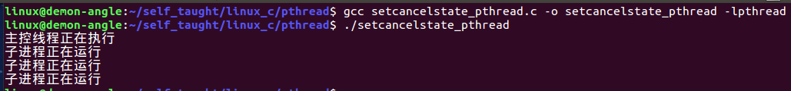

设置为不可取消

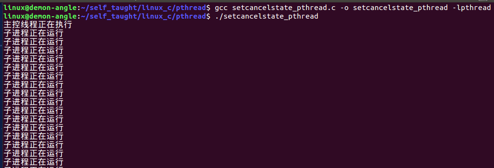

### 3.5.3 pthread_testcancel()

#### 3.5.3.1 线程取消点

线程被取消后，该线程并不是马上终止，默认情况下线程执行到取消点时才能被终止。编程时可以通过pthread_testcancel函数设置线程的取消点。

当别的线程取消调用此函数的线程时候，被取消的线程执行到此函数时结束。

```c
/* 头文件 */
#include <pthread.h>
/* 函数格式 */
void pthread_testcancel(void);
/*
 * 功能：
 *      设置线程的取消点
 * 参数：
 *      无
 * 返回值：
 *      无
 */
```

```c
#include <stdio.h>
#include <stdlib.h>
#include <pthread.h>
#include <unistd.h>

void *thread_fun(void *arg)
{
	while(1)
	{
		printf("子进程正在运行\n");
		sleep(1);
		pthread_testcancel();
	}
}

int main(int argc, char const *argv[])
{
	printf("主控线程正在执行\n");

	pthread_t thread;
	/* 通过pthread_create函数创建子进程 */
	if (pthread_create(&thread, NULL, thread_fun, NULL) != 0)
	{
		perror("fail to pthread_create");
		exit(1);
	}

	sleep(3);
	pthread_cancel(thread);

	pthread_join(thread, NULL);
	return 0;
}
```

result

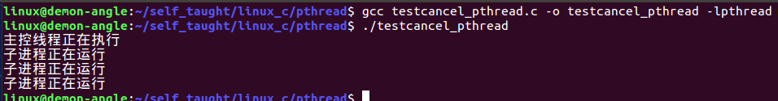

### 3.5.4 pthread_setcanceltype()

#### 3.5.4.1 线程的取消类型

线程被取消后，该线程并不是马上终止，默认情况下线程执行到消点才能被终止。编程时可以通过pthread_setcanceltype函数设置线程是否可以立即被取消。

```c
/* 头文件 */
#include <pthread.h>
/* 函数格式 */
int pthread_setcanceltype(int type, int *oldtype);
/*
 * 功能：设置线程是否可以立即被取消
 * 参数：
 *      type:类型
 *          PTHREAD_CANCEL_ASYNCHRONOUS:立即取消
 *          PTHREAD_CANCEL_DEFERRED:不立即被取消
 *      oldtype:保存调用线程原来的可取消类型的内存地址
 * 返回值：
 *      成功：0
 *      失败：非0
 */
```

```c
#include <stdio.h>
#include <stdlib.h>
#include <pthread.h>
#include <unistd.h>

void *thread_fun(void *arg)
{
    /* 通过pthread_setcancelstate设置取消的状态 */
    /* 设置为可以取消 */
    pthread_setcancelstate(PTHREAD_CANCEL_ENABLE, NULL);

    /* 设置线程取消的类型 */
    /* 设置为立即取消 */
    // pthread_setcanceltype(PTHREAD_CANCEL_ASYNCHRONOUS, NULL);
    /* 设置为不立即取消 */
    pthread_setcanceltype(PTHREAD_CANCEL_DEFERRED, NULL);
    while (1)
    {
        printf("子进程正在运行\n");
        sleep(1);
    }
}

int main(int argc, char const *argv[])
{
    printf("主控线程正在执行\n");

    pthread_t thread;
    /* 通过pthread_create函数创建子进程 */
    if (pthread_create(&thread, NULL, thread_fun, NULL) != 0)
    {
        perror("fail to pthread_create");
        exit(1);
    }

    sleep(3);
    pthread_cancel(thread);

    pthread_join(thread, NULL);
    return 0;
}
```

result

设置立即取消

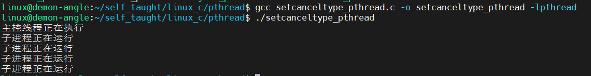

设置不立即取消

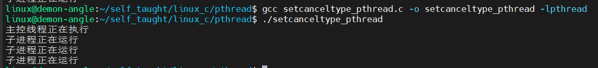

## 3.6 线程退出清理函数

和进程的退出清理一样，线程也可以注册它退出时要调用的函数，这样的函数称为线程处理程序（thread cleanup handler）

1. ==**线程可以建立多个清理处理程序**==
2. ==**处理程序在栈中，故它们的执行顺序与它们注册时的顺序相反**==

### 3.6.1 当线程执行以下动作时会调用清理函数

1. 调用pthread_exit退出线程
2. 响应其他线程的取消请求
3. 用非零execute调用pthread_cleanup_pop

### 3.6.2 pthread_cleanup_push()

```c
/* 头文件 */
#include <pthread.h>
/* 函数格式 */
void pthread_cleanup_push(void (*routine)(void *),
                          void *arg);
/* 
 * 功能：
 *      将清除函数压栈。即注册清理函数
 * 参数：
 *      routine：线程清理函数的指针
 *      arg:传给线程清理函数的参数
 * 返回值：
 *      无
 */
```

### pthread_cleanup_pop()

```c
/* 头文件 */
#include <pthread.h>
/* 函数格式 */
void pthread_cleanup_pop(int execute);
/* 
 * 功能：
 *      将清除函数弹栈。即删除清理函数
 * 参数：
 *      execute：线程清理函数执行标志位
 *          非0，弹出清理函数，执行清理函数
 *          0，弹出清理函数，不执行清理函数
 * 返回值：
 *      无
 */
```
==**注意push与pop必须配对使用，即使pop执行不到**==

### 3.6.3 验证线程调用pthread_exit函数时，系统自动调用线程清理函数

```c
#include <stdlib.h>
#include <string.h>
#include <stdio.h>
#include <pthread.h>
#include <unistd.h>

void mycleanup(void *arg)
{
    printf("clean up ptr = %s\n", (char *)arg);
    free((char *)arg);
}

void *thread(void *arg)
{
    /* 建立线程清理程序 */
    printf("this is new thread\n");

    char *ptr = NULL;
    ptr = (char *)malloc(100);
    pthread_cleanup_push(mycleanup, (void *)(ptr));
    bzero(ptr, 100);
    strcpy(ptr, "memory from malloc");
    sleep(3);
    printf("before exit\n");
	pthread_exit(NULL);
    /* 注意push与pop必须配对使用，即使pop执行不到 */
    printf("before pop\n");
    pthread_cleanup_pop(1);
}

int main(int argc, char const *argv[])
{
    pthread_t tid;
    /* 创建一个线程 */
    pthread_create(&tid, NULL, thread, NULL);

    pthread_join(tid, NULL);
    printf("process is dying\n");
    return 0;
}
```

result

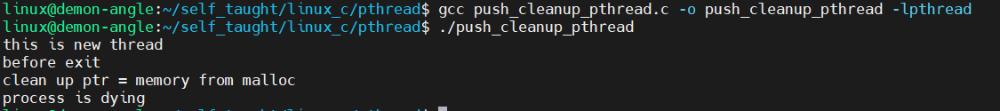

### 3.6.4 验证线程被取消时，系统自动调用线程清理函数

```c
#include <stdlib.h>
#include <string.h>
#include <stdio.h>
#include <pthread.h>
#include <unistd.h>

void mycleanup(void *arg)
{
    printf("clean up ptr = %s\n", (char *)arg);
    free((char *)arg);
}

void *thread(void *arg)
{
    /* 建立线程清理程序 */
    printf("this is new thread\n");

    char *ptr = NULL;
    ptr = (char *)malloc(100);
    pthread_cleanup_push(mycleanup, (void *)(ptr));
    bzero(ptr, 100);
    strcpy(ptr, "memory from malloc");
    sleep(10);

    /* 注意push与pop必须配对使用，即使pop执行不到 */
    printf("before pop\n");
    pthread_cleanup_pop(1);
    return NULL;
}

int main(int argc, char const *argv[])
{
    pthread_t tid;
    /* 创建一个线程 */
    pthread_create(&tid, NULL, thread, NULL);
    sleep(5);

    printf("before cancel\n");
    /* 子线程响应pthread_cancel后，会执行线程处理函数 */
    pthread_cancel(tid);
    pthread_join(tid, NULL);
    printf("process is dying\n");
    return 0;
}
```

result

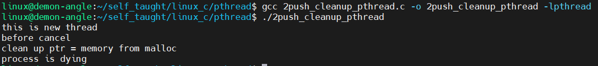

### 3.6.5 验证调用pthread_cleanup_pop函数时，系统自动调用线程清理函数

```c
#include <stdlib.h>
#include <string.h>
#include <stdio.h>
#include <pthread.h>
#include <unistd.h>

void cleanup_func1(void *arg)
{
    printf("in cleanup func1\n");
    printf("clean up ptr = %s\n", (char *)arg);
    free((char *)arg);
}

void cleanup_func2(void *arg)
{
    printf("in cleanup func2\n");
}

void *thread(void *arg)
{
    /* 建立线程清理程序 */
    printf("this is new thread\n");

    char *ptr = NULL;
    ptr = (char *)malloc(100);
    pthread_cleanup_push(cleanup_func1, (void *)(ptr));
    pthread_cleanup_push(cleanup_func2, NULL);
    bzero(ptr, 100);
    strcpy(ptr, "memory from malloc");

    /* 注意push与pop必须配对使用，即使pop执行不到 */
    sleep(3);
    printf("before pop\n");
    pthread_cleanup_pop(1);
    printf("before pop\n");
    pthread_cleanup_pop(1);
    return NULL;
}

int main(int argc, char const *argv[])
{
    pthread_t tid;
    /* 创建一个线程 */
    pthread_create(&tid, NULL, thread, NULL);
    pthread_join(tid, NULL);
    printf("process is dying\n");
    return 0;
}
```

result

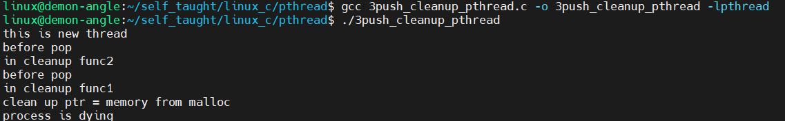

