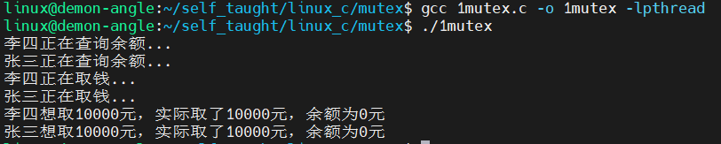
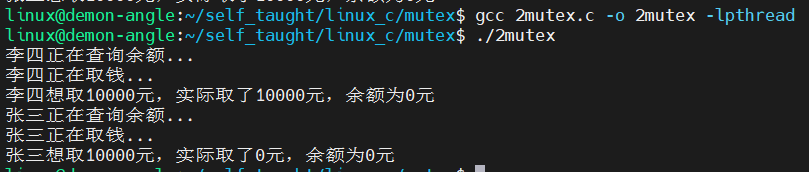
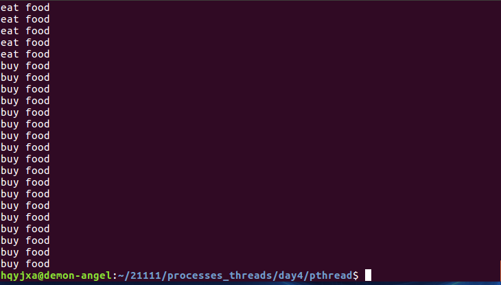
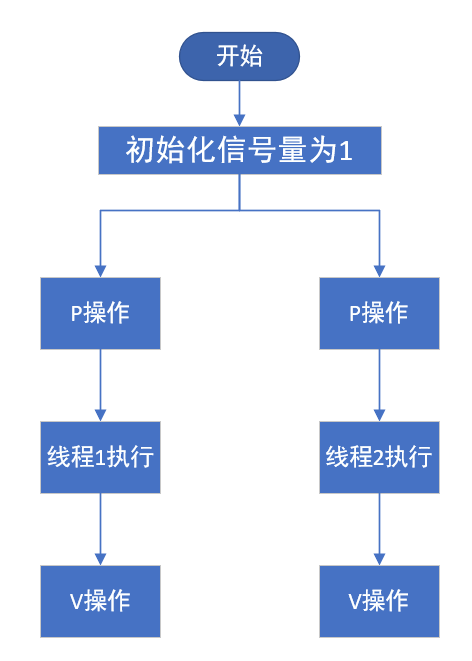
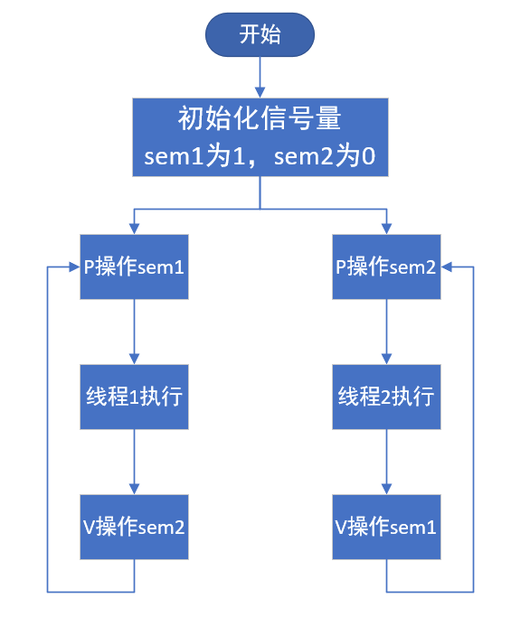
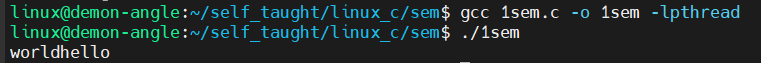
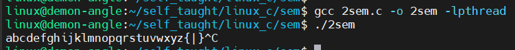
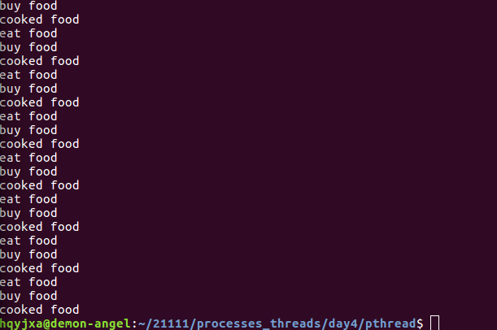

[toc]

# 1 同步互斥概述

在多任务操作系统中，同时运行的多个任务可能都需要访问/使用同一种资源。

多个任务之间有依赖关系，某个任务的运行依赖于另一个任务

同步和互斥就是用于解决这两个问题的

## 1.1 互斥

一个公共资源同一时刻只能被一个进程或线程使用，多个进程或线程不能同时使用公共资源。POSIX标准中进程和线程同步和互斥的方法，主要有==**互斥锁和信号量**==两种方式。

## 1.2 同步

两个或两个以上的进程或线程在运行过程中协同步调，按预定的先后次序运行。

## 1.3 临界资源

多线程或多进程共享的资源

## 1.4 临界区

进程或线程操作共享资源的代码段

## 1.5 竞态问题

多进程或多线程在共享数据时，对共享数据进行操作时，容易发生冲突，我们把这类问题称为竞态问题。

- 读和读是不会产生竞态关系的
- 读和写是会产生竞态关系的
- 写和写是会产生竞态关系的

==**读写互斥，写写互斥，读读不互斥**==

### 1.5.1 解决竞态问题的手段

1. 同步手段：按照一定顺序来访问临界资源

   实现同步的手段(进程)：

   - 有名信号量

   - 或者通过其他手段获取一个状态量

   - 或者通过信号保证一个顺序

2. 互斥手段：通过锁的机制来实现临界资源的安全性问题

   - 锁
   - 二值有名信号量

## 1.6 线程同步和互斥的区别

| 对比项   | 线程同步                                   | 线程互斥                       |
| :------- | :----------------------------------------- | :----------------------------- |
| 是什么   | 多线程间有序访问临界资源并保证资源的安全性 | 只保证资源访问的安全性问题     |
| 实现手段 | 信号量、全局flag                           | 互斥锁（二值信号量、全局flag） |

1.  互斥是指某一资源同时只允许一个访问者对其进行访问，具有唯一性和排它性。但互斥无法限制访问者对资源的访问顺序，即访问是无序的。
2. 同步是指在互斥的基础上（大多数情况），通过其它机制实现访问者对资源的有序访问。
3. 同步其实已经实现了互斥，所以同步是一种更为复杂的互斥。
4. 互斥是一种特殊的同步。

所谓互斥，就是不同线程通过竞争进入临界区（共享的数据和硬件资源），为了防止访问冲突，在有限的时间内只允许其中之一独占性的使用共享资源。如不允许同时写

同步关系则是多个线程彼此合作，通过一定的逻辑关系来共同完成一个任务。一般来说，同步关系中往往包含互斥，同时对临界区的资源会按照某种逻辑顺序进行访问。如先生产后使用

==**总的来说，两者的区别就是**==：
互斥是通过竞争对资源的独占使用，彼此之间不需要知道对方的存在，执行顺序是一个乱序。

同步是协调多个相互关联线程合作完成任务，彼此之间知道对方存在，执行顺序往往是有序的。

lock与unlock方法，替换synchronized，这就是互斥锁的体现。消费者生产者模式就是同步锁的体现。

# 2 互斥锁

## 2.1 互斥锁的概念

mutex是一种简单的加锁的方法来控制对共享资源的访问，==**mutex只有两种状态，即上锁(lock)和解锁(unlock)**==

在访问该资源前，首先应申请mutex，如果mutex处于unlock状态，则会申请到mutex并立即lock;

如果mutex处于lock状态，则默认阻塞申请者。

unlock操作应该由lock者进行。

## 2.2 互斥锁/线程锁

互斥锁必须自己加锁，自己解锁，不能让别人解

跟信号量不同，别的线程减下去的信号量，可以由另一个线程加上去。

互斥只保证资源的安全性，不保证访问的有序性。

## 2.3 互斥锁的使用

- 创建锁（全局的锁，要不然不是线程共享的）
- 加锁（访问临界资源（临界区））
- 解锁
- 销毁锁

## 2.4 互斥锁的操作

### 2.4.1 初始化互斥锁

mutex用pthread_mutex_t数据类型表示，在使用互斥锁前，必须先对它进行初始化。

#### 2.4.1.1 静态分配的互斥锁

`pthread_mutex_t mutex = PTHREAD_MUTEX_INITIALIZER;`

#### 2.4.1.2 动态分配互斥锁

`pthread_mutex_t mutex;`

`pthread_mutex_init(&mutex, NULL);`

在所有使用过此互斥锁的线程都不再需要使用时候，应调用pthread_mutex_destory销毁互斥锁。

```c
/* 头文件 */
#include <pthread.h>
/* 函数格式 */
int pthread_mutex_init(pthread_mutex_t *restrict mutex,
                       const pthread_mutexattr_t *restrict attr);
/*
 * 功能:
 *      初始化一个互斥锁
 * 参数：
 *      mutex:指定的互斥锁
 *      mutexattr:互斥锁的属性，为NULL表示默认属性
 * 返回值：
 *      成功返回0
 *      失败返回错误码
 */
```

### 2.4.2 互斥锁上锁

```c
/* 头文件 */
#include <pthread.h>
/* 函数格式 */
int pthread_mutex_lock(pthread_mutex_t *mutex);
/* 
 * 功能：
 *      对互斥锁上锁，若已经上锁，则调用者一致阻塞到互斥锁解锁
 * 参数：
 *      mutex:指定的互斥锁
 * 返回值：
 *      成功返回0
 *      失败返回错误码
 */
int pthread_mutex_trylock(pthread_mutex_t *mutex);
/* 
 * 功能：
 *      对互斥锁上锁，若已经上锁，则上锁失败，函数立即返回
 * 参数：
 *      mutex:指定的互斥锁
 * 返回值：
 *      成功返回0
 *      失败返回错误码
 */
```

### 2.4.3 互斥锁解锁

```c
/* 头文件 */
#include <pthread.h>
/* 函数格式 */
int pthread_mutex_unlock(pthread_mutex_t *mutex);
/* 
 * 功能：
 *      对指定的互斥锁解锁
 * 参数：
 *      mutex:互斥锁地址
 * 返回值：
 *      成功返回0
 *      失败返回错误码
 */
```

### 2.4.4 销毁互斥锁

```c
/* 头文件 */
#include <pthread.h>
/* 函数格式 */
int pthread_mutex_destroy(pthread_mutex_t *mutex);
/* 
 * 功能：
 *      销毁指定的一个互斥锁
 * 参数：
 *      mutex:互斥锁的地址
 * 返回值：
 *      成功返回0
 *      失败返回错误码
 */
```

## 2.5 互斥锁案例

### 2.5.1 不使用互斥锁的结果

```c
#include <stdio.h>
#include <stdlib.h>
#include <unistd.h>
#include <pthread.h>

int money = 10000;

void *pthread_fun1(void *arg)
{
    int get, yu, shiji;
    get = 10000;

    printf("张三正在查询余额...\n");
    sleep(1);
    yu = money;

    printf("张三正在取钱...\n");
    sleep(1);
    if (get > yu)
    {
        shiji = 0;
    }
    else
    {
        shiji = get;
        yu = yu - get;
        money = yu;
    }

    printf("张三想取%d元，实际取了%d元，余额为%d元\n", get, shiji, yu);
    pthread_exit(NULL);
}

void *pthread_fun2(void *arg)
{
    int get, yu, shiji;
    get = 10000;

    printf("李四正在查询余额...\n");
    sleep(1);
    yu = money;

    printf("李四正在取钱...\n");
    sleep(1);
    if (get > yu)
    {
        shiji = 0;
    }
    else
    {
        shiji = get;
        yu = yu - get;
        money = yu;
    }

    printf("李四想取%d元，实际取了%d元，余额为%d元\n", get, shiji, yu);
    pthread_exit(NULL);
}

int main(int argc, char const *argv[])
{
    pthread_t thread1, thread2;
    if (pthread_create(&thread1, NULL, pthread_fun1, NULL) != 0)
    {
        perror("fail to pthread_create");
        exit(1);
    }

    if (pthread_create(&thread2, NULL, pthread_fun2, NULL) != 0)
    {
        perror("fail to pthread_create");
        exit(1);
    }

    pthread_join(thread1, NULL);
    pthread_join(thread2, NULL);

    return 0;
}
```

result



### 2.5.2 使用互斥锁的结果

#### 2.5.2.1 案例1

```c
#include <stdio.h>
#include <stdlib.h>
#include <unistd.h>
#include <pthread.h>

/* 通过互斥锁解决线程互斥问题 */

int money = 10000;

/* 第一步：创建互斥锁（由于两个线程操作同一个互斥锁，所以定义在全局中） */
pthread_mutex_t mymutex;

void *pthread_fun1(void *arg)
{
    int get, yu, shiji;
    get = 10000;

    /* 第三步：对共享资源的操作进行上锁 */
    pthread_mutex_lock(&mymutex);

    printf("张三正在查询余额...\n");
    sleep(1);
    yu = money;

    printf("张三正在取钱...\n");
    sleep(1);
    if (get > yu)
    {
        shiji = 0;
    }
    else
    {
        shiji = get;
        yu = yu - get;
        money = yu;
    }

    printf("张三想取%d元，实际取了%d元，余额为%d元\n", get, shiji, yu);

    /* 第四步：当共享资源的操作执行完毕后，对互斥锁执行解锁操作 */
    pthread_mutex_unlock(&mymutex);

    pthread_exit(NULL);
}

void *pthread_fun2(void *arg)
{
    int get, yu, shiji;
    get = 10000;

    /* 第三步：对共享资源的操作进行上锁 */
    pthread_mutex_lock(&mymutex);

    printf("李四正在查询余额...\n");
    sleep(1);
    yu = money;

    printf("李四正在取钱...\n");
    sleep(1);
    if (get > yu)
    {
        shiji = 0;
    }
    else
    {
        shiji = get;
        yu = yu - get;
        money = yu;
    }

    printf("李四想取%d元，实际取了%d元，余额为%d元\n", get, shiji, yu);

    /* 第四步：当共享资源的操作执行完毕后，对互斥锁执行解锁操作 */
    pthread_mutex_unlock(&mymutex);

    pthread_exit(NULL);
}

int main(int argc, char const *argv[])
{
    /* 第二步：初始化互斥锁 */
    pthread_mutex_init(&mymutex, NULL);
    pthread_t thread1, thread2;
    if (pthread_create(&thread1, NULL, pthread_fun1, NULL) != 0)
    {
        perror("fail to pthread_create");
        exit(1);
    }

    if (pthread_create(&thread2, NULL, pthread_fun2, NULL) != 0)
    {
        perror("fail to pthread_create");
        exit(1);
    }

    pthread_join(thread1, NULL);
    pthread_join(thread2, NULL);

    /* 第五步：当互斥锁使用完毕后，销毁互斥锁 */
    pthread_mutex_destroy(&mymutex);

    return 0;
}
```

result



#### 2.5.2.2 案例2

```c
#include <stdio.h>
#include <unistd.h>
#include <pthread.h>
#include <semaphore.h>
#include <string.h>

char share_m[100];
pthread_mutex_t mutex;

void *pth_func1(void *arg)
{
    while(1)
    {
        // 加锁
        pthread_mutex_lock(&mutex);
        sleep(1);
        // 打印share_m的内容
        puts(share_m);
        // 将share_m的内容清空
        memset(share_m, 0, 100);
        // 将字符串拷贝到share_m中
        strcpy(share_m, "buy food");
        // 解锁
        pthread_mutex_unlock(&mutex);
    }
    return NULL;
}


void *pth_func2(void *arg)
{
    while(1)
    {
        pthread_mutex_lock(&mutex);
        puts(share_m);
        memset(share_m, 0, 100);
        strcpy(share_m, "coooked food");
        pthread_mutex_unlock(&mutex);
    }
    return NULL;
}

void *pth_func3(void *arg)
{
    while(1)
    {
        pthread_mutex_lock(&mutex);
        puts(share_m);
        memset(share_m, 0, 100);
        strcpy(share_m, "eat food");
        pthread_mutex_unlock(&mutex);
    }
    return NULL;
}


int main()
{
    // 初始化互斥锁
    int ret = pthread_mutex_init(&mutex, NULL);
    if(ret != 0)
    {
        puts("fail to pthread_mutex_init");
        return -1;
    }
    // 定义变量
    pthread_t tid1, tid2, tid3;
    // 创建线程
    ret = pthread_create(&tid1, NULL, pth_func1, NULL);
    if(ret != 0)
    {
        puts("fail to pthread_create");
        return -1;
    }
    ret = pthread_create(&tid2, NULL, pth_func2, NULL);
    if(ret != 0)
    {
        puts("fail to pthread_create");
        pthread_detach(tid1);
        return -1;
    }
    ret = pthread_create(&tid3, NULL, pth_func3, NULL);
    if(ret != 0)
    {
        puts("fail to pthread_create");
        pthread_detach(tid1);
        pthread_detach(tid2);
        return -1;
    }
    // 程序运行20秒
    int i = 2;
    while(1)
    {
        sleep(10);
        i--;
        if(0 == i)
        {
            break;
        }
    }
    // 销毁线程
    pthread_detach(tid1);
    pthread_detach(tid2);
    pthread_detach(tid3);
    // 销毁互斥锁
    pthread_mutex_destroy(&mutex);
    return 0;
}
```



# 3 信号量(信号灯集)

## 3.1 信号量的概念

信号量广泛用于进程或线程间的同步和互斥，==**信号量本质上是一个非负的整数计数器**==，它被用来控制对公共资源的访问。

编程时可根据操作信号量值的结果判断是否对公共资源具有访问的权限，当信号量值大于0时，则可以访问，否则将阻塞。

信号量又称之为PV操作，PV原语是对信号量的操作，一次P操作使信号量sem减1，一次V操作使信号量sem加1，对于P操作，如果信号量的sem值为小于等于0，则P操作就会阻塞，如果信号量的值大于0，才可以执行P操作进行减1。

## 3.2 信号量主要用于进程或线程间的同步和互斥这两种典型的情况

1. 若用于==互斥==，几个进程（或线程）往往只==设置一个信号量==
2. 若用于==同步==操作，往往会==设置多个信号量，并且安排不同的初始值，来实现它们之间的执行顺序==。

### 3.2.1 信号量用于互斥



### 3.2.2 信号量用于同步



## 3.3 什么是信号量

信号量是内核提供一个变量，能够代表一种状态。根据状态的不同，约定不同进程访问临界资源。

围绕信号量的操作有：

- 创建信号量
- 获取信号量的值
- 信号量的值加一(释放一个资源/状态的改变)
- 信号量的值减一(使用一个资源/状态的改变

==**当信号量的值为0时，无法访问资源**==

## 3.4 信号量的特点

1. 存在于内核态
2. 能够实现同步和互斥功能
3. 一个信号量可以控制n多个进程来访问一个资源，信号量的初始值取决于进程个数。多个信号量可以控制n多个进程来访问m个资源，信号量的个数取决于资源的个数(m)。通常将多个信号量放在一个数组中，我们将这个数组称为信号灯/量集。
4. ==**信号量有些地方也称为信号灯**==

## 3.5 信号量什么时候使用

在需要保证临界资源安全性时使用，一般用它来实现同步

## 3.6如何使用POSIX的有名信号量

- 打开或者创建有名信号量
- 获取信号量的值，判断是否可操作。如果可以操作，操作临界资源。信号的值-1或者+1
- 使用完毕后，要关闭信号量

## 3.7 有名信号量的操作

### 3.7.1 打开有名信号量

```c
/* 头文件 */
#include <fcntl.h>
#include <sys/stat.h>
#include <semaphore.h>
/* 函数格式 */
sem_t *sem_open(const char *name, int oflag);
/*
 * 功能:
 *      打开已经生成的有名信号量
 * 参数:
 *      name:有名信号量的名字
 *      oflag:同open函数的打开方式
 * 返回值:
 *      成功返回一个操作有名信号量的指针
 *      失败返回SEM_FAILED
 */

/* 函数格式 */
sem_t *sem_open(const char *name, int oflag,
                mode_t mode, unsigned int value);
/*
 * 功能:
 *      创建并打开有名信号量
 * 参数:
 *      name:有名信号量的名字
 *      oflag:同open函数的打开方式，需要加O_CREAT
 *      mode:权限同open
 *      value:信号量的初始值  
 * 返回值:
 *      成功返回一个操作有名信号的指针
 *      失败返回SEM_FAILED
 */
```

### 3.7.2 信号量的P操作

<a name="P操作"></a>

```c
/* 头文件 */
#include <semaphore.h>
/* 函数格式 */
int sem_wait(sem_t *sem);
/* 
 * 功能:
 *      将信号量的值减1，若信号量的值小于等于0，此函数会引起调用者阻塞
 * 参数:
 *      sem:指定的信号量
 * 返回值:
 *      成功:0
 *      失败:-1
 */

/* 函数格式 */
int sem_trywait(sem_t *sem);
/* 
 * 功能:
 *      将信号量的值减1，若信号量的值小于等于0，则对信号量的操作失败，函数立即返回
 * 参数:
 *      sem:信号量地址
 * 返回值:
 *      成功:0
 *      失败:-1
 */
```

### 3.7.3 信号量的V操作

<a name="V操作"></a>

```c
/* 头文件 */
#include <semaphore.h>
/* 函数格式 */
int sem_post(sem_t *sem);
/* 
 * 功能:
 *      执行V操作，执行一次，信号量的值加1
 * 参数:
 *      sem:指定的信号量
 * 返回值:
 *      成功:0
 *      失败:-1
 */
```

### 3.7.4 获得信号量的计数值

<a name="获得信号量的计数值"></a>

```c
/* 头文件 */
#include <semaphore.h>
/* 函数格式 */
int sem_getvalue(sem_t *sem, int *sval);
/* 
 * 功能:
 *      获取sem标识的信号量的值，保存在sval中
 * 参数:
 *      sem:信号量地址
 *      sval:保存信号量值的地址
 * 返回值:
 *      成功:0
 *      失败:-1
 */
```

### 3.7.5 信号量的关闭

```c
/* 头文件 */
#include <semaphore.h>
/* 函数格式 */
int sem_close(sem_t *sem);
/*
 * 功能:
 *      关闭有名信号量
 * 参数:
 *      sem:想要关闭的信号量
 * 返回值:
 *      成功返回0，
 *      失败返回-1
 */
```

## 3.8 无名信号量的操作

### 3.8.1 无名信号量的初始化

```c
/* 头文件 */
#include <semaphore.h>
/* 函数格式 */
int sem_init(sem_t *sem, int pshared, unsigned int value);
/*
 * 功能:
 *      初始化一个无名信号量
 * 参数:
 *      sem:信号量变量的首地址
 *      pshared:是否在线程间或者进程间共享
 *          0:线程间共享
 *          1:进程间共享
 *      value:信号量的初始值
 * 返回值:
 *      成功:0
 *      失败:-1
 */
```

### 3.8.2 [无名信号量的P操作](#P操作)

### 3.8.3 [无名信号量的V操作](#V操作)

### 3.8.4 [获得无名信号量的计数值](#获得信号量的计数值)

### 3.8.5 无名信号量的销毁

```c
/* 头文件 */
#include <semaphore.h>
/* 函数格式 */
int sem_destroy(sem_t *sem);
/* 
 * 功能:
 *      销毁一个无名信号量
 * 参数:
 *      sem:被销毁的信号的指针
 * 返回值:
 *      成功:0
 *      失败返回-1
 */
```

## 3.9 无名信号量的使用

### 3.9.1 信号量实现互斥功能

```c
#include <stdio.h>
#include <pthread.h>
#include <unistd.h>
#include <semaphore.h>

/* 通过信号量实现互斥操作 */

/* 第一步:创建一个信号量 */
sem_t sem;

void printer(char *str)
{
    /* 第三步:执行P操作 */
    
    /* 由于使用信号量实现互斥，信号量的初始值设置为1，
     * 则两个线程执行P操作，先执行P操作的线程继续执行，
     * 后执行P操作的先阻塞等待
     */

    sem_wait(&sem);
    while (*str)
    {
        putchar(*str);
        fflush(stdout);
        str++;
        sleep(1);
    }
    /* 第四步:执行V操作 */
    sem_post(&sem);
}

void *thread_fun1(void *arg)
{
    char *str1 = "hello";
    printer(str1);
}

void *thread_fun2(void *arg)
{
    char *str2 = "world";
    printer(str2);
}

int main(void)
{
    /* 第二步:初始化信号量 */
    sem_init(&sem, 0, 1);

    pthread_t tid1, tid2;
    pthread_create(&tid1, NULL, thread_fun1, NULL);
    pthread_create(&tid2, NULL, thread_fun2, NULL);

    pthread_join(tid1, NULL);
    pthread_join(tid2, NULL);
    printf("\n");

    /* 第五步:使用完毕后销毁信号量 */
    sem_destroy(&sem);
    return 0;
}
```

result



### 3.9.2 信号量实现同步功能

#### 3.9.2.1 案例1

```c
#include <stdio.h>
#include <pthread.h>
#include <unistd.h>
#include <semaphore.h>

/* 通过信号量实现同步功能，如果两个线程实现同步，需要通过两个信号量 */

char ch = 'a';

/* 第一步:创建两个信号量 */
sem_t sem_g, sem_p;

void *pthread_g(void *arg)
{
    while (1)
    {
        /* 第五步:后执行的线程中，信号量的初始值设置为0的信号量执行P操作(减1) */
        sem_wait(&sem_g);

        ch++;
        sleep(1);

        /* 第六步:后执行的线程执行完毕后，信号量初始值为1的信号量执行V操作(加1) */
        sem_post(&sem_p);
    }
}

/* 此线程打印ch的值 */
void *pthread_p(void *arg)
{
    while (1)
    {
        /* 第三步:先执行的线程中，信号量初始值设置为1的信号量执行P操作(减1) */
        sem_wait(&sem_p);

        printf("%c", ch);
        fflush(stdout);

        /* 第四步:当先执行的线程执行完毕后，信号量初始值为0的信号量执行V操作(加1) */
        sem_post(&sem_g);
    }
}

int main(void)
{
    /* 第二步:初始化信号量 */
    sem_init(&sem_g, 0, 0);
    sem_init(&sem_p, 0, 1);

    pthread_t tid1, tid2;
    pthread_create(&tid1, NULL, pthread_g, NULL);
    pthread_create(&tid2, NULL, pthread_p, NULL);

    pthread_join(tid1, NULL);
    pthread_join(tid2, NULL);
    printf("\n");

    /* 第七步:使用完毕后销毁信号量 */
    sem_destroy(&sem_g);
    sem_destroy(&sem_p);
    return 0;
}
```

result



#### 3.9.2.2 案例2

```c
#include <stdio.h>
#include <unistd.h>
#include <pthread.h>
#include <semaphore.h>
#include <string.h>

char share_m[100];
sem_t mysem;

void *pth_func1(void *arg)
{
    while(1)
    {
        int sv = -1;
        // 获取当前信号值
        sem_getvalue(&mysem, &sv);
        if(3 == sv)
        {
            sleep(1);
            // 打印share_m的内容
            puts(share_m);
            // 将share_m的内容清空
            memset(share_m, 0, 100);
            // 将字符串拷贝到share_m中
            strcpy(share_m, "buy food");
            // 信号量的值减1
            sem_wait(&mysem);
        }
    }
    return NULL;
}


void *pth_func2(void *arg)
{
    while(1)
    {
        int sv = -1;
        sem_getvalue(&mysem, &sv);
        if(2 == sv)
        {
            puts(share_m);
            memset(share_m, 0, 100);
            strcpy(share_m, "cooked food");
            sem_wait(&mysem);
        }
    }
    return NULL;
}

void *pth_func3(void *arg)
{
    while(1)
    {
        int sv = -1;
        sem_getvalue(&mysem, &sv);
        if(1 == sv)
        {
            puts(share_m);
            memset(share_m, 0, 100);
            strcpy(share_m, "eat food");
            // 信号量的值加1
            sem_post(&mysem);
            sem_post(&mysem);
        }
    }
    return NULL;
}


int main()
{
    // 初始化一个无名信号量
    int ret = sem_init(&mysem, 0, 3);
    if(ret != 0)
    {
        puts("fail to sem_init");
        return -1;
    }
    
    pthread_t tid1, tid2, tid3;
    // 创建线程
    ret = pthread_create(&tid1, NULL, pth_func1, NULL);
    if(ret != 0)
    {
        puts("fail to pthread_create");
        return -1;
    }
    ret = pthread_create(&tid2, NULL, pth_func2, NULL);
    if(ret != 0)
    {
        puts("fail to pthread_create");
        pthread_detach(tid1);
        return -1;
    }
    ret = pthread_create(&tid3, NULL, pth_func3, NULL);
    if(ret != 0)
    {
        puts("fail to pthread_create");
        pthread_detach(tid1);
        pthread_detach(tid2);
        return -1;
    }
    int i = 2;
    while(1)
    {
        sleep(10);
        i--;
        if(0 == i)
        {
            break;
        }
    }
    // 关闭线程
    pthread_detach(tid1);
    pthread_detach(tid2);
    pthread_detach(tid3);
    // 销毁信号量
    sem_destroy(&mysem);
    
    return 0;
}
```



# 4 信号量和互斥锁的区别

| 对比项               | 信号量                     | 互斥锁                                                |
| -------------------- | :------------------------- | :---------------------------------------------------- |
| 解决的问题           | 线程互斥                   | 线程同步                                              |
| 由谁申请和释放       | 可以由A线程申请、B线程释放 | 只能由A线程申请，A线程释放，如果A线程不释放就产生死锁 |
| 取值范围             | 非负整数                   | 只能是0、1                                            |
| 是否保证访问的有序性 | 有序的                     | 无序的                                                |

==**互斥锁和信号量的区别**==

1. 互斥锁用于线程的互斥，信号量用于线程的同步。

   互斥：是指某一资源同时只允许一个访问者对其进行访问，具有唯一性和排它性。但互斥无法限制访问者对资源的访问顺序，即访问是无序的。

   同步：是指在互斥的基础上（大多数情况），通过其它机制实现访问者对资源的有序访问。在大多数情况下，同步已经实现了互斥，特别是所有写入资源的情况必定是互斥的。少数情况是指可以允许多个访问者同时访问资源

2. 互斥锁值只能为0/1，信号量值可以为非负整数。

   也就是说，一个互斥量只能用于一个资源的互斥访问，它不能实现多个资源的多线程互斥问题。信号量可以实现多个同类资源的多线程互斥和同步。当信号量为单值信号量是，也可以完成一个资源的互斥访问。
   
3. 互斥锁的加锁和解锁必须由同一线程分别对应使用，信号量可以由一个线程释放，另一个线程得到
