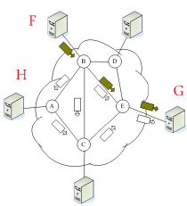
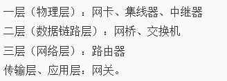
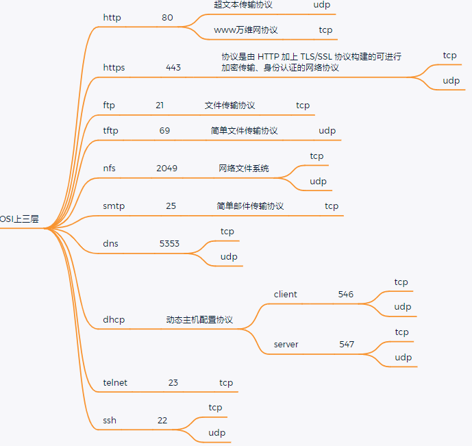

[toc]

# 1 计算机网络发展简史

## 1.1 早期的电路交换网

在通信双方或多方之间，通过电路交换建立电路连接的网络


### 1.1.1 电路交换网的特点

1. 建立链接 --> 使用链接 --> 释放链接
2. 物理通路被通信双方独占

计算机数据使突发式出现在数据链路上的，而电路交换网的建立链接，使用链接、释放链接的三个过程使得传输效率太低，故电路交换不适合传输计算机数据。

## 1.2 最早的计算机网络

最早的计算机网络是由美国创造的ARPA，但是最早的ARPA无法连接不同类型的计算机和不同类型的操作系统。

==**对计算机网络的要求**==

1. 不是为了打电话
2. 结构简单，可靠的传输数据
3. 能够连接不同种类的计算机
4. 所有网络节点同等重要
5. 必须由冗余的路由

## 1.3 计算机网络中数据采用分组交换的方式

通过标有地址的分组进程路由选择传送数据，使通信通道仅在传送期间被占用的一种交换方式

### 1.3.1 分组的组成


## 1.4 计算机网络中数据的交换方式

### 1.4.1 交换方式

存储转发

节点收到分组，先暂时存储下来，再检查其首部，按照首部中的目的地址，找到合适的节点转发出去



### 1.4.2 特点

1. 以分组作为传输单位
2. 独立的选择转发路由
3. 逐段占用，动态分配传输带宽

## 1.5 如何实现跨主机间的进程通信


## 1.6 如何实现不同子网的主机间的进程间通信


## 1.7 计算机网络的世界语 -- TCP/IP协议

到现在为止，只能使能够通信的机器，能够上网的机器，一定用的就是tcp/ip协议族

## 1.8 计算机网络的五层原理体系结构

### 1.8.1 物理层

==**比特流**==

在物理媒体上传送比特流

具体包括：与物理媒体的接口、比特的表示与同步、数据率、线路配置、物理拓扑等

### 1.8.2 数据链路层

==**数据帧**==

在两个相邻结点间(主机和路由器或路由器和路由器之间)的链路上传送以帧为单位的数据

具体包括：组帧、差错控制、物理编制、接入控制、流量控制

### 1.8.3 网络层

==**数据报**==

负责将分组从源主机(按照合适的路由)通过中间若干路由器的转发传送到目的主机。核心功能是逻辑编制、路由选择和分组转发

### 1.8.4 运输层

#### 1.8.4.1 传输控制协议TCP

==**数据传输的单位是报文段**==

#### 1.8.4.2 用户数据包协议UDP

数据传输的单位是用户数据报

负责主机中两个进程之间的逻辑通信(端到端通信)

具体包括：复用与分用、可靠数据传输、流量控制、拥塞控制等

### 1.8.5 应用层

==**应用层交互的数据单元是报文**==

通过应用进程间的交互来实现特定网络应用，直接为用户或应用进程提供特定的应用服务

如：文件传输、电子邮件等

## 1.9 四个阶段

1. 终端 -- 主机
2. 同一网络内的主机间通信
3. 不同网络间的主机通信
4. 网络全球化

## 1.10 以太网

### 1.10.1 以太网是什么

计算机局域网技术

### 1.10.2 作用

实现局域网通信

# 2 OSI七层网络协议模型

## 2.1 为什么要分层

由于网络通信实现起来非常复杂，因此在软件设计层面，需要==**低耦合高内聚**==，这样设计编译模块复用，因此分层实现，然后每一层组成协议栈，来实现网络通信，这样的设计才能更好的维护，裁剪。

## 2.2 分层

1. 应用层：提供应用服务，http(超文本传输协议),DNS(UDP实现)，THCP(地址解析)，SSH(安全登录)，MTU(最大传输单元)
2. 表示层：数据的表示和加密，SSL
3. 会话层：建立通信会话的，通过端口建立会话
4. 传输层：传输的方式
5. 网络层：实现跨子网通信和路由
6. 数据链路层：如何实现以太网(局域网)内数据的转发
7. 物理层：规定调制解调和物理设备设计制作的标准





## 2.3 OSI的数据包组装、拆解


OSI协议模型是一个理想型，并不是真实使用大家遵循的模型，只有==**TCP/IP模型**==才是大家共同遵守的模型。


# 3 TCP/IP协议简介

为了减少协议设计的复杂性，大多数网络模型均采用分层的方式来组织，==**每一层利用下一层提供的服务来为上一层提供服务**==，**本层利用的实现细节对上层屏蔽**

## 3.1 分层结构

为了能够实现不同类型计算机和不同类型的操作系统之间进行通信，引入了分层的概念。最早的分层体系结构是OSI开放系统互联模型，是由国际化标准组织(ISO)指定的，由于OSI过于复杂，所以到现在为止也没有使用，而使用的TCP/IP协议族

OSI一共分为7层，TCP/IP协议族一共四层，虽然TCP/IP协议族层次少，但是却干了OSI7层所有任务。


### 3.1.1 TCP/IP协议栈(协议族：是一堆协议的统称)

#### 3.1.1.1  应用层

应用程序间沟通的层

HTTP\HTTPS\DNS\FTP\TFTP\SMTP\Telnet\SSH\DHCP等

#### 3.1.1.2 传输层

提供进程间的数据传送服务。负责传送数据、提供应用程序端到端的逻辑通信。

TCP\UDP

#### 3.1.1.3 网络层

提供基本的数据封包传送功能，最大可能的让每个数据包都能够到达目的主机

IP\ICMP(ping)\IGMP

#### 3.1.1.4 链路层

负责数据帧的发送和接收

1. 上层数据链路层：ARP/RARP
2. 中层数据链路层：SLIP/PPP
3. 下层数据链路：802.2\802.3\802.11\802.15.4\802.15.1

每层完成自己的任务，最终通过不同层次的处理完成数据的收发。


## 3.2 数据包的组装、拆解

### 3.2.1 数据包在各个层之间的传输


### 3.2.2 链路层封包格式


```
目的地址：目的mac地址
源地址：源mac地址
类型：确定以太网后面跟的哪那个协议
        0x0800 ip协议
        0x0806 arp协议
        0x0835 rarp协议
```

#### 3.2.2.1 注意

1. IEEE802.2/802.3封装常用在无线
2. 以太网封装常用在有线局域网

### 3.2.3 网络层、传输层封包格式


## 3.3 IP协议简介

==**IP协议也称之为网际协议**==

特指为实现一个相互连接的网络系统上从源地址到目的地址传输数据包(互联网数据包)所提供必要功能的协议。

### 3.3.1 特点

1. 不可靠：它不能保证IP数据包能成功地到达它的目的地，仅提供尽力而为的传输服务
2. 无连接：IP并不维护任何关于后续数据包的状态信息。每个数据包的处理使相互独立的，IP数据包可以不按发送顺序接收。

==**IP数据包中含有发送它主机的IP地址(源地址和接收它主机的IP地址(目的地址)**==

IP报头20个字节

## 3.4 TCP协议简介

TCP协议，传输控制协议

==**TCP是一种面向连接的，可靠的传输层控制协议**==

### 3.4.1 功能

提供不同主机上的进程间通信

### 3.4.2 特点

1. 建立链接 -> 使用链接 -> 释放链接(虚电路)
2. TCP数据包中包含序号和确认序号
3. 对包进行排序并检错，而损坏的包可以被重传

### 3.4.3 服务对象

需要高度可靠性且面向连接的服务

如HTTP、FTP、SMTP等

### 3.4.4 如何保证可靠性

1. 数据的有序到达
2. 数据的误差最小
3. 多余数据丢失
4. 丢失的数据包重发
5. 包括信道拥挤控制
6. 三次握手与四次挥手

### 3.4.5 TCP面向连接的原因

- 通信前：要三次挥手建立可靠的通信连接

  

- 通信后：通过四次挥手来断开连接

  

==**三次挥手使一个正常建立通信的过程，而四次挥手并不是一个正常的退出/断开过程。**==


### 3.4.6 TCP报头

TCP报头20个字节


## 3.5 UDP协议简介

UDP协议，用户数据报协议

==**UDP是一种面向无连接的传输层通信协议，别名不可靠协议**==

UDP报头8个字节

### 3.5.1 功能

提供不同主机上的进程间通信

### 3.5.2 特点

1. 发送数据之前不需要建立链接
2. 不对数据包的顺序进行检查
3. 没有错误检测和重传机制
4. 使用校验和来实现错误侦测(校验和是可选的，一般都没有校验和)
5. UDP常用于媒体流的传输(音频、视频、等)，在这种情况下，实时性比可靠性更重要
6. UDP也常用于简单的查询/回应程序，例如DNS查找，在这种情况下，建立可靠传输的资源消耗太大
7. UDP是一种实时传输协议(Real-time Transport Protocol),这种协议通常用来传输实时数据例如：音视频流

### 3.5.3 服务对象

主要用于“查询 -- 应答”的服务

如：NFS、NTP、DNS等


# 4 mac地址

## 4.1 网卡

网卡又称为网络适配器或网络接口卡NIC，但是现在更多的人愿意使用更为简单的名称“网卡”。

通过网卡能够是不同的计算机之间连接，从而完成数据通信等功能。

## 4.2 mac地址

每一个网卡在出厂时，都会给分配一个编号，这个编号就称之为mac地址

MAC地址，用于标识网络设备，类似于身份证号，且理论上全球唯一

### 4.2.1 组成

以太网内的MAC地址是一个48bit的值，通常人为识别是通过16进制数来识别的，以两个十六进制数为一组，一共分为6组，每组之间通过`:`隔开，前三组称之为厂商ID，后三组称之为设备ID

如何查询ubuntu的mac地址：

```shell
ifconfig
```


# 5 IP地址

```
IP地址是一种internet上的主机编址方式，也称为网际协议地址。
IP地址是任意一台主机在网络中的唯一标识。
IP地址的取值范围：0.0.0.0 ~ 255.255.255.255
```

## 5.1 IP地址的分类

```
IPV4，占32位
IPV6，占128位
```

## 5.2 IPV4地址的组成

```
IPV4一般使用点分十进制字符串来标识，比如192.168.3.103
使用32bit，由{网络ID，主机ID}两部分组成
网络ID：IP地址中由子网掩码中1覆盖的连续位
主机ID：IP地址中由子网掩码中0覆盖的连续位
```


## 5.3 IP地址特点

网络ID不同的网络不能直接通信，如果要通信则需要路由器转发(不同子网内的主机的进程间通信)。

主机ID全为0的IP地址表示网段地址

主机ID全为1的IP地址表示该网段的广播地址

```
192.168.3.10和192.168.3.111可以直接通信
如果192.168.3.x网段而言，192.168.3.0表示网段，192.168.3.255表示广播地址。
```

## 5.4 ipv4地址的分类(依据前八位来进行区分)


| 类型 | 范围                         |
| :--- | :--------------------------- |
| A    | 0.0.0.0 到 127.255.255.255   |
| B    | 128.0.0.0 到 191.255.255.255 |
| C    | 192.0.0.0 到 223.255.255.255 |
| D    | 224.0.0.0 到 239.255.255.255 |
| E    | 240.0.0.0 到 247.255.255.255 |

## 5.5 私有IP地址

公有IP(可直接连接Internet)：经由InterNIC所统一规划的IP

私有IP(不可直接连接Internet)：主要用于局域网络内的主机联机规划

| 类型 | 私有IP地址范围 |
| :----- | :--------------- |
| A类  | 10.0.0.1 ~ 10.225.255.254 |
| B类  | 172.16.0.1 ~ 172.31.255.254 |
| C类  | 192.168.0.1 ~ 192.168.255.254 |

## 5.6 回环IP地址

通常127.0.0.1称为回环地址

### 5.6.1 功能

主要是测试本机的网络配置，能ping通127.0.0.1说明本机的网卡和IP协议安装都没有问题

### 5.6.2 注意

==**127.0.0.1 ~ 127.255.255.254中的任何地址都将回环到本地主机中不属于任何一个有类别地质类，它代表设备的本地虚拟接口**==

# 6 子网掩码

子网掩码(subnet mask)又叫网络掩码、地址掩码是一个32bit由1和0组成的数值，并且0和1分别连续。

==**子网掩码是用来划分子网的**==。它通常和IP地址的配套使用。用1来掩网络号，用0来掩主机号，只要网络号相同，则两个IP在同一子网

## 6.1 作用

指明IP地址中哪些位标识的是主机所在的子网以及哪些位标识的是主机号

## 6.2 特点

==**必须结合IP地址一起使用，不能单独存在**==

IP地址中由子网掩码中1覆盖的连续位为子网ID，其余为主机ID

## 6.3 子网掩码的表现形式

```
192.168.43.0/255.255.255.0
192.168.43.0/24
```

## 6.4 默认的子网掩码

```
A类的IP地址的默认的子网掩码为255.0.0.0
B类的IP地址的默认的子网掩码为255.255.0.0
C类的IP地址的默认的子网掩码为255.255.255.0
```

# 7 端口

## 7.1 端口描述

无符号短整型unsigned short，两个字节(因为Linux中端口最大数目是65535，两个字节就可以搞定)

TCP/IP协议采用端口标识通信的进程

用于区分一个系统里的多个进程

### 7.1.1 特点

1. 对于同一个端口，在不同系统中对应着不同的进程
2. ==**对于同一个系统，一个端口只能被一个进程拥有**==
3. 一个进程拥有一个端口后，传输层送到该端口的数据全部被该进程接收，同样，进程送交传输层的数据也通过该端口被送出

## 7.2 端口号

==**类似pid标识一个进程；在网络程序中，用端口号(port)标识目的主机上的目的进程**==

范围：0 ~ 65535

### 7.2.1 特点

1. 端口号是无符号短整型的类型
2. 每一个端口都拥有一个端口号
3. TCP、UDP维护各自独立的端口号
4. 网络应用程序，至少要占用一个端口号，也可以占有多个端口号
5. 一般使用端口号要避开已经公开使用的端口号，所以一般用5000以上的端口号，已经使用的端口号，可以通过`vim /etc/services`命令查看。

### 7.2.2 使用规则

TCP与UDP段结构中端口地址都是16比特，可以有在0---65535范围内的端口号。对于这65536个端口号有以下的使用规定：

1. 端口号小于256的定义为常用端口，服务器一般都是通过端口号来识别的。任何TCP/IP实现所提供的服务都用1 - 1023之间的端口号，是由ICANN来管理的；端口号从1024 - 49251是被注册的端口，也称为"用户端口"，被IANA指定为特殊服务使用
2. 客户端只需保证该端口在本机上是唯一的就可以了。客户端端口号因存在时间很短暂又称临时端口号
3. 大多数TCP/IP实现给临时端口号分配1024 - 5000之间的端口号。大于5000的端口号是为其他服务器预留的

### 7.2.3 注意

端口号类似进程号，同一时刻只能标志一个进程

可以重复使用


# 8 网络应用程序开发程序

## 8.1 网络软件设计模型

分为C/S和B/S模型

### 8.1.2 C/S模型

C/S模型是(Client / Server)的缩写。服务器通常采用高性能的PC、工作站或小型机，并采用大型数据库系统，如Oracle、Sybase、Informix或SQL Server。客户端需要安装专用的客户端软件。

### 8.1.3 B/S模型

B/S模型是(Brower / Server) 的缩写。客户机上只要安装一个浏览器(Brower) ，如Netspace Navigator或Internet Explorer，服务器安装Oracle、Sybase、Informix或SQL Server等数据库。在这种结构下，用户界面完全通过WWW浏览器实现，一部分事物逻辑在前端实现，但主要事务逻辑在服务器端实现。浏览器通过Web Server同数据库进行数据交互。

### 8.1.4 C/S和B/S网络编程模型的区别

| 对比项         | C/S模型                                                      | B/S模型                                                      |
| :------------- | :----------------------------------------------------------- | :----------------------------------------------------------- |
| 硬件环境不同   | 一般建立在专用的网络上，小范围里的网络环境，局域网之间再通过专门服务器提供连接和数据交换服务。 | 一般建立在广域网之上，不必是专门的网络硬件环境，例如与电话上网、租用设备、信息自己管理。有比C/S更强的适应范围，一般只要有操作系统和浏览器就行 |
| 对安全要求不同 | 一般面向相对固定的用户群体，对信息安全的控制能力很强。一般高度机密的信息系统采用C/S结构适宜。可以通过B/S模型发布部分可公开信息。 | 建立在广域网上，对安全的控制能力相对弱，可能面向不可知的用户 |
| 对程序架构不同 | 程序可以更加注重流畅，可以对权限多层校验，对系统运行速度可以较少考虑。 | 对安全以及访问速度的多重的考虑，建立在需要更加优化的基础之上，比C/S有更高的要求。B/S结构的程序架构是发展的趋势，从MS的.Net、SUN和IBM推出的JavaBean构件技术等，使B/S更加成熟 |
| 软件重用不同   | 程序可以不可避免的整体性考虑，构件的重用性不如在B/S要求下的构件重用性好 | 对构件的多重结构，要求构件相对独立的功能，能够相对较好的重用 |
| 系统维护不同   | 系统维护是在软件生存周期中，开销大。重要C/S程序由于整体性，必须整体考察，处理出现的问题以及系统升级。升级难，可能是再做一个全新的系统 | 程序由于构件组成，方便构件个别的替换，实现系统的无缝升级，系统维护开销小，用户从网上自己下载安装就可以实现升级 |
| 处理问题不同   | 程序可以处理用户面固定，并且在相同区域，安全要求高，与操作系统相关，应该都是相同的系统。 | 建立在广域网上，面向不同的用户群，地域分散，这是C/S模型无法做到的，与操作系统平台关系最小 |
| 用户接口不同   | 对程序员要求较高                                             | 建立在浏览器上，有更丰富和生动的表现方式与用户交流，并且大部分难度较低，减低开发成本。 |
| 信息流不同     | 程序一般是典型的中央集权的机械式处理，交互性相对低           | 信息流向可变化， B-B、 B-C、B-G等信息流向的变化，更像交易中心 |

## 8.2 TCP CS架构实例(面向连接)


### 8.2.1 socket

1. socket特殊的文件格式(在Linux系统下：一切皆文件)
2. socket是一套用于进程间通信的接口
3. socket是一个用于创建进程间通信的socket文件的函数

### 8.2.2 如何在网络上寻找目的主机

路由表

### 8.2.3 路由器与交换机的区别是什么

路由器是一个3层设备：网络层设备

交换机是一个2层设备：数据链路层设备
