[toc]

# 页面跳转目录

[socket](#socket)

[bind](#bind)

[inet_addr](#inet_addr)

[inet_ntoa](#inet_ntoa)

# 1 字节序、地址转换

## 1.1 字节序概述

### 1.1.1 字节序概念

字节序是指多字节数据的存储顺序

### 1.1.2 分类


小端格式：将低位字节数据存储在低地址

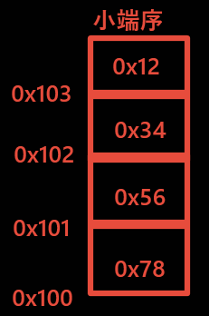

大端格式：将高位字节数据存储在低地址

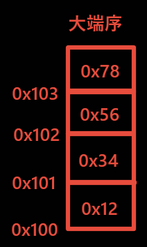

### 1.1.3 注意

LSB：低地址

MSB：高地址

```c
#include <stdio.h>

union un
{
	int i;
	char c;
};


int main(int argc, const char *argv[])
{
	union un u1;
	u1.i = 0x12345678;
	if(0x78 == u1.c)
	{
		printf("小端序\n");	
	}
	else if(0x12 == u1.c)
	{
		printf("大端序\n");
	}
	return 0;
}
```

result

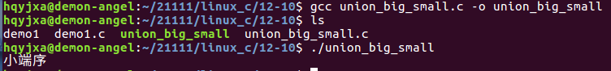

## 1.2 字节序转换函数 -- htons、htonl、ntohs、ntohl

1. ==**网络协议制定了通讯字节序 -- 大端**==
2. 只有在多字节数据处理时才需要考虑字节序
3. 运行同一台计算机上的进程相互通信时，一般不用考虑字节序
4. 异构计算机之间通讯，需要转换自己的字节序为网络字节序

### 1.2.1 注意

在需要字节序转换的时候一般调用特定字节序转换函数

```c
/* 头文件 */
#include <arpa/inet.h>

/* host --> network */

/* 函数格式 */
uint32_t htonl(uint32_t hostlong);
/*
 * 功能：
 * 		将32位主机字节序数据转换成网络字节序数据
 * 参数：
 * 		hostlong：待转换的32位主机字节序数据
 * 返回值：
 * 		成功：返回网络字节序的值
 */

/* 函数格式 */
uint16_t htons(uint16_t hostshort);
/*
 * 功能：
 * 		将16位主机字节序数据转换成网络字节序数据
 * 参数：
 * 		hostshort：待转换的16位主机字节序数据
 * 返回值：
 * 		成功：返回网络字节序的值
 */

/* network --> host */

/* 函数格式 */
uint32_t ntohl(uint32_t netlong);
/*
 * 功能：
 * 		将32位网络字节序数据转换成主机字节序数据
 * 参数：
 * 		netlong：待转换的32位网络字节序数据
 * 返回值：
 * 		成功：返回主机字节序的值 */

/* 函数格式 */
uint16_t ntohs(uint16_t netshort);
/*
 * 功能：
 * 		将16位网络字节序数据转换成主机字节序数据
 * 参数：
 * 		netshort：待转换的16位网络字节序数据
 * 返回值：
 * 		成功：返回主机字节序的值
 */
```

```c
#include <stdio.h>
#include <arpa/inet.h>

int main(int argc, const char *argv[])
{
	int a = 0x12345678;
	short b = 0x1234;

	printf("%#x\n", htonl(a));
	printf("%#x\n", htons(b));

	return 0;
}
```

result

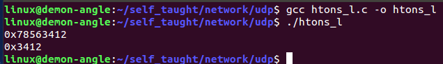

## 1.3 地址转换函数

人为识别的IP地址是点分十进制的字符串形式，但是计算机或者网络中识别的IP地址是整型数据，所以需要转化

### 1.3.1 inet_pton()

```c
/* 字符串IP地址转整型数据 */
/* 头文件 */
#include <arpa/inet.h>
/* 函数格式 */
int inet_pton(int af, const char *src, void *dst);
/*
 * 功能:
 *      将点分十进制数转换成32位无符号整数
 * 参数:
 *      af:协议族
 *          AF_INET     IPV4网络协议
 *          AF_INET6    IPV6网络协议
 *      src:点分十进制数串
 *      dst:32位无符号整数的地址
 * 返回值:
 *      成功返回1
 *      失败返回其他
 */
```

```c
#include <stdio.h>
#include <arpa/inet.h>

int main(int argc, char const *argv[])
{
    char ip_str[] = "192.168.0.8";
    unsigned int ip_int = 0;
    unsigned char *ip_p = NULL;

    /* 将点分十进制IP地址转化为32位无符号整型数据 */

    inet_pton(AF_INET, ip_str, &ip_int);
    printf("ip_int = %d\n", ip_int);

    ip_p = (char *)&ip_int;
    printf("in_uint = %d,%d,%d,%d\n", *ip_p, *(ip_p + 1), *(ip_p + 2), *(ip_p + 3));
    return 0;
}
```

result

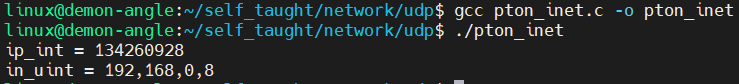

### 1.3.2 inet_ntop()

```c
/* 整形数据转字符串格式IP地址 */

/* 头文件 */
#include <arpa/inet.h>
/* 函数格式 */
const char *inet_ntop(int af, const void *src,
                      char *dst, socklen_t size);
/*
 * 功能：
 *      将32位无符号整数转换成点分十进制数串
 * 参数：
 *      af：协议族
 *      src：32位无符号整数
 *      dst：点分十进制数串
 *      size：dst缓存区长度
 *          size的宏定义
 *          #define INET_ADDRSTRLEN 16        // for ipv4
 *          #define INET6_ADDRSTRLEN 46       // for ipv6
 * 返回值：
 *      成功：返回字符串的首地址
 *      失败：返回NULL
 */
```

```c
#include <stdio.h>
#include <arpa/inet.h>
int main(int argc, char const *argv[])
{
    unsigned char ip_int[] = {192, 168, 0, 8};
    char ip_str[16] = ""; /* 192.168.0.8 */

    inet_ntop(AF_INET, &ip_int, ip_str, 16);
    printf("ip_s = %s\n", ip_str);
    return 0;
}
```

result

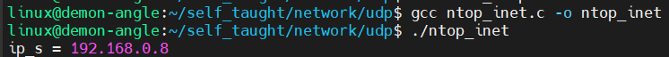

### 1.3.3 inet_addr()和inet_ntoa()

<a name="inet_addr"></a>

<a name="inet_ntoa"></a>

这两个函数只能用在ipv4地址的转换

```c
/* 头文件 */
#include <sys/socket.h>
#include <arpa/inet.h>
#include <netinet/in.h>

/* 函数格式 */
in_addr_t inet_addr(const char *cp);
/*
 * 功能：
 *      将点分十进制的字符串转换为大端序的IP地址
 * 参数：
 *      cp：点分十进制字符串的首地址
 * 返回值：
 *      转换后的二进制的大端序的IP地址
 */

/* 函数格式 */
char *inet_ntoa(sturct in_addr in);
/*
 * 功能：
 *      将二进制的IP地址转换为点分十进制的字符串
 * 参数：
 *		in:大端序的二进制IP地址
 * 返回值：
 *      返回的点分十进制字符串的首地址
 */
```

# 2 UDP介绍、编程流程

## 2.1 UDP概述

### 2.1.1 UDP协议

面向无连接的用户数据报协议，在传输数据前不需要先建立连接；目的主机的运输层收到UDP报文后，不需要给出任何确认

### 2.1.2 UDP特点

1. 相比TCP速度稍快些
   - 不用建立连接
   - 不用复杂的校验
   - 不用重发数据
2. 简单的请求/应答应用程序可以使用UDP
3. 对于海量数据传输不应该使用UDP
   - 有最大报文长度限制
4. 广播和多播应用必须使用UDP
5. 非面向连接
   - 没有三次握手和四次挥手机制
6. 不可靠
   - 数据不一定是有序到达的
   - 数据不会根据应用层的大小进行拆包
   - 数据丢失不会重发
   - 数据错误不会重发
   - 没有信道拥堵控制
   - 数据检验和是可选的
   - 非面向连接

### 2.1.3 UDP应用

DNS(域名解析)、NFS(网络文件系统)、RTP(流媒体)等

一般语音和视通话都是使用udp来通信的

### 2.1.4 什么时候使用

对于传输的实时性要求高于安全性要求时使用，一般音视频流传输时使用

## 2.2 网络编程接口socket

### 2.2.1 socket作用

提供不同主机上的进程之间的通信

### 2.2.2 socket特点

1. socket也称“套接字”
2. 是一种文件描述符，代表一个通信管道的一个端点
3. 类似对文件的操作一样，可以使用read，write，close等函数对socket套接字进行网络数据的收取和发送等操作
4. 得到socket套接字（描述符）的方法调用socket()

### 2.2.3 socket的分类

```c
/*
 * SOCK_STREAM，流式套接字，用于TCP
 * SOCK_DGRAM，数据报套接字，用于UDP
 * SOCK_RAW，原始套接字，对于其他层次的协议操作时需要使用这个类型
 */
```

## 2.3 UDP编程C/S架构

<a name="UDPCS架构"></a>

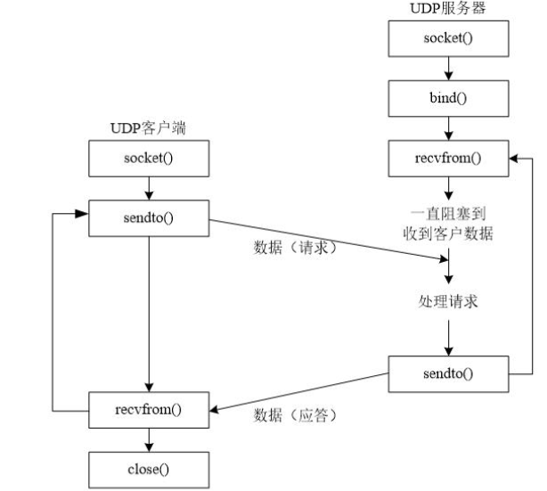

### 2.3.1 UDP网络编程流程（单播）

#### 2.3.1.1 服务器

```c
socket()		# 创建套接字
bind()			# 将服务器的IP地址、端口号与套接字进行绑定
recvfrom()		# 接收数据
sendto()		# 发送数据
```

#### 2.3.1.2 客户端

```c
socket()	# 创建套接字
sendto()	# 发送数据
recvfrom()	# 接收数据
close()		# 关闭套接字
```

# 3 UDP编程 - 创建套接字

## 3.1 创建套接字 -- socket()

<a name="socket"></a>

```c
/* 头文件 */
#include <sys/types.h>
#include <sys/socket.h>

/* 函数格式 */
int socket(int domain, int type, int protocol);
/*
 * 函数功能：
 * 		创建一个通信端口
 * 函数参数：
 *		domain:使用的协议族
 *          linux本地通信：AF_UNIX / AF_LOCAL
 *          IPV4通信：AF_INET
 *          IPV6通信：AF_INET6
 *		type:socket的类型
 *          SOCK_STREAM:流式套接字
 *              提供一个有序的、可靠的、基于连接的、全双工的字节流通信。(TCP使用)
 *          SOCK_DGRAM:数据报套接字
 *              支持一个数据报通信(非面向连接、不可靠的、有最大传输信息长度限制的数据报通信)(UDP使用)
 *          SOCK_RAW:linux原始套接字
 *              (注意一定要在root下使用）原始套接字编程可以接收到本机网卡上的数据帧或者数据包,
 *              对于监听网络的流量和分析是很有作用的（用于链路层）
 *          SOCK_SEQPACKET:Unix域套接字时会使用
 *              (PING命令的时候可能使用)
 *		protocol:附加的协议
 *          默认为0
 * 函数返回值：
 *		成功返回创建的socket的文件描述符，失败返回-1
 */
```

### 3.1.1 特点

创建套接字时，系统不会分配端口

创建的套接字默认属性是主动的，即主动发起服务的请求，当作为服务器时，往往需要修改为被动的

## 3.2 创建UDP套接字

```c
#include <stdio.h>
#include <stdlib.h>
#include <sys/types.h>
#include <sys/socket.h>

int main(int argc, char const *argv[])
{
    /* 使用socket函数创建套接字 */
    /* 创建一个用于UDP网络编程的套接字 */

    int sockfd;
    if (-1 == (sockfd = socket(AF_INET, SOCK_DGRAM, 0)))
    {
        perror("fail to socket");
        exit(1);
    }

    printf("sockfd = %d\n", sockfd);

    return 0;
}
```

result

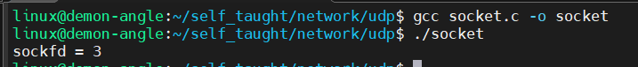

# 4 UDP编程 - 发送、绑定、接收数据

## 4.1 IPV4套接字地址结构

==**在网络编程中经常使用的结构体sockaddr_in**==

```c
#include <netinet/in.h>
struct sockaddr_in
{
    /* 协议族 2字节 */
    sa_family_t sin_faimly;
    /* 端口号 2字节 */
    in_port_t sin_port;
    /* IP地址 4字节 */
    struct in_addr sin_addr;
};

struct in_addr
{
    /* IP地址 4字节 */
    uint32_t s_addr;
};
```

为了使不同格式地址能被传入套接字函数，地址须要强制转换成通用套接字地址结构，原因是因为不同场合所使用的结构体不一样，但是调用的函数却是同一个，所以定义一个通用结构体，当在指定场合使用时，在根据要求传入指定的结构体即可

通用结构体sockaddr

```c
#include <netinet/in.h>
struct sockaddr
{
    /* 2字节 */
    sa_family_t sa_family;
    /* 14字节 */
    char sa_data[14];
};
```

## 4.2 两种地址结构使用场合

在定义源地址和目的地址结构的时候，选用`struct sockaddr_in`

当调用编程接口函数，且该函数需要传入地址结构时需要用`struct sockaddr`进行强制转换。

## 4.3 发送数据 -- sendto()

```c
/* 头文件 */
#include <sys/types.h>
#include <sys/socket.h>
/* 函数格式 */
ssize_t sendto(int sockfd, const void *buf, size_t len, int flags,
               const struct sockaddr *dest_addr, socklen_t addrlen);
/*
 * 功能：
 *      给指定的目标地址发送数据
 * 参数：
 *      sockfd:通信套接字，socket的返回值
 *      buf:发送数据的首地址
 *      len:想要发送的数据长度
 *      flag:默认为0
 *          0 阻塞
 *          MSG_DONTWAIT    非阻塞
 *      dest_addr:目标地址信息的首地址
 *      addrlen:地址信息结构体的长度
 * 返回值：
 *      成功返回发送的字节数
 *      失败返回-1
 */
```

## 4.4 向“网络调试助手”发送消息

设置网络调试助手(在window下运行的软件)中的属性

注意：ip地址不能随意设置，必须是当前windows的IP地址

### 4.4.1 ubuntu下客户端的代码编写

```c
#include <stdio.h>  /* printf */
#include <stdlib.h> /* exit */
#include <sys/socket.h>
#include <sys/types.h>  /* socket */
#include <netinet/in.h> /* sockaddr_in */
#include <arpa/inet.h>  /* htons    inet_addr */
#include <unistd.h>     /* close */
#include <string.h>

#define N 128
int main(int argc, char const *argv[])
{
    /* ./sendto 192.168.0.10 8080 */
    if (argc < 3)
    {
        fprintf(stderr, "usage: %s ip port\n", argv[0]);
        exit(1);
    }

    /* 第一步：创建套接字 */
    int sockfd;
    if (-1 == (sockfd = socket(AF_INET, SOCK_DGRAM, 0)))
    {
        perror("fail to socket");
        exit(1);
    }
    printf("sockfd = %d\n", sockfd);

    /* 第二步：填充服务器网络信息结构体 sockaddr_in */
    struct sockaddr_in client_addr;

    client_addr.sin_family = AF_INET;                 /* 协议族，AF_INET:IPV4网络协议 */
    client_addr.sin_addr.s_addr = inet_addr(argv[1]); /* IP地址 */
    client_addr.sin_port = htons(atoi(argv[2]));      /* 端口号 */

    /* 第三步：发送数据 */
    char buf[N] = "";
    while (1)
    {
        fgets(buf, N, stdin);
        /* 把buf字符串中的\n转化为\0 */
        buf[strlen(buf) - 1] = '\0';
        if (-1 == sendto(sockfd, buf, N, 0, (struct sockaddr *)&client_addr, sizeof(client_addr)))
        {
            perror("fail to sendto");
            exit(1);
        }
    }
    /* 第四步：关闭套接字文件描述符 */
    close(sockfd);
    return 0;
}
```

result

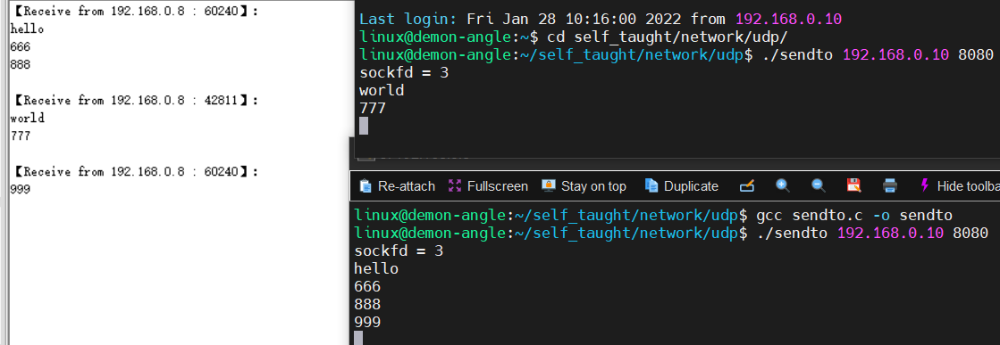

## 4.5 绑定 -- bind()

<a name="bind"></a>

UDP网络程序想要收取数据需要什么条件

1. 确定的IP地址
2. 确定的port

怎么完成上面的条件呢？

- 接收端	使用bind函数，来完成地址结构与socket套接字的绑定，这样ip、port就固定了
- 发送端    在sendto函数中指定接收端的ip、port，就可以发送数据了

由于服务器是被动的，客户端是主动的，所以一般先运行服务器，后运行客户端，所以服务器需要固定自己的信息（IP地址和端口号），这样客户端才可以找到服务器并与之通信，但是客户端一般不需要bind绑定，因为系统会自动给客户端分配IP地址和端口号

```c
/* 头文件 */
#include <sys/types.h>
#include <sys/socket.h>

/* 函数格式 */
int bind(int sockfd, const struct sockaddr *addr, socklen_t addrlen);
/*
 * 功能：
 *      给socket绑定IP地址和端口号
 * 参数：
 *		sockfd：socket函数创建出来的监听套接字
 *		addr:存储IP地址和端口信息的结构体首地址
 *          struct sockaddr
 *          {
 *              sa_family_t sa_family;
 *              char sa_data[14];
 *          };
 *          TCP中真正使用的结构体是 struct sockaddr_in
 *          struct sockaddr_in
 *          {
 *              sa_family_t 	sin_faimly;  	// address family: AF_INET
 *              in_port_t 		sin_port;		// port in network byte order
 *              struct in_addr 	sin_addr;		// internet address
 *          };
 *
 *          // Internet address
 *          struct in_addr
 *          {
 *              uint32_t 	s_addr; 		// address in network byte order
 *          };           
 *		addrlen: struct sockaddr结构的大小
 * 返回值：
 *      成功返回0，失败返回-1
 */
```

## 4.6 接收数据 -- recvfrom()

```c
/* 头文件 */
#include <sys/types.h>
#include <sys/socket.h>

/* 函数格式 */
ssize_t recvfrom(int sockfd, void *buf, size_t len, int flags,
                 struct sockaddr *src_addr, socklen_t *addrlen);
/*
 * 功能：
 *      接收数据，并获取发送端的IP和端口
 * 参数：
 *      sockfd:通信套接字,socket的返回值
 *      buf:存储接收到的数据的内存的首地址
 *      len:想要接收的数据的字节数
 *      flag:默认为0
 *          0   阻塞
 *          MSG_DONTWAIT    非阻塞
 *      src_addr:存储发送地址信息的结构的首地址
 *      addrlen:结构体长度变量的首地址
 * 返回值：
 *      成功返回接收到的字节数
 *      失败返回-1
 */
```

## 4.7 接收“网络调试助手”的数据

此时网络调试助手作为客户端，ubuntu的程序作为服务器

设置客户端（网络调试助手）

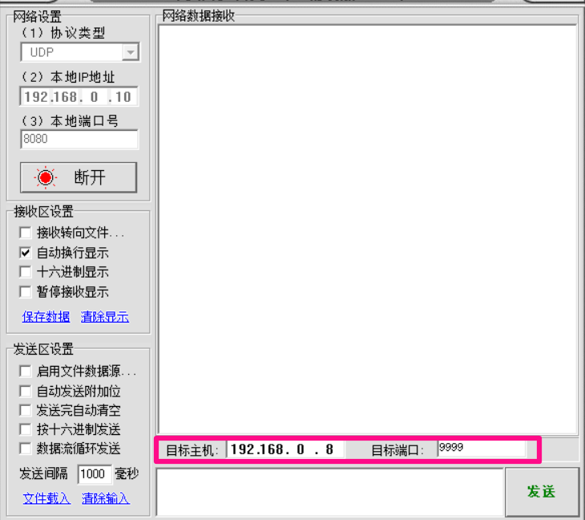

设置服务器（ubuntu程序）

```c
#include <stdio.h>  /* printf */
#include <stdlib.h> /* exit */
#include <sys/socket.h>
#include <sys/types.h>  /* socket */
#include <netinet/in.h> /* sockaddr_in */
#include <arpa/inet.h>  /* htons    inet_addr */
#include <unistd.h>     /* close */
#include <string.h>

#define N 128
int main(int argc, char const *argv[])
{
    /* ./sendto 192.168.0.10 8080 */
    if (argc < 3)
    {
        fprintf(stderr, "usage: %s ip port\n", argv[0]);
        exit(1);
    }

    /* 第一步：创建套接字 */
    int sockfd;
    if (-1 == (sockfd = socket(AF_INET, SOCK_DGRAM, 0)))
    {
        perror("fail to socket");
        exit(1);
    }
    printf("sockfd = %d\n", sockfd);

    /* 第二步：将服务器的网络信息结构体绑定前进行填充 */
    struct sockaddr_in server_addr;

    server_addr.sin_family = AF_INET;                 /* 协议族，AF_INET:IPV4网络协议 */
    server_addr.sin_addr.s_addr = inet_addr(argv[1]); /* IP地址 192.168.0.8 */
    server_addr.sin_port = htons(atoi(argv[2]));      /* 端口号 9999 */

    /* 第三步：将网络信息结构体与套接字绑定 */
    if (-1 == bind(sockfd, (struct sockaddr *)&server_addr, sizeof(server_addr)))
    {
        perror("fail to bind");
        exit(1);
    }

    /* 接收数据 */
    char buf[N] = "";
    struct sockaddr_in client_addr;
    socklen_t addr_len = sizeof(struct sockaddr_in);
    while (1)
    {
        if (-1 == recvfrom(sockfd, buf, N, 0, (struct sockaddr *)&client_addr, &addr_len))
        {
            perror("fail to recvfrom");
            exit(1);
        }

        /* 打印数据 */
        /* 打印客户端的IP地址和端口号 */
        printf("ip: %s, port: %d\n", inet_ntoa(client_addr.sin_addr), ntohs(client_addr.sin_port));
        /* 打印接收到数据 */
        printf("from client: %s\n", buf);
    }

    return 0;
}
```

result

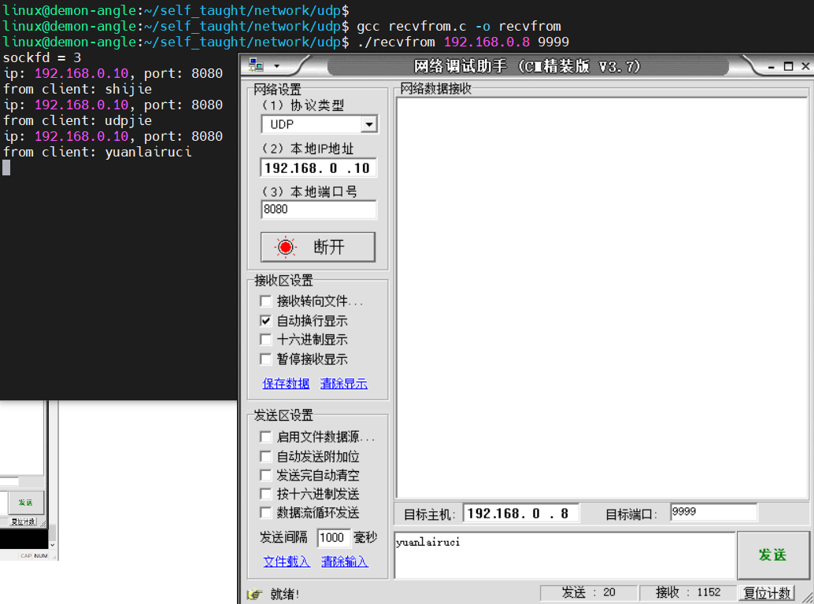

# 5 UDP编程 -- client、server

## 5.1 [C/S架构回顾](#UDPCS架构)

## 5.2 UDP客户端注意点

1. 本地IP、本地端口（我是谁）
2. 目的IP、目的端口（发给谁）
3. 在客户端的代码中，我们只设置了目的IP、目的端口
4. 客户端的本地IP、本地port是我们调用sendto的时候linux系统底层自动给客户端分配的；分配端口的方式是随机分配，即每次运行系统给的port不一样

```c
#include <stdio.h>  /* printf */
#include <stdlib.h> /* exit */
#include <sys/socket.h>
#include <sys/types.h>  /* socket */
#include <netinet/in.h> /* sockaddr_in */
#include <arpa/inet.h>  /* htons    inet_addr */
#include <unistd.h>     /* close */
#include <string.h>

int main(int argc, char const *argv[])
{
    /* ./sendto 192.168.0.10 8080 */
    if (argc < 3)
    {
        fprintf(stderr, "usage: %s ip port\n", argv[0]);
        exit(1);
    }

    /* 第一步：创建套接字 */
    int sockfd;
    if (-1 == (sockfd = socket(AF_INET, SOCK_DGRAM, 0)))
    {
        perror("fail to socket");
        exit(1);
    }

    /* 第二步：填充服务器网络信息结构体 sockaddr_in */
    struct sockaddr_in server_addr;
    socklen_t addr_len = sizeof(server_addr);

    server_addr.sin_family = AF_INET; /* 协议族，AF_INET:IPV4网络协议 */
    /* inet_addr:将点分十进制字符串IP地址转化为整型数据 */
    server_addr.sin_addr.s_addr = inet_addr(argv[1]); /* IP地址 */
    /* htons:将主机字节序转化为网络字节序 */
    /* atoi:将数字型字符串转化为整型数据 */
    server_addr.sin_port = htons(atoi(argv[2])); /* 端口号 */

    /* 第三步：进行通信 */
    char buf[32] = "";
    while (1)
    {
        fgets(buf, sizeof(buf), stdin);
        /* 把buf字符串中的\n转化为\0 */
        buf[strlen(buf) - 1] = '\0';
        if (-1 == sendto(sockfd, buf, sizeof(buf), 0, (struct sockaddr *)&server_addr, sizeof(server_addr)))
        {
            perror("fail to sendto");
            exit(1);
        }

        char text[32] = "";
        if (-1 == recvfrom(sockfd, text, sizeof(text), 0, (struct sockaddr *)&server_addr, &addr_len))
        {
            perror("fail to recvfrom");
            exit(1);
        }
        printf("from server: %s\n", text);
    }
    /* 第四步：关闭套接字文件描述符 */
    close(sockfd);
    return 0;
}
```

## 5.3 UDP服务器注意点

1. 服务器之所以要bind是因为它的本地port需要是固定的，而不是随机的
2. 服务器也可以主动地给客户端发送数据
3. ==**客户端也可以用bind，这样客户端的本地端口就是固定的了，但一般不这样做**==

```c

#include <stdio.h>  /* printf */
#include <stdlib.h> /* exit */
#include <sys/socket.h>
#include <sys/types.h>  /* socket */
#include <netinet/in.h> /* sockaddr_in */
#include <arpa/inet.h>  /* htons    inet_addr */
#include <unistd.h>     /* close */
#include <string.h>

int main(int argc, char const *argv[])
{
    /* ./sendto 192.168.0.10 8080 */
    if (argc < 3)
    {
        fprintf(stderr, "usage: %s ip port\n", argv[0]);
        exit(1);
    }

    /* 第一步：创建套接字 */
    int sockfd;
    if (-1 == (sockfd = socket(AF_INET, SOCK_DGRAM, 0)))
    {
        perror("fail to socket");
        exit(1);
    }
    printf("sockfd = %d\n", sockfd);

    /* 第二步：将服务器的网络信息结构体绑定前进行填充 */
    struct sockaddr_in server_addr;

    server_addr.sin_family = AF_INET; /* 协议族，AF_INET:IPV4网络协议 */
    /* inet_addr:将点分十进制字符串IP地址转化为整型数据 */
    server_addr.sin_addr.s_addr = inet_addr(argv[1]); /* IP地址 */
    /* htons:将主机字节序转化为网络字节序 */
    /* atoi:将数字型字符串转化为整型数据 */
    server_addr.sin_port = htons(atoi(argv[2])); /* 端口号 */

    /* 第三步：将网络信息结构体与套接字绑定 */
    if (-1 == bind(sockfd, (struct sockaddr *)&server_addr, sizeof(server_addr)))
    {
        perror("fail to bind");
        exit(1);
    }

    /* 接收数据 */
    char text[32] = "";
    struct sockaddr_in client_addr;
    socklen_t addr_len = sizeof(struct sockaddr_in);
    while (1)
    {
        if (-1 == recvfrom(sockfd, text, sizeof(text), 0, (struct sockaddr *)&client_addr, &addr_len))
        {
            perror("fail to recvfrom");
            exit(1);
        }

        /* 打印数据 */
        /* 打印客户端的IP地址和端口号 */
        printf("[%s - %d]: %s\n", inet_ntoa(client_addr.sin_addr), ntohs(client_addr.sin_port), text);

        strcat(text, " *_*");
        if (-1 == sendto(sockfd, text, sizeof(text), 0, (struct sockaddr *)&client_addr, addr_len))
        {
            perror("fail to sendto");
            exit(1);
        }
    }

    /* 第四步：关闭文件描述符 */
    close(sockfd);
    return 0;
}
```

result

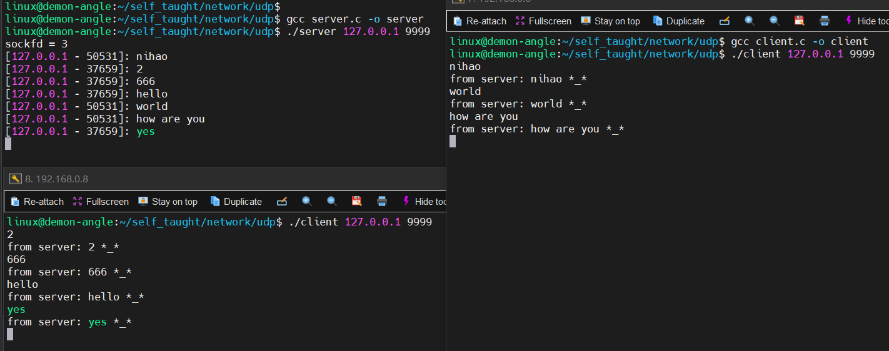


