[toc]

# 1 TFTP简介、通信过程

## 1.1 TFTP概述

### 1.1.1 TFTP:简单文件传输协议

最初用于引导无盘系统，被设计用来传输小文件

### 1.1.2 特点

基于UDP协议实现

不进行用户有效性认证

### 1.1.3 数据传输模式

octet：二进制模式

netascii：文本模式

mail：已经不再支持

## 1.2 TFTP通信过程

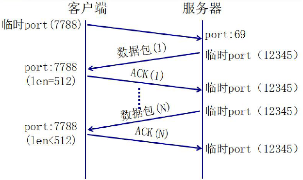

TFTP通信过程总结

1. 服务器在69号端口等待客户端的请求
2. 服务器若批准此请求，则使用临时端口与客户端进行通信
3. 每个数据包的编号都有变化(从1开始)
4. 每个数据包都要得到ACK的确认如果出现超时，则需要重新发送最后的包(数据或ACK)
5. 小于512Byte的数据意味着传输结束

## 1.3 TFTP协议分析

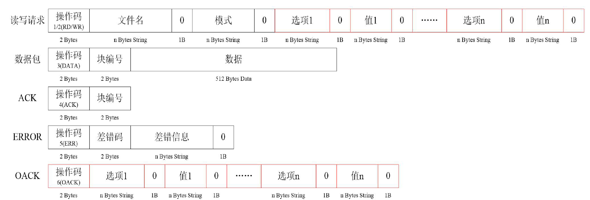

### 1.3.1 注意

以上的0代表的是'\0'

不同的差错码对应不同的错误信息


### 1.3.2 错误码

| 差错码 | 差错信息 |
| :------- | :--------- |
| 0 | 未定义，参见错误信息 |
| 1 | File not found. |
| 2 | Access violation. |
| 3 | Disk full or allocation exceeded. |
| 4 | illegal TFTP operation. |
| 5 | Unknown transfer ID. |
| 6 | File already exists. |
| 7 | No such user. |
| 8 | Unsupported option(s) requeested. |

## 1.4 TFTP客户端

### 1.4.1 下载

#### 1.4.1.1 要求功能

使用TFTP协议，下载server上的文件到本地

#### 1.4.1.2 实现思路

1. 构造请求报文，送至服务器（69号端口）
2. 等待服务器回应
3. 分析服务器回应
4. 接收数据，直到接收到的数据包小于规定数据长度

#### 1.4.1.3 服务器端用软件来实现

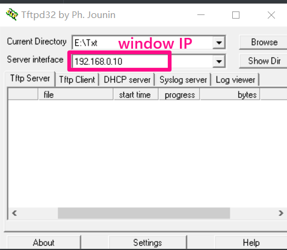

#### 1.4.1.4 客户端代码

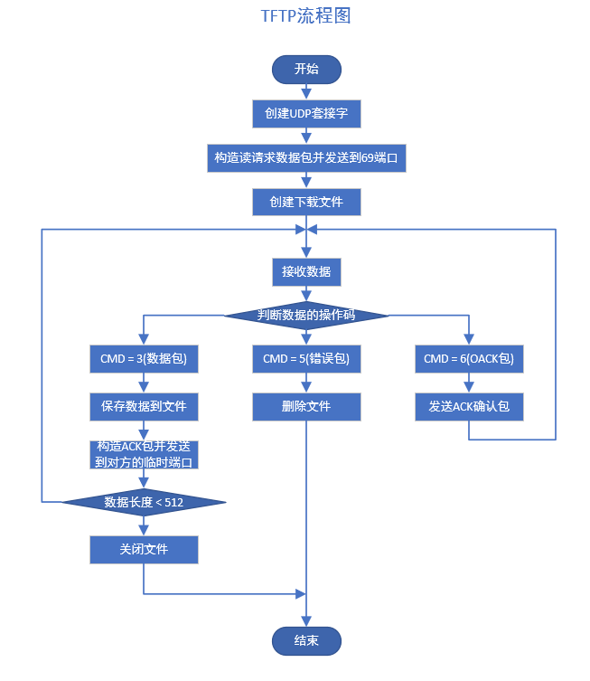

```c
#include <stdio.h>  /* printf */
#include <stdlib.h> /* exit */
#include <sys/socket.h>
#include <sys/types.h>  /* socket */
#include <netinet/in.h> /* sockaddr_in */
#include <arpa/inet.h>  /* htons    inet_addr */
#include <unistd.h>     /* close */
#include <string.h>
#include <sys/stat.h>
#include <fcntl.h>

void do_download(int sockfd, struct sockaddr_in client_addr)
{
    char filename[128] = "";
    printf("请输入要下载的文件名：");
    scanf("%s", filename);

    /* 给服务器发送信息，告知服务器执行下载操作 */
    unsigned char text[1024] = "";
    int text_len;
    socklen_t addr_len = sizeof(struct sockaddr_in);
    int fd;
    int flags = 0;
    int num = 0;
    ssize_t bytes;

    /* 构建服务器发送的tftp指令并发给服务器，例如01As2Nox.txt0octet0 */
    text_len = sprintf(text, "%c%c%s%c%s%c", 0, 1, filename, 0, "octet", 0);
    if (-1 == sendto(sockfd, text, text_len, 0, (struct sockaddr *)&client_addr, addr_len))
    {
        perror("fail to sendto");
        exit(1);
    }

    while (1)
    {
        /* 接收服务器发送过来的数据并处理 */
        if (-1 == (bytes = recvfrom(sockfd, text, sizeof(text), 0, (struct sockaddr *)&client_addr, &addr_len)))
        {
            perror("fail to recvfrom");
            exit(1);
        }

        /* 判断操作码执行相应的处理 */
        if (5 == text[1])
        {
            /* + 4是因为操作码占两个字节、差错码两个字节，之后才是差错信息 */
            printf("error: %s\n", text + 4);
            exit(1);
        }
        else if (3 == text[1])
        {
            if (0 == flags)
            {
                /* 创建文件 */
                if (-1 == (fd = open(filename, O_WRONLY | O_CREAT | O_TRUNC, 0664)))
                {
                    perror("fail to open");
                    exit(1);
                }
                flags = 1;
            }

            /* 对比编号和接收的数据大小并将文件内容写入文件 */
            if ((num + 1 == ntohs(*(unsigned short *)(text + 2))) && (516 == bytes))
            {
                num = ntohs(*(unsigned short *)(text + 2));
                if (write(fd, text + 4, bytes - 4) < 0)
                {
                    perror("fail to write");
                    exit(1);
                }
                /* 当文件写入完毕后，给服务器发送ACK */
                text[1] = 4;
                if (-1 == sendto(sockfd, text, 4, 0, (struct sockaddr *)&client_addr, addr_len))
                {
                    perror("fail to sendto");
                    exit(1);
                }
            }
            /* 当最后一个数据接收完毕后，写入文件后退出函数 */
            else if ((num + 1 == ntohs(*(unsigned short *)(text + 2))) && (bytes < 516))
            {
                if (write(fd, text + 4, bytes - 4) < 0)
                {
                    perror("fail to write");
                    exit(1);
                }
                text[1] = 4;
                if (-1 == sendto(sockfd, text, 4, 0, (struct sockaddr *)&client_addr, addr_len))
                {
                    perror("fail to sendto");
                    exit(1);
                }
                printf("文件下载完毕\n");
                return;
            }
        }
    }
}

int main(int argc, char const *argv[])
{
    if (argc < 2)
    {
        fprintf(stderr, "usage: %s <server_ip>\n", argv[0]);
    }

    int sockfd;
    struct sockaddr_in client_addr;

    /* 创建套接字 */
    if (-1 == (sockfd = socket(AF_INET, SOCK_DGRAM, 0)))
    {
        perror("fail to socket");
        exit(1);
    }

    /* 填充服务器网络信息结构体 */
    client_addr.sin_family = AF_INET;
    /* tftp服务器的ip地址，192.168.0.10(window的地址) */
    client_addr.sin_addr.s_addr = inet_addr(argv[1]);
    /* tftp服务器的端口号默认是69 */
    client_addr.sin_port = htons(69);

    /* 下载操作 */
    do_download(sockfd, client_addr);

    return 0;
}
```

result

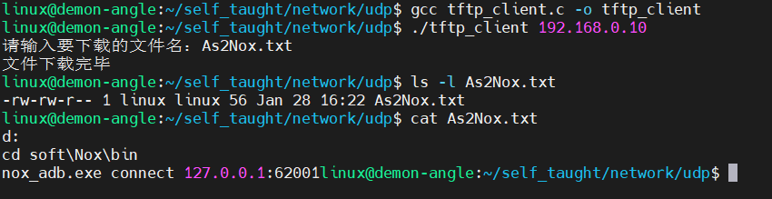

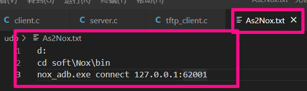

### 1.4.2 上传 -- 下载

```c
#include <stdio.h>
#include <stdlib.h>
#include <unistd.h>
#include <sys/types.h>
#include <sys/socket.h>
#include <arpa/inet.h>
#include <netinet/in.h>
#include <string.h>
#include <sys/stat.h>
#include <fcntl.h>
#include <errno.h>

#define ERRLOG(errmsg)  \
    do                  \
    {                   \
        perror(errmsg); \
        exit(1);        \
    } while (0)

#define N 128

void do_help()
{
    system("clear");
    printf("---------------------\n");
    printf("------ 1. 下载 ------\n");
    printf("------ 2. 上传 ------\n");
    printf("------ 3. 退出 ------\n");
    printf("---------------------\n");
}

void do_download(int sockfd, struct sockaddr_in server_addr)
{
    char filename[N] = {0};
    printf("请输入要下载的文件名：");
    scanf("%s", filename);

    char data[1024] = "";
    int data_len;
    int fd;
    int flags = 0;
    int num = 0;
    int recv_len;

    /* 组数据并发送 */
    data_len = sprintf(data, "%c%c%s%c%s%c", 0, 1, filename, 0, "octet", 0);
    if (sendto(sockfd, data, data_len, 0, (struct sockaddr *)&server_addr, sizeof(server_addr)) < 0)
    {
        ERRLOG("fail to sendto");
    }

    /* 接收数据并分析处理 */
    socklen_t addrlen = sizeof(server_addr);
    while (1)
    {
        if ((recv_len = recvfrom(sockfd, data, sizeof(data), 0, (struct sockaddr *)&server_addr, &addrlen)) < 0)
        {
            ERRLOG("fail to recvfrom");
        }

        if (5 == data[1])
        {
            printf("error: %s\n", data + 4);
            return;
        }
        else if (3 == data[1])
        {
            /* 防止文件内容清空 */
            if (0 == flags)
            {
                if ((fd = open(filename, O_WRONLY | O_CREAT | O_TRUNC, 0664)) < 0)
                {
                    ERRLOG("fail to open");
                }
                flags = 1;
            }

            /* 判断数据包的编号是否是上一次的编号加1 */
            if (num + 1 == ntohs(*(unsigned short *)(data + 2)) && recv_len == 516)
            {
                /* 向文件写入数据 */
                write(fd, data + 4, recv_len - 4);

                /* 组数据发送给服务器 */
                data[1] = 4;
                if (sendto(sockfd, data, 4, 0, (struct sockaddr *)&server_addr, addrlen) < 0)
                {
                    ERRLOG("fail to sendto");
                }

                num = ntohs(*(unsigned short *)(data + 2));
            }
            /* 接收到的最后一次的数据 */
            else if (num + 1 == ntohs(*(unsigned short *)(data + 2)) && recv_len < 516)
            {
                write(fd, data + 4, recv_len - 4);
                break;
            }
        }
    }

    printf("文件下载成功\n");
}

void do_upload(int sockfd, struct sockaddr_in server_addr)
{
    char filename[N] = {0};
    printf("请输入要上传的文件名：");
    scanf("%s", filename);

    /* 打开文件并判断文件是否存在 */
    int fd;
    if ((fd = open(filename, O_RDONLY)) < 0)
    {
        if (errno == ENOENT)
        {
            printf("文件%s不存在，请重新输入\n", filename);
            return;
        }
        else
        {
            ERRLOG("fail to open");
        }
    }

    /* 组数据并发送给服务器执行上传功能 */
    char data[1024] = {0};
    int data_len;
    socklen_t addrlen = sizeof(server_addr);

    data_len = sprintf(data, "%c%c%s%c%s%c", 0, 2, filename, 0, "octet", 0);

    if (sendto(sockfd, data, data_len, 0, (struct sockaddr *)&server_addr, addrlen) < 0)
    {
        ERRLOG("fail to sendto");
    }

    /* 接收服务器发送的数据并分析处理 */
    int recv_len;
    int num = 0;
    ssize_t bytes;
    while (1)
    {
        if ((recv_len = recvfrom(sockfd, data, sizeof(data), 0, (struct sockaddr *)&server_addr, &addrlen)) < 0)
        {
            ERRLOG("fail to recvfrom");
        }

        if (4 == data[1] && num == ntohs(*(unsigned short *)(data + 2)))
        {
            num++;
            bytes = read(fd, data + 4, 512);
            data[1] = 3;
            *(unsigned short *)(data + 2) = htons(num);

            if (512 == bytes)
            {
                if (sendto(sockfd, data, bytes + 4, 0, (struct sockaddr *)&server_addr, addrlen) < 0)
                {
                    ERRLOG("fail to sendto");
                }
            }
            else
            {
                if (sendto(sockfd, data, bytes + 4, 0, (struct sockaddr *)&server_addr, addrlen) < 0)
                {
                    ERRLOG("fail to sendto");
                }
                break;
            }
        }
    }

    printf("文件上传完毕\n");
}

int main(int argc, char const *argv[])
{
    int sockfd;
    struct sockaddr_in server_addr;
    /* 创建套接字 */
    if ((sockfd = socket(AF_INET, SOCK_DGRAM, 0)) < 0)
    {
        ERRLOG("fail to socket");
    }

    /* 填充服务器网络信息结构体 */
    server_addr.sin_family = AF_INET;
    server_addr.sin_addr.s_addr = inet_addr(argv[1]);
    server_addr.sin_port = htons(69);

    system("clear");
    printf("------------------------------\n");
    printf("----请输入help查看帮助信息----\n");
    printf("------------------------------\n");
    printf(">>> ");

    char buf[N] = {0};
NEXT:
    fgets(buf, N, stdin);
    buf[strlen(buf) - 1] = '\0';
    if (0 == strncmp(buf, "help", 4))
    {
        do_help();
    }
    else
    {
        printf("您输入的有误，请重新输入\n");
        goto NEXT;
    }

    int num;
    while (1)
    {
        printf("input>>> ");
        scanf("%d", &num);
        switch (num)
        {
        case 1:
            do_download(sockfd, server_addr);
            break;
        case 2:
            do_upload(sockfd, server_addr);
            break;
        case 3:
            close(sockfd);
            exit(0);
            break;
        default:
            printf("您输入的有误，请重新输入\n");
            break;
        }
    }

    return 0;
}
```

result

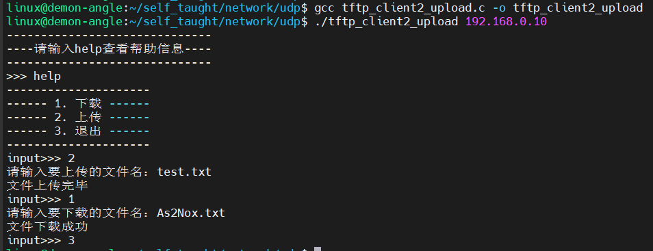

结果说明：test.txt是已经创建好的，且有内容，下载的文件是在服务器端已经存在了的。图片也是可以的。

# 2 UDP广播

## 2.1 广播的概念

### 2.1.1 广播

由一台主机向该主机所在子网内的所有主机发送数据的方式

例如：192.168.43.211主机发送广播信息，则192.168.43.1 ~ 192.168.43.254所有主机都可以接收到数据

广播只能用UDP或原始IP实现，不能用TCP

### 2.1.2 广播的用途

单个服务器与多个客户主机通信时减少分组流通

以下几个协议都用到广播

1. 地址解析协议（ARP）
2. 动态主机配置协议（DHCP）
3. 网络时间协议（NTP）

### 2.1.3 广播的特点

1. 处于同一子网的所有主机都必须处理数据
2. UDP数据包会沿协议栈向上一直到UDP层
3. 运行音视频等较高速率工作的应用，会带来大负荷
4. 局限于局域网内使用

### 2.1.4 广播地址

{网络ID，主机ID}

网络ID表示由子网掩码中1覆盖的连续位

主机ID表示由子网掩码中0覆盖的连续位

#### 2.1.4.1 定向广播地址

主机ID全1

1. 对于192.168.220.0/24，其定向广播地址为192.168.220.225
2. 通常路由器不转发该广播

#### 2.1.4.2 受限广播地址

255.255.255.255

路由器从不转发该广播

## 2.2 广播和单播的对比

### 2.2.1 单播

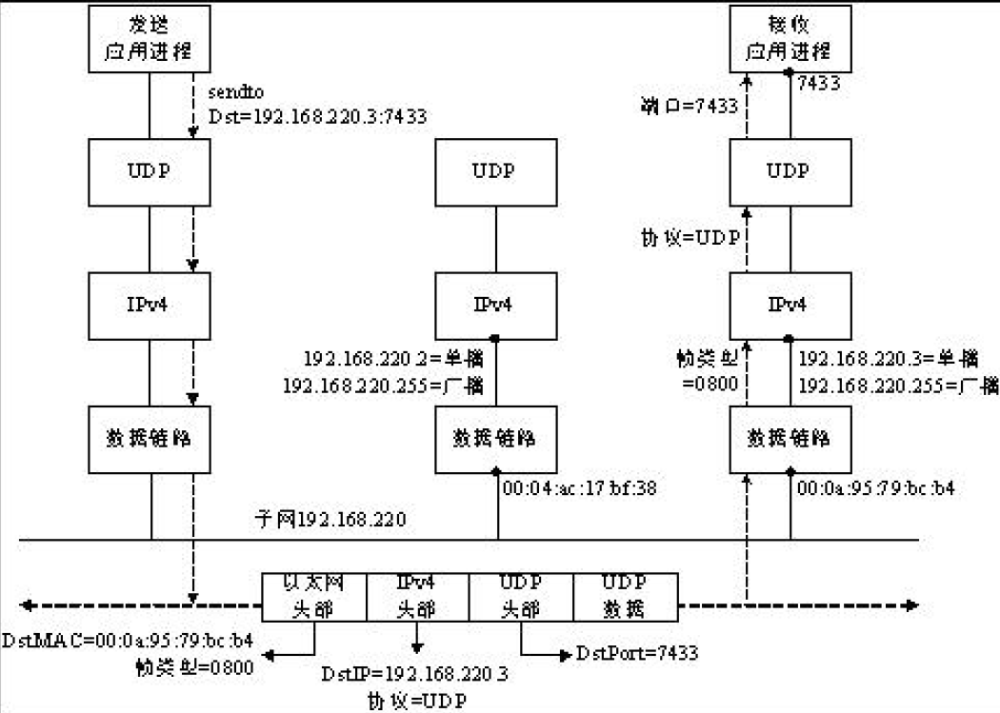

### 2.2.2 广播

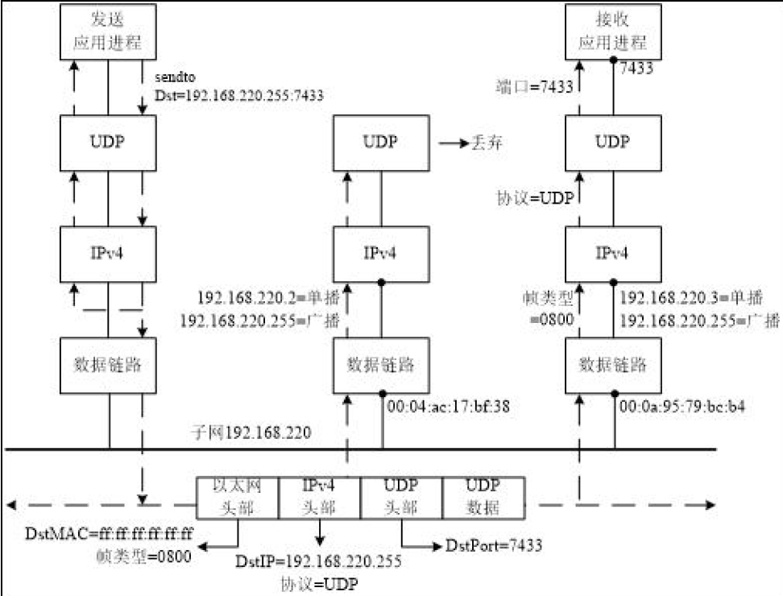

## 2.3 广播流程

### 2.3.1 发送者

1. 创建套接字socket()
2. 设置为允许发送广播权限setsockopt()
3. 向广播地址发送数据

### 2.3.2 接收者

1. 创建套接字socket()
2. 将套接字与广播的信息结构体绑定bind()
3. 接收数据recvfrom()

## 2.4 套接字选项setsockopt

<a name="setsockopt"></a>

```c
/* 头文件 */
#include <sys/types.h> /* See NOTES */
#include <sys/socket.h>
/* 函数格式 */
int setsockopt(int sockfd, int level, int optname,
			   const void *optval, socklen_t optlen);
/*
 * 功能：设置socket属性参数
 * 参数：
 *		sockfd：被设置的socket的文件描述符
 *		level:被设置的层次
 *          SOL_SOCKET：通用的套接字选项
 *          IPPROTO_TCP：TCP选项
 *          IPPROTO_IP：IP选项
 *          IPPROTO_IPV6：IPV6选项
 *		optname:被设置的选项
 *          SOL_SOCKET层次的设置选项：
 *              SO_BROADCAST		允许发送广播数据
 *              SO_DEBUG			允许调试
 *              SO_DONTROUTE		不查找路由
 *              SO_ERROR			获得套接字错误
 *              SO_KEEPALIVE		保持连接
 *              SO_LINGER			延迟关闭连接
 *              SO_OOBINLINE		带外数据放入正常数据流
 *              SO_RCVBUF			接收缓冲区大小
 *              SO_SNDBUF			发送缓冲区大小
 *              SO_RCVLOWAT			接收缓冲区下线
 *              SO_SNDLOWAT			发送缓冲区下线
 *              SO_RCVTIMEO			接收超时
 *              SO_SNDTIMEO			发送超时
 *              SO_REUSEADDR		允许重用本地地址和端口
 *              SO_TYPE				获得套接字类型
 *              SO_BSDCOMPAT		与BSD系统兼容
 *          IPPROTO_IP层次的设置选项：
 *              IP_HDRINCL			在数据包中包含IP首部
 *              IP_OPTINOS			IP首部选项
 *              IP_TOS				服务类型
 *              IP_TTL				生存时间
 *              IP_MULTICAST_TTL	设置多播组数据的TTL值
 *              IP_ADD_MEMBERSHIP	在指定接口上加入组播组
 *              IP_DROP_MEMBERSHIP	退出组播组
 *              IP_MULTICAST_IF		获取默认接口或设置接口
 *              IP_MULTICAST_LOOP	禁止组播数据回送
 *          IPPRO_TCP层次的设置选项：
 *              TCP_MAXSEG			TCP最大数据段的大小
 *              TCP_NODELAY			不使用Nagle算法
 *		optval:被设置值的地址
 *          int类型的值，存储的是bool的数据(0和1)
 *          0不允许
 *          1允许
 *		optlen:optval指针的操作范围
 * 返回值：
 *      成功返回0
 *      失败返回-1
 */
```

## 2.5 广播示例

### 2.5.1 发送者

```c
#include <stdio.h>  /* printf */
#include <stdlib.h> /* exit */
#include <sys/socket.h>
#include <sys/types.h>  /* socket */
#include <netinet/in.h> /* sockaddr_in */
#include <arpa/inet.h>  /* htons    inet_addr */
#include <unistd.h>     /* close */
#include <string.h>

int main(int argc, char const *argv[])
{
    if (argc < 3)
    {
        fprintf(stderr, "usage: %s <ip> <port>\n", argv[0]);
        exit(1);
    }

    /* 文件描述符 */
    int sockfd;
    /* 服务器网络信息结构体 */
    struct sockaddr_in broadcast_addr;
    socklen_t addr_len = sizeof(broadcast_addr);

    /* 第一步：创建套接字 */
    if (-1 == (sockfd = socket(AF_INET, SOCK_DGRAM, 0)))
    {
        perror("fail to socket");
        exit(1);
    }

    /* 第二步：设置为允许发送广播权限 */
    int on = 1;
    if (-1 == setsockopt(sockfd, SOL_SOCKET, SO_BROADCAST, &on, sizeof(on)))
    {
        perror("fail to setsockopt");
        exit(1);
    }

    /* 第三步：填充广播信息结构体 */
    broadcast_addr.sin_family = AF_INET;
    broadcast_addr.sin_addr.s_addr = inet_addr(argv[1]); /* 192.168.0.255/24 */
    broadcast_addr.sin_port = htons(atoi(argv[2]));

    /* 第四步：进行通信 */
    char buf[128] = "";
    while (1)
    {
        fgets(buf, sizeof(buf), stdin);
        buf[strlen(buf) - 1] = '\0';
        if (-1 == sendto(sockfd, buf, sizeof(buf), 0, (struct sockaddr *)&broadcast_addr, addr_len))
        {
            perror("fail to sendto");
            exit(1);
        }
    }

    return 0;
}
```

### 2.5.2 接收者

```c
#include <stdio.h>  /* printf */
#include <stdlib.h> /* exit */
#include <sys/socket.h>
#include <sys/types.h>  /* socket */
#include <netinet/in.h> /* sockaddr_in */
#include <arpa/inet.h>  /* htons    inet_addr */
#include <unistd.h>     /* close */
#include <string.h>

int main(int argc, char const *argv[])
{
    if (argc < 3)
    {
        fprintf(stderr, "usage: %s <ip> <port>\n", argv[0]);
        exit(1);
    }

    /* 文件描述符 */
    int sockfd;
    /* 服务器网络信息结构体 */
    struct sockaddr_in broadcast_addr;
    socklen_t addr_len = sizeof(broadcast_addr);

    /* 第一步：创建套接字 */
    if (-1 == (sockfd = socket(AF_INET, SOCK_DGRAM, 0)))
    {
        perror("fail to socket");
        exit(1);
    }

    /* 第二步：填充广播信息结构体 */
    broadcast_addr.sin_family = AF_INET;
    broadcast_addr.sin_addr.s_addr = inet_addr(argv[1]); /* 192.168.0.255/24 */
    broadcast_addr.sin_port = htons(atoi(argv[2]));

    /* 第三步：将套接字与广播信息结构体绑定 */
    if (-1 == bind(sockfd, (struct sockaddr *)&broadcast_addr, addr_len))
    {
        perror("fail to bind");
        exit(1);
    }

    /* 第四步：进行通信 */
    char text[32] = "";
    struct sockaddr_in send_addr;
    while (1)
    {
        if (-1 == recvfrom(sockfd, text, sizeof(text), 0, (struct sockaddr *)&send_addr, &addr_len))
        {
            perror("fail to recvfrom");
            exit(1);
        }
        printf("[%s - %d]: %s\n", inet_ntoa(send_addr.sin_addr), ntohs(send_addr.sin_port), text);
    }

    return 0;
}
```

result

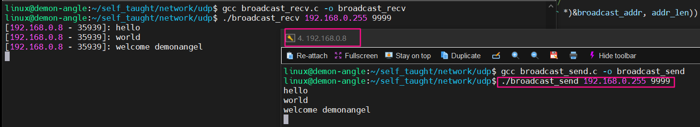

# 3 UDP多播

## 3.1 多播的概念

### 3.1.1 多播

数据的收发仅仅在同一分组中进行，所以多播有称之为组播

### 3.1.2 多播的特点

1. 多播地址标示一组接口
2. 多播可以用于广域网使用
3. 在IPV4中，多播是可选的

| 类型 | IPV4 | IPV6 |
| :----- | :----- | :----- |
| 单播 | √ | √ |
| 多播/组播 | 可选 | √ |
| 广播 | √ | × |
| 任播 | √，但未广泛使用 | √ |

### 3.1.3 多播的地址

```
IPV4的D类地址就是多播地址
十进制：224.0.0.1 ~ 239.255.255.254
十六进制：E0.00.00.01 ~ EF.FF.FF.FE
多播地址向以太网MAC地址的映射
```

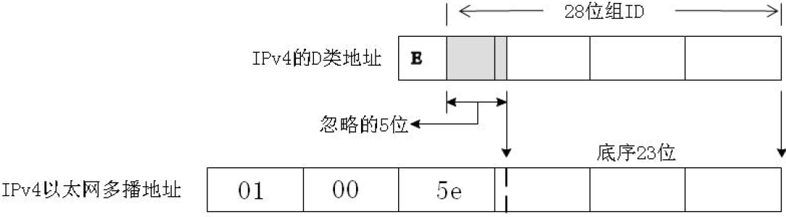

## 3.2 多播工作过程

比起广播，多播具有可控性，只有加入多播组的接收者才可以接收数据，否则接收不到

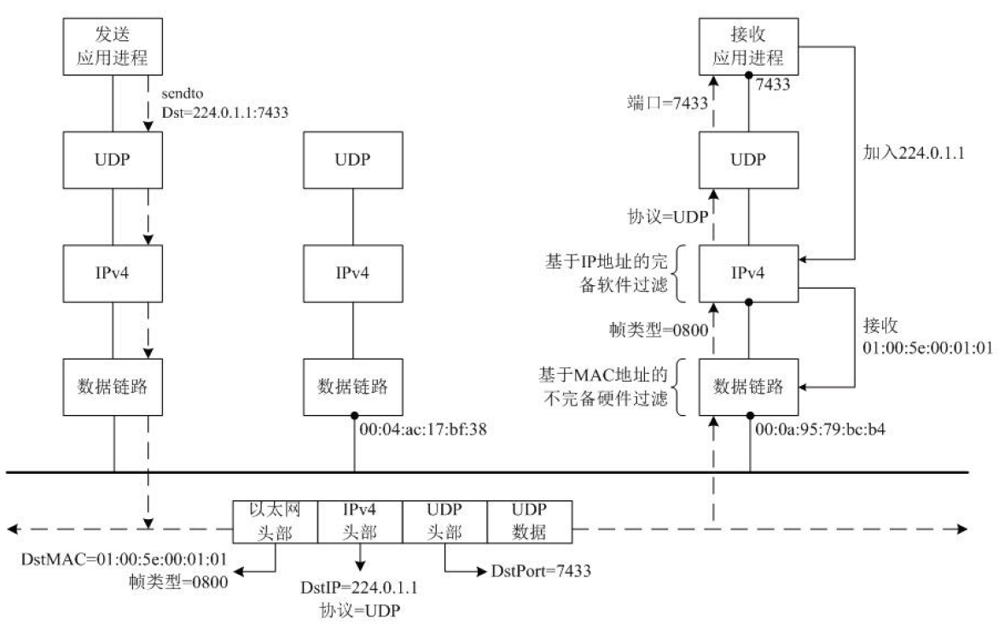

## 3.3 多播流程

### 3.3.1 发送者

1. 创建套接字socket()
2. 向多播地址发送数据sendto()

### 3.3.2 接收者

1. 创建套接字socket()
2. 设置为加入多播组setsockopt()
3. 将套接字与多播信息结构体绑定bind()
4. 接收数据

## 3.4 多播地址结构体

```c
/* IPv4 multicast request.  */
struct ip_mreq
{
    /* IP multicast address of group.  */
    struct in_addr imr_multiaddr;
    
    /* Local IP address of interface.  */
    struct in_addr imr_interface;
};

/* Internet address */
struct in_addr 
{
    uint32_t 	s_addr; 		/* address in network byte order */
};
```

## 3.5 多播套接口选项

[setsockopt](#setsockopt)

## 3.6 加入多播组示例

### 3.6.1 发送者

```c
#include <stdio.h>  /* printf */
#include <stdlib.h> /* exit */
#include <sys/socket.h>
#include <sys/types.h>  /* socket */
#include <netinet/in.h> /* sockaddr_in */
#include <arpa/inet.h>  /* htons    inet_addr */
#include <unistd.h>     /* close */
#include <string.h>

int main(int argc, char const *argv[])
{
    if (argc < 3)
    {
        fprintf(stderr, "usage: %s <ip> <port>\n", argv[0]);
        exit(1);
    }

    /* 文件描述符 */
    int sockfd;
    /* 服务器网络信息结构体 */
    struct sockaddr_in group_cast;
    socklen_t addr_len = sizeof(group_cast);

    /* 第一步：创建套接字 */
    if (-1 == (sockfd = socket(AF_INET, SOCK_DGRAM, 0)))
    {
        perror("fail to socket");
        exit(1);
    }

    /* 第二步：填充组播信息结构体 */
    group_cast.sin_family = AF_INET;
    group_cast.sin_addr.s_addr = inet_addr(argv[1]); /* 224.x.x.x ~ 239.x.x.x */
    group_cast.sin_port = htons(atoi(argv[2]));

    /* 第三步：进行通信 */
    char buf[128] = "";
    while (1)
    {
        fgets(buf, sizeof(buf), stdin);
        buf[strlen(buf) - 1] = '\0';
        if (-1 == sendto(sockfd, buf, sizeof(buf), 0, (struct sockaddr *)&group_cast, addr_len))
        {
            perror("fail to sendto");
            exit(1);
        }
    }

    return 0;
}
```

### 3.6.2 接收者

```c
#include <stdio.h>  /* printf */
#include <stdlib.h> /* exit */
#include <sys/socket.h>
#include <sys/types.h>  /* socket */
#include <netinet/in.h> /* sockaddr_in */
#include <arpa/inet.h>  /* htons    inet_addr */
#include <unistd.h>     /* close */
#include <string.h>

int main(int argc, char const *argv[])
{
    if (argc < 3)
    {
        fprintf(stderr, "usage: %s <ip> <port>\n", argv[0]);
        exit(1);
    }

    /* 文件描述符 */
    int sockfd;
    /* 服务器网络信息结构体 */
    struct sockaddr_in group_cast;
    socklen_t addr_len = sizeof(group_cast);

    /* 第一步：创建套接字 */
    if (-1 == (sockfd = socket(AF_INET, SOCK_DGRAM, 0)))
    {
        perror("fail to socket");
        exit(1);
    }

    /* 第二步：设置并加入多播组 */
    struct ip_mreq mreq;
    mreq.imr_multiaddr.s_addr = inet_addr(argv[1]);
    /* INADDR_ANY   任意主机地址（自动获取用户主机地址） */
    mreq.imr_interface.s_addr = INADDR_ANY;
    if (-1 == setsockopt(sockfd, IPPROTO_IP, IP_ADD_MEMBERSHIP, &mreq, sizeof(mreq)))
    {
        perror("fail to setsockopt");
        exit(1);
    }

    /* 第三步：填充组播信息结构体 */
    group_cast.sin_family = AF_INET;
    group_cast.sin_addr.s_addr = inet_addr(argv[1]);
    group_cast.sin_port = htons(atoi(argv[2]));

    /* 第四步：将套接字与组播信息结构体绑定 */
    if (-1 == bind(sockfd, (struct sockaddr *)&group_cast, addr_len))
    {
        perror("fail to bind");
        exit(1);        
    }

    
    /* 第五步：进行通信 */
    char text[32] = "";
    struct sockaddr_in send_addr;
    while (1)
    {
        if (-1 == recvfrom(sockfd, text, sizeof(text), 0, (struct sockaddr *)&send_addr, &addr_len))
        {
            perror("fail to recvfrom");
            exit(1);
        }
        printf("[%s - %d]: %s\n", inet_ntoa(send_addr.sin_addr), ntohs(send_addr.sin_port), text);
    }

    return 0;
}
```

result

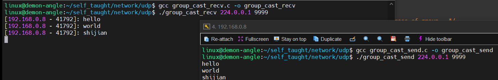

# 4 单播、组播、广播流程区别

## 4.1 单播

### 4.1.1 发送端

1. socket
2. 准备一个想要发送的IP地址和端口
3. sendto
4. close

### 4.1.2 接收端

1. socket
2. bind
3. recvfrom
4. close

## 4.2 广播

### 4.2.1 发送端

1. socket
2. 设置socket支持广播
3. sendto
4. close

### 4.2.2 接收端

1. socket
2. 设置端口复用
3. 设置socket支持广播
4. bind
5. recvfrom
6. close

## 4.3 组播

### 4.3.1 发送端

1. socket
2. 准备一个组播地址信息结构
3. sendto
4. close

### 4.3.2 接收端

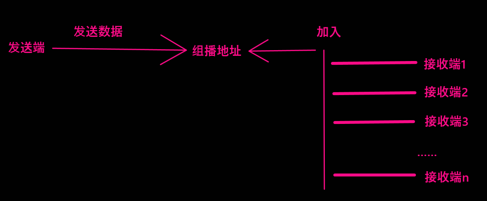

#### 4.3.2.1 如何加入

首先需要保证所有接收端在同一子网内，保证所有接收端的端口号和组播地址信息中的端口号一致。

#### 4.3.2.2 流程

1. socket
2. 设置端口复用
3. 准备自己的地址信息结构，将其加入多播组
4. bind
5. recvfrom
6. close