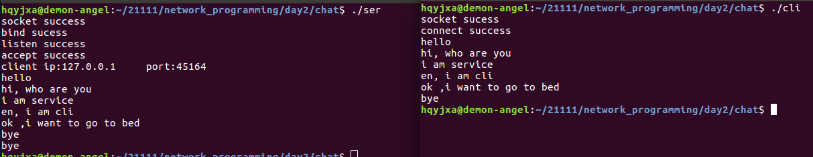
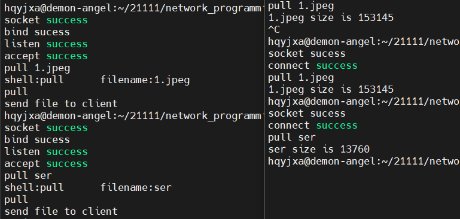
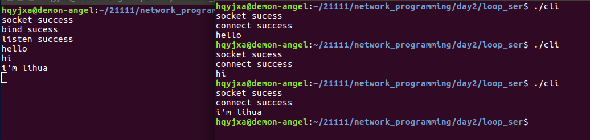
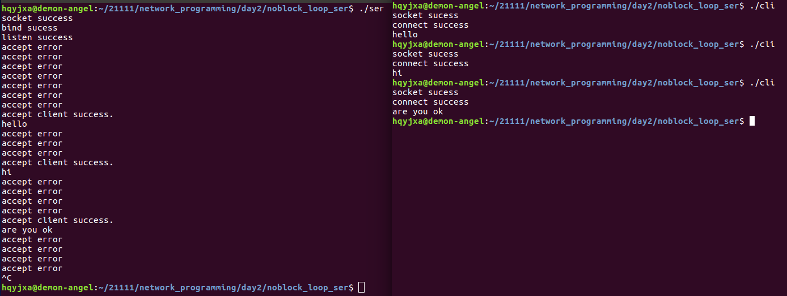

[Toc]

# 1 TCP CS模型搭建流程

## 1.1 服务器搭建流程

- socket
- bind
- listen
- accept
- send/recv
- close

## 1.2 客户端搭建流程

- socket
- connect
- send/recv
- close

# 2 函数接口

## 2.1 [socket](./02_UDP编程.md)

## 2.2 [bind](./02_UDP编程.md)

## 2.3 listen

```c
/* 头文件 */
#include <sys/types.h>
#include <sys/socket.h>

/* 函数格式 */
int listen(int sockfd, int backlog);
/*
 * 功能：
 *      监听一个socket的连接请求
 * 参数：
 *		sockfd：bind后的监听套接字
 *		backlog:监听队列的大小，允许通信连接的主机个数，一般设置为5、10
 * 返回值：
 *      成功返回0，失败返回-1
 */
```

## 2.4 accept

```c
/* 头文件 */
#include <sys/types.h>
#include <sys/socket.h>

/* 函数格式 */
int accept(int sockfd, struct sockaddr *addr, socklen_t *addrlen);
/*
 * 功能：
 *      阻塞等待接收一个客户端socket的连接请求
 * 参数：
 *		sockfd:监听套接字，socket函数返回值
 *		addr:存储客户端地址信息的结构的结构体变量地址
 *		ddrlen:结构体长度变量的地址
 * 返回值：
 *      成功返回通信套接字的文件描述符（只要有客户端连接，
 * 			就会产生新的文件描述符，这个新的文件描述符专门与指定的客户端进行通信的）
 * 		失败返回-1和错误码
 */
```

## 2.5 send/recv

```c
/* 头文件 */
#include <sys/types.h>
#include <sys/socket.h>

/* 函数格式 */
ssize_t send(int sockfd, const void *buf, size_t len, int flags);
/*
 * 功能：
 *      往socket写入数据(发送数据给通信对端)
 * 参数：
 *		sockfd:通信套接字的文件描述符
 * 			客户端：socket函数的返回值
 * 			服务器：accept函数的返回值
 *		buf:想要发送的数据的内存首地址
 *		len:想要发送的字节数
 *		flags:一般默认为0
 * 			0	阻塞
 * 			MSG_DONTWAIT	非阻塞
 * 返回值：
 *      成功返回成功发送的字节数，失败返回-1
 */

/*
 * 注意:
 * 		不能用TCP协议发送0长度的数据包
 */
```

```c
/* 头文件 */
#include <sys/types.h>
#include <sys/socket.h>

/* 函数格式 */
ssize_t recv(int sockfd, const void *buf, size_t len, int flags);
/*
 * 功能：
 *      从socket读取数据(接收通信对端发送的数据)
 * 参数：
 *		sockfd:通信套接字的文件描述符
 * 			客户端：socket函数的返回值
 * 			服务器：accept函数的返回值
 *		buf:存储想要接收的数据的内存首地址
 *		len:想要接收的字节数
 *		flags:一般默认为0
 * 			0	阻塞
 * 			MSG_DONTWAIT	非阻塞
 * 返回值：
 *      成功返回成功接收的字节数，失败返回-1，
 *      当返回值为0时，表示对端执行一个有序关闭。
 */
```

## 2.6 connect

```c
/* 头文件 */
#include <sys/types.h>
#include <sys/socket.h>

/* 函数格式 */
int connect(int sockfd, const struct sockaddr *addr, socklen_t addrlen);
/*
 * 功能：
 * 		客户端socket发起一个连接请求
 * 参数：
 *      sockfd:客户端的通信套接字，socket函数的返回值
 *		addr:存储服务器地址信息的结构的首地址
 *		addrlen:地址信息结构的长度
 * 返回值：
 *      成功返回0，失败返回-1
 */
```

### 2.6.1 注意

1. connect建立连接之后不会产生新的套接字
2. 连接成功后才可以开始传输TCP数据

## 2.7 [inet_addr](./02_UDP编程.md)

## 2.8 [inet_ntoa](./02_UDP编程.md)

## 2.9 常见的宏定义地址

```c
/*
 * Definitions of the bits in an Internet address integer.
 * On subnets, host and network parts are found according
 * to the subnet mask, not these masks.
 */
#define IN_CLASSA(a) ((((long int)(a)) & 0x80000000) == 0)
#define IN_CLASSA_NET 0xff000000
#define IN_CLASSA_NSHIFT 24
#define IN_CLASSA_HOST (0xffffffff & ~IN_CLASSA_NET)
#define IN_CLASSA_MAX 128

#define IN_CLASSB(a) ((((long int)(a)) & 0xc0000000) == 0x80000000)
#define IN_CLASSB_NET 0xffff0000
#define IN_CLASSB_NSHIFT 16
#define IN_CLASSB_HOST (0xffffffff & ~IN_CLASSB_NET)
#define IN_CLASSB_MAX 65536

#define IN_CLASSC(a) ((((long int)(a)) & 0xe0000000) == 0xc0000000)
#define IN_CLASSC_NET 0xffffff00
#define IN_CLASSC_NSHIFT 8
#define IN_CLASSC_HOST (0xffffffff & ~IN_CLASSC_NET)

#define IN_CLASSD(a) ((((long int)(a)) & 0xf0000000) == 0xe0000000)
#define IN_MULTICAST(a) IN_CLASSD(a)
#define IN_MULTICAST_NET 0xF0000000

#define IN_EXPERIMENTAL(a) ((((long int)(a)) & 0xf0000000) == 0xf0000000)
#define IN_BADCLASS(a) IN_EXPERIMENTAL((a))

/* Address to accept any incoming messages. */
#define INADDR_ANY ((unsigned long int)0x00000000)

/* Address to send to all hosts. */
#define INADDR_BROADCAST ((unsigned long int)0xffffffff)

/* Address indicating an error return. */
#define INADDR_NONE ((unsigned long int)0xffffffff)

/* Network number for local host loopback. */
#define IN_LOOPBACKNET 127

/* Address to loopback in software to local host.  */
#define INADDR_LOOPBACK 0x7f000001 /* 127.0.0.1   */
#define IN_LOOPBACK(a) ((((long int)(a)) & 0xff000000) == 0x7f000000)

/* Defines for Multicast INADDR */
#define INADDR_UNSPEC_GROUP 0xe0000000U    /* 224.0.0.0   */
#define INADDR_ALLHOSTS_GROUP 0xe0000001U  /* 224.0.0.1   */
#define INADDR_ALLRTRS_GROUP 0xe0000002U   /* 224.0.0.2 */
#define INADDR_MAX_LOCAL_GROUP 0xe00000ffU /* 224.0.0.255 */
```

## 2.10 close

close关闭套接字

1. 使用close函数即可关闭套接字

   关闭一个代表已连接套接字将导致另一端接收到一个0长度的数据包

2. 做服务器时

   - 关闭监听套接字将导致服务器无法接收新的连接，但不会影响已经建立的连接
   - 关闭accept返回的已连接套接字将导致它所代表的连接被关闭，但不会影响服务器的监听

3. 做客户端时

   关闭连接就是关闭连接，不意味着其他

# 3 实现两个进程之间的通信

## 3.1 service

```c
#include <stdio.h>
#include <sys/types.h>
#include <sys/socket.h>
#include <arpa/inet.h>
#include <string.h>
#include <unistd.h>

int main(int argc, char const *argv[])
{
	/* 创建一个通信端口 */
	int serfd = socket(AF_INET, SOCK_STREAM, 0);
	if (serfd < 0)
	{
		puts("socket error");
		return -1;
	}
	puts("socket success");
	/* 定义一个存储IP地址和端口信息的结构体 */
	struct sockaddr_in myser;
	/* IPV4通信 */
	myser.sin_family = AF_INET;
	/* 将主机字节序的16bit的数据转为网络字节序16bit的数据 */
	myser.sin_port = htons(8888);
	/* 任一主机字节序序的地址转换为网络字节序32位的数据 */
	myser.sin_addr.s_addr = htonl(INADDR_ANY);
	/* 给socket绑定IP地址和端口号 */
	int ret = bind(serfd, (struct sockaddr *)&myser, sizeof(myser));
	if (ret != 0)
	{
		puts("bind error");
		close(serfd);
		return -1;
	}
	puts("bind sucess");
	/* 监听一个socket的连接请求 */
	ret = listen(serfd, 5);
	if (ret != 0)
	{
		puts("listen error");
		close(serfd);
		return -1;
	}
	puts("listen success");

	/* 定义一个变量来接收accept函数的返回值 */
	int connfd = -1;
	struct sockaddr_in mycli;
	int len = sizeof(struct sockaddr_in);
	/* 接收一个客户端socket的连接请求 */
	connfd = accept(serfd, (struct sockaddr *)&mycli, &len);
	if (connfd < 0)
	{
		puts("accept error");
		close(serfd);
		return -1;
	}
	puts("accept success");
	/* inet_ntoa将二进制的IP地址转换为点分十进制的字符串 */
	/* ntohs将网络字节序的16bit的数据转为主机字节序16bit的数据 */
	printf("client ip:%s\tport:%d\n", inet_ntoa(mycli.sin_addr), ntohs(mycli.sin_port));
	char buf[100];
	/* 实现聊天功能 */
	while (1)
	{
		memset(buf, 0, sizeof(buf));
		gets(buf);

		/* 往socket写入数据(发送数据给通信对端) */
		send(connfd, buf, sizeof(buf), 0);
		/* 在buf中匹配字符串“bye” */
		if (strstr(buf, "bye"))
		{
			/* buf中有字符串"bye"退出循环 */
			break;
		}
		memset(buf, 0, sizeof(buf));
		/* 从socket读取数据(接收通信对端发送的数据) */
		ret = recv(connfd, buf, sizeof(buf), 0);
		if (ret > 0)
		{
			puts(buf);
			if (strstr(buf, "buf"))
			{
				/* 对端的消息中有字符串"bye"退出循环 */
				break;
			}
		}
		/* 如果对端有序关闭退出循环 */
		else if (0 == ret)
		{
			break;
		}
	}

	sleep(2);

	/* 关闭套接字文件描述符 */
	close(connfd);
	close(serfd);
	return 0;
}
```

## 3.2 client

```c
#include <stdio.h>
#include <string.h>
#include <unistd.h>
#include <sys/types.h>
#include <sys/socket.h>
#include <arpa/inet.h>

int main(int argc, char const *argv[])
{
    /* 创建一个通信端口 */
    int clifd = socket(AF_INET, SOCK_STREAM, 0);
    if (clifd < 0)
    {
        puts("socket error");
        return -1;
    }
    puts("socket sucess");
    /* 定义一个存储IP地址和端口信息的结构体 */
    struct sockaddr_in myser;
    /* IPV4通信 */
    myser.sin_family = AF_INET;
    /* 将主机字节序的16bit的数据转为网络字节序16bit的数据 */
    myser.sin_port = htons(8888);
    /* 将点分十进制的字符串转换为大端序的IP地址 */
    myser.sin_addr.s_addr = inet_addr("127.0.0.1");
    /* 客户端socket发起一个连接请求 */
    int ret = connect(clifd, (struct sockaddr *)&myser, sizeof(myser));
    if (ret != 0)
    {
        puts("connect error");
        close(clifd);
        return -1;
    }
    puts("connect success");
    char buf[100];
    while (1)
    {
        memset(buf, 0, sizeof(buf));
        /* 从socket读取数据(接收通信对端发送的数据) */
        ret = recv(clifd, buf, sizeof(buf), 0);
        if (ret > 0)
        {
            puts(buf);
            if(strstr(buf, "bye"))
            {
                break;
            }
            memset(buf, 0, sizeof(buf));
            gets(buf);
            /* 往socket写入数据(发送数据给通信对端) */
            send(clifd, buf, sizeof(buf), 0);
            if(strstr(buf, "bye"))
            {
                sleep(2);
                break;
            }
        }
        /* 如果对端有序关闭程序退出 */
        else if (0 == ret)
        {
            puts("peer is closed");
            close(clifd);
            return -1;
        }
    }

    /* 关闭套接字文件描述符 */
    close(clifd);

    return 0;
}
```

result



# 4 实现简易文件下载

实现简易文件下载(可以是普通文件，或者图片文件)

## 4.1 service

```cpp
#include <stdio.h>
#include <sys/types.h>
#include <sys/socket.h>
#include <arpa/inet.h>
#include <string.h>
#include <unistd.h>
#include <sys/stat.h>
#include <fcntl.h>
#include <stdlib.h>

int main(int argc, char const *argv[])
{
    // 创建一个通信端口
    int serfd = socket(AF_INET, SOCK_STREAM, 0);
    if (serfd < 0)
    {
        puts("socket error");
        return -1;
    }
    puts("socket success");
    // 定义一个存储IP地址和端口信息的结构体
    struct sockaddr_in myser;
    // IPV4通信
    myser.sin_family = AF_INET;
    // 将主机字节序的16bit的数据转为网络字节序16bit的数据
    myser.sin_port = htons(8888);
    // 任一主机字节序序的地址转换为网络字节序32位的数据
    myser.sin_addr.s_addr = htonl(INADDR_ANY);
    // 给socket绑定IP地址和端口号
    int ret = bind(serfd, (struct sockaddr *)&myser, sizeof(myser));
    if (ret != 0)
    {
        puts("bind error");
        close(serfd);
        return -1;
    }
    puts("bind sucess");
    // 监听一个socket的连接请求
    ret = listen(serfd, 5);
    if (ret != 0)
    {
        puts("listen error");
        close(serfd);
        return -1;
    }
    puts("listen success");

    // 定义一个变量来接收accept函数的返回值
    int connfd = -1;
    struct sockaddr_in mycli;
    int len = sizeof(struct sockaddr_in);
    // 接收一个客户端socket的连接请求
    connfd = accept(serfd, (struct sockaddr *)&mycli, &len);
    if (connfd < 0)
    {
        puts("accept error");
        close(serfd);
        return -1;
    }
    puts("accept success");
    while (1)
    {
        char buf[30] = {0};
        ret = recv(connfd, buf, sizeof(buf), 0);
        if (ret > 0)
        {
            puts(buf);
            char shell[5] = {0};
            char filename[30] = {0};
            strncpy(shell, buf, 4);
            strcpy(filename, buf + 5);
            printf("shell:%s\tfilename:%s\n", shell, filename);
            if (0 == strcmp(shell, "pull"))
            {
                puts("pull");
                int fd = -1;
                fd = open(filename, O_RDONLY);
                if (fd < 0)
                {
                    puts("fail to open");
                    break;
                }
                // 使用lseek定位到文件末尾（文件大小）
                int f_len = lseek(fd, 0, SEEK_END);
                char f_size[20] = {0};
                sprintf(f_size, "len:%d", f_len);
                // 将文件大小传给客户端
                send(connfd, f_size, 20, 0);
                // 重新定位到文件开头
                lseek(fd, 0, SEEK_SET);
                // malloc一片空间
                char *p = (char *)malloc(f_len);
                memset(p, 0, f_len);
                // 读取内容
                ret = read(fd,p,f_len);
                if (ret == f_len)
                {
                    puts("send file to client");
                    // 将读取的内容发送到客户端
                    send(connfd, p, f_len, 0);
                }
                free(p);
                close(fd);
            }
        }
        else if (0 == ret)
        {
            break;
        }
    }

    // 关闭套接字文件描述符
    close(connfd);
    close(serfd);
    return 0;
}
```

## 4.2 client

```cpp
#include <stdio.h>
#include <string.h>
#include <unistd.h>
#include <sys/types.h>
#include <sys/socket.h>
#include <arpa/inet.h>
#include <stdlib.h>
#include <sys/stat.h>
#include <fcntl.h>

int main(int argc, char const *argv[])
{
    // 创建一个通信端口
    int clifd = socket(AF_INET, SOCK_STREAM, 0);
    if (clifd < 0)
    {
        puts("socket error");
        return -1;
    }
    puts("socket sucess");
    // 定义一个存储IP地址和端口信息的结构体
    struct sockaddr_in myser;
    // IPV4通信
    myser.sin_family = AF_INET;
    // 将主机字节序的16bit的数据转为网络字节序16bit的数据
    myser.sin_port = htons(8888);
    // 将点分十进制的字符串转换为大端序的IP地址
    myser.sin_addr.s_addr = inet_addr("127.0.0.1");
    // 客户端socket发起一个连接请求
    int ret = connect(clifd, (struct sockaddr *)&myser, sizeof(myser));
    if (ret != 0)
    {
        puts("connect error");
        close(clifd);
        return -1;
    }
    puts("connect success");
    char buf[30] = {0};
    gets(buf);
    // 将终端命令发送给服务器
    send(clifd, buf, sizeof(buf), 0);

    char shell[5] = {0};
    char filename[30] = {0};
    strncpy(shell, buf, 4);
    strcpy(filename, buf + 5);
    char f_size[20] = {0};

    ret = recv(clifd, f_size, 20, 0);
    if (ret > 0)
    {
        int fl = atoi(f_size + 4);
        printf("%s size is %d\n", filename, fl);
        char *p = (char *)malloc(fl);
        int fd = open(filename, O_CREAT | O_WRONLY, 0664);
        int total = fl;
        while (1)
        {
            if (total <= 0)
            {
                break;
            }
            // 接收数据
            ret = recv(clifd, p, total, 0);
            if (ret > 0)
            {
                // 写入到文件中
                write(fd, p, ret);
                total -= ret;
            }
        }
        close(fd);
        free(p);
    }
    // 关闭套接字文件描述符
    close(clifd);

    return 0;
}
```

result



# 5 实现循环服务器

## 5.1 循环服务的搭建

### 5.1.1 循环服务器的作用

1. 服务器可以分时处理多个客户端的业务
2. 客户端的业务一定是在有限时间内可以快速处理完的

### 5.1.2 搭建流程

```
listenfd = socket
bind
listen
while(1)
{
	connfd = accpet(); // 阻塞
	do_work()
	close(connfd)
}
close(listenfd)	
```

## 5.2 service

```c
#include <stdio.h>
#include <sys/types.h>
#include <sys/socket.h>
#include <arpa/inet.h>
#include <string.h>
#include <unistd.h>

int main(int argc, char const *argv[])
{
    /* 创建一个通信端口 */
    int listenfd = socket(AF_INET, SOCK_STREAM, 0);
    if (listenfd < 0)
    {
        puts("socket error");
        return -1;
    }
    puts("socket success");
    /* 定义一个存储IP地址和端口信息的结构体 */
    struct sockaddr_in myser;
    /* IPV4通信 */
    myser.sin_family = AF_INET;
    /* 将主机字节序的16bit的数据转为网络字节序16bit的数据 */
    myser.sin_port = htons(8888);
    /* 任一主机字节序序的地址转换为网络字节序32位的数据 */
    myser.sin_addr.s_addr = htonl(INADDR_ANY);
    /* 给socket绑定IP地址和端口号 */
    int ret = bind(listenfd, (struct sockaddr *)&myser, sizeof(myser));
    if (ret != 0)
    {
        puts("bind error");
        close(listenfd);
        return -1;
    }
    puts("bind sucess");
    /* 监听一个socket的连接请求 */
    ret = listen(listenfd, 5);
    if (ret != 0)
    {
        puts("listen error");
        close(listenfd);
        return -1;
    }
    puts("listen success");

    /* 循环accept */
    while (1)
    {
        struct sockaddr_in mycli;
        int len = sizeof(struct sockaddr_in);
        /* 接收一个客户端socket的连接请求 */
        int connfd = accept(listenfd, (struct sockaddr *)&mycli, &len);
        if (connfd < 0)
        {
            puts("accept error");
            continue;
        }
        char buf[100];
        memset(buf, 0, sizeof(buf));
        /* 从socket读取数据(接收通信对端发送的数据) */
        int ret = recv(connfd, buf, sizeof(buf), 0);
        if (ret > 0)
        {
            puts(buf);
        }
        else if (0 == ret)
        {
            puts("peer is closed");
        }
        /* 关闭套接字文件描述符 */
        close(connfd);
    }

    /* 关闭套接字文件描述符 */
    close(listenfd);
    return 0;
}
```

## 5.3 client

<a name="client"></a>

```c
#include <stdio.h>
#include <string.h>
#include <unistd.h>
#include <sys/types.h>
#include <sys/socket.h>
#include <arpa/inet.h>

int main(int argc, char const *argv[])
{
    /* 创建一个通信端口 */
    int clifd = socket(AF_INET, SOCK_STREAM, 0);
    if(clifd < 0)
    {
        puts("socket error");
        return -1;
    }
    puts("socket sucess");
    /* 定义一个存储IP地址和端口信息的结构体 */
    struct sockaddr_in myser;
    /* IPV4通信 */
    myser.sin_family = AF_INET;
    /* 将主机字节序的16bit的数据转为网络字节序16bit的数据 */
    myser.sin_port = htons(8888);
    /* 将点分十进制的字符串转换为大端序的IP地址 */
    myser.sin_addr.s_addr = inet_addr("127.0.0.1");
    /* 客户端socket发起一个连接请求 */
    int ret = connect(clifd, (struct sockaddr *)&myser, sizeof(myser));
    if(ret != 0)
    {
        puts("connect error");
        close(clifd);
        return -1;
    }
    puts("connect success");
    char buf[100];
    memset(buf, 0, sizeof(buf));
	gets(buf);
    /* 往socket写入数据(发送数据给通信对端) */
	send(clifd, buf, sizeof(buf), 0);
    sleep(2);
    /* 关闭套接字文件描述符 */
    close(clifd);
    
    return 0;
}
```

result



# 6 实现非阻塞的循环服务器

## 6.1 非阻塞循环服务器的搭建

```
listenfd = socket;
bind
listen
int flag = fcntl(listenfd, F_GETFL);
fcntl(listenfd, F_SETFL, flag | O_NONBLOCK);
while(1)
{
    connfd = accept()
    do_work()
    close(connfd)
}
close(listenfd)
```

## 6.2 fcntl函数

```c
/* 头文件 */
#include <unistd.h>
#include <fcntl.h>

/* 函数格式 */
int fcntl(int fd, int cmd, ... /* arg */ );
/*
 * 功能：
 *      用来控制文件描述符的
 * 参数：
 *      fd：被控制的文件描述符
 *      cmd：控制命令
 *          F_GETFL:获取文件描述符的状态
 *          F_SETFL:设置文件描述符的状态
 *              在使用F_SETFL时，会使用到arg，arg常用的参数有：
 *                  O_NONBLOCK:非阻塞I/O
 *                  O_ASYNC:异步I/O
 *      ...arg：可变参数(可有可无)
 * 返回值：
 * 		成功返回0
 * 		失败返回-1.错误原因存于errno
 */
```

## 6.3 service

```c
#include <stdio.h>
#include <sys/types.h>
#include <sys/socket.h>
#include <arpa/inet.h>
#include <string.h>
#include <unistd.h>
#include <fcntl.h>

int main(int argc, char const *argv[])
{
	/* 创建一个通信端口 */
	int listenfd = socket(AF_INET, SOCK_STREAM, 0);
	if (listenfd < 0)
	{
		puts("socket error");
		return -1;
	}
	puts("socket success");
	/* 定义一个存储IP地址和端口信息的结构体 */
	struct sockaddr_in myser;
	/* IPV4通信 */
	myser.sin_family = AF_INET;
	/* 将主机字节序的16bit的数据转为网络字节序16bit的数据 */
	myser.sin_port = htons(8888);
	/* 任一主机字节序序的地址转换为网络字节序32位的数据 */
	myser.sin_addr.s_addr = htonl(INADDR_ANY);
	/* 给socket绑定IP地址和端口号 */
	int ret = bind(listenfd, (struct sockaddr *)&myser, sizeof(myser));
	if (ret != 0)
	{
		puts("bind error");
		close(listenfd);
		return -1;
	}
	puts("bind sucess");
	/* 监听一个socket的连接请求 */
	ret = listen(listenfd, 5);
	if (ret != 0)
	{
		puts("listen error");
		close(listenfd);
		return -1;
	}
	puts("listen success");

	/* 获取listenfd文件描述符的状态 */
	int flag = fcntl(listenfd, F_GETFL);
	fcntl(listenfd, F_SETFL, flag | O_NONBLOCK);
	/* 循环accept */
	while (1)
	{
		struct sockaddr_in mycli;
		int len = sizeof(struct sockaddr_in);
		/* 接收一个客户端socket的连接请求 */
		int connfd = accept(listenfd, (struct sockaddr *)&mycli, &len);
		if (connfd < 0)
		{
			puts("accept error");
			sleep(1);
			continue;
		}
		puts("accept client success.");
		char buf[100];
		memset(buf, 0, sizeof(buf));
		/* 从socket读取数据(接收通信对端发送的数据) */
		int ret = recv(connfd, buf, sizeof(buf), 0);
		if (ret > 0)
		{
			puts(buf);
		}
		else if (0 == ret)
		{
			puts("peer is closed");
		}
		/* 关闭套接字文件描述符 */
		close(connfd);
	}

	/* 关闭套接字文件描述符 */
	close(listenfd);
	return 0;
}
```

## 6.4 client

[代码跳转](#client)

result

