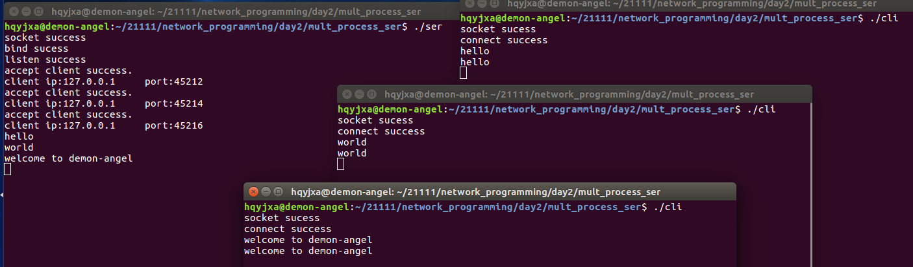
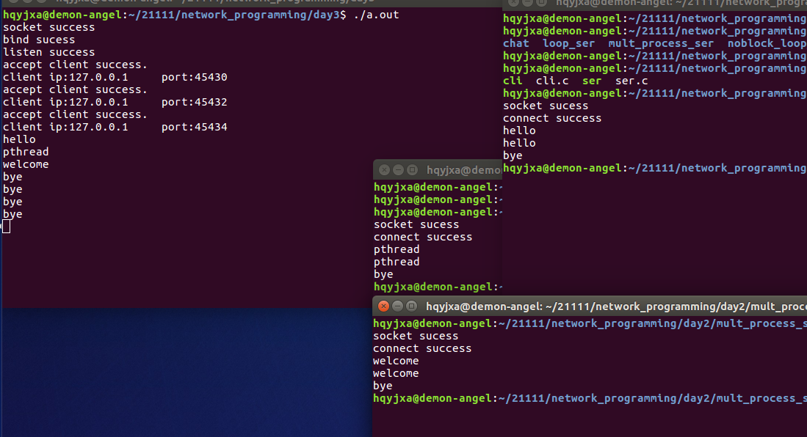

[toc]

# 1 并发服务器

## 1.1 TCP不能实现并发的原因

由于TCP服务器端有两个读阻塞函数，accept和recv，两个函数需要先后运行，所以导致运行一个函数的时候另一个函数无法执行，所以无法保证一边连接客户端，一边与其他客户端通信。

实现同一时刻处理多个客户端的服务器，我们称之为==**并发服务器**==

1. 多进程并发服务器
2. 多线程并发服务器
3. IO多路复用的并发服务器

# 2 实现多进程并发回射服务器

## 2.1 多进程并发服务器的搭建

```
socket
bind
listen
while(1)
{
	connfd = accept()
	pid_t pid = fork()
	if(pid == 0)
	{
		do_work()
		close(connfd)
	}
}
close(listenfd)
```

## 2.2 service

```c
#include <stdio.h>
#include <sys/types.h>
#include <sys/socket.h>
#include <arpa/inet.h>
#include <string.h>
#include <unistd.h>


int main(int argc, char const *argv[])
{
    /* 创建一个通信端口 */
    int serfd = socket(AF_INET, SOCK_STREAM, 0);
    if (serfd < 0)
    {
        puts("socket error");
        return -1;
    }
    puts("socket success");
    /* 定义一个存储IP地址和端口信息的结构体 */
    struct sockaddr_in myser;
    /* IPV4通信 */
    myser.sin_family = AF_INET;
    /* 将主机字节序的16bit的数据转为网络字节序16bit的数据 */
    myser.sin_port = htons(8888);
    /* 任一主机字节序序的地址转换为网络字节序32位的数据 */
    myser.sin_addr.s_addr = htonl(INADDR_ANY);
    /* 给socket绑定IP地址和端口号 */
    int ret = bind(serfd, (struct sockaddr *)&myser, sizeof(myser));
    if (ret != 0)
    {
        puts("bind error");
        close(serfd);
        return -1;
    }
    puts("bind sucess");
    /* 监听一个socket的连接请求 */
    ret = listen(serfd, 5);
    if (ret != 0)
    {
        puts("listen error");
        close(serfd);
        return -1;
    }
    puts("listen success");

    /* 循环accept */
    while (1)
    {
        int connfd = -1;
        struct sockaddr_in mycli;
        int len = sizeof(struct sockaddr_in);
        /* 接收一个客户端socket的连接请求 */
        connfd = accept(serfd, (struct sockaddr *)&mycli, &len);
        if (connfd < 0)
        {
            puts("accept error");
            continue;
        }
        puts("accept client success.");

        /* inet_ntoa将二进制的IP地址转换为点分十进制的字符串 */
        /* ntohs将网络字节序的16bit的数据转为主机字节序16bit的数据 */
        printf("client ip:%s\tport:%d\n", inet_ntoa(mycli.sin_addr), ntohs(mycli.sin_port));

        pid_t pid = fork();
        if (0 == pid)
        {
            char buf[100];
            while (1)
            {
                memset(buf, 0, sizeof(buf));
                /* 从socket读取数据(接收通信对端发送的数据) */
                ret = recv(connfd, buf, sizeof(buf), 0);
                if (ret > 0)
                {
                    puts(buf);
                    if (strstr(buf, "bye"))
                    {
                        break;
                    }
                    /* 往socket写入数据(发送数据给通信对端) */
                    send(connfd, buf, sizeof(buf), 0);
                    if (strstr(buf, "bye"))
                    {
                        break;
                    }
                }
                else if (0 == ret)
                {
                    break;
                }
            }
            sleep(2);
            /* 关闭套接字文件描述符 */
            close(connfd);
        }
    }

    /* 关闭套接字文件描述符 */
    close(serfd);
    return 0;
}
```

## 2.3 client

```c
#include <stdio.h>
#include <string.h>
#include <unistd.h>
#include <sys/types.h>
#include <sys/socket.h>
#include <arpa/inet.h>

int main(int argc, char const *argv[])
{
    /* 创建一个通信端口 */
    int clifd = socket(AF_INET, SOCK_STREAM, 0);
    if (clifd < 0)
    {
        puts("socket error");
        return -1;
    }
    puts("socket sucess");
    /* 定义一个存储IP地址和端口信息的结构体 */
    struct sockaddr_in myser;
    /* IPV4通信 */
    myser.sin_family = AF_INET;
    /* 将主机字节序的16bit的数据转为网络字节序16bit的数据 */
    myser.sin_port = htons(8888);
    /* 将点分十进制的字符串转换为大端序的IP地址 */
    myser.sin_addr.s_addr = inet_addr("127.0.0.1");
    /* 客户端socket发起一个连接请求 */
    int ret = connect(clifd, (struct sockaddr *)&myser, sizeof(myser));
    if (ret != 0)
    {
        puts("connect error");
        close(clifd);
        return -1;
    }
    puts("connect success");
    char buf[100];
    while (1)
    {
        memset(buf, 0, sizeof(buf));
        gets(buf);
        /* 往socket写入数据(发送数据给通信对端) */
        send(clifd, buf, sizeof(buf), 0);
        if (strstr(buf, "bye"))
        {
            sleep(2);
            break;
        }
        memset(buf, 0, sizeof(buf));
        /* 从socket读取数据(接收通信对端发送的数据) */
        ret = recv(clifd, buf, sizeof(buf), 0);
        if (ret > 0)
        {
            puts(buf);
            if (strstr(buf, "bye"))
            {
                sleep(2);
                break;
            }
        }
        /* 如果对端有序关闭程序退出 */
        else if (0 == ret)
        {
            puts("peer is closed");
            close(clifd);
            return -1;
        }
    }

    /* 关闭套接字文件描述符 */
    close(clifd);

    return 0;
}
```

result



# 3 多线程并发服务器

## 3.1 多线程并发服务器的搭建

```
void *do_work(void *arg)
{
    
}

socket
bind
listen 
while (1)
{
    connfd = accept()
    pthread_create(xxxx, (void *)connfd);
}
close(listenfd);
```

## 3.2 service

```c
#include <stdio.h>
#include <sys/types.h>
#include <sys/socket.h>
#include <arpa/inet.h>
#include <string.h>
#include <unistd.h>
#include <pthread.h>

int ret = 0;

void *do_work(void *arg)
{
	int connfd = (int)arg;
	if (connfd < 0)
	{
		return NULL;
	}
	char buf[100];
	while (1)
	{
		memset(buf, 0, sizeof(buf));
		/* 从socket读取数据(接收通信对端发送的数据) */
		ret = recv(connfd, buf, sizeof(buf), 0);
		if (ret > 0)
		{
			puts(buf);
			if (strstr(buf, "bye"))
			{
				break;
			}
			/* 往socket写入数据(发送数据给通信对端) */
			send(connfd, buf, sizeof(buf), 0);
			if (strstr(buf, "bye"))
			{
				break;
			}
		}
		else if (0 == ret)
		{
			break;
		}
	}
	sleep(2);
	/* 关闭套接字文件描述符 */
	close(connfd);
	return NULL;
}

int main(int argc, char const *argv[])
{
	/* 创建一个通信端口 */
	int serfd = socket(AF_INET, SOCK_STREAM, 0);
	if (serfd < 0)
	{
		puts("socket error");
		return -1;
	}
	puts("socket success");
	/* 定义一个存储IP地址和端口信息的结构体 */
	struct sockaddr_in myser;
	// IPV4通信
	myser.sin_family = AF_INET;
	/* 将主机字节序的16bit的数据转为网络字节序16bit的数据 */
	myser.sin_port = htons(8888);
	/* 任一主机字节序序的地址转换为网络字节序32位的数据 */
	myser.sin_addr.s_addr = htonl(INADDR_ANY);
	/* 给socket绑定IP地址和端口号 */
	ret = bind(serfd, (struct sockaddr *)&myser, sizeof(myser));
	if (ret != 0)
	{
		puts("bind error");
		close(serfd);
		return -1;
	}
	puts("bind sucess");
	/* 监听一个socket的连接请求 */
	ret = listen(serfd, 5);
	if (ret != 0)
	{
		puts("listen error");
		close(serfd);
		return -1;
	}
	puts("listen success");

	/* 循环accept */
	while (1)
	{
		int connfd = -1;
		struct sockaddr_in mycli;
		int len = sizeof(struct sockaddr_in);
		/* 接收一个客户端socket的连接请求 */
		connfd = accept(serfd, (struct sockaddr *)&mycli, &len);
		if (connfd < 0)
		{
			puts("accept error");
			continue;
		}
		puts("accept client success.");

		/* inet_ntoa将二进制的IP地址转换为点分十进制的字符串 */
		/* ntohs将网络字节序的16bit的数据转为主机字节序16bit的数据 */
		printf("client ip:%s\tport:%d\n", inet_ntoa(mycli.sin_addr), ntohs(mycli.sin_port));

		/* 创建线程 */
		pthread_t tid;
		ret = pthread_create(&tid, NULL, do_work, (void *)connfd);
		if (ret != 0)
		{
			puts("fail to pthread_create");
			pthread_detach(tid);
			return -1;
		}
	}

	/* 关闭套接字文件描述符 */
	close(serfd);
	return 0;
}
```

## 3.3 client

```c
#include <stdio.h>
#include <string.h>
#include <unistd.h>
#include <sys/types.h>
#include <sys/socket.h>
#include <arpa/inet.h>

int main(int argc, char const *argv[])
{
    /* 创建一个通信端口 */
    int clifd = socket(AF_INET, SOCK_STREAM, 0);
    if (clifd < 0)
    {
        puts("socket error");
        return -1;
    }
    puts("socket sucess");
    /* 定义一个存储IP地址和端口信息的结构体 */
    struct sockaddr_in myser;
    /* IPV4通信 */
    myser.sin_family = AF_INET;
    /* 将主机字节序的16bit的数据转为网络字节序16bit的数据 */
    myser.sin_port = htons(8888);
    /* 将点分十进制的字符串转换为大端序的IP地址 */
    myser.sin_addr.s_addr = inet_addr("127.0.0.1");
    /* 客户端socket发起一个连接请求 */
    int ret = connect(clifd, (struct sockaddr *)&myser, sizeof(myser));
    if (ret != 0)
    {
        puts("connect error");
        close(clifd);
        return -1;
    }
    puts("connect success");
    char buf[100];
    while (1)
    {
        memset(buf, 0, sizeof(buf));
        gets(buf);
        /* 往socket写入数据(发送数据给通信对端) */
        send(clifd, buf, sizeof(buf), 0);
        if (strstr(buf, "bye"))
        {
            sleep(2);
            break;
        }
        memset(buf, 0, sizeof(buf));
        /* 从socket读取数据(接收通信对端发送的数据) */
        ret = recv(clifd, buf, sizeof(buf), 0);
        if (ret > 0)
        {
            puts(buf);
            if (strstr(buf, "bye"))
            {
                sleep(2);
                break;
            }
        }
        /* 如果对端有序关闭程序退出 */
        else if (0 == ret)
        {
            puts("peer is closed");
            close(clifd);
            return -1;
        }
    }

    /* 关闭套接字文件描述符 */
    close(clifd);

    return 0;
}
```

result



