[toc]

# 1 什么是数据库

主要用来存储、组织、管理数据的一个软件（技术）

一般数据库的存储引擎(搜索引擎技术)：

- 非关系型数据库：Hash（散列）为主
- 在关系数据库中：B树（Balance Tree）、B+树、AVL树为主

**存储**：以什么形式存储数据，如何管理磁盘存储问题

**组织**：程序运行时，如何组织数据，来实现管理功能

**管理**：增加数据项、更改数据项、删除数据项、查找数据

# 2 为什么使用数据库

因为存储、组织、管理数据较为方便快捷

# 3 数据库的分类

根据存储数据的类型不同可以将数据库分为两类：

- 关系型数据库：存储结构化数据的数据库
- 非关系型数据库：存储非结构化数据的数据库
- 结构化数据：数据之间是有直接关系的，可以使用表格的形式来存储的数据
- 非结构化数据：数据之间没有直接关系，不能使用表格的形式来存储的数据。例如：图片、音频、视频

# 4 常见的数据库

关系型数据库：Qracle、MySQL、SQL-SErver、Sqlite等

非关系型数据库：MongoDB、MemBase等

# 5 Sqlite3数据库简介

SQLite3是Sqlite的第三版，SQLite3是一款，嵌入式的、开源、可以移植到嵌入式设备上的、小的、功能健全的C语言研发的数据库引擎。

# 6 Sqlite3数据库的安装

```shell
# 字符界面的sqlite3
sudo apt-get install sqlite3
```

图形界面的安装

在Ubuntu的软件中心搜索sqlite

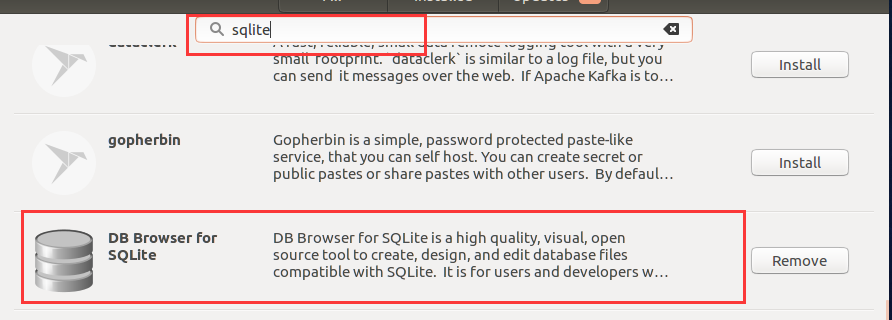

## 6.1 字符界面的sqlite3的使用

```bash
sqlite3 test.db  # 打开test.db
.exit/.quit		# 退出sqlite3
.help			# 查看帮助
.tables			# 查看数据库中有那些表
.schema 表名		# 查看表的字段信息
# 表的创建，删除，表数据的增加，更改，查找，删除都要使用SQL语句
```

表的创建是需要根据数据库的设计的E-R图来创建的，数据库的E-R图是根据业务和范式设计出来的。


## 6.2 数据库中表的设计

- 有哪些表（取决于业务）
- 表由哪些元素构成（取决于想要描述的事物）
- 每个元素的数据类型都有什么（取决于想要描述的属性）
- 如何设计整个数据的所有表（取决于表之间的关系）

表的构成：

整张表描述的是用户信息（每一个数据项表示一个真实的用户个体）

|  id  | usr_name | usr_pwd | 字段名行(属性行) | ...... |
| :--: | :------: | :-----: | :--------------: | ------ |
|  1   |   Tom    | t123456 | 数据项(一行数据) |        |
|  2   |  Jerry   | j123456 |                  |        |
|  3   |  Erjiu   | e123456 |                  |        |

在关系型数据库中，用表来描述实体的信息

一行数据由多个属性构成，属性称为字段。每个字段都有自己的数据类型。

## 6.3 E-R图

实体-关系图

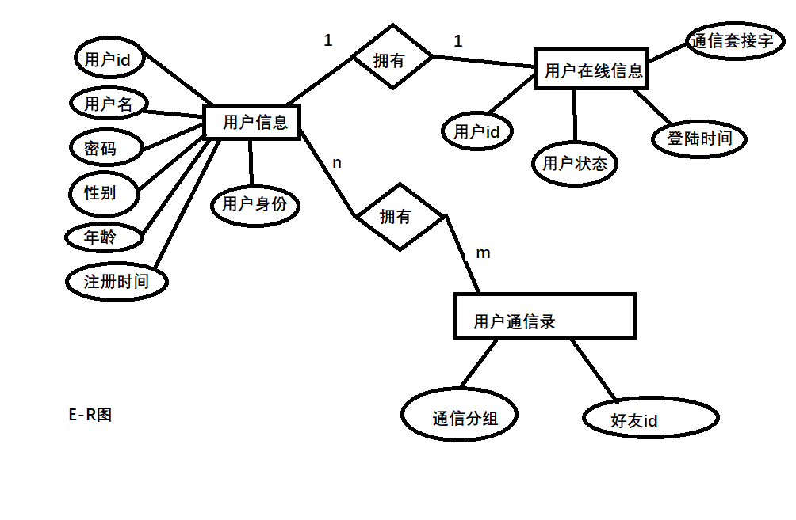

这张图能够表示出整个数据库中有哪些实体

实体有哪些属性

实体和实体之间是什么关系

### 6.3.1 E-R图绘制的方法

1. 使用矩形框表示实体
2. 使用椭圆框表示属性
3. 使用菱形框表示关系
4. 实体和属性之间使用实线连接
5. 实体和实体之间用实线连接在关系上，两个边上是对应关系
6. 实体和实体之间存在的关系有：
   - 1：1------->一对一的关系 
   - 1：n------->一对多的关系
   - n：m------->多对多的关系

E-R的实体设计和关系设计遵循范式

### 6.3.2 范式
范式是设计数据库的标准

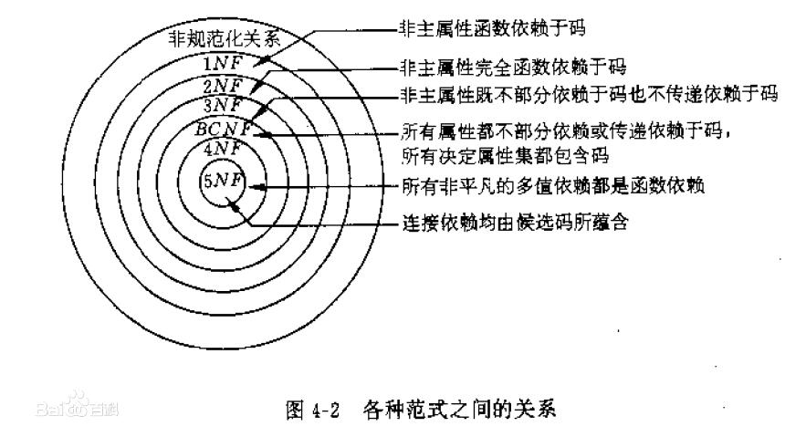

范式有：

1. 第一范式：没有重复的列
   - 属性不能重复
   - 属性是不能分割为多个属性(属性具有原子性)
2. 第二范式：非主属性完全依赖于主关键字
   - 每一行都能别唯一标识，唯一标识一行数据的这个标识称为主关键字(主键、主码)
3. 第三范式：要求一个数据库表中不包含已在其他表中已包含的非主关键字信息
   - 要求表于表之间的数据不能重复，不能产生反复存储的过程(尽量保证)
4. 第四范式：不能保留属性---->属性之间的映射关系

#### 6.3.2.1 范式的作用

==**减少数据的冗余**==

## 6.4 根据E-R如何创建表

1. 确定表名
2. 确定表的字段
3. 确定字段的数据类型
4. 确定字段的约束

# 7 数据库的设计

设计一个聊天软件的数据库

## 7.1 用户信息

- 用户id

- 用户名

- 密码

- 性别

- 年龄

- 注册时间

- 用户身份

## 7.2 用户在线状态信息

- 用户id

- 用户状态

- 登录时间

- 登录的地址（通信套接字）

## 7.3 用户通信录信息

- 通信分组

- 好友id

## 7.4 sqlite3支持的数据类型

| 存储类  |                             描述                             |
| :-----: | :----------------------------------------------------------: |
|  NULL   |                        值是一个NULL值                        |
| INTEGER | 值是一个带符号的整数，根据值的大小存储在1、2、3、4、5、6或8字节中 |
|  REAL   |       值是一个浮点值，存储为 8 字节的 IEEE 浮点数字。        |
|  TEXT   | 值是一个文本字符串，使用数据库编码（UTF-8、UTF-16BE 或 UTF-16LE）存储 |
|  BLOB   |          值是一个 blob 数据，完全根据它的输入存储。          |

注意：SQLite 的存储类稍微比数据类型更普遍。INTEGER 存储类，例如，包含 6 种不同的不同长度的整数数据类型。

## 7.5 sqlite3中字段的约束

约束是在表的数据列上强制执行的规则。这些是用来限制可以插入到表中的数据类型。这确保了数据库中数据的准确性和可靠性。

约束可以是列级或表级。列级约束仅适用于列，表级约束被应用到整个表。

常用的约束

|     名称      |                      含义                      |
| :-----------: | :--------------------------------------------: |
|   NOT NULL    |            确保某列不能有 NULL 值。            |
|    DEFAULT    |      当某列没有指定值时，为该列提供默认值      |
|    UNIQUE     |           确保某列中的所有值是不同的           |
|  PRIMARY KEY  |         唯一标识数据库表中的各行/记录          |
|     CHECK     |    CHECK 约束确保某列中的所有值满足一定条件    |
| AUTOINCREMENT | 值是自动累加的(Linux一般不支持，Windows下支持) |

# 8 SQL语句的讲解

## 8.1 创建表

SQLite的CREATE TABLE语句用于在任何给定的数据库创建一个新表。创建基本表，涉及到命名表、定义列及每一列的数据类型。

语法

```sqlite
create table database_name.table_name (
    column1 datatype PRIMARY KEY(one or more columns),
    column2 datatype,
    column3 datatype,
    ......
    columnN datatype
);
```

CREATE TABLE 是告诉数据库系统创建一个新表的关键字。CREATE TABLE 语句后跟着表的唯一的名称或标识。用户也可以选择指定带有 table_name 的 database_name

```sqlite
CREATE TABLE usr_stat (
    uid int primary key not null,
    ustat char not null default 0,
    dltime text not null,
    uconnfd int not null default -1
);
```

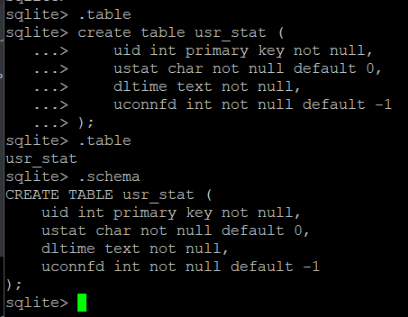

## 8.2 删除表

SQLite 的 DROP TABLE 语句用来删除表定义及其所有相关数据、索引、触发器、约束和该表的权限规范。

使用此命令时要特别注意，因为一旦一个表被删除，表中所有信息也将永远丢失

语法

```sqlite
-- 可以选择指定带有表名的数据库名称
drop table database_name.table_name;
```

```sqlite
drop table user_info
```


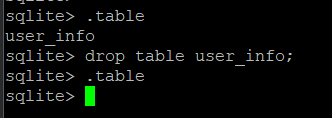

## 8.3 往表中插入记录/数据项

INSERT INTO 语句用于向数据库的某个表中添加新的数据行

```sqlite
insert into 语句有两种基本语法

insert into table_name [(column1, column2, ......, columnN)] values (value1, value2, ......, valueN);
-- 在这里column1, column2, ......, columnN是要插入数据的表中的列的名称。
-- 如果要为表中的所有列添加值，不需要在sqlite查询中指定列名称，但要确保值的顺序与列在表中的顺序一致
-- sqlite中insert into语法如下
insert into table_name values (value1, value2, ......, valueN);
```

```sqlite
-- 字符串使用''和""是一样的
-- 全部字段
insert into usr_stat values (1001, 1, '2022-1-9 1:53', 5);
-- 部分字段
insert into usr_stat (uid, dltime) values (1002, '--');
```

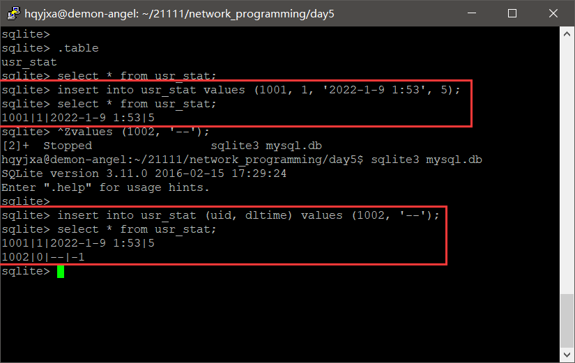

## 8.4 从表中删除记录/数据项

delete查询用于删除表中已有的记录。可以使用带有where子句的delete查询来删除选定行，否则删除的是所有记录。

语法

```sqlite
-- 带有where子句的delete查询的基本语法如下：
delete from table_name where [condition];
-- 可以使用and 或 or运算符来结合N个数量条件
```

```sqlite
-- 删除一条记录
delete from usr_stat where ustat = 0;
-- 删除表中的所有记录
delete * from usr_stat
```

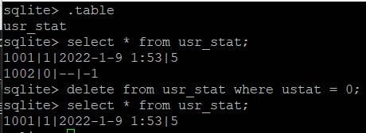

## 8.5 更改表中某一个字段的值

update查询用于修改表中已经存在的记录，可以使用where子句的update查询来更新选定行，否则所有的行都会被更新.

语法

```sqlite
-- 带有where子句的update查询的基本语法如下
update table_name set column1 = value1, column2 = value2, ..., columnN = valueN where [condition];
-- 可以使用and或者or运算符来结合N个数量条件
```

```sqlite
update usr_stat set ustat=2 where uid = 1001;
```

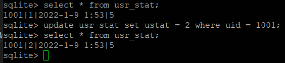

## 8.6 增加字段

```sqlite
-- alter table语句
alter table table_name add column column_def...;
-- alter table语句(Rename)
alter table table_name rename to new_table_name;
```

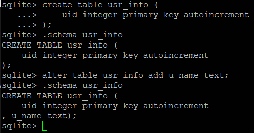

## 8.7 删除/更改字段

1. 需要将被更改的表先复制一份
2. 创建新表
3. 将旧表的数据重新拷贝插入到新表中
4. 删除旧表

```sqlite
alter table usr_stat rename to usr_stat_old;
create table usr_stat (
    uid int primary key not null,
    ustat char default 0,
    uconnfd int default -1
);
insert into usr_stat slect uid, ustat, uconnfd from usr_stat_old;
drop table usr_stat_old;
```

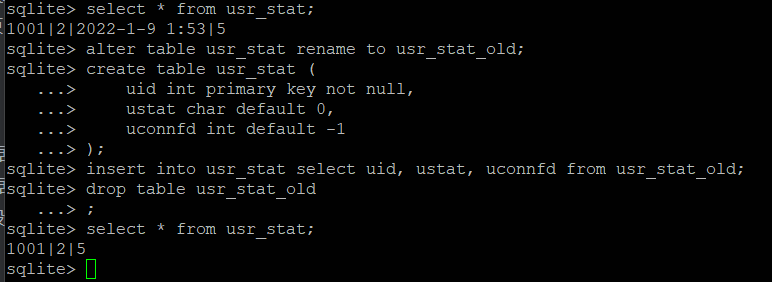

## 8.8 查找数据

select语句用于从sqllite数据库中获取数据，以结果表的形式返回数据。这些结果表也别称为结果集。

语法

```sqlite
-- select语句的基本语法如下
select column1, column2, columnN from table_name;
-- columnN是表的字段，他们的值即是我们需要获取的数据。
-- 如果想要获取所有可用的字段，那么可以使用下面的语法
select * from table_name;
```

```sqlite
select * from usr_stat;
select uid, uconnfd from usr_stat;
select * from usr_stat where uid = 1001;
```

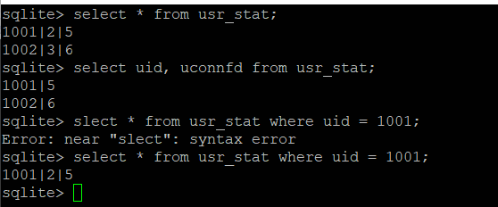

## 8.9 条件过滤

where 可以使用 and(表示逻辑与关系) 和 or(逻辑或的关系)

## 8.10 注意

sql语句，数据类型，约束的关键字不区分大小写

# 9 Sqlite3的C语言接口

## 9.1 sqlite3_open

```c
sqlite3_open(const char *filename, sqlite3 **ppDb);
/*
 * 该例程打开一个指向 SQLite 数据库文件的连接，
 * 返回一个用于其他 SQLite 程序的数据库连接对象。
 * 如果 filename 参数是 NULL 或 ':memory:'，
 * 那么 sqlite3_open() 将会在 RAM 中创建一个内存数据库，这只会在
 * session 的有效时间内持续。
 * 如果文件名 filename 不为 NULL，那么 sqlite3_open() 将使用这个参数值尝试打开数据库文件。
 * 如果该名称的文件不存在，sqlite3_open() 将创建一个新的命名为该名称的数据库文件并打开。
 */
```

## 9.2 sqlite3_exec

```c
typedef int (*exechandler_t)(void *para,
							 int n_colnum,
							 char **column_value,
							 char **column_name);
/* 
 * 功能：
 *		此函数又用户定义，当sqlite3_exec函数执行sql语句后，
 *		结果集不为空时sqlite3_exec函数会自动调用此函数，
 * 		每次调用此函数时会把结果集的一行信息传给此函数
 * 参数：
 * 		para：sqlite3_exec传给此函数的参数，para为任意数据类型的地址
 * 		n_column：结果集的列数
 * 		column_value：指针数组的地址，其存放一行信息中各个列值的首地址
 * 		column_name：指针数组的地址，其存放一行信息中各个列值对应列名的首地址
 * 返回值：
 * 		若为非0值，则通知sqlite3_exec终止回调
 */

sqlite3_exec(sqlite3*, const char *sql, sqlite_callback, void *data, char **errmsg);
/*
 * 该例程提供了一个执行 SQL 命令的快捷方式，
 * SQL 命令由 sql 参数提供，可以由多个 SQL 命令组成。
 * 在这里，第一个参数 sqlite3 是打开的数据库对象，
 * sqlite_callback 是一个回调，data 作为其第一个参数，
 * errmsg 将被返回用来获取程序生成的任何错误。
 * sqlite3_exec() 程序解析并执行由 sql 参数所给的每个命令，
 * 直到字符串结束或者遇到错误为止。
 */
```

## 9.3 sqlite3_close

```c
sqlite3_close(sqlite3*);
/*
 * 该例程关闭之前调用 sqlite3_open() 打开的数据库连接。
 * 所有与连接相关的语句都应在连接关闭之前完成。
 * 如果还有查询没有完成，sqlite3_close() 将返回 SQLITE_BUSY 禁止关闭的错误消息。
 */
```

## 9.4 sqlite3_get_table

```c
/* 函数格式 */
int sqlite3_get_table(sqlite3 *db,
					  const char *sql,
					  char ***resultp,
					  int &nrow,
					  int *ncolumn,
					  char **errmsg);
/* 
 * 功能：
 * 		执行sql指向的SQL语句，函数将结果集相关的数据的地址保存在函数的参数中
 * 参数：
 * 		db：数据库的标识
 * 		sql：SQL语句(一条或多条)，以';'结尾
 * 		resultp：指针数组的地址，其记录了结果集的数据。
 * 			内存布局：先依次存放各列的列名，然后是每一行各列的值
 * 		nrow：结果集的行数(不包含列名)
 * 		ncolumn：结果集的列数
 * 		errmsg：错误信息
 */
```

## 9.5 sqlite3_free_table

```c
/* 函数格式 */
void sqlite3_free_table(char **resultp);
/* 
 * 功能：
 * 		释放sqlite3_get_table分配的内存
 * 参数：
 * 		结果集数据的首地址
 */
```

# 10 案例

```c
#include <stdio.h>
#include <string.h>
#include "sqlite3.h"

/*
 * callback这个函数只有select语句会调用，其余的语句不会
 * data:专门用来传递数据的参数，可以通过该参数将数据传给调用sqlite3_exec的函数
 * argc：查找结果的字段数
 * argv:是一个字符串指针数组的首地址，argv指向的这个数组中存储查找到的每个字段的内容，
 *      即便是其他数据类型，获取到的也是字符串
 * cloname:是一个字符串指针数组的首地址，cloname指向的这个数组中存储查找到的每个字段的名字
 */
static int callback_all(void *data, int argc, char **argv, char **cloname)
{
    printf("argc:%d\n", argc);
    int i = 0;
    for (i = 0; i < argc; i++)
    {
        printf("%s:%s\n", cloname[i], argv[i]);
    }
    return 0;
}

static int callback_section(void *data, int argc, char **argv, char **cloname)
{
    printf("argc:%d\n", argc);
    int i = 0;
    for (i = 0; i < argc; i++)
    {
        strcpy(data, argv[i]);
    }
    return 0;
}

int main(int argc, char const *argv[])
{
    /* 打开数据库 */
    sqlite3 *pdb = NULL;
    sqlite3_open("mytest.db", &pdb);
    if (NULL == pdb)
    {
        puts("sqlite3_open error.");
        return -1;
    }
    puts("open success");
    char *perr = NULL;
    /* 创建一个表 */
    char create_sql[] = "create table usr_info (\
                            uid integer primary key autoincrement,\
                            uname text not null,\
                            upassword text not null)";
    sqlite3_exec(pdb, create_sql, NULL, NULL, &perr);
    if (perr)
    {
        puts(perr);
    }
    printf("****************************\n");
    /* 插入数据 */
    char insert1_sql[] = "insert into usr_info (uname, upassword)\
                            values ('Tom', 't123456'),\
                            ('Jerry', 'j123456'),\
                            ('Speike', 'dog123456')";

    sqlite3_exec(pdb, insert1_sql, NULL, NULL, &perr);

    /* 查询数据 */
    char select1_sql[] = "select * from usr_info";
    sqlite3_exec(pdb, select1_sql, callback_all, NULL, &perr);
    if (perr)
    {
        puts(perr);
    }
    printf("----------------------------\n");

    printf("****************************\n");
    /* 更新数据 */
    char update1_sql[] = "update usr_info set upassword = 's123456'\
                            where uname = 'Speike'";
    sqlite3_exec(pdb, update1_sql, NULL, NULL, &perr);
    if (perr)
    {
        puts(perr);
    }
    sqlite3_exec(pdb, select1_sql, callback_all, NULL, &perr);
    if (perr)
    {
        puts(perr);
    }
    printf("----------------------------\n");

    printf("****************************\n");
    /* 删除数据 */
    char delete1_sql[] = "delete from usr_info where uname = 'Tom'";
    sqlite3_exec(pdb, delete1_sql, NULL, NULL, &perr);
    if (perr)
    {
        puts(perr);
    }
    sqlite3_exec(pdb, select1_sql, callback_all, NULL, &perr);
    if (perr)
    {
        puts(perr);
    }
    printf("----------------------------\n");

    printf("****************************\n");
    /* 查询部分数据 */
    char passwd[20] = {0};
    char select2_sql[] = "select upassword from usr_info where uname='Jerry'";
    sqlite3_exec(pdb, select2_sql, callback_section, passwd, &perr);

    if (perr)
    {
        puts(perr);
    }
    printf("Jerry passwd is:%s\n", passwd);
    printf("----------------------------\n");

    /* 关闭数据库 */
    sqlite3_close(pdb);
    return 0;
}
```

result

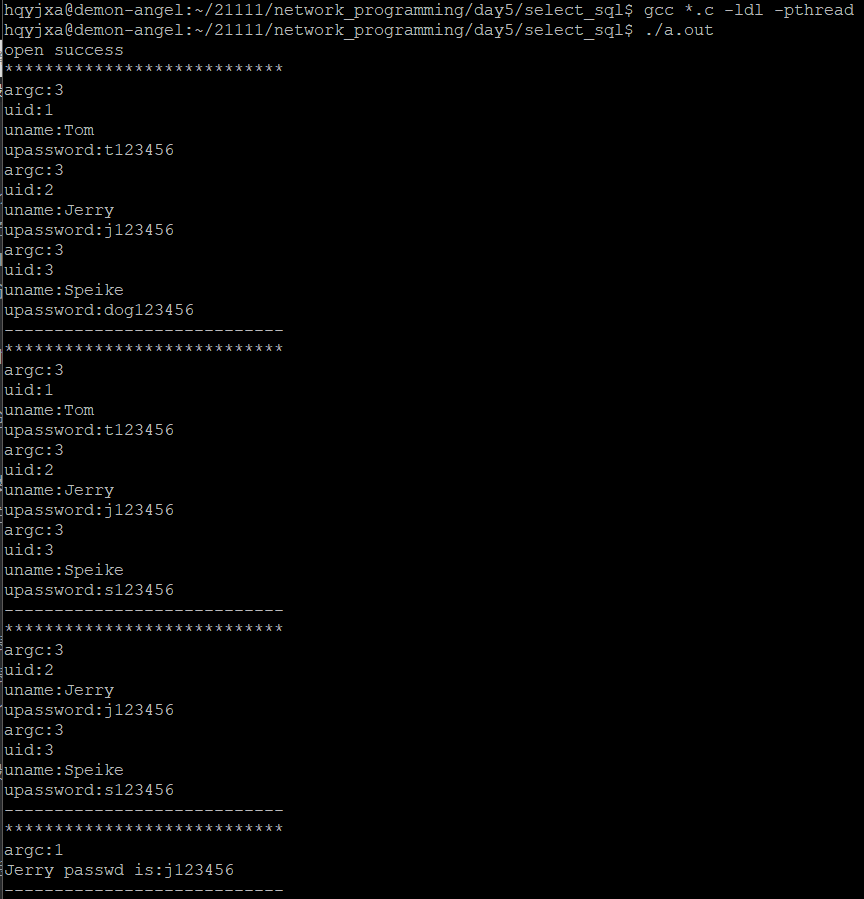

注意：编译时需要链接库

`gcc *.c -ldl -lpthread`