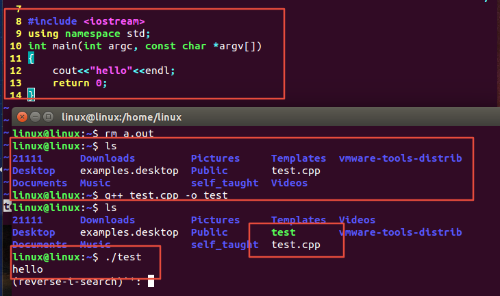

[toc]

# 1 Linux中写c++代码

# 2 c++与c的关系

1. c++是在c的基础之上发展出来的，而且是完全兼容c的，在c的基础上增加了很多新的特性
2. c++更适合开发大型的应用程序，开发效率比c高很多
3. c的编程思想是面向过程的，c++是面向过程+面向对象
4. c注重的是如何通过一个过程完成想要实现的功能，注重的是算法
5. c++一切皆对象
6. c++支持泛型编程(模板：用不变的代码实现可变的算法)

## 2.1 c++头文件为什么没有.h

在c语言中头文件使用扩展名.h，将其作为一种通过名称标识文件类型的简单模式。但是c++的用法改变了，c++头文件没有扩展名。但是有些c语言的头文件被转换为c++的头文件，这些文件被重新命名，丢掉扩展名.h(使之成为c++风格头文件)，并在文件名称前面加上前缀c(表明来自c语言)。例如c++版本的math.h为cmath

由于C使用不同的扩展名来表示不同文件类型，因此用一些特殊的拓展名(如hpp或hxx)表示c++的头文件也是可以的，ANSI/IOS标准委员会也认为是可以的，但是关键问题是用哪个比较好，最后一致同意不使用任何扩展名

| 头文件类型 | 约定 | 示例 | 说明 |
| :----------- | :----- | :----- | :----- |
| c++旧式风格 | 以.h结尾 | iostream.h | c++程序可用 |
| c旧式风格 | 以.h结尾 | math.h | c/c++程序可用 |
| c++新式风格 | 无扩展名 | iostream | c++程序可用，使用namespace std |
| 转换后的c | 加上前缀c，无扩展名 | cmath | c++程序可用，可使用非c特性，如namespace std |

## 2.2 using namespace std是什么

namespace是指标识符的各种可见范围。命名空间用关键字namespace来定义。命名空间是C++的一种机制，用来把单个标识符的大量有逻辑联系的程序实体组合到一起。此标识符作为此组群的名字。

## 2.3 cout、endl是什么

cout是c++中的标准输出流，endl是输出换行并刷新缓冲区。

# 3 面向过程

面向过程是一种以过程为中心的编程思想。

通过分析出解决问题所需要的步骤，然后用函数把这些步骤一步一步实现，使用的时候一个一个依次调用就可以了。

面向过程编程思想的核心：功能分解，自顶向下，逐层细化（程序 = 数据结构 + 算法）。

面向过程编程语言存在的主要缺点是不符合人的思维习惯，而是要用计算机的思维方式去处理问题，而且面向过程编程语言重用性低，维护困难。

# 4 面向对象

面向对象编程简称OOP(Object Oriented Progarmming)技术，是开发计算机应用程序的一种新方法、新思想。过去的面向过程编程常常会导致所有的代码都包含在几个模块中，使程序难以阅读和维护，在做一些修改时常常牵一动百，使以后的开发和维护难以为继。而使用OOP技术，常常要使用许多代码模块，每个模块都只提供特定的功能，它们是批次独立的，这样就增大了代码重用的几率，更加有利于软件的开发、维护和升级。

在面向对象中，算法与数据结构被看做是一个整体，称作对象，现实世界中任何类的对象都具有一定的属性和操作，也总能用数据结构与算法两者合一地来描述，所以可以用下面的等式来定义对象和程序：

==**对象 = 算法 + 数据结构**==

==**程序 = 对象 + 对象 + 对象 + ......**==

从上面的等式可以看出，程序就是许多对象在计算机中相继表现自己，而对象则是一个个程序实体。

==**面向对象编程思想的核心：应对变化，提高复用。**==

## 4.1 面向对象的三大特点

### 4.1.1 封装

把客观事物封装成抽象的类，并且类可以把自己的数据和方法只让可信的类或者对象操作，对不可信的进行信息隐藏。

类将成员变量和成员函数封装在类的内部，根据需要设置访问权限，通过成员函数管理内部状态。

### 4.1.2 继承

继承所表达的类之间相关的关系，这种关系使得对象可以继承另外一类对象的特征和能力。

继承的作用：避免公用代码的重复开发，减少代码和数据冗余

### 4.1.3 多态

多态性可以简单地概括为“一个接口，多种方法”，字面意思为多种形态，程序在运行时才决定调用的函数，它是面向对象编程领域的核心概念。
