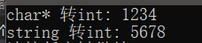
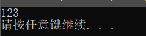

[toc]

# 1 冒号作用域

`::`运算符是一个作用域，如果`::`前面什么都没有加，代表的是全局作用域

```cpp
#include <iostream>
using namespace std;

int a = 100;

void test01()
{
	int a = 10;
	/* 输出局部变量a */
	cout << a << endl;
	/* 输出全局变量a */
	cout << ::a << endl;
}

int main()
{
	test01();
	return 0;
}

```

result


# 2 名字控制

## 2.1 命名空间

关键字namespace

本质是作用域，可以更好的控制标识符的作用域

命名空间可以存放变量、函数、类、结构体.....

## 2.2 命名空间的作用

==**解决同一作用域内命名冲突的问题**==

## 2.3 命名空间的使用

```cpp
#include <iostream>
using namespace std;

/* 命名空间的定义 必须定义在全局范围 */
/* 命名空间可以存放 变量 函数 结构体 */
namespace A
{
	int a = 1;
	void fun()
	{
		cout << "hello world" << endl;
	}
	void foo(int arg);
	struct std
	{};
	class obj
	{};
}
/* 命名空间的函数可以先声明，在外部定义，定义时需要加上命名空间作用域 */
void A::foo(int arg)
{
	cout << arg << endl;
}

/* 命名空间是可以取别名，namespace newname = oldname; */
namespace newA = A;

/* 命名空间可以重名，重名的命名空间相当于做合并操作 */
namespace B
{
	int a = 2;
	int b = 3;
}

namespace B
{
	int c = 4;
}

/* 命名空间可以嵌套命名空间 */
namespace C
{
	int a = 10;
	int b = 20;
	namespace D
	{
		int a = 100;
	}
}

/* 命名空间可以没有名字，没有名字相当于给命令空间内的所有成员加上了static修饰
 * 只能被当前文件调用，这个属于内部链接属性
 */

namespace 
{
	int a = 20;
	void func()
	{
		cout << "hello namespace" << endl;
	}
}

void test03()
{
	A::foo(222);
	newA::foo(333);
}
void test02()
{
	cout << C::a << endl;
	cout << C::D::a << endl;
}

void test01()
{
	cout << A::a << endl;
	cout << B::a << endl;
	cout << B::b << endl;
	A::fun();
	cout << B::c << endl;
}

int main()
{
	// test01();
    // test02();
	test03();
	return 0;
}
```

result

test01


test02


test03


## 2.4 using的声明

using的声明可以使得指定标识符可用

注意：当using声明的标识符和其他同名标识符有作用域冲突时会产生二义性

```c++
#include <iostream>
using namespace std;

namespace nameA
{
	int a = 10;
	void foo()
	{
		cout << "hello using" << endl;
	}
}

void test01()
{
	int a = 1000;
	/* 当using声明的标识符都和其他同名标识符有作用域的冲突时，会产生二义性 */
	using nameA::a;
	using nameA::foo;
	cout << a << endl;
	cout << a << endl;
	cout << a << endl;
	foo();
}

int main()
{
	test01();	// 出错
	return 0;
}
```

## 2.5 using的编译指令

using编译指令使整个命名空间标识符可用，并且命名空间标识符如果和局部变量的标识符同名，不会有冲突，优先使用局部变量

```c++
#include <iostream>
using namespace std;
namespace nameA
{
	int a = 10;
	void foo()
	{
		cout << "hello using" << endl;
	}
}

void test02()
{
	int a = 1000;
	/* using编译指令使整个命名空间标识符可用 */
	using namespace nameA;
	cout << a << endl;
	foo();
}

int main()
{
	test02();
	return 0;
}
```

result


# 3 c++对c的扩展

## 3.1 全局变量的检测增强

c++的编译器对于全局变量的声明和定义有严格的区分，检测会增强

c语言下的全局变量的声明和定义

```c
/* 全局变量 */
int a;	/* 定义 */
int a;	/* 声明 */
int a;	/* 声明 */
```

c++语言下的全局变量的声明和定义，如果写成以下形式，编译器编译时通不过

```c++
/* 全局变量 */
int a;
int a;
int a;
```

c++语言下的全局变量的声明和定义

```c++
/* 全局变量 */
int a;	/* 定义 */
extern int a;
extern int a;
```

## 3.2 C++中形参必须有类型，返回值和实参个数做检测

c语言中的函数的形参类型可以不写，没有返回值可以返回，实参个数不做检测

```c
void foo(x, y)
{
	return 100;
}
void test01()
{
	foo(1);
	foo(1, 2);
	foo(1, 2, 3);
}
```

c++语言中的函数的形参类型必须写，没有返回值不可以返回，实参的个数做检测

```c++
void foo(x, y)	/* 编译器报错 形参没有类型 */
{
	return 100;	/* 编译器报错，没有返回值但是返回了 */
}
void test01()
{
	foo(1);	/* 实参的个数和形参的个数不一致 */
	foo(1, 2);
	foo(1, 2, 3);	/* 实参的个数和形参的个数不一致 */
}
```

## 3.3 更严格的类型转换

c++中对类型转换有严格的要求，需要的类型和给的类型不一致时，可能会编译报错

c语言中这段代码可以编译通过

```c
void test02()
{
	char *p = malloc(100);
}
```

但是在c++中这段代码编译不通过，需要做类型转换

```c++
void test02()
{
    char *p = (char *)malloc(100);
}
```

## 3.4 struct类型增强

在c++中使用结构体类型时，可以不写struct关键字

c语言中

```c
struct stu
{
    int a;
    int b;
};

void test03()
{
    struct stu obj;
}
```

c++中

```c++
struct stu
{
    int a;
    int b;
};

void test03()
{
    stu obj;
}
```

### 3.4.1 struct和class的区别

1. struct是值类型，class是对象类型
2. struct不能被继承，class可以被继承
3. struct默认的访问权限是public，而class默认的访问权限是private
4. struct总是有默认的构造函数，即使是重载默认构造函数仍然会保留。这是因为struct的构造函数是由编译器自动生成的，但是如果重载构造函数，必需对struct中的变量全部初始化。并且struct的用途是那些描述轻量级的对象。class在没有重载构造函数时有默认的无参构造函数，但是构造函数被重载后默认构造函数将被覆盖。
5. struct的new和class的new是不同的。struct的new就是执行构造函数创建一个新实例再对所有的字段进行拷贝。而class则是在堆上分配一块内存然后再执行构造函数，struct的内存并不是在new的时候分配的，而是在定义的时候分配。

## 3.5 新增bool类型关键字

c++中可以直接使用bool类型

在c语言中，以下代码中的bool类型，需要包含stdbool.h头文件，但是在c++中可以直接使用。

```c
#include <stdbool.h>

void test04()
{
    /* bool类型的变量只有两个值 true false */
    /* true和false可以直接当成常量来用 */
    bool flag = true;
}
```

## 3.6 三目运算符功能增强

==**c++中的三目运算符表达式返回的可以是一个变量，但是c语言中返回的是一个常量**==

c语言

```c
void test05()
{
    int a = 10;
    int b = 20;
    printf("%d\n", a < b ? a : b);
    /* 在c语言中三目运算符返回的是表达式的值，是一个常量 */
    /* (a < b ? &a : &b) = 100; */
    *(a < b ? &a : &b) = 100;
}
```

c++

```c++
void test05()
{
    int a = 10;
    int b = 20;
    printf("%d\n", a < b ? a : b);
    /* 在c++语言中三目运算符返回的是变量 */
    (a < b ? a : b);	/* 编译可通过 */
}

```

## 3.7 const

### 3.7.1 const概述

const修饰的对象为一个常量，不能被改变

### 3.7.2 c/c++中const的区别

#### 3.7.2.1 c语言中的const

1. const修饰的局部变量，存在栈区，虽然不能通过const修饰的变量去修改栈区内容，但是可以通过地址去修改
2. const修饰的全局变量是保存在常量区，不能通过变量名去修改，也不能通过地址去修改
3. const修饰的全局变量，如果其他文件想使用，直接用extern设置为外部可用即可

main.c

```c
#include <stdio.h>

const int b = 10;	/* const修饰的全局变量保存在常量区 */
void test03()
{
    extern const int num;	/* 声明num式外部可用的 */
    printf("num = %d\n", num);
}

/* const修饰的全局变量 */
void test02()
{
    /* b = 100; */
    int *p = &b;
    *p = 100;	/* 错误的，不能修改常量区的内容 */
    printf("b = %d\n", b);
}

/* const修饰的局部变量 */
void test01()
{
    /* 在c语言中const修饰的变量保存在栈区 */
    const int a = 10;
    /* a = 100; */
    int *p = &a;
    *p = 100;
    printf("a = %d\n", a);
}
```

test.c

```c
const int num = 1;
```

#### 3.7.2.2 c++中的const

1. const修饰的局部变量赋值常量时，局部变量保存在符号表中，修改不了，是一个常量
2. const修饰的全局变量保存在常量区，不能被修改
3. const修饰的全局变量模式是内部链接属性，加上extern修饰变成外部链接属性

main.c

```c++
#include <iostream>
using namespace std;

const int b = 1;
void test03()
{
    extern const int num;
    cout << num << endl;
}

void test02()
{
    /* const修饰的全局变量存在常量区 */
    int *p = (int *)&b;
    *p = 100;	/* 错误的 */
    cout << b << endl;
}

/* c++中const修饰的局部变量 */

void test()
{
    /* c++中const修饰的局部变量存在符号表中 */
    const int a = 10;
    /* a = 100; */
    /* 对const修饰的局部变量取地址，编译器会产生一个临时变量来保存a的地址 */
    /* int tmp = a; int *p = &tmp; */
    int *p = (int *)&a;
    *p = 100;
    cout << a << endl;
}
```

test.cpp

```c++
extern const int num = 1;	/* const修饰的全局变量默认是内部链接属性 */
```

#### 3.7.2.3 c/c++中的const异同

##### 3.7.2.3.1 相同点

c和c++中的const修饰的全局变量都是保存在常量区，不能被修改

##### 3.7.2.3.2 不同的点

c语言中const修饰的局部变量赋值为常量时，局部变量保存在栈区，可以被指针修改

==**c++中，const修饰的局部变量赋值为常量时，局部变量保存符号表中，不能被修改**==

c语言中const修饰的全局变量默认是外部链接属性

c++语言中const修饰的全局变量默认是内部链接属性

##### 3.7.2.3.3 c++中const修饰的变量，分配内存情况

const修饰的全局变量在常量区分配了内存

对const修饰的局部变量赋值为常量时，对其取地址，会在栈区分配临时的内存空间

const修饰的局部变量赋值为变量时，局部变量保存在栈区

const修饰的局部变量是一个自定义变量，也是在栈区分配内存

### 3.7.3 尽量以const替换define

1. const修饰的全局变量或const修饰的局部变量赋值为常量，是有类型的，而define的宏没有类型
2. const修饰得全局变量或const修饰的局部变量赋值为常量有作用域的，而define的宏没有作用域

## 3.8 string、char*、char[]的转换

### 3.8.1 vs中const char *类型的值不能用于初始化"char *"类型的实体

#### 3.8.1.1 方法一

工程属性 --> 配置属性 --> C/C++ --> 命令行 --> 其它选项 --> 添加 `/Zc:strictStrings-` --> 应用 --> 确定

#### 3.8.1.2 方法二

工程属性 --> 配置属性 --> C/C++ --> 语言 --> 符号模式 --> 改为“否” --> 应用 --> 确定

#### 3.8.1.3 方法三

使用强制类型转换

```c++
char *str = (char *)"hello world";
```

#### 3.8.1.4 方法四

加const，一般不用

```cpp
const char *str = "hello world";
```

#### 3.8.1.5 方法五

先用字符数组进行存储，然后再使用指针

```cpp
char str1[] = "hello world";
char *str2 = str1;
```

### 3.8.2 string转char*

主要有三种方法将string转换为char *类型

1. data();
2. c_str();
3. copy();

```cpp
/* string转char* */
void test01()
{
	/* data()方法 */
	string str = "hello";
	/* data()函数返回指向自己的第一个字符的指针 */
	char *p1 = (char *)str.data();
	cout << p1 << endl;

	/* c_str()方法 */
	string str2 = "world";
	/* c_str()函数返回一个指向正规C字符串的指针, 内容与本字符串相同 */
	char *p2 = (char*)str2.c_str();
	cout << p2 << endl;

	/* copy()方法 */
	string str3 = "nihao";
	char p[50];
	/* copy()函数拷贝自己的num个字符到str中（从索引index开始）。返回值是拷贝的字符数 */
	str3.copy(p, 5, 0);
	*(p + 5) = '\0';
	cout << p << endl;
}
```

result


### 3.8.3 char *转string

可以直接赋值

```cpp
/* char *转string  */
void test02()
{
	string s;
	char *p = (char *)"hello";
	s = p;
	cout << s.data() << endl;
}
```

result


### 3.8.4 string转char[]

```cpp
/* string转char[] */
void test03()
{
	string s = "hello";
	char p[8];
	int i;
	for ( i = 0; i < s.length(); i++)
	{
		p[i] = s[i];
	}
	p[i] = '\0';
	cout << p << endl;
}
```

### 3.8.5 char[]转string

直接赋值

## 3.9 string、int的转换

### 3.9.1 使用atoi函数

```c++
#include <iostream>
#include <string>
using namespace std;

int main()
{
    char *s = (char *)"1234";
    string str("5678");

    int intS = atoi(s);

    /* 此写法会报错 */
    /*  int intStr = atoi(str); */
    /* 需先将string转成char* */
    int intStr = atoi(str.c_str());

    cout << "char* 转int: " << intS << endl;
    cout << "string 转int: " << intStr << endl;

    system("pause");
    return 0;
}
```

result



**==c_str()转换到第一个非数字字符为止==**

```cpp
#include<iostream>
#include<string>

using namespace std;

int main()
{
	string s("123.aa");
	int a = atoi(s.c_str());
	cout << a << endl;
	system("pause");
}
```

result



### 3.9.2 使用stringstream

C++中将形如"1234"的string字符串转化为int型整数”里所介绍的方法其实是将string字符串先转换为C风格的字符串，再利用C语言提供的库函数atoi将字符串转换为整型数。这种方法严格来说不是C++的做法，因为C++本身就提供了字符串与整型数之间的互换，那就是利用stringstream。

```cpp
#include <iostream>
#include <string>
#include <sstream>      /* 要使用stringstream流应包含此头文件 */
using namespace std;
int main()
{
	stringstream stream;     /* 声明一个stringstream变量 */
	int n;
	string str;
	/* string转int */
	stream << "1234";     /* 向stream中插入字符串"1234" */
	stream >> n;     /* 从stream中提取刚插入的字符串"1234" */
	/* 并将其赋予变量n完成字符串到int的转换 */
	cout << "stringstream string转int: " << n << endl;     /* 输出n */
	stream.clear();     /* 同一stream进行多次转换应调用成员函数clear */
	/* int转string */
	stream << 1234;     /* 向stream中插入整型数1234 */
	stream >> str;     /* 从steam中提取刚插入的整型数 */
	/* 并将其赋予变量str完成整型数到string的转换 */
	cout << "stringstream int转string: " << str << endl;     /* 输出str */

	system("pause");
	return 0;
}
```

result


# 4 引用

## 4.1 引用的基本用法

### 4.1.1 引用的实质

```
原类型 &别名 = 旧名；
```

### 4.1.2 引用的用法

1. 引用一旦初始化，不能更改引用的指向
2. 引用定义时必须初始化
3. 不能引用NULL
4. 引用可以引用任意类型包括数组
5. &在等号的左边是引用，在等号的右边是取地址
5. 操作引用就是操作变量
5. 引用也可以有引用
5. 引用不开辟空间
5. 引用使用的时候跟普通变量的用法一样，没有差别

```c++
#include <iostream>
using namespace std;

void test01()
{
	int a = 10;
	/* 引用一旦初始化之后不能改变引用的标识 */
	int &b = a;
	b = 100;
	cout << a << endl;
	int c = 1;
	/* b = c; 代表把c的值赋值给b,不是给c取别名为b */
	/* int &d;   引用定义时必须初始化*/
}

void test02()
{
	int a[5] = { 1,2,3,4,5 };
	/* int(&arr)[5] = a; */

	typedef int ARR[5];
	/* type &别名 = 旧名 */

	ARR &arr = a;
	for (int i = 0; i < 5; i++)
	{
		cout << arr[i] << " ";
	}
	cout << endl;
}

int main()
{
	/* test01(); */
	/* 100 */
	test02();
	/* 1 2 3 4 5 */
	return 0;
}
```

### 4.1.3 引用的作用

不需要再开辟临时的空间，节省内存空间

## 4.2 函数中的引用

1. 引用可以作用函数的形参
2. 不能返回局部变量的引用

```c++
#include <iostream>
#include <stdlib.h>
using namespace std;

/* 形参是引用 */
void swap(int *x, int *y)
{
	int tmp = *x;
	*x = *y;
	*y = tmp;
}

void test01()
{
	int a = 10;
	int b = 20;
	swap(&a, &b);
	cout << a << " " << b << endl;
}

void swap_ref(int &x, int&y)	/* int &x = a, int &y = b */
{
	int tmp = x;
	x = y;
	y = tmp;
}

void test02()
{
	int a = 10;
	int b = 20;
	swap_ref(a, b);
	cout << a << " " << b << endl;
}

/* 形参是指针，引用 */
void get_mem(int **q)
{
	*q = (int *)malloc(5 * sizeof(int));
}

void get_mem_ref(int *&q)	/* int *(&q) = p */
{
	q = (int *)malloc(5 * sizeof(int));
}

void test03()
{
	int *p = NULL;
	get_mem(&p);
	get_mem_ref(p);
}


/* int &t = a */
int &test04()
{
	/* 能不能返回一个变量的引用，看这个变量的空间是否被释放 */
	static int b = 100;
	int a = 10;
	/* return a;	 error，不能返回局部变量的引用*/
	return b;	/* 可以返回静态的变量的引用 */
}
int main()
{
	/* test01(); */
	/* 20 10 */

	/* test02(); */
	/* 20 10 */

	test04() = 1000;

	return 0;
}
```

## 4.3 引用的本质

==**引用的本质是一个指针常量**==

type &b = a;编译器底层是如何实现的：

type *const b = &a;

```c++
#include <iostream>
using namespace std;

void test01()
{
	int a = 10;
	int &b = a;	/* 编译器优化 int *const b = &a; */
	/* 指针常量 不能改变指针变量的指向 */
	/* b = 0x100; */

	b = 1000;	/* *b = 1000 */

}

void fun(int *&q)	/* int *&q = p ==> 编译器优化 int * const q = &p */
{

}

void test02()
{
	int *p = NULL;
	fun(p);
}
int main()
{
	return 0;
}
```

## 4.4 指针的引用

套用引用公式：type &q = p

假设：

type为指针类型

```c++
void fun(int *&q)	/* int *&q = p ==> 编译器优化 int * const q = &p */
{

}

void test02()
{
	int *p = NULL;
	fun(p);
}
```

## 4.5 常量引用

const type &p = q;

常量引用代表不能通过引用去修改引用标识的那块空间

```c++
#include <iostream>
using namespace std;

void test01()
{
	int a = 10;
	/* const修饰的是引用&，不能通过引用去修改引用的这块空间的内容 */
	const int &b = a;
	/* b = 1000;   error */
}

void test02()
{
	/* int &b = 100;	不能引用常量 */
	const int &b = 1;	/* int tmp = 1, const int &b = tmp */
}
int main()
{
	return 0;
}
```

## 4.6 指针和引用的区别

### 4.6.1 本质区别

引用是别名，不需要开辟空间，是直接访问，指针是变量，它存的是变量的地址，是间接访问，需要开辟空间。

### 4.6.2 使用时的区别

1. 引用必须初始化，指针不需要初始化
2. 引用不开辟空间，指针开辟空间
3. 引用一旦初始化之后，就不能是其他变量的别名了，指针式可以改变指向的
4. 引用sizeof是变量的空间大小，指针sizeof是指针变量的大小，一般32位系统都是4
5. 引用自加变量的值加了1，指针自加是向地址增大的方向移动了一个变量
6. 有void *类型的指针，但是没有void类型的引用
7. 有二级指针int **，但是没有二级引用int &&
8. 有函数指针、数组指针但是没有数组引用、函数引用
9. 指针只能指向字符串常量，但是常引用可以是任何常量的别名

# 5 内联函数

## 5.1 为什么要有内联函数

### 5.1.1 什么样的函数可以定义为宏函数

逻辑简单，代码量小

### 5.1.2 宏函数和普通函数相比有什么优势和劣势

普通函数在调用时，存在进栈和出栈的过程，需要时间和空间的开销，如果函数本身非常简单而且还被频繁调用，这个时候来来回回进出栈，系统开销就大。

如果将这样的函数定义为宏函数，宏函数在预处理阶段就被展开了，在执行的时就不存在进栈和出栈的过程了。

但是宏函数的本质还是宏，只是符号的替换，需要加括号，容易出现问题，宏函数的参数类型不多样化，默认是字符串类型，而函数的形参可以是各种类型，更加灵活。

也就是说对于短小逻辑简单并且频繁调用的这些函数，如果是普通函数系统开销大，如果是宏函数又有另外的问题，要是宏函数能像普通函数那样就好了

### 5.1.3 总结

使用预处理宏会出现两个问题：

第一个在c中也会出现，宏看起来像一个函数调用，但是会有隐藏一些难以发现的错误。

第二个问题是c++特有的，预处理宏不允许访问类的成员，也就是说预处理宏不能用作类的成员函数。

为了保持预处理宏的效率又增加安全性，而且还能像一般成员函数那样可以在类里访问自如，c++引入了内联函数（inline function）。

内联函数为了继承宏函数的效率，没有函数调用开销，然后又可以像普通函数那样，返回值类型的安全检查，又可以作为成员函数。


## 5.2 宏函数和内联函数的区别

==**宏函数的替换发生在预处理阶段**==

==**内联函数的替换发生在编译阶段**==

宏函数容易出错，内联函数不会

==**内联函数和宏函数一样，都省去了调用函数的开销**==

```c++
#include <iostream>
using namespace std;

#define MYADD(a, b) a + b

inline int myadd(int a, int b)
{
	return a + b;
}

void test01()
{
	int a = 10;
	int b = 20;
	/* int c = MYADD(a, b) * 5;   // a + b * 5 替换发生在预处理阶段*/
	/* result 110 */

	int c = myadd(a, b) * 5;	/* (a + b) * 5 替换发生在编译阶段也和宏函数一样不会有函数调用的开销 */
	/* result 150 */
	cout << c << endl;
}

int main()
{
	test01();
	return 0;
}
```

```c++
#define MYCOMPARE(a, b) (a) < (b) ? (a) : (b)

inline int mycompare(int a, int b)
{
	return a < b ? a : b;
}

void test02()
{
	int a = 1;
	int b = 5;
	/* int c = MYCOMPARE(++a, b);  // ++a < b ? < ++a : b */
	/* result 3 */


	int c = mycompare(++a, b);
	/* result 2 */
	cout << c << endl;
}
```

## 5.3 内联函数

### 5.3.1 内联函数的基本概念

在c++中，预定义宏的概念使用内联函数来实现的，而内联函数本身也是一个真正的函数。内联函数具有普通函数的所有行为。唯一不同之处在于内联函数会在适当的地方像预定义宏一样展开，所以不需要函数调用的开销，因此应该不使用宏，使用内联函数。

==**在普通函数(非成员函数)函数前面加上inline关键字使之成为内联函数。但是必须注意函数体必须和声明结合在一起，否则编译器将它作为普通函数来对待。**==

```c++
inline void func(int a);
/* 以上写法没有任何效果，仅仅是声明函数，应该如下方式来做 */
inline int func(int a)
{
    return ++a;
}
```

注意：

编译器将会检查函数参数列表使用是否正确，并返回值（进行必要的转换）。这些事项处理器无法完成的。

内联函数的确占用空间，但是内联函数相对于普通函数的优势只是省去了函数调用时候的压栈，跳转，返回的开销。我们可以理解为内联函数是以空间换时间。

### 5.3.2 类的成员函数默认编译器会将它做成内联函数

任何在类内部定义的函数自动成为内联函数。

```c++
class person
{
public:
	person()
	{
		cout << "构造函数" << endl;
	}

	void printf_person()
	{
		cout << "输出person!" << endl;
	}
};
```

### 5.3.3 内联函数和编译器

内联函数并不是何时何地都有效，为了理解内联函数何时有效，应该要知道编译器碰到内联函数会怎么处理？

对于任何类型的函数，编译器会将函数类型（包括函数名字，参数类型，返回值类型）放入到符号表中。同样，当编译器看到内联函数，并且对内联函数体进行分析没有发现错误时，也会将内联函数放入符号表。

当调用一个内联函数的时候，编译器首先确保传入参数类型是正确匹配的，或者如果类型不完全匹配，但是可以将其转换为正确类型，并且返回值在目标表达式里匹配正确类型，或者可以转换为目标类型，内联函数就会直接替换函数调用，这就消除了函数调用的开销。假设内联函数是成员函数，对象this指针也会被放入合适位置。

类型检查和类型转换，包括在合适位置放入对象this指针这些都是预处理器不能完成的。但是c++内联编译会有一些限制，以下情况编译器可能考虑不会将函数进行内联编译：

1. 不能存在任何形式的循环语句
2. 不能存在过多的条件判断语句
3. 函数体不能过于庞大
4. 不能对函数进行取址操作

==**内联仅仅只是给编译器一个建议，编译器不一定会接受这种建议，**==如果你没有将函数声明为内联函数，那么编译器也可能将此函数做内联编译。一个好的编译器将会内联小的、简单的函数。

# 6 函数的默认参数

c++中的函数、形参可以设置默认参数，设置时需要注意以下几点：

1. 设置默认参数时，某个参数设置了默认参数，从这个参数开始，后面的每一个都要设置
2. 函数的声明和定义处设置默认参数只能一处设置（同一个文件中）
3. 如果是多个文件(.c文件和.h文件)，也就是声明和定义是分开的，默认参数只能出现在声明中。
4. 有实参传入则使用实参，实参没有传入使用默认参数

```c++
#include <iostream>
using namespace std;

/* void fun01(int a = 1, int b = 2); */
/* 默认参数，在设置时，声明和定义只能一处设置默认参数 */
/* 设置默认参数时，有一个参数设置了默认参数，从这个参数往后的每一个参数都要设置默认参数 */
void fun01(int a = 1, int b = 2)
{
	cout << a << " " << b << endl;
}

void test01()
{
	fun01(1, 2);
	fun01(1, 3);
	fun01(1, 4);
	fun01(1);
	fun01();
}

int main()
{
	test01();
	return 0;
}
```

result


# 7 占位参数

占位参数给函数形参设置的，调用时需要传参，也可以设置为默认参数；占位参数在符号重载时用到

```c++
#include <iostream>
using namespace std;
void fun(int a, int = 4)
{
}

void test01()
{
	fun(1, 2);
	fun(2);
}

int main()
{
	test01();
	return 0;
}
```

# 8 函数的重载

## 8.1 函数的重载

在c++中函数的名字是可以重名的，也就是可以有多个相同函数名的函数存在，重载：名字相同，意义不一样。

## 8.2 函数重载的条件

==**实现函数重载的条件**==

1. 同一个作用域
2. 参数个数不同
3. 参数类型不同
4. 参数顺序不同

函数的返回值不能成为函数重载的条件

默认参数作为函数重载的条件可能发生二义性

## 8.3 函数重载的本质

编译器为了实现函数重载，也是默认为我们做了一些工作的，编译器用不同的参数类型来修饰不同的函数名，比如`void func();`编译器可能会将函数名修饰成`func`，当编译器碰到`void func(int x);`编译器可能将函数名修饰为`funcint`，当编译器碰到`void func(int x, char c);`编译器可能会将函数名修饰为`funcintchar`我这里使用“可能”这个字眼因为编译器如何修饰重载的函数名称并没有一个统一的标准，所以不同的编译器可能会产生不同的内部名。

## 8.4 extern "C"浅析

c++编译器编译.c的函数时，需要声明为extern "C"

main.cpp

```c++
#include <iostream>
#include "test.h"
using namespace std;

int main()
{
	cout << myadd(2, 3) << endl;
	return 0;
}
```

test.c

```c
int myadd(int a, int b)
{
	return a + b;
}
```

test.h

```c
#ifndef _TEST_H_
#define _TEST_H_

/* 方式1： */
/* 如果是多个c语言函数，这样过于繁琐 */
/* extern "C" int myadd(int a, int b); */

/* 方式2： */
#if __cplusplus

extern "C"
{
	int myadd(int a, int b);
}

#endif

#endif
```

写一个程序，如果是g++就打印“g++”，如果是gcc就打印“gcc”，两种方法

   ```c
   #include <stdio.h>
   
   int main(int argc, const char *argv[])
   {
   #if 0
   
   	/* g++里定义了__cplusplus的宏，但是gcc没有 */
   #ifdef __cplusplus
   	printf("g++\n");
   #else
   	printf("gcc\n");
   #endif
   
   #endif
   
   #if 1
   	/* g++求sizeof('a')的值为1，gcc求出来是4 */
   	if (1 == sizeof('a'))
   	{
   		printf("g++\n");
   	}
   	else if (4 == sizeof('a'))
   	{
   		printf("gcc\n");
   	}
   #endif
   	return 0;
   }
   ```

result

