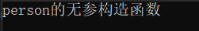

[toc]

# 1 类和对象的基本概念

## 1.1 c和c++中struct的区别

- c语言中结构体中不能存放函数，也就是数据(属性)和行为(方法)是分离的
- c++中结构体中是可以存放函数的，也就是数据(属性)和行为(方法)是封装在一起的

```c++
#define _CRT_SECURE_NO_WARNINGS
#include <iostream>
#include <string.h>
using namespace std;

/* C语言中，不能放函数 */
struct _stu
{
	int a;
	int b[5];
};

/* C++中，可以放函数 */
struct _stu1
{
	int a;
	int b[5];
	void printf_stu()
	{
		cout << a << endl;
	}
};

struct student
{
	/* 学生的属性 */
	int age;
	int id;
	char name[20];
	/* 操作属性的叫做方法或行为 -- 函数 */
	void printf()
	{
		cout << age << " " << id << " " << name << endl;
	}
};

void test01()
{
	student obj;
	obj.age = 10;
	obj.id = 20;
	strcpy(obj.name, "lucy");
	obj.printf();
}

int main()
{
	test01();
	return 0;
}
```

result


## 1.2 C语言中表示事物的方法存在的问题

C语言中表示事物时，将属性和行为分离，有可能行为调用出错

比如人调用狗的行为

## 1.3 c++中对事物的封装 - 类

- c++将事物的属性和行为封装在一起
- 类和结构体的一个区别在于，类对成员可以进行访问的权限控制，结构体不行
- 类 = 类型（事物的行为和属性）类实例化出来的变量叫对象
- 类中的函数可以访问类里面的成员

```c++
#define _CRT_SECURE_NO_WARNINGS
#include <iostream>
#include <string.h>
using namespace std;

/* c++中对事物的封装 -- 将属性和行为封装在一起 */
/* 类将事物抽象成属性和行为，并且封装在一起 */
/* 结构体中所有的成员默认都是公有的，类中的所有成员默认都是私有的，也可以修改成员的访问权限 */

/* struct person */
class person
{
    /* 类中的所有成员，默认的访问权限都是私有的 private */
public: /* 共有的 */
    /* 属性 */
    int age;
    char name[128];

    /* 行为 */
    void person_eat()
    {
        cout << name << "eat" << endl;
    }
};

struct dog
{
    /* 属性 */
    int age;
    char name[128];
    /* 行为 */
    void dog_sleep()
    {
        cout << name << "sleep" << endl; 
    }
};

void test01()
{
    /* 通过类实例化出一个变量 这个变量叫做对象 */
    person p1;
    p1.age = 10;
    strcpy(p1.name, "lucy");
    p1.person_eat();

    /* c++中对结构体增强了，不用加struct关键字 */
    dog d1;
    d1.age = 6;
    strcpy(d1.name, "wangcai");
    d1.dog_sleep();
}

int main(int argc, char const *argv[])
{
    test01();
    return 0;
}
```

result


## 1.4 封装

1. 把变量（属性）和函数（操作）合成一个整体，封装在一个类中
2. 对变量和函数进行访问控制
3. 在类的内部（作用域范围内），没有访问权限之分，所有成员可以相互访问
4. 在类的外部（作用域范围外），访问权限才有意义：public、private、protected
5. 在类的外部，只有public修饰的成员才能被访问，在没有涉及==继承和派生==时，private和protected是同等级的，外部不允许访问。


## 1.5 尽量设置成员变量为私有权限

1. 对变量的设置时的控制
2. 可以给变量设置只读权限
3. 可以给变量设置只写的权限
4. 可以给变量设置可读可写权限

```c++
class accsess_levels
{
public:
    /* 对只读属性进行只读访问 */
    int get_read_only()
    {
        return read_only;
    }

    /* 对读写属性进行写访问 */
    void set_read_write(int val)
    {
        read_write = val;
    }
    /* 对读写属性进行读访问 */
    int get_read_write()
    {
        return read_write;
    }

    /* 对只写属性进行只写访问 */
    void set_write_only(int val)
    {
        write_only = val;
    }

private:
    int read_only;  /* 对外只读访问 */
    int no_access;  /* 外部不可访问 */
    int read_write; /* 读写访问 */
    int write_only; /* 只写访问 */
};
```

## 1.6 临时对象

```c++
#include <iostream>
using namespace std;

class temp
{
public:
	temp()
	{
		cout << "default constructor" << endl;
	}
	temp(const temp &b)
	{
		this->data = b.data;
		cout << "拷贝构造" << endl;
	}
	~temp()
	{
		cout << "destructed" << endl;
	}
	temp(int i) :data(i)
	{
		cout << "constructed by  parameter" << data << endl;
	}
private:
	int data;
};
temp play(temp b)
{
	return b;  /* 使用b给返回值的临时对象初始化，调用拷贝构造函数 */
}

/* 临时对象：没有名字对象,看不见但是实际存在 */


void test01()
{
	/* 
	 * 调用play函数，传参相当于temp b = 5; 调用有一个参数的构造函数
	 * paly的返回值没有被接收，会产生一个临时的对象，play函数中存在一个形参，
	 * 相当于是用已经存在的实例化b给临时的对象赋初值，调用拷贝构造函数 
	 */
	play(5);
}

void test02()
{
	temp t1;		/* 调用无参的构造函数 */
	/* 
	 * play函数会调用单参数的构造函数和拷贝构造函数
	 */
	t1 = play(5);
}

void test03()
{
	/* 
	 * 当用已经存在的b给临时对象初始化时会调用拷贝构造函数
	 * 但是这次有对象会接收play的返回值，而且是在实例化对象时，还会再调用一次拷贝构造函数
	 * 系统就会默认调一次构造函数
	 */
	temp t1 = play(5);
}

void test04()
{
	/* 一个单参数的构造函数和拷贝构造函数 */
	temp t1 = play(5);


	/* play函数中的形参函数调用完毕，对象就会调用析构函数 */

	/* 调用两次的拷贝构造函数 */
	temp t2 = play(t1);
}

void test05()
{
	temp t1 = play(5);
	temp t2 = play(10);
}

int main()
{
	test05();
	return 0;
}
```

result

test01


test02


test03


test04


test05


# 2 面向对象程序设计案例

## 2.1 立方体案例

```c++
#include <iostream>
#include <string.h>
using namespace std;

class cube
{
public:
	int get_l()
	{
		return l;
	}
	void set_l(int _l)
	{
		l = _l;
	}

	int get_w()
	{
		return w;
	}
	void set_w(int _w)
	{
		w = _w;
	}

	int get_h()
	{
		return h;
	}
	void set_h(int _h)
	{
		h = _h;
	}
	/* 求立方体的体积 */
	int get_cube_v()
	{
		return l * h * w;
	}
	/* 求立方体面积 */
	int get_cube_s()
	{
		return 2 * (w * l + w * h + l * h);
	}
	/* 判断两个立方体是否相等,使用成员函数进行判断 */
	bool compare_cube(cube &c1)
	{
		return c1.get_l() == l && c1.get_h()== h && c1.get_w() == w;
	}
private:
	int l;
	int w;
	int h;
};

/* 判断两个立方体是否相等,使用全局函数进行判断 */
bool compare_cube(cube &c1, cube &c2)
{
	return c1.get_h() == c2.get_h() && c1.get_l() == c2.get_l() && c1.get_w() == c2.get_w();
}

void test01()
{
	cube c1;
	c1.set_l(10);
	c1.set_w(20);
	c1.set_h(30);
	cout << c1.get_cube_s() << endl;
	cout << c1.get_cube_v() << endl;

	cube c2;
	c2.set_l(20);
	c2.set_w(20);
	c2.set_h(30);

	if (c1.compare_cube(c2))
	{
		cout << "立方体相等" << endl;
	}
	else
	{
		cout << "立方体不相等" << endl;
	}

	if (compare_cube(c1, c2))
	{
		cout << "立方体相等" << endl;
	}
	else
	{
		cout << "立方体不相等" << endl;
	}
}
int main()
{
	test01();
	return 0;
}
```

result


## 2.2 点和圆的关系

```c++
#include <iostream>
#include <string.h>
using namespace std;

/* 定义点类 */
class point
{
public:
	void set_x(int _x)
	{
		x = _x;
	}
	void set_y(int _y)
	{
		y = _y;
	}

	int get_x()
	{
		return x;
	}

	int get_y()
	{
		return y;
	}
private:
	int x;
	int y;
};

/* 定义圆类 */
class circle
{
public:
	void set_p(int x, int y)
	{
		p.set_x(x);
		p.set_y(y);
	}
	void set_r(int _r)
	{
		r = _r;
	}

	point& get_p()
	{
		return p;
	}

	int set_r()
	{
		return r;
	}

	/* 判断点和圆的关系 */
	void is_point_in_circle(point & point)
	{
		int distance = (point.get_x() - p.get_x()) * (point.get_x() - p.get_x()) + (point.get_y() - p.get_y()) * (point.get_y() - p.get_y());
		int radius = r * r;
		if (distance < radius)
		{
			cout << "point(" << point.get_x() << "," << point.get_y() << ")在圆内！" << endl;
		}
		else if (distance > radius)
		{
			cout << "point(" << point.get_x() << "," << point.get_y() << ")在圆外！" << endl;
		}
		else
		{
			cout << "point(" << point.get_x() << "," << point.get_y() << ")在圆上！" << endl;
		}
	}
private:
	point p;	/* 圆心 */
	int r;		/* 半径 */
};

void test01()
{
	/* 实例化圆对象 */
	circle c1;
	c1.set_p(20, 20);
	c1.set_r(5);
	/* 实例化点对象 */
	point p;
	p.set_x(25);
	p.set_y(20);
	c1.is_point_in_circle(p);
}
int main()
{
	test01();
	return 0;
}
```

result


# 3 构造和析构

## 3.1 构造和析构的概念

- 创建对象时，对对象进行初始化工作，就是构造
- 销毁对象时，对对象进行清理工作，就是析构
- 一般需要人为提供，如果不提供，那么编译器也会给提供，只不过编译器提供的构造和析构函数不会做任何操作
- 创建对象和释放对象时，构造函数和析构函数自动会调用，不需要人为调用

## 3.2 构造函数

### 3.2.1 构造函数

- 没有返回值
- 函数名和类名一致
- 有参数，参数可以有多个
- 可以发生函数的重载
- 创建对象时，会自动调用

#### 3.2.1.1 构造函数的作用

给一个类的成员变量初始化时

### 3.2.2 笔试题

```c++
CSomething a();                             /* 只是个函数声明 */
CSomething b(2);                            /* +1 */
CSomething c[3];                            /* +3，对象数组 */
CSomething &ra = b;                         /* 引用，没有新构造 */
CSomething d = b;                           /* +1，调用拷贝构造函数 */
CSomething *pA = c;                         /* 只是给指针赋值 */
CSomething *p = new CSomething(4);          /* +1，构造并给指针赋值 */     
```

### 3.2.3 默认构造函数

不用传参构造函数（类名 对象名;）

1. 自己没有定义系统提供的构造函数
2. 自定义的无参构造函数
3. 自定义的有参且所有参数都有默认值的构造函数

==**一个类有且只能有一个默认构造函数，也就是以上三个默认构造函数在一个类中只能有一个**==

## 3.3 析构函数

在对象的声明周期结束时系统自动调用的，主要工作就是进行内存的回收

- 没有返回值
- 函数名：类名前面加上~
- 没有参数
- 不能发生函数的重载
- 销毁对象之前，会被自动调用

```c++
#include <iostream>
#include <string.h>
#include <string>
using namespace std;

class person
{
public:
	/* 构造函数 */
	person(int _age, string _name)
	{
		cout << "person 的构造函数" << endl;
		age = _age;
		name = _name;
	}

	/* 析构函数 */
	~person()
	{
		cout << "析构函数" << endl;
	}
	int age;
	string name;
};

void test01()
{
	/* 构造函数是在实例化对象时会创建，就是在内存开辟空间时会被调用 */
	person p1(10, "lucy");
	/* 销毁之前，自动调用析构函数 */
}
int main()
{
	test01();
	return 0;
}
```


## 3.4 构造函数的分类

- 无参构造和有参构造
- 普通构造和拷贝构造

拷贝构造函数的写法

```c++
类名 (const 类名 &obj){}
```

注意：

- 如果自定义了一个构造函数，系统将不再提供默认的构造函数
- 如果自定义了一个拷贝构造，系统将不再提供默认的拷贝构造
- 默认的拷贝构造是简单的值拷贝
- 如果创建对象时，不能调用相应的构造含糊，将不能创建出对象

```c++
#include <iostream>
#include <string.h>
#include <string>
using namespace std;

class person
{
public:
	/* 有参和无参 */
	person()
	{
		cout << "无参构造" << endl;
	}
	person(int a, string n)
	{
		cout << "有参构造" << endl;
		age = a;
		name = n;
	}

	/* 拷贝构造的调用时机：旧对象初始化新对象 */
	/* 如果自定义了一个拷贝构造，那么系统不再提供默认的拷贝构造 */
	person(const person &p)
	{
		/* 拷贝构造做了简单的值拷贝 */
		age = p.age;
		name = p.name;
		cout << "拷贝构造" << endl;
	}

	int age;
	string name;
};

void test01()
{
	/*  如果人为提供了一个无参和有参构造函数，系统将不会提供默认的无参构造函数 */
	person p1;		/* 调用无参构造时，不能使用括号法 */
	person p2(10, "lucy");
	person p3(p2);		/* 调用了系统提供的默认拷贝构造 */
}
int main()
{
	test01();
	return 0;
}
```

result


```c++
void test02()
{
	/* 匿名对象，没有名字，生命周期在当前行 */
	person(10, "lucy");		/* 调用了有参构造创建了一个匿名对象 */
	person();				/* 调用了无参构造创建了一个匿名对象 */
	person p1(20, "haha");	
	/* person (p1); 在定义时匿名对象不能使用括号法调用拷贝构造 */
}
```

result


```c++
/* 显式法调用构造函数 */
void test03()
{
	person p1 = person(10, "lucy");		/* 显式法调用有参构造 */
	person p2 = person(p1);				/* 显式法调用拷贝构造 */
	person p3 = person();				/* 显式法调用无参构造 */
}
```

result


```c++
/* 隐式法调用构造函数 */
void test04()
{
	person p1 = { 10,"lucy" };		/* 隐式法调用有参构造 */
	person p2 = p1;					/* 隐式法调用拷贝构造 */
	/* person p3;		隐式法不能调用无参构造 */
}
```

## 3.5 explicit

修饰构造函数，作用是不能通过隐式法调用构造函数

```c++
explicit person(const person &p){}
```

禁止通过构造函数进行的隐式转换。声明为explicit的构造函数不能在隐式转换中使用。

注意：

explicit用于修饰构造函数，防止隐式转化。是针对单参数的构造函数（或者除了第一个参数外其余参数都有默认值的多参构造而言）

## 3.6 拷贝构造函数的调用时机

旧对象初始化新对象

1. 旧对象初始化新对象
2. 形参时一个对象
3. 返回局部对象

```c++
#include <iostream>
#include <string.h>
#include <string>
using namespace std;

class person
{
public:
	person()
	{
		cout << "无参构造函数" << endl;
		age = 10;
	}

	person(int _age)
	{
		cout << "有参构造函数" << endl;
		age = _age;
	}
	person(const person &person)
	{
		cout << "拷贝构造函数" << endl;
		age = person.age;
	}
	~person()
	{
		cout << "析构函数" << endl;
	}
	int age;

};

/* 旧对象初始化新对象 */
void test01()
{
	person p(10);
	person p1(p);		/* 调用拷贝构造函数 */
	person p2 = person(p);		/* 调用拷贝构造函数 */
	person p3 = p;			/* 相当于person p2 = person(p);		调用拷贝构造函数 */
}


/* 传递参数是普通对象，函数参数也是普通对象，传递将会调用拷贝构造 */
void do_bus(person p)		/* person p = p */
{

}
void test02()
{
	person p(10);
	do_bus(p);
}

/* 函数返回局部对象 */
person my_bus()
{
	person p(10);
	cout << "局部p:" << (int *)&p << endl;
	return p;
}
void test03()
{
	/* vs release、qt下没有调用拷贝构造函数 */
	/* vs debug下调用一次拷贝构造函数 */
	person p = my_bus();
	cout << "局部p:" << (int *)&p << endl;
}
int main()
{
	test03();
	return 0;
}
```

result

test01


test02


test03


## 3.7 c++默认增加的函数

1. 构造函数
2. 析构函数
3. 拷贝构造函数
4. 赋值运算符的重载函数
5. 取地址运算符的重载函数

## 3.8 拷贝构造函数

当用户用一个已有的对象给一个新实例化的对象初始化时，系统会自动调用拷贝构造函数，完成对新实例化对象的成员变量的初始化。

### 3.8.1 拷贝构造函数的作用

将原来的对象的成员变量的值赋值给了新实例化的对象

### 3.8.2 定义

1. 函数名和类名相同
2. 参数是const修饰的对象的引用
3. 没有返回值

注意：如果系统没有定义系统会提供，如果定义了，系统就不会提供了

```c++
#include <iostream>
using namespace std;
#include <string>

/*
 * 定义一个洗衣机的类
 * 		属性：品牌 公斤数 价格 颜色
 * 		行为：开 关 暂停 洗衣服
 */

class wash_machine
{
public:
	/* 构造函数 */
	wash_machine(string _brand = "海尔", float _weight = 5.5)
	{
		this->brand = _brand;
		this->weight = _weight;
		cout << "wash_machine(string, float)" << endl;
	}
	/* 构造函数 */
	wash_machine(string _brand, float _weight, int _price, string _color)
	{
		this->brand = _brand;
		this->weight = _weight;
		this->price = _price;
		this->color = _color;
		cout << "wash_machine(string, float, int, string)" << endl;

	}

	/* 拷贝构造函数 */
	wash_machine(const wash_machine &w)
	{
		this->brand = w.brand;
		this->weight = w.weight;
		this->price = w.price;
		this->color = w.color;
		cout << "copy fun" << endl;
	}

	void turn_on()
	{
		cout << "turn_on wash_machine" << endl;
	}

	void turn_off()
	{
		cout << "turn_off wash_machine" << endl;
	}

	void pause()
	{
		cout << "pause wash_machine" << endl;
	}

	void wash_clothes()
	{
		cout << "wash_machine washing clothes" << endl;
	}
	/* 共有的访问price的接口 */
	void set_price(int _price)
	{
		/* 类内可以访问私有成员 */
		price = _price;
	}

	int get_price()
	{
		return price;
	}

	void show()
	{
		cout << "brand = " << brand << endl;
		cout << "weight = " << weight << endl;
		cout << "price = " << price << endl;
		cout << "color = " << color << endl;
	}

	/* 析构函数 */
	~wash_machine()
	{
		cout << "~wash_machine()" << endl;
	}
private:
	string brand;
	float weight;
protected:
	int price;
	string color;
};

#if 1
int main(int argc, const char *argv[])
{
	/* 调用的是构造函数 */
	wash_machine m1("海尔", 6.5, 700, "灰色");
	/* 用m1给m2初始化，调用的是拷贝构造函数 */
	/* m2.washmachine(m1) */
	wash_machine m2 = m1;
	m1.show();
	cout << "******************" << endl;
	m2.show();
	return 0;
}
#endif 
```

result


## 3.9 浅拷贝和深拷贝

### 3.9.1 浅拷贝

只是成员变量之间的相互赋值


### 3.9.2 深拷贝

当成员变量中有指针，在构造函数中需要new，那么此时在拷贝构造函数中就需要给新的对象的指针新new一块空间，然后将原有空间的内容拷贝过来就行，相当于就是两个对象的两个指针各自指向各自的空间。

注意：一般情况下就用系统提供的拷贝构造函数就可以（浅拷贝），但是如果构造函数中有new,就需要自定义拷贝构造函数了，完成深拷贝。


```c++
#include <iostream>
using namespace std;
#include <string.h>

class demo
{
public:
	/* 构造函数 */
	demo(int a = 0, int b = 0, const char *str = "aaa")
	{
		a = a;
		b = b;
		/* 在new一块空间存放str */
		p = new char[strlen(str) + 1];
		/* 将str中前strlen(str)+1的值拷贝到p中 */
		memcpy(p, str, strlen(str) + 1);
		cout << "demo(int, int)" << endl;
	}

	/* 析构函数 */
	~demo()
	{
		delete []p;
		cout << "~demo()" << endl;
	}
	/* 拷贝构造函数 */
	demo(const demo &demo)
	{
		a = demo.a;
		b = demo.b;
		/* 在new一块空间存放demo.p */
		p = new char[strlen(demo.p) + 1];
		/* 将demo.p中前strlen(demo.p)+1的值拷贝到p中 */
		memcpy(p, demo.p, strlen(demo.p) + 1);
		cout << "demo(&)" << endl;
	}

	void show()
	{
		cout << "a = " << a << endl;
		cout << "b = " << b << endl;
		cout << "p = " << p << endl;
	}
private:
	int a;
	int b;
	char *p;
};

#if 1
int main()
{
	demo demo1(3, 4);
	demo demo2 = demo1;
	demo1.show();
	cout << "8888888888888888888" << endl;
	demo2.show();
	return 0;
}
#endif // 1
```

result


## 3.10 多个对象构造和析构

### 3.10.1 初始化列表

- ==**初始化列表，先声明在调用构造函数时定义并初始化，定义初始化的顺序和声明的顺序一致**==
- 普通的构造函数，先定义，再赋值

```c++
#include <iostream>
#include <string.h>
#include <string>
using namespace std;

class person
{
public:
	/* 先定义了int a; int b; int c; 然后再分别赋值 */
	/*
	 * person(int _a, int _b, int _c)
	 * {
	 *		a = _a;
	 *		b = _b;
	 *		c = _c;
	 * }
	 */

	 /* 先声明了int a; int b; int c; 再根据声明的顺序进行定义初始化 */
	 /* 调用构造函数是定义并初始化，顺序和声明的顺序一致 */
	 /* 如果声明的顺序是 int a; int c; int b; 那么初始化列表的顺序就是a(_a), c(_c)，b(_b) */
	person(int _a, int _b, int _c) :a(_a), b(_b), c(_c)
	{

	}

	void show()
	{
		cout << a << " " << b << " " << c << endl;
	}
	/* 如果使用初始化列表，这里的变量只是声明，如果不使用初始化列表，这里的变量是定义 */
	int a;
	int b;
	int c;
};

void test01()
{
	person p1(2, 3, 5);
	p1.show();
}
int main()
{
	test01();
	return 0;
}
```

result


```c++
#include <iostream>
using namespace std;

class B1
{
public:
    B1(int i)
    {
        cout << "constructing B1 " << i << endl;
    }
    ~B1()
    {
        cout << "destructing B1 " << endl;
    }
};
class B2
{
public:
    B2(int j)
    {
        cout << "constructing B2 " << j << endl;
    }
    ~B2()
    {
        cout << "destructing B2 " << endl;
    }
};
class B3
{
public:
    B3()
    {
        cout << "constructing B3 *" << endl;
    }
    ~B3()
    {
        cout << "destructing B3 " << endl;
    }
};
class C : public B2, public B1, public B3
{
public:
    C(int a, int b, int c, int d) : B1(a), memberB2(d), memberB1(c), B2(b) {}

private:
    B1 memberB1;
    B2 memberB2;
    B3 memberB3;
};
void main()
{
    /*
     * 调用子类的构造函数之前会调用父类的构造函数，
     * 先继承的先调用构造函数，
     * 先调用被继承类的构造函数
     * 先调用B2的构造函数，
     * 之后调用B1的构造函数，
     * 最后调用B3的构造函数
     * 之后调用的实例化对象的构造函数
     * 当调用实例化对象的构造函数时，
     * 构造函数初始化的顺序和成员变量声明的顺序有关
     * 先声明了memberB1
     * 故先调用memberB1(c)
     * 再声明了memberB2
     * 故再调用memberB2(d)
     * 最后调用了memberB3的构造函数
     * 析构的时候时，先构造的后析构
     */
    C obj(1, 2, 3, 4);
}
```

result


#### 3.10.1.1 总结

==**初始化列表决定不了构造函数的顺序，构造函数的顺序与继承顺序和变量声明的顺序有关**==

### 3.10.2 类对象成为另一个类的成员

- 类中有多个对象时，构造的顺序是先构造里面的对象，再构造外面的对象
- 类中有多个对象时，析构时顺序是先析构外面的对象，再析构里面的对象

==**总结：先构造的后析构**==

```c++
#include <iostream>
#include <string.h>
#include <string>
using namespace std;

class phone
{
public:
	phone(string name)
	{
		cout << "phone的构造函数" << endl;
		pho_name = name;
	}
	~phone()
	{
		cout << "phone的析构函数" << endl;
	}
	string pho_name;
};

class game
{
public:
	game(string name)
	{
		cout << "game的构造函数" << endl;
		game_name = name;
	}
	~game()
	{
		cout << "game的析构函数" << endl;
	}
	string game_name;
};

class person
{
public:
	person(string per_name1, string pho_name, string g_name) :per_name(per_name1), phone(pho_name), game(g_name)
	{
		cout << "person的构造函数" << endl;
	}
	~person()
	{
		cout << "person的析构函数" << endl;
	}
	void show()
	{
		cout << per_name << "拿着" << phone.pho_name << "玩着" << game.game_name << endl;
	}
	string per_name;
	game game;
	phone phone;
};

void test01()
{
	person p1("bob", "link", "tank");
	p1.show();
}
int main()
{
	test01();
	return 0;
}
```

result


### 3.10.3 笔试题

```c++
C c;
void main()
{
	A* pa = new A();
	B b;
	static D d;
	delete pa;	
}
/* 构造顺序：CDAB */
/* 析构顺序：ABDC */
```

## 3.11 动态对象创建

### 3.11.1 malloc和free动态申请对象和释放对象

使用malloc和free函数去动态申请对象，和释放申请的对象，不会调用构造函数和析构函数

```c++
#include <iostream>
#include <string.h>
#include <string>
#include <stdlib.h>
using namespace std;

class person
{
public:
	person()
	{
		cout << "person的构造函数" << endl;
	}
	~person()
	{
		cout << "person的析构函数" << endl;
	}
	int a;
};

void test01()
{
	person *p = (person *)malloc(sizeof(person));
	free(p);
}
int main()
{
	test01();
	return 0;
}
```

no result

### 3.11.2 c++中动态申请对象和释放对象

```
类型 *p = new 类型;
delete p;
申请数组
类型 *p = new 类型[];
delete []p;
```

```c++
#include <iostream>
#include <string.h>
#include <string>
#include <stdlib.h>
using namespace std;

class person
{
public:
	person()
	{
		cout << "person的无参构造函数" << endl;
	}
	person(int _age)
	{
		cout << "person的有参构造函数" << endl;
	}
	~person()
	{
		cout << "person的析构函数" << endl;
	}
	int a;
};

/* 申请一个对象 */
void test01()
{
	person *p = new person;
	delete p;
}

void test02()
{
	int *p = new int;	/* 申请一块内存sizeof(int)大小并且对这块空间初始化 */
	cout << *p << endl;
	*p = 100;
	cout << *p << endl;
	delete p;			/* 释放申请的空间 */
}

/* 申请一个数组 */
void test03()
{
	/* new一个数组时，返回的是该数组的首元素的地址 */
	int *p = new int[10];
	for (int i = 0; i < 10; i++)
	{
		p[i] = i + 100;
	}
	for (int i = 0; i < 10; i++)
	{
		cout << p[i] << " ";
	}
	cout << endl;
	delete[]p;
}
int main()
{
	test03();
	return 0;
}
```

result

test01


test02


test03


### 3.11.3 用于类数组的new和delete

```c++
void test04()
{
	/* new时调用有参构造 */
	person *p = new person(10);
	delete p;
	person *p1 = new person[10];	/* 注意new对象的数组时不能调用有参构造函数，只能调用无参构造函数 */
	delete[]p1;
}
```

result


### 3.11.4 delete void *问题

```c++
void test05()
{
	void *p = new person;
	delete p;	/* p的类型是void *所以不会调用析构函数 */
}
```

result



### 3.11.5 使用new和delete采用相同形式

- new单一对象时，使用delete释放单一的对象
- new一个数组时，使用delete[]释放这个数组

### 3.11.6 malloc、free和new、delete的区别

1. malloc和free是函数，new和delete是运算符
2. malloc需要强制类型转换，而new不需要
3. malloc需要计算空间大小，new不需要，只需要给出元素个数
4. 本质区别：malloc在申请对象空间时不会自动调用构造函数，而new可以

## 3.12 静态成员

在类定义中，它的成员（包括成员变量和成员函数），这些成员可以用关键字static声明为静态的，成为静态成员。

不管这个类创建了多少个对象，静态成员只有一个拷贝，这个拷贝被所有属于这个类的对象共享。

### 3.12.1 static修饰的变量，是在什么时候开辟空间的

static修饰的变量是在==编译阶段==系统就分配好了空间，而类的定义是不会有空间产生的，不是全局类对象都是在运行时开辟空间的。

声明和定义的区别：声明不开辟空间，而定义开辟

static修饰的成员变量在类中声明，在类外定义

注意：static修饰的成员变量不占类的大小（对象的大小）

### 3.12.2 静态成员变量

c语言中的[static](../01_Clanguage/01_C基础.md)的作用


- 静态成员变量在内存中只有一份，多个对象共享一个静态变量
- 静态成员变量，必须类内声明，类外定义
- 静态成员变量可以通过类的作用域访问
- 静态成员变量可以通过类的对象访问

```c++
#include <iostream>
#include <string.h>
#include <string>
#include <stdlib.h>
using namespace std;

class person
{
public:
	int a;
	/* 静态成员变量不能在类内初始化，类内只能声明，定义在全局，声明的作用只是限制静态成员变量的作用域 */
	static int b;		/* 静态成员变量，在编译阶段就分配内存，存在静态全局区 */
};
int person::b = 10;		/* 类中成员变量的定义 */


void test01()
{
	person p1;
	p1.b = 100;
	cout << p1.b << endl;
}

void test02()
{
	/* 通过类的作用域访问类的静态成员函数 */
	cout << person::b << endl;
}


int main()
{
	test02();
	return 0;
}
```

result

test01


test02


### 3.12.3 静态成员函数

- 静态成员函数能访问静态成员变量不能访问普通的成员变量
- 可以通过类的作用域访问静态成员函数
- 可以通过对象访问静态成员函数

```c++
#include <iostream>
#include <string.h>
#include <string>
#include <stdlib.h>
using namespace std;

class person
{
public:
	int a = 10;
	/* 静态成员变量不能在类内初始化，类内只能声明，定义在全局，声明的作用只是限制静态成员变量的作用域 */
	static int b;		/* 静态成员变量，在编译阶段就分配内存，存在静态全局区 */
	void show()
	{
		cout << a << " " << b << endl;
	}

	/* 静态成员函数，可以访问静态成员变量，不能访问普通的成员变量 */
	static void static_show()
	{
		cout << b << endl;
	}
};
int person::b = 100;		/* 类中成员变量的定义 */


void test01()
{
	person::static_show();	/* 通过类的作用域访问静态成员函数 */
	person p1;
	p1.static_show();		/* 通过对象访问静态成员函数 */
}


int main()
{
	test01();
	return 0;
}
```

result


### 3.12.4 const修饰的静态成员函数

- const修饰的静态成员变量保存在常量区，只读的，在内存中只有一份
- const修饰的静态成员变量可以在类内定义且初始化
- const修饰的静态成员变量可以通过类的作用域访问
- const修饰的静态成员变量可以通过对象访问
- 静态成员函数可以访问const修饰的静态成员变量

```c++
#include <iostream>
#include <string.h>
#include <string>
#include <stdlib.h>
using namespace std;

const int num = 10;		/* const修饰的全局变量保存在常量区，不可更改 */
class person
{
public:
	int a;
	/* 静态成员变量不能在类内初始化，类内只能声明，定义在全局，声明的作用只是限制静态成员变量的作用域 */
	static int b;		/* 静态成员变量，在编译阶段就分配内存，存在静态全局区 */
	const static int c = 1000;		/* const修饰的静态成员变量，是保存在常量区，不可修改(只读)在内存中只有一份 */
};
int person::b = 10;		/* 类中成员变量的定义 */


void test01()
{
	cout << person::c << endl;
	person p1;
	cout << p1.c << endl;
}


int main()
{
	test01();
	return 0;
}
```

result


### 3.12.5 总结

1. static修饰的成员变量属于整个类，所有对象共享，先于对象而存在，可以直接通过类名访问
2. static修饰的函数，不需要实例化对象，可以直接通过==类名:函数名()==进行访问

### 3.12.6 注意

1. 静态成员变量先于对象而存在，所以静态成员变量在任何的成员函数中（静态成员函数和非静态成员函数）都可以使用，也可以在类外直接通过类名访问
2. 静态成员函数可以使用对象调用，也可以直接通过类名访问，不需要实例化对象
3. 静态的成员函数不能调用非静态的成员函数（因为非静态的成员函数必须通过对象来调用，而静态成员函数没有对象也可以）
4. 非静态成员函数可以调用静态的成员函数
5. 静态的成员函数中不能访问非静态的成员变量
6. static修饰的成员函数没有this指针

## 3.13 const

### 3.13.1 const修饰成员变量

不能被修改，不能作为左值，那么在构造函数中就无法给const的成员变量初始化，可以使用初始化列表进行初始化

==**初始化列表可以给任何的成员变量初始化，但是如果有const修饰的成员函数，只能使用初始化列表的方式进行初始化**==

### 3.13.2 const修饰成员函数

1. 在const修饰的成员函数中，不能修改任何成员变量的值
2. const修饰的成员函数只能调用const修饰的成员函数，而非const修饰的成员函数可以调用const修饰的成员函数
3. const修饰的成员函数和普通的成员函数之间构成重载，两个函数除了多了一个const修饰外，其余的都一样（函数名、形参、返回值）

在函数后面加上const,这是一个常函数，这个const修饰的是指针const type * const this，代表不能通过this指针去修改this指针指向对象的内容

```c++
/* 常函数，不能通过this指针修改this指针指向的对象内容 */
/* 常量指针常量 */
person person_add(person &p2)const	/* const person * const this ----> p */
{
    person p(this->age + p2.age, this->name + p2.name);
    return p;
}
```

也就是：const修饰的对象调用的是const修饰的函数，非const修饰的对象调用的是非const修饰的函数，也就是如果没有const修饰的函数，而使用const修饰的对象调用非const修饰的函数，就会出错

### 3.13.3 总结

1. const修饰的成员函数中不能修改任何成员变量的值
2. const修饰的成员函数只能调用const修饰的成员函数
3. ==**const修饰对象只能调用const修饰的成员函数，不能调用非const修饰的成员函数**==

## 3.14 mutable

可变的，易变的

在const修饰的成员函数中不能修改任何成员变量的值，但如果这个成员变量使用了mutable修饰，就可以被修改

# 4 类对象成员的初探

## 4.1 空类的大小

空类的大小不是0,而是1

### 4.1.1 一个空类中的函数

1. 构造函数
2. 析构函数
3. 拷贝构造函数
4. 赋值运算符的重载函数
5. 取址运算符的重载函数

## 4.2 成员变量和函数的存储

- 类对象成员 - 普通成员变量占用对象空间大小
- 类对象成员 - 静态成员变量不占用对象空间大小
- 类对象成员 - 普通成员函数不占用对象空间大小
- 类对象成员 - 静态成员函数不占用对象空间大小 

## 4.3 this指针的工作原理

类的成员函数默认编译器都加上了一个this指针，这个this指针指向调用该成员函数的对象


## 4.4 this指针的应用

this存在于类的成员函数中，是成员函数的第一个参数（系统自动添加），通过哪个对象调用成员函数，那么this指针就指向哪个对象，如果通过m调用成员函数，那么此时的this就指向了m，如果是n调用了成员函数，那么this就指向了n，所以==**this是指向当前类对象的指针**==


