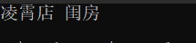
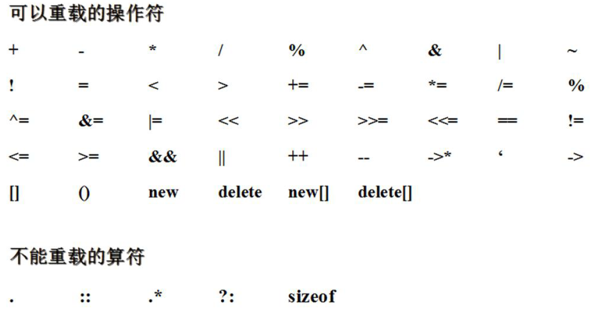

[toc]

# 1 友元

如果类中的私有的或者是受保护的成员需要在类外被频繁的访问，如果通过公有的接口访问，就存在频繁的函数调用的过程，开销较大，如果是类的友元，就可以在类外访问类内的私有或者是受保护的成员。

## 1.1 什么可以作为类的友元

1. 普通函数作为友元

   在这个函数内部可以访问类的私有或受保护的成员

2. 类

   类中的所有成员函数都可以访问这个类的私有或受保护的成员

3. 类的成员函数作为友元

   只有这个类的这个成员函数可以访问另外一个类的私有的或者受保护的成员

   比如：B类的成员函数是A类的友元，B类必须定义在A类之前，B类前声明Ａ类，且Ｂ类中的友元函数必须定义在B类的外部，在A定义之后

成员函数和友元函数都可以实现运算符的重载，唯一的区别是成员函数有this指针，而友元函数没有this指针，所以成员函数在定义时可以少一个形参

## 1.2 友元的语法

### 1.2.1 全局函数成为友元

```c++
#include <iostream>
#include <string.h>
#include <string>
#include <stdlib.h>
using namespace std;

class building
{
	friend void printf_building(building &b);
public:
	building(string hall, string bedroom)
	{
		this->bedroom = bedroom;
		this->hall = hall;
	}
	string hall;
private:
	string bedroom;
};

/* 全局函数作为类的友元函数 */
void printf_building(building &b)
{
	cout << b.hall << " " << b.bedroom << endl;
}


void test01()
{
	building b1("凌霄店", "闺房");
	printf_building(b1);
}

int main()
{
	test01();
	return 0;
}
```

result



### 1.2.2 类成为另一个类的友元,类的成员函数成为另一个类的友元

```c++
#include <iostream>
#include <string>
using namespace std;

class building;
class good_gay
{
public:
	good_gay(string hall, string bedroom);
	void visit();
	building *b;
};

class building
{
	/* 一个类成为另一个类的友元 */
	/* friend class good_gay; */

	/* 类的成员函数成为另一类的友元 */
	friend void good_gay::visit();
public:
	building(string hall, string bedroom)
	{
		this->bedroom = bedroom;
		this->hall = hall;
	}
	string hall;
private:
	string bedroom;
};

good_gay::good_gay(string hall, string bedroom)
{
	b = new building(hall, bedroom);
}

void good_gay::visit()
{
	cout << b->hall << " " << b->bedroom << endl;
}

void test01()
{
	good_gay gd("凌霄店","南天门");
	gd.visit();
}

int main()
{
	test01();
	return 0;
}
```

result


# 2 运算符重载

## 2.1 运算符重载的基本概念

函数重载：功能类型函数名相同，参数类型不同

运算符重载：就是给运算符赋予一个新的意义

运算符只能运算内置的数据类型，对于自定义的数据类型，不能运算，所以需要重载运算符


## 2.2 运算符重载定义

```c++
返回值 operator运算符(参数...)
{
    运算过程
}
```

## 2.3 重载加号运算符

```c++
#include <iostream>
#include <string>
using namespace std;

class person
{
public:
	person(int age)
	{
		this->age = age;
	}
	person operator+(person &p2)
	{
		person p(this->age + p2.age);
		return p;
	}
	int age;
};

#if 0
person operator+(person &p1, person &p2)
{
	person p(p1.age + p2.age);
	return p;
}
#endif

void test01()
{
	person p1(10);
	person p2(20);
	person p3 = p1 + p2;		/* operator+(p1, p2)    p1.operator+(p2) */
	cout << p3.age << endl;
}

int main()
{
	test01();
	return 0;
}
```

result


## 2.4 重载左移运算符和运算符重载碰上友元函数

```c++
#include <iostream>
#include <string>
using namespace std;

class person
{
	friend ostream& operator<<(ostream &cout, person &p);
public:
	person(int age)
	{
		this->age = age;
	}
private:
	int age;
};

ostream& operator<<(ostream &cout, person &p)
{
	cout << p.age;
	return cout;
}

void test01()
{
	person p1(10);
	cout << p1 << endl;
	/* operator<<(cout, p1)  cout.operator<<(p1) */
}

int main()
{
	test01();
	return 0;
}
```

result


## 2.5 可以重载的运算符

几乎C中所有的运算符都可以重载，但运算符重载的使用时相当受限制的。特别是不能使用C中当前没有意义的运算符(例如用**求幂)不能改变运算符优先级，不能改变运算符的参数个数。这样的限制有意义，否则，所有这些行为产生的运算符只会混淆而不是澄清寓语意。



## 2.6 重载自加自减运算符

```c++
++a;	/* 先自加，再使用 */
a++;	/* 先使用，再自加 */
```

- 前置加加返回的是引用
- 后置加加返回的是对象
- 前置加加调用type &operator++()函数
- 后置加加调用的是type operator++(int)函数，也就是后置加加多了一个占位参数

```c++
#include <iostream>
#include <string>
using namespace std;

class my_int
{
public:
	my_int(int num)
	{
		this->num = num;
	}
	my_int& operator++()
	{
		/* 前置加加 */
		this->num = this->num + 1;
		return *this;
	}
	my_int operator++(int)
	{
		/* 后置加加 */
		my_int tmp = *this;
		this->num = this->num + 1;
		return tmp;
	}
	int num;
};

ostream & operator<<(ostream &cout, my_int &p)
{
	cout << p.num;
	return cout;
}


void  test01()
{
	my_int p1(10);
	cout << p1 << endl;
	++p1;			/* operator++(p1)  p1.operator++() */
	cout << ++p1 << endl;
	p1++;
	cout << p1 << endl;		/* p1.operator++(int) */
}


int  main()
{
	test01();
	return 0;
}
```

result


## 2.7 智能指针

我们经常new一个对象，忘记释放，所以我么使用智能指针来维护。只能指针实质是一个局部对象，这个局部对象维护了new出来的对象的地址，在局部对象的析构函数中，会帮忙释放new出来的对象。对于智能指针我们重载了->和*让智能指针和普通指针一样使用

```c++
#include <iostream>
using namespace std;


class person
{
public:
	person(int age)
	{
		this->age = age;
	}
	int  age;
};
class  smart_pointer
{
public:
	smart_pointer(person *p1)
	{
		this->p = p1;
	}
	~smart_pointer()
	{
		delete p;
		cout << "释放了p" << endl;
	}
	person *operator->()
	{
		return p;
	}
	person& operator*()
	{
		return *p;
	}
	person *p;
};
void test01()
{
	/* 局部对象 在释放之前可以帮助释放 p */
	/* person *p = new person(10); */
	smart_pointer sp(new person(10));
	/* cout << p->age << endl; */
	cout << sp->age << endl;	/* sp->   返回的是p  p  sp.operator->() */
	cout << (*sp).age << endl;		/* sp.operator*() */
	/* 忘记释放p指向申请的对象 */
}
int main()
{
	test01();
	return 0;
}
```

result


### 2.7.1 作用

自动内存回收的（堆区空间）

### 2.7.2 三种智能指针

1. shared_ptr 共享型智能指针，可以允许多个智能指针指向一块堆内存，当所有的智能指针内存释放，堆内存才会释放
2. unique_ptr 独享型智能指针，同一个时刻只能有一个独享型智能指针指向一块堆内存
3. week_ptr 弱型智能指针 不能单独存在，必须要和共享型智能指针一块使用，弱型智能指针的增加和消亡不会影响堆内存的释放

​          

## 2.8 运算符重载

```c++
#include <iostream>
using namespace std;
#include <string>


class Demo
{
public:
	//通过初始化列表给成员变量初始化
	Demo(int _a = 0, int _b = 0) :a(_a), b(_b)
	{
		cout << "Demo(int, int)" << endl;
	}

	void show()
	{
		cout << "a = " << a << endl;
		cout << "b = " << b << endl;
	}
	/*
	//成员函数的第一个参数默认是this
	Demo operator+(Demo &demo)  //两个参数：this   demo
	{
		Demo tmp(0,0);
		tmp.a = this->a + demo.a;
		tmp.b = this->b + demo.b;
		return tmp;
	}*/

	/*
	//前置++
	//如果返回值返回的是实参本身，返回值类型就可以是引用
	Demo &operator++()
	{
		++this->a;
		++this->b;
		return *this;
	}*/

	/*
	//后置++
	Demo operator++(int)  //此处只是用来表示是后置++，与前置进行区分
	{
		//tmp保存的是没有自加之前的值
		//返回值需要的也是没有自加之前的值
		Demo tmp(0, 0);
		tmp.a = this->a++;
		tmp.b = this->b++;
		return tmp;
	}*/
private:
	int a;
	int b;

	friend Demo operator+(Demo &demo1, Demo &demo2);
	friend Demo operator++(Demo &demo1);
	friend Demo operator++(Demo &demo1, int);
};


//友元函数进行运算符重载
Demo operator+(Demo &demo1, Demo &demo2)  //两个参数
{
	cout << "友元实现+运算符" << endl;
	Demo tmp(0, 0);
	tmp.a = demo1.a + demo2.a;
	tmp.b = demo1.b + demo2.b;
	return tmp;
}

//前置++   
//如果返回值返回的是实参本身，返回值类型就可以是引用
Demo operator++(Demo &demo1)
{
	++demo1.a;
	++demo1.b;
	return demo1;
}


//后置++
Demo operator++(Demo &demo1, int)  //此处int只是用来表示是后置++，与前置进行区分
{
	//tmp保存的是没有自加之前的值
	//返回值需要的也是没有自加之前的值
	Demo tmp(0, 0);
	tmp.a = demo1.a++;
	tmp.b = demo1.b++;
	return tmp;
}


int main()
{
	Demo demo1(1, 1);
	Demo demo2(2, 2);
	//会调用运算符重载的函数
	//+ === 函数名   demo1 ==== 第一个参数    demo2 === 第二个参数  需要Demo类型的返回值  
	Demo demo3 = demo1 + demo2;  //operator+(&demo1, demo2)

	cout << "&demo1= " << &demo1 << endl;
	cout << "&demo2= " << &demo2 << endl;

	demo1.show();
	demo2.show();
	demo3.show();

	//cout << demo1;

	//string类对“+”运算符进行了重载
	string str1 = "aaa", str2 = "bbb";

	//string类对[]和<<运算符也进行了重载
	string str3 = str1 + str2;
	cout << "str3 = " << str3 << endl;

	cout << str3[0] << endl;


	Demo demo4 = ++demo3;
	demo3.show();
	demo4.show();

	cout << "*********************" << endl;
	Demo demo5 = demo3++;
	demo3.show();
	demo5.show();
	return 0;
}
```

result


# 3 string的封装

MyString.h

```cpp
#define _CRT_SECURE_NO_WARNINGS
#pragma once
#include <iostream>
using namespace std;

class MyString
{
	friend ostream &operator<<(ostream &out, MyString &str);
	friend istream &operator>>(istream &in, MyString &str);

public:
	MyString(const char *);
	MyString(const MyString &);
	~MyString();
	/* []重载 */
	char &operator[](int index);

	/* =号重载 */
	MyString &operator=(const char *str);
	MyString &operator=(const MyString &str);

	/* 字符串拼接 重载+号 */
	MyString operator+(const char *str);
	MyString operator+(const MyString &str);

	/* 字符串比较 */
	bool operator==(const char *str);
	bool operator==(const MyString &str);

private:
	/* 指向堆区空间 */
	char *pString;
	/* 字符串长度 不算'\0' */
	int m_Size;
};
```

MyString.cpp

```cpp
#include "MyString.h"

/* 左移运算符 */
ostream &operator<<(ostream &out, MyString &str)
{
	out << str.pString;
	return out;
}

/* 右移运算符 */
istream &operator>>(istream &in, MyString &str)
{
	/* 先将原有的数据释放 */
	if (str.pString != NULL)
	{
		delete[] str.pString;
		str.pString = NULL;
	}
	char buf[1024]; /* 开辟临时的字符数组，保存用户输入内容 */
	in >> buf;

	str.pString = new char[strlen(buf) + 1];
	strcpy(str.pString, buf);
	str.m_Size = strlen(buf);

	return in;
}

/* 构造函数 */
MyString::MyString(const char *str)
{
	this->pString = new char[strlen(str) + 1];
	strcpy(this->pString, str);
	this->m_Size = strlen(str);
}

/* 拷贝构造 */
MyString::MyString(const MyString &str)
{
	this->pString = new char[strlen(str.pString) + 1];
	strcpy(this->pString, str.pString);
	this->m_Size = str.m_Size;
}

/* 析构函数 */
MyString::~MyString()
{
	if (this->pString != NULL)
	{
		delete[] this->pString;
		this->pString = NULL;
	}
}

char &MyString::operator[](int index)
{
	return this->pString[index];
}

/* 赋值运算符的重载函数 */
MyString &MyString::operator=(const char *str)
{
	if (this->pString != NULL)
	{
		delete[] this->pString;
		this->pString = NULL;
	}
	this->pString = new char[strlen(str) + 1];
	strcpy(this->pString, str);
	this->m_Size = strlen(str);
	return *this;
}

MyString &MyString::operator=(const MyString &str)
{
	if (this->pString != NULL)
	{
		delete[] this->pString;
		this->pString = NULL;
	}
	this->pString = new char[strlen(str.pString) + 1];
	strcpy(this->pString, str.pString);
	this->m_Size = str.m_Size;
	return *this;
}

MyString MyString::operator+(const char *str)
{
	int newsize = this->m_Size + strlen(str) + 1;
	char *temp = new char[newsize];
	memset(temp, 0, newsize);
	strcat(temp, this->pString);
	strcat(temp, str);

	MyString newstring(temp);
	delete[] temp;

	return newstring;
}

MyString MyString::operator+(const MyString &str)
{
	int newsize = this->m_Size + str.m_Size + 1;
	char *temp = new char[newsize];
	memset(temp, 0, newsize);
	strcat(temp, this->pString);
	strcat(temp, str.pString);

	MyString newstring(temp);
	delete[] temp;
	return newstring;
}

bool MyString::operator==(const char *str)
{
	if (strcmp(this->pString, str) == 0 && strlen(str) == this->m_Size)
	{
		return true;
	}

	return false;
}

bool MyString::operator==(const MyString &str)
{
	if (strcmp(this->pString, str.pString) == 0 && str.m_Size == this->m_Size)
	{
		return true;
	}

	return false;
}
```

main.cpp

```cpp
#include "MyString.h"

void test01()
{
	MyString str("hello World");

	cout << str << endl;

	/* cout << "请输入MyString类型字符串：" << endl; */
	/* cin >> str; */

	/* cout << "字符串为： " << str << endl; */

	/* 测试[] */
	cout << "MyString的第一个字符为：" << str[0] << endl;

	/* 测试 = */
	MyString str2 = "^_^";
	MyString str3 = "";
	str3 = "aaaa";
	str3 = str2;
	cout << "str2 = " << str2 << endl;
	cout << "str3 = " << str3 << endl;

	/* 测试 + */
	MyString str4 = "我爱";
	MyString str5 = "北京";
	MyString str6 = str4 + str5;
	MyString str7 = str6 + "天安门";

	cout << str7 << endl;

	/* 测试 == */
	if (str6 == str7)
	{
		cout << "s6 与 s7相等" << endl;
	}
	else
	{
		cout << "s6 与 s7不相等" << endl;
	}
}

int main()
{
	test01();
	return 0;
}
```

result

