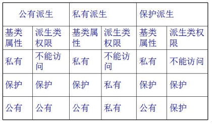
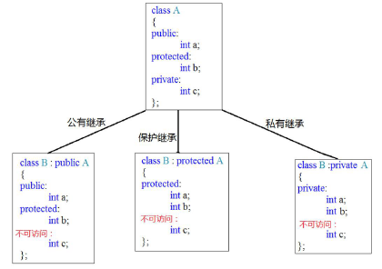
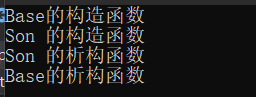
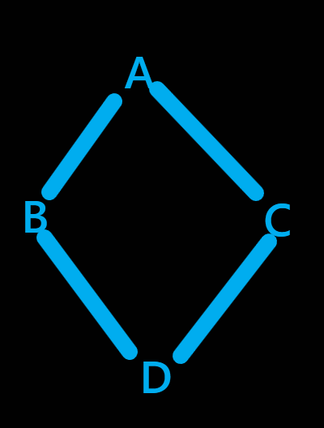

[toc]

# 1 继承

## 1.1 为什么需要继承

一个类继承另一个类，这样类中可以少定义一些成员，减少重复代码的产生以及减少工作量。

## 1.2 继承的概念

c++最重要的特征是代码重用，通过继承机制可以利用已有的数据类型来定义新的数据类型，新的类不仅拥有旧类的成员，还拥有新定义的成员。

一个 B 类继承于 A 类，或称从类 A 派生类 B。这样的话，类 A 成为基类(父类)， 类 B 成为派生类(子类)。派生类中的成员，包含两大部分：

1. 一类是从基类继承过来的，一类是自己增加的成员
2. 从基类继承过来的表现其共性，而新增的成员体现了其个性

## 1.3 派生类的定义方法

```c++
#if 0
class 子类:继承方式 父类名
{
	public:
    protected:
    private:
};
#endif
```

### 1.3.1 三种继承方式

public：公有继承

private：私有继承

protected：保护继承

### 1.3.2 从继承源上分

单继承：指每个派生类只直接继承了一个基类的特征

多继承：指多个基类派生出一个派生类的继承关系，多继承的派生类直接继承了不止一个基类的特征

## 1.4 派生类访问权限控制

派生类继承基类，派生类拥有基类中全部成员变量和成员方法（除了构造和析构之外的成员方法），但是在派生类中，继承的成员并不一定能直接访问，不同的继承方式会导致不同的访问权限。
派生类的访问权限规则如下：





### 1.4.1 总结

1. 只有父类的public成员被子类public继承才能在子类内和子类外都可访问
2. 父类的private成员被子类不管是什么继承都是不可访问
3. 父类的protected成员被子类继承之后只能在子类内部访问

## 1.5 继承中的构造和析构

### 1.5.1 继承中的对象模型

在c++编译器的内部可以理解为结构体，子类是由父类成员叠加子类新成员而成

```c++
class Aclass
{
public:
	int mA;
	int mB;
};
class Bclass : public Aclass
{
public:
	int mC;
};
class Cclass : public Bclass
{
public:
	int mD;
};
void test()
{
	cout << "A size:" << sizeof(Aclass) << endl;
	cout << "B size:" << sizeof(Bclass) << endl;
	cout << "C size:" << sizeof(Cclass) << endl;
}
```

### 1.5.2 对象构造和析构的调用原则

继承中的构造和析构

1. 子类对象在创建时会首先调用父类的构造函数，父类的构造函数执行完毕后，才会调用子类的构造函数
2. 当父类构造函数有参数时，需要在子类初始化列表中显示调用父类构造函数
3. 析构函数调用顺序和构造函数相反

```c++
#include <iostream>
#include <string>
using namespace std;


class base
{
public:
	base(int age, string name)
	{
		this-> age = age;
		this-> name = name;
		cout << "Base的构造函数" << endl;
	}
	~base()
	{
		cout << "Base的析构函数" << endl;
	}
	int age;
	string name;
};
/* 创建子类对象时,必须先构建父类 需要调用父类的构造函数 */
class son : public base
{
public:
	son(int id, int age, string name) : base(age, name)
	{
		this->id = id;
		cout << "Son 的构造函数" << endl;
	}
	~son()
	{
		cout << "Son 的析构函数" << endl;
	}
	int id;
};
void test01()
{
	son p(10, 18, "lucy");
}
int main()
{
	test01();
	return 0;
}
```

result



## 1.6 继承中同名成员的处理问题

当子类成员和父类成员同名时，子类依然从父类继承同名成员
如果子类有成员和父类同名，子类访问其成员默认访问子类的成员(本作用域，就近原则)
在子类通过作用域::进行同名成员区分(在派生类中使用基类的同名成员，显示使用类名限定符)

## 1.7 非自动继承的函数

不是所有的函数都能自动从基类继承到派生类中。构造函数和析构函数用来处理对象的创建和析构操作，构造和析构函数只知道对它们的特定层次的对象做什么，==也就是说构造函数和析构函数不能被继承，必须为每一个特定的派生类分别创建==

另外==**operator=也不能被继承**==，因为它完成类似构造函数的行为。也就是说尽管我们知道如何由=右边的对象如何初始化=左边的对象的所有成员，但是这个并不意味着对其派生类依然有效。

在继承的过程中，如果没有创建这些函数，编译器会自动生成它们。

## 1.8 继承中的静态成员特性

静态成员函数和非静态成员函数的共同点:

1. 他们都可以被继承到派生类中。
2. 如果重新定义一个静态成员函数，所有在基类中的其他重载函数会被隐藏。
3. 如果我们改变基类中一个函数的特征，所有使用该函数名的基类版本都会被隐藏。

```c++
#include <iostream>
#include <string>
using namespace std;
class base
{
public:
	static int get_num()
	{
		return s_num;
	}
	static int get_num(int param)
	{
		return s_num + param;
	}

public:
	static int s_num;
};
int base::s_num = 10;

class derived : public base
{
public:
	static int s_num; /* 基类静态成员属性将被隐藏 */
#if 0
	/* 重定义一个函数，基类中重载的函数被隐藏 */
	static int get_num(int param1, int param2)
	{
		return s_num + param1 + param2;
	}
#else
	/* 改变基类函数的某个特征，返回值或者参数个数，将会隐藏基类重载的函数 */
	static void get_num(int param1, int param2)
	{
		cout << s_num + param1 + param2 << endl;
	}
#endif
};
int derived::s_num = 20;

void test01()
{
	derived p1;
	/* 如果子类和父类有同名的静态成员变量,父类中的静态成员变量会被隐藏 */
	cout << p1.s_num << endl;
	/* 如果子类和父类有同名的静态成员函数,父类中的静态成员函数都会被隐藏 */
	p1.get_num(1, 2);
}

int main()
{
	test01();
	return 0;
}
```

result


## 1.9 多层继承

A派生B B派生C

先构造的后析构，构造时，先调用父类的构造函数，再调用子类的构造函数，析构时，先调用子类的析构函数再调用父类的析构函数

## 1.10 多继承

### 1.10.1 多继承的概念

可以从一个类继承，也可以能同时从多个类继承，这就是多继承。但是由于多继承是非常受争议的，从多个类继承可能会导致函数、变量等同名导致较多的歧义。

### 1.10.2 隐藏

如果子类定义了和父类同名的函数，不管参数是不是一样的，也就是说只要同名，那么在子类中就会将父类的同名函数隐藏，也就是通过子类对象调用这个函数，始终调用到的都是子类自己的，除非加上父类的作用域才会调用父类的,==**出现在父子类中，函数名相同**==

### 1.10.3 重载

函数名相同、参数不同、返回值无关，在同一个作用域内

### 1.10.4 多继承

```c++
#include <iostream>

using namespace std;

class a
{
public:
	int a;
};

class b
{
public:
	int a;
};

class c : public a, public b
{
public:
	int c;
};

void test01()
{

	c p;
	p.a::a = 10;
	p.b::a = 10;
	/* p.b = 20; */
	p.c = 30;
}

int main()
{
	test01();
	return 0;
}
```

### 1.10.5 菱形继承和虚继承

两个派生类继承同一个基类而又有某个类同时继承者两个派生类，这种继承被称为菱形继承，或者钻石型继承。



存在一个问题：B中有一份A，C中也有一份A，D中就有两份A，如果D的对象访问A的成员，就会出现调用不明确的问题，不知道该调用B中A的部分，还是调用C中的A的部分，解决方法：

1. 加作用域 --> 治标不治本
2. 虚继承

```c++
#include <iostream>
using namespace std;

class animal
{
public:
	int age;
};

class sheep : virtual public animal
{
public:
	int id;
};

class camel : virtual public animal
{
public:
	int camel_num;
};

class Shenshou : public sheep, public camel
{
public:
	int a;
};

void test01()
{

	Shenshou p;
	/* p.sheep::age = 100; */
	p.age = 100;
}
int main()
{

	return;
}
```

